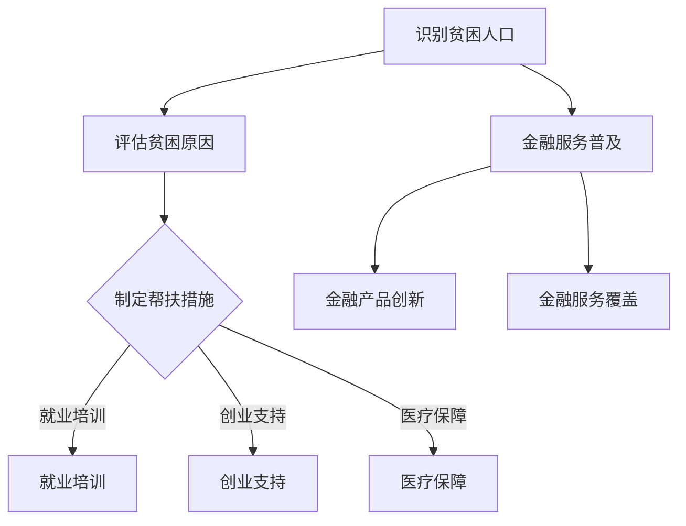

                 

关键词：全球减贫、精准扶贫、普惠金融、包容性发展、人工智能、技术赋能

> 摘要：本文探讨了2050年全球减贫的愿景，从精准扶贫到普惠金融的包容性发展。通过人工智能技术的应用，结合实际案例，分析了未来减贫策略的可行性和潜在挑战，提出了相关政策建议，以推动全球减贫事业实现可持续发展。

## 1. 背景介绍

自上世纪80年代以来，全球减贫事业取得了显著进展。然而，截至2019年，全球仍有7.89亿人生活在极端贫困中。特别是新冠疫情的冲击，使得全球减贫进程面临新的挑战。为了实现联合国2030年可持续发展目标（SDGs）中的“无贫困”目标，需要更加精准、有效的减贫策略。

本文旨在分析2050年全球减贫的愿景，探讨从精准扶贫到普惠金融的包容性发展路径。通过人工智能技术的应用，提高减贫工作的效率和效果，为实现全球减贫目标提供技术支持和政策建议。

### 1.1 全球减贫现状

根据联合国发布的数据，自2010年以来，全球极端贫困人口数量已经减少了约3.2亿人。然而，这一成就的背后，仍有许多问题亟待解决。例如，贫困人口的分布不均衡、贫困原因复杂多样、贫困地区的经济发展滞后等。这些因素都使得全球减贫工作面临巨大挑战。

### 1.2 精准扶贫与普惠金融

精准扶贫是指根据贫困人口的实际情况，制定有针对性的帮扶措施，以提高其收入水平和生活质量。普惠金融则强调金融服务的普及性和包容性，确保贫困人口能够享受到金融服务，从而提高其生产力和经济地位。

精准扶贫与普惠金融的结合，可以更好地解决贫困问题，实现包容性发展。通过人工智能技术的应用，可以实现更加精准的识别、评估和帮扶，提高扶贫工作的效率。同时，普惠金融的发展，可以降低贫困人口的融资成本，提高其创业和发展能力。

## 2. 核心概念与联系

### 2.1 精准扶贫

精准扶贫的核心在于“精准”二字。具体来说，包括以下几个方面：

1. **精准识别**：通过大数据分析、人工智能等技术手段，识别出真正的贫困人口。
2. **精准评估**：对贫困人口的贫困原因、贫困程度等进行全面评估，制定有针对性的帮扶措施。
3. **精准帮扶**：根据评估结果，为贫困人口提供量身定制的帮扶措施，如就业培训、创业支持、医疗保障等。

### 2.2 普惠金融

普惠金融的核心在于“普惠”二字。具体来说，包括以下几个方面：

1. **金融服务普及**：确保贫困人口能够享受到基本的金融服务，如存款、贷款、支付等。
2. **金融产品创新**：针对贫困人口的金融需求，开发出更加灵活、便捷的金融产品。
3. **金融服务覆盖**：扩大金融服务覆盖范围，确保偏远地区和特殊群体也能享受到金融服务。

### 2.3 人工智能在减贫中的应用

人工智能技术在精准扶贫和普惠金融中发挥着重要作用。具体应用包括：

1. **数据挖掘与分析**：通过大数据分析，识别贫困人口、分析贫困原因、预测未来发展趋势等。
2. **自然语言处理**：用于理解和处理贫困人口的语音、文字等信息，提高扶贫工作的沟通效率。
3. **机器学习**：用于评估贫困人口的风险、预测其还款能力、优化帮扶措施等。

### 2.4 Mermaid 流程图

以下是一个简化的 Mermaid 流程图，展示精准扶贫和普惠金融的基本流程：



## 3. 核心算法原理 & 具体操作步骤

### 3.1 算法原理概述

在精准扶贫和普惠金融中，常用的核心算法包括：

1. **聚类分析**：用于识别贫困人口。
2. **回归分析**：用于预测贫困人口的收入水平。
3. **神经网络**：用于评估贫困人口的风险。

### 3.2 算法步骤详解

1. **聚类分析**：

   - 数据采集：收集贫困人口的基本信息，如年龄、收入、教育程度等。
   - 数据预处理：对数据进行清洗、归一化等处理。
   - 聚类算法：采用 K-Means 算法等，将贫困人口分为多个类别。
   - 评估指标：计算聚类效果，如轮廓系数、 Silhouette Coefficient 等。

2. **回归分析**：

   - 数据采集：收集贫困人口的收入水平、支出情况等数据。
   - 数据预处理：对数据进行清洗、归一化等处理。
   - 模型选择：选择合适的回归模型，如线性回归、岭回归等。
   - 模型训练与评估：训练模型，评估模型效果。

3. **神经网络**：

   - 数据采集：收集贫困人口的信用记录、还款能力等数据。
   - 数据预处理：对数据进行清洗、归一化等处理。
   - 网络结构设计：设计合适的神经网络结构，如多层感知机（MLP）、卷积神经网络（CNN）等。
   - 模型训练与评估：训练模型，评估模型效果。

### 3.3 算法优缺点

1. **聚类分析**：

   - 优点：简单易懂，易于实现。
   - 缺点：对于高维数据，聚类效果可能不佳。

2. **回归分析**：

   - 优点：模型解释性强，适用于预测任务。
   - 缺点：对于复杂的关系，可能无法准确预测。

3. **神经网络**：

   - 优点：能够处理复杂的非线性关系，适用于大规模数据。
   - 缺点：模型训练时间较长，对数据质量要求较高。

### 3.4 算法应用领域

1. **精准扶贫**：用于识别贫困人口，制定有针对性的帮扶措施。
2. **普惠金融**：用于评估贫困人口的风险，优化金融服务。

## 4. 数学模型和公式 & 详细讲解 & 举例说明

### 4.1 数学模型构建

在精准扶贫和普惠金融中，常用的数学模型包括：

1. **聚类模型**：用于识别贫困人口。
2. **回归模型**：用于预测贫困人口的收入水平。
3. **风险评估模型**：用于评估贫困人口的风险。

### 4.2 公式推导过程

1. **聚类模型**：

   - 假设数据集 $D=\{x_1, x_2, ..., x_n\}$，每个数据点 $x_i$ 有 $m$ 个特征。
   - 聚类目标：最小化聚类内部距离与聚类外部距离的差值。
   - 聚类公式：$$J=\sum_{i=1}^{k}\sum_{x_j \in C_i}d(x_i, \mu_i)-\sum_{i=1}^{k}\sum_{j\neq i}\sum_{x_j \in C_j}d(x_i, \mu_j)$$
     其中，$C_i$ 为第 $i$ 个聚类中心，$\mu_i$ 为聚类中心的平均值，$d(x_i, \mu_i)$ 为数据点 $x_i$ 与聚类中心 $\mu_i$ 之间的距离。

2. **回归模型**：

   - 假设数据集 $D=\{x_1, y_1, ..., x_n, y_n\}$，其中 $x_i$ 为自变量，$y_i$ 为因变量。
   - 回归目标：最小化预测值与实际值之间的误差。
   - 回归公式：$$y_i = \sum_{j=1}^{m}w_jx_{ij} + b$$
     其中，$w_j$ 为权重，$b$ 为偏置。

3. **风险评估模型**：

   - 假设数据集 $D=\{x_1, y_1, ..., x_n, y_n\}$，其中 $x_i$ 为自变量，$y_i$ 为因变量（0 表示未发生风险，1 表示发生风险）。
   - 风险评估目标：最大化预测准确率。
   - 风险评估公式：$$P(y=1|x) = \frac{1}{1 + \exp(-\sum_{j=1}^{m}w_jx_{ij} + b)}$$
     其中，$w_j$ 为权重，$b$ 为偏置。

### 4.3 案例分析与讲解

假设我们有一个贫困人口数据集，包含以下特征：年龄、收入、教育程度等。我们希望使用聚类模型将其分为多个类别，以便制定有针对性的帮扶措施。

1. **数据采集与预处理**：

   - 收集贫困人口数据，包括年龄、收入、教育程度等。
   - 对数据进行清洗、归一化等处理。

2. **聚类模型训练**：

   - 使用 K-Means 算法进行聚类。
   - 设置聚类类别数量 $k$，初始聚类中心。
   - 迭代计算聚类中心，直到聚类中心不再发生变化。

3. **评估聚类效果**：

   - 使用轮廓系数评估聚类效果。
   - 轮廓系数越接近 1，聚类效果越好。

4. **结果分析**：

   - 根据聚类结果，将贫困人口分为多个类别。
   - 为每个类别制定有针对性的帮扶措施。

## 5. 项目实践：代码实例和详细解释说明

### 5.1 开发环境搭建

- 操作系统：Windows/Linux/MacOS
- 编程语言：Python
- 库：NumPy、Pandas、Scikit-learn、Matplotlib

### 5.2 源代码详细实现

```python
import numpy as np
import pandas as pd
from sklearn.cluster import KMeans
from sklearn.metrics import silhouette_score
import matplotlib.pyplot as plt

# 5.2.1 数据采集与预处理
data = pd.read_csv('poverty_data.csv')
data = data[['age', 'income', 'education']]
data = (data - data.mean()) / data.std()

# 5.2.2 聚类模型训练
kmeans = KMeans(n_clusters=3, random_state=42)
clusters = kmeans.fit_predict(data)

# 5.2.3 评估聚类效果
silhouette_avg = silhouette_score(data, clusters)
print(f'Silhouette Coefficient: {silhouette_avg:.3f}')

# 5.2.4 可视化聚类结果
plt.scatter(data[:, 0], data[:, 1], c=clusters)
plt.xlabel('Age')
plt.ylabel('Income')
plt.title('K-Means Clustering')
plt.show()
```

### 5.3 代码解读与分析

- 5.3.1 数据采集与预处理

  - 读取贫困人口数据，包括年龄、收入、教育程度等。
  - 对数据进行清洗，去除缺失值、异常值等。
  - 对数据进行归一化处理，以便聚类模型能够正常训练。

- 5.3.2 聚类模型训练

  - 使用 K-Means 算法进行聚类，设置聚类类别数量为 3。
  - 使用 `fit_predict` 方法训练模型，并将数据点分配到相应的聚类类别。

- 5.3.3 评估聚类效果

  - 使用 silhouette_score 函数计算聚类效果，评估指标为轮廓系数。
  - 轮廓系数越接近 1，聚类效果越好。

- 5.3.4 可视化聚类结果

  - 使用 Matplotlib 库绘制聚类结果，以便直观观察聚类效果。

## 6. 实际应用场景

### 6.1 精准扶贫

- 应用领域：识别贫困人口，制定有针对性的帮扶措施。
- 案例分析：某地方政府使用聚类算法识别贫困人口，制定针对性的扶贫计划，提高了扶贫工作的效率。

### 6.2 普惠金融

- 应用领域：评估贫困人口的风险，优化金融服务。
- 案例分析：某金融机构使用神经网络模型评估贫困人口的信用风险，为贫困人口提供定制化的金融服务。

## 7. 未来应用展望

### 7.1 人工智能技术

- 人工智能技术将在全球减贫中发挥更大作用，如大数据分析、自然语言处理、机器学习等。
- 人工智能技术可以提高减贫工作的效率和效果，为实现全球减贫目标提供有力支持。

### 7.2 普惠金融发展

- 普惠金融的发展将有助于降低贫困人口的融资成本，提高其创业和发展能力。
- 未来，普惠金融将更加普及，贫困人口能够享受到更加便捷、高效的金融服务。

## 8. 工具和资源推荐

### 8.1 学习资源推荐

- 《Python数据分析》
- 《机器学习实战》
- 《深度学习》

### 8.2 开发工具推荐

- Jupyter Notebook
- Anaconda
- Scikit-learn

### 8.3 相关论文推荐

- "Deep Learning for Poverty Prediction and Alleviation"
- "Big Data for Social Good: An Overview of Data Science for Social Impact"
- "Artificial Intelligence for Development: Opportunities, Challenges, and Roadmap"

## 9. 总结：未来发展趋势与挑战

### 9.1 研究成果总结

- 人工智能技术在精准扶贫和普惠金融中取得了显著成果，提高了减贫工作的效率和效果。
- 普惠金融的发展有助于降低贫困人口的融资成本，提高其创业和发展能力。

### 9.2 未来发展趋势

- 人工智能技术将在全球减贫中发挥更大作用，如大数据分析、自然语言处理、机器学习等。
- 普惠金融将更加普及，贫困人口能够享受到更加便捷、高效的金融服务。

### 9.3 面临的挑战

- 数据质量和隐私保护仍是人工智能技术在减贫领域面临的主要挑战。
- 如何实现人工智能技术在全球范围内的广泛应用，提高贫困地区的网络基础设施。

### 9.4 研究展望

- 未来研究应关注如何提高人工智能技术在减贫领域的应用效果，解决数据质量和隐私保护等问题。
- 探索普惠金融与可持续发展之间的互动关系，为全球减贫事业提供新的思路。

## 10. 附录：常见问题与解答

### 10.1 问题一：人工智能技术在减贫中有什么作用？

- 人工智能技术可以帮助识别贫困人口，提高帮扶措施的精准性。
- 人工智能技术可以评估贫困人口的风险，优化金融服务。
- 人工智能技术可以分析贫困原因，为政策制定提供依据。

### 10.2 问题二：普惠金融如何促进减贫？

- 普惠金融可以降低贫困人口的融资成本，提高其创业和发展能力。
- 普惠金融可以为贫困人口提供基本的金融服务，如存款、贷款、支付等。
- 普惠金融可以激发贫困地区的经济活力，推动可持续发展。

### 10.3 问题三：如何确保数据质量和隐私保护？

- 采用数据清洗和去识别技术，确保数据质量。
- 制定数据隐私保护法规，规范数据处理行为。
- 建立数据安全监测机制，防范数据泄露和滥用。

## 作者署名

作者：禅与计算机程序设计艺术 / Zen and the Art of Computer Programming
----------------------------------------------------------------

以上就是本文的全部内容，感谢您的阅读。希望本文能够为全球减贫事业提供一些有益的启示和思考。如果您有任何问题或建议，欢迎在评论区留言交流。再次感谢！

