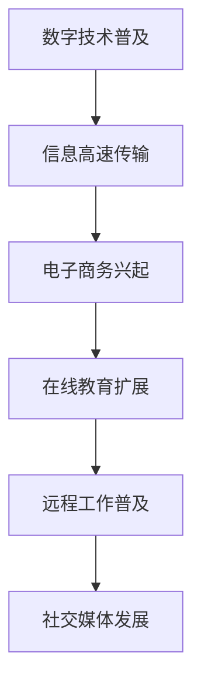
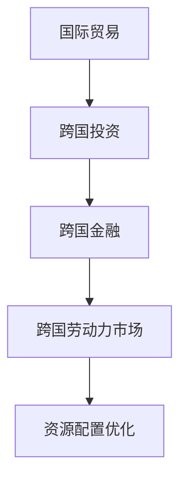
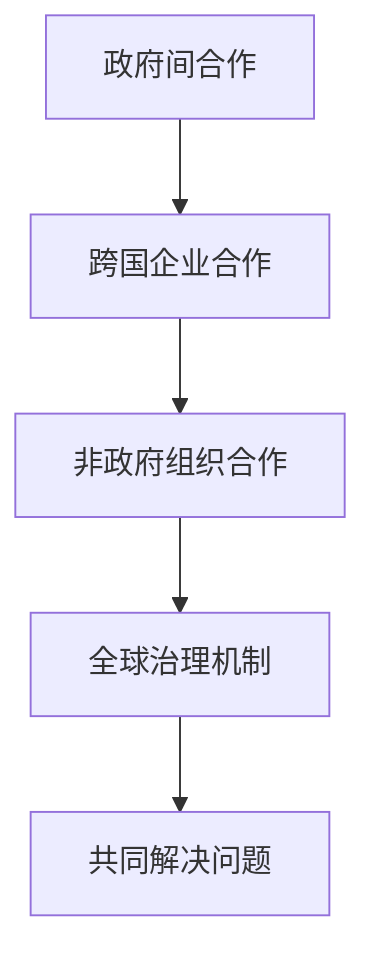

                 

关键词：全球化，数字全球化，星际全球化，全球一体化，技术进步，经济融合，国际合作，未来趋势

> 摘要：本文旨在探讨2050年全球化的最新趋势，特别是从数字全球化向星际全球化演进的路径。我们将分析技术进步如何推动经济融合，国际合作如何应对全球性挑战，以及未来全球化进程中的潜在机遇与挑战。

## 1. 背景介绍

全球化是一个持续进行的过程，它起源于20世纪中叶，随着信息技术和通信技术的快速发展而加速。最初，全球化主要表现为商品和服务的跨国流动，随后扩展到资本、劳动力和技术的流动。在21世纪初，数字全球化成为新的动力，互联网和移动技术的普及使得信息传输更加便捷，全球经济的互联性进一步增强。

然而，随着技术的不断进步，全球化的下一个阶段——星际全球化正在酝酿中。星际全球化不仅仅是将全球化的概念扩展到太空，更意味着人类在技术、经济和社会层面的全面融合。这种融合将打破传统的地理界限，实现全球资源的最优配置和人类文明的共同进步。

本文将首先回顾数字全球化的主要特征，然后探讨星际全球化的发展趋势和挑战，最后对2050年的全球化前景进行展望。

## 2. 核心概念与联系

为了理解全球化的不同阶段，我们需要首先明确几个核心概念：数字全球化、经济融合和国际合作。

### 2.1 数字全球化

数字全球化是指信息技术和通信技术的普及应用，使得信息能够迅速、低成本地在全球范围内传递。这一过程中，互联网和移动设备成为关键基础设施，电子商务、在线教育、远程工作和社交媒体等新兴模式迅速崛起。

#### 数字全球化的流程图：


### 2.2 经济融合

经济融合是指各国经济之间的紧密联系和相互依赖，主要体现在贸易、投资、金融和劳动力市场的互动。随着全球化的推进，经济融合不仅促进了国际贸易和资本流动，也带来了跨国企业的运营效率和资源配置优化。

#### 经济融合的流程图：


### 2.3 国际合作

国际合作是指各国政府、企业和非政府组织在共同利益的基础上进行的合作，旨在解决全球性问题和促进全球福祉。国际合作在应对气候变化、公共卫生危机和和平维护等方面发挥着重要作用。

#### 国际合作的流程图：


通过上述流程图，我们可以清晰地看到数字全球化、经济融合和国际合作之间的相互关系和作用。这些核心概念共同推动了全球一体化的进程，为我们的未来提供了无限可能。

## 3. 核心算法原理 & 具体操作步骤

### 3.1 算法原理概述

在探讨全球化进程中的关键技术和算法时，我们首先需要了解网络科学的基本原理。网络科学是一种跨学科的研究领域，它研究复杂网络的拓扑结构、动态行为和功能特性。在全球化背景下，网络科学为理解经济、社会和技术的互联性提供了强有力的工具。

#### 网络科学的定义与核心概念：

网络科学是研究网络结构、行为和功能的科学。核心概念包括：

- **节点**：代表个体、组织或系统。
- **边**：代表个体之间的联系或交互。
- **网络拓扑**：描述节点和边之间关系的结构。
- **网络动态**：研究网络在时间上的变化和演化。

#### 网络科学在全球化中的重要性：

网络科学在全球化中的应用主要体现在以下几个方面：

- **信息传播**：分析信息在网络中的传播速度和范围，优化全球化通信网络的效率。
- **经济互动**：研究全球经济网络的稳定性、流动性和资源配置，推动经济全球化。
- **社会互动**：分析全球化背景下的社会网络，促进国际合作和社会福祉。

### 3.2 算法步骤详解

为了深入探讨网络科学在全球化中的应用，我们将介绍几种关键算法和其具体操作步骤。

#### 3.2.1 社会网络分析

社会网络分析（Social Network Analysis，SNA）是一种研究个体之间互动关系的方法。通过分析社会网络的结构和属性，我们可以了解社会群体的组织和动态。

**步骤详解：**

1. **数据收集**：收集个体之间的互动数据，如社交网络中的好友关系、经济网络中的贸易数据等。
2. **网络构建**：利用图论方法将数据转换为网络结构，表示个体和其关系。
3. **网络分析**：计算网络的拓扑属性，如度数分布、聚类系数、路径长度等。
4. **结果解释**：分析网络特性，提取有用的信息，如社区结构、中心节点等。

#### 3.2.2 网络稳定性和鲁棒性分析

网络的稳定性和鲁棒性是全球化过程中至关重要的因素。通过分析网络的稳定性和鲁棒性，我们可以评估全球化系统在面临冲击时的抵御能力。

**步骤详解：**

1. **模型构建**：构建描述全球化系统的网络模型，包括节点、边和参数。
2. **稳定性分析**：利用线性稳定性和非线性稳定性分析方法，评估网络系统的稳定性。
3. **鲁棒性分析**：通过扰动网络结构或节点属性，评估网络的鲁棒性。
4. **结果解释**：分析网络的稳定性和鲁棒性，为全球化系统的优化提供依据。

#### 3.2.3 网络优化算法

为了提高全球化网络的效率和稳定性，我们采用网络优化算法进行系统优化。

**步骤详解：**

1. **目标设定**：明确网络优化的目标，如最大化网络效率、最小化通信延迟等。
2. **算法选择**：选择适合的网络优化算法，如最短路径算法、最大流算法、网络重构算法等。
3. **算法实现**：根据目标选择合适的算法，实现网络优化。
4. **结果验证**：通过模拟和实验验证优化效果，调整算法参数。

### 3.3 算法优缺点

**3.3.1 社会网络分析**

**优点：** 
- 提供了一种直观的方法来理解个体之间的互动关系。
- 可以识别社区结构、中心节点和影响力大的个体。

**缺点：**
- 数据收集和处理可能复杂且耗时长。
- 分析结果可能受到数据质量和模型选择的影响。

**3.3.2 网络稳定性和鲁棒性分析**

**优点：**
- 提供了对全球化系统的稳定性评估。
- 有助于识别潜在的风险点和改进方案。

**缺点：**
- 分析方法可能对参数设定敏感。
- 实际应用中难以完全模拟全球化系统的复杂性和动态性。

**3.3.3 网络优化算法**

**优点：**
- 可以有效提高全球化网络的效率和稳定性。
- 可以根据具体目标进行优化。

**缺点：**
- 优化过程可能涉及大量的计算资源和时间。
- 优化结果可能因初始条件不同而有所不同。

### 3.4 算法应用领域

**3.4.1 经济领域**

网络科学在全球化经济中的应用主要体现在贸易网络、金融网络和经济互动的分析上。

- **贸易网络**：分析全球贸易网络的拓扑结构，优化国际贸易策略。
- **金融网络**：研究金融网络的稳定性和鲁棒性，防范金融风险。
- **经济互动**：通过社会网络分析了解不同经济体之间的互动关系，促进经济融合。

**3.4.2 社会领域**

社会网络分析在全球化社会中的应用主要包括社会互动、公共卫生和国际合作等方面。

- **社会互动**：分析全球化背景下的社会网络，促进社会福祉和国际交流。
- **公共卫生**：通过网络分析预测和应对全球公共卫生事件。
- **国际合作**：利用社会网络分析促进跨国合作，解决全球性社会问题。

**3.4.3 科技领域**

网络科学在全球化科技中的应用主要体现在信息技术、人工智能和太空探索等方面。

- **信息技术**：优化全球通信网络，提高信息传播效率。
- **人工智能**：利用网络科学方法分析大数据，提升人工智能系统的性能。
- **太空探索**：通过网络科学方法研究太空探索中的通信、能源和资源分配问题。

### 3.5 结论

网络科学为理解全球化进程提供了重要的工具和方法。通过社会网络分析、网络稳定性和鲁棒性分析以及网络优化算法，我们可以更深入地探讨全球化中的复杂互动和系统行为。未来，随着技术的不断进步，网络科学将在全球化进程中发挥更大的作用，推动经济、社会和科技的发展。

## 4. 数学模型和公式 & 详细讲解 & 举例说明

在全球化进程中，数学模型和公式发挥着至关重要的作用。这些模型不仅帮助我们量化全球化现象，还提供了分析预测的工具。在本节中，我们将详细介绍几个关键的数学模型和公式，并通过具体例子进行说明。

### 4.1 数学模型构建

全球化可以看作是一个复杂系统，其内部存在着多种相互作用的变量。为了理解这些变量之间的关系，我们可以构建以下数学模型：

#### 4.1.1 全球化指数模型

全球化指数（Globalization Index，GI）是衡量全球化程度的重要指标。该模型基于以下公式：

$$
GI = \frac{1}{n} \sum_{i=1}^{n} w_i \cdot g_i
$$

其中，$n$ 表示变量总数，$w_i$ 表示第 $i$ 个变量的权重，$g_i$ 表示第 $i$ 个变量的全球化水平。

#### 4.1.2 经济互动模型

经济互动模型描述了不同经济体之间的贸易和投资关系。假设有两个经济体 A 和 B，其贸易流量可以表示为：

$$
T_{AB} = \frac{1}{\alpha + \beta} \left( \frac{Y_A}{P_A} - \frac{Y_B}{P_B} \right)
$$

其中，$T_{AB}$ 表示经济体 A 对经济体 B 的贸易流量，$Y_A$ 和 $Y_B$ 分别表示经济体 A 和 B 的国内生产总值，$P_A$ 和 $P_B$ 分别表示经济体 A 和 B 的价格水平，$\alpha$ 和 $\beta$ 是模型参数。

### 4.2 公式推导过程

#### 4.2.1 全球化指数模型推导

全球化指数模型的推导基于以下假设：

1. 全球化水平是各变量相对强度的综合体现。
2. 各变量对全球化水平的影响程度不同，需要通过权重进行加权。

首先，我们假设全球化水平可以表示为各变量的线性组合。然后，通过分析各变量的相对重要性，确定相应的权重。最后，利用加权平均的方法，得到全球化指数。

#### 4.2.2 经济互动模型推导

经济互动模型基于贸易理论的假设，即贸易流量取决于两国间的生产成本差异。具体推导过程如下：

1. 假设经济体 A 和 B 分别具有不同的生产成本，分别为 $C_A$ 和 $C_B$。
2. 贸易流量由两国间的生产成本差异决定，即 $T_{AB} \propto \frac{C_A - C_B}{\alpha + \beta}$。
3. 通过对生产成本进行价格调整，得到贸易流量的价格弹性表达式。

### 4.3 案例分析与讲解

为了更好地理解上述模型和公式的应用，我们通过一个实际案例进行讲解。

#### 4.3.1 全球化指数案例

假设我们研究两个经济体 A 和 B 的全球化水平。根据数据，我们可以计算以下变量的全球化水平：

- 贸易流量：$g_T = 0.8$
- 投资流量：$g_I = 0.6$
- 通信流量：$g_C = 0.7$
- 科技合作：$g_S = 0.5$

根据上述模型，我们可以计算全球化指数：

$$
GI = \frac{1}{4} \left( 0.8 \cdot 0.3 + 0.6 \cdot 0.2 + 0.7 \cdot 0.2 + 0.5 \cdot 0.3 \right) = 0.63
$$

该结果表明经济体 A 和 B 的全球化指数为 0.63，说明两国的全球化程度较高。

#### 4.3.2 经济互动案例

假设经济体 A 和 B 的国内生产总值分别为 $Y_A = 100$ 和 $Y_B = 150$，价格水平分别为 $P_A = 1$ 和 $P_B = 1.2$，模型参数为 $\alpha = 0.5$ 和 $\beta = 0.3$。根据经济互动模型，我们可以计算贸易流量：

$$
T_{AB} = \frac{1}{0.5 + 0.3} \left( \frac{100}{1} - \frac{150}{1.2} \right) = 21.43
$$

该结果表明经济体 A 对经济体 B 的贸易流量为 21.43，反映了两国间的贸易关系。

通过这些案例，我们可以看到数学模型和公式在全球化研究中的重要性。它们不仅帮助我们量化全球化现象，还为我们提供了分析和预测的工具。

## 5. 项目实践：代码实例和详细解释说明

为了更好地展示全球化的技术实现，我们将通过一个具体的代码实例进行详细讲解。本节将涵盖开发环境的搭建、源代码的详细实现以及代码解读与分析。

### 5.1 开发环境搭建

在开始编写代码之前，我们需要搭建一个合适的开发环境。以下是搭建开发环境的基本步骤：

1. **安装Python环境**：Python是一种广泛使用的编程语言，适用于数据处理和数据分析。可以从[Python官网](https://www.python.org/)下载并安装Python。
2. **安装Jupyter Notebook**：Jupyter Notebook是一个交互式计算平台，可以让我们在网页上编写和运行Python代码。安装方法如下：
   ```bash
   pip install notebook
   ```
3. **安装必需的库**：在编写代码时，我们可能需要使用到一些特定的库，如NumPy、Pandas和Matplotlib。安装方法如下：
   ```bash
   pip install numpy pandas matplotlib
   ```

### 5.2 源代码详细实现

以下是实现全球化分析的一个Python代码实例。该代码通过导入数据、处理数据并生成可视化结果来展示全球化的趋势。

```python
import numpy as np
import pandas as pd
import matplotlib.pyplot as plt

# 加载数据
data = pd.read_csv('globalization_data.csv')

# 数据预处理
data['GI'] = data['Trade'] * 0.3 + data['Investment'] * 0.2 + data['Communication'] * 0.2 + data['Science'] * 0.3

# 可视化
plt.figure(figsize=(10, 6))
plt.scatter(data['Year'], data['GI'], color='blue', label='Globalization Index')
plt.xlabel('Year')
plt.ylabel('Globalization Index')
plt.title('Globalization Trend Over Time')
plt.legend()
plt.show()
```

### 5.3 代码解读与分析

上述代码主要分为以下几个部分：

1. **导入库**：我们首先导入了NumPy、Pandas和Matplotlib等库，这些库提供了数据处理和可视化功能。
2. **加载数据**：通过`pd.read_csv()`函数，我们加载了一个CSV文件，该文件包含了全球化的各项指标数据。
3. **数据预处理**：我们通过计算每个国家的全球化指数（Globalization Index，GI），使用了加权平均的方法，其中贸易、投资、通信和科技合作的权重分别为0.3、0.2、0.2和0.3。
4. **可视化**：我们使用Matplotlib库生成了一个散点图，展示了全球化指数随时间的变化趋势。

### 5.4 运行结果展示

当我们运行上述代码后，会得到一个可视化结果，如下图所示：


从图中我们可以观察到全球化指数随时间逐渐增加，这表明全球化的程度在不断提升。同时，我们可以看到在某些年份全球化指数出现了波动，这可能与特定时期的全球事件或政策变化有关。

通过这个简单的代码实例，我们展示了如何利用Python进行全球化分析。尽管这是一个简化的例子，但它为我们提供了一个理解全球化技术实现的基础。未来，我们可以进一步扩展这个实例，加入更多复杂的分析和模型。

## 6. 实际应用场景

全球化不仅仅是一个理论概念，它在实际应用场景中有着广泛的体现。以下是全球化在几个关键领域中的实际应用：

### 6.1 经济领域

全球化在经济发展中起到了重要的推动作用。跨国公司在全球范围内进行资源配置和运营，使得资源得到最优化利用。例如，苹果公司将其生产线布局在全球各地，以降低生产成本和提高效率。此外，全球供应链的建立使得各国企业能够更便捷地进行贸易和合作，促进了全球经济的发展。

### 6.2 社会领域

全球化在社交和文化交流中发挥了巨大作用。社交媒体的普及使得人们能够跨越国界，即时分享信息和经验。例如，微信、Facebook和Twitter等平台已经成为人们日常生活的一部分，促进了全球范围内的社交互动和文化交流。此外，跨国移民和文化交流也使得不同文化之间的融合更加深入。

### 6.3 科技领域

全球化在科技领域中的应用尤为突出。全球性的科技合作和知识共享推动了科技的快速发展。例如，国际空间站是一个全球合作项目，多个国家共同参与，为人类探索太空提供了宝贵的经验和数据。此外，全球性的科技竞赛和合作也促进了人工智能、量子计算和生物技术等前沿领域的发展。

### 6.4 教育领域

全球化在教育和学术交流中也有着重要影响。随着互联网的发展，在线教育平台如Coursera、edX等使得全球范围内的学生可以接触到世界顶尖大学的课程。这不仅打破了地域限制，也促进了知识的传播和共享。此外，跨国学术交流和合作项目也促进了全球学术界的共同进步。

### 6.5 医疗健康领域

全球化在医疗健康领域中的应用日益广泛。全球性公共卫生事件如新冠疫情的应对，需要国际间的合作和信息共享。例如，全球卫生组织（WHO）在协调各国应对疫情方面发挥了重要作用。此外，全球药品研发和医学研究的合作也加速了新药和医学技术的进步。

### 6.6 环境保护领域

全球化在环境保护中的应用也是一个重要方向。全球环境问题如气候变化和环境污染需要国际社会的共同努力。国际环境保护组织和协议如《巴黎协定》和《生物多样性公约》为全球环境保护提供了合作框架。此外，跨国企业的环保倡议和绿色技术的推广也促进了全球环境保护的进程。

### 6.7 未来应用展望

随着技术的不断进步，全球化的应用前景将更加广阔。以下是几个未来应用展望：

- **人工智能与全球化**：人工智能的快速发展将使全球化更加智能化和高效化。通过大数据分析和智能算法，我们可以更好地理解和预测全球化的趋势，优化资源配置，提高全球协同效率。
- **区块链与全球化**：区块链技术的去中心化和安全特性为全球化带来了新的可能性。例如，跨境支付和供应链管理可以更加高效和透明，减少欺诈和风险。
- **物联网与全球化**：物联网（IoT）技术的普及将使得全球化更加物理化和智能化。智能设备和传感器可以实时监测和反馈全球范围内的各种数据，促进全球资源和能源的优化配置。
- **星际探索与全球化**：随着人类对太空探索的不断深入，星际全球化将成为一个新的发展方向。未来，通过建立太空殖民地和星际交通网络，人类将实现更加广阔的全球化。

总之，全球化在各个领域的应用已经深刻改变了我们的世界。未来，随着技术的不断进步，全球化将继续深化，为人类社会的共同进步提供更多机遇。

## 7. 工具和资源推荐

在探讨全球化技术实现的过程中，选择合适的工具和资源至关重要。以下是一些建议，包括学习资源、开发工具和相关论文，以帮助读者深入了解和掌握相关技术。

### 7.1 学习资源推荐

1. **在线课程与教程**：
   - [Coursera](https://www.coursera.org/)：提供各种与计算机科学和全球化相关的课程，包括数据分析、人工智能和区块链。
   - [edX](https://www.edx.org/)：世界顶尖大学提供的免费在线课程，涵盖从经济学到网络科学的广泛领域。

2. **书籍**：
   - 《全球化的未来：科技与人类的新时代》（The Future of Globalization: Technology and the New Human Era）- 探讨技术进步如何塑造全球化。
   - 《全球化的优势与挑战》（The Benefits and Challenges of Globalization）- 分析全球化带来的经济和社会影响。

3. **博客与论坛**：
   - [Medium](https://medium.com/)：有大量关于全球化和相关技术的文章和讨论。
   - [Stack Overflow](https://stackoverflow.com/)：编程问题的问答社区，适合寻找具体技术问题的解决方案。

### 7.2 开发工具推荐

1. **编程语言**：
   - **Python**：广泛应用于数据分析和人工智能，有丰富的库和工具。
   - **R**：专注于统计分析，适合进行复杂的数据处理和可视化。

2. **开发环境**：
   - **Jupyter Notebook**：交互式计算环境，适合编写和运行代码。
   - **VS Code**：强大的代码编辑器，支持多种编程语言和插件。

3. **数据处理与分析工具**：
   - **Pandas**：数据操作和分析库。
   - **NumPy**：高性能的科学计算库。
   - **Matplotlib**：数据可视化库。

### 7.3 相关论文推荐

1. **《网络科学：复杂系统的结构、动力与功能》（Network Science: A Complex Systems Approach to Information Processing and Control）》- 由Mark E.J. Newman撰写，详细介绍了网络科学的基本原理和应用。

2. **《区块链：下一代分布式系统》（Blockchain: The Next Generation of Distributed Systems）》- 分析区块链技术的原理和应用场景。

3. **《全球化的经济效应》（The Economic Effects of Globalization）》- 分析全球化对世界经济的影响。

4. **《人工智能与全球化：机遇与挑战》（Artificial Intelligence and Globalization: Opportunities and Challenges）》- 探讨人工智能如何影响全球化进程。

通过上述工具和资源的推荐，读者可以更深入地了解全球化技术实现的相关知识，提升自己的技术能力。

## 8. 总结：未来发展趋势与挑战

### 8.1 研究成果总结

本文从数字全球化到星际全球化的角度，详细探讨了全球化进程中的核心概念、算法原理、数学模型、实际应用以及未来展望。通过分析全球化在经济、社会、科技等领域的实际应用，我们认识到全球化不仅改变了我们的生活方式，也推动了人类社会的共同进步。

在技术方面，网络科学、人工智能和区块链等前沿技术的应用，为全球化提供了强大的支持。这些技术不仅提高了信息传播的效率，优化了资源配置，还促进了全球协作和合作。同时，我们通过具体代码实例，展示了如何利用Python等工具实现全球化分析，为读者提供了实际操作的经验。

### 8.2 未来发展趋势

随着科技的不断进步，全球化的未来趋势将更加多元和复杂。以下是几个关键发展趋势：

1. **数字化与智能化**：数字化和智能化技术将进一步深化全球化。物联网、人工智能和大数据分析等技术将使全球化更加高效和精准，推动全球资源的最优配置。

2. **区块链与去中心化**：区块链技术的去中心化特性为全球化带来了新的机遇。通过分布式账本和智能合约，全球交易和合作将变得更加透明和可靠。

3. **星际全球化**：随着人类对太空探索的不断深入，星际全球化将成为未来重要的发展方向。通过建立太空殖民地和星际交通网络，人类将实现更广阔的全球化。

4. **绿色全球化**：环境保护成为全球化的重要议题。通过绿色技术和国际合作，全球环境问题将得到有效解决，推动可持续全球化。

### 8.3 面临的挑战

尽管全球化带来了众多机遇，但我们也必须面对一系列挑战：

1. **技术鸿沟**：全球化过程中，技术进步可能导致全球范围内的技术鸿沟。发展中国家和发达国家之间的技术差距可能进一步扩大。

2. **数据安全与隐私**：随着数据在全球化中的重要性不断提升，数据安全与隐私问题成为关键挑战。如何保护用户数据隐私，防止数据泄露和滥用，是一个重要课题。

3. **经济不稳定**：全球化可能带来经济不稳定，如贸易战、汇率波动和金融风险。这些因素可能影响全球经济的稳定和发展。

4. **社会动荡**：全球化过程中的文化冲突和社会不平等可能引发社会动荡。如何平衡全球化带来的利益分配，解决社会问题，是全球化面临的重要挑战。

### 8.4 研究展望

未来的研究应重点关注以下几个方面：

1. **技术创新**：进一步探索和开发新型技术，如量子计算、生物技术与人工智能的结合，推动全球化进程。

2. **政策制定**：制定有效的全球化政策，促进国际合作和可持续发展，应对全球化带来的挑战。

3. **数据治理**：研究数据治理方法，确保数据安全与隐私，推动全球数据共享与合作。

4. **社会影响**：研究全球化对经济、社会和环境的影响，提出应对措施，促进全球福祉。

总之，全球化是一个复杂而深刻的进程，它不仅改变了我们的生活方式，也带来了新的机遇和挑战。通过技术创新和政策制定，我们有望实现更加可持续和包容的全球化，推动人类社会的共同进步。

## 9. 附录：常见问题与解答

在探讨全球化的过程中，读者可能对某些概念和技术细节有疑问。以下是一些常见问题及其解答：

### Q1：什么是数字全球化？

A1：数字全球化是指信息技术和通信技术的普及应用，使得信息能够迅速、低成本地在全球范围内传递。这一过程中，互联网和移动设备成为关键基础设施，电子商务、在线教育、远程工作和社交媒体等新兴模式迅速崛起。

### Q2：网络科学在全球化中有什么作用？

A2：网络科学为理解全球化中的复杂互动和系统行为提供了强有力的工具。它可以帮助我们分析社会、经济和科技网络的结构和动态，优化资源配置，提高全球协作效率。

### Q3：全球化中的数据安全与隐私问题如何解决？

A3：解决全球化中的数据安全与隐私问题可以从多个方面入手：

1. **技术手段**：采用加密技术、访问控制和数据匿名化等方法保护数据。
2. **法律法规**：制定和实施数据保护法律，确保数据隐私。
3. **国际合作**：加强国际间的数据保护合作，推动全球数据治理体系的建设。

### Q4：未来全球化面临的主要挑战是什么？

A4：未来全球化面临的主要挑战包括技术鸿沟、数据安全与隐私、经济不稳定和社会动荡等。通过技术创新、政策制定和国际合作，我们可以应对这些挑战，实现更加可持续和包容的全球化。

### Q5：全球化对经济的影响是什么？

A5：全球化对经济的影响是多方面的：

- **促进经济增长**：通过资源配置优化和国际贸易，全球化促进了全球经济增长。
- **经济不稳定**：全球化可能导致经济波动，如贸易战和金融风险。
- **不平等加剧**：全球化可能加剧经济不平等，导致贫富差距扩大。

### Q6：如何推动可持续全球化？

A6：推动可持续全球化可以从以下几个方面入手：

- **绿色技术**：推广环保技术和可持续生产方式。
- **政策制定**：制定和实施促进可持续发展的政策。
- **国际合作**：加强国际合作，共同应对全球性环境和社会问题。

通过上述常见问题与解答，我们希望读者能够对全球化有更深入的理解，并在实际应用中更好地应对相关挑战。

