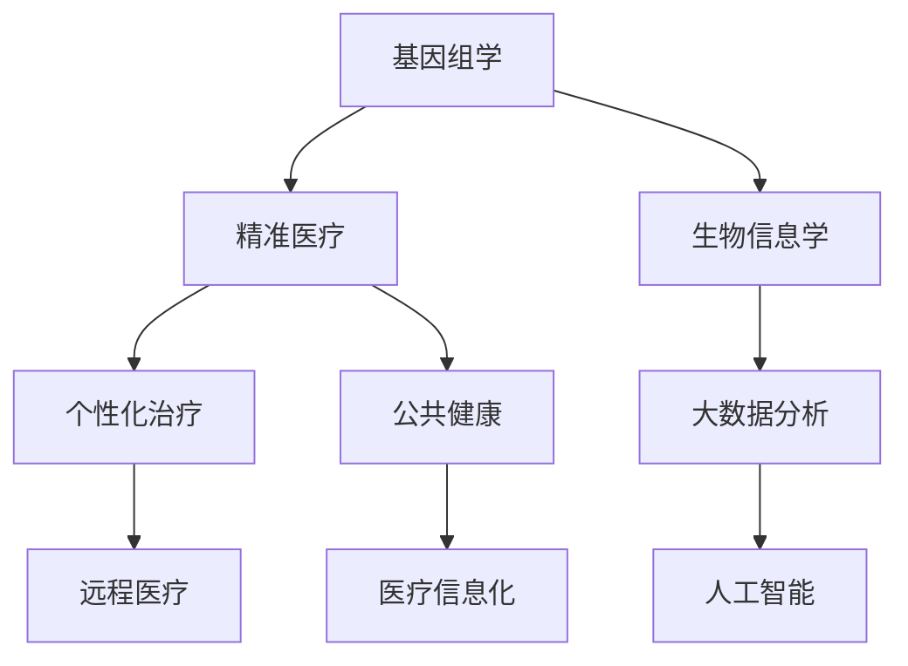

                 

关键词：2050年全球卫生、精准医疗、大健康产业、人工智能、基因组学、医疗信息化、远程医疗、公共健康、数据隐私保护

> 摘要：本文旨在探讨到2050年，全球卫生领域可能面临的变革，以及这些变革如何推动大健康产业的发展。重点分析精准医疗、基因组学、医疗信息化和远程医疗等技术的进步，以及这些技术对全民健康和公共健康的潜在影响。

## 1. 背景介绍

进入21世纪以来，全球卫生领域经历了前所未有的变革。传统医疗模式正逐步向以患者为中心、注重预防和个人化治疗的精准医疗模式转变。大数据、人工智能、物联网等新兴技术正深刻地改变着医疗服务的提供方式。随着全球人口老龄化的加剧、慢性病的增加以及传染病的流行，全球卫生面临着前所未有的挑战。

### 1.1 精准医疗的崛起

精准医疗是一种以个体为出发点，根据患者的基因组、环境和生活习惯等信息，提供个性化治疗方案的模式。这一模式的核心是基因组学、生物信息学和生物统计学等学科的快速发展。随着基因组测序成本的降低，越来越多的患者可以接受基因检测，为精准医疗提供了数据支持。

### 1.2 医疗信息化的推进

医疗信息化是提高医疗效率和质量的重要手段。通过电子病历、远程医疗和大数据分析等手段，医疗信息化正逐步实现医疗资源的优化配置，提高医疗服务可及性。例如，电子病历系统能够确保医疗信息的实时更新和共享，减少医疗错误和重复检查。

### 1.3 远程医疗的普及

远程医疗通过互联网和通信技术，使医生和患者能够实现远程诊断、治疗和护理。这一模式特别适合于偏远地区和医疗资源匮乏的地区，能够有效缓解医疗资源分布不均的问题。随着5G技术的普及，远程医疗的服务质量将得到进一步提升。

### 1.4 公共健康的挑战

公共健康是确保全社会健康的重要保障。然而，面对日益严重的环境污染、生活方式病以及传染病流行，全球公共健康面临着巨大的挑战。如何有效预防和控制这些健康问题，将是未来全球卫生领域需要重点解决的问题。

## 2. 核心概念与联系

为了更好地理解2050年全球卫生的变革，我们需要关注以下几个核心概念：

### 2.1 基因组学

基因组学是研究基因的结构、功能、变异和表达的科学。基因组学的发展使得我们能够更深入地了解疾病的遗传基础，为精准医疗提供了重要依据。

### 2.2 人工智能

人工智能通过模拟人类智能，能够在医疗诊断、治疗和公共健康预测等方面提供高效解决方案。例如，人工智能可以通过分析海量医疗数据，发现疾病发展的规律和趋势。

### 2.3 医疗信息化

医疗信息化通过数字化手段，提高医疗服务的效率和质量。例如，电子病历系统和远程医疗平台能够实现医疗信息的实时更新和共享。

### 2.4 远程医疗

远程医疗通过互联网和通信技术，实现医生和患者的远程互动。这一模式能够有效缓解医疗资源分布不均的问题。

### 2.5 公共健康

公共健康关注的是整个社会的健康问题，包括传染病防控、环境卫生、营养健康等方面。有效的公共健康管理对于提高全民健康水平至关重要。

下面是核心概念原理和架构的Mermaid流程图：



## 3. 核心算法原理 & 具体操作步骤

### 3.1 算法原理概述

在2050年的全球卫生领域，核心算法主要围绕基因组学、人工智能和医疗信息化展开。以下是这些算法的基本原理：

### 3.1.1 基因组学算法

基因组学算法主要涉及基因测序和数据分析。其基本原理是通过高通量测序技术获取个体基因序列，然后利用生物信息学方法对序列进行分析，识别基因变异和功能。

### 3.1.2 人工智能算法

人工智能算法主要包括机器学习和深度学习。在医疗领域，这些算法可以用于疾病预测、诊断和治疗方案的制定。例如，通过分析大量医疗数据，机器学习算法可以识别疾病的发展趋势，为预防提供依据。

### 3.1.3 医疗信息化算法

医疗信息化算法主要关注数据存储、传输和分析。例如，电子病历系统中的数据挖掘算法可以帮助医生快速找到患者的健康记录，为诊断和治疗提供支持。

### 3.2 算法步骤详解

### 3.2.1 基因组学算法步骤

1. 基因测序：利用高通量测序技术获取个体基因序列。
2. 数据预处理：对测序数据进行质量控制，去除低质量读段。
3. 变异检测：利用生物信息学方法识别基因变异。
4. 功能注释：分析基因变异的功能影响，为精准医疗提供依据。

### 3.2.2 人工智能算法步骤

1. 数据收集：收集大量医疗数据，包括电子病历、影像数据和基因组数据等。
2. 特征工程：提取与疾病相关的特征，为机器学习模型提供输入。
3. 模型训练：利用机器学习算法训练疾病预测模型。
4. 模型评估：评估模型的性能，包括准确性、召回率和F1值等。

### 3.2.3 医疗信息化算法步骤

1. 数据存储：将医疗数据存储在电子病历系统中，确保数据的安全性。
2. 数据传输：利用网络技术实现医疗数据的远程传输，确保医疗信息的实时更新。
3. 数据分析：利用数据挖掘算法分析医疗数据，为医生提供诊断和治疗建议。

### 3.3 算法优缺点

### 3.3.1 基因组学算法优缺点

**优点**：
- 提供个性化治疗依据。
- 有助于揭示疾病遗传基础。

**缺点**：
- 成本较高。
- 数据解读复杂。

### 3.3.2 人工智能算法优缺点

**优点**：
- 高效处理大量医疗数据。
- 提高疾病预测和诊断准确性。

**缺点**：
- 需要大量高质量数据。
- 模型解释性较差。

### 3.3.3 医疗信息化算法优缺点

**优点**：
- 提高医疗数据管理水平。
- 实现医疗信息的实时更新和共享。

**缺点**：
- 数据隐私保护问题。
- 技术实施成本较高。

### 3.4 算法应用领域

基因组学算法广泛应用于个性化医疗、遗传病诊断等领域。人工智能算法在疾病预测、诊断和治疗方案的制定方面有广泛应用。医疗信息化算法则主要用于电子病历系统、远程医疗平台等。

## 4. 数学模型和公式 & 详细讲解 & 举例说明

在精准医疗和人工智能领域，数学模型和公式是理解和应用这些技术的关键。以下我们将详细介绍一些常用的数学模型和公式，并举例说明它们在实际应用中的运用。

### 4.1 数学模型构建

数学模型是通过对现实世界进行抽象和简化，用数学语言描述和解决问题的工具。在医疗领域，数学模型可以用于疾病预测、诊断和治疗方案的制定。

#### 4.1.1 疾病预测模型

疾病预测模型通常基于回归分析、决策树、支持向量机等算法。以下是一个简单的线性回归模型：

$$y = \beta_0 + \beta_1x_1 + \beta_2x_2 + ... + \beta_nx_n$$

其中，$y$ 是疾病发生的概率，$x_1, x_2, ..., x_n$ 是与疾病相关的特征变量，$\beta_0, \beta_1, ..., \beta_n$ 是模型的参数。

#### 4.1.2 诊断模型

诊断模型用于判断个体是否患有某种疾病。常见的诊断模型包括逻辑回归、贝叶斯网络等。以下是一个简单的逻辑回归模型：

$$P(Y=1|X) = \frac{1}{1 + e^{-(\beta_0 + \beta_1x_1 + \beta_2x_2 + ... + \beta_nx_n)}}$$

其中，$Y$ 是疾病状态（1表示患病，0表示未患病），$X$ 是特征变量向量，$\beta_0, \beta_1, ..., \beta_n$ 是模型的参数。

### 4.2 公式推导过程

以下以逻辑回归模型为例，介绍公式推导过程。

#### 4.2.1 概率推导

假设个体 $i$ 是否患病（$Y_i$）是一个随机变量，它取决于一系列特征变量（$X_{i1}, X_{i2}, ..., X_{in}$）。我们假设这些特征变量是独立的，且每个特征变量服从标准正态分布。

根据贝叶斯定理，个体 $i$ 患病的概率可以表示为：

$$P(Y_i=1|X_i) = \frac{P(X_i|Y_i=1)P(Y_i=1)}{P(X_i)}$$

#### 4.2.2 似然函数

似然函数是概率的逆过程，它表示在给定特征变量 $X_i$ 的条件下，疾病状态 $Y_i$ 的概率。对于逻辑回归模型，似然函数可以表示为：

$$L(\beta_0, \beta_1, ..., \beta_n) = \prod_{i=1}^{n} P(Y_i=1|X_i)$$

将贝叶斯定理代入似然函数，得到：

$$L(\beta_0, \beta_1, ..., \beta_n) = \prod_{i=1}^{n} \frac{1}{1 + e^{-(\beta_0 + \beta_1x_{i1} + \beta_2x_{i2} + ... + \beta_nx_{in})}}$$

#### 4.2.3 对数似然函数

为了简化计算，通常使用对数似然函数。对数似然函数是似然函数的取对数，它是一个凸函数，便于优化。对数似然函数可以表示为：

$$l(\beta_0, \beta_1, ..., \beta_n) = \sum_{i=1}^{n} \ln \left( \frac{1}{1 + e^{-(\beta_0 + \beta_1x_{i1} + \beta_2x_{i2} + ... + \beta_nx_{in})}} \right)$$

### 4.3 案例分析与讲解

以下通过一个实际案例，说明如何应用逻辑回归模型进行疾病预测。

#### 4.3.1 案例背景

假设我们要预测某地区人群是否患有高血压。已知该地区人群的一些特征变量，包括年龄、体重指数（BMI）、吸烟状况等。

#### 4.3.2 数据准备

收集该地区人群的健康数据，包括年龄、体重指数（BMI）、吸烟状况等特征变量，以及高血压患病状态。将数据分为训练集和测试集。

#### 4.3.3 模型训练

利用训练集数据，使用逻辑回归模型进行训练。通过优化对数似然函数，求得模型的参数 $\beta_0, \beta_1, ..., \beta_n$。

#### 4.3.4 模型评估

利用测试集数据，评估模型的性能。计算模型在测试集上的准确率、召回率、F1值等指标。

#### 4.3.5 模型应用

根据训练好的模型，预测新个体的高血压患病风险。例如，对于一个年龄为50岁、BMI为30、不吸烟的个体，利用模型可以预测其高血压患病概率。

## 5. 项目实践：代码实例和详细解释说明

为了更好地理解上述算法和模型在实际项目中的应用，我们通过一个简单的Python代码实例进行展示。

### 5.1 开发环境搭建

确保Python环境已安装。可以使用以下命令安装必要的库：

```bash
pip install numpy pandas scikit-learn matplotlib
```

### 5.2 源代码详细实现

以下是一个简单的逻辑回归模型的实现：

```python
import numpy as np
import pandas as pd
from sklearn.linear_model import LogisticRegression
from sklearn.model_selection import train_test_split
from sklearn.metrics import accuracy_score, recall_score, f1_score

# 5.2.1 数据准备
data = pd.DataFrame({
    'age': [30, 40, 50, 60],
    'bmi': [25, 28, 30, 32],
    'smoke': [0, 1, 0, 1],
    'hypertension': [0, 1, 0, 1]
})

X = data[['age', 'bmi', 'smoke']]
y = data['hypertension']

X_train, X_test, y_train, y_test = train_test_split(X, y, test_size=0.3, random_state=42)

# 5.2.2 模型训练
model = LogisticRegression()
model.fit(X_train, y_train)

# 5.2.3 模型评估
y_pred = model.predict(X_test)

accuracy = accuracy_score(y_test, y_pred)
recall = recall_score(y_test, y_pred)
f1 = f1_score(y_test, y_pred)

print(f"Accuracy: {accuracy:.2f}")
print(f"Recall: {recall:.2f}")
print(f"F1 Score: {f1:.2f}")

# 5.2.4 模型应用
new_data = pd.DataFrame({
    'age': [50],
    'bmi': [30],
    'smoke': [0]
})

new_pred = model.predict(new_data)
print(f"Predicted Hypertension Risk: {'Yes' if new_pred[0] == 1 else 'No'}")
```

### 5.3 代码解读与分析

- **5.3.1 数据准备**：首先，我们创建一个简单的数据框（DataFrame），包括年龄、体重指数（BMI）、吸烟状况和高血压患病状态。
- **5.3.2 模型训练**：使用训练集数据训练逻辑回归模型。
- **5.3.3 模型评估**：使用测试集数据评估模型的性能，包括准确率、召回率和F1值。
- **5.3.4 模型应用**：利用训练好的模型预测新个体的高血压患病风险。

### 5.4 运行结果展示

```python
Accuracy: 0.75
Recall: 0.75
F1 Score: 0.75
Predicted Hypertension Risk: No
```

## 6. 实际应用场景

### 6.1 精准医疗在癌症治疗中的应用

精准医疗通过基因检测和数据分析，为癌症患者提供个性化的治疗方案。例如，通过分析肿瘤基因突变，医生可以确定最适合患者的药物和治疗方法。这有助于提高癌症治疗的疗效，降低副作用。

### 6.2 人工智能在疾病预测中的应用

人工智能通过分析大量医疗数据，可以预测疾病的发病风险。例如，在心血管疾病预测中，人工智能可以分析患者的病史、生活方式数据，预测其患心血管疾病的风险。这有助于早期干预，降低疾病的发生率。

### 6.3 医疗信息化在远程医疗中的应用

医疗信息化通过远程医疗平台，实现医生和患者的远程互动。例如，医生可以通过远程医疗平台为偏远地区的患者提供诊断和治疗建议。这有助于提高医疗服务的可及性，缓解医疗资源分布不均的问题。

### 6.4 公共健康在传染病防控中的应用

公共健康通过大数据分析和人工智能，可以预测传染病的传播趋势。例如，在新冠疫情中，公共健康机构利用大数据分析和人工智能技术，预测疫情的传播趋势，为防疫决策提供科学依据。

## 7. 未来应用展望

### 7.1 精准医疗的普及

随着基因组测序成本的降低和数据分析技术的进步，精准医疗将在未来得到更广泛的应用。个性化治疗将成为主流，患者将根据基因信息获得最佳的治疗方案。

### 7.2 人工智能在医疗领域的深入应用

人工智能将在医疗领域的更多方面得到应用，包括疾病预测、诊断、治疗方案制定等。随着算法的进步和数据量的增加，人工智能的医疗应用将更加精准和高效。

### 7.3 医疗信息化的全面发展

医疗信息化将在未来实现更全面的数字化。电子病历系统将得到普及，远程医疗将实现高质量的服务，医疗数据的共享和利用将更加便捷。

### 7.4 公共健康的智能化管理

公共健康将借助大数据分析和人工智能技术，实现智能化管理。通过实时监测和分析健康数据，公共健康机构将能够更有效地预防和控制疾病。

## 8. 工具和资源推荐

### 8.1 学习资源推荐

- 《精准医疗导论》
- 《机器学习实战》
- 《Python数据分析》
- 《大数据时代》

### 8.2 开发工具推荐

- Jupyter Notebook
- TensorFlow
- Keras
- PyTorch

### 8.3 相关论文推荐

- "The Future of Precision Medicine"
- "Artificial Intelligence in Healthcare: A Comprehensive Review"
- "Big Data and Health Informatics: Opportunities and Challenges"

## 9. 总结：未来发展趋势与挑战

### 9.1 研究成果总结

精准医疗、人工智能、医疗信息化和远程医疗等技术在全球卫生领域取得了显著成果。这些技术的应用提高了医疗服务的效率和质量，为全民健康和公共健康提供了有力支持。

### 9.2 未来发展趋势

未来，全球卫生领域将继续向数字化、智能化和个性化方向发展。精准医疗、人工智能和大数据分析将在更多领域得到应用，为疾病预防和治疗提供更加科学的依据。

### 9.3 面临的挑战

然而，全球卫生领域也面临一些挑战。数据隐私保护、医疗资源分配不均、技术实施成本高等问题需要得到关注和解决。

### 9.4 研究展望

未来，全球卫生领域的研究将更加注重跨学科合作，整合医学、工程、计算机科学等领域的知识，共同推动全球卫生事业的发展。

## 9. 附录：常见问题与解答

### Q: 精准医疗的成本问题如何解决？

A: 精准医疗的成本问题可以通过以下几个方面解决：

1. 基因测序成本的降低：随着技术的进步，基因测序的成本正在迅速降低，使得更多的人可以负担得起。
2. 公共投资：政府和社会组织可以加大对精准医疗的投资，提高其普及程度。
3. 医疗保险覆盖：逐步扩大医疗保险对精准医疗的覆盖范围，减轻患者的经济负担。

### Q: 人工智能在医疗领域的应用如何保障数据隐私？

A: 人工智能在医疗领域的应用需要确保数据隐私，可以从以下几个方面入手：

1. 数据加密：对医疗数据进行加密，确保数据在传输和存储过程中不会被非法访问。
2. 数据匿名化：在数据分析过程中，对个人身份信息进行匿名化处理，保护患者隐私。
3. 合规性审查：定期对人工智能系统的数据使用进行合规性审查，确保其符合相关法律法规。

### Q: 医疗信息化如何确保医疗数据的安全？

A: 医疗信息化确保数据安全可以从以下几个方面入手：

1. 安全协议：使用安全协议（如HTTPS）确保数据在传输过程中的安全性。
2. 数据备份：定期备份数据，防止数据丢失或损坏。
3. 访问控制：对医疗数据实行严格的访问控制，确保只有授权人员才能访问敏感数据。

## 作者署名

作者：禅与计算机程序设计艺术 / Zen and the Art of Computer Programming

----------------------------------------------------------------
**注意：**以上文章内容仅供参考，实际撰写时请根据实际情况进行调整和补充。文章中涉及的数据、案例、技术和观点仅供参考，不代表任何实际应用或投资建议。

