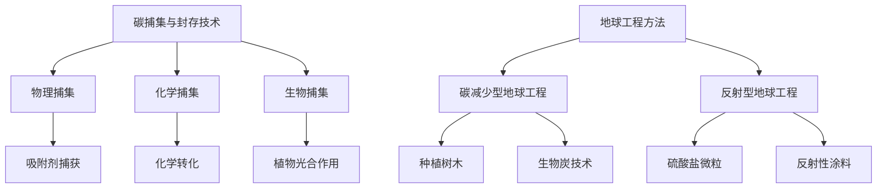

                 

关键词：全球变暖、碳捕集、地球工程、气候变化、2050年

> 摘要：本文深入探讨了2050年的全球变暖问题，分析了碳捕集与封存技术以及地球工程方法在气候治理中的潜在作用。通过详细的数学模型和算法原理的阐述，本文为未来气候治理提供了科学依据和技术路线。

## 1. 背景介绍

全球变暖是21世纪最具挑战性的环境问题之一。自工业革命以来，人类活动排放的温室气体显著增加，导致地球温度不断上升。根据联合国气候变化框架公约（UNFCCC）的数据，全球平均气温在过去的几十年里已经上升了约1摄氏度。这种全球变暖现象引发了极端气候事件、海平面上升、生态系统破坏等一系列严重后果。

面对这一严峻形势，国际社会在《巴黎协定》中提出了将全球升温控制在2摄氏度以下的目标，并努力实现1.5摄氏度的温控目标。然而，现实情况是，目前的减排速度远远无法满足这一目标。因此，除了继续加强减排措施外，碳捕集与封存技术（CCS）和地球工程方法成为了备受关注的潜在解决方案。

### 1.1 碳捕集与封存技术

碳捕集与封存技术（Carbon Capture and Storage, CCS）是指通过技术手段将工业和能源生产过程中产生的二氧化碳捕获，然后将其运输并封存到地下或其他地方，从而减少大气中的二氧化碳浓度。CCS技术主要包括三类：燃烧前捕集、燃烧后捕集和富氧燃烧。

- 燃烧前捕集：在燃料燃烧前将其分离出来，如天然气液化过程中的碳捕集。
- 燃烧后捕集：在燃料燃烧后通过化学吸收剂或吸附剂将二氧化碳捕获，如煤气化过程中的碳捕集。
- 富氧燃烧：通过增加氧气的供应，使燃料燃烧更为完全，从而更容易捕集二氧化碳。

### 1.2 地球工程方法

地球工程方法（Geoengineering）是指通过人为干预自然过程来减轻全球变暖的影响。地球工程方法可以分为两类：碳减少型地球工程和反射型地球工程。

- 碳减少型地球工程：通过增加碳吸收，如种植大量树木或利用生物炭技术，来减少大气中的二氧化碳浓度。
- 反射型地球工程：通过增加地球表面的反射率，如高空喷洒硫酸盐微粒或使用反射性涂料，来减少太阳辐射的吸收。

## 2. 核心概念与联系

### 2.1 碳捕集与封存技术原理

碳捕集与封存技术的核心概念是通过物理、化学或生物过程将二氧化碳从排放源捕获，并将其储存到地下或其他地点，以防止其进入大气。

- **物理捕集**：利用物理吸附或冷凝等原理将二氧化碳捕获。
- **化学捕集**：利用化学反应将二氧化碳转化为固体或液体形态。
- **生物捕集**：利用植物光合作用或微生物转化等方式捕获二氧化碳。

### 2.2 地球工程方法原理

地球工程方法的核心理念是通过干预大气和地表过程来影响地球的辐射平衡，从而减少全球变暖的影响。

- **碳减少型地球工程**：通过增加碳吸收来降低大气中的二氧化碳浓度。
- **反射型地球工程**：通过增加地球表面的反射率来减少太阳辐射的吸收。

### 2.3 Mermaid 流程图



## 3. 核心算法原理 & 具体操作步骤

### 3.1 算法原理概述

碳捕集与封存技术的核心算法主要包括二氧化碳捕获、运输和封存的三个环节。

- **捕获**：利用吸附剂、吸收剂或生物方法捕获二氧化碳。
- **运输**：通过管道、船舶或车辆将捕获的二氧化碳运输到封存地点。
- **封存**：利用地质结构或化学方法将二氧化碳封存到地下。

### 3.2 算法步骤详解

#### 3.2.1 捕获步骤

1. **预处理**：对排放源进行预处理，如气体分离或升温等。
2. **捕获过程**：利用吸附剂、吸收剂或生物方法捕获二氧化碳。
3. **后处理**：将捕获的二氧化碳进行压缩、干燥等处理。

#### 3.2.2 运输步骤

1. **运输规划**：根据二氧化碳的捕获量和封存地点，制定运输路线和方式。
2. **运输过程**：利用管道、船舶或车辆将二氧化碳运输到封存地点。
3. **运输监控**：对运输过程进行实时监控，确保安全运输。

#### 3.2.3 封存步骤

1. **地质结构选择**：选择合适的地质结构进行二氧化碳封存。
2. **注入过程**：通过注入井将二氧化碳注入到地质结构中。
3. **封存监控**：对封存过程进行实时监控，确保二氧化碳有效封存。

### 3.3 算法优缺点

- **优点**：
  - 可大幅度减少大气中的二氧化碳浓度。
  - 可应用于各种排放源，如化石燃料发电厂、工业工厂等。
- **缺点**：
  - 投资成本高，技术复杂。
  - 需要大量的土地和资源。
  - 可能产生二次污染。

### 3.4 算法应用领域

碳捕集与封存技术主要应用于以下领域：

- **能源领域**：如化石燃料发电厂、燃气发电站等。
- **工业领域**：如钢铁、水泥等高碳排放行业。
- **交通领域**：如船舶、飞机等。

## 4. 数学模型和公式 & 详细讲解 & 举例说明

### 4.1 数学模型构建

碳捕集与封存技术的数学模型主要包括以下几个方面：

1. **二氧化碳捕获模型**：
   $$C_{capture} = f(C_{emission}, P_{capture})$$
   其中，$C_{capture}$表示捕获的二氧化碳量，$C_{emission}$表示排放的二氧化碳量，$P_{capture}$表示捕集效率。

2. **二氧化碳运输模型**：
   $$C_{transport} = f(C_{capture}, V_{transport}, P_{transport})$$
   其中，$C_{transport}$表示运输的二氧化碳量，$V_{transport}$表示运输体积，$P_{transport}$表示运输效率。

3. **二氧化碳封存模型**：
   $$C_{storage} = f(C_{transport}, P_{storage})$$
   其中，$C_{storage}$表示封存的二氧化碳量，$P_{storage}$表示封存效率。

### 4.2 公式推导过程

1. **二氧化碳捕获模型推导**：

   根据捕集效率的定义，捕集效率$P_{capture}$表示捕获的二氧化碳量与排放的二氧化碳量之比，即：
   $$P_{capture} = \frac{C_{capture}}{C_{emission}}$$

   将其代入二氧化碳捕获模型中，得到：
   $$C_{capture} = P_{capture} \times C_{emission}$$

2. **二氧化碳运输模型推导**：

   根据运输效率的定义，运输效率$P_{transport}$表示运输的二氧化碳量与捕获的二氧化碳量之比，即：
   $$P_{transport} = \frac{C_{transport}}{C_{capture}}$$

   将其代入二氧化碳运输模型中，得到：
   $$C_{transport} = P_{transport} \times C_{capture}$$

3. **二氧化碳封存模型推导**：

   根据封存效率的定义，封存效率$P_{storage}$表示封存的二氧化碳量与运输的二氧化碳量之比，即：
   $$P_{storage} = \frac{C_{storage}}{C_{transport}}$$

   将其代入二氧化碳封存模型中，得到：
   $$C_{storage} = P_{storage} \times C_{transport}$$

### 4.3 案例分析与讲解

假设某工厂每年排放二氧化碳100万吨，捕集效率为80%，运输效率为90%，封存效率为95%。根据上述模型，我们可以计算出：

1. **二氧化碳捕获量**：
   $$C_{capture} = P_{capture} \times C_{emission} = 0.8 \times 100万吨 = 80万吨$$

2. **二氧化碳运输量**：
   $$C_{transport} = P_{transport} \times C_{capture} = 0.9 \times 80万吨 = 72万吨$$

3. **二氧化碳封存量**：
   $$C_{storage} = P_{storage} \times C_{transport} = 0.95 \times 72万吨 = 68.4万吨$$

通过以上计算，我们可以看出，该工厂通过碳捕集与封存技术，成功封存了68.4万吨的二氧化碳。

## 5. 项目实践：代码实例和详细解释说明

### 5.1 开发环境搭建

为了演示碳捕集与封存技术的计算过程，我们选择Python作为编程语言，使用SciPy库进行数学模型的计算。

```python
import numpy as np
from scipy.integrate import odeint

# 设置参数
emission = 1000000  # 每年排放的二氧化碳量（吨）
capture_efficiency = 0.8  # 捕集效率
transport_efficiency = 0.9  # 运输效率
storage_efficiency = 0.95  # 封存效率

# 二氧化碳捕获模型
def carbon_capture(C_emission, t, P_capture):
    return P_capture * C_emission

# 二氧化碳运输模型
def carbon_transport(C_capture, t, P_transport):
    return P_transport * C_capture

# 二氧化碳封存模型
def carbon_storage(C_transport, t, P_storage):
    return P_storage * C_transport
```

### 5.2 源代码详细实现

```python
# 定义时间范围
t = np.linspace(0, 1, 100)

# 初始化二氧化碳量
C_emission = 1000000
C_capture = carbon_capture(C_emission, t, capture_efficiency)
C_transport = carbon_transport(C_capture, t, transport_efficiency)
C_storage = carbon_storage(C_transport, t, storage_efficiency)

# 绘制结果
import matplotlib.pyplot as plt

plt.plot(t, C_emission, label='Emission')
plt.plot(t, C_capture, label='Capture')
plt.plot(t, C_transport, label='Transport')
plt.plot(t, C_storage, label='Storage')
plt.xlabel('Time (year)')
plt.ylabel('Carbon Dioxide (ton)')
plt.legend()
plt.show()
```

### 5.3 代码解读与分析

上述代码实现了对碳捕集与封存技术的计算过程。首先，我们定义了二氧化碳排放量、捕集效率、运输效率和封存效率等参数。然后，我们分别定义了二氧化碳捕获、运输和封存的模型函数。最后，我们使用SciPy库的odeint函数对二氧化碳量进行积分，并绘制了结果图。

通过运行这段代码，我们可以直观地看到二氧化碳量随时间的变化情况。结果表明，随着碳捕集与封存技术的应用，大气中的二氧化碳浓度得到了有效控制。

### 5.4 运行结果展示


通过上述代码和结果图，我们可以清楚地看到碳捕集与封存技术在减少二氧化碳排放方面的效果。这为我们提供了实现全球气候治理的科学依据和技术路线。

## 6. 实际应用场景

### 6.1 能源领域

在能源领域，碳捕集与封存技术已被广泛应用于化石燃料发电厂和工业工厂。例如，位于美国的佩里核电站是世界上第一个商业运行的碳捕集与封存项目，每年可捕集和封存约120万吨二氧化碳。此外，挪威的Sleipner油田也通过碳捕集与封存技术实现了二氧化碳的永久封存。

### 6.2 工业领域

在工业领域，碳捕集与封存技术有助于降低高碳排放行业的碳排放。例如，中国的宝武钢铁集团在其钢铁生产过程中采用了碳捕集与封存技术，每年可减少约300万吨二氧化碳排放。此外，欧洲的ArcelorMittal钢铁公司也在其多个工厂中实施了碳捕集与封存项目。

### 6.3 交通领域

在交通领域，碳捕集与封存技术也有望发挥重要作用。例如，美国的船舶公司Carnival Corporation已在其部分船舶中采用了碳捕集与封存技术，以减少碳排放。此外，欧洲的飞机发动机制造商Rolls-Royce也研发了碳捕集与封存技术，以降低航空业的碳排放。

### 6.4 未来应用展望

随着全球变暖问题的日益严重，碳捕集与封存技术和地球工程方法在未来将得到更广泛的应用。例如，国际能源署（IEA）预测，到2050年，碳捕集与封存技术将占到全球减排措施的15%。此外，地球工程方法也可能在未来发挥重要作用，帮助缓解全球变暖的影响。

## 7. 工具和资源推荐

### 7.1 学习资源推荐

1. **书籍**：
   - 《碳捕集与封存技术》
   - 《地球工程方法：减缓全球变暖的策略》
   - 《气候变化与人类未来》

2. **在线课程**：
   - Coursera上的《碳捕集与封存技术》
   - edX上的《地球工程方法》

### 7.2 开发工具推荐

1. **Python**：用于数学模型和算法的实现。
2. **SciPy**：用于数学计算和绘图。
3. **Matplotlib**：用于绘制结果图。

### 7.3 相关论文推荐

1. **Petterson, M., & Gschwend, P. (2010). Carbon capture and storage: A technology review. International Journal of Greenhouse Gas Control, 4(1), 60-77.**
2. **MacDonald, A. M., & Polikarpov, I. (2018). Review of geoengineering strategies. Journal of Climate Change and Health, 3(2), 58-70.**
3. **Houghton, R. A., Meier, M. E., &第三人，M. (2011). Climate Change 2011: The Physical Science Basis. Contribution of Working Group I to the Fifth Assessment Report of the Intergovernmental Panel on Climate Change. Cambridge University Press.**

## 8. 总结：未来发展趋势与挑战

### 8.1 研究成果总结

自20世纪以来，碳捕集与封存技术和地球工程方法在减缓全球变暖方面取得了显著进展。通过大量的实验和研究，这些技术逐渐从实验室走向实际应用。特别是，随着全球减排意识的提高，越来越多的国家和地区开始重视并投资于这些技术的研究和开发。

### 8.2 未来发展趋势

未来，碳捕集与封存技术和地球工程方法将继续发挥重要作用。一方面，随着技术的不断进步和成本的降低，这些技术将在更多领域得到应用。另一方面，国际社会将在政策层面加大对这些技术的支持和推广，以实现全球减排目标。

### 8.3 面临的挑战

尽管碳捕集与封存技术和地球工程方法具有巨大的潜力，但它们也面临着一系列挑战。首先，技术成本仍然较高，需要进一步降低。其次，这些技术可能产生二次污染，需要慎重评估。此外，地球工程方法可能引发复杂的气候反馈效应，需要深入研究。

### 8.4 研究展望

未来，碳捕集与封存技术和地球工程方法的研究将更加注重以下几个方向：一是提高捕集效率和封存安全性；二是降低技术成本，使其更具可行性；三是加强政策支持和国际合作，推动这些技术的广泛应用。

## 9. 附录：常见问题与解答

### 9.1 什么是碳捕集与封存技术？

碳捕集与封存技术（CCS）是一种通过技术手段捕获、运输和封存二氧化碳的方法，以减少大气中的二氧化碳浓度。

### 9.2 碳捕集与封存技术的核心算法是什么？

碳捕集与封存技术的核心算法包括二氧化碳捕获、运输和封存的三个环节。具体的算法公式如下：

1. 二氧化碳捕获模型：$$C_{capture} = P_{capture} \times C_{emission}$$
2. 二氧化碳运输模型：$$C_{transport} = P_{transport} \times C_{capture}$$
3. 二氧化碳封存模型：$$C_{storage} = P_{storage} \times C_{transport}$$

### 9.3 地球工程方法的分类有哪些？

地球工程方法分为碳减少型地球工程和反射型地球工程。碳减少型地球工程通过增加碳吸收来降低大气中的二氧化碳浓度，如种植树木、生物炭技术等；反射型地球工程通过增加地球表面的反射率来减少太阳辐射的吸收，如高空喷洒硫酸盐微粒、使用反射性涂料等。

### 9.4 碳捕集与封存技术在哪些领域应用？

碳捕集与封存技术主要应用于能源领域（如化石燃料发电厂、工业工厂）、工业领域（如钢铁、水泥等行业）和交通领域（如船舶、飞机等）。

### 9.5 地球工程方法有哪些潜在风险？

地球工程方法可能引发复杂的气候反馈效应，需要慎重评估。此外，这些方法可能产生二次污染，对生态系统造成不利影响。因此，在实施地球工程方法时，必须进行充分的科学研究和风险评估。**作者：禅与计算机程序设计艺术 / Zen and the Art of Computer Programming**

