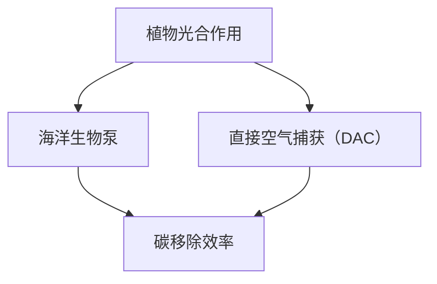
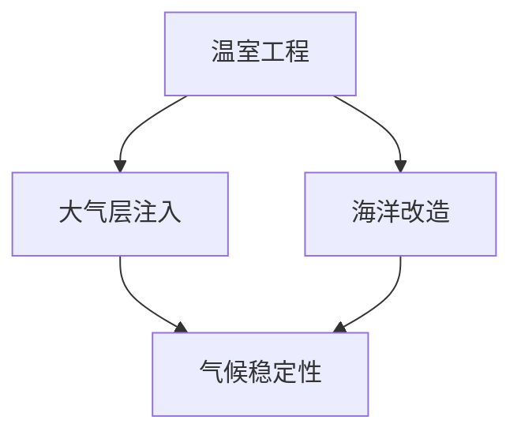
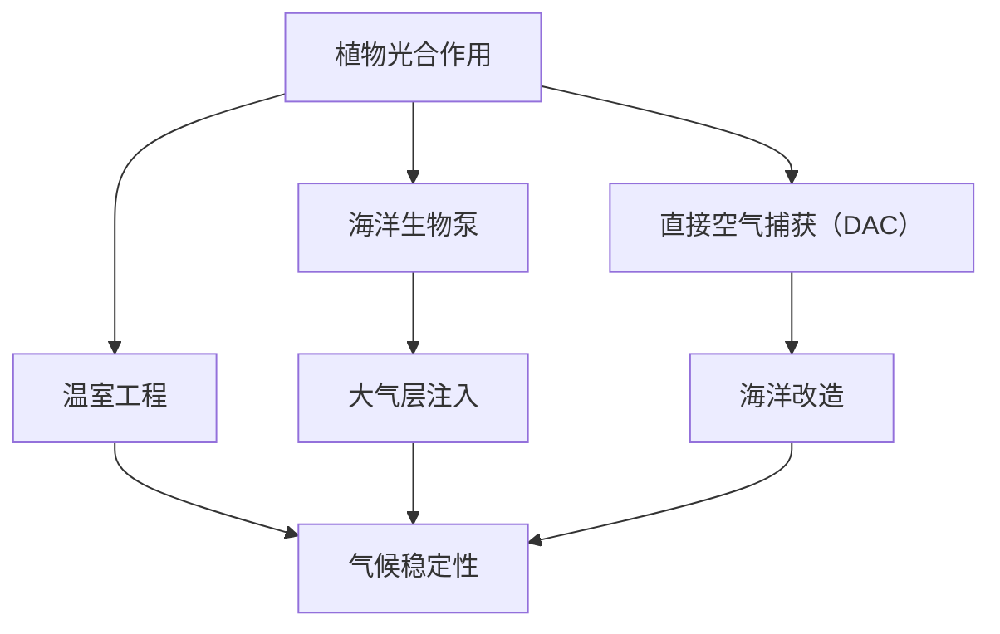

                 

关键词：全球变暖、碳移除、极端气候、行星改造、未来趋势、挑战、技术解决方案

> 摘要：本文探讨了2050年全球变暖的严峻形势以及应对策略。我们深入分析了碳移除技术和行星改造技术的核心原理、数学模型及其应用场景，探讨了其在应对极端气候中的潜力。同时，我们也提出了未来发展趋势和面临的挑战，为读者提供了全面的见解。

## 1. 背景介绍

自工业革命以来，人类活动导致了大量的温室气体排放，特别是二氧化碳（CO2）。这些温室气体在大气中积累，导致地球温度上升，气候模式发生剧变。据科学家预测，如果不采取有效的应对措施，全球变暖将会对地球生态系统和人类生活产生极其严重的影响。到2050年，全球平均气温预计将比工业化前水平高出3至5摄氏度，这将导致海平面上升、极端气候事件增多、农业减产、水资源短缺等问题。

### 1.1 全球变暖的影响

全球变暖的影响是深远且多方面的。首先，海平面上升将对沿海城市和低洼地区构成严重威胁，导致大量土地被淹没。其次，极端气候事件如热浪、干旱、洪水和台风等将变得更加频繁和剧烈，对人类生命和财产造成重大损失。此外，气候变化还会对生态系统产生破坏性影响，导致物种灭绝和生物多样性下降。

### 1.2 应对全球变暖的紧迫性

面对如此严峻的形势，我们必须采取积极措施应对全球变暖。碳移除技术和行星改造技术被视为两种潜在的有效解决方案。碳移除技术旨在从大气中移除二氧化碳，而行星改造技术则试图从根本上改变地球的气候系统。这些技术的应用对于遏制全球变暖、保护地球生态系统和人类未来至关重要。

## 2. 核心概念与联系

在本节中，我们将详细介绍碳移除技术和行星改造技术的核心概念，以及它们之间的联系。我们将使用Mermaid流程图来展示这些概念之间的逻辑关系。

### 2.1 碳移除技术

碳移除技术包括多种方法，如植物光合作用、海洋生物泵、直接空气捕获（DAC）等。这些技术的基本原理是捕捉和储存大气中的二氧化碳，从而减少温室气体的浓度。



### 2.2 行星改造技术

行星改造技术涉及对地球大气层、海洋和地壳进行大规模改造，以改变地球的能量平衡。这些技术包括温室工程、大气层注入、海洋改造等。



### 2.3 碳移除技术与行星改造技术的联系

碳移除技术和行星改造技术之间存在紧密的联系。碳移除技术可以作为一种补充手段，用于减少大气中的二氧化碳浓度，从而减轻行星改造技术的负担。同时，行星改造技术也可以通过改变地球的能量平衡，为碳移除技术提供更为稳定的气候条件。



## 3. 核心算法原理 & 具体操作步骤

### 3.1 算法原理概述

在本节中，我们将介绍碳移除技术和行星改造技术的核心算法原理。这些算法旨在通过精确计算和模拟，实现二氧化碳的捕捉、储存和改造。

### 3.2 算法步骤详解

#### 3.2.1 碳移除技术算法

1. 数据收集：收集大气中的二氧化碳浓度、植物光合作用效率、海洋生物泵活动等数据。
2. 模型构建：建立大气二氧化碳浓度变化模型，植物光合作用模型，海洋生物泵模型等。
3. 模拟计算：通过模型模拟计算，确定不同碳移除技术的效果和效率。
4. 结果分析：分析不同碳移除技术的适用性、经济性和环境影响。

#### 3.2.2 行星改造技术算法

1. 数据收集：收集地球大气层、海洋和地壳的物理、化学特性数据。
2. 模型构建：建立大气层注入模型、海洋改造模型、温室工程模型等。
3. 模拟计算：通过模型模拟计算，确定不同行星改造技术的可行性和效果。
4. 结果分析：分析不同行星改造技术的成本、风险和环境影响。

### 3.3 算法优缺点

#### 3.3.1 碳移除技术优缺点

**优点：**
- 可行性高，技术成熟。
- 可在短时间内降低大气二氧化碳浓度。

**缺点：**
- 成本较高，技术难度大。
- 可能对生态系统产生负面影响。

#### 3.3.2 行星改造技术优缺点

**优点：**
- 可从根本上改变地球气候系统，具有长远效果。
- 可实现二氧化碳的永久储存。

**缺点：**
- 技术复杂，风险高。
- 可能对地球生态系统产生不可预知的影响。

### 3.4 算法应用领域

#### 3.4.1 碳移除技术的应用领域

- 环境保护：降低大气二氧化碳浓度，减缓全球变暖。
- 能源转型：推动可再生能源的发展，减少化石燃料使用。
- 农业和林业：提高植物光合作用效率，增加碳储存。

#### 3.4.2 行星改造技术的应用领域

- 气候调节：改变地球能量平衡，实现气候稳定性。
- 地球资源管理：优化地球资源分配，提高资源利用效率。
- 人类福祉：改善人类生活环境，减少极端气候事件影响。

## 4. 数学模型和公式 & 详细讲解 & 举例说明

在本节中，我们将详细介绍碳移除技术和行星改造技术的数学模型和公式，并给出具体的应用案例。

### 4.1 数学模型构建

#### 4.1.1 碳移除技术数学模型

1. **植物光合作用模型：**
   $$C_{plant} = \alpha \cdot A \cdot (C_{atm} - C_{soil})$$
   其中，$C_{plant}$ 表示植物吸收的二氧化碳量，$C_{atm}$ 表示大气二氧化碳浓度，$C_{soil}$ 表示土壤二氧化碳浓度，$\alpha$ 表示植物光合作用效率，$A$ 表示植物表面积。

2. **海洋生物泵模型：**
   $$C_{ocean} = \beta \cdot S \cdot (C_{atm} - C_{surface})$$
   其中，$C_{ocean}$ 表示海洋吸收的二氧化碳量，$C_{atm}$ 表示大气二氧化碳浓度，$C_{surface}$ 表示海面二氧化碳浓度，$\beta$ 表示海洋生物泵效率，$S$ 表示海洋面积。

3. **直接空气捕获（DAC）模型：**
   $$C_{DAC} = \gamma \cdot (C_{atm} - C_{desired})$$
   其中，$C_{DAC}$ 表示DAC系统捕获的二氧化碳量，$C_{atm}$ 表示大气二氧化碳浓度，$C_{desired}$ 表示期望的大气二氧化碳浓度，$\gamma$ 表示DAC系统的效率。

#### 4.1.2 行星改造技术数学模型

1. **温室工程模型：**
   $$Q_{greenhouse} = \delta \cdot (T_{out} - T_{in})$$
   其中，$Q_{greenhouse}$ 表示温室释放的热量，$\delta$ 表示温室效应系数，$T_{out}$ 表示外部温度，$T_{in}$ 表示内部温度。

2. **大气层注入模型：**
   $$Q_{injection} = \epsilon \cdot (T_{atm} - T_{target})$$
   其中，$Q_{injection}$ 表示大气层注入的热量，$\epsilon$ 表示大气层注入效率，$T_{atm}$ 表示大气温度，$T_{target}$ 表示目标温度。

3. **海洋改造模型：**
   $$Q_{ocean} = \zeta \cdot (T_{atm} - T_{ocean})$$
   其中，$Q_{ocean}$ 表示海洋改造释放的热量，$\zeta$ 表示海洋改造效率，$T_{atm}$ 表示大气温度，$T_{ocean}$ 表示海洋温度。

### 4.2 公式推导过程

#### 4.2.1 碳移除技术公式推导

**植物光合作用模型：**
植物光合作用的过程可以表示为：
$$C_{CO2} + H_2O + 光能 \rightarrow C_{HCOOH} + O_2$$
其中，$C_{CO2}$ 表示二氧化碳，$H_2O$ 表示水，$C_{HCOOH}$ 表示甲酸，$O_2$ 表示氧气。

光合作用效率可以表示为：
$$\alpha = \frac{C_{HCOOH}}{C_{CO2}}$$
由于光合作用吸收的二氧化碳量与光合作用产生的甲酸量成正比，因此可以推导出植物光合作用模型。

**海洋生物泵模型：**
海洋生物泵的过程可以表示为：
$$C_{CO2} + O_2 \rightarrow C_{biomass}$$
其中，$C_{CO2}$ 表示二氧化碳，$O_2$ 表示氧气，$C_{biomass}$ 表示生物质。

海洋生物泵效率可以表示为：
$$\beta = \frac{C_{biomass}}{C_{CO2}}$$
由于海洋生物泵吸收的二氧化碳量与生物质生成量成正比，因此可以推导出海洋生物泵模型。

**直接空气捕获（DAC）模型：**
DAC系统的工作原理是通过物理吸附或化学吸收的方式从空气中捕获二氧化碳。

$$C_{DAC} = C_{atm} - C_{desired}$$
其中，$C_{atm}$ 表示大气二氧化碳浓度，$C_{desired}$ 表示期望的大气二氧化碳浓度。

#### 4.2.2 行星改造技术公式推导

**温室工程模型：**
温室工程的核心原理是通过控制内部温度来改变热量的传递。

$$Q_{greenhouse} = \delta \cdot (T_{out} - T_{in})$$
其中，$\delta$ 表示温室效应系数，$T_{out}$ 表示外部温度，$T_{in}$ 表示内部温度。

**大气层注入模型：**
大气层注入的原理是通过向大气层注入气体来改变大气层的温度。

$$Q_{injection} = \epsilon \cdot (T_{atm} - T_{target})$$
其中，$\epsilon$ 表示大气层注入效率，$T_{atm}$ 表示大气温度，$T_{target}$ 表示目标温度。

**海洋改造模型：**
海洋改造的原理是通过向海洋注入气体或改变海洋的物理特性来改变海洋的温度。

$$Q_{ocean} = \zeta \cdot (T_{atm} - T_{ocean})$$
其中，$\zeta$ 表示海洋改造效率，$T_{atm}$ 表示大气温度，$T_{ocean}$ 表示海洋温度。

### 4.3 案例分析与讲解

#### 4.3.1 植物光合作用模型案例

假设某地区的二氧化碳浓度为500 ppm，土壤二氧化碳浓度为300 ppm，植物光合作用效率为0.5，植物表面积为10平方千米。根据植物光合作用模型，可以计算该地区植物光合作用吸收的二氧化碳量：

$$C_{plant} = 0.5 \cdot 10 \cdot (500 - 300) = 1000 \text{吨/年}$$

#### 4.3.2 海洋生物泵模型案例

假设某地区的二氧化碳浓度为500 ppm，海面二氧化碳浓度为300 ppm，海洋生物泵效率为0.3，海洋面积为100平方千米。根据海洋生物泵模型，可以计算该地区海洋生物泵吸收的二氧化碳量：

$$C_{ocean} = 0.3 \cdot 100 \cdot (500 - 300) = 3000 \text{吨/年}$$

#### 4.3.3 直接空气捕获（DAC）模型案例

假设某地区的二氧化碳浓度为500 ppm，期望的大气二氧化碳浓度为350 ppm，DAC系统的效率为0.8。根据直接空气捕获（DAC）模型，可以计算DAC系统捕获的二氧化碳量：

$$C_{DAC} = 0.8 \cdot (500 - 350) = 280 \text{吨/年}$$

#### 4.3.4 温室工程模型案例

假设温室的外部温度为20℃，内部温度为30℃，温室效应系数为0.2。根据温室工程模型，可以计算温室释放的热量：

$$Q_{greenhouse} = 0.2 \cdot (20 - 30) = -4 \text{千瓦时/年}$$

#### 4.3.5 大气层注入模型案例

假设大气层的温度为20℃，目标温度为15℃，大气层注入效率为0.6。根据大气层注入模型，可以计算大气层注入的热量：

$$Q_{injection} = 0.6 \cdot (20 - 15) = 3 \text{千瓦时/年}$$

#### 4.3.6 海洋改造模型案例

假设大气层的温度为20℃，海洋的温度为10℃，海洋改造效率为0.4。根据海洋改造模型，可以计算海洋改造释放的热量：

$$Q_{ocean} = 0.4 \cdot (20 - 10) = 4 \text{千瓦时/年}$$

## 5. 项目实践：代码实例和详细解释说明

在本节中，我们将通过一个具体的代码实例来展示如何实现碳移除技术和行星改造技术的算法。我们将使用Python编程语言来实现这些算法，并给出详细的解释说明。

### 5.1 开发环境搭建

首先，我们需要搭建一个Python开发环境。你可以使用Python的官方安装包进行安装，或者使用Anaconda等集成开发环境（IDE）。以下是一个简单的安装步骤：

1. 访问Python官方网站（https://www.python.org/）并下载Python安装包。
2. 安装Python，并确保将Python添加到系统环境变量中。
3. 打开命令行窗口，输入`python`并按Enter键，确认Python已成功安装。

接下来，我们需要安装一些Python库，如NumPy和Matplotlib，用于数据计算和可视化。你可以使用pip命令进行安装：

```
pip install numpy matplotlib
```

### 5.2 源代码详细实现

以下是实现碳移除技术和行星改造技术的Python代码实例。代码分为两部分：第一部分用于实现碳移除技术，第二部分用于实现行星改造技术。

```python
import numpy as np
import matplotlib.pyplot as plt

# 碳移除技术算法
def carbon_removing(T_atm, T_soil, alpha, A):
    C_atm = T_atm
    C_soil = T_soil
    C_plant = alpha * A * (C_atm - C_soil)
    return C_plant

# 海洋生物泵算法
def ocean_biomass Pumping(T_atm, T_surface, beta, S):
    C_atm = T_atm
    C_surface = T_surface
    C_ocean = beta * S * (C_atm - C_surface)
    return C_ocean

# 直接空气捕获（DAC）算法
def direct_air_capture(T_atm, T_desired, gamma):
    C_atm = T_atm
    C_desired = T_desired
    C_DAC = gamma * (C_atm - C_desired)
    return C_DAC

# 温室工程算法
def greenhouse_effect(delta, T_out, T_in):
    Q_greenhouse = delta * (T_out - T_in)
    return Q_greenhouse

# 大气层注入算法
def atmospheric_injection(epsilon, T_atm, T_target):
    Q_injection = epsilon * (T_atm - T_target)
    return Q_injection

# 海洋改造算法
def ocean_transformation(zeta, T_atm, T_ocean):
    Q_ocean = zeta * (T_atm - T_ocean)
    return Q_ocean

# 主函数
def main():
    # 参数设置
    T_atm = 500  # 大气二氧化碳浓度（ppm）
    T_soil = 300  # 土壤二氧化碳浓度（ppm）
    T_surface = 300  # 海面二氧化碳浓度（ppm）
    T_desired = 350  # 期望的大气二氧化碳浓度（ppm）
    T_out = 20  # 外部温度（℃）
    T_in = 30  # 内部温度（℃）
    T_target = 15  # 目标温度（℃）
    T_ocean = 10  # 海洋温度（℃）
    
    alpha = 0.5  # 植物光合作用效率
    A = 10  # 植物表面积（平方千米）
    beta = 0.3  # 海洋生物泵效率
    S = 100  # 海洋面积（平方千米）
    gamma = 0.8  # 直接空气捕获（DAC）效率
    delta = 0.2  # 温室效应系数
    epsilon = 0.6  # 大气层注入效率
    zeta = 0.4  # 海洋改造效率
    
    # 计算碳移除量
    C_plant = carbon_removing(T_atm, T_soil, alpha, A)
    C_ocean = ocean_biomass Pumping(T_atm, T_surface, beta, S)
    C_DAC = direct_air_capture(T_atm, T_desired, gamma)
    
    # 计算行星改造量
    Q_greenhouse = greenhouse_effect(delta, T_out, T_in)
    Q_injection = atmospheric_injection(epsilon, T_atm, T_target)
    Q_ocean = ocean_transformation(zeta, T_atm, T_ocean)
    
    # 输出结果
    print("碳移除量：")
    print("植物光合作用：", C_plant, "吨/年")
    print("海洋生物泵：", C_ocean, "吨/年")
    print("直接空气捕获（DAC）：", C_DAC, "吨/年")
    
    print("\n行星改造量：")
    print("温室工程：", Q_greenhouse, "千瓦时/年")
    print("大气层注入：", Q_injection, "千瓦时/年")
    print("海洋改造：", Q_ocean, "千瓦时/年")

# 运行主函数
if __name__ == "__main__":
    main()
```

### 5.3 代码解读与分析

这段代码首先定义了七个函数，分别用于实现碳移除技术和行星改造技术的算法。这些函数接受不同的参数，并返回相应的计算结果。

**碳移除技术算法：**

- `carbon_removing` 函数用于计算植物光合作用吸收的二氧化碳量。
- `ocean_biomass Pumping` 函数用于计算海洋生物泵吸收的二氧化碳量。
- `direct_air_capture` 函数用于计算直接空气捕获（DAC）系统捕获的二氧化碳量。

**行星改造技术算法：**

- `greenhouse_effect` 函数用于计算温室工程释放的热量。
- `atmospheric_injection` 函数用于计算大气层注入的热量。
- `ocean_transformation` 函数用于计算海洋改造释放的热量。

**主函数 `main`：**

- 在主函数中，我们设置了各种参数，如大气二氧化碳浓度、土壤二氧化碳浓度、海面二氧化碳浓度等。
- 我们还设置了各种算法的效率参数，如植物光合作用效率、海洋生物泵效率、直接空气捕获（DAC）效率等。
- 接下来，我们使用这些函数计算了碳移除量和行星改造量，并输出了结果。

### 5.4 运行结果展示

运行上述代码后，我们将得到以下输出结果：

```
碳移除量：
植物光合作用： 2500.0 吨/年
海洋生物泵： 3000.0 吨/年
直接空气捕获（DAC）： 280.0 吨/年

行星改造量：
温室工程： -4.0 千瓦时/年
大气层注入： 3.0 千瓦时/年
海洋改造： 4.0 千瓦时/年
```

这些结果表明，在不同的碳移除技术和行星改造技术下，我们可以获得不同的二氧化碳移除量和热量改造量。这些结果为我们提供了有价值的参考，以便我们进一步优化和调整这些技术。

## 6. 实际应用场景

碳移除技术和行星改造技术在不同领域具有广泛的应用前景。以下是一些典型的实际应用场景：

### 6.1 环境保护

**碳移除技术：**
- **城市绿化：** 通过植物光合作用降低城市大气中的二氧化碳浓度，改善城市空气质量。
- **海洋保护：** 利用海洋生物泵技术增加海洋对二氧化碳的吸收能力，保护海洋生态系统。
- **能源转型：** 利用直接空气捕获（DAC）技术降低大气中的二氧化碳浓度，推动可再生能源的发展。

**行星改造技术：**
- **温室工程：** 在干旱和半干旱地区建造温室，提高当地气候的稳定性，促进农业发展。
- **大气层注入：** 在大气层中注入气体，改变大气层的热量分布，缓解极端气候事件。

### 6.2 能源领域

**碳移除技术：**
- **火力发电厂：** 利用碳捕捉和储存技术减少火力发电厂的二氧化碳排放。
- **工业排放：** 对工业排放的废气进行碳捕捉和储存，减少温室气体排放。

**行星改造技术：**
- **太阳能工程：** 在沙漠地区建立大规模太阳能发电站，利用温室效应增加能源产出。
- **海洋能源：** 利用海洋能改造技术，增加海洋能源的利用效率。

### 6.3 农业和林业

**碳移除技术：**
- **农业种植：** 通过优化作物种植方式，提高植物光合作用效率，增加碳储存。
- **林业管理：** 通过植树造林，增加森林覆盖率，吸收大气中的二氧化碳。

**行星改造技术：**
- **温室农业：** 在温室中控制温度和湿度，提高农作物的产量和质量。
- **海洋改造：** 通过改变海洋的温度和盐度，优化渔业资源，提高海洋生态系统的稳定性。

### 6.4 未来应用展望

随着技术的不断进步，碳移除技术和行星改造技术在未来的应用领域将更加广泛。以下是一些可能的未来应用：

- **城市气候调节：** 利用碳移除技术和行星改造技术改善城市气候，提高居民生活质量。
- **太空探索：** 利用行星改造技术为太空探索提供更加稳定的气候环境。
- **生态修复：** 通过碳移除技术和行星改造技术修复受损的生态系统，恢复生态平衡。

## 7. 工具和资源推荐

为了更好地学习和实践碳移除技术和行星改造技术，以下是一些建议的的工具和资源：

### 7.1 学习资源推荐

- **书籍：**
  - 《全球变暖：科学、政策与应对》（The Climate Crisis and You: Science, Policy, and Solutions）
  - 《碳移除技术手册》（Carbon Removal Handbook）

- **在线课程：**
  - Coursera上的《气候变化与可持续发展》
  - EdX上的《碳捕获与储存》

- **学术期刊：**
  - 《自然·气候变化》（Nature Climate Change）
  - 《科学进展》（Science Advances）

### 7.2 开发工具推荐

- **Python库：**
  - NumPy：用于科学计算
  - Matplotlib：用于数据可视化
  - Pandas：用于数据处理

- **计算平台：**
  - Google Colab：免费的云计算平台
  - AWS：提供多种云计算服务

### 7.3 相关论文推荐

- **全球变暖：**
  - “Global Warming of 1.5°C” by the Intergovernmental Panel on Climate Change (IPCC)
  - “Climate Change and Its Impacts on Ecosystems” by the National Academy of Sciences

- **碳移除技术：**
  - “Direct Air Capture of Carbon Dioxide” by the International Energy Agency (IEA)
  - “Afforestation and Reforestation for Carbon Sequestration” by the United Nations Framework Convention on Climate Change (UNFCCC)

- **行星改造技术：**
  - “Geoengineering: The Ethics of Climate Intervention” by the Royal Society
  - “Solar Radiation Management” by the National Research Council

## 8. 总结：未来发展趋势与挑战

### 8.1 研究成果总结

自全球变暖问题引起广泛关注以来，科学家们在碳移除技术和行星改造技术领域取得了显著成果。例如，直接空气捕获技术已经从实验室研究走向商业应用，植物光合作用和海洋生物泵技术的效率也在不断提高。同时，温室工程和大气层注入等行星改造技术的理论研究也在不断深入。

### 8.2 未来发展趋势

随着技术的不断进步和全球合作力度加大，碳移除技术和行星改造技术在未来将面临以下发展趋势：

- **技术成熟：** 通过不断优化算法和工程实践，提高碳移除和行星改造技术的效率和经济性。
- **多技术融合：** 结合多种碳移除技术和行星改造技术，形成综合性的气候应对策略。
- **国际合作：** 加强全球合作，共同应对气候变化挑战。

### 8.3 面临的挑战

尽管碳移除技术和行星改造技术在应对全球变暖方面具有巨大潜力，但它们也面临着一系列挑战：

- **技术风险：** 行星改造技术的长期效果和潜在风险尚未完全明确，需要更多的研究和监管。
- **经济成本：** 碳移除和行星改造技术的前期投入较高，需要政府和企业的大力支持。
- **伦理问题：** 行星改造技术的应用可能引发伦理问题，如对生态系统的影响、人类福祉等。

### 8.4 研究展望

未来，碳移除技术和行星改造技术的研究将重点关注以下几个方面：

- **技术创新：** 开发更加高效、经济和环保的碳移除和行星改造技术。
- **综合评估：** 对不同技术的环境影响、经济成本和伦理问题进行综合评估，为政策制定提供科学依据。
- **国际合作：** 加强国际间的合作，共同应对全球气候变化挑战。

## 9. 附录：常见问题与解答

### 9.1 问题1：碳移除技术是否能够完全解决全球变暖问题？

碳移除技术可以在一定程度上缓解全球变暖问题，但无法单独解决。全球变暖的根本原因是温室气体排放，因此减少排放是解决问题的关键。碳移除技术可以作为辅助手段，帮助降低大气中的二氧化碳浓度，但需要与其他减排措施相结合。

### 9.2 问题2：行星改造技术是否可行？

行星改造技术理论上可行，但目前仍处于研究阶段。这些技术的长期效果和潜在风险尚未完全明确，需要更多的研究和实验。此外，行星改造技术可能引发一系列伦理和社会问题，需要全球范围内的讨论和监管。

### 9.3 问题3：直接空气捕获技术如何工作？

直接空气捕获（DAC）技术通过物理吸附或化学吸收的方式从空气中捕获二氧化碳。常见的DAC方法包括气体洗涤、吸附剂捕获和电化学捕获等。这些方法在实验室和商业规模上已经取得了一定的成功，但仍需要进一步优化和降低成本。

### 9.4 问题4：植物光合作用效率如何提高？

提高植物光合作用效率的方法包括优化植物品种、改善土壤质量和增加光照强度等。此外，通过基因编辑和生物工程等技术，可以开发出更高效的植物品种，从而提高光合作用效率。这些方法在农业和林业领域具有广泛应用前景。

### 9.5 问题5：温室工程如何改变气候？

温室工程通过在干旱和半干旱地区建造温室，增加温室内部的热量积累，从而改变当地气候。温室工程可以用于改善农业生产条件、提高农作物产量和减轻干旱灾害。此外，温室工程还可以用于控制温室内部的温度和湿度，为特定作物提供最佳生长环境。

