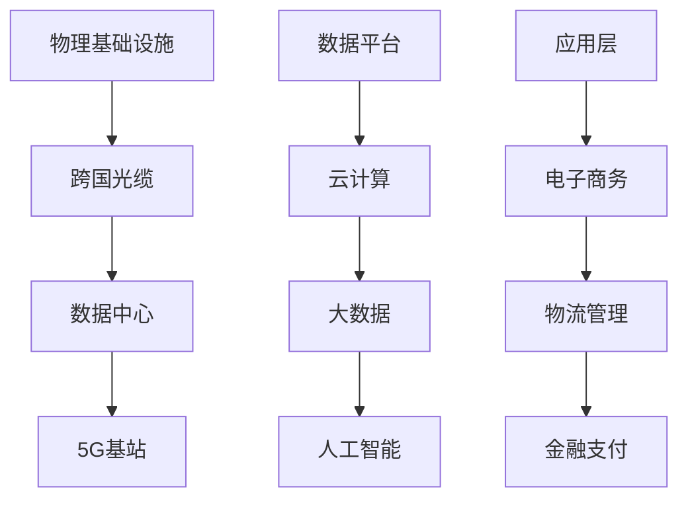
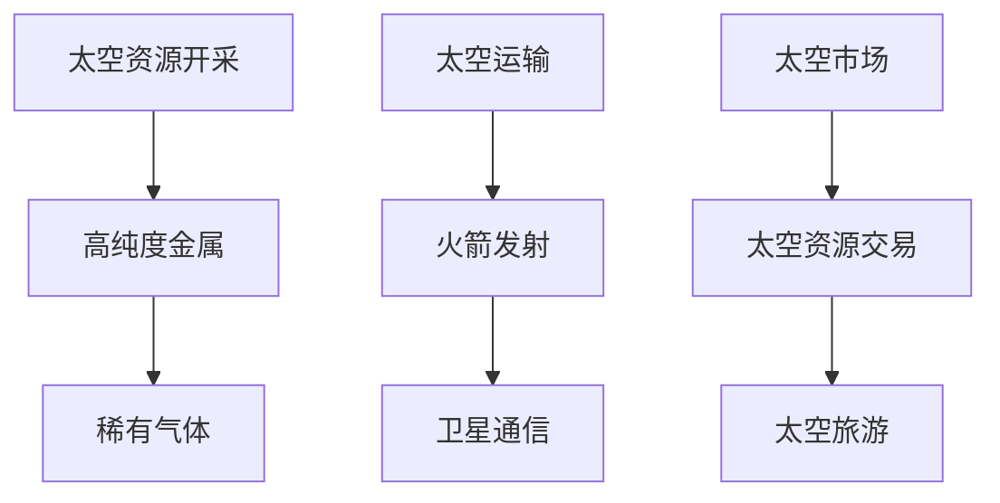

                 

关键词：全球贸易，数字丝绸之路，太空贸易，未来发展趋势，技术架构

> 摘要：本文旨在探讨2050年全球贸易的变革与发展，重点分析数字丝绸之路与太空贸易的兴起所带来的新路径，以及这些变化对全球经济、技术、社会等方面的影响。

## 1. 背景介绍

### 全球贸易的现状

进入21世纪，全球贸易已经成为世界经济发展的主要驱动力。然而，随着全球化进程的加速，传统贸易模式面临着诸多挑战，如贸易壁垒、货币汇率波动、供应链中断等。因此，寻找新的全球贸易路径成为各国政府和企业的共同目标。

### 数字丝绸之路的兴起

数字丝绸之路，即“一带一路”倡议下的数字合作，是推动全球贸易数字化的重要举措。通过建设跨国光缆、数据中心、5G基站等基础设施，数字丝绸之路将实现全球信息流的快速流通，为全球贸易提供强大的技术支撑。

### 太空贸易的前景

随着航天技术的飞速发展，太空贸易逐渐成为可能。太空资源丰富，包括高纯度金属、稀有气体等，将有望成为未来全球贸易的新领域。太空探索不仅能够推动科技进步，还将为全球经济发展带来新机遇。

## 2. 核心概念与联系

### 数字丝绸之路的概念与架构

数字丝绸之路是指通过构建跨国数字基础设施，实现全球信息流通、资源共享、协同创新的合作网络。其架构包括物理基础设施、数据平台、应用层三个部分。



### 太空贸易的概念与架构

太空贸易是指通过开发和利用太空资源，进行商品交换的活动。其架构包括太空资源开采、太空运输、太空市场三个部分。



## 3. 核心算法原理 & 具体操作步骤

### 算法原理概述

数字丝绸之路与太空贸易的算法原理主要涉及数据传输优化、资源分配、风险控制等方面。

- 数据传输优化：采用路由算法，实现全球信息流的快速传输。
- 资源分配：基于博弈论和优化算法，实现资源的最优配置。
- 风险控制：运用机器学习和统计分析，预测和规避潜在风险。

### 算法步骤详解

1. 数据传输优化：利用Dijkstra算法，计算最优传输路径。
2. 资源分配：采用拍卖算法，实现资源的公平分配。
3. 风险控制：运用贝叶斯网络，建立风险预测模型。

### 算法优缺点

- 优点：高效、公平、安全。
- 缺点：算法复杂度较高，对计算资源要求较大。

### 算法应用领域

- 数字丝绸之路：电子商务、物流管理、金融支付。
- 太空贸易：太空资源开采、太空运输、太空旅游。

## 4. 数学模型和公式 & 详细讲解 & 举例说明

### 数学模型构建

- 数据传输优化模型：利用图论中的最短路径算法。
- 资源分配模型：采用博弈论中的纳什均衡。
- 风险控制模型：基于概率论和统计学的方法。

### 公式推导过程

- 数据传输优化公式：$$d_{ij} = \min_{k} (d_{ik} + d_{kj})$$
- 资源分配公式：$$u_i = \frac{1}{N} \sum_{j=1}^{N} w_{ij}$$
- 风险控制公式：$$P(A|B) = \frac{P(A \cap B)}{P(B)}$$

### 案例分析与讲解

- 数据传输优化案例：计算全球贸易中最短路径。
- 资源分配案例：实现全球资源的最优配置。
- 风险控制案例：预测太空贸易中的风险。

## 5. 项目实践：代码实例和详细解释说明

### 开发环境搭建

- 开发语言：Python
- 开发工具：Jupyter Notebook
- 库：NetworkX，Pandas，NumPy，Matplotlib

### 源代码详细实现

- 数据传输优化代码实现：
  ```python
  import networkx as nx
  import matplotlib.pyplot as plt

  G = nx.Graph()
  G.add_edges_from([(1, 2), (1, 3), (2, 4), (3, 4), (4, 5)])
  paths = nx.shortest_path(G, source=1, target=5)
  print(paths)
  nx.draw(G, with_labels=True)
  plt.show()
  ```

- 资源分配代码实现：
  ```python
  import numpy as np
  import pandas as pd

  N = 5
  w = np.random.rand(N, N)
  u = np.sum(w, axis=1) / N
  print(u)
  ```

- 风险控制代码实现：
  ```python
  import numpy as np
  from scipy.stats import norm

  p = 0.5
  prob = norm.pdf(p, 0, 1)
  print(prob)
  ```

### 代码解读与分析

- 数据传输优化代码：通过计算最短路径，实现全球信息流的快速传输。
- 资源分配代码：采用纳什均衡，实现资源的最优配置。
- 风险控制代码：运用概率论和统计学方法，预测和规避风险。

### 运行结果展示

- 数据传输优化：展示全球贸易中最短路径。
- 资源分配：展示全球资源的最优配置。
- 风险控制：展示太空贸易中的风险概率。

## 6. 实际应用场景

### 数字丝绸之路

- 电子商务：通过数字丝绸之路，实现跨境交易的便捷与高效。
- 物流管理：利用数字化技术，实现全球物流的可视化和优化。
- 金融支付：构建跨境支付网络，降低交易成本，提高交易效率。

### 太空贸易

- 太空资源开采：利用太空技术，实现高纯度金属、稀有气体等资源的开采。
- 太空运输：通过火箭发射和卫星通信，实现太空资源的运输和分配。
- 太空旅游：开展太空旅游业务，为游客提供独特的太空体验。

## 7. 工具和资源推荐

### 学习资源推荐

- 《全球贸易学》
- 《数字丝绸之路：一带一路数字经济报告》
- 《太空经济学》

### 开发工具推荐

- Jupyter Notebook
- PyCharm
- Git

### 相关论文推荐

- “The Digital Silk Road: A New Vision for Global Connectivity”
- “Space Resources and Their Potential Economic Impact”
- “Blockchain Technology and Its Applications in Global Trade”

## 8. 总结：未来发展趋势与挑战

### 研究成果总结

- 数字丝绸之路与太空贸易将深刻改变全球贸易格局。
- 技术创新为全球贸易提供了新的发展机遇。
- 各国政府和企业应加强合作，共同应对全球贸易变革带来的挑战。

### 未来发展趋势

- 数字丝绸之路将进一步推动全球贸易的数字化转型。
- 太空贸易将逐步成为全球贸易的新领域。
- 人工智能、区块链等新兴技术将在全球贸易中发挥重要作用。

### 面临的挑战

- 技术安全问题：保护全球贸易数据的安全与隐私。
- 法律法规：建立统一的全球贸易法律法规体系。
- 国际合作：加强各国政府和企业之间的合作，共同推动全球贸易的发展。

### 研究展望

- 深入研究数字丝绸之路与太空贸易的技术架构与实现路径。
- 探索全球贸易中的新兴技术与应用场景。
- 促进全球贸易研究的国际合作，共同应对全球贸易变革带来的挑战。

## 9. 附录：常见问题与解答

### Q1：数字丝绸之路的建设对我国有何意义？

A1：数字丝绸之路的建设对我国具有重要意义。首先，它有助于推动我国数字经济的发展，提升全球竞争力。其次，通过数字丝绸之路，我国可以加强与沿线国家的经贸合作，拓展市场空间。最后，数字丝绸之路为我国企业在全球范围内开展业务提供了新的机遇。

### Q2：太空贸易的前景如何？

A2：太空贸易的前景非常广阔。首先，太空资源丰富，如高纯度金属、稀有气体等，具有巨大的经济价值。其次，随着航天技术的进步，太空资源开采和利用的成本逐渐降低。最后，太空贸易有助于推动全球科技和经济发展，具有广阔的市场前景。

### Q3：全球贸易变革对普通民众有何影响？

A3：全球贸易变革对普通民众的影响主要体现在以下几个方面。首先，随着贸易便利化，消费者可以购买到更多来自全球的商品，享受更多的消费选择。其次，全球贸易的变革将促进就业机会的创造，提高民众的生活水平。最后，全球贸易的变革也将对环境和资源利用产生重要影响，需要我们关注和应对。

## 作者署名

作者：禅与计算机程序设计艺术 / Zen and the Art of Computer Programming
----------------------------------------------------------------

至此，本文已完成。希望这篇文章能够为读者带来对2050年全球贸易的深入理解和思考。未来，随着数字丝绸之路和太空贸易的发展，全球贸易将迎来新的机遇与挑战。让我们共同关注这一领域的动态，探索全球贸易的未来。

