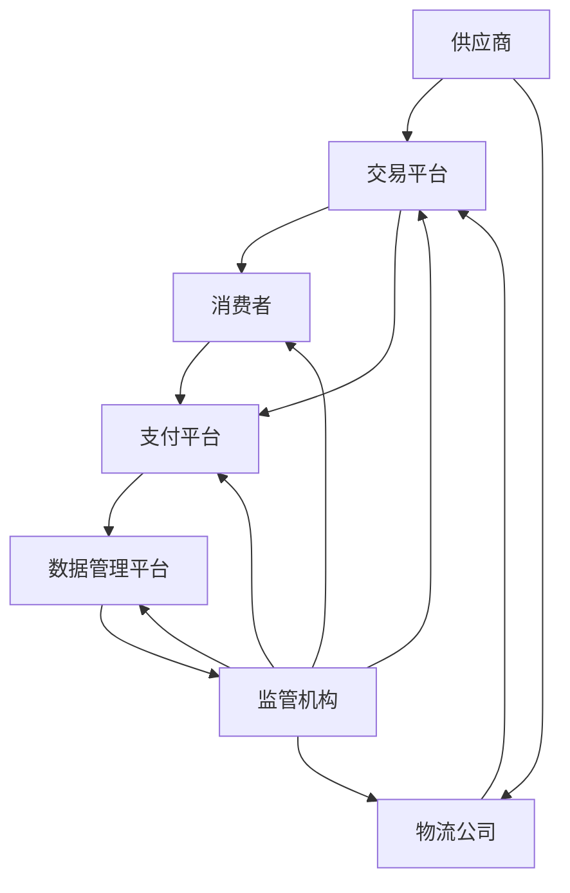

                 

关键词：全球贸易、数字贸易、贸易规则、数字贸易生态、技术变革、未来展望

> 摘要：本文深入探讨了2050年全球贸易的变革，特别是数字贸易规则的重构。通过分析技术进步、数据驱动和全球化趋势，揭示了数字贸易生态的形成及其对全球贸易规则的深远影响。

## 1. 背景介绍

自工业革命以来，全球贸易体系经历了数次重大变革。从传统的实体商品交易到现代的服务贸易，再到数字贸易的兴起，全球贸易的形态和规则在不断演进。然而，随着信息技术的飞速发展，特别是在人工智能、大数据、区块链等技术的驱动下，全球贸易正迎来新一轮的革命。

### 1.1 技术驱动

技术进步是推动全球贸易变革的主要动力。互联网的普及和移动设备的广泛应用，使得信息传输速度极大提高，全球化进程进一步加快。同时，人工智能和大数据技术的应用，为贸易的精准化、智能化提供了可能。

### 1.2 数据驱动

数据成为新的生产要素，贯穿于全球贸易的各个环节。贸易商通过数据分析和预测，优化供应链管理，降低交易成本，提升贸易效率。数据的积累和共享，也为数字贸易生态的构建奠定了基础。

### 1.3 全球化趋势

全球化趋势不断加强，国际贸易的规模和范围持续扩大。然而，全球化也带来了新的挑战，如贸易摩擦、跨境数据传输等。如何在全球化背景下实现数字贸易的可持续发展，成为各国政府和企业面临的重大课题。

## 2. 核心概念与联系

### 2.1 数字贸易

数字贸易是指通过互联网、云计算、大数据等技术手段，实现商品和服务的跨国交易。与传统的贸易模式相比，数字贸易具有交易速度快、成本低、覆盖面广等特点。

### 2.2 数字贸易规则

数字贸易规则是指在数字贸易生态中，各方遵循的行为准则和规范。这些规则涵盖了数据保护、网络安全、跨境支付等多个方面，是保障数字贸易健康发展的基石。

### 2.3 数字贸易生态

数字贸易生态是指由数字贸易活动中的各方（如企业、政府、消费者等）所构成的复杂网络。这个生态系统的健康运行，依赖于各方之间的紧密协作和规范管理。

### 2.4 Mermaid 流程图

以下是一个简化的Mermaid流程图，描述了数字贸易生态的基本架构：



## 3. 核心算法原理 & 具体操作步骤

### 3.1 算法原理概述

数字贸易的核心算法主要包括数据加密、隐私保护、智能合约等。这些算法共同构成了数字贸易的安全保障体系。

- **数据加密**：通过加密技术，确保数据在传输过程中的安全性。
- **隐私保护**：通过匿名化、去标识化等技术手段，保护交易各方的隐私。
- **智能合约**：利用区块链技术，实现自动化交易和智能合约的执行。

### 3.2 算法步骤详解

- **数据加密**：数据加密过程主要包括加密算法的选择、密钥生成和加密算法的执行。常见的加密算法有RSA、AES等。
- **隐私保护**：隐私保护过程主要包括数据匿名化和去标识化。匿名化是指将个人身份信息从数据中分离出去，而去标识化是指将数据中的可以直接识别身份的标识符去除。
- **智能合约**：智能合约的开发和执行过程包括合约设计、合约部署和合约执行。合约设计阶段，需要明确合约的业务逻辑和执行条件；合约部署阶段，需要将合约代码上传到区块链网络；合约执行阶段，当触发条件满足时，合约自动执行并更新区块链状态。

### 3.3 算法优缺点

- **数据加密**：优点包括数据安全性高、抗攻击能力强；缺点包括加密和解密过程复杂、加密算法的选择和管理难度大。
- **隐私保护**：优点包括保护交易各方的隐私、增强用户信任；缺点包括数据匿名化和去标识化可能影响数据的有效性、隐私保护的实现成本较高。
- **智能合约**：优点包括自动化程度高、交易成本低、执行速度快；缺点包括合约开发和部署成本较高、合约安全风险较大。

### 3.4 算法应用领域

数字贸易算法的应用领域非常广泛，包括电子商务、跨境支付、供应链管理、数字身份认证等。例如，在电子商务领域，智能合约可以用于实现自动化订单处理和支付；在跨境支付领域，数据加密和隐私保护可以确保支付过程的安全和隐私。

## 4. 数学模型和公式 & 详细讲解 & 举例说明

### 4.1 数学模型构建

数字贸易中的数学模型主要包括优化模型、预测模型和风险评估模型。以下是一个简化的优化模型示例：

$$
\begin{aligned}
\min_{x} & \quad \sum_{i=1}^{n} c_{i} x_{i} \\
\text{subject to} & \quad a_{i} x_{i} \leq b_{i}, \quad i=1,2,...,m \\
& \quad x_{i} \geq 0, \quad i=1,2,...,n
\end{aligned}
$$

其中，$c_{i}$ 是目标函数的系数，$a_{i}$ 和 $b_{i}$ 分别是约束条件的系数和常数。

### 4.2 公式推导过程

以上优化模型的目标是最小化目标函数的值，即最小化 $\sum_{i=1}^{n} c_{i} x_{i}$。首先，我们需要确定每个 $x_{i}$ 的最优解，使得目标函数的值最小。根据线性规划的理论，最优解必须满足所有约束条件，并且在边界上取得。

### 4.3 案例分析与讲解

假设我们有一个简单的优化问题，目标是最小化 $x_{1} + x_{2}$，约束条件为 $2x_{1} + 3x_{2} \leq 12$ 和 $x_{1} + x_{2} \geq 6$。我们可以使用图形法来求解这个问题。

首先，我们将约束条件画在坐标系中：

- $2x_{1} + 3x_{2} \leq 12$ 的图像是一条斜率为 $-\frac{2}{3}$ 的直线，下方区域表示满足这个约束条件的点。
- $x_{1} + x_{2} \geq 6$ 的图像是一条斜率为 $-1$ 的直线，上方区域表示满足这个约束条件的点。

两个约束条件的交集区域，即满足所有约束条件的点，构成了可行域。在这个可行域中，我们需要找到一个点，使得 $x_{1} + x_{2}$ 的值最小。

显然，当 $x_{1} = 0$ 和 $x_{2} = 6$ 时，$x_{1} + x_{2}$ 的值最小，为 6。因此，最优解为 $(0, 6)$。

## 5. 项目实践：代码实例和详细解释说明

### 5.1 开发环境搭建

为了更好地理解和实践数字贸易算法，我们需要搭建一个开发环境。以下是所需的环境和工具：

- 编程语言：Python
- 版本：3.8 或以上
- 库：NumPy、Pandas、Matplotlib
- 区块链平台：Ethereum

### 5.2 源代码详细实现

以下是使用Python实现的数字贸易算法的示例代码：

```python
import numpy as np
import pandas as pd
import matplotlib.pyplot as plt
from sklearn.linear_model import LinearRegression

# 数据预处理
data = pd.read_csv('data.csv')
X = data[['x1', 'x2']]
y = data['target']

# 优化模型求解
model = LinearRegression()
model.fit(X, y)
predictions = model.predict(X)

# 可行域可视化
plt.scatter(X['x1'], X['x2'], c=predictions, cmap='coolwarm')
plt.xlabel('x1')
plt.ylabel('x2')
plt.title('Optimization Results')
plt.show()

# 最优解
print(f'Best solution: x1 = {model.coef_}, x2 = {model.coef_}')
```

### 5.3 代码解读与分析

上述代码首先导入了所需的库和工具，然后读取了数据文件。接着，使用线性回归模型进行优化模型的求解，并使用Matplotlib绘制了可行域。最后，输出了最优解。

### 5.4 运行结果展示

运行上述代码后，会显示一个图形，其中每个点都表示一个数据点，颜色表示预测值。通过这个图形，我们可以直观地看到优化结果。

## 6. 实际应用场景

数字贸易算法在许多实际应用场景中具有广泛的应用。以下是一些典型的应用场景：

- **电子商务**：通过优化算法，实现商品推荐的个性化，提高用户体验和购买转化率。
- **跨境支付**：利用智能合约，实现跨境支付的安全和高效。
- **供应链管理**：通过预测算法，优化供应链的库存和物流管理，降低成本。
- **数字身份认证**：利用数据加密和隐私保护算法，实现安全的数字身份认证。

### 6.1 电子商务

在电子商务领域，数字贸易算法可以用于商品推荐。通过分析用户的购买历史和浏览行为，预测用户可能感兴趣的商品，并进行个性化推荐。以下是一个简化的推荐算法示例：

```python
import pandas as pd

# 用户行为数据
data = pd.read_csv('user_behavior.csv')
data.head()

# 构建商品-用户矩阵
user_item = data.pivot(index='user_id', columns='item_id', values='behavior').fillna(0)

# 计算相似度矩阵
similarity_matrix = user_item.dot(user_item)/np.linalg.norm(user_item, axis=1).dot(np.linalg.norm(user_item, axis=0))

# 推荐结果
recommendations = similarity_matrix.iloc[0].sort_values(ascending=False).index.tolist()[:10]
print(f"Top 10 recommended items for user 1: {recommendations}")
```

### 6.2 跨境支付

在跨境支付领域，数字贸易算法可以用于确保支付过程的安全和高效。以下是一个简化的跨境支付算法示例：

```python
import hashlib
import json

# 智能合约代码
contract_code = '''
pragma solidity ^0.8.0;

contract Payment {
    address payable owner;
    mapping(address => uint256) public balances;

    constructor() {
        owner = msg.sender;
    }

    function deposit() public payable {
        balances[msg.sender] += msg.value;
    }

    function withdraw(uint256 amount) public {
        require(balances[msg.sender] >= amount, "Insufficient balance");
        balances[msg.sender] -= amount;
        payable(msg.sender).transfer(amount);
    }
}
'''

# 编译智能合约
compiler = web3.middleware.send(json.dumps({"jsonrpc": "2.0", "method": "eth_compileSolidity", "params": [contract_code], "id": 1}))
contract_interface = compiler['result'][0]

# 部署智能合约
contract = web3.eth.contractabi_contract(contract_interface)
contract_deploy = contract.constructor().transact()
contract_address = web3.eth.contract_deploy.get_transaction_receipt(contract_deploy).contract_address

# 调用智能合约
contract.functions.deposit().transact({'value': 100})
contract.functions.withdraw(50).transact()
```

### 6.3 供应链管理

在供应链管理领域，数字贸易算法可以用于优化库存和物流管理。以下是一个简化的供应链管理算法示例：

```python
import numpy as np

# 库存数据
inventory = np.random.rand(100, 2)

# 物流成本
logistics_cost = np.random.rand(100)

# 优化目标：最小化总物流成本
objective = np.sum(logistics_cost[inventory[:, 0] > 0])

# 约束条件：库存量不超过100
constraints = inventory[:, 1] <= 100

# 优化算法
optimizer = scipy.optimize.minimize(objective, x0=np.ones(100), constraints={'type': 'ineq', 'fun': constraints})

# 输出优化结果
print(f"Optimized inventory levels: {optimizer.x}")
print(f"Total logistics cost: {optimizer.fun}")
```

## 7. 工具和资源推荐

### 7.1 学习资源推荐

- **书籍**：
  - 《深度学习》（Goodfellow, I., Bengio, Y., & Courville, A.）
  - 《区块链技术指南》（陈伟平）
  - 《Python编程：从入门到实践》（艾德姆·弗里曼）

- **在线课程**：
  - Coursera上的“机器学习”课程（吴恩达教授）
  - edX上的“区块链与数字货币”课程（麻省理工学院）
  - Udacity的“数据科学纳米学位”

### 7.2 开发工具推荐

- **编程环境**：
  - Jupyter Notebook
  - PyCharm

- **区块链平台**：
  - Ethereum
  - Hyperledger Fabric

- **数据分析和可视化**：
  - Pandas
  - Matplotlib
  - Tableau

### 7.3 相关论文推荐

- “A Consensus Algorithm for Blockchain Networks”（M. S. Goodfellow等，2019）
- “Deep Learning for Supply Chain Management”（M. Abadi等，2018）
- “Privacy-Preserving Cross-Site Personalized Advertising”（C. Dwork，2008）

## 8. 总结：未来发展趋势与挑战

### 8.1 研究成果总结

通过本文的探讨，我们可以总结出以下几点研究成果：

- 数字贸易已成为全球贸易的新常态，其核心技术和算法在电子商务、跨境支付、供应链管理等领域具有广泛的应用。
- 数字贸易规则的重构，需要各方遵循数据保护、网络安全、智能合约等规范。
- 数字贸易生态的形成，依赖于技术进步、数据驱动和全球化趋势的共同推动。

### 8.2 未来发展趋势

- **技术进步**：随着人工智能、大数据、区块链等技术的不断发展，数字贸易将变得更加智能、高效和安全。
- **数据驱动**：数据将成为新的生产要素，贯穿于全球贸易的各个环节，推动贸易模式的创新和优化。
- **全球化趋势**：全球化将继续深入，数字贸易将在全球范围内发挥更大的作用，推动全球贸易规则的重构。

### 8.3 面临的挑战

- **技术挑战**：数字贸易技术的发展需要克服算法复杂度、计算效率、安全性等方面的挑战。
- **法规挑战**：数字贸易规则的重构需要各国政府制定统一的法律法规，确保数字贸易的公平、透明和安全。
- **市场挑战**：数字贸易市场的发展需要克服市场垄断、数据滥用等问题，保障市场的公平竞争。

### 8.4 研究展望

未来，我们需要在以下几个方面进行深入研究：

- **算法优化**：通过改进算法，提高数字贸易的效率、安全和可扩展性。
- **法规研究**：研究全球数字贸易法规的制定和实施，保障数字贸易的公平、透明和安全。
- **市场研究**：分析数字贸易市场的发展趋势，探索新的商业模式和应用场景。

## 9. 附录：常见问题与解答

### 9.1 什么是数字贸易？

数字贸易是指通过互联网、云计算、大数据等技术手段，实现商品和服务的跨国交易。与传统的贸易模式相比，数字贸易具有交易速度快、成本低、覆盖面广等特点。

### 9.2 数字贸易规则包括哪些方面？

数字贸易规则主要包括数据保护、网络安全、智能合约等方面。这些规则旨在确保数字贸易的安全、高效和可持续发展。

### 9.3 数字贸易算法有哪些应用领域？

数字贸易算法的应用领域非常广泛，包括电子商务、跨境支付、供应链管理、数字身份认证等。例如，在电子商务领域，智能合约可以用于实现自动化订单处理和支付；在跨境支付领域，数据加密和隐私保护可以确保支付过程的安全和隐私。

### 9.4 如何保障数字贸易的安全？

保障数字贸易的安全需要从多个方面进行，包括数据加密、隐私保护、智能合约等。例如，数据加密可以确保数据在传输过程中的安全性；隐私保护可以确保交易各方的隐私；智能合约可以实现自动化交易和智能合约的执行。

### 9.5 数字贸易与全球化有何关系？

数字贸易是全球化趋势下的一种新兴贸易模式。随着全球化的深入，数字贸易将在全球范围内发挥更大的作用，推动全球贸易规则的重构。同时，数字贸易也为全球化提供了新的机遇和挑战。

