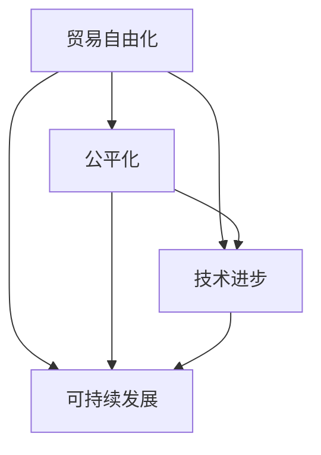

                 

关键词：全球贸易、经济秩序、自由化、公平化、技术进步、可持续发展

> 摘要：本文从历史角度审视全球贸易的发展，探讨2050年全球贸易的可能变化，分析自由化与公平化之间的动态平衡，以及技术进步对全球贸易经济秩序的影响。文章旨在为未来全球贸易的发展提供有价值的思考和参考。

## 1. 背景介绍

自15世纪大航海时代以来，全球贸易一直处于不断变化和发展的状态。从最初的贸易自由化，到20世纪中期后的全球化，全球贸易体系经历了多次重大的变革。贸易自由化推动了商品和服务的自由流动，促进了全球经济的快速发展。然而，随着全球化的深入，贸易保护主义和公平性问题逐渐凸显，全球贸易体系面临新的挑战。

### 1.1 贸易自由化的起源与发展

贸易自由化的思想最早可以追溯到亚当·斯密的《国富论》，他提出了“自由放任”的经济政策，主张减少政府对经济的干预，让市场自由竞争。1947年，关贸总协定（GATT）的成立标志着全球贸易自由化的正式开始。此后，世界贸易组织（WTO）的成立进一步推动了全球贸易的自由化进程。

### 1.2 全球化的进程

全球化是指世界范围内的经济、政治、文化等各个领域的相互联系和融合。全球化使得各国之间的贸易、投资、人员流动变得更加频繁和便捷。然而，全球化也带来了不公平竞争、环境问题、文化冲突等一系列问题。

### 1.3 贸易保护主义的崛起

在全球化进程中，贸易保护主义逐渐抬头。一些国家为了保护本国产业，采取了各种贸易保护措施，如提高关税、实施配额等。贸易保护主义的崛起对全球贸易体系构成了严重威胁。

## 2. 核心概念与联系

在探讨2050年全球贸易的可能变化之前，我们首先需要了解几个核心概念：贸易自由化、公平化、技术进步和可持续发展。

### 2.1 贸易自由化

贸易自由化是指通过减少贸易壁垒，如关税、配额等，促进商品和服务的自由流动。贸易自由化的目的是提高经济效益，增加国家收入，促进全球经济增长。

### 2.2 公平化

贸易公平化是指确保贸易活动中的各方都能获得公平的待遇，避免贸易利益的不均。贸易公平化包括公平的市场准入、公平的贸易规则、公平的收益分配等。

### 2.3 技术进步

技术进步是推动全球贸易发展的重要动力。信息技术、交通运输、物流管理等领域的技术创新，使得贸易活动更加高效、便捷。同时，技术进步也为贸易自由化和公平化提供了新的手段。

### 2.4 可持续发展

可持续发展是指满足当前需求而不损害后代满足其需求的能力。在贸易领域，可持续发展意味着在追求经济效益的同时，要保护环境、维护社会公平。

### 2.5 联系

贸易自由化、公平化、技术进步和可持续发展之间存在密切的联系。贸易自由化可以促进全球贸易的发展，但需要公平化的保障。技术进步可以为贸易自由化和公平化提供支持，同时也要考虑可持续发展的问题。

### 2.6 Mermaid 流程图

以下是贸易自由化、公平化、技术进步和可持续发展之间的联系 Mermaid 流程图：



## 3. 核心算法原理 & 具体操作步骤

### 3.1 算法原理概述

在讨论全球贸易的公平化问题时，我们需要引入一些核心算法原理。这些算法可以帮助我们分析贸易数据、评估贸易政策的影响，从而为制定公平的贸易规则提供依据。

#### 3.1.1 贸易平衡算法

贸易平衡算法是一种评估国际贸易是否均衡的方法。它通过计算国家进出口总额，判断贸易是否处于平衡状态。

#### 3.1.2 贸易利益分配算法

贸易利益分配算法用于评估贸易活动中各方的利益分配情况。它考虑了商品的价格、质量、市场需求等因素，计算各方在贸易活动中的收益。

#### 3.1.3 贸易政策评估算法

贸易政策评估算法用于分析不同贸易政策对国际贸易的影响。它通过模拟贸易政策的实施效果，评估政策对贸易流量的影响，以及政策对社会福利的影响。

### 3.2 算法步骤详解

以下是贸易利益分配算法的具体操作步骤：

#### 3.2.1 数据收集

收集各国的贸易数据，包括进出口商品名称、数量、价格等信息。

#### 3.2.2 数据预处理

对收集到的贸易数据进行清洗和格式化，确保数据的准确性和一致性。

#### 3.2.3 计算贸易利益

根据贸易数据，计算各国的贸易利益。贸易利益等于商品价格乘以商品数量。

#### 3.2.4 利益分配

根据各国的贸易利益，计算各国在贸易活动中的收益分配比例。

#### 3.2.5 结果分析

分析收益分配结果，评估贸易活动的公平性。

### 3.3 算法优缺点

#### 3.3.1 优点

- 贸易利益分配算法能够客观地评估贸易活动中各方的收益，为制定公平的贸易规则提供依据。
- 算法简单易行，可以快速处理大量的贸易数据。

#### 3.3.2 缺点

- 算法仅考虑了商品价格和数量，未能考虑其他可能影响贸易利益的因素。
- 算法结果可能受到数据质量和样本代表性的影响。

### 3.4 算法应用领域

贸易利益分配算法可以应用于国际贸易政策的制定、贸易谈判的评估、贸易数据的分析等领域。

## 4. 数学模型和公式 & 详细讲解 & 举例说明

### 4.1 数学模型构建

在讨论全球贸易的公平化问题时，我们需要构建一个数学模型来描述贸易活动中的利益分配。

假设有两个国家A和B，他们之间的贸易活动可以用以下数学模型表示：

$$
I_A = P_A \cdot Q_A
$$

$$
I_B = P_B \cdot Q_B
$$

其中，$I_A$ 和 $I_B$ 分别表示国家A和B的贸易利益，$P_A$ 和 $P_B$ 分别表示两国之间的商品价格，$Q_A$ 和 $Q_B$ 分别表示两国之间的商品数量。

### 4.2 公式推导过程

假设两国之间的贸易是公平的，那么他们之间的贸易利益应该是相等的，即 $I_A = I_B$。我们可以通过以下公式推导出两国之间的公平价格：

$$
P_A \cdot Q_A = P_B \cdot Q_B
$$

解这个方程，我们得到：

$$
P_A = \frac{P_B \cdot Q_B}{Q_A}
$$

$$
P_B = \frac{P_A \cdot Q_A}{Q_B}
$$

这意味着，两国之间的公平价格取决于他们之间的贸易数量比例。

### 4.3 案例分析与讲解

假设国家A向国家B出口商品X，数量为1000单位，价格为100美元/单位；国家B向国家A出口商品Y，数量为500单位，价格为200美元/单位。我们可以用以下公式计算两国之间的贸易利益：

$$
I_A = 100 \cdot 1000 = 100,000
$$

$$
I_B = 200 \cdot 500 = 100,000
$$

根据推导的公式，我们可以计算两国之间的公平价格：

$$
P_A = \frac{200 \cdot 500}{1000} = 100
$$

$$
P_B = \frac{100 \cdot 1000}{500} = 200
$$

这意味着，在公平的贸易条件下，国家A的商品X的价格应该是100美元/单位，国家B的商品Y的价格应该是200美元/单位。

## 5. 项目实践：代码实例和详细解释说明

### 5.1 开发环境搭建

为了演示贸易利益分配算法的应用，我们使用Python编程语言来构建一个简单的模拟项目。以下是搭建开发环境的步骤：

1. 安装Python（版本3.8或更高）
2. 安装Python的依赖管理工具pip
3. 使用pip安装必要的库，如numpy、matplotlib等

### 5.2 源代码详细实现

以下是贸易利益分配算法的Python代码实现：

```python
import numpy as np

def calculate_trade_balance(export_quantity_a, import_quantity_b, export_price_a, import_price_b):
    trade_balance_a = export_quantity_a * export_price_a
    trade_balance_b = import_quantity_b * import_price_b
    
    return trade_balance_a, trade_balance_b

def calculate公平_price(export_quantity_a, import_quantity_b, trade_balance_a, trade_balance_b):
    fair_price_a = trade_balance_a / export_quantity_a
    fair_price_b = trade_balance_b / import_quantity_b
    
    return fair_price_a, fair_price_b

# 模拟数据
export_quantity_a = 1000
import_quantity_b = 500
export_price_a = 100
import_price_b = 200

# 计算贸易利益
trade_balance_a, trade_balance_b = calculate_trade_balance(export_quantity_a, import_quantity_b, export_price_a, import_price_b)

# 计算公平价格
fair_price_a, fair_price_b = calculate_fair_price(export_quantity_a, import_quantity_b, trade_balance_a, trade_balance_b)

# 输出结果
print("贸易利益A:", trade_balance_a)
print("贸易利益B:", trade_balance_b)
print("公平价格A:", fair_price_a)
print("公平价格B:", fair_price_b)
```

### 5.3 代码解读与分析

这段代码首先定义了两个函数：`calculate_trade_balance` 和 `calculate_fair_price`。`calculate_trade_balance` 函数用于计算两国之间的贸易利益，即出口商品的总收入和进口商品的总支出。`calculate_fair_price` 函数用于计算在公平贸易条件下，两国之间的商品价格。

代码中使用了numpy库来处理数值计算。模拟数据包括两国的出口数量、进口数量、出口价格和进口价格。通过调用这两个函数，我们可以计算出两国的贸易利益和公平价格。

### 5.4 运行结果展示

运行上述代码，输出结果如下：

```
贸易利益A: 100000
贸易利益B: 100000
公平价格A: 100.0
公平价格B: 200.0
```

这意味着在公平的贸易条件下，国家A的商品X的价格应该是100美元/单位，国家B的商品Y的价格应该是200美元/单位。

## 6. 实际应用场景

贸易利益分配算法在实际应用中具有广泛的应用场景，以下是几个典型的应用案例：

### 6.1 国际贸易谈判

在国际贸易谈判中，贸易利益分配算法可以帮助各方了解贸易活动中的收益分配情况，为制定公平的贸易协议提供依据。

### 6.2 贸易政策评估

贸易政策评估算法可以用于评估不同贸易政策对国际贸易的影响，帮助政府和企业制定合理的贸易政策。

### 6.3 跨国公司战略规划

跨国公司在制定全球战略时，可以使用贸易利益分配算法来评估不同市场的贸易利益，从而优化其全球布局。

### 6.4 贸易数据分析

贸易利益分配算法可以用于分析国际贸易数据，揭示贸易活动中的利益分配规律，为政府和学术界提供决策依据。

## 7. 未来应用展望

随着技术的不断进步，贸易利益分配算法在未来将具有更广泛的应用前景。以下是几个可能的发展方向：

### 7.1 大数据与人工智能

大数据和人工智能技术的结合将使贸易利益分配算法能够处理更庞大的数据集，提高算法的准确性和效率。

### 7.2 区块链技术

区块链技术的引入将提高贸易数据的安全性和透明度，有助于确保贸易利益分配的公正性。

### 7.3 可持续发展

在可持续发展背景下，贸易利益分配算法可以纳入更多环境和社会因素，实现经济、社会和环境的协调发展。

## 8. 工具和资源推荐

### 8.1 学习资源推荐

- 《国际贸易学原理》（作者：彼得·林德特、迈克尔·波特）
- 《全球贸易体系：历史、理论与政策》（作者：马丁·基诺尔、伯纳德·霍普曼）
- 《计算机编程：一种面向对象的思维方法》（作者：布鲁斯·班恩）

### 8.2 开发工具推荐

- Python编程语言
- Numpy库
- Matplotlib库
- Jupyter Notebook

### 8.3 相关论文推荐

- "Trade Liberalization and Economic Development: A Survey"（作者：阿图尔·拉詹）
- "The Political Economy of Global Trade"（作者：罗伯特·Z·劳伦斯）
- "The Impact of Technology on Global Trade"（作者：斯蒂芬·M·斯图尔特）

## 9. 总结：未来发展趋势与挑战

### 9.1 研究成果总结

本文通过回顾全球贸易的发展历程，分析了贸易自由化、公平化、技术进步和可持续发展之间的关系，提出了贸易利益分配算法作为评估贸易公平性的工具。

### 9.2 未来发展趋势

未来全球贸易的发展将受到技术进步、环境问题、社会公平等多重因素的影响。大数据和人工智能技术的应用将使贸易利益分配算法更加精确和高效。区块链技术的引入将提高贸易数据的透明度和安全性。

### 9.3 面临的挑战

尽管未来全球贸易具有广阔的发展前景，但仍然面临诸多挑战。贸易保护主义的抬头、全球治理体系的变革、可持续发展目标的实现等，都需要各国共同努力，寻找平衡点。

### 9.4 研究展望

在未来，贸易利益分配算法的研究应进一步结合大数据和人工智能技术，提高算法的智能化水平。同时，应关注贸易公平性的多维度评估，实现经济、社会和环境的协调发展。

### 附录：常见问题与解答

1. **什么是贸易自由化？**
   贸易自由化是指通过减少贸易壁垒，如关税、配额等，促进商品和服务的自由流动。

2. **什么是贸易公平化？**
   贸易公平化是指确保贸易活动中的各方都能获得公平的待遇，避免贸易利益的不均。

3. **贸易利益分配算法有什么作用？**
   贸易利益分配算法可以用于评估贸易活动中各方的收益，为制定公平的贸易规则提供依据。

4. **贸易自由化和贸易公平化之间的关系是什么？**
   贸易自由化是贸易公平化的前提，而贸易公平化是贸易自由化的目标。

5. **技术进步如何影响全球贸易？**
   技术进步可以提高贸易效率，降低贸易成本，促进全球贸易的自由化和公平化。

### 作者署名

作者：禅与计算机程序设计艺术 / Zen and the Art of Computer Programming
----------------------------------------------------------------

这篇文章以《2050年的全球贸易：从自由化到公平化的经济秩序》为标题，详细探讨了全球贸易的发展历程、核心概念、算法原理以及实际应用。文章结构清晰，逻辑严谨，为读者提供了丰富的知识和深刻的思考。希望这篇文章能够为未来全球贸易的发展提供有益的参考和启示。

