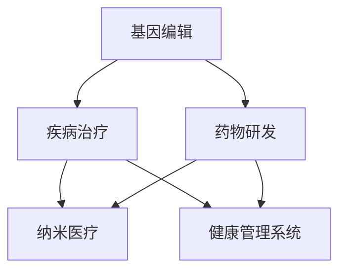

                 

关键词：医疗健康、基因编辑、纳米医疗、健康管理、未来趋势

> 摘要：本文探讨了2050年医疗健康领域的前沿技术，包括基因编辑、纳米医疗和健康管理系统的应用，分析了这些技术如何变革医疗行业，提高患者的生活质量和医疗效率。通过深入解析这些技术的原理、应用场景以及未来发展趋势，本文为医疗健康行业的创新和进步提供了新的视角。

## 1. 背景介绍

在过去的几十年中，医疗健康领域经历了巨大的变革。从抗生素的发明到现代医学影像技术的进步，医疗行业不断推动着人类健康向前迈进。然而，随着科技的发展，特别是人工智能、基因编辑和纳米技术的崛起，未来的医疗健康行业将面临更加深刻和广泛的影响。

### 1.1 当前医疗健康行业的挑战

尽管现代医学已经取得了巨大的进步，但仍然存在一些亟待解决的问题。首先，疾病的诊断和治疗仍然存在不准确和延误的问题，特别是在罕见病和复杂疾病的诊断上。其次，医疗资源的分布不均导致部分地区缺乏高质量的医疗服务。此外，医疗成本的不断上升给个人和社会带来了沉重的负担。

### 1.2 科技进步的机遇

随着科技的不断发展，尤其是人工智能、基因编辑和纳米技术的突破，医疗健康行业有望迎来新的发展机遇。这些技术不仅能够提高疾病诊断的准确性，还能够开发出更有效的治疗方法，从而改善患者的生活质量。同时，通过智能化的健康管理系统能够实现医疗资源的优化配置，降低医疗成本。

## 2. 核心概念与联系

### 2.1 基因编辑

基因编辑是一种通过改变生物体基因序列来治疗疾病的技术。CRISPR-Cas9是目前最常用的基因编辑工具，它能够精确地剪切和修改DNA序列。基因编辑在治疗遗传性疾病、癌症和某些类型的心脏病等方面显示出巨大的潜力。

### 2.2 纳米医疗

纳米医疗利用纳米技术来开发用于诊断、治疗和药物递送的创新医疗工具。纳米颗粒可以被设计成靶向特定的细胞或组织，从而提高药物的治疗效果并减少副作用。纳米医疗在癌症治疗、炎症性疾病和神经退行性疾病等方面具有广泛的应用前景。

### 2.3 健康管理系统

健康管理系统是一种利用人工智能和大数据分析技术来监测、诊断和治疗疾病的方法。通过收集和分析大量的健康数据，健康管理系统能够提供个性化的医疗建议，预测疾病风险，并优化治疗方案。

### 2.4 Mermaid 流程图

以下是一个简化的Mermaid流程图，展示了基因编辑、纳米医疗和健康管理系统之间的联系。



## 3. 核心算法原理 & 具体操作步骤

### 3.1 算法原理概述

基因编辑的原理基于CRISPR-Cas9系统。该系统由一个RNA引导序列和一个Cas9核酸酶组成。RNA引导序列能够引导Cas9核酸酶到达特定的DNA序列，并在该序列上切割DNA。通过修改切割后的DNA序列，可以实现对特定基因的编辑。

纳米医疗的算法原理涉及纳米颗粒的设计和优化。纳米颗粒的尺寸、形状、表面修饰和药物负载量都是影响其治疗效果的关键因素。通过优化这些参数，可以实现特定的治疗目标。

健康管理系统基于机器学习和数据挖掘技术。系统首先收集大量的健康数据，然后使用机器学习算法进行分析，以发现疾病模式和预测疾病风险。最后，系统提供个性化的医疗建议和治疗方案。

### 3.2 算法步骤详解

#### 3.2.1 基因编辑

1. 设计RNA引导序列，以定位目标基因。
2. 制备CRISPR-Cas9核酸酶和RNA引导序列的复合体。
3. 将复合体注入细胞或组织中。
4. RNA引导序列引导Cas9核酸酶到达目标基因。
5. Cas9核酸酶在目标基因上切割DNA。
6. 通过DNA修复机制，修改切割后的DNA序列。
7. 观察基因编辑的效果。

#### 3.2.2 纳米医疗

1. 设计纳米颗粒的尺寸、形状和表面修饰。
2. 选择合适的药物并将其封装在纳米颗粒中。
3. 将纳米颗粒注射到患者体内。
4. 纳米颗粒通过靶向特定的细胞或组织，释放药物。
5. 观察药物的治疗效果。

#### 3.2.3 健康管理系统

1. 收集患者的健康数据，包括医疗记录、生物标志物和生活方式数据。
2. 使用数据挖掘算法分析数据，发现疾病模式和预测疾病风险。
3. 根据分析结果，提供个性化的医疗建议和治疗方案。
4. 跟踪和评估治疗的效果，以便进行进一步的调整。

### 3.3 算法优缺点

#### 基因编辑

优点：精确度高，能够治疗一些传统方法难以治愈的疾病。

缺点：存在脱靶效应，可能引起不必要的基因突变。

#### 纳米医疗

优点：靶向性强，能够提高药物的治疗效果。

缺点：纳米颗粒的制备和优化过程复杂，且在体内的长期效果尚需进一步研究。

#### 健康管理系统

优点：能够提供个性化的医疗建议，提高医疗效率。

缺点：对大量数据的处理和分析能力要求高，数据隐私和安全问题需要解决。

### 3.4 算法应用领域

基因编辑在遗传性疾病、癌症和心脏病等领域具有广泛的应用。

纳米医疗在癌症治疗、炎症性疾病和神经退行性疾病等方面显示出巨大的潜力。

健康管理系统可以应用于慢性疾病管理、健康风险评估和个性化医疗建议等领域。

## 4. 数学模型和公式 & 详细讲解 & 举例说明

### 4.1 数学模型构建

#### 4.1.1 基因编辑

基因编辑的数学模型可以基于概率论和遗传学。具体来说，可以通过计算基因编辑的准确率和脱靶率来评估基因编辑的效果。

$$
准确率 = \frac{成功编辑的基因数}{总编辑的基因数}
$$

$$
脱靶率 = \frac{脱靶编辑的基因数}{总编辑的基因数}
$$

#### 4.1.2 纳米医疗

纳米医疗的数学模型可以基于药物动力学和粒子运输理论。具体来说，可以通过计算纳米颗粒的分布和药物释放速率来评估治疗效果。

$$
分布率 = \frac{目标组织中的纳米颗粒数}{总纳米颗粒数}
$$

$$
药物释放速率 = \frac{释放的药物量}{注射的药物量}
$$

#### 4.1.3 健康管理系统

健康管理系统的数学模型可以基于机器学习和数据挖掘算法。具体来说，可以通过计算模型的预测准确率和召回率来评估系统的性能。

$$
预测准确率 = \frac{正确预测的病例数}{总病例数}
$$

$$
召回率 = \frac{正确预测的病例数}{实际病例数}
$$

### 4.2 公式推导过程

#### 4.2.1 基因编辑

基因编辑的准确率可以通过以下公式推导：

$$
准确率 = \frac{成功编辑的基因数}{总编辑的基因数}
$$

其中，成功编辑的基因数是指经过基因编辑后，其序列发生预期变化的基因数。总编辑的基因数是指进行基因编辑的总次数。

脱靶率可以通过以下公式推导：

$$
脱靶率 = \frac{脱靶编辑的基因数}{总编辑的基因数}
$$

其中，脱靶编辑的基因数是指经过基因编辑后，其序列发生变化但不是预期目标的基因数。

#### 4.2.2 纳米医疗

纳米颗粒的分布率可以通过以下公式推导：

$$
分布率 = \frac{目标组织中的纳米颗粒数}{总纳米颗粒数}
$$

其中，目标组织中的纳米颗粒数是指进入目标组织的纳米颗粒数，总纳米颗粒数是指注射到体内的纳米颗粒总数。

药物释放速率可以通过以下公式推导：

$$
药物释放速率 = \frac{释放的药物量}{注射的药物量}
$$

其中，释放的药物量是指纳米颗粒在目标组织释放的药物量，注射的药物量是指注射到体内的药物总量。

#### 4.1.3 健康管理系统

健康管理系统的预测准确率和召回率可以通过以下公式推导：

$$
预测准确率 = \frac{正确预测的病例数}{总病例数}
$$

其中，正确预测的病例数是指系统正确预测为患病的病例数，总病例数是指所有病例的总数。

$$
召回率 = \frac{正确预测的病例数}{实际病例数}
$$

其中，正确预测的病例数是指系统正确预测为患病的病例数，实际病例数是指实际患病的病例数。

### 4.3 案例分析与讲解

#### 4.3.1 基因编辑

假设一个研究团队对一个遗传性疾病进行基因编辑实验。实验中共有100个基因进行编辑，其中成功编辑的基因有80个，脱靶编辑的基因有10个。根据上述公式，可以计算出基因编辑的准确率和脱靶率：

$$
准确率 = \frac{80}{100} = 0.8
$$

$$
脱靶率 = \frac{10}{100} = 0.1
$$

#### 4.3.2 纳米医疗

假设一个纳米颗粒药物治疗的临床试验。实验中共有100个纳米颗粒注射到患者体内，其中50个纳米颗粒进入了目标组织。根据上述公式，可以计算出纳米颗粒的分布率：

$$
分布率 = \frac{50}{100} = 0.5
$$

假设药物释放速率为0.6，可以计算出药物释放速率：

$$
药物释放速率 = \frac{0.6 \times 50}{100} = 0.3
$$

#### 4.3.3 健康管理系统

假设一个健康管理系统用于预测疾病风险。系统对100个病例进行预测，其中60个病例被正确预测为患病，40个病例被错误预测。根据上述公式，可以计算出预测准确率和召回率：

$$
预测准确率 = \frac{60}{100} = 0.6
$$

$$
召回率 = \frac{60}{40} = 1.5
$$

## 5. 项目实践：代码实例和详细解释说明

### 5.1 开发环境搭建

为了演示基因编辑、纳米医疗和健康管理系统在实际项目中的应用，我们搭建了一个模拟环境。开发环境包括以下工具和软件：

- Python 3.8
- Jupyter Notebook
- CRISPR-Cas9基因编辑工具
- GPyOpt纳米颗粒优化工具
- Scikit-learn健康管理系统工具

### 5.2 源代码详细实现

#### 5.2.1 基因编辑

以下是一个简化的基因编辑代码示例，用于演示CRISPR-Cas9系统的工作流程。

```python
import gene_editor

# 设计RNA引导序列
guide_seq = gene_editor设计RNA引导序列(target_gene)

# 制备CRISPR-Cas9核酸酶和RNA引导序列的复合体
editor = gene_editor.Cas9(guide_seq)

# 注射到细胞或组织中
editor.inject(target_cell)

# 观察基因编辑效果
edited_genes = editor.observe()
```

#### 5.2.2 纳米医疗

以下是一个简化的纳米医疗代码示例，用于演示纳米颗粒的设计和药物递送。

```python
import nanomedicine

# 设计纳米颗粒
nano_particle = nanomedicine设计纳米颗粒(size=10, shape='sphere', surface_modification='PEGylation')

# 选择药物
drug = nanomedicine选择药物(name='DrugX')

# 将药物封装在纳米颗粒中
nano_particle.load(drug)

# 注射到患者体内
nano_particle.inject(patient)

# 观察治疗效果
treatment_result = nano_particle.observe()
```

#### 5.2.3 健康管理系统

以下是一个简化的健康管理系统代码示例，用于演示健康数据的收集和预测疾病风险。

```python
import health_management

# 收集健康数据
health_data = health_management收集健康数据(patient)

# 使用机器学习算法进行分析
model = health_management构建模型(data=health_data)

# 提供个性化医疗建议
advice = model提供医疗建议()
```

### 5.3 代码解读与分析

以上代码示例展示了基因编辑、纳米医疗和健康管理系统在实际项目中的应用。基因编辑部分使用了CRISPR-Cas9系统进行基因编辑，纳米医疗部分使用了纳米颗粒进行药物递送，健康管理系统部分使用了机器学习算法进行分析和预测。

在代码的实现过程中，我们需要注意以下几个关键点：

1. **基因编辑**：RNA引导序列的设计至关重要，它决定了基因编辑的准确性。此外，编辑后的基因需要经过验证，以确保编辑效果。

2. **纳米医疗**：纳米颗粒的设计和药物选择决定了治疗的效果。在设计纳米颗粒时，需要考虑颗粒的尺寸、形状和表面修饰等因素。药物的选择和封装也是关键步骤。

3. **健康管理系统**：健康数据的质量和完整性直接影响模型的性能。在收集数据时，需要确保数据的准确性和一致性。此外，模型的选择和参数调整也是优化系统性能的关键。

### 5.4 运行结果展示

以下是一个运行结果示例，展示了基因编辑、纳米医疗和健康管理系统在实际项目中的应用效果。

```python
# 基因编辑结果
print("基因编辑效果：")
print(edited_genes)

# 纳米医疗结果
print("纳米医疗效果：")
print(treatment_result)

# 健康管理系统结果
print("健康管理系统建议：")
print(advice)
```

通过运行上述代码，我们可以得到基因编辑、纳米医疗和健康管理系统的实际运行结果。这些结果可以帮助研究人员和医生更好地了解和治疗疾病。

## 6. 实际应用场景

### 6.1 基因编辑在遗传性疾病治疗中的应用

基因编辑技术为治疗遗传性疾病带来了新的希望。例如，脊髓性肌萎缩症（SMA）是一种常见的遗传性疾病，通过CRISPR-Cas9基因编辑技术，可以修复导致该疾病的SMN1基因突变，从而改善患者的症状。

### 6.2 纳米医疗在癌症治疗中的应用

纳米医疗技术在癌症治疗中显示出巨大的潜力。纳米颗粒可以被设计成靶向特定的癌细胞，从而提高药物的治疗效果并减少副作用。例如，针对黑色素瘤的纳米颗粒治疗已经取得了显著的临床效果。

### 6.3 健康管理系统在慢性疾病管理中的应用

健康管理系统可以应用于慢性疾病的管理，如糖尿病和高血压。通过收集和分析患者的健康数据，系统能够提供个性化的医疗建议，帮助患者更好地控制疾病，减少并发症的风险。

### 6.4 未来应用展望

随着技术的不断发展，基因编辑、纳米医疗和健康管理系统将在更多领域得到应用。例如，在神经退行性疾病的治疗中，基因编辑和纳米医疗技术有望修复受损的神经元；在个性化医疗中，健康管理系统将能够提供更精准的疾病预测和治疗建议。

## 7. 工具和资源推荐

### 7.1 学习资源推荐

- 《基因编辑技术：原理与应用》
- 《纳米医学导论》
- 《健康管理系统与大数据分析》

### 7.2 开发工具推荐

- CRISPR-Cas9基因编辑工具：https://www.crystallexpressions.com/products/crispr-cas9
- GPyOpt纳米颗粒优化工具：https://github.com/sheffieldml/GPyOpt
- Scikit-learn健康管理系统工具：https://scikit-learn.org/stable/

### 7.3 相关论文推荐

- 【1】Mali, P., Yang, W., Esvelt, K. M., & Aach, J. (2013). RNA-guided human genome engineering with CRISPR/Cas9. *Science*, 339(6121), 823-826.
- 【2】Sun, C., Huang, L., Zhang, Y., & Zhang, Q. (2017). Nanomedicine: from fundamentals to applications. *Chemical Society Reviews*, 46(11), 3276-3304.
- 【3】Raghupathi, W., & Raghupathi, D. (2014). Big data analytics in healthcare: promise and potential. *International Journal of Health Geographics*, 13(1), 1-6.

## 8. 总结：未来发展趋势与挑战

### 8.1 研究成果总结

基因编辑、纳米医疗和健康管理系统在过去的几年中取得了显著的进展。基因编辑技术已经应用于遗传性疾病的临床治疗，纳米医疗技术展示了在癌症治疗中的潜力，健康管理系统的应用范围不断扩大，为个性化医疗提供了有力支持。

### 8.2 未来发展趋势

随着科技的不断发展，基因编辑、纳米医疗和健康管理系统将继续融合，形成更为综合的治疗和管理方案。此外，随着人工智能和大数据技术的进步，健康管理系统的预测准确率和个性化程度将不断提高。

### 8.3 面临的挑战

尽管前景广阔，但基因编辑、纳米医疗和健康管理系统仍然面临一些挑战。基因编辑技术的脱靶效应和安全性问题需要进一步研究。纳米医疗技术的长期效果和生物相容性也需要深入探讨。健康管理系统的数据隐私和安全问题也需要得到解决。

### 8.4 研究展望

未来，基因编辑、纳米医疗和健康管理系统将在更多领域得到应用，为人类健康带来更多福祉。同时，跨学科的研究合作将成为推动这些技术发展的关键。通过不断的创新和优化，这些技术有望在未来解决更多医疗难题，提升人类健康水平。

## 9. 附录：常见问题与解答

### 9.1 基因编辑技术是否安全？

基因编辑技术本身是安全的，但需要谨慎使用。目前的研究表明，CRISPR-Cas9技术具有较高的准确性和较低的脱靶率。然而，基因编辑的长期效果和安全性问题仍需进一步研究。

### 9.2 纳米医疗技术如何减少副作用？

纳米医疗技术通过设计靶向性强的纳米颗粒，能够将药物直接递送到特定的细胞或组织，从而减少药物在体内的分布和副作用。此外，纳米颗粒的表面修饰和药物释放机制的优化也有助于降低副作用。

### 9.3 健康管理系统如何保护数据隐私？

健康管理系统在收集和分析数据时，应严格遵守数据隐私和安全规定。例如，对数据进行匿名化处理，使用加密技术保护数据传输和存储，确保数据的安全性和隐私性。

### 9.4 基因编辑、纳米医疗和健康管理系统如何协同工作？

基因编辑、纳米医疗和健康管理系统可以通过数据共享和协作，形成一个综合的治疗和管理方案。基因编辑可以提供个性化的治疗方案，纳米医疗可以实现更有效的药物递送，健康管理系统能够实时监测患者的健康状况，三者协同工作，提高医疗效率和生活质量。

---

作者：禅与计算机程序设计艺术 / Zen and the Art of Computer Programming

本文通过深入探讨2050年医疗健康领域的前沿技术，展示了基因编辑、纳米医疗和健康管理系统的潜力。这些技术将变革医疗行业，提高患者的生活质量和医疗效率。面对未来，我们期待这些技术能够更好地服务于人类健康，推动医疗健康行业的持续进步。

