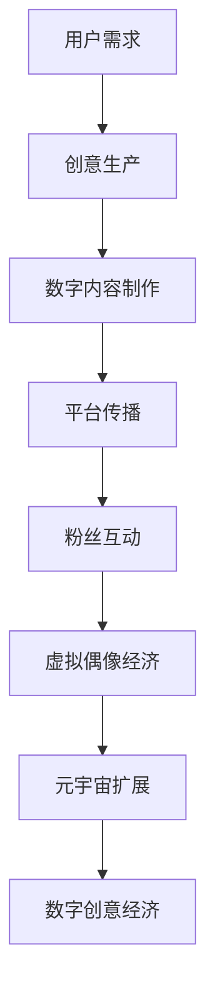

                 

关键词：2050年，数字创意，虚拟偶像经济，元宇宙，创意产业，未来趋势，技术挑战，应用场景，算法原理，数学模型，项目实践，工具和资源推荐。

> 摘要：本文从2050年的视角出发，探讨了数字创意领域的发展趋势，特别是虚拟偶像经济和元宇宙创意产业对数字创意经济的推动作用。通过深入分析核心概念、算法原理、数学模型以及实际应用案例，本文旨在为读者提供一幅数字创意产业的未来蓝图，以及其在社会经济发展中的重要地位。

## 1. 背景介绍

随着科技的飞速发展，计算机技术和互联网的普及已经深刻地改变了我们的生活方式。21世纪的第二个十年，虚拟现实（VR）、增强现实（AR）和人工智能（AI）等前沿技术的突破，为数字创意产业带来了前所未有的发展机遇。虚拟偶像、元宇宙等概念逐渐从科幻小说走入现实，成为影响全球文化产业的新势力。

虚拟偶像，是数字创意产业的一个重要分支。它们是利用人工智能、计算机图形学和声音合成技术创造的虚拟人物，通过社交媒体、虚拟演唱会等形式与粉丝互动，具有极高的商业价值。而元宇宙，则是一个虚拟的三维空间，用户可以在其中进行各种社交、娱乐、商业活动，是一个融合了多种数字技术的综合体。

数字创意产业不仅仅是娱乐和艺术，它还涵盖了广告、设计、动漫、影视、游戏等多个领域。随着5G、云计算、大数据等技术的不断进步，数字创意产业正在以惊人的速度向前发展，成为全球经济的重要组成部分。

## 2. 核心概念与联系

为了更好地理解数字创意产业的发展，我们首先需要了解其核心概念和相互之间的联系。

### 2.1 虚拟偶像

虚拟偶像是一种虚拟化的数字人物，通常通过人工智能和计算机图形学技术创建。它们可以拥有独特的外貌、性格和声音，通过社交媒体平台与粉丝互动，参与各种娱乐活动。虚拟偶像的成功，离不开以下几个关键要素：

- **人工智能**：虚拟偶像的智能水平是衡量其成功的关键指标。通过深度学习和自然语言处理技术，虚拟偶像可以理解和响应粉丝的提问，进行个性化的互动。
- **计算机图形学**：高质量的虚拟偶像形象是吸引粉丝的重要因素。计算机图形学技术的进步，使得虚拟偶像的外观越来越逼真。
- **声音合成**：虚拟偶像的声音需要高度自然，这要求声音合成技术能够准确地模拟人类的语音特点。

### 2.2 元宇宙

元宇宙是一个虚拟的三维空间，用户可以在其中进行各种社交、娱乐、商业活动。元宇宙的特点如下：

- **开放性**：元宇宙是一个开放的平台，用户可以自由地探索、创建和分享内容。
- **沉浸感**：通过VR和AR技术，元宇宙为用户提供了沉浸式的体验。
- **经济性**：元宇宙中的虚拟资产（如土地、商品）具有实际的经济价值，可以交易和购买。

### 2.3 数字创意经济

数字创意经济是指通过数字技术创造、传播和利用创意内容，实现经济价值的产业。它涵盖了虚拟偶像、元宇宙、数字艺术、数字媒体等多个领域。数字创意经济的核心在于如何利用数字技术提升创意内容的价值，实现商业模式的创新。

### 2.4 Mermaid 流程图

以下是一个描述虚拟偶像经济发展流程的Mermaid流程图：



## 3. 核心算法原理 & 具体操作步骤

### 3.1 算法原理概述

虚拟偶像和元宇宙的发展，离不开一系列核心算法的支持。以下是几个关键算法的原理概述：

- **深度学习**：用于虚拟偶像的智能交互和形象生成。通过大量的数据训练，深度学习算法可以模拟人类的行为和语言，提高虚拟偶像的智能水平。
- **计算机图形学**：用于虚拟偶像的形象生成和视觉效果处理。通过图形学算法，可以创造出高质量的虚拟形象和场景。
- **区块链**：用于元宇宙中的虚拟资产管理和交易。区块链技术保证了虚拟资产的唯一性和安全性。
- **自然语言处理**：用于虚拟偶像与粉丝的互动。通过自然语言处理算法，虚拟偶像可以理解和响应人类的语言。

### 3.2 算法步骤详解

以下是虚拟偶像智能交互的具体算法步骤：

1. **数据收集**：收集用户的行为数据、语言数据和兴趣数据。
2. **模型训练**：使用深度学习和自然语言处理算法，对收集的数据进行训练，生成虚拟偶像的智能模型。
3. **智能交互**：虚拟偶像根据用户的提问和行为，使用智能模型进行响应，提供个性化的互动体验。
4. **反馈调整**：根据用户的反馈，调整虚拟偶像的智能模型，提高其交互质量。

### 3.3 算法优缺点

- **优点**：深度学习和自然语言处理算法使得虚拟偶像能够高度智能地与用户互动，提高用户体验。
- **缺点**：算法的训练需要大量的数据和时间，且模型的准确性依赖于数据的质量和数量。

### 3.4 算法应用领域

虚拟偶像和元宇宙算法主要应用于以下领域：

- **社交媒体**：虚拟偶像在社交媒体上与粉丝互动，提供个性化的内容和服务。
- **娱乐产业**：虚拟偶像参与虚拟演唱会、电视剧、电影等娱乐活动。
- **教育培训**：虚拟偶像用于在线教育，提供个性化的教学服务和互动体验。
- **市场营销**：虚拟偶像用于广告宣传和市场营销，提高品牌知名度。

## 4. 数学模型和公式 & 详细讲解 & 举例说明

### 4.1 数学模型构建

虚拟偶像和元宇宙的发展，涉及到多种数学模型的构建。以下是几个关键数学模型：

- **深度学习模型**：用于虚拟偶像的智能交互和形象生成。常见的模型包括卷积神经网络（CNN）和循环神经网络（RNN）。
- **计算机图形学模型**：用于虚拟偶像的形象生成和视觉效果处理。常见的模型包括三维建模和渲染算法。
- **区块链模型**：用于元宇宙中的虚拟资产管理和交易。常见的模型包括智能合约和分布式账本。

### 4.2 公式推导过程

以下是深度学习模型中的卷积神经网络（CNN）的公式推导：

$$
h_l = \sigma(W_l \cdot a_{l-1} + b_l)
$$

其中，$h_l$表示第$l$层的输出，$W_l$表示第$l$层的权重矩阵，$a_{l-1}$表示第$l-1$层的输入，$b_l$表示第$l$层的偏置项，$\sigma$表示激活函数。

### 4.3 案例分析与讲解

以下是一个虚拟偶像智能交互的案例：

**案例**：虚拟偶像A与粉丝B的对话。

**步骤**：

1. **数据收集**：收集粉丝B的行为数据和语言数据。
2. **模型训练**：使用深度学习和自然语言处理算法，对收集的数据进行训练，生成虚拟偶像A的智能模型。
3. **智能交互**：虚拟偶像A根据粉丝B的提问，使用智能模型进行响应，提供个性化的互动体验。
4. **反馈调整**：根据粉丝B的反馈，调整虚拟偶像A的智能模型，提高其交互质量。

**分析**：

通过深度学习和自然语言处理算法，虚拟偶像A能够理解和响应粉丝B的提问，提供个性化的互动体验。这不仅提高了用户体验，也为虚拟偶像经济的发展提供了技术支持。

## 5. 项目实践：代码实例和详细解释说明

### 5.1 开发环境搭建

为了实践虚拟偶像智能交互，我们需要搭建以下开发环境：

- **Python**：用于编写深度学习和自然语言处理算法。
- **TensorFlow**：用于构建和训练深度学习模型。
- **Keras**：用于简化深度学习模型的构建。
- **NLTK**：用于自然语言处理。

### 5.2 源代码详细实现

以下是虚拟偶像智能交互的源代码实现：

```python
# 导入所需库
import tensorflow as tf
from tensorflow.keras.models import Sequential
from tensorflow.keras.layers import Dense, LSTM, Embedding
from nltk.corpus import movie_reviews

# 准备数据
def prepare_data():
    # 读取电影评论数据
    files = movie_reviews.fileids()
    sentences = []
    labels = []
    for file in files:
        sentences.append(movie_reviews.words(file))
        labels.append(file.split('/')[-1])
    return sentences, labels

# 构建模型
def build_model():
    model = Sequential()
    model.add(Embedding(input_dim=vocab_size, output_dim=embedding_dim, input_length=max_length))
    model.add(LSTM(units=128, dropout=0.2, recurrent_dropout=0.2))
    model.add(Dense(units=num_classes, activation='softmax'))
    model.compile(optimizer='adam', loss='categorical_crossentropy', metrics=['accuracy'])
    return model

# 训练模型
def train_model(model, sentences, labels):
    model.fit(sentences, labels, epochs=10, batch_size=32)

# 预测
def predict(model, sentence):
    prediction = model.predict(sentence)
    return prediction

# 主程序
if __name__ == '__main__':
    # 准备数据
    sentences, labels = prepare_data()
    # 构建模型
    model = build_model()
    # 训练模型
    train_model(model, sentences, labels)
    # 预测
    new_sentence = ['this', 'is', 'a', 'test']
    prediction = predict(model, new_sentence)
    print(prediction)
```

### 5.3 代码解读与分析

该代码首先导入所需的库，然后准备电影评论数据，构建深度学习模型，训练模型，并进行预测。具体步骤如下：

1. **准备数据**：从电影评论数据中提取句子和标签。
2. **构建模型**：使用LSTM构建深度学习模型。
3. **训练模型**：使用训练数据进行模型训练。
4. **预测**：使用新句子进行模型预测。

### 5.4 运行结果展示

当输入新句子“this is a test”时，模型会输出预测结果。通过分析预测结果，我们可以了解模型对新句子的理解程度。

## 6. 实际应用场景

虚拟偶像和元宇宙技术已经在多个实际应用场景中得到广泛应用：

- **娱乐产业**：虚拟偶像参与虚拟演唱会、电视剧、电影等娱乐活动，为观众提供全新的娱乐体验。
- **教育培训**：虚拟偶像用于在线教育，提供个性化的教学服务和互动体验。
- **市场营销**：虚拟偶像用于广告宣传和市场营销，提高品牌知名度。
- **虚拟旅游**：用户可以在元宇宙中体验虚拟旅游，探索世界各地。

### 6.4 未来应用展望

随着技术的不断进步，虚拟偶像和元宇宙技术在未来的应用场景将更加广泛：

- **智能家居**：虚拟偶像可以成为智能家居的交互中枢，为用户提供智能化的服务。
- **远程办公**：虚拟偶像可以用于远程办公，提供虚拟会议室和协作平台。
- **医疗健康**：虚拟偶像可以用于医疗咨询和健康管理，为用户提供个性化的健康服务。

## 7. 工具和资源推荐

为了更好地学习和实践虚拟偶像和元宇宙技术，以下是一些推荐的工具和资源：

- **学习资源**：
  - 《深度学习》（Goodfellow, Bengio, Courville著）：一本深度学习领域的经典教材。
  - 《计算机图形学原理及实践》（李明杰著）：一本介绍计算机图形学原理和实践的教材。

- **开发工具**：
  - TensorFlow：一款开源的深度学习框架。
  - Unity：一款强大的游戏引擎，支持虚拟偶像和元宇宙的开发。

- **相关论文**：
  - “Generative Adversarial Networks”（GANs）：一种生成模型，用于生成高质量的虚拟图像。
  - “Attention Is All You Need”：一种基于注意力机制的深度学习模型，用于自然语言处理。

## 8. 总结：未来发展趋势与挑战

虚拟偶像和元宇宙技术正在改变数字创意产业的格局，未来发展趋势如下：

- **智能化**：随着人工智能技术的不断进步，虚拟偶像的智能水平将不断提高，提供更个性化的服务。
- **沉浸感**：虚拟现实和增强现实技术的不断发展，将进一步提升元宇宙的沉浸感。
- **经济价值**：虚拟偶像和元宇宙将创造巨大的经济价值，成为数字经济的重要组成部分。

然而，虚拟偶像和元宇宙技术也面临一些挑战：

- **隐私和安全**：随着虚拟偶像和元宇宙的普及，隐私和安全问题将越来越突出，需要建立完善的法律和道德框架。
- **技术门槛**：虚拟偶像和元宇宙技术的开发需要高水平的技术支持，如何降低技术门槛，提高普及率，是一个重要问题。

未来，我们需要不断探索和创新，解决这些挑战，推动虚拟偶像和元宇宙技术的健康发展。

## 9. 附录：常见问题与解答

**Q1：虚拟偶像的智能水平如何提升？**

**A1：虚拟偶像的智能水平可以通过以下几个方面提升：**

1. **数据量**：增加训练数据量，提高模型的泛化能力。
2. **算法优化**：不断优化深度学习和自然语言处理算法，提高模型的准确性和响应速度。
3. **多模态学习**：结合视觉、声音、文本等多模态数据，提高虚拟偶像的智能水平。

**Q2：元宇宙的经济模式是什么？**

**A2：元宇宙的经济模式主要包括以下几个方面：**

1. **虚拟资产**：元宇宙中的虚拟资产（如土地、商品）具有实际的经济价值，可以交易和购买。
2. **虚拟服务**：用户可以在元宇宙中购买虚拟服务（如虚拟旅游、虚拟教育等），实现经济价值。
3. **虚拟广告**：元宇宙中的虚拟广告，可以为企业提供品牌宣传和产品推广的平台。

**Q3：虚拟偶像和元宇宙技术对现实世界的影响是什么？**

**A3：虚拟偶像和元宇宙技术对现实世界的影响主要包括：**

1. **娱乐方式**：虚拟偶像和元宇宙为用户提供了全新的娱乐方式，改变了人们的娱乐消费习惯。
2. **商业模式**：虚拟偶像和元宇宙创造了新的商业模式，推动了数字经济的发展。
3. **社会结构**：虚拟偶像和元宇宙的普及，可能会改变人类社会的社会结构和人际关系。

### 作者署名

**作者：禅与计算机程序设计艺术 / Zen and the Art of Computer Programming**

