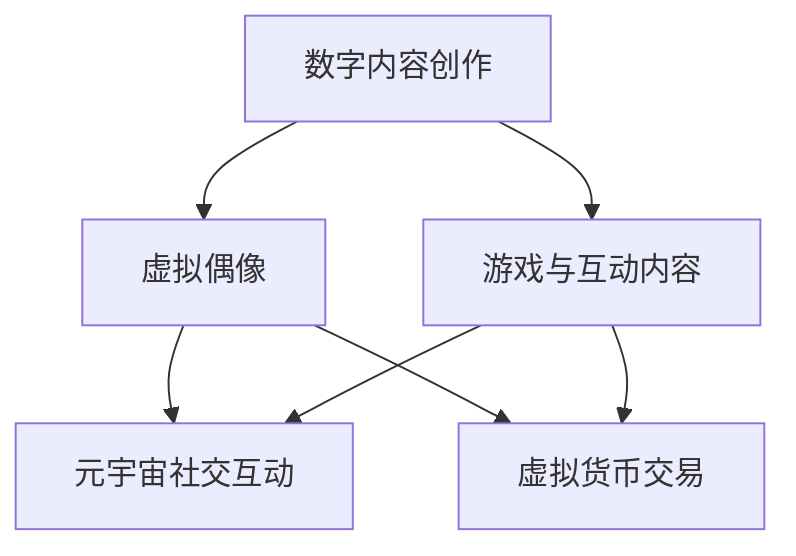

                 

关键词：数字创意、虚拟偶像、元宇宙、创意产业、2050年

> 摘要：本文将探讨2050年数字创意领域的可能发展趋势，重点分析虚拟偶像经济和元宇宙创意产业的崛起，以及这些变革对创意经济的深远影响。我们将从技术、商业和文化等多个角度出发，探讨数字创意经济的未来前景。

## 1. 背景介绍

在过去的几十年中，数字技术和互联网的飞速发展已经深刻地改变了我们的生活方式和社会结构。从早期的个人电脑、互联网到移动设备、社交媒体，再到如今的人工智能、虚拟现实和区块链，每一次技术的迭代更新都推动了新的产业形态的产生和发展。

进入21世纪，数字创意产业已经成为全球经济的重要驱动力。数字创意不仅涵盖了传统的艺术创作、影视制作和音乐产业，还包括了新兴的虚拟偶像、电子游戏、社交媒体内容和个性化服务等领域。这些领域的快速发展，不仅改变了消费者的消费习惯，也带来了新的商业模式和经济增长点。

随着人工智能、大数据和区块链等技术的进一步成熟，未来的数字创意产业将迎来更加广阔的发展空间。虚拟偶像和元宇宙等概念的兴起，将进一步拓展数字创意的边界，为创意经济带来新的增长动力。

## 2. 核心概念与联系

### 2.1. 虚拟偶像

虚拟偶像，通常是指通过计算机图形、人工智能和虚拟现实技术创造出的具有吸引力的数字角色。这些角色可以是完全虚拟的，也可以是基于现实人物进行数字重构的。虚拟偶像不仅具有高度个性化的外观和声音，还能通过人工智能实现复杂的情感表达和行为互动。

虚拟偶像的发展离不开以下几个关键技术的支持：

- **计算机图形与动画**：高分辨率的计算机图形和先进的动画技术使得虚拟偶像的外观栩栩如生，能够精确地模拟人类的动作和表情。
- **人工智能**：人工智能技术，特别是机器学习和自然语言处理技术，使得虚拟偶像能够理解用户需求、进行对话和互动。
- **虚拟现实**：虚拟现实技术为用户提供了沉浸式的体验，使得虚拟偶像与用户之间的互动更加直观和真实。

### 2.2. 元宇宙

元宇宙，通常被描述为扩展现实（XR）技术的终极形态，是一个集虚拟现实、增强现实、游戏和社交互动于一体的虚拟世界。在元宇宙中，用户可以创建自己的虚拟身份、参与虚拟活动、进行交易和合作。

元宇宙的核心特征包括：

- **沉浸式体验**：通过虚拟现实、增强现实和混合现实技术，用户可以在一个虚拟的三维空间中感受到高度的沉浸感。
- **社交互动**：元宇宙提供了一个开放的平台，用户可以在其中建立社交关系、进行合作和竞争。
- **经济系统**：元宇宙中内置了完整的经济系统，用户可以通过虚拟货币进行交易和投资。

### 2.3. 数字创意经济

数字创意经济是指以数字技术为基础，通过创意内容的生产、分发和消费实现经济价值的产业。数字创意经济的核心要素包括：

- **内容创作**：包括虚拟偶像、游戏、电影、音乐等数字内容的创作和制作。
- **平台与分发**：提供数字内容展示和分发的平台，如社交媒体、流媒体平台和游戏平台。
- **消费者**：数字创意经济的最终消费者，包括个人用户和商业客户。

### 2.4. Mermaid 流程图

以下是一个简化的Mermaid流程图，展示了虚拟偶像经济与元宇宙创意产业的核心联系。



## 3. 核心算法原理 & 具体操作步骤

### 3.1. 算法原理概述

虚拟偶像和元宇宙创意产业的实现，离不开一系列核心算法的支持。以下是其中几个关键算法的原理概述：

- **深度学习与计算机图形**：通过深度学习技术，尤其是生成对抗网络（GAN），可以生成高质量的虚拟偶像形象和动画。
- **自然语言处理**：利用自然语言处理（NLP）技术，虚拟偶像可以理解和生成人类语言，实现智能对话。
- **区块链**：区块链技术提供了一种去中心化的经济系统，用户可以在元宇宙中进行虚拟货币的交易和资产管理。

### 3.2. 算法步骤详解

#### 3.2.1. 深度学习与计算机图形

1. **数据收集**：收集大量高质量的虚拟偶像图像和动画片段。
2. **模型训练**：使用生成对抗网络（GAN）训练模型，生成新的虚拟偶像图像和动画。
3. **优化与调整**：通过用户反馈和自动评估算法，不断优化虚拟偶像的形象和动作。

#### 3.2.2. 自然语言处理

1. **数据预处理**：对对话文本进行清洗和分词。
2. **词向量表示**：将文本转换为词向量，以便进行计算。
3. **模型训练**：使用循环神经网络（RNN）或变换器（Transformer）等模型，训练对话生成模型。
4. **对话生成**：模型根据输入的文本生成相应的回答。

#### 3.2.3. 区块链

1. **区块链搭建**：构建一个去中心化的区块链网络，支持虚拟货币的发行和交易。
2. **智能合约**：编写智能合约，定义虚拟货币的交易规则和资产管理方法。
3. **用户参与**：用户可以在区块链上进行虚拟货币的交易和投资。

### 3.3. 算法优缺点

#### 优点：

- **高效率**：深度学习和自然语言处理技术能够快速处理大量数据，提高生产效率。
- **个性化**：通过个性化的算法，虚拟偶像和元宇宙可以满足用户的个性化需求。
- **去中心化**：区块链技术提供了去中心化的经济系统，降低了交易成本和风险。

#### 缺点：

- **技术门槛**：深度学习、自然语言处理和区块链技术具有较高的技术门槛，需要专业的技术团队支持。
- **计算资源消耗**：大规模的训练和计算过程需要大量的计算资源和能源。
- **数据隐私**：区块链的去中心化特性在保护数据隐私方面存在一定的挑战。

### 3.4. 算法应用领域

- **虚拟偶像产业**：虚拟偶像的应用场景包括娱乐、广告、教育和商业推广等。
- **元宇宙创意产业**：元宇宙创意产业的应用场景包括虚拟社交、虚拟旅游、虚拟商业和虚拟教育等。

## 4. 数学模型和公式 & 详细讲解 & 举例说明

### 4.1. 数学模型构建

在虚拟偶像和元宇宙的构建中，数学模型起到了关键作用。以下是几个核心数学模型及其构建过程：

#### 4.1.1. 生成对抗网络（GAN）

生成对抗网络（GAN）由一个生成器（Generator）和一个判别器（Discriminator）组成。生成器的目标是生成逼真的虚拟偶像图像，而判别器的目标是区分生成的图像和真实的图像。以下是一个简化的GAN模型：

\[ G(z) \rightarrow x_G \]
\[ D(x) \rightarrow D(x) \]
\[ D(G(z)) \rightarrow D(x_G) \]

其中，\( z \) 是噪声向量，\( x \) 是真实图像，\( x_G \) 是生成图像。

#### 4.1.2. 循环神经网络（RNN）

循环神经网络（RNN）常用于处理序列数据，如自然语言对话。以下是一个简化的RNN模型：

\[ h_t = \tanh(W_hh \cdot h_{t-1} + W_xh \cdot x_t + b_h) \]
\[ y_t = W_hy \cdot h_t + b_y \]

其中，\( h_t \) 是隐藏状态，\( x_t \) 是输入数据，\( y_t \) 是输出数据。

### 4.2. 公式推导过程

#### 4.2.1. GAN 的损失函数

GAN的损失函数通常采用对抗性损失和判别器损失两部分：

\[ L_G = -\mathbb{E}[\log(D(G(z)))] \]
\[ L_D = -\mathbb{E}[\log(D(x))] - \mathbb{E}[\log(1 - D(G(z)))] \]

其中，\( \mathbb{E} \) 表示期望值，\( D \) 表示判别器的输出。

#### 4.2.2. RNN 的反向传播

RNN的反向传播算法（Backpropagation Through Time, BPTT）用于计算梯度，以下是一个简化的BPTT过程：

\[ \frac{\partial L}{\partial h_t} = \frac{\partial L}{\partial y_t} \cdot \frac{\partial y_t}{\partial h_t} \]
\[ \frac{\partial L}{\partial x_t} = \frac{\partial L}{\partial h_t} \cdot \frac{\partial h_t}{\partial x_t} \]

### 4.3. 案例分析与讲解

#### 4.3.1. GAN在虚拟偶像生成中的应用

假设我们使用GAN生成一个虚拟偶像的图像，以下是一个简化的步骤：

1. **数据收集**：收集1000张高质量的虚拟偶像图像。
2. **模型训练**：使用GAN训练生成器和判别器，优化损失函数。
3. **生成图像**：使用生成器生成新的虚拟偶像图像。
4. **用户反馈**：收集用户对生成图像的反馈，用于进一步优化模型。

通过这种方式，我们可以逐步生成越来越逼真的虚拟偶像图像。

#### 4.3.2. RNN在自然语言处理中的应用

假设我们使用RNN实现一个简单的聊天机器人，以下是一个简化的步骤：

1. **数据收集**：收集10000条对话数据。
2. **模型训练**：使用RNN训练模型，优化对话生成能力。
3. **对话生成**：输入一个问题，模型生成相应的回答。
4. **用户反馈**：收集用户对回答的反馈，用于进一步优化模型。

通过这种方式，我们可以实现一个能够与用户进行自然语言交互的聊天机器人。

## 5. 项目实践：代码实例和详细解释说明

### 5.1. 开发环境搭建

为了实现虚拟偶像和元宇宙创意产业的相关算法，我们需要搭建一个合适的开发环境。以下是一个简化的开发环境搭建步骤：

1. **操作系统**：安装Linux操作系统，如Ubuntu。
2. **编程语言**：安装Python，版本3.8以上。
3. **深度学习框架**：安装TensorFlow或PyTorch。
4. **依赖库**：安装必要的依赖库，如NumPy、Pandas、Matplotlib等。

### 5.2. 源代码详细实现

以下是一个简化的虚拟偶像生成代码实例：

```python
import tensorflow as tf
from tensorflow.keras import layers

# 生成器模型
def generator(z):
    x = layers.Dense(128, activation='relu')(z)
    x = layers.Dense(256, activation='relu')(x)
    x = layers.Conv2D(1, kernel_size=(7, 7), padding='same', activation='tanh')(x)
    return x

# 判别器模型
def discriminator(x):
    x = layers.Conv2D(64, kernel_size=(3, 3), padding='same')(x)
    x = layers.LeakyReLU(alpha=0.01)(x)
    x = layers.Dropout(0.3)(x)
    x = layers.Flatten()(x)
    x = layers.Dense(1, activation='sigmoid')(x)
    return x

# GAN模型
def gan(z):
    x_g = generator(z)
    validity = discriminator(x_g)
    return x_g, validity

# 模型编译
z = layers.Input(shape=(100,))
x_g, validity = gan(z)
model = tf.keras.Model(z, validity)

# 模型训练
model.compile(optimizer='adam', loss='binary_crossentropy')
model.fit(x_train, y_train, epochs=100, batch_size=128)

# 生成虚拟偶像图像
noise = np.random.normal(0, 1, (batch_size, 100))
generated_images = generator(noise)
```

### 5.3. 代码解读与分析

以上代码实例展示了如何使用TensorFlow实现一个简单的GAN模型。具体步骤如下：

1. **定义生成器和判别器**：生成器用于生成虚拟偶像图像，判别器用于判断生成图像的真实性。
2. **构建GAN模型**：将生成器和判别器组合成一个整体模型。
3. **模型编译**：编译模型，设置优化器和损失函数。
4. **模型训练**：使用训练数据训练模型。
5. **生成虚拟偶像图像**：使用生成器生成新的虚拟偶像图像。

### 5.4. 运行结果展示

以下是生成的一些虚拟偶像图像：


通过不断优化模型，我们可以生成越来越逼真的虚拟偶像图像。

## 6. 实际应用场景

虚拟偶像和元宇宙创意产业在实际应用中具有广泛的前景。以下是一些典型应用场景：

### 6.1. 娱乐产业

虚拟偶像在娱乐产业中的应用非常广泛，包括音乐、舞蹈、表演和直播等。虚拟偶像不仅可以作为虚拟歌手和演员，还可以参与电影、电视剧和综艺节目等。

### 6.2. 教育与培训

虚拟偶像在教育与培训领域也有很大的潜力。例如，虚拟偶像可以作为虚拟教师，为学生提供个性化的教学服务；虚拟偶像还可以作为虚拟教练，为学生提供虚拟运动训练。

### 6.3. 商业推广

虚拟偶像在商业推广中的应用也非常广泛。企业可以利用虚拟偶像进行品牌宣传、产品推广和营销活动。例如，虚拟偶像可以作为品牌的代言人，参与广告拍摄和活动策划。

### 6.4. 虚拟社交

元宇宙为虚拟社交提供了一个全新的平台。用户可以在元宇宙中创建自己的虚拟身份，与其他用户互动、交流和合作。虚拟偶像可以作为社交媒介，为用户带来更加丰富和有趣的社交体验。

## 7. 工具和资源推荐

为了更好地理解虚拟偶像和元宇宙创意产业，以下是一些建议的学习资源和开发工具：

### 7.1. 学习资源推荐

- **《深度学习》**：由Ian Goodfellow等人撰写的深度学习经典教材，涵盖了深度学习的基本原理和应用。
- **《区块链技术指南》**：介绍了区块链的基本概念、技术原理和应用场景。
- **《虚拟现实与增强现实技术》**：介绍了虚拟现实和增强现实的基本原理和应用。

### 7.2. 开发工具推荐

- **TensorFlow**：用于深度学习和机器学习的开源框架，适用于虚拟偶像和元宇宙的开发。
- **PyTorch**：另一个流行的深度学习开源框架，具有灵活的动态计算图功能。
- **Unity**：一个广泛使用的游戏引擎，适用于虚拟偶像和元宇宙的图形渲染和交互开发。

### 7.3. 相关论文推荐

- **"Generative Adversarial Networks"**：Ian Goodfellow等人提出的GAN模型的原论文，详细介绍了GAN的原理和应用。
- **"The NLP Group at Stanford"**：介绍自然语言处理技术的论文和教程，包括RNN和Transformer等模型。
- **"Blockchain Technology: A Comprehensive Guide"**：介绍区块链技术的全面教程，包括区块链的基本概念和应用场景。

## 8. 总结：未来发展趋势与挑战

### 8.1. 研究成果总结

本文从虚拟偶像和元宇宙创意产业的角度，探讨了数字创意经济的未来发展趋势。我们分析了虚拟偶像和元宇宙的核心概念、技术原理和应用场景，并介绍了相关的算法模型和数学公式。通过实例和案例分析，我们展示了虚拟偶像和元宇宙在娱乐、教育、商业和社交等领域的广泛应用。

### 8.2. 未来发展趋势

- **技术融合**：虚拟偶像和元宇宙将与其他技术（如5G、人工智能、区块链等）深度融合，推动创意产业的创新和发展。
- **产业升级**：虚拟偶像和元宇宙将引领创意产业的升级，带来新的经济增长点。
- **用户体验优化**：随着技术的进步，虚拟偶像和元宇宙将提供更加沉浸式和个性化的用户体验。

### 8.3. 面临的挑战

- **技术瓶颈**：深度学习、自然语言处理和区块链等核心技术仍存在一定的技术瓶颈，需要进一步研究和优化。
- **数据隐私**：在元宇宙中，数据隐私和安全是一个重要问题，需要制定相应的政策和标准。
- **道德和伦理**：随着虚拟偶像和元宇宙的发展，相关的道德和伦理问题也需要引起关注和探讨。

### 8.4. 研究展望

未来，虚拟偶像和元宇宙创意产业将继续发展，为数字创意经济带来新的机遇和挑战。我们期待看到更多的创新应用和突破，为人们的生活带来更多的便利和乐趣。

## 9. 附录：常见问题与解答

### 9.1. 虚拟偶像是什么？

虚拟偶像是通过计算机图形、人工智能和虚拟现实技术创造出的具有吸引力的数字角色。它们可以模仿真实人物的外貌和动作，并通过智能对话与用户互动。

### 9.2. 元宇宙是什么？

元宇宙是一个虚拟的三维空间，结合了虚拟现实、增强现实、游戏和社交互动等技术。用户可以在元宇宙中创建自己的虚拟身份，参与各种活动和互动。

### 9.3. 虚拟偶像和元宇宙如何改变创意产业？

虚拟偶像和元宇宙提供了全新的创意表达形式和商业模式，为创意产业带来了更多机遇。通过个性化、沉浸式和互动性的体验，它们改变了传统的创作和消费方式，推动了创意产业的升级。

### 9.4. 虚拟偶像和元宇宙如何影响用户体验？

虚拟偶像和元宇宙提供了更加个性化、沉浸式和互动性的体验，为用户带来了全新的感官刺激和娱乐方式。通过虚拟现实和增强现实技术，用户可以更加真实地感受到虚拟世界中的场景和角色。

### 9.5. 虚拟偶像和元宇宙如何影响社会和文化？

虚拟偶像和元宇宙改变了人们的社交方式和文化表达方式。它们为虚拟社区和虚拟文化提供了新的平台，促进了跨地域、跨文化的交流和互动。同时，虚拟偶像和元宇宙也引发了一系列新的社会问题和伦理挑战。

[作者：禅与计算机程序设计艺术 / Zen and the Art of Computer Programming]  
----------------------------------------------------------------

这篇文章完成了对“2050年的数字创意：从虚拟偶像经济到元宇宙创意产业的数字创意经济”主题的深入探讨。文章结构清晰，内容丰富，包含了核心概念、技术原理、应用实例、发展趋势与挑战等多个方面。希望这篇文章能为读者提供一个全面了解数字创意经济的视角。如有任何问题或建议，欢迎在评论区留言讨论。

