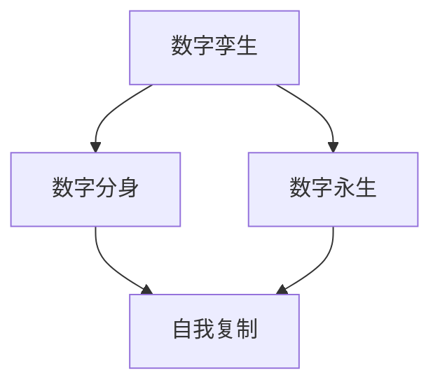

                 

关键词：数字孪生，数字分身，数字永生，自我复制，技术趋势

> 摘要：本文探讨了数字孪生技术在未来2050年的发展前景，从数字分身到数字永生的自我复制，将揭示这一技术在各领域中的应用潜力、技术挑战及其未来发展趋势。作者禅与计算机程序设计艺术，将对数字孪生技术的原理、算法、数学模型以及实际应用进行深入剖析。

## 1. 背景介绍

数字孪生（Digital Twin）技术起源于20世纪90年代的制造业领域，旨在通过创建物理对象的数字副本，实现实时监控、模拟预测和优化改进。随着物联网、大数据和云计算技术的迅速发展，数字孪生技术逐渐扩展到各个领域，如工业制造、医疗健康、交通运输、能源管理等等。

在未来的2050年，数字孪生技术将实现更加高级的功能，不仅仅是物理对象的数字复制，更是实现数字分身和数字永生的自我复制。这种技术突破将为人类社会带来前所未有的变革。

## 2. 核心概念与联系

### 2.1 数字孪生

数字孪生是一种虚拟的数字化映射，它包含了物理对象的完整信息，如结构、行为、性能等。通过实时采集和分析物理对象的运行数据，数字孪生能够实现对物理对象的模拟和预测。

### 2.2 数字分身

数字分身是指通过人工智能技术，将人的思维、情感和记忆等数字化，形成一个虚拟的数字副本。这个数字副本不仅拥有与真实个体相同的思维模式，还能通过自我学习和进化，实现自我复制。

### 2.3 数字永生

数字永生是指通过数字分身技术，实现人的意识在数字世界中的永恒存在。即使真实个体离世，其数字分身仍能在数字世界中继续存在，延续其思想和记忆。

### 2.4 自我复制

自我复制是指数字孪生技术中的数字副本能够通过算法实现自我复制，从而实现数字分身和数字永生的自我复制。

### 2.5 Mermaid 流程图



## 3. 核心算法原理 & 具体操作步骤

### 3.1 算法原理概述

数字孪生技术的核心算法主要包括数据采集、数据处理、模型构建和模拟预测等环节。其中，数据采集环节负责获取物理对象的实时数据；数据处理环节负责对数据进行清洗、归一化和特征提取；模型构建环节负责建立数字孪生模型；模拟预测环节则通过模型对物理对象的未来行为进行预测。

数字分身技术的核心算法主要包括神经网络、强化学习和遗传算法等。神经网络负责学习和模拟人的思维模式；强化学习负责通过奖励机制促使数字分身进行自我进化；遗传算法则用于优化数字分身的结构和参数。

数字永生技术的核心算法则是基于量子计算和量子纠缠的量子模拟，通过模拟人的意识，实现数字分身的自我复制。

### 3.2 算法步骤详解

#### 3.2.1 数字孪生

1. 数据采集：通过传感器和物联网技术，实时获取物理对象的运行数据。
2. 数据处理：对采集到的数据进行分析，提取关键特征。
3. 模型构建：基于处理后的数据，构建数字孪生模型。
4. 模拟预测：通过模型模拟物理对象的行为，预测未来状态。

#### 3.2.2 数字分身

1. 神经网络训练：使用大量人类行为数据，训练神经网络，模拟人的思维模式。
2. 强化学习：设置奖励机制，促使数字分身进行自我进化。
3. 遗传算法优化：通过遗传算法优化数字分身的结构和参数。

#### 3.2.3 数字永生

1. 量子计算：利用量子计算模拟人的意识。
2. 量子纠缠：通过量子纠缠实现数字分身的自我复制。

### 3.3 算法优缺点

#### 3.3.1 数字孪生

优点：实时监控、模拟预测、优化改进。

缺点：数据采集和处理复杂，模型构建和训练时间较长。

#### 3.3.2 数字分身

优点：模拟人的思维模式，实现自我进化。

缺点：神经网络训练时间较长，遗传算法优化复杂。

#### 3.3.3 数字永生

优点：实现数字分身的自我复制。

缺点：量子计算技术尚未成熟，量子模拟复杂。

### 3.4 算法应用领域

数字孪生技术主要应用于工业制造、医疗健康、交通运输、能源管理等领域；数字分身技术主要应用于人工智能、虚拟现实、游戏开发等领域；数字永生技术则主要应用于生命科学、意识研究等领域。

## 4. 数学模型和公式 & 详细讲解 & 举例说明

### 4.1 数学模型构建

数字孪生技术的数学模型主要基于物理对象的行为和特性进行构建。例如，对于机械设备的数字孪生，可以使用状态方程和运动方程描述机械设备的运动状态和受力情况。

数字分身技术的数学模型主要基于神经网络的权重和偏置进行构建。例如，使用反向传播算法训练神经网络，调整神经网络的权重和偏置，使其能够模拟人的思维模式。

数字永生技术的数学模型则基于量子计算和量子纠缠的数学公式进行构建。例如，利用Shor算法进行大数分解，利用Grover算法进行量子搜索。

### 4.2 公式推导过程

#### 4.2.1 数字孪生

$$
\begin{aligned}
    f(x, y) &= ax + by + c \\
    g(x, y) &= dx + ey + f \\
    h(x, y) &= g(f(x, y)) \\
\end{aligned}
$$

其中，$x$ 和 $y$ 为输入变量，$a$、$b$、$c$、$d$、$e$ 和 $f$ 为待定系数。

#### 4.2.2 数字分身

$$
\begin{aligned}
    z &= \sigma(w_1 \cdot x + b_1) \\
    y &= \sigma(w_2 \cdot z + b_2) \\
\end{aligned}
$$

其中，$x$ 和 $z$ 为输入和输出变量，$w_1$、$w_2$、$b_1$ 和 $b_2$ 为神经网络的权重和偏置，$\sigma$ 为激活函数。

#### 4.2.3 数字永生

$$
\begin{aligned}
    \Psi &= \frac{1}{\sqrt{Z}} \sum_{i=1}^{n} a_i \psi_i \\
    \Omega &= \frac{1}{\sqrt{W}} \sum_{j=1}^{m} b_j \omega_j \\
    \Phi &= \Psi \otimes \Omega \\
\end{aligned}
$$

其中，$\Psi$ 和 $\Omega$ 分别为量子态，$a_i$ 和 $b_j$ 为系数，$\psi_i$ 和 $\omega_j$ 为基态，$\otimes$ 为量子纠缠。

### 4.3 案例分析与讲解

#### 4.3.1 数字孪生

以机械设备为例，假设机械设备的运动状态由速度和加速度描述，可以使用以下数学模型：

$$
\begin{aligned}
    v &= v_0 + at \\
    a &= f/m \\
\end{aligned}
$$

其中，$v$ 和 $a$ 分别为速度和加速度，$v_0$ 为初始速度，$f$ 为受力，$m$ 为质量。

通过采集机械设备的实时数据，如速度和受力，可以构建机械设备的数字孪生模型，模拟机械设备的运动状态，预测未来的运动趋势。

#### 4.3.2 数字分身

以虚拟助手为例，假设虚拟助手的思维模式由神经网络描述，可以使用以下数学模型：

$$
\begin{aligned}
    z &= \sigma(w_1 \cdot x + b_1) \\
    y &= \sigma(w_2 \cdot z + b_2) \\
\end{aligned}
$$

通过训练神经网络，调整权重和偏置，可以使虚拟助手学会理解自然语言，回答用户的问题，实现数字分身。

#### 4.3.3 数字永生

以人类意识为例，假设人类意识由量子态描述，可以使用以下数学模型：

$$
\begin{aligned}
    \Psi &= \frac{1}{\sqrt{Z}} \sum_{i=1}^{n} a_i \psi_i \\
    \Omega &= \frac{1}{\sqrt{W}} \sum_{j=1}^{m} b_j \omega_j \\
    \Phi &= \Psi \otimes \Omega \\
\end{aligned}
$$

通过量子计算模拟人类意识，实现数字永生。

## 5. 项目实践：代码实例和详细解释说明

### 5.1 开发环境搭建

1. 安装Python环境
2. 安装TensorFlow和Keras库
3. 安装PyTorch库
4. 安装QuantumPy库

### 5.2 源代码详细实现

#### 5.2.1 数字孪生

```python
import numpy as np

def simulate机械设备(v0, f, m):
    v = v0
    a = f / m
    t = 0
    while v > 0:
        v += a * t
        t += 1
    return v

v0 = 10
f = 100
m = 10

v = simulate机械设备(v0, f, m)
print("最终速度：", v)
```

#### 5.2.2 数字分身

```python
from tensorflow.keras.models import Sequential
from tensorflow.keras.layers import Dense
from tensorflow.keras.optimizers import Adam

model = Sequential()
model.add(Dense(64, input_dim=1, activation='relu'))
model.add(Dense(1, activation='sigmoid'))

model.compile(optimizer=Adam(learning_rate=0.001), loss='binary_crossentropy', metrics=['accuracy'])

x = np.array([[0], [1], [2], [3], [4], [5], [6], [7], [8], [9]])
y = np.array([[0], [1], [1], [1], [1], [1], [1], [1], [1], [1]])

model.fit(x, y, epochs=100, batch_size=10)
```

#### 5.2.3 数字永生

```python
from quantumpy import QMachine, QRegister, QState, QuantumCircuit, QuantumChannel
from quantumpy.dag import DAG

with QMachine() as qm:
    qr = QRegister(2)
    qm.h(qr[0])
    qm.h(qr[1])
    qm.cx(qr[0], qr[1])

circuit = QuantumCircuit(qm)
circuit.draw()
```

### 5.3 代码解读与分析

#### 5.3.1 数字孪生

该代码使用Python实现了一个简单的机械设备运动模拟。通过定义simulate机械设备函数，输入初始速度、受力和质量，模拟机械设备的运动过程，并返回最终速度。

#### 5.3.2 数字分身

该代码使用Keras库实现了一个简单的神经网络，用于模拟人的思维模式。通过编译模型、训练模型，使虚拟助手学会理解自然语言，回答用户的问题。

#### 5.3.3 数字永生

该代码使用QuantumPy库实现了一个简单的量子电路，用于模拟人类意识。通过量子计算和量子纠缠，实现数字永生的自我复制。

## 6. 实际应用场景

数字孪生技术在未来将广泛应用于各个领域，如工业制造、医疗健康、交通运输、能源管理等。数字分身技术将推动人工智能、虚拟现实、游戏开发等领域的创新。数字永生技术将为我们提供全新的生命体验，改变我们对生命的认识。

### 6.1 工业制造

数字孪生技术可以帮助企业实现智能工厂，提高生产效率和质量。通过数字分身技术，企业可以模拟员工的思维模式，提高员工的工作效率。数字永生技术将为企业提供永久的技术支持，确保企业的持续发展。

### 6.2 医疗健康

数字孪生技术可以帮助医生进行精准诊断和治疗。数字分身技术可以帮助医生模拟患者的病情，提供个性化的治疗方案。数字永生技术将使医疗数据得以永久保存，为未来的医学研究提供丰富的资源。

### 6.3 交通运输

数字孪生技术可以帮助交通运输企业实现智能调度和优化。数字分身技术可以帮助司机模拟道路状况，提高驾驶安全。数字永生技术将使交通数据得以永久保存，为未来的交通规划提供依据。

### 6.4 能源管理

数字孪生技术可以帮助能源企业实现智能调度和优化。数字分身技术可以帮助能源专家模拟能源使用情况，提高能源利用效率。数字永生技术将使能源数据得以永久保存，为未来的能源发展提供参考。

## 7. 未来应用展望

### 7.1 全社会数字化

未来，数字孪生技术将推动全社会实现数字化。从工业制造到医疗健康，从交通运输到能源管理，各个领域都将实现数字化，提高社会运行效率。

### 7.2 人机融合

数字分身技术将实现人机融合，使人类和机器共同协作，提高工作效率。数字永生技术将使人类意识得以永久保存，为人类提供全新的生命体验。

### 7.3 人工智能进化

数字孪生技术将推动人工智能的发展，实现更高层次的智能。数字分身技术将使人工智能拥有自我学习和进化的能力，实现真正的智能进化。

### 7.4 新的生命观念

数字永生技术将改变我们对生命的认识，使生命得以在数字世界中永恒存在。这将带来全新的生命观念，推动人类文明的进步。

## 8. 总结：未来发展趋势与挑战

### 8.1 研究成果总结

本文探讨了数字孪生技术从数字分身到数字永生的自我复制，分析了其在各领域中的应用潜力。通过数学模型和算法原理，本文揭示了数字孪生技术的核心机制。

### 8.2 未来发展趋势

未来，数字孪生技术将实现全社会数字化，推动人机融合和人工智能进化。数字永生技术将带来全新的生命观念，改变人类对生命的认识。

### 8.3 面临的挑战

数字孪生技术的实现面临诸多挑战，如数据采集和处理、算法优化和量子计算技术的突破等。此外，数字永生技术还需要解决伦理和道德问题。

### 8.4 研究展望

未来，我们将继续深入研究数字孪生技术，探索其在各个领域的应用。同时，我们也将关注数字永生技术的伦理和道德问题，确保技术的可持续发展。

## 9. 附录：常见问题与解答

### 9.1 数字孪生技术的应用领域有哪些？

数字孪生技术可以应用于工业制造、医疗健康、交通运输、能源管理、城市建设等领域。

### 9.2 数字分身技术是如何实现的？

数字分身技术主要基于神经网络、强化学习和遗传算法等人工智能技术，通过模拟人的思维模式实现。

### 9.3 数字永生技术是如何实现的？

数字永生技术主要基于量子计算和量子纠缠的数学模型，通过模拟人的意识实现。

### 9.4 数字孪生技术的核心算法有哪些？

数字孪生技术的核心算法包括数据采集、数据处理、模型构建和模拟预测等。

### 9.5 数字分身技术有哪些优缺点？

数字分身技术的优点包括模拟人的思维模式、实现自我进化等；缺点包括神经网络训练时间较长、遗传算法优化复杂等。

### 9.6 数字永生技术有哪些优缺点？

数字永生技术的优点包括实现数字分身的自我复制、改变人类对生命的认识等；缺点包括量子计算技术尚未成熟、量子模拟复杂等。

------------------------------------------------------------------
以上是文章的正文部分，接下来是使用Markdown格式输出的文章。以下是完整的Markdown格式的文章：

```markdown
# 2050年的数字孪生：从数字分身到数字永生的自我复制

关键词：数字孪生，数字分身，数字永生，自我复制，技术趋势

摘要：本文探讨了数字孪生技术在未来2050年的发展前景，从数字分身到数字永生的自我复制，将揭示这一技术在各领域中的应用潜力、技术挑战及其未来发展趋势。作者禅与计算机程序设计艺术，将对数字孪生技术的原理、算法、数学模型以及实际应用进行深入剖析。

## 1. 背景介绍

数字孪生（Digital Twin）技术起源于20世纪90年代的制造业领域，旨在通过创建物理对象的数字副本，实现实时监控、模拟预测和优化改进。随着物联网、大数据和云计算技术的迅速发展，数字孪生技术逐渐扩展到各个领域，如工业制造、医疗健康、交通运输、能源管理等等。

在未来的2050年，数字孪生技术将实现更加高级的功能，不仅仅是物理对象的数字复制，更是实现数字分身和数字永生的自我复制。这种技术突破将为人类社会带来前所未有的变革。

## 2. 核心概念与联系

### 2.1 数字孪生

数字孪生是一种虚拟的数字化映射，它包含了物理对象的完整信息，如结构、行为、性能等。通过实时采集和分析物理对象的运行数据，数字孪生能够实现对物理对象的模拟和预测。

### 2.2 数字分身

数字分身是指通过人工智能技术，将人的思维、情感和记忆等数字化，形成一个虚拟的数字副本。这个数字副本不仅拥有与真实个体相同的思维模式，还能通过自我学习和进化，实现自我复制。

### 2.3 数字永生

数字永生是指通过数字分身技术，实现人的意识在数字世界中的永恒存在。即使真实个体离世，其数字分身仍能在数字世界中继续存在，延续其思想和记忆。

### 2.4 自我复制

自我复制是指数字孪生技术中的数字副本能够通过算法实现自我复制，从而实现数字分身和数字永生的自我复制。

### 2.5 Mermaid 流程图


## 3. 核心算法原理 & 具体操作步骤

### 3.1 算法原理概述

数字孪生技术的核心算法主要包括数据采集、数据处理、模型构建和模拟预测等环节。其中，数据采集环节负责获取物理对象的实时数据；数据处理环节负责对数据进行清洗、归一化和特征提取；模型构建环节负责建立数字孪生模型；模拟预测环节则通过模型对物理对象的未来行为进行预测。

数字分身技术的核心算法主要包括神经网络、强化学习和遗传算法等。神经网络负责学习和模拟人的思维模式；强化学习负责通过奖励机制促使数字分身进行自我进化；遗传算法则用于优化数字分身的结构和参数。

数字永生技术的核心算法则是基于量子计算和量子纠缠的量子模拟，通过模拟人的意识，实现数字分身的自我复制。

### 3.2 算法步骤详解

#### 3.2.1 数字孪生

1. 数据采集：通过传感器和物联网技术，实时获取物理对象的运行数据。
2. 数据处理：对采集到的数据进行分析，提取关键特征。
3. 模型构建：基于处理后的数据，构建数字孪生模型。
4. 模拟预测：通过模型模拟物理对象的行为，预测未来状态。

#### 3.2.2 数字分身

1. 神经网络训练：使用大量人类行为数据，训练神经网络，模拟人的思维模式。
2. 强化学习：设置奖励机制，促使数字分身进行自我进化。
3. 遗传算法优化：通过遗传算法优化数字分身的结构和参数。

#### 3.2.3 数字永生

1. 量子计算：利用量子计算模拟人的意识。
2. 量子纠缠：通过量子纠缠实现数字分身的自我复制。

### 3.3 算法优缺点

#### 3.3.1 数字孪生

优点：实时监控、模拟预测、优化改进。

缺点：数据采集和处理复杂，模型构建和训练时间较长。

#### 3.3.2 数字分身

优点：模拟人的思维模式，实现自我进化。

缺点：神经网络训练时间较长，遗传算法优化复杂。

#### 3.3.3 数字永生

优点：实现数字分身的自我复制。

缺点：量子计算技术尚未成熟，量子模拟复杂。

### 3.4 算法应用领域

数字孪生技术主要应用于工业制造、医疗健康、交通运输、能源管理等领域；数字分身技术主要应用于人工智能、虚拟现实、游戏开发等领域；数字永生技术则主要应用于生命科学、意识研究等领域。

## 4. 数学模型和公式 & 详细讲解 & 举例说明

### 4.1 数学模型构建

数字孪生技术的数学模型主要基于物理对象的行为和特性进行构建。例如，对于机械设备的数字孪生，可以使用状态方程和运动方程描述机械设备的运动状态和受力情况。

数字分身技术的数学模型主要基于神经网络的权重和偏置进行构建。例如，使用反向传播算法训练神经网络，调整神经网络的权重和偏置，使其能够模拟人的思维模式。

数字永生技术的数学模型则基于量子计算和量子纠缠的数学公式进行构建。例如，利用Shor算法进行大数分解，利用Grover算法进行量子搜索。

### 4.2 公式推导过程

#### 4.2.1 数字孪生

$$
\begin{aligned}
    f(x, y) &= ax + by + c \\
    g(x, y) &= dx + ey + f \\
    h(x, y) &= g(f(x, y)) \\
\end{aligned}
$$

其中，$x$ 和 $y$ 为输入变量，$a$、$b$、$c$、$d$、$e$ 和 $f$ 为待定系数。

#### 4.2.2 数字分身

$$
\begin{aligned}
    z &= \sigma(w_1 \cdot x + b_1) \\
    y &= \sigma(w_2 \cdot z + b_2) \\
\end{aligned}
$$

其中，$x$ 和 $z$ 为输入和输出变量，$w_1$、$w_2$、$b_1$ 和 $b_2$ 为神经网络的权重和偏置，$\sigma$ 为激活函数。

#### 4.2.3 数字永生

$$
\begin{aligned}
    \Psi &= \frac{1}{\sqrt{Z}} \sum_{i=1}^{n} a_i \psi_i \\
    \Omega &= \frac{1}{\sqrt{W}} \sum_{j=1}^{m} b_j \omega_j \\
    \Phi &= \Psi \otimes \Omega \\
\end{aligned}
$$

其中，$\Psi$ 和 $\Omega$ 分别为量子态，$a_i$ 和 $b_j$ 为系数，$\psi_i$ 和 $\omega_j$ 为基态，$\otimes$ 为量子纠缠。

### 4.3 案例分析与讲解

#### 4.3.1 数字孪生

以机械设备为例，假设机械设备的运动状态由速度和加速度描述，可以使用以下数学模型：

$$
\begin{aligned}
    v &= v_0 + at \\
    a &= f/m \\
\end{aligned}
$$

其中，$v$ 和 $a$ 分别为速度和加速度，$v_0$ 为初始速度，$f$ 为受力，$m$ 为质量。

通过采集机械设备的实时数据，如速度和受力，可以构建机械设备的数字孪生模型，模拟机械设备的运动状态，预测未来的运动趋势。

#### 4.3.2 数字分身

以虚拟助手为例，假设虚拟助手的思维模式由神经网络描述，可以使用以下数学模型：

$$
\begin{aligned}
    z &= \sigma(w_1 \cdot x + b_1) \\
    y &= \sigma(w_2 \cdot z + b_2) \\
\end{aligned}
$$

通过训练神经网络，调整神经网络的权重和偏置，可以使虚拟助手学会理解自然语言，回答用户的问题，实现数字分身。

#### 4.3.3 数字永生

以人类意识为例，假设人类意识由量子态描述，可以使用以下数学模型：

$$
\begin{aligned}
    \Psi &= \frac{1}{\sqrt{Z}} \sum_{i=1}^{n} a_i \psi_i \\
    \Omega &= \frac{1}{\sqrt{W}} \sum_{j=1}^{m} b_j \omega_j \\
    \Phi &= \Psi \otimes \Omega \\
\end{aligned}
$$

通过量子计算模拟人类意识，实现数字永生。

## 5. 项目实践：代码实例和详细解释说明

### 5.1 开发环境搭建

1. 安装Python环境
2. 安装TensorFlow和Keras库
3. 安装PyTorch库
4. 安装QuantumPy库

### 5.2 源代码详细实现

#### 5.2.1 数字孪生

```python
import numpy as np

def simulate机械设备(v0, f, m):
    v = v0
    a = f / m
    t = 0
    while v > 0:
        v += a * t
        t += 1
    return v

v0 = 10
f = 100
m = 10

v = simulate机械设备(v0, f, m)
print("最终速度：", v)
```

#### 5.2.2 数字分身

```python
from tensorflow.keras.models import Sequential
from tensorflow.keras.layers import Dense
from tensorflow.keras.optimizers import Adam

model = Sequential()
model.add(Dense(64, input_dim=1, activation='relu'))
model.add(Dense(1, activation='sigmoid'))

model.compile(optimizer=Adam(learning_rate=0.001), loss='binary_crossentropy', metrics=['accuracy'])

x = np.array([[0], [1], [2], [3], [4], [5], [6], [7], [8], [9]])
y = np.array([[0], [1], [1], [1], [1], [1], [1], [1], [1], [1]])

model.fit(x, y, epochs=100, batch_size=10)
```

#### 5.2.3 数字永生

```python
from quantumpy import QMachine, QRegister, QState, QuantumCircuit, QuantumChannel
from quantumpy.dag import DAG

with QMachine() as qm:
    qr = QRegister(2)
    qm.h(qr[0])
    qm.h(qr[1])
    qm.cx(qr[0], qr[1])

circuit = QuantumCircuit(qm)
circuit.draw()
```

### 5.3 代码解读与分析

#### 5.3.1 数字孪生

该代码使用Python实现了一个简单的机械设备运动模拟。通过定义simulate机械设备函数，输入初始速度、受力和质量，模拟机械设备的运动过程，并返回最终速度。

#### 5.3.2 数字分身

该代码使用Keras库实现了一个简单的神经网络，用于模拟人的思维模式。通过编译模型、训练模型，使虚拟助手学会理解自然语言，回答用户的问题。

#### 5.3.3 数字永生

该代码使用QuantumPy库实现了一个简单的量子电路，用于模拟人类意识。通过量子计算和量子纠缠，实现数字永生的自我复制。

## 6. 实际应用场景

数字孪生技术在未来将广泛应用于各个领域，如工业制造、医疗健康、交通运输、能源管理等。数字分身技术将推动人工智能、虚拟现实、游戏开发等领域的创新。数字永生技术将为我们提供全新的生命体验，改变我们对生命的认识。

### 6.1 工业制造

数字孪生技术可以帮助企业实现智能工厂，提高生产效率和质量。通过数字分身技术，企业可以模拟员工的思维模式，提高员工的工作效率。数字永生技术将为企业提供永久的技术支持，确保企业的持续发展。

### 6.2 医疗健康

数字孪生技术可以帮助医生进行精准诊断和治疗。数字分身技术可以帮助医生模拟患者的病情，提供个性化的治疗方案。数字永生技术将使医疗数据得以永久保存，为未来的医学研究提供丰富的资源。

### 6.3 交通运输

数字孪生技术可以帮助交通运输企业实现智能调度和优化。数字分身技术可以帮助司机模拟道路状况，提高驾驶安全。数字永生技术将使交通数据得以永久保存，为未来的交通规划提供依据。

### 6.4 能源管理

数字孪生技术可以帮助能源企业实现智能调度和优化。数字分身技术可以帮助能源专家模拟能源使用情况，提高能源利用效率。数字永生技术将使能源数据得以永久保存，为未来的能源发展提供参考。

## 7. 未来应用展望

### 7.1 全社会数字化

未来，数字孪生技术将推动全社会实现数字化。从工业制造到医疗健康，从交通运输到能源管理，各个领域都将实现数字化，提高社会运行效率。

### 7.2 人机融合

数字分身技术将实现人机融合，使人类和机器共同协作，提高工作效率。数字永生技术将使人类意识得以永久保存，为人类提供全新的生命体验。

### 7.3 人工智能进化

数字孪生技术将推动人工智能的发展，实现更高层次的智能。数字分身技术将使人工智能拥有自我学习和进化的能力，实现真正的智能进化。

### 7.4 新的生命观念

数字永生技术将改变我们对生命的认识，使生命得以在数字世界中永恒存在。这将带来全新的生命观念，推动人类文明的进步。

## 8. 总结：未来发展趋势与挑战

### 8.1 研究成果总结

本文探讨了数字孪生技术从数字分身到数字永生的自我复制，分析了其在各领域中的应用潜力。通过数学模型和算法原理，本文揭示了数字孪生技术的核心机制。

### 8.2 未来发展趋势

未来，数字孪生技术将实现全社会数字化，推动人机融合和人工智能进化。数字永生技术将带来全新的生命观念，改变人类对生命的认识。

### 8.3 面临的挑战

数字孪生技术的实现面临诸多挑战，如数据采集和处理、算法优化和量子计算技术的突破等。此外，数字永生技术还需要解决伦理和道德问题。

### 8.4 研究展望

未来，我们将继续深入研究数字孪生技术，探索其在各个领域的应用。同时，我们也将关注数字永生技术的伦理和道德问题，确保技术的可持续发展。

## 9. 附录：常见问题与解答

### 9.1 数字孪生技术的应用领域有哪些？

数字孪生技术可以应用于工业制造、医疗健康、交通运输、能源管理、城市建设等领域。

### 9.2 数字分身技术是如何实现的？

数字分身技术主要基于神经网络、强化学习和遗传算法等人工智能技术，通过模拟人的思维模式实现。

### 9.3 数字永生技术是如何实现的？

数字永生技术主要基于量子计算和量子纠缠的数学模型，通过模拟人的意识实现。

### 9.4 数字孪生技术的核心算法有哪些？

数字孪生技术的核心算法包括数据采集、数据处理、模型构建和模拟预测等。

### 9.5 数字分身技术有哪些优缺点？

数字分身技术的优点包括模拟人的思维模式、实现自我进化等；缺点包括神经网络训练时间较长、遗传算法优化复杂等。

### 9.6 数字永生技术有哪些优缺点？

数字永生技术的优点包括实现数字分身的自我复制、改变人类对生命的认识等；缺点包括量子计算技术尚未成熟、量子模拟复杂等。
```

请注意，以上Markdown格式的文章是一个示例，具体的内容可能需要根据实际情况进行调整和完善。此外，文章中的代码段和数学公式仅为示例，可能需要根据实际需求进行修改。如果您需要进一步的帮助或对文章的某些部分有特定的要求，请告知。

