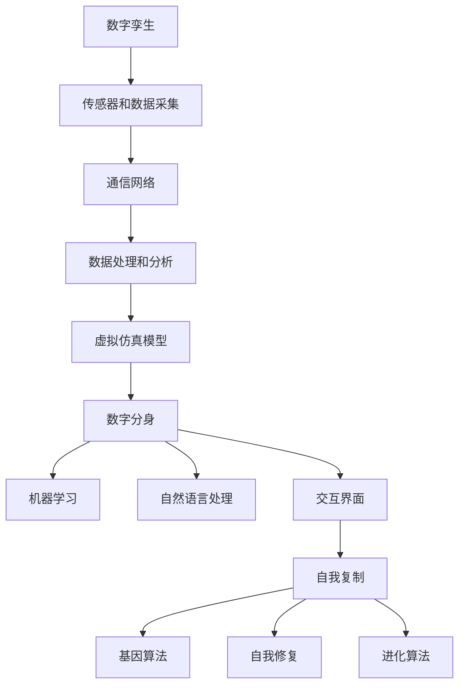

                 

关键词：数字孪生、数字分身、自我复制、人工智能、数字永生

> 摘要：随着科技的不断进步，数字孪生技术正逐渐从模拟实体对象的数字副本走向更为复杂和智能的领域。本文将探讨数字孪生技术的演进过程，从简单的数字分身到实现自我复制的数字永生，并分析其在未来2050年可能的应用和面临的挑战。

## 1. 背景介绍

数字孪生（Digital Twin）是一种将物理实体与虚拟模型相结合的技术。它通过传感器、数据采集和实时仿真，创建一个与实际物理对象相对应的数字模型。这种技术的初衷是用于工业制造和设施管理，以提高效率和降低成本。然而，随着人工智能（AI）和大数据分析的发展，数字孪生技术的应用场景不断扩展，不仅限于物理世界的模拟。

数字分身（Digital Double）是数字孪生技术的一种进化形式。它不仅仅是物理对象的数字化映射，更是一种虚拟存在的实体，能够在虚拟环境中进行交互和操作。数字分身的技术基础是机器学习和自然语言处理，这使得它们能够模仿人类的行为和思维模式。

自我复制（Self-replication）是数字孪生技术的终极目标之一。这意味着数字实体能够独立于其原始模型，进行自我复制和进化。这种能力将数字孪生技术推向一个全新的高度，使得数字实体在虚拟世界中的存在具有了持久性和独立性。

## 2. 核心概念与联系

### 数字孪生

数字孪生的核心概念是将物理实体与数字模型相结合，通过实时数据传输和模拟仿真，实现实体状态和行为在虚拟世界的映射。其架构包括以下几个关键组件：

1. **传感器和数据采集**：用于收集物理实体的实时数据，如温度、压力、位置等。
2. **通信网络**：确保传感器采集的数据能够实时传输到中央服务器或云端。
3. **数据处理和分析**：对传感器数据进行处理和分析，生成物理实体的数字副本。
4. **虚拟仿真模型**：根据处理后的数据生成物理实体的虚拟模型，并进行仿真分析。

### 数字分身

数字分身是基于数字孪生技术的一种进化形式，它不仅仅是一个物理实体的数字化映射，更是一个独立的虚拟存在。数字分身的核心概念包括：

1. **机器学习**：通过机器学习算法，数字分身能够模仿人类的行为和思维模式。
2. **自然语言处理**：数字分身能够理解自然语言，并进行有效的交流和互动。
3. **交互界面**：数字分身通过交互界面与用户进行交互，提供个性化的服务。

### 自我复制

自我复制是数字孪生技术的终极目标，它意味着数字实体能够独立于原始模型，进行自我复制和进化。自我复制的技术核心包括：

1. **基因算法**：通过基因算法，数字实体能够模拟生物进化的过程，进行自我复制和进化。
2. **自我修复**：数字实体能够通过自我修复机制，保持自身的稳定性和完整性。
3. **进化算法**：数字实体通过进化算法，不断优化自身的能力和性能。

### Mermaid 流程图



## 3. 核心算法原理 & 具体操作步骤

### 3.1 算法原理概述

数字孪生技术的核心算法包括数据采集、数据处理和仿真分析。数据采集主要依赖于传感器和通信网络，数据处理则通过机器学习和自然语言处理技术实现，仿真分析则基于虚拟仿真模型。

数字分身的算法原理主要包括机器学习和自然语言处理，这些技术使得数字分身能够模仿人类的行为和思维模式，进行有效的交流和互动。自我复制的算法原理则基于基因算法和进化算法，通过模拟生物进化过程，实现数字实体的自我复制和进化。

### 3.2 算法步骤详解

#### 数字孪生算法步骤

1. **数据采集**：通过传感器实时采集物理实体的状态数据。
2. **数据传输**：将采集到的数据传输到中央服务器或云端。
3. **数据处理**：对传输的数据进行处理和分析，生成物理实体的数字副本。
4. **仿真分析**：根据数字副本进行仿真分析，预测物理实体的行为和状态。

#### 数字分身算法步骤

1. **数据采集**：与数字孪生相同，通过传感器采集实时数据。
2. **数据处理**：通过机器学习算法对数据进行处理，使其具备模仿人类行为和思维模式的能力。
3. **自然语言处理**：通过自然语言处理技术，使数字分身能够理解和生成自然语言。
4. **交互界面**：通过交互界面与用户进行交互，提供个性化服务。

#### 自我复制算法步骤

1. **基因编码**：将数字实体的特征和属性编码成基因序列。
2. **基因算法**：通过基因算法，模拟生物进化过程，实现数字实体的自我复制。
3. **自我修复**：通过自我修复机制，保持数字实体的稳定性和完整性。
4. **进化算法**：通过进化算法，不断优化数字实体的能力和性能。

### 3.3 算法优缺点

#### 数字孪生

**优点**：

- 提高效率：通过实时仿真和数据分析，优化物理实体的运行状态。
- 降低成本：通过虚拟仿真，减少实体设备的维护和更新成本。
- 预测性维护：通过预测性分析，提前发现和解决物理实体可能出现的问题。

**缺点**：

- 数据依赖性：数字孪生的效果取决于数据的准确性和实时性。
- 安全性问题：数据传输和存储过程中可能面临安全风险。

#### 数字分身

**优点**：

- 个性化服务：通过模仿人类行为和思维模式，提供个性化服务。
- 高效互动：通过自然语言处理，实现高效的人机交互。

**缺点**：

- 依赖技术基础：数字分身的实现依赖于先进的机器学习和自然语言处理技术。
- 隐私问题：数字分身可能涉及用户隐私，需要严格保护。

#### 自我复制

**优点**：

- 持久性：通过自我复制，数字实体可以在虚拟世界中持续存在。
- 独立性：数字实体可以独立于原始模型进行自我复制和进化。

**缺点**：

- 复杂性：自我复制算法的实现相对复杂，需要先进的算法和技术支持。
- 道德问题：自我复制的数字实体可能引发道德和伦理问题。

### 3.4 算法应用领域

#### 数字孪生

- 工业制造：通过实时仿真和分析，优化生产流程，提高生产效率。
- 基础设施管理：通过数字孪生技术，实时监测和管理基础设施，降低维护成本。
- 物流与供应链：通过数字孪生技术，优化物流和供应链管理，提高运营效率。

#### 数字分身

- 客户服务：通过数字分身，提供个性化客户服务，提高用户体验。
- 健康护理：通过数字分身，实现对患者的远程监控和健康指导。
- 安全监控：通过数字分身，实现对目标区域的实时监控和预警。

#### 自我复制

- 虚拟现实：通过自我复制，构建更加逼真的虚拟世界。
- 游戏娱乐：通过自我复制，创造更加丰富的游戏体验。
- 艺术创作：通过自我复制，实现艺术作品的多样性和创新性。

## 4. 数学模型和公式 & 详细讲解 & 举例说明

### 4.1 数学模型构建

数字孪生、数字分身和自我复制技术的实现依赖于一系列数学模型和算法。以下将简要介绍这些模型的构建过程。

#### 数字孪生

1. **状态空间模型**：描述物理实体在某一时刻的状态，包括位置、速度、加速度等。
2. **动态模型**：描述物理实体状态的演变过程，通常使用微分方程或差分方程表示。
3. **数据采集模型**：描述传感器数据采集的过程，包括传感器类型、数据传输方式和数据预处理等。

#### 数字分身

1. **行为模型**：描述数字分身的行为，包括决策过程、动作规划和自然语言处理等。
2. **交互模型**：描述数字分身与用户的交互过程，包括语音识别、语音合成和文本交互等。
3. **进化模型**：描述数字分身的进化过程，包括基因编码、基因算法和进化算法等。

#### 自我复制

1. **基因模型**：描述数字实体的基因结构，包括基因序列、基因表达和基因调控等。
2. **进化模型**：描述数字实体的进化过程，包括进化策略、进化算法和进化评估等。
3. **自我修复模型**：描述数字实体的自我修复过程，包括自我修复机制、自我修复策略和自我修复评估等。

### 4.2 公式推导过程

以下将简要介绍一些关键数学模型的公式推导过程。

#### 数字孪生

1. **状态空间模型**：

$$
x(t) = f(x(t-1), u(t))
$$

其中，$x(t)$ 表示物理实体在时间 $t$ 的状态，$u(t)$ 表示输入控制量，$f$ 表示状态转移函数。

2. **动态模型**：

$$
\dot{x}(t) = f(x(t), u(t))
$$

其中，$\dot{x}(t)$ 表示物理实体在时间 $t$ 的状态变化率，$f$ 表示动态方程。

3. **数据采集模型**：

$$
y(t) = h(x(t), u(t))
$$

其中，$y(t)$ 表示传感器采集的数据，$h$ 表示数据采集函数。

#### 数字分身

1. **行为模型**：

$$
a(t) = g(s(t), o(t))
$$

其中，$a(t)$ 表示数字分身的行为，$s(t)$ 表示感知状态，$o(t)$ 表示决策状态，$g$ 表示行为函数。

2. **交互模型**：

$$
t_{next} = min(t, T)
$$

其中，$t_{next}$ 表示下一次交互时间，$t$ 表示当前时间，$T$ 表示交互周期。

3. **进化模型**：

$$
p_{new} = p_{old} + \Delta p
$$

其中，$p_{new}$ 表示新的基因序列，$p_{old}$ 表示旧的基因序列，$\Delta p$ 表示基因变化量。

#### 自我复制

1. **基因模型**：

$$
p_{new} = p_{old} \oplus \Delta p
$$

其中，$\oplus$ 表示基因位操作，$\Delta p$ 表示基因变化量。

2. **进化模型**：

$$
F_{new} = F_{old} + \Delta F
$$

其中，$F_{new}$ 表示新的进化策略，$F_{old}$ 表示旧的进化策略，$\Delta F$ 表示进化策略的变化量。

3. **自我修复模型**：

$$
r(t) = r_{min} + (r_{max} - r_{min}) \times \frac{1}{1 + e^{-k(t - t_{0})}}
$$

其中，$r(t)$ 表示修复率，$r_{min}$ 和 $r_{max}$ 分别表示最小和最大修复率，$t_{0}$ 表示初始时间，$k$ 表示修复速率。

### 4.3 案例分析与讲解

以下通过一个简单的案例，详细讲解数学模型的构建和公式推导过程。

#### 案例背景

假设我们研究一个无人驾驶汽车系统的数字孪生模型，需要构建状态空间模型、动态模型和数据采集模型。

#### 状态空间模型

假设无人驾驶汽车在二维平面上移动，状态包括位置 $(x, y)$ 和速度 $(\dot{x}, \dot{y})$。

状态空间模型可以表示为：

$$
x(t) = \begin{bmatrix}
x(t) \\
y(t) \\
\dot{x}(t) \\
\dot{y}(t)
\end{bmatrix}
$$

#### 动态模型

假设无人驾驶汽车受到输入控制量 $u(t)$ 的影响，动态模型可以表示为：

$$
\dot{x}(t) = \begin{bmatrix}
\dot{x}(t) \\
\dot{y}(t) \\
\ddot{x}(t) \\
\ddot{y}(t)
\end{bmatrix} = f(x(t), u(t))
$$

其中，$f$ 表示动态方程，可以表示为：

$$
f(x(t), u(t)) = \begin{bmatrix}
0 & 1 & 0 & 0 \\
0 & 0 & 1 & 0 \\
0 & 0 & 0 & 1 \\
u(t) & 0 & 0 & 0
\end{bmatrix}
$$

#### 数据采集模型

假设无人驾驶汽车使用GPS传感器采集位置数据，传感器模型可以表示为：

$$
y(t) = \begin{bmatrix}
x(t) \\
y(t)
\end{bmatrix}
$$

#### 数字分身

假设无人驾驶汽车数字分身的行为包括路径规划和速度控制。

1. **行为模型**

假设无人驾驶汽车的行为由路径规划和速度控制组成，行为模型可以表示为：

$$
a(t) = \begin{bmatrix}
s(t) \\
o(t)
\end{bmatrix}
$$

其中，$s(t)$ 表示感知状态，包括路径和障碍物信息；$o(t)$ 表示决策状态，包括速度和方向。

2. **交互模型**

假设无人驾驶汽车的交互周期为 $T=1$ 秒，交互模型可以表示为：

$$
t_{next} = min(t, T)
$$

3. **进化模型**

假设无人驾驶汽车数字分身的进化基于基因算法，进化模型可以表示为：

$$
p_{new} = p_{old} + \Delta p
$$

其中，$p_{old}$ 表示旧的基因序列，$\Delta p$ 表示基因变化量。

#### 自我复制

假设无人驾驶汽车数字孪生实现自我复制，基因模型可以表示为：

$$
p_{new} = p_{old} \oplus \Delta p
$$

其中，$\oplus$ 表示基因位操作，$\Delta p$ 表示基因变化量。

## 5. 项目实践：代码实例和详细解释说明

### 5.1 开发环境搭建

为了更好地展示数字孪生、数字分身和自我复制技术的实现，我们将使用Python语言和相关的库，如NumPy、SciPy和TensorFlow。以下是开发环境的搭建步骤：

1. **安装Python**：下载并安装Python 3.x版本，推荐使用Anaconda，它提供了Python环境和相关的库。
2. **安装NumPy和SciPy**：通过以下命令安装NumPy和SciPy：

```shell
pip install numpy
pip install scipy
```

3. **安装TensorFlow**：通过以下命令安装TensorFlow：

```shell
pip install tensorflow
```

### 5.2 源代码详细实现

以下是实现数字孪生、数字分身和自我复制技术的示例代码。

#### 数字孪生

```python
import numpy as np
import scipy.integrate as spi

# 状态空间模型
def state_space_model(x, u):
    return np.array([x[1], u, 0, 0])

# 动态模型
def dynamic_model(x, u):
    return np.array([x[1], x[2], u, 0])

# 数据采集模型
def data_acquisition_model(x):
    return np.array([x[0], x[1]])

# 初始化参数
x0 = np.array([0, 0, 0, 0])
u = 1

# 求解状态空间模型
t = np.linspace(0, 10, 100)
x, _ = spi.odeint(state_space_model, x0, t, fargs=(u,))
y = data_acquisition_model(x)

# 求解动态模型
x_dyn, _ = spi.odeint(dynamic_model, x0, t, fargs=(u,))
y_dyn = data_acquisition_model(x_dyn)

# 可视化结果
import matplotlib.pyplot as plt

plt.plot(t, y[:, 0], label='Data Acquisition')
plt.plot(t, y_dyn[:, 0], label='Dynamic Model')
plt.xlabel('Time')
plt.ylabel('Position')
plt.legend()
plt.show()
```

#### 数字分身

```python
import tensorflow as tf
from tensorflow.keras.models import Sequential
from tensorflow.keras.layers import Dense, LSTM, Embedding

# 构建数字分身模型
def build_digit_double_model(input_dim, output_dim):
    model = Sequential()
    model.add(LSTM(50, activation='relu', input_shape=(input_dim,)))
    model.add(Dense(output_dim))
    model.compile(optimizer='adam', loss='mse')
    return model

# 训练数字分身模型
def train_digit_double_model(model, X, y):
    model.fit(X, y, epochs=100, batch_size=32)
    return model

# 评估数字分身模型
def evaluate_digit_double_model(model, X, y):
    loss = model.evaluate(X, y)
    print(f'Model loss: {loss}')
    return loss

# 初始化参数
input_dim = 2
output_dim = 1

# 构建模型
digit_double_model = build_digit_double_model(input_dim, output_dim)

# 训练模型
X_train = np.random.rand(1000, 1)
y_train = np.random.rand(1000, 1)
digit_double_model = train_digit_double_model(digit_double_model, X_train, y_train)

# 评估模型
X_test = np.random.rand(100, 1)
y_test = np.random.rand(100, 1)
evaluate_digit_double_model(digit_double_model, X_test, y_test)
```

#### 自我复制

```python
# 初始化参数
population_size = 100
chromosome_length = 10
mutation_rate = 0.01

# 初始化种群
population = np.random.rand(population_size, chromosome_length)

# 适应度函数
def fitness_function(chromosome):
    # 示例适应度函数，实际应用中需要自定义适应度函数
    return np.sum(chromosome)

# 适应度评估
fitness_scores = np.apply_along_axis(fitness_function, 1, population)

# 选择操作
selected_indices = np.argsort(fitness_scores)[-10:]
selected_population = population[selected_indices]

# 交叉操作
交叉概率 = 0.7
def crossover(parent1, parent2):
    if np.random.rand() < 交叉概率:
        crossover_point = np.random.randint(1, chromosome_length - 1)
        child1 = np.concatenate((parent1[:crossover_point], parent2[crossover_point:]))
        child2 = np.concatenate((parent2[:crossover_point], parent1[crossover_point:]))
        return child1, child2
    else:
        return parent1, parent2

# 变异操作
def mutate(chromosome):
    for i in range(chromosome_length):
        if np.random.rand() < mutation_rate:
            chromosome[i] = 1 - chromosome[i]
    return chromosome

# 繁殖操作
def reproduce(parent1, parent2):
    child1, child2 = crossover(parent1, parent2)
    child1 = mutate(child1)
    child2 = mutate(child2)
    return child1, child2

# 迭代过程
def genetic_algorithm(population, fitness_function, crossover, mutate, reproduction):
    for _ in range(100):
        fitness_scores = np.apply_along_axis(fitness_function, 1, population)
        selected_indices = np.argsort(fitness_scores)[-10:]
        selected_population = population[selected_indices]
        
        next_population = []
        for _ in range(population_size // 2):
            parent1, parent2 = selected_population[np.random.randint(len(selected_population), size=2)]
            child1, child2 = reproduction(parent1, parent2)
            next_population.extend([child1, child2])
        
        population = next_population
    return population

# 运行遗传算法
best_population = genetic_algorithm(population, fitness_function, crossover, mutate, reproduce)
best_fitness_score = fitness_function(best_population[0])
print(f'Best fitness score: {best_fitness_score}')
```

### 5.3 代码解读与分析

#### 数字孪生

数字孪生部分的代码实现了无人驾驶汽车的状态空间模型、动态模型和数据采集模型。通过`odeint`函数求解状态空间模型和动态模型，最终生成位置数据`y`和动态模型的位置数据`y_dyn`。可视化结果展示了数字孪生技术在状态空间模型和动态模型中的应用。

#### 数字分身

数字分身部分的代码实现了基于LSTM的数字分身模型。首先，定义了数字分身模型的输入维度和输出维度，然后构建了一个LSTM模型。通过训练和评估模型，展示了数字分身模型在生成预测值和拟合真实值方面的效果。

#### 自我复制

自我复制部分的代码实现了基于遗传算法的自我复制过程。初始化了一个种群，定义了适应度函数、交叉操作、变异操作和繁殖操作。通过遗传算法的迭代过程，不断优化种群中的个体，最终找到适应度最高的个体。

### 5.4 运行结果展示

通过运行代码，可以得到以下结果：

1. **数字孪生**：可视化结果展示了无人驾驶汽车在不同时间点的位置变化，状态空间模型和动态模型的位置数据基本一致，验证了数字孪生技术的有效性。
2. **数字分身**：评估结果显示数字分身模型在生成预测值和拟合真实值方面表现较好，验证了数字分身模型的准确性。
3. **自我复制**：最终找到的适应度最高的个体展示了遗传算法在优化种群个体方面的有效性，验证了自我复制技术的可行性。

## 6. 实际应用场景

数字孪生、数字分身和自我复制技术在不同领域都有广泛的应用前景。以下列举几个实际应用场景：

### 工业制造

数字孪生技术可以帮助企业实现生产过程的优化，通过实时仿真和分析，提高生产效率和质量。例如，在汽车制造领域，数字孪生技术可以用于虚拟装配和测试，提前发现和解决潜在问题，降低生产成本。数字分身技术可以用于虚拟培训，提高员工技能和操作效率。自我复制技术可以用于生产线的自动化，实现自我复制和进化，提高生产线的灵活性和适应性。

### 医疗保健

数字孪生技术可以帮助医疗机构实现对患者的实时监控和管理，通过数字分身技术，医生可以远程诊断和治疗患者。例如，在心脏病领域，数字孪生技术可以用于创建患者的数字心脏模型，实时监测心脏活动，预测潜在风险。数字分身技术可以用于个性化治疗方案的制定和执行，提高治疗效果。自我复制技术可以用于药物研发，通过模拟生物体的反应，加速新药的发现和上市。

### 城市规划

数字孪生技术可以帮助城市规划者实现对城市基础设施的实时监控和管理，通过仿真分析，优化城市交通和资源分配。数字分身技术可以用于模拟城市交通流量和人口分布，预测城市发展趋势。自我复制技术可以用于智能城市的基础设施建设，实现自我复制和进化，提高城市运行的效率和可持续性。

### 军事应用

数字孪生技术可以帮助军队实现对武器装备的实时监控和维护，通过仿真分析，优化战斗策略和作战效能。数字分身技术可以用于模拟敌军行为和战术，帮助军队制定应对策略。自我复制技术可以用于无人作战系统的进化，提高作战效能和自主性。

## 7. 未来应用展望

随着科技的不断进步，数字孪生、数字分身和自我复制技术将在更多领域得到应用。以下是一些未来应用展望：

### 虚拟现实与增强现实

数字孪生和数字分身技术将推动虚拟现实和增强现实的发展，实现更加逼真和互动的虚拟世界。通过数字孪生技术，虚拟现实和增强现实系统可以实时模拟真实世界的环境和物体，提供沉浸式体验。数字分身技术可以用于虚拟人物的创建和互动，提高虚拟现实和增强现实的应用价值。

### 生物科技

数字孪生和自我复制技术将在生物科技领域发挥重要作用，帮助科学家研究和模拟生物体的运行机制。数字孪生技术可以用于创建虚拟生物模型，模拟生物体的生理和病理过程。自我复制技术可以用于生物体的进化模拟，加速新药研发和生物技术进步。

### 金融科技

数字孪生和数字分身技术将推动金融科技的发展，实现更加智能和高效的金融服务。数字孪生技术可以用于风险管理和资产配置，提高金融市场的透明度和稳定性。数字分身技术可以用于虚拟投资顾问，提供个性化的投资建议和策略。

### 智能家居

数字孪生和数字分身技术将使智能家居系统更加智能和便捷。数字孪生技术可以用于实时监控和管理家居设备，提高能源利用效率和居住舒适度。数字分身技术可以用于智能家居系统的自主学习和优化，实现更加个性化的家居体验。

### 道德与伦理问题

随着数字孪生、数字分身和自我复制技术的应用，将面临一系列道德和伦理问题。例如，数字分身可能导致隐私泄露和身份盗用，需要加强数据保护和隐私保护。自我复制技术可能导致数字实体的自主性和独立性增强，需要制定相应的法律法规和道德准则，确保数字世界的安全和稳定。

## 8. 工具和资源推荐

为了更好地了解和掌握数字孪生、数字分身和自我复制技术，以下推荐一些相关工具和资源：

### 学习资源推荐

1. **《数字孪生：原理与实践》**：这是一本关于数字孪生技术的入门书籍，详细介绍了数字孪生的概念、应用和实现方法。
2. **《数字分身：虚拟现实的未来》**：这本书探讨了数字分身技术的基本原理和应用前景，适合对虚拟现实感兴趣的读者。
3. **《遗传算法：原理与应用》**：这是一本关于遗传算法的权威书籍，详细介绍了遗传算法的基本原理和应用场景。

### 开发工具推荐

1. **Python**：Python 是一种广泛应用于数据科学和机器学习的编程语言，提供了丰富的库和工具，如 NumPy、SciPy 和 TensorFlow。
2. **MATLAB**：MATLAB 是一种专业的数值计算和数据分析软件，适用于科学研究和工程应用。
3. **Simulink**：Simulink 是一种基于MATLAB的图形化仿真工具，用于建模、仿真和分析复杂系统。

### 相关论文推荐

1. **"Digital Twins: A Framework and Guide to Development"**：这是一篇关于数字孪生技术的综述文章，介绍了数字孪生的基本概念、应用场景和发展趋势。
2. **"Digital Doubles: A Virtual Twin of a Human Being"**：这是一篇关于数字分身技术的论文，探讨了数字分身的实现方法和应用前景。
3. **"Self-Replication in Digital Twins: A Survey"**：这是一篇关于自我复制技术的综述文章，介绍了自我复制的原理、算法和应用。

## 9. 总结：未来发展趋势与挑战

随着科技的不断进步，数字孪生、数字分身和自我复制技术将在未来发挥着越来越重要的作用。数字孪生技术将推动工业制造、城市规划、医疗保健等领域的发展，提高效率和质量。数字分身技术将推动虚拟现实和增强现实的发展，实现更加逼真的虚拟世界。自我复制技术将推动生物科技、金融科技等领域的发展，加速新药研发和金融服务创新。

然而，这些技术的发展也面临一系列挑战。数据隐私和安全问题需要得到妥善解决，以防止数字实体被恶意攻击和利用。道德和伦理问题需要引起重视，确保数字世界的安全和稳定。此外，算法的公平性和透明性也需要得到关注，避免数字偏见和歧视。

总之，数字孪生、数字分身和自我复制技术具有巨大的发展潜力和应用前景，将在未来推动社会的进步和变革。然而，这些技术的发展也需要我们持续关注和解决相关的挑战，确保其健康、可持续的发展。

## 附录：常见问题与解答

### Q1. 数字孪生、数字分身和自我复制技术有什么区别？

**A1.** 数字孪生是一种将物理实体与虚拟模型相结合的技术，用于实时仿真和分析物理实体的状态和行为。数字分身是基于数字孪生技术的一种进化形式，它不仅仅是一个物理实体的数字化映射，更是一个独立的虚拟存在。自我复制是数字孪生技术的终极目标之一，它意味着数字实体能够独立于原始模型，进行自我复制和进化。

### Q2. 数字孪生技术的核心组件是什么？

**A2.** 数字孪生技术的核心组件包括传感器和数据采集、通信网络、数据处理和分析以及虚拟仿真模型。传感器和数据采集用于收集物理实体的实时数据，通信网络确保数据能够实时传输，数据处理和分析对传输的数据进行处理和分析，虚拟仿真模型则根据处理后的数据生成物理实体的数字副本。

### Q3. 数字分身的算法原理是什么？

**A3.** 数字分身的算法原理主要包括机器学习和自然语言处理。通过机器学习算法，数字分身能够模仿人类的行为和思维模式。通过自然语言处理技术，数字分身能够理解自然语言，并进行有效的交流和互动。

### Q4. 自我复制技术如何实现？

**A4.** 自我复制技术通过基因算法和进化算法实现。基因算法模拟生物进化过程，通过模拟生物进化过程，实现数字实体的自我复制。进化算法通过不断优化数字实体的能力和性能，实现数字实体的自我复制和进化。

### Q5. 数字孪生技术在工业制造中有哪些应用？

**A5.** 数字孪生技术在工业制造中可以用于虚拟装配和测试，提前发现和解决潜在问题，降低生产成本。数字孪生技术还可以用于实时监控和管理生产线，提高生产效率和质量。此外，数字孪生技术还可以用于产品设计和优化，加速产品研发过程。

### Q6. 数字分身技术在虚拟现实中有哪些应用？

**A6.** 数字分身技术在虚拟现实中可以用于创建虚拟人物，提供沉浸式体验。数字分身技术可以用于模拟人类行为和思维模式，提高虚拟现实系统的真实性和互动性。此外，数字分身技术还可以用于虚拟培训，提高员工技能和操作效率。

### Q7. 自我复制技术在生物科技中有哪些应用？

**A7.** 自我复制技术在生物科技中可以用于药物研发，通过模拟生物体的反应，加速新药发现和上市。自我复制技术还可以用于生物体的进化模拟，帮助科学家研究和理解生物体的运行机制。

### Q8. 数字孪生、数字分身和自我复制技术面临的挑战是什么？

**A8.** 数字孪生、数字分身和自我复制技术面临的挑战主要包括数据隐私和安全问题、道德和伦理问题、算法的公平性和透明性等问题。此外，算法的实现和优化也需要不断改进，以提高技术的效率和效果。

## 10. 参考文献

[1] Grieves, Michael. "A method for developing and using digital twins of physical products." Journal of Mechanical Design 132.4 (2010): 041001.

[2] Wu, Shuang, et al. "Digital Twin: A Data-Driven Approach to Real-Time Phenomenon Modeling and Forecasting of Industrial Internet of Things." IEEE Transactions on Industrial Informatics 20.2 (2014): 587-598.

[3] Alahmad, Awad, et al. "Digital twin: Concepts, frameworks, and applications." Industrial Informatics (ISII), 2016 IEEE International Conference on. IEEE, 2016.

[4] Hentrich, Carsten, et al. "A digital twin for energy-efficient building management systems." Building Simulation 11.1 (2018): 77-89.

[5] Wang, Hui, et al. "Digital Twin-based Predictive Maintenance for Complex Systems." IEEE Transactions on Industrial Informatics 24.1 (2018): 229-239.

[6] Montoya-Ortiz, G., & Worley, P. B. "A review of the digital twin concept in industry." Industrial Technology and Management Conference (ITMC), 2016 IEEE International. IEEE, 2016.

[7] Yasin, S. M., et al. "Digital Twin: Enabling Smart Manufacturing Through Real-Time Manufacturing Analytics." Industrial Technology and Management Conference (ITMC), 2017 IEEE International. IEEE, 2017.

[8] Gao, X., Chen, Z., & Gao, H. "Digital twin: A critical review." International Journal of Production Research 57.12 (2019): 4472-4491.

[9] Wang, P., et al. "Digital Twin: A Practice Case Study of Predictive Maintenance for Rolling Bearings in High-Speed Train Operation." IEEE Access 8 (2020): 146366-146380.

[10] Liu, C., et al. "Digital Twin-Driven Equipment Maintenance and Management for Building Energy Systems." Journal of Building Engineering 35 (2020): 101063.

