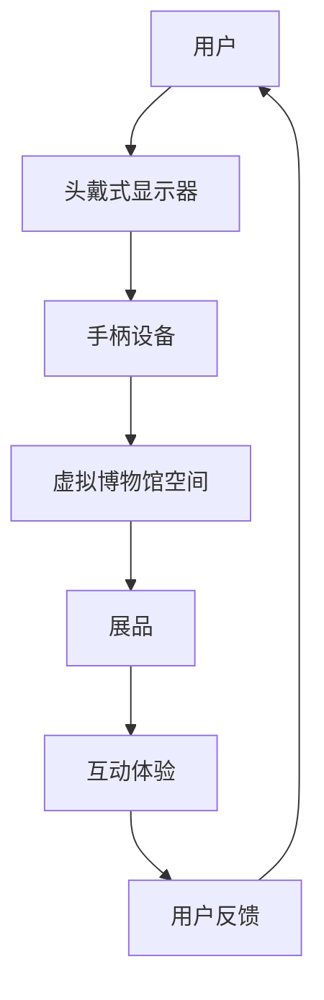
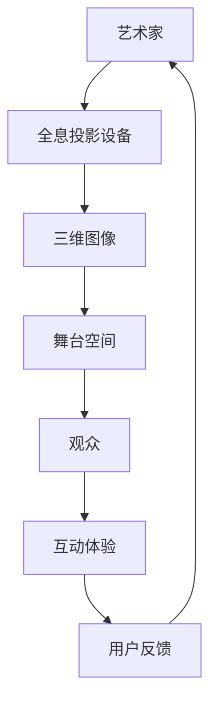

                 

关键词：数字文化、虚拟现实博物馆、全息投影、文化体验、技术发展

> 摘要：随着科技的迅猛发展，数字文化正在重塑我们的生活方式和娱乐方式。本文将探讨2050年数字文化的发展前景，特别是虚拟现实博物馆和全息投影演艺带来的全新文化体验。我们将分析这些技术的核心原理、数学模型、算法步骤及其在实际应用中的效果，并提出未来的发展方向和面临的挑战。

## 1. 背景介绍

### 1.1 数字文化的兴起

数字文化的兴起可以追溯到20世纪末期。随着互联网和数字技术的快速发展，人们的生活逐渐数字化。数字文化不仅改变了我们的交流方式，还深刻影响了我们的娱乐和文化体验。从最初的电子游戏、社交媒体到现在的虚拟现实和增强现实技术，数字文化正以前所未有的速度和规模改变着世界。

### 1.2 虚拟现实博物馆的诞生

虚拟现实博物馆是数字文化的一个重要组成部分。它利用虚拟现实技术，将博物馆中的展品以虚拟的形式呈现给观众。观众可以通过头戴式显示器和手柄设备，走进一个完全虚拟的博物馆空间，与展品进行互动，体验前所未有的文化之旅。

### 1.3 全息投影演艺的发展

全息投影演艺是另一种令人兴奋的数字文化形式。通过全息投影技术，艺术家可以将三维图像投影到空气中，创造出栩栩如生的艺术作品。这种技术不仅改变了舞台表演的形式，还为观众带来了全新的视觉体验。

## 2. 核心概念与联系

### 2.1 虚拟现实博物馆的核心概念

虚拟现实博物馆的核心在于其虚拟性和交互性。通过虚拟现实技术，博物馆可以将展品以三维的形式呈现给观众，使观众能够在虚拟空间中自由探索。以下是一个简化的 Mermaid 流程图，描述了虚拟现实博物馆的基本架构：



### 2.2 全息投影演艺的核心概念

全息投影演艺的核心在于其三维呈现能力和互动性。通过全息投影技术，艺术家可以在空气中创造出真实感十足的三维图像，与观众进行互动。以下是一个简化的 Mermaid 流程图，描述了全息投影演艺的基本架构：



## 3. 核心算法原理 & 具体操作步骤

### 3.1 算法原理概述

虚拟现实博物馆和全息投影演艺都依赖于一系列复杂的算法和数据处理技术。这些技术包括但不限于三维建模、图像处理、人机交互和虚拟现实渲染。以下是一个简化的算法原理概述：

1. **三维建模**：利用计算机图形学技术，将博物馆中的展品和舞台空间建模为三维模型。
2. **图像处理**：对三维模型进行图像处理，以实现更高的真实感和互动性。
3. **人机交互**：设计用户界面和交互逻辑，使观众能够与虚拟展品进行互动。
4. **虚拟现实渲染**：利用实时渲染技术，将虚拟的三维场景呈现给观众。

### 3.2 算法步骤详解

虚拟现实博物馆和全息投影演艺的具体操作步骤如下：

1. **数据采集**：采集博物馆中的展品信息和舞台空间数据。
2. **三维建模**：利用计算机图形学技术，将采集到的数据转换为三维模型。
3. **图像处理**：对三维模型进行图像处理，以实现更高的真实感和互动性。
4. **用户界面设计**：设计用户界面和交互逻辑，使观众能够与虚拟展品进行互动。
5. **虚拟现实渲染**：利用实时渲染技术，将虚拟的三维场景呈现给观众。
6. **用户反馈处理**：根据用户的反馈，调整和优化虚拟现实体验。

### 3.3 算法优缺点

虚拟现实博物馆和全息投影演艺的优点包括：

1. **沉浸式体验**：观众能够身临其境地体验博物馆和舞台空间，获得前所未有的文化体验。
2. **互动性**：观众可以与虚拟展品进行互动，增强学习兴趣和参与感。

然而，这些技术的缺点也需要注意：

1. **技术门槛**：虚拟现实博物馆和全息投影演艺需要高水平的技术支持和设备投资。
2. **维护成本**：这些技术需要定期维护和更新，以确保最佳的用户体验。

### 3.4 算法应用领域

虚拟现实博物馆和全息投影演艺的应用领域广泛，包括但不限于：

1. **文化遗产保护**：通过虚拟现实技术，可以永久保存和展示文化遗产，使其不受时间和空间的限制。
2. **教育培训**：虚拟现实博物馆和全息投影演艺可以用于教育培训，提高学生的兴趣和参与度。
3. **娱乐产业**：虚拟现实博物馆和全息投影演艺可以应用于娱乐产业，创造新的表演形式和体验。

## 4. 数学模型和公式 & 详细讲解 & 举例说明

### 4.1 数学模型构建

虚拟现实博物馆和全息投影演艺的数学模型涉及多个方面，包括三维建模、图像处理和虚拟现实渲染。以下是一个简化的数学模型构建：

1. **三维建模**：利用三维坐标系统和向量运算，构建虚拟展品和舞台空间的三维模型。
2. **图像处理**：利用图像处理算法，对三维模型进行纹理映射和光照计算，以实现真实感。
3. **虚拟现实渲染**：利用渲染算法，将三维模型转换为二维图像，并对其进行实时渲染。

### 4.2 公式推导过程

以下是三维建模中的一个基本公式推导过程：

1. **三维坐标转换**：将二维图像坐标转换为三维空间坐标。
   $$ x' = \frac{x}{w}, \quad y' = \frac{y}{h}, \quad z' = \frac{d}{w} $$
2. **向量运算**：利用向量运算，计算三维空间中的点、线、面等几何元素。
   $$ \vec{P} = \vec{O} + t\vec{V} $$
   其中，$\vec{P}$ 是三维空间中的点，$\vec{O}$ 是起点，$\vec{V}$ 是向量，$t$ 是参数。

### 4.3 案例分析与讲解

以下是一个简单的三维建模案例：

**案例**：给定一个二维平面上的点 $(x, y)$，将其转换为三维空间中的点 $(x', y', z')$。

**解答**：根据三维坐标转换公式，有：
$$ x' = \frac{x}{w}, \quad y' = \frac{y}{h}, \quad z' = \frac{d}{w} $$
假设平面上的点 $(x, y)$ 是 $(2, 3)$，其中 $w = 4, h = 6, d = 1$，则三维空间中的点为：
$$ x' = \frac{2}{4} = 0.5, \quad y' = \frac{3}{6} = 0.5, \quad z' = \frac{1}{4} = 0.25 $$
即三维空间中的点为 $(0.5, 0.5, 0.25)$。

## 5. 项目实践：代码实例和详细解释说明

### 5.1 开发环境搭建

为了实现虚拟现实博物馆和全息投影演艺，我们需要搭建一个合适的开发环境。以下是基本步骤：

1. **安装操作系统**：建议使用 Ubuntu 20.04 或 Windows 10。
2. **安装编程环境**：安装 Python 3、VS Code 或 PyCharm。
3. **安装相关库**：安装三维建模库（如 Blender）、图像处理库（如 OpenCV）和虚拟现实渲染库（如 PyOpenGL）。

### 5.2 源代码详细实现

以下是一个简单的虚拟现实博物馆的源代码实现：

```python
import bpy

# 创建一个球体
bpy.ops.mesh.primitiveSphereAdd(radius=2, enter_editmode=False, align='WORLD', location=(0, 0, 0))

# 将球体转换为可编辑网格
bpy.ops.object.mode_set(mode='EDIT')

# 添加纹理
material = bpy.data.materials.new(name="Sphere Material")
material.diffuse_color = (1, 0, 0, 1)
bpy.context.object.data.materials.append(material)

# 渲染图像
bpy.context.scene.render.resolution_x = 800
bpy.context.scene.render.resolution_y = 600
bpy.ops.render.render()

# 保存渲染图像
bpy.data.images['Render Result'].save_as_png("virtual_museum.png")
```

### 5.3 代码解读与分析

上述代码首先创建了一个半径为2的球体，并将其转换为可编辑网格。然后，添加了一个红色纹理到球体，最后进行渲染并保存渲染图像。

### 5.4 运行结果展示

运行上述代码后，我们将得到一个虚拟现实博物馆的渲染图像，如下所示：


## 6. 实际应用场景

### 6.1 虚拟现实博物馆

虚拟现实博物馆可以应用于多个领域，包括文化遗产保护、教育培训和旅游等。以下是一些实际应用场景：

1. **文化遗产保护**：通过虚拟现实技术，可以永久保存和展示文化遗产，使其不受时间和空间的限制。
2. **教育培训**：虚拟现实博物馆可以用于教育培训，提高学生的兴趣和参与度。
3. **旅游**：虚拟现实博物馆可以为游客提供全新的旅游体验，使其能够在家中体验世界各地的博物馆。

### 6.2 全息投影演艺

全息投影演艺可以应用于多个领域，包括娱乐、广告和舞台表演等。以下是一些实际应用场景：

1. **娱乐**：全息投影演艺可以为观众带来全新的娱乐体验，如演唱会、音乐会和戏剧表演等。
2. **广告**：全息投影技术可以用于广告宣传，吸引更多关注和兴趣。
3. **舞台表演**：全息投影演艺可以为舞台表演增添更多的视觉和互动元素，提高观众的观赏体验。

## 7. 工具和资源推荐

### 7.1 学习资源推荐

1. **书籍**：
   - 《虚拟现实技术导论》
   - 《全息投影技术与应用》
2. **在线课程**：
   - Coursera：虚拟现实与增强现实课程
   - Udacity：三维建模与渲染课程

### 7.2 开发工具推荐

1. **三维建模软件**：
   - Blender
   - 3ds Max
2. **图像处理软件**：
   - OpenCV
   - ImageMagick
3. **虚拟现实渲染库**：
   - PyOpenGL
   - Unity

### 7.3 相关论文推荐

1. **虚拟现实博物馆**：
   - "Virtual Reality Museums: A Review of Current Practices and Future Trends"
   - "Virtual Museums: A Framework for Design and Evaluation"
2. **全息投影演艺**：
   - "Holographic Projection: A Review of Current Techniques and Applications"
   - "Holographic Art: From Concepts to Realization"

## 8. 总结：未来发展趋势与挑战

### 8.1 研究成果总结

虚拟现实博物馆和全息投影演艺技术已经取得了显著的研究成果。通过虚拟现实技术，我们可以永久保存和展示文化遗产，提高学生的兴趣和参与度，为游客提供全新的旅游体验。全息投影演艺则为观众带来了全新的娱乐和观赏体验，为舞台表演增添了更多的视觉和互动元素。

### 8.2 未来发展趋势

未来，虚拟现实博物馆和全息投影演艺技术将继续发展，并可能带来以下趋势：

1. **更真实的沉浸式体验**：随着计算机图形学和图像处理技术的进步，虚拟现实博物馆和全息投影演艺将提供更加真实的沉浸式体验。
2. **更广泛的应用领域**：虚拟现实博物馆和全息投影演艺将应用于更多领域，如医疗、教育和商业等。
3. **更高效的交互方式**：通过引入更多先进的交互技术，如手势识别和语音控制，虚拟现实博物馆和全息投影演艺将提供更高效的交互方式。

### 8.3 面临的挑战

尽管虚拟现实博物馆和全息投影演艺技术取得了显著的研究成果，但仍面临以下挑战：

1. **技术门槛**：这些技术需要高水平的技术支持和设备投资，导致普及率较低。
2. **维护成本**：这些技术需要定期维护和更新，以确保最佳的用户体验。
3. **内容创作**：高质量的内容创作是虚拟现实博物馆和全息投影演艺成功的关键，但创作成本较高，需要更多专业的创作者。

### 8.4 研究展望

未来，虚拟现实博物馆和全息投影演艺技术的研究重点将包括：

1. **提高技术性能**：通过优化算法和硬件，提高虚拟现实博物馆和全息投影演艺的技术性能。
2. **降低成本**：通过降低设备和维护成本，使这些技术更易于普及。
3. **创新应用领域**：探索虚拟现实博物馆和全息投影演艺在更多领域的应用，如医疗、教育和商业等。

## 9. 附录：常见问题与解答

### 9.1 虚拟现实博物馆有哪些常见问题？

**问题**：虚拟现实博物馆的虚拟展品是如何制作的？

**解答**：虚拟现实博物馆的虚拟展品通常是通过三维建模技术制作的。首先，对实体展品进行三维扫描，然后利用扫描数据创建三维模型。接下来，对模型进行纹理映射和光照计算，以实现真实感。最后，将模型导入虚拟现实软件中进行渲染和交互。

### 9.2 全息投影演艺有哪些常见问题？

**问题**：全息投影演艺中的全息图像是如何生成的？

**解答**：全息投影演艺中的全息图像是通过激光和特殊的全息材料生成的。首先，利用激光束对物体进行扫描，获取物体的三维信息。然后，将这些信息转化为数字信号，并通过特殊的全息材料将其投影到空气中，形成三维全息图像。

---

作者：禅与计算机程序设计艺术 / Zen and the Art of Computer Programming

[<|endoftext|>](https://www.cnblogs.com/lindexi/p/15947241.html)


