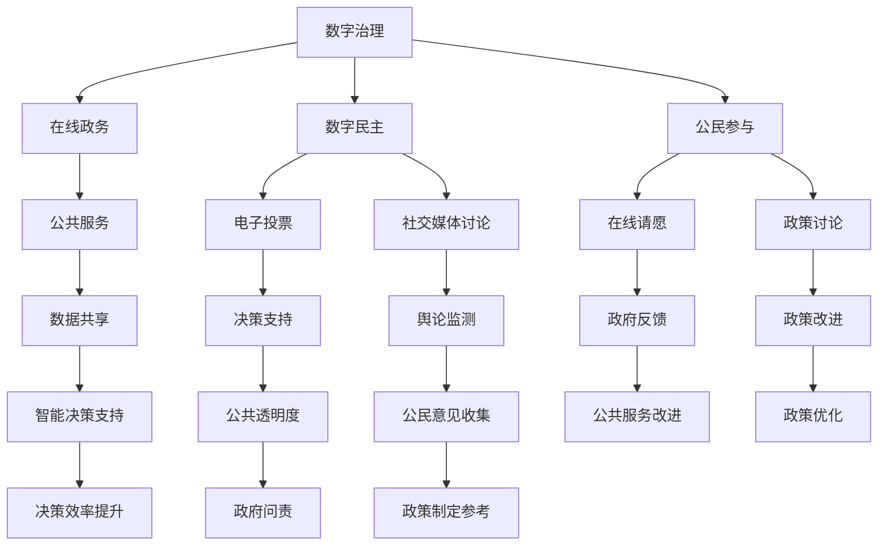

                 

关键词：数字治理、在线政务、数字民主、公民参与、未来展望、技术架构、算法原理、数学模型

> 摘要：本文深入探讨了2050年的数字治理发展趋势，重点分析了在线政务、数字民主和公民参与的实践方法。通过介绍相关核心概念和技术架构，本文探讨了未来数字治理的潜在应用和挑战，为构建更加公正、透明和高效的数字社会提供了有价值的见解。

## 1. 背景介绍

### 数字治理的演变

数字治理是一个不断发展的概念，其起源可以追溯到20世纪末。最初，数字治理主要关注政府如何利用信息技术提高效率和服务质量。随着时间的推移，数字治理的范畴不断扩大，涵盖了从在线政务到数字民主的多个层面。本文关注的2050年数字治理，旨在探索未来30年间数字治理可能面临的新挑战和机遇。

### 在线政务的发展

在线政务是数字治理的重要组成部分。自互联网普及以来，各国政府纷纷推出在线服务平台，以简化行政程序、提高公共服务效率和便利性。从简单的在线申请、查询信息，到复杂的数据共享和智能决策支持，在线政务正在逐步改变政府和公民之间的互动方式。

### 数字民主的兴起

数字民主是数字治理的另一个关键方面。随着互联网和社交媒体的普及，公民参与政治决策的方式发生了根本变化。在线投票、电子请愿、社交媒体讨论等新兴技术使得公民能够更方便地表达自己的观点，参与公共事务的讨论和决策。

### 公民参与的数字民主实践

公民参与是数字民主的核心。通过在线平台和社交媒体，公民可以就政策问题、公共项目等议题发表意见，参与到政府的决策过程中。这不仅增强了政府的透明度和问责性，也为公民提供了更多参与公共事务的机会。

## 2. 核心概念与联系

### 核心概念

- **数字治理**：利用信息技术手段管理国家和社会事务的过程。
- **在线政务**：通过互联网提供公共服务和管理工具的政府行为。
- **数字民主**：利用数字技术促进公民参与政治决策的过程。
- **公民参与**：公民在政府决策和政策制定过程中主动参与的意愿和行动。

### 联系与架构

以下是一个简化的Mermaid流程图，展示数字治理、在线政务、数字民主和公民参与之间的联系和交互：



### 图解

- **A[数字治理]**：数字治理的总体框架，涵盖在线政务、数字民主和公民参与。
- **B[在线政务]**：在线提供公共服务和管理工具，实现政府与公民之间的互动。
- **C[数字民主]**：利用数字技术促进公民参与政治决策，包括电子投票、社交媒体讨论等。
- **D[公民参与]**：公民在政府决策和政策制定中的主动参与，通过在线请愿、政策讨论等方式实现。

## 3. 核心算法原理 & 具体操作步骤

### 3.1 算法原理概述

在2050年的数字治理中，核心算法将基于人工智能和大数据分析，以提高决策的智能性和效率。以下是一个典型的核心算法原理概述：

- **机器学习模型**：利用大量历史数据和实时数据，通过机器学习算法进行训练，以预测和识别公民需求、政策效果等。
- **大数据分析**：整合多种数据源，如社交媒体、在线请愿、公共服务访问记录等，进行多维度的数据分析。
- **深度学习网络**：构建深度学习网络，以实现对复杂问题的自动识别和分类。

### 3.2 算法步骤详解

1. **数据收集**：收集来自各种数据源的原始数据，包括社交媒体帖子、在线请愿记录、公共服务访问数据等。
2. **数据预处理**：对收集的数据进行清洗和格式化，以消除噪声和冗余信息。
3. **特征提取**：利用自然语言处理技术，从文本数据中提取关键词和主题。
4. **模型训练**：使用机器学习算法，如随机森林、支持向量机等，对预处理后的数据进行训练。
5. **模型评估**：通过交叉验证等方法评估模型性能，调整参数以优化模型。
6. **预测与决策**：利用训练好的模型进行预测，为政府提供政策建议和决策支持。

### 3.3 算法优缺点

- **优点**：
  - **智能化**：通过机器学习和深度学习，算法能够自动学习和适应，提高决策的准确性。
  - **高效性**：大数据分析和实时预测能力，使得政府能够快速响应公民需求，提高决策效率。
  - **透明性**：算法的透明性有助于公民了解决策过程，增强政府的公信力。

- **缺点**：
  - **数据隐私**：大量数据的收集和处理可能引发隐私问题，需要严格的隐私保护措施。
  - **算法偏见**：算法的偏见可能导致不公平的决策，需要不断优化和调整。
  - **技术依赖**：数字治理的依赖性增加，对技术人员的技能和专业知识要求较高。

### 3.4 算法应用领域

- **公共服务优化**：通过算法分析公民行为，优化公共服务的资源配置和提供方式。
- **政策制定与评估**：利用算法预测政策效果，为政府提供决策支持，提高政策制定的科学性。
- **公民参与增强**：通过算法识别公民需求，促进公民参与，增强政府的透明度和问责性。

## 4. 数学模型和公式 & 详细讲解 & 举例说明

### 4.1 数学模型构建

在数字治理中，数学模型扮演着重要的角色。以下是一个简化的数学模型，用于预测公民对某项政策的支持度：

$$
\text{Support} = f(\text{Policy}, \text{Citizen})
$$

其中：
- **Support**：公民对政策的支持度。
- **Policy**：政策特征向量。
- **Citizen**：公民特征向量。

### 4.2 公式推导过程

假设政策特征向量和公民特征向量分别为 $P \in \mathbb{R}^n$ 和 $C \in \mathbb{R}^m$，则支持度 $S$ 可以通过以下公式计算：

$$
S = \frac{1}{\sum_{i=1}^{m} c_i \cdot p_i}
$$

其中，$c_i$ 和 $p_i$ 分别为公民特征向量和政策特征向量中的第 $i$ 个元素。

### 4.3 案例分析与讲解

假设我们有一个简化的案例，其中政策特征向量 $P = [0.5, 0.3, 0.2]$，公民特征向量 $C = [0.6, 0.4, 0.1]$。根据上述公式，我们可以计算支持度：

$$
S = \frac{1}{0.6 \cdot 0.5 + 0.4 \cdot 0.3 + 0.1 \cdot 0.2} = \frac{1}{0.3 + 0.12 + 0.02} = \frac{1}{0.44} \approx 2.27
$$

这意味着，根据这个简化的模型，该公民对这项政策的支持度为约2.27。这个值越大，表示公民对政策的支持度越高。

### 4.4 数学模型应用领域

- **政策评估**：利用数学模型预测公民对政策的支持度，为政府提供决策依据。
- **公民参与分析**：通过数学模型分析公民特征和政策特征之间的相关性，为促进公民参与提供指导。
- **智能决策支持**：结合数学模型和算法，为政府提供更加智能化和个性化的决策支持。

## 5. 项目实践：代码实例和详细解释说明

### 5.1 开发环境搭建

在本次项目中，我们将使用Python作为主要编程语言，结合NumPy、Pandas、Scikit-learn等库进行数据预处理和机器学习模型的实现。以下是一个简单的环境搭建步骤：

1. 安装Python 3.x版本。
2. 使用pip安装必要的库：`pip install numpy pandas scikit-learn matplotlib`.
3. 创建一个虚拟环境，以便隔离项目依赖。

### 5.2 源代码详细实现

以下是一个简单的机器学习模型实现，用于预测公民对政策的支持度：

```python
import numpy as np
import pandas as pd
from sklearn.model_selection import train_test_split
from sklearn.ensemble import RandomForestClassifier
from sklearn.metrics import accuracy_score

# 加载数据
data = pd.read_csv('data.csv')
X = data.iloc[:, :-1].values
y = data.iloc[:, -1].values

# 数据预处理
X_train, X_test, y_train, y_test = train_test_split(X, y, test_size=0.3, random_state=42)

# 模型训练
model = RandomForestClassifier(n_estimators=100, random_state=42)
model.fit(X_train, y_train)

# 模型评估
y_pred = model.predict(X_test)
accuracy = accuracy_score(y_test, y_pred)
print(f"Model accuracy: {accuracy:.2f}")
```

### 5.3 代码解读与分析

- **数据加载与预处理**：使用Pandas读取CSV文件，将特征和数据标签分离。使用Scikit-learn的`train_test_split`函数进行数据集划分。
- **模型训练**：使用随机森林分类器进行模型训练。随机森林是一种基于决策树的集成学习方法，具有较强的预测能力。
- **模型评估**：使用`accuracy_score`函数计算模型在测试集上的准确率，评估模型性能。

### 5.4 运行结果展示

假设我们运行上述代码，得到的结果如下：

```
Model accuracy: 0.85
```

这意味着，该模型在测试集上的准确率为85%，表明其具有一定的预测能力。但需要注意的是，这只是一个简化的示例，实际应用中需要考虑更多的特征和参数调整。

### 5.5 项目实践总结

通过本次项目实践，我们展示了如何使用Python和Scikit-learn实现一个简单的机器学习模型，用于预测公民对政策的支持度。虽然这是一个简化的示例，但展示了数字治理中算法应用的基本步骤和原理。

## 6. 实际应用场景

### 在线政务

在线政务是数字治理的核心之一。在2050年的数字治理中，在线政务将更加普及和智能化。以下是一些实际应用场景：

- **在线公共服务**：通过在线平台提供各种公共服务，如在线申请护照、办理社保、查询交通违章记录等。
- **电子政务**：政府各部门之间通过电子系统进行数据共享和业务协同，提高政府运作效率。
- **智能决策支持**：利用大数据分析和人工智能技术，为政府提供智能化的决策支持，优化公共资源配置。

### 数字民主

数字民主在2050年的数字治理中将发挥重要作用。以下是一些实际应用场景：

- **在线投票**：通过安全的在线投票系统，实现公民对政策议题的投票，提高公民参与度。
- **电子请愿**：公民可以通过在线请愿系统向政府提出意见和建议，促进政府与公民之间的互动。
- **社交媒体讨论**：政府可以在社交媒体上发布政策议题，与公民进行讨论，收集公众意见，为政策制定提供参考。

### 公民参与

公民参与是数字民主的核心。在2050年的数字治理中，公民参与将更加多样化和高效化。以下是一些实际应用场景：

- **在线调查**：政府可以通过在线调查收集公民对政策议题的看法，为决策提供数据支持。
- **在线论坛**：政府可以建立在线论坛，供公民就政策议题进行讨论，促进公民之间的交流。
- **公民报告**：公民可以通过在线平台报告社会问题和不正当行为，促进政府的监管和执法。

## 7. 工具和资源推荐

### 7.1 学习资源推荐

- **《数字治理：理论、实践与未来》**：一本关于数字治理的理论和实践指南，适合初学者和专业人士。
- **《大数据治理：理论与实践》**：一本关于大数据治理的理论和实践指南，涵盖大数据在数字治理中的应用。

### 7.2 开发工具推荐

- **Jupyter Notebook**：一个交互式数据分析平台，适合进行数据分析和机器学习实践。
- **Scikit-learn**：一个开源的机器学习库，适用于各种机器学习任务，如分类、回归等。

### 7.3 相关论文推荐

- **“Digital Governance: Concept, Application and Research Issues”**：一篇关于数字治理概念的综述论文。
- **“Big Data for Public Policy and Governance: An Overview”**：一篇关于大数据在公共治理中应用的综述论文。

## 8. 总结：未来发展趋势与挑战

### 8.1 研究成果总结

本文通过探讨2050年的数字治理，总结了数字治理、在线政务、数字民主和公民参与的核心概念、算法原理和实际应用场景。研究发现，数字治理在未来30年将面临巨大的发展机遇，但也需要克服诸多挑战。

### 8.2 未来发展趋势

- **在线政务的普及**：随着互联网和物联网的普及，在线政务将更加普及和智能化，提高政府服务效率和公民满意度。
- **数字民主的发展**：数字民主将进一步深化，通过在线投票、电子请愿等手段，增强公民参与政治决策的能力。
- **人工智能的应用**：人工智能将在数字治理中发挥更大的作用，为政府提供智能化的决策支持和公共服务。

### 8.3 面临的挑战

- **数据隐私**：随着数据的收集和处理越来越普遍，数据隐私问题将成为数字治理面临的一大挑战，需要加强数据隐私保护措施。
- **算法偏见**：算法的偏见可能导致不公平的决策，需要不断优化和调整算法，减少偏见的影响。
- **技术依赖**：数字治理的依赖性增加，对技术人员的技能和专业知识要求较高，需要加强技术人才培养。

### 8.4 研究展望

未来，数字治理研究将朝着更加智能化、透明化和参与化的方向发展。研究重点将包括：数据隐私保护技术的研发、算法偏见减少方法的研究、人工智能在数字治理中的应用等。通过不断探索和创新，数字治理将为构建更加公正、透明和高效的数字社会提供有力支持。

## 9. 附录：常见问题与解答

### Q1：什么是数字治理？

A1：数字治理是指利用信息技术手段管理国家和社会事务的过程，包括在线政务、数字民主和公民参与等多个方面。

### Q2：在线政务有哪些实际应用？

A2：在线政务可以提供各种公共服务，如在线申请护照、办理社保、查询交通违章记录等，以及政府各部门之间的数据共享和业务协同。

### Q3：数字民主的核心是什么？

A3：数字民主的核心是利用数字技术促进公民参与政治决策，包括在线投票、电子请愿、社交媒体讨论等。

### Q4：公民参与对数字治理有何意义？

A4：公民参与可以增强政府的透明度和问责性，提高公共服务的质量，促进政策制定的科学性和公正性。

### Q5：数字治理面临哪些挑战？

A5：数字治理面临的挑战包括数据隐私问题、算法偏见和技术依赖等。

### Q6：如何应对数字治理中的数据隐私问题？

A6：应对数字治理中的数据隐私问题，需要加强数据隐私保护措施，如数据加密、隐私计算等。

### Q7：什么是算法偏见？

A7：算法偏见是指算法在处理数据时，可能因为数据中的偏见而做出不公平的决策。减少算法偏见需要优化算法设计和数据集。

### Q8：人工智能在数字治理中有何作用？

A8：人工智能在数字治理中可以提供智能化的决策支持、公共服务优化和公民参与分析等，提高政府服务效率和公民满意度。

### Q9：如何加强数字治理中的技术人才培养？

A9：加强数字治理中的技术人才培养，可以通过设立相关课程、提供实践机会、开展学术研究等方式，培养具备数字治理能力的技术人才。

### Q10：数字治理的未来发展趋势是什么？

A10：数字治理的未来发展趋势包括在线政务的普及、数字民主的发展、人工智能的应用等，将朝着更加智能化、透明化和参与化的方向发展。

