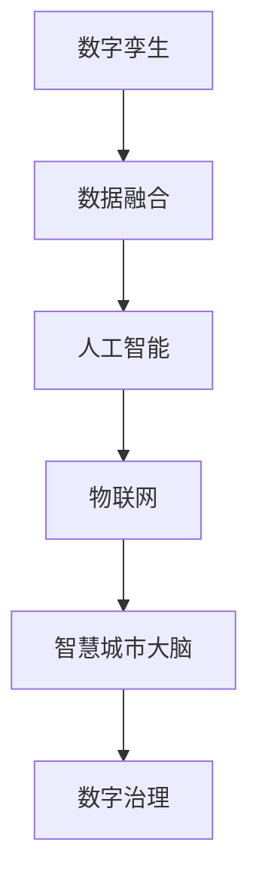

                 

关键词：数字治理，数字孪生，智慧城市，算法，数学模型，项目实践，未来展望

> 摘要：本文深入探讨了2050年的数字治理趋势，特别是数字孪生城市和智慧城市大脑的数字孪生治理。通过分析核心概念、算法原理、数学模型以及项目实践，我们旨在提供一个全面的技术视角，展望未来数字治理的前景和挑战。

## 1. 背景介绍

随着全球数字化进程的加速，数字治理已经成为城市管理和社会治理的重要手段。2050年的数字治理，不仅仅是对现有技术的简单应用，更是对新兴技术和概念的创新性融合。在这一背景下，数字孪生和智慧城市大脑成为了数字治理的重要组成部分。

### 数字孪生

数字孪生是一种通过创建数字模型来模拟和分析现实世界对象或系统的技术。在数字治理中，数字孪生被广泛应用于城市规划、交通管理、能源优化等领域，通过实时模拟和预测，提高决策的效率和准确性。

### 智慧城市大脑

智慧城市大脑是数字治理的高级形式，它通过整合各种数据源，利用先进的人工智能和大数据分析技术，实现城市运行的全景可视化和智能化管理。智慧城市大脑的目标是提供更加高效、安全、可持续的城市服务。

## 2. 核心概念与联系

在数字治理中，核心概念包括数字孪生、数据融合、人工智能、物联网等。这些概念之间有着密切的联系，共同构成了数字治理的框架。

### 数字孪生

数字孪生（Digital Twin）是一个物理实体（如城市、工厂、机器等）的虚拟复制体，它可以实时反映实体的状态和行为。数字孪生利用传感器数据、模拟仿真和实时数据传输等技术，实现物理世界和虚拟世界的无缝对接。

### 数据融合

数据融合（Data Fusion）是指将来自不同来源的数据进行整合、分析和处理，以获得更准确、更全面的信息。在数字治理中，数据融合是实现智慧城市大脑的基础，它涉及多源数据的采集、传输、存储和处理。

### 人工智能

人工智能（AI）是数字治理的核心驱动力，它通过机器学习、深度学习等技术，实现对海量数据的自动分析和决策。在智慧城市大脑中，人工智能用于优化交通流量、预测天气变化、诊断城市设施故障等。

### 物联网

物联网（IoT）是将物理设备和传感器连接到互联网，实现实时数据采集和远程控制。在数字治理中，物联网是实现数据融合和数字孪生的基础，它提供了丰富的数据源，为智慧城市大脑提供了重要的支持。

### Mermaid 流程图



## 3. 核心算法原理 & 具体操作步骤

### 3.1 算法原理概述

数字治理中的核心算法主要包括数据融合算法、人工智能算法和优化算法。这些算法共同构成了数字治理的技术基础。

### 3.2 算法步骤详解

#### 数据融合算法

1. 数据采集：从各种来源（如传感器、互联网、数据库等）收集数据。
2. 数据清洗：去除噪声数据、缺失数据和异常数据。
3. 数据整合：将不同来源的数据进行整合，形成统一的数据模型。
4. 数据分析：利用统计分析和机器学习技术，提取有价值的信息。

#### 人工智能算法

1. 模型训练：使用历史数据训练机器学习模型。
2. 模型评估：评估模型的效果，调整参数。
3. 模型应用：将训练好的模型应用于实际问题，如交通流量预测、故障诊断等。

#### 优化算法

1. 问题定义：明确需要解决的问题，如路径规划、资源分配等。
2. 目标函数：定义优化问题的目标函数。
3. 约束条件：设定问题的约束条件。
4. 求解：利用优化算法（如线性规划、遗传算法等）求解最优解。

### 3.3 算法优缺点

#### 数据融合算法

优点：可以整合多源数据，提供更全面的信息。

缺点：数据质量问题和隐私问题。

#### 人工智能算法

优点：可以自动学习和预测，提高决策效率。

缺点：对数据和计算资源的要求较高。

#### 优化算法

优点：可以找到最优解，提高资源利用率。

缺点：求解过程可能复杂，需要大量计算资源。

### 3.4 算法应用领域

#### 数据融合算法

应用领域：城市规划、环境监测、智能交通等。

#### 人工智能算法

应用领域：智慧医疗、智能安防、智能客服等。

#### 优化算法

应用领域：物流优化、能源管理、交通调度等。

## 4. 数学模型和公式 & 详细讲解 & 举例说明

### 4.1 数学模型构建

在数字治理中，常见的数学模型包括线性回归、神经网络和线性规划等。

### 4.2 公式推导过程

#### 线性回归

线性回归模型的表达式为：$y = \beta_0 + \beta_1 \cdot x$

其中，$y$ 是因变量，$x$ 是自变量，$\beta_0$ 是截距，$\beta_1$ 是斜率。

#### 神经网络

神经网络的基本公式为：$a_{i,j} = \sigma(\sum_{k=1}^{n} w_{ik} \cdot a_{ik} + b_j)$

其中，$a_{i,j}$ 是第 $i$ 层第 $j$ 个神经元的输出，$\sigma$ 是激活函数，$w_{ik}$ 是连接权重，$a_{ik}$ 是前一层第 $k$ 个神经元的输出，$b_j$ 是偏置。

#### 线性规划

线性规划的目标函数为：$max \, c^T \cdot x$

约束条件为：$A \cdot x \leq b$

其中，$c$ 是目标函数系数向量，$x$ 是决策变量向量，$A$ 是约束条件系数矩阵，$b$ 是约束条件常数向量。

### 4.3 案例分析与讲解

#### 交通流量预测

假设我们要预测某城市某条道路的交通流量，可以使用线性回归模型。首先，收集历史交通流量数据，包括时间、天气条件、节假日等因素。然后，使用线性回归模型进行训练，得到预测模型。最后，根据当前的时间、天气等条件，输入模型进行预测。

#### 城市能源管理

假设我们要优化城市的能源管理，可以使用线性规划模型。首先，确定城市的能源需求，包括住宅、商业、工业等。然后，设定能源供应的约束条件，如太阳能、风能、煤炭等。最后，使用线性规划模型求解最优的能源分配方案，以提高能源利用效率。

## 5. 项目实践：代码实例和详细解释说明

### 5.1 开发环境搭建

在数字治理项目中，常用的开发环境包括Python、R、MATLAB等。以Python为例，我们需要安装以下库：NumPy、Pandas、Scikit-learn、Matplotlib等。

### 5.2 源代码详细实现

以下是一个简单的线性回归预测交通流量的示例代码：

```python
import numpy as np
import pandas as pd
from sklearn.linear_model import LinearRegression
import matplotlib.pyplot as plt

# 数据预处理
def preprocess_data(data):
    # ... 数据预处理代码 ...
    return X, y

# 模型训练
def train_model(X, y):
    model = LinearRegression()
    model.fit(X, y)
    return model

# 预测
def predict(model, X_new):
    return model.predict(X_new)

# 主函数
def main():
    # 加载数据
    data = pd.read_csv('traffic_data.csv')
    X, y = preprocess_data(data)

    # 训练模型
    model = train_model(X, y)

    # 预测
    X_new = preprocess_data(data_new)
    predictions = predict(model, X_new)

    # 可视化
    plt.scatter(X, y, color='blue')
    plt.plot(X, predictions, color='red')
    plt.xlabel('Time')
    plt.ylabel('Traffic Flow')
    plt.show()

if __name__ == '__main__':
    main()
```

### 5.3 代码解读与分析

这段代码首先导入了必要的库，然后定义了数据预处理、模型训练、预测和主函数。在主函数中，我们加载了交通流量数据，进行了预处理，训练了线性回归模型，并使用该模型进行了预测。最后，我们将预测结果可视化，以观察模型的准确性。

### 5.4 运行结果展示

运行上述代码后，我们可以看到一个散点图，其中蓝色点代表实际交通流量，红色线代表预测交通流量。从图中可以看出，预测结果与实际数据有一定的吻合度，说明线性回归模型在该场景下具有一定的预测能力。

## 6. 实际应用场景

### 6.1 城市规划

数字治理在城市规划中发挥着重要作用。通过数字孪生技术，城市规划师可以实时模拟城市的发展情况，预测不同规划方案的影响，从而做出更科学的决策。

### 6.2 智能交通

智能交通是数字治理的重要应用领域。通过数据融合和人工智能技术，交通管理部门可以实时监控交通状况，预测交通流量，优化交通信号控制，提高道路通行效率。

### 6.3 能源管理

数字治理在能源管理中也有广泛应用。通过优化算法和大数据分析，能源管理部门可以实时监测能源使用情况，预测能源需求，优化能源分配，提高能源利用效率。

## 7. 工具和资源推荐

### 7.1 学习资源推荐

- 《数字孪生：理论与实践》（Digital Twin: Theory and Practice）
- 《人工智能：一种现代方法》（Artificial Intelligence: A Modern Approach）
- 《优化算法导论》（Introduction to Optimization Algorithms）

### 7.2 开发工具推荐

- Python：适用于数据分析和机器学习。
- R：适用于统计分析。
- MATLAB：适用于数值计算和可视化。

### 7.3 相关论文推荐

- "Digital Twins: A Roadmap for the Future of the Physical World" by Michael Grieves
- "Artificial Intelligence for Urban Systems: A Survey" by Wei Chen et al.
- "Data Fusion in Smart Cities: A Survey" by Yang Qu et al.

## 8. 总结：未来发展趋势与挑战

### 8.1 研究成果总结

数字治理在数字孪生、人工智能、数据融合等领域取得了显著成果，为智慧城市建设提供了强有力的技术支持。

### 8.2 未来发展趋势

未来，数字治理将朝着更智能、更高效、更安全的方向发展。数字孪生技术将更加成熟，人工智能将更加普及，数据融合技术将更加先进。

### 8.3 面临的挑战

数字治理面临的主要挑战包括数据隐私、数据安全、技术标准化等。如何确保数据的安全性和隐私性，如何实现技术标准化，是数字治理需要解决的重要问题。

### 8.4 研究展望

未来，数字治理的研究将朝着更深入、更广泛的方向发展。特别是在跨学科研究、国际合作等方面，将取得更多突破。

## 9. 附录：常见问题与解答

### 9.1 什么是数字孪生？

数字孪生是一种通过创建数字模型来模拟和分析现实世界对象或系统的技术。

### 9.2 智慧城市大脑的核心功能是什么？

智慧城市大脑的核心功能包括数据融合、智能分析和决策支持，以实现城市运行的全景可视化和智能化管理。

### 9.3 数字治理中的核心算法有哪些？

数字治理中的核心算法包括数据融合算法、人工智能算法和优化算法。

### 9.4 数字治理在哪些领域有实际应用？

数字治理在城市规划、智能交通、能源管理、环境保护等领域有广泛的应用。

### 9.5 如何确保数字治理的安全性和隐私性？

确保数字治理的安全性和隐私性需要采用多种技术手段，如数据加密、访问控制、隐私保护算法等。

---

本文由禅与计算机程序设计艺术 / Zen and the Art of Computer Programming 撰写，旨在探讨2050年的数字治理趋势，特别是数字孪生城市和智慧城市大脑的数字孪生治理。通过分析核心概念、算法原理、数学模型以及项目实践，我们展望了未来数字治理的前景和挑战。希望本文能为读者提供有价值的参考和启示。

