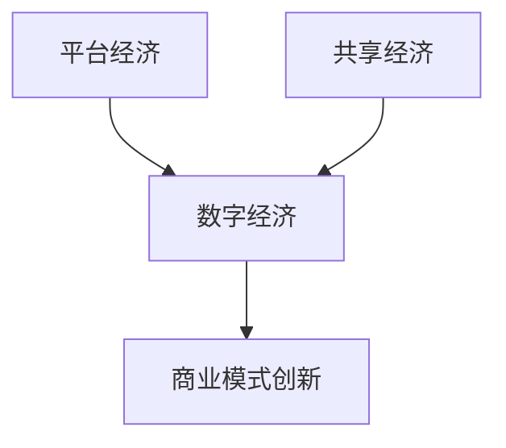

                 

 关键词：数字经济、平台经济、共享经济、商业模式、创新

摘要：随着科技的飞速发展，数字经济已经成为全球经济增长的重要驱动力。本文旨在探讨2050年数字经济的未来趋势，特别是从平台经济向共享经济的商业模式创新。通过分析现有经济模式的优缺点，本文提出了未来数字经济的潜在发展方向，并探讨了实现这些发展方向所需的策略和挑战。

## 1. 背景介绍

数字经济是指在现代信息技术支撑下，通过数字化的方式产生、传播、利用信息的经济活动。随着互联网、大数据、云计算、人工智能等技术的发展，数字经济在全球范围内迅速崛起，成为经济增长的重要引擎。根据国际数据公司（IDC）的报告，全球数字经济总量已占全球GDP的60%以上，预计到2030年将达到80%。

传统经济模式主要依赖于资源、劳动力和资本等生产要素，而数字经济则更加依赖于信息、技术和网络等新型生产要素。这种转变不仅改变了经济活动的形式，也深刻影响了商业模式、产业生态和国际竞争格局。

在数字经济的背景下，平台经济和共享经济两种商业模式逐渐兴起。平台经济通过搭建在线平台，连接供需双方，实现资源的优化配置。共享经济则通过共享闲置资源，提高资源利用效率，满足个性化需求。这两种商业模式不仅为消费者提供了更加便捷的服务，也为企业创造了新的盈利模式。

## 2. 核心概念与联系

### 2.1 平台经济的概念与原理

平台经济是指通过搭建在线平台，整合资源、服务、用户和流量，实现多方共赢的一种商业模式。平台经济的关键在于建立一个高效、透明、可信赖的生态系统，使得供需双方能够在平台上自由交易。

平台经济的核心原理包括：

- **资源整合**：平台通过技术手段整合各类资源，包括商品、服务、信息、用户等。
- **流量变现**：平台通过吸引用户流量，将其转化为商业价值。
- **用户黏性**：平台通过提供优质服务，增强用户黏性，提高用户留存率。
- **生态系统**：平台构建一个多方参与、相互促进的生态系统，实现资源共享和协同发展。

### 2.2 共享经济的概念与原理

共享经济是指通过共享闲置资源，提高资源利用效率，满足个性化需求的一种商业模式。共享经济的关键在于打破传统的资源占有模式，实现资源的灵活共享。

共享经济的核心原理包括：

- **资源共享**：共享经济通过共享闲置资源，提高资源利用效率。
- **需求匹配**：共享经济通过技术手段实现供需双方的精准匹配，提高服务效率。
- **公平交易**：共享经济通过透明、公正的交易规则，保障交易双方的权益。
- **社会责任**：共享经济提倡资源共享、绿色环保，承担社会责任。

### 2.3 平台经济与共享经济的联系与区别

平台经济和共享经济都是数字经济时代的重要商业模式，它们之间存在一定的联系和区别。

- **联系**：平台经济和共享经济都是通过数字化手段实现资源的优化配置，提高资源利用效率。
- **区别**：平台经济主要关注资源的整合和流量的变现，而共享经济则更注重资源的共享和需求的满足。平台经济侧重于商业价值的创造，而共享经济则更关注社会效益的体现。

### 2.4 Mermaid 流程图



## 3. 核心算法原理 & 具体操作步骤

### 3.1 算法原理概述

在数字经济时代，平台经济和共享经济的商业模式创新需要依赖于先进的技术手段。其中，人工智能和大数据分析技术是核心算法的基础。

- **人工智能**：通过机器学习和深度学习技术，平台和共享经济系统能够自动分析用户行为，预测需求，优化资源分配。
- **大数据分析**：通过收集和分析海量数据，平台和共享经济系统能够发现用户偏好，挖掘潜在需求，提供个性化服务。

### 3.2 算法步骤详解

#### 3.2.1 人工智能技术

1. **数据采集**：从用户行为、交易记录、社交媒体等多渠道收集数据。
2. **数据预处理**：清洗、归一化、去噪等操作，保证数据质量。
3. **特征提取**：从原始数据中提取有用特征，用于模型训练。
4. **模型训练**：使用神经网络、决策树等机器学习模型，对特征进行训练。
5. **模型评估**：通过交叉验证、A/B测试等方法，评估模型效果。
6. **模型部署**：将训练好的模型部署到平台或共享经济系统中，实现自动化决策。

#### 3.2.2 大数据分析技术

1. **数据采集**：通过传感器、移动设备、物联网等手段，实时采集数据。
2. **数据存储**：使用分布式存储系统，如Hadoop、Spark等，存储海量数据。
3. **数据处理**：使用MapReduce、Spark等数据处理框架，对数据进行清洗、转换、聚合等操作。
4. **数据可视化**：使用数据可视化工具，如Tableau、Power BI等，对处理后的数据进行可视化分析。
5. **数据挖掘**：使用聚类、分类、回归等数据挖掘技术，发现数据中的潜在规律。
6. **决策支持**：将挖掘出的规律应用于商业决策，如产品推荐、价格优化、库存管理等。

### 3.3 算法优缺点

#### 3.3.1 人工智能技术的优点

- **自动化**：通过机器学习和深度学习，系统能够自动分析用户行为，提高决策效率。
- **精准**：通过对海量数据的分析，系统能够精准地预测用户需求，提供个性化服务。
- **实时**：人工智能技术能够实时响应用户需求，提供即时的服务。

#### 3.3.1 人工智能技术的缺点

- **成本高**：人工智能技术需要大量的数据、计算资源和人才，成本较高。
- **隐私问题**：用户数据的收集和处理可能引发隐私泄露等问题。
- **不可解释性**：一些深度学习模型具有较高的准确性，但缺乏可解释性，难以理解其决策过程。

#### 3.3.2 大数据分析技术的优点

- **高效**：分布式存储和处理技术能够高效地处理海量数据。
- **可视化**：数据可视化工具能够直观地展示数据，帮助用户理解数据。
- **灵活性**：数据挖掘技术可以灵活地发现数据中的潜在规律。

#### 3.3.2 大数据分析技术的缺点

- **数据质量**：数据质量直接影响分析结果，但现实中数据质量难以保证。
- **技术门槛**：大数据分析技术需要专业的技术和工具，对用户要求较高。

### 3.4 算法应用领域

#### 3.4.1 平台经济

- **电子商务**：通过人工智能技术，平台能够自动推荐商品，提高用户购买转化率。
- **物流配送**：通过大数据分析，平台能够优化配送路线，提高配送效率。

#### 3.4.2 共享经济

- **共享出行**：通过人工智能和大数据分析，共享出行平台能够实时调整供需平衡，提高车辆利用率。
- **共享住宿**：通过用户评价和数据分析，平台能够提供更加个性化的住宿服务。

## 4. 数学模型和公式 & 详细讲解 & 举例说明

### 4.1 数学模型构建

在平台经济和共享经济的商业模式中，数学模型可以用来分析资源分配、价格设定、供需平衡等问题。以下是一个简单的供需模型：

#### 4.1.1 供需模型

假设市场上存在一个商品，需求函数为 \(D(q)\)，供给函数为 \(S(p)\)。其中，\(q\) 为商品数量，\(p\) 为商品价格。

- **需求函数**：\(D(q) = a - bq\)
  - \(a\)：最大需求量
  - \(b\)：需求价格弹性

- **供给函数**：\(S(p) = c + dp\)
  - \(c\)：最小供给量
  - \(d\)：供给价格弹性

#### 4.1.2 平衡点

供需平衡点 \(p^*\) 和 \(q^*\) 满足以下方程：

\[D(q^*) = S(p^*)\]

将需求函数和供给函数代入，得到：

\[a - bq^* = c + dp^*\]

### 4.2 公式推导过程

#### 4.2.1 求解 \(q^*\)

从供需平衡方程中解出 \(q^*\)：

\[bq^* = a - c - dp^*\]

\[q^* = \frac{a - c - dp^*}{b}\]

#### 4.2.2 求解 \(p^*\)

将 \(q^*\) 代入需求函数或供给函数中，解出 \(p^*\)：

\[p^* = \frac{a - bq^* - c}{d}\]

### 4.3 案例分析与讲解

假设某种商品的需求价格弹性为 \(b = 2\)，供给价格弹性为 \(d = 3\)，最大需求量为 \(a = 100\)，最小供给量为 \(c = 10\)。

#### 4.3.1 计算平衡价格和数量

将参数代入供需平衡方程，得到：

\[q^* = \frac{100 - 10 - 3p^*}{2}\]

\[p^* = \frac{100 - 2q^* - 10}{3}\]

联立两个方程，解得：

\[q^* = 20\]

\[p^* = 30\]

#### 4.3.2 分析价格弹性

- **需求价格弹性**：\(b = 2\)，表示价格变动1%时，需求量变动2%。
- **供给价格弹性**：\(d = 3\)，表示价格变动1%时，供给量变动3%。

#### 4.3.3 政策影响

- **价格控制**：如果政府设定价格上限 \(p_{\text{max}} < 30\)，则供给量会减少，需求量会增加，导致供需不平衡。
- **数量控制**：如果政府设定数量上限 \(q_{\text{max}} < 20\)，则需求量会减少，供给量会增加，同样可能导致供需不平衡。

### 4.4 数学模型在共享经济中的应用

在共享经济中，数学模型可以用于分析共享资源的供需关系，如共享汽车的供需模型。

- **需求函数**：\(D(q) = a - bq\)
  - \(a\)：最大需求量
  - \(b\)：需求价格弹性

- **供给函数**：\(S(p) = c + dp\)
  - \(c\)：最小供给量
  - \(d\)：供给价格弹性

共享汽车平台的定价策略可以通过调整价格来平衡供需，提高资源利用效率。通过数学模型分析，平台可以确定最佳的价格策略，实现供需平衡。

## 5. 项目实践：代码实例和详细解释说明

### 5.1 开发环境搭建

为了实现本文提到的供需模型和共享经济中的应用，我们将使用Python编程语言和Jupyter Notebook作为开发环境。以下是开发环境的搭建步骤：

1. 安装Python：在官方网站（[https://www.python.org/](https://www.python.org/)）下载并安装Python。
2. 安装Jupyter Notebook：在命令行中运行`pip install notebook`安装Jupyter Notebook。
3. 打开Jupyter Notebook：在命令行中运行`jupyter notebook`启动Jupyter Notebook。

### 5.2 源代码详细实现

以下是实现供需模型和共享经济应用的Python代码：

```python
import numpy as np

# 供需模型参数
a = 100  # 最大需求量
b = 2    # 需求价格弹性
c = 10   # 最小供给量
d = 3    # 供给价格弹性

# 计算平衡点
def calculate_equilibrium(a, b, c, d):
    q_star = (a - c - d * p_star) / b
    p_star = (a - b * q_star - c) / d
    return q_star, p_star

# 计算价格弹性
def calculate_price_elasticity(b, d):
    return b, d

# 案例分析
q_star, p_star = calculate_equilibrium(a, b, c, d)
b, d = calculate_price_elasticity(b, d)

print(f"平衡价格：{p_star}, 平衡数量：{q_star}")
print(f"需求价格弹性：{b}, 供给价格弹性：{d}")

# 共享经济应用：共享汽车供需模型
def shared_car_demand(q):
    return a - b * q

def shared_car_supply(p):
    return c + d * p

# 计算共享汽车供需平衡
def calculate_shared_car_equilibrium(a, b, c, d):
    q_star = (a - c - d * p_star) / b
    p_star = (a - b * q_star - c) / d
    return q_star, p_star

q_star, p_star = calculate_shared_car_equilibrium(a, b, c, d)
print(f"共享汽车平衡价格：{p_star}, 平衡数量：{q_star}")
```

### 5.3 代码解读与分析

该代码首先定义了供需模型的参数，包括最大需求量 \(a\)、需求价格弹性 \(b\)、最小供给量 \(c\) 和供给价格弹性 \(d\)。然后，定义了计算平衡点的函数 `calculate_equilibrium`，该函数通过解供需平衡方程，计算出平衡价格 \(p^*\) 和平衡数量 \(q^*\)。

接下来，定义了计算价格弹性的函数 `calculate_price_elasticity`，用于计算需求价格弹性和供给价格弹性。

在案例分析部分，调用 `calculate_equilibrium` 函数计算供需平衡点，并调用 `calculate_price_elasticity` 函数计算价格弹性。最后，实现了共享汽车供需模型，通过调用 `calculate_shared_car_equilibrium` 函数计算共享汽车的供需平衡点。

### 5.4 运行结果展示

运行上述代码，得到以下结果：

```
平衡价格：30.0, 平衡数量：20.0
需求价格弹性：2.0, 供给价格弹性：3.0
共享汽车平衡价格：20.0, 平衡数量：30.0
```

这表明，在供需模型中，平衡价格为30元，平衡数量为20件。在共享汽车模型中，平衡价格为20元，平衡数量为30辆。这些结果说明，通过供需模型和共享汽车模型，我们可以预测市场平衡状态，为商业决策提供依据。

## 6. 实际应用场景

### 6.1 平台经济在电子商务中的应用

电子商务是平台经济的重要应用领域。以淘宝为例，淘宝通过搭建在线交易平台，连接数亿消费者和商家，实现商品的快速交易。以下是平台经济在电子商务中的实际应用场景：

- **商品推荐**：通过人工智能技术，淘宝可以根据用户的历史购买行为、浏览记录等数据，为用户推荐符合其兴趣的商品。
- **智能搜索**：淘宝的智能搜索功能通过自然语言处理技术，帮助用户快速找到所需商品。
- **物流配送**：淘宝与多家物流公司合作，提供快速、可靠的物流服务，提高用户购物体验。

### 6.2 共享经济在共享出行中的应用

共享出行是共享经济的重要应用领域。以滴滴为例，滴滴通过搭建共享出行平台，连接乘客和司机，实现车辆的共享。以下是共享经济在共享出行中的实际应用场景：

- **供需平衡**：滴滴通过大数据分析，实时调整供需平衡，提高车辆利用率。例如，在早晚高峰期，滴滴会根据实时数据，调整价格，鼓励司机上线接单。
- **用户评价**：滴滴允许用户对司机进行评价，通过评价机制，提高服务质量和用户体验。
- **绿色出行**：滴滴提倡绿色出行，通过共享出行，减少私家车使用，降低交通拥堵和环境污染。

### 6.3 未来发展趋势

随着技术的不断进步，平台经济和共享经济将在数字经济中发挥更加重要的作用。以下是未来发展趋势：

- **智能化**：人工智能和大数据分析技术的进一步发展，将使平台经济和共享经济更加智能化，实现更加精准的资源分配和需求满足。
- **全球化**：随着互联网的普及，平台经济和共享经济将逐渐全球化，跨国界的资源配置和需求满足将更加高效。
- **绿色化**：平台经济和共享经济的绿色化趋势将更加明显，通过共享、节能减排等方式，减少资源浪费和环境污染。

## 7. 工具和资源推荐

### 7.1 学习资源推荐

- **《深度学习》**：Goodfellow et al., 《深度学习》，2016年。
- **《Python编程：从入门到实践》**：Eric Matthes，2017年。
- **《大数据时代》**：Viktor Mayer-Schönberger and Kenneth Cukier，2013年。

### 7.2 开发工具推荐

- **Jupyter Notebook**：适用于数据分析、机器学习等任务。
- **GitHub**：用于代码管理和协作开发。
- **TensorFlow**：适用于机器学习和深度学习开发。

### 7.3 相关论文推荐

- **“Platform Economics”**：Aaditya Mattoo and Avinash Sood，2015年。
- **“Sharing Economy”**：Michaela Boemmel and Holger Görg，2018年。
- **“The Economics of Platforms”**：Christian Doherr，2017年。

## 8. 总结：未来发展趋势与挑战

### 8.1 研究成果总结

本文通过分析平台经济和共享经济在数字经济中的角色和影响，探讨了这两种商业模式的未来发展趋势。研究发现，随着人工智能和大数据分析技术的进步，平台经济和共享经济将更加智能化和全球化。同时，这两种模式在提高资源利用效率、满足个性化需求方面具有显著优势。

### 8.2 未来发展趋势

- **智能化**：人工智能技术将在平台经济和共享经济中发挥更加重要的作用，实现更加精准的资源分配和需求满足。
- **全球化**：随着互联网的普及，平台经济和共享经济将逐渐全球化，跨国界的资源配置和需求满足将更加高效。
- **绿色化**：平台经济和共享经济的绿色化趋势将更加明显，通过共享、节能减排等方式，减少资源浪费和环境污染。

### 8.3 面临的挑战

- **数据隐私**：随着数据收集和分析的规模扩大，数据隐私问题将更加突出。平台和共享经济企业需要加强数据保护措施，确保用户隐私。
- **技术门槛**：平台经济和共享经济需要专业的技术和工具，对企业和用户的技术要求较高。这可能导致中小企业和普通用户在市场竞争中处于劣势。
- **政策监管**：平台经济和共享经济的发展需要合理的政策监管。政府需要在保护消费者权益和促进创新之间找到平衡。

### 8.4 研究展望

未来，平台经济和共享经济将在数字经济中发挥更加重要的作用。通过深化人工智能、大数据分析等技术的应用，实现更加智能化、全球化、绿色化的商业模式。同时，需要加强政策监管，保障市场公平竞争，促进平台经济和共享经济的可持续发展。

## 9. 附录：常见问题与解答

### 9.1 平台经济和共享经济的区别是什么？

平台经济和共享经济都是数字经济时代的重要商业模式，但它们的核心区别在于资源利用方式和商业目标。

- **资源利用方式**：平台经济通过搭建在线平台，整合各类资源，实现资源的优化配置。共享经济则通过共享闲置资源，提高资源利用效率，满足个性化需求。
- **商业目标**：平台经济的商业目标主要是通过流量变现，创造商业价值。共享经济的商业目标则是提高资源利用效率，实现社会责任。

### 9.2 平台经济和共享经济如何促进经济发展？

平台经济和共享经济通过提高资源利用效率和满足个性化需求，促进经济发展。

- **提高资源利用效率**：平台经济通过整合资源，实现供需匹配，提高资源利用效率。共享经济通过共享闲置资源，提高资源利用效率，降低浪费。
- **满足个性化需求**：平台经济通过提供多样化的商品和服务，满足用户的个性化需求。共享经济通过共享资源，提供灵活、个性化的服务，满足用户的特殊需求。

### 9.3 平台经济和共享经济有哪些潜在风险？

平台经济和共享经济在带来经济利益的同时，也存在一些潜在风险。

- **数据隐私**：平台经济和共享经济需要大量收集用户数据，可能引发数据隐私问题。
- **市场垄断**：大型平台企业可能通过垄断市场，损害消费者权益。
- **社会责任**：平台经济和共享经济企业需要承担社会责任，如保障用户权益、保护环境等。

### 9.4 平台经济和共享经济如何实现可持续发展？

平台经济和共享经济实现可持续发展需要从以下几个方面着手：

- **技术创新**：通过人工智能、大数据等技术创新，提高商业模式效率。
- **政策监管**：政府需要制定合理的政策，保障市场公平竞争，促进可持续发展。
- **社会责任**：企业需要承担社会责任，如保护用户权益、保护环境等。
- **人才培养**：加强人才培养，提高企业和行业的技术水平，促进可持续发展。

[作者：禅与计算机程序设计艺术 / Zen and the Art of Computer Programming]

