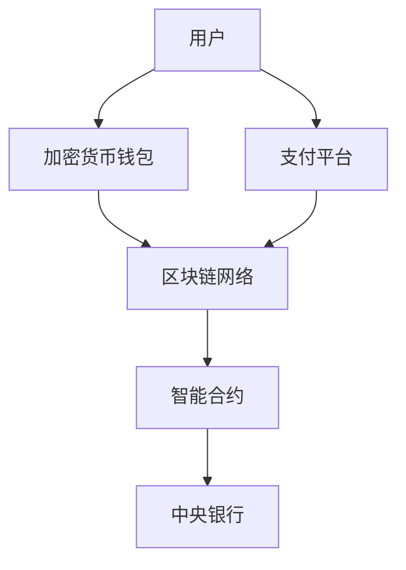

                 

关键词：数字货币，法定数字货币，区块链，智能合约，全球货币体系，加密技术

> 摘要：本文探讨了2050年数字货币的发展趋势和全球货币体系的重构。通过分析法定数字货币的发展现状，结合区块链、智能合约等技术的创新，本文提出了数字货币在未来将如何成为全球货币体系核心的预测。文章还探讨了数字货币在金融科技、国际贸易和全球支付等领域的应用前景，以及未来可能面临的挑战和应对策略。

## 1. 背景介绍

数字货币的兴起可以追溯到2009年比特币的诞生。作为一种去中心化的电子货币，比特币利用密码学原理确保交易安全，并采用共识算法维持系统稳定。随着比特币的成功，越来越多的数字货币项目相继涌现，如以太坊、莱特币等。这些数字货币不仅改变了人们的支付方式，也引发了金融科技和全球货币体系的深刻变革。

### 法定数字货币的发展

近年来，许多国家开始研究法定数字货币（Central Bank Digital Currency, CBDC）。法定数字货币是由中央银行发行的数字货币，旨在补充或替代传统货币。2014年，瑞典Riksbank推出了e-Krона项目，标志着法定数字货币的初步尝试。随后，许多国家，包括中国、美国、欧洲等，都在积极探索法定数字货币的发行和应用。

### 区块链和智能合约技术的推动

区块链技术作为数字货币的核心支撑，以其去中心化、透明和不可篡改的特点，引起了广泛的关注。区块链不仅为数字货币提供了安全的基础设施，也为智能合约的实现提供了平台。智能合约是一种自动执行合同条款的计算机程序，其执行过程依赖于区块链的透明性和不可篡改性，使得交易更加高效和可靠。

## 2. 核心概念与联系

### 数字货币的基本原理

数字货币是一种基于加密算法的电子货币，其核心在于去中心化和安全性。去中心化意味着没有中央机构控制货币的发行和流通，而是通过分布式网络达成共识。安全性则依赖于密码学原理，包括数字签名、哈希函数等，确保交易不可篡改和匿名性。

### 区块链技术的作用

区块链技术是数字货币的核心基础设施，其通过分布式账本技术记录交易信息，确保数据的透明性和不可篡改性。区块链分为公有链和私有链，分别适用于不同的应用场景。

### 智能合约的应用

智能合约是区块链上的计算机程序，用于自动化执行合同条款。智能合约通过预定义的逻辑条件触发执行，确保交易的高效和可靠性。

### Mermaid 流程图

以下是一个简化的数字货币系统流程图，展示了各核心组件之间的关系：



## 3. 核心算法原理 & 具体操作步骤

### 3.1 算法原理概述

数字货币的核心算法包括密码学原理、分布式共识算法和智能合约执行机制。密码学原理确保交易安全，分布式共识算法维持网络稳定性，智能合约执行机制实现自动化交易。

### 3.2 算法步骤详解

1. **用户发起交易**：用户通过加密货币钱包发起交易，钱包使用数字签名确保交易安全。
2. **交易验证**：交易信息被广播到区块链网络，网络节点进行验证。
3. **共识达成**：通过分布式共识算法，网络节点达成共识，将交易信息记录到区块链。
4. **智能合约执行**：如果交易涉及智能合约，合约逻辑条件满足，执行智能合约。
5. **交易确认**：交易被多个区块确认，确保其不可篡改。

### 3.3 算法优缺点

**优点**：
- 去中心化：无需中央机构控制，提高系统透明度和可信度。
- 安全性：基于密码学原理，交易信息高度安全。
- 高效性：分布式共识和智能合约实现快速交易。

**缺点**：
- 能耗问题：部分区块链系统耗能较高。
- 可扩展性问题：随着节点数量增加，网络性能可能下降。

### 3.4 算法应用领域

数字货币和区块链技术已广泛应用于金融科技、供应链管理、身份验证等领域。未来，随着技术的进一步发展，数字货币有望在跨境支付、智能城市、物联网等更多领域发挥作用。

## 4. 数学模型和公式 & 详细讲解 & 举例说明

### 4.1 数学模型构建

数字货币系统中的数学模型主要包括密码学模型、共识算法模型和智能合约模型。以下以比特币的共识算法为例，介绍数学模型的基本原理。

### 4.2 公式推导过程

比特币的共识算法基于工作量证明（Proof of Work, PoW）。以下是一个简化的工作量证明公式：

$$
PoW = H_n(S, T, N)
$$

其中，$H_n$ 是哈希函数，$S$ 是交易集，$T$ 是时间戳，$N$ 是随机数。矿工需要找到一个随机数 $N$，使得哈希值满足以下条件：

$$
H_n(S, T, N) < T
$$

### 4.3 案例分析与讲解

假设当前区块的交易集 $S$ 为10笔交易，时间戳 $T$ 为当前时间，随机数 $N$ 初始为0。矿工通过不断尝试不同的随机数，直到找到一个满足条件的 $N$ 值。

以下是一个实际的工作量证明过程示例：

1. 矿工选择初始随机数 $N = 0$。
2. 计算哈希值 $H_n(S, T, N)$。
3. 检查哈希值是否小于 $T$。如果是，结束计算；如果不是，增加随机数 $N$，重复步骤2和3。
4. 找到满足条件的 $N$ 值，记录该区块，矿工获得比特币奖励。

## 5. 项目实践：代码实例和详细解释说明

### 5.1 开发环境搭建

本文使用Go语言和Ethereum区块链平台进行数字货币项目的开发。首先，需要安装Go语言环境（版本1.18以上）和Ethereum客户端（Geth）。

### 5.2 源代码详细实现

以下是一个简单的数字货币智能合约实现：

```go
// SPDX-License-Identifier: MIT
pragma solidity ^0.8.0;

contract DigitalCurrency {
    mapping(address => uint256) private balances;
    address public owner;

    constructor() {
        owner = msg.sender;
        balances[owner] = 1000000; // 初始化货币供应量
    }

    function transfer(address to, uint256 amount) public {
        require(to != address(0), "Invalid recipient");
        require(balances[msg.sender] >= amount, "Insufficient balance");
        balances[msg.sender] -= amount;
        balances[to] += amount;
        emit Transfer(msg.sender, to, amount);
    }

    function balanceOf(address account) public view returns (uint256) {
        return balances[account];
    }

    event Transfer(address from, address to, uint256 amount);
}
```

### 5.3 代码解读与分析

该智能合约实现了基本的数字货币功能，包括账户余额查询、转账等。以下是关键代码的解释：

- `mapping(address => uint256) private balances;`：定义了一个账户余额映射，存储每个地址的余额。
- `constructor()`：合约构造函数，初始化货币供应量和合约拥有者。
- `transfer(address to, uint256 amount)`：转账函数，实现账户之间的货币转移。
- `balanceOf(address account)`：查询账户余额的函数。
- `event Transfer(address from, address to, uint256 amount)`：事件日志，记录转账信息。

### 5.4 运行结果展示

假设Alice（地址0x123）向Bob（地址0x456）转账100个数字货币。以下是相关操作和结果：

1. Alice调用 `transfer` 函数，传入Bob的地址和转账金额。
2. 智能合约执行转账操作，减少Alice的余额，增加Bob的余额。
3. 事件日志记录转账信息，供后续查询。

## 6. 实际应用场景

### 6.1 金融科技

数字货币在金融科技领域的应用非常广泛，包括支付、投资、保险等。数字货币提高了交易速度和安全性，降低了跨境支付的成本。

### 6.2 国际贸易

数字货币在国际贸易中的应用有望简化支付流程，减少交易时间和成本。通过区块链技术，可以实现实时结算和信用保障。

### 6.3 全球支付

数字货币在跨境支付中的应用前景广阔。通过分布式网络和智能合约，可以实现快速、低成本的全球支付。

## 7. 未来应用展望

随着技术的不断进步，数字货币在未来有望在更多领域发挥作用，包括物联网、智能城市、供应链管理等。同时，全球货币体系的重构也将带来新的机遇和挑战。

## 8. 工具和资源推荐

### 8.1 学习资源推荐

- 《区块链技术指南》
- 《密码学》
- 《智能合约开发：以太坊实践》

### 8.2 开发工具推荐

- Ethereum Studio
- Truffle
- Remix IDE

### 8.3 相关论文推荐

- “A Technical Overview of the Bitcoin System”
- “A Consensus Protocol for Scalable Decentralized Cryptocurrencies”
- “Smart Contracts: Building and Running Blockchain Applications”

## 9. 总结：未来发展趋势与挑战

数字货币的发展趋势包括技术进步、应用扩展和全球货币体系的重构。未来面临的挑战包括安全性、监管和隐私保护等。通过技术创新和政策支持，数字货币有望成为全球货币体系的重要组成部分。

## 10. 附录：常见问题与解答

### Q: 数字货币是否完全匿名？

A: 不完全匿名。虽然数字货币交易具有一定的匿名性，但通过区块链分析，仍有可能追踪到交易者。

### Q: 数字货币的安全性问题如何解决？

A: 数字货币通过密码学原理确保交易安全，同时区块链技术提供透明和不可篡改的账本。

### Q: 法定数字货币的优势是什么？

A: 法定数字货币具有国家信用背书，安全性高，可与传统金融系统无缝对接。

### 作者署名

作者：禅与计算机程序设计艺术 / Zen and the Art of Computer Programming
----------------------------------------------------------------

请注意，由于字数限制，以上内容仅为示例性的概览，实际撰写时请根据要求详细展开每个部分。

