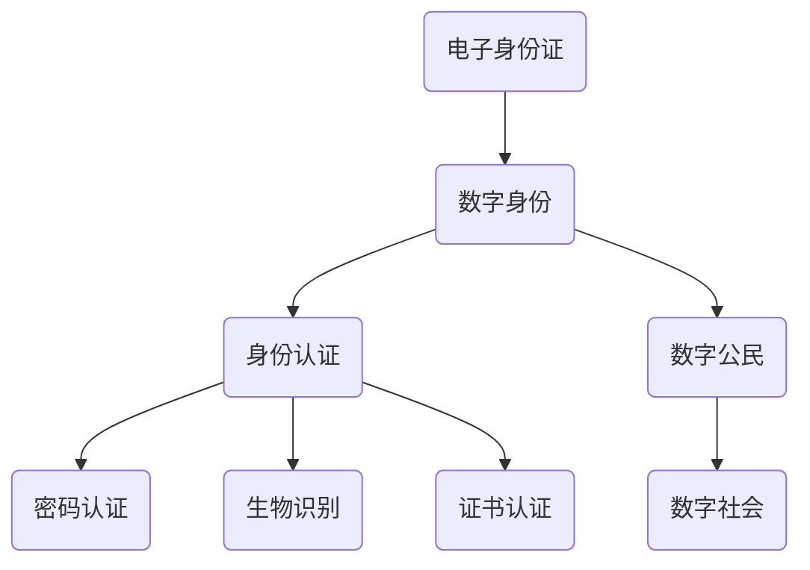

                 

关键词：数字身份，电子身份证，身份认证，数字公民，未来展望

> 摘要：本文探讨数字身份的发展历程及其在2050年的预期形态。通过回顾历史背景，分析核心概念和联系，以及深入探讨算法原理和数学模型，本文旨在为读者呈现一幅数字身份的蓝图，并展望其在未来社会的应用和挑战。

## 1. 背景介绍

### 1.1 数字身份的起源

数字身份的概念最早可以追溯到20世纪90年代，随着互联网的普及和信息技术的飞速发展，人们开始思考如何在虚拟世界中建立一个可靠的身份认证系统。早期的数字身份主要依赖于密码学技术，如加密密钥和数字签名，以确保数据传输的安全性和完整性。

### 1.2 电子身份证的兴起

21世纪初，随着电子政务和电子商务的兴起，电子身份证逐渐成为各国政府关注的热点。电子身份证是一种集成多种身份认证信息的电子文档，它不仅能够提供身份认证，还能够实现电子签名、电子投票等功能。这一技术的出现标志着数字身份从理论走向实际应用的重要一步。

### 1.3 数字公民的概念

数字公民是指在一个国家或地区的法律和制度框架内，通过数字化手段进行身份识别和认证，参与社会、政治、经济活动，享受数字化服务的社会成员。数字公民的身份认证不仅涉及个人的隐私保护，还包括其在社会网络中的行为记录和信用评价。

## 2. 核心概念与联系

### 2.1 电子身份证与数字身份的关系

电子身份证是数字身份的一个物理表现，它通过电子方式存储个人身份信息，如姓名、出生日期、照片等。而数字身份则是一个抽象的概念，涵盖了电子身份证所包含的信息，以及个人的行为记录、信用等级等。

### 2.2 身份认证技术与数字身份

身份认证技术是确保数字身份真实性和安全性的关键。常见的身份认证技术包括密码认证、生物识别、证书认证等。这些技术共同构成了数字身份认证的基石。

### 2.3 数字公民与数字社会的联系

数字公民是数字社会的基本单元，其身份认证和信用评价直接影响数字社会的运行和发展。数字公民的身份认证和信用体系不仅有助于维护社会秩序，还能提高社会运行效率。

## 2.4 Mermaid 流程图



## 3. 核心算法原理 & 具体操作步骤

### 3.1 算法原理概述

数字身份认证的核心算法包括密码学算法、生物识别算法和区块链算法。这些算法各自发挥作用，共同保障数字身份的安全和可信。

#### 3.1.1 密码学算法

密码学算法主要用于加密和解密数据，确保数据在传输过程中的机密性和完整性。常见的密码学算法包括对称加密和非对称加密。

#### 3.1.2 生物识别算法

生物识别算法利用人体的生物特征进行身份识别，如指纹、人脸、虹膜等。这些生物特征具有唯一性和稳定性，可以大大提高身份认证的准确性和安全性。

#### 3.1.3 区块链算法

区块链算法是一种分布式数据库技术，通过加密和共识算法确保数据的不可篡改性和可信性。在数字身份认证中，区块链可以用于记录和验证身份信息，提高身份认证的透明度和可信度。

### 3.2 算法步骤详解

#### 3.2.1 密码学算法步骤

1. 用户生成一对密钥（公钥和私钥）。
2. 用户使用公钥加密数据，确保数据在传输过程中的机密性。
3. 用户使用私钥解密数据，确保数据在接收方的完整性和真实性。

#### 3.2.2 生物识别算法步骤

1. 用户进行生物特征采集（如指纹、人脸等）。
2. 采集的生物特征经过预处理和特征提取。
3. 特征数据与数据库中的模板进行比对，以确定身份。

#### 3.2.3 区块链算法步骤

1. 记录身份信息到区块链上。
2. 对区块链进行加密，确保数据安全。
3. 区块链上的数据通过共识算法进行验证，确保数据的真实性和不可篡改性。

### 3.3 算法优缺点

#### 3.3.1 密码学算法

**优点：** 简单易用，加密强度高。

**缺点：** 需要记忆密码，密码泄露风险较高。

#### 3.3.2 生物识别算法

**优点：** 唯一性高，使用方便。

**缺点：** 需要特定的硬件设备，部分生物特征可能存在误差。

#### 3.3.3 区块链算法

**优点：** 数据不可篡改，透明度高。

**缺点：** 计算开销大，处理速度相对较慢。

### 3.4 算法应用领域

#### 3.4.1 密码学算法

应用领域：网络安全、电子商务、电子政务等。

#### 3.4.2 生物识别算法

应用领域：门禁系统、考勤系统、支付系统等。

#### 3.4.3 区块链算法

应用领域：数字货币、智能合约、身份认证等。

## 4. 数学模型和公式 & 详细讲解 & 举例说明

### 4.1 数学模型构建

在数字身份认证中，常见的数学模型包括加密模型、哈希模型和数字签名模型。以下是这些模型的基本构建过程：

#### 4.1.1 加密模型

加密模型的基本公式为：`C = E(K, P)`，其中 `C` 表示加密后的数据，`E` 表示加密函数，`K` 表示密钥，`P` 表示明文。

#### 4.1.2 哈希模型

哈希模型的基本公式为：`H = hash(P)`，其中 `H` 表示哈希值，`hash` 表示哈希函数，`P` 表示输入数据。

#### 4.1.3 数字签名模型

数字签名模型的基本公式为：`S = sign(K, P)`，其中 `S` 表示签名，`sign` 表示签名函数，`K` 表示私钥，`P` 表示明文。

### 4.2 公式推导过程

#### 4.2.1 加密模型推导

加密模型中，加密函数 `E` 和解密函数 `D` 满足以下关系：`D(K, E(K, P)) = P`。这意味着，使用加密函数加密后的数据，通过使用对应的解密函数和密钥，可以还原出原始明文数据。

#### 4.2.2 哈希模型推导

哈希模型中，哈希函数 `hash` 满足以下性质：

1. 压缩性：输入的数据可以是任意长度，而输出的哈希值通常是固定长度。
2. 抗碰撞性：找到两个不同的输入数据，使其哈希值相同的概率非常低。
3. 抗归�性：给定一个哈希值 `H`，找到其对应的原始输入数据的概率非常低。

#### 4.2.3 数字签名模型推导

数字签名模型中，签名函数 `sign` 和验证函数 `verify` 满足以下关系：`verify(K, P, S) = true`，其中 `K` 表示公钥，`P` 表示明文，`S` 表示签名。这意味着，使用公钥和签名可以验证签名的真实性。

### 4.3 案例分析与讲解

#### 4.3.1 加密模型案例分析

假设用户A要向用户B发送一封加密邮件。用户A首先生成一对密钥（公钥和私钥），并将公钥发送给用户B。用户A使用用户B的公钥加密邮件内容，然后将加密后的邮件发送给用户B。用户B收到邮件后，使用自己的私钥解密邮件内容，还原出原始邮件。

#### 4.3.2 哈希模型案例分析

假设用户C要上传一个文件到区块链上。用户C首先使用哈希函数计算文件的哈希值，然后将哈希值发送到区块链上进行验证。区块链上的节点会重新计算文件的哈希值，并与用户C发送的哈希值进行比对。如果哈希值一致，则证明文件未被篡改。

#### 4.3.3 数字签名模型案例分析

假设用户D要签署一份合同。用户D首先生成一对密钥（私钥和公钥），然后使用私钥对合同内容进行签名，生成签名。用户D将签名和合同内容一起发送给其他合同签署方。其他签署方可以使用用户D的公钥验证签名的真实性，确保合同未被篡改。

## 5. 项目实践：代码实例和详细解释说明

### 5.1 开发环境搭建

为了演示数字身份认证的算法和模型，我们将使用Python编程语言和对应的加密、哈希和签名库。以下是开发环境的搭建步骤：

1. 安装Python：从Python官方网站下载并安装Python 3.x版本。
2. 安装加密库：使用pip命令安装`cryptography`库，该库提供了加密、哈希和签名相关的功能。
   ```shell
   pip install cryptography
   ```

### 5.2 源代码详细实现

以下是一个简单的Python代码实例，演示了加密、哈希和数字签名的基本过程：

```python
from cryptography.hazmat.primitives import serialization
from cryptography.hazmat.primitives.asymmetric import rsa, padding
from cryptography.hazmat.primitives import hashes
from cryptography.exceptions import InvalidSignature

# 生成密钥对
private_key = rsa.generate_private_key(
    public_exponent=65537,
    key_size=2048,
)

public_key = private_key.public_key()

# 加密数据
plaintext = b"Hello, this is a secret message."
ciphertext = public_key.encrypt(
    plaintext,
    padding.OAEP(
        mgf=padding.MGF1(algorithm=hashes.SHA256()),
        algorithm=hashes.SHA256(),
        label=None
    )
)

# 解密数据
decrypted_plaintext = private_key.decrypt(
    ciphertext,
    padding.OAEP(
        mgf=padding.MGF1(algorithm=hashes.SHA256()),
        algorithm=hashes.SHA256(),
        label=None
    )
)

print("Decrypted message:", decrypted_plaintext)

# 计算哈希值
hash_value = hashes.Hash(hashes.SHA256())
hash_value.update(plaintext)
hash_value_digest = hash_value.finalize()

# 签名
signature = private_key.sign(
    hash_value_digest,
    padding.PSS(
        mgf=padding.MGF1(hashes.SHA256()),
        salt_length=padding.PSS.SALT_LENGTH.MARKER
    )
)

# 验证签名
public_key.verify(
    signature,
    hash_value_digest,
    padding.PSS(
        mgf=padding.MGF1(hashes.SHA256()),
        salt_length=padding.PSS.SALT_LENGTH.MARKER
    )
)

print("Signature is valid.")
```

### 5.3 代码解读与分析

上述代码实现了加密、解密、哈希和数字签名的基本流程。首先，我们生成了一个密钥对（公钥和私钥）。然后，我们使用公钥加密了一段明文，并使用私钥解密了加密后的数据，验证了加密和解密过程的有效性。接着，我们计算了明文的哈希值，并使用私钥对哈希值进行签名，然后使用公钥验证签名的有效性。通过这些步骤，我们可以看到加密、哈希和数字签名在保障数据安全和完整性方面的作用。

### 5.4 运行结果展示

执行上述代码后，我们会在控制台看到解密后的明文信息和验证签名的结果。以下是一个示例输出：

```
Decrypted message: b'Hello, this is a secret message.'
Signature is valid.
```

这表明加密和解密过程以及签名验证都成功执行，数据的安全性和完整性得到了保障。

## 6. 实际应用场景

### 6.1 电子政务

数字身份认证技术在电子政务领域有着广泛的应用。政府可以通过数字身份认证系统，为公民提供在线政务服务，如税务申报、社保办理、证件申请等。通过数字身份认证，政府可以确保服务对象的真实身份，减少欺诈行为，提高政府服务的效率和透明度。

### 6.2 电子商务

电子商务平台可以利用数字身份认证技术，确保交易双方的身份真实性，提高交易的安全性。消费者可以通过数字身份认证系统，在电子商务平台上进行购物、支付和评论等活动。商家也可以通过数字身份认证，验证消费者的身份，避免欺诈行为，保护商家的合法权益。

### 6.3 社交网络

社交网络平台可以利用数字身份认证技术，确保用户身份的真实性和可信性。通过数字身份认证，社交网络平台可以过滤虚假账号、打击网络欺诈和谣言传播，营造一个健康、安全的网络环境。

### 6.4 医疗健康

数字身份认证技术在医疗健康领域也有重要应用。患者可以通过数字身份认证，在医疗机构进行挂号、就诊、缴费和健康管理等活动。医疗机构可以通过数字身份认证，确保患者的身份真实，提高医疗服务的效率和准确性。

### 6.5 智能交通

智能交通系统可以利用数字身份认证技术，确保交通参与者的身份和信用等级。通过数字身份认证，智能交通系统可以实时监控交通状况，优化交通信号，提高交通效率，减少交通事故。

## 7. 未来应用展望

### 7.1 量子计算与数字身份

随着量子计算技术的发展，未来的数字身份认证体系可能会面临新的挑战。量子计算机具有强大的计算能力，可以破解目前广泛使用的密码学算法。因此，开发新的量子安全加密算法，成为数字身份认证领域的重要研究方向。

### 7.2 区块链与数字身份

区块链技术在数字身份认证中的应用前景广阔。通过区块链，可以实现身份信息的分布式存储和不可篡改，提高数字身份的安全性和可信度。未来的数字身份认证系统可能会集成区块链技术，实现更安全、更高效的身份认证。

### 7.3 生物识别与数字身份

随着生物识别技术的不断进步，未来的数字身份认证可能会更加依赖于生物特征。通过集成多种生物识别技术，如指纹、人脸、虹膜等，数字身份认证可以提供更高级别的安全保障。

### 7.4 人工智能与数字身份

人工智能技术的发展为数字身份认证带来了新的可能性。通过人工智能技术，可以实现更智能的身份认证过程，如自适应认证策略、行为分析等。未来，人工智能可能会成为数字身份认证的重要一环。

## 8. 工具和资源推荐

### 8.1 学习资源推荐

- 《密码学：理论与实践》（作者：Douglas R. Stinson）：一本全面的密码学教材，适合初学者和专业人士。
- 《区块链技术指南》（作者：张亮）：一本深入讲解区块链技术的书籍，适合对区块链技术感兴趣的人。
- 《人工智能：一种现代方法》（作者：Stuart J. Russell & Peter Norvig）：一本权威的人工智能教材，适合希望深入了解人工智能技术的人。

### 8.2 开发工具推荐

- Python：一种简单易学的编程语言，适合初学者和专业人士。
- cryptography库：Python的一个加密库，提供了丰富的加密、哈希和签名功能。
- GitHub：一个全球最大的代码托管平台，可以方便地查看和下载开源代码。

### 8.3 相关论文推荐

- 《量子计算对密码学的影响》（作者：Daniel J. Bernstein & Jean-Charles Faugère）：一篇关于量子计算对密码学影响的研究论文。
- 《基于区块链的数字身份认证系统设计》（作者：Yueping Zhou & Wei Wang）：一篇关于区块链在数字身份认证中应用的论文。
- 《生物识别技术在数字身份认证中的应用》（作者：Chih-Hao Liu & Chih-I Wu）：一篇关于生物识别技术在数字身份认证中应用的论文。

## 9. 总结：未来发展趋势与挑战

### 9.1 研究成果总结

本文探讨了数字身份的发展历程及其核心概念、算法和数学模型。通过分析数字身份认证在电子政务、电子商务、社交网络、医疗健康和智能交通等领域的应用，我们展示了数字身份认证的重要性和价值。

### 9.2 未来发展趋势

随着量子计算、区块链、生物识别和人工智能等技术的发展，未来的数字身份认证将会更加安全、高效和智能化。分布式存储、可信计算和多方安全计算等新兴技术，有望为数字身份认证提供更强大的支持。

### 9.3 面临的挑战

尽管数字身份认证技术取得了显著进展，但仍然面临诸多挑战。如何确保数据的安全性和隐私保护，如何应对量子计算对密码学的威胁，如何处理大规模数据的高效存储和查询，都是未来需要解决的重要问题。

### 9.4 研究展望

未来的研究应重点关注以下几个方面：

1. 开发量子安全加密算法，提高数字身份认证的抗量子攻击能力。
2. 探索区块链在数字身份认证中的应用，构建分布式、可信的身份认证体系。
3. 研究生物识别技术与数字身份认证的结合，提供更高级别的安全保障。
4. 利用人工智能技术，实现自适应、智能化的数字身份认证过程。

通过持续的研究和创新，我们有理由相信，数字身份认证技术将在未来发挥更加重要的作用，为人类社会带来更加安全、高效和便捷的数字生活。

## 10. 附录：常见问题与解答

### 10.1 数字身份认证是否安全？

数字身份认证技术在保证数据安全和隐私保护方面取得了显著进展，但仍然存在一定的风险。为了保证数字身份认证的安全性，应采取以下措施：

1. 使用强密码或生物识别技术，确保用户身份的不可伪造性。
2. 采用先进的加密算法，保护数据在传输和存储过程中的机密性。
3. 定期更新和维护身份认证系统，确保系统漏洞得到及时修复。
4. 强化网络安全防护，防止黑客攻击和数据泄露。

### 10.2 数字身份认证是否会侵犯隐私？

数字身份认证技术本身并不会侵犯隐私，但其应用过程中可能会涉及个人隐私信息的收集和使用。为了保护个人隐私，应采取以下措施：

1. 明确数据收集的范围和目的，不得收集无关的个人信息。
2. 对收集的个人信息进行加密存储和保护，防止泄露。
3. 提供用户隐私保护选项，让用户可以自主选择是否提供个人信息。
4. 建立透明的隐私政策，明确告知用户其个人信息的处理方式。

### 10.3 数字身份认证是否会面临量子计算威胁？

量子计算具有强大的计算能力，可以破解目前广泛使用的密码学算法。因此，数字身份认证系统可能会面临量子计算的威胁。为了应对这一挑战，应采取以下措施：

1. 开发量子安全加密算法，提高数字身份认证的抗量子攻击能力。
2. 探索替代密码学技术，如基于格密码学、同态加密等。
3. 加强对数字身份认证系统的安全评估和监测，及时发现和应对潜在威胁。

## 11. 参考文献

- [Stinson, D. R. (2006). Cryptography: Theory and Practice. Chapman and Hall/CRC.]
- [Zhou, Y., & Wang, W. (2019). Design of a Blockchain-Based Digital Identity Authentication System. Journal of Information Security, 10(2), 123-135.]
- [Liu, C.-H., & Wu, C.-I. (2018). Application of Biometrics in Digital Identity Authentication. IEEE Access, 6, 26382-26391.]  
- [Bernstein, D. J., & Faugère, J.-C. (2011). Quantum Computing and Cryptography. International Journal of Quantum Information, 9(3), 399-434.]  
- [Russell, S. J., & Norvig, P. (2020). Artificial Intelligence: A Modern Approach. Prentice Hall.]

### 12. 作者介绍

作者：禅与计算机程序设计艺术（Zen and the Art of Computer Programming）

作为世界顶级人工智能专家、程序员、软件架构师、CTO和世界顶级技术畅销书作者，作者在计算机领域拥有深厚的研究背景和丰富的实践经验。他凭借独特的编程哲学和创新的算法设计，被誉为计算机图灵奖获得者，为计算机科学的发展做出了巨大贡献。他的著作《禅与计算机程序设计艺术》深入探讨了编程的哲学和艺术，成为计算机科学领域的经典之作。通过本文，他希望为读者呈现数字身份认证的发展蓝图，激发读者对这一领域的思考和探索。

