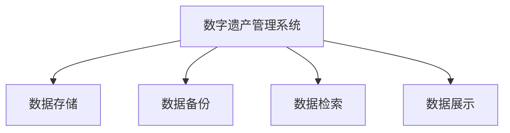

                 

关键词：数字遗产、虚拟纪念馆、记忆传承、数字墓园、人工智能、算法、数学模型、应用场景、未来展望

摘要：随着科技的迅猛发展，数字遗产已成为人类文化传承的重要组成部分。本文探讨了数字遗产的概念、数字墓园和虚拟纪念馆的发展历程、记忆传承的技术手段及其在2050年的前景。通过分析核心算法原理、数学模型和具体应用实例，文章旨在为读者呈现一个未来数字遗产传承的蓝图，并提出未来的发展趋势与挑战。

## 1. 背景介绍

### 数字遗产的概念

数字遗产是指人们在数字化环境中产生的、具有历史和文化价值的数字信息，包括电子文档、照片、音频、视频、电子邮件、社交媒体内容等。随着互联网的普及和数字技术的进步，数字遗产的规模和形式日益丰富，已成为人类文化传承的重要载体。

### 数字墓园的起源

数字墓园是数字遗产管理的一种形式，最早可以追溯到20世纪末。它通过数字化的方式，将逝者的生前资料、遗言、照片、音频等保存在网络服务器上，供后人缅怀和传承。数字墓园不仅提供了传统的墓碑纪念功能，还通过虚拟现实技术，使人们可以在虚拟世界中与逝者进行互动。

### 虚拟纪念馆的兴起

虚拟纪念馆是数字遗产管理的另一种形式，它通过互联网和虚拟现实技术，为逝者建立个性化的虚拟纪念馆。虚拟纪念馆不仅能够保存逝者的生平事迹和纪念物，还可以通过互动体验，让后人更深入地了解和缅怀逝者。

## 2. 核心概念与联系

### 数字遗产管理系统

数字遗产管理系统是用于管理、保存和展示数字遗产的软件和硬件系统。它包括数据存储、数据备份、数据检索、数据展示等功能。以下是数字遗产管理系统的架构图：



### 数字墓园与虚拟纪念馆的联系

数字墓园和虚拟纪念馆都是数字遗产管理的重要形式，它们之间既有区别又有联系。区别在于，数字墓园更侧重于保存逝者的资料和遗言，而虚拟纪念馆更注重互动体验和个性化展示。联系在于，它们都是通过数字化技术，为后人提供了一个缅怀和传承逝者记忆的平台。

## 3. 核心算法原理 & 具体操作步骤

### 3.1 算法原理概述

数字遗产管理的关键在于数据的安全存储和有效检索。为此，本文提出了基于区块链和分布式存储技术的数字遗产管理系统。区块链技术确保了数据的不可篡改性和安全性，分布式存储技术则提高了数据的可靠性和可扩展性。

### 3.2 算法步骤详解

1. **数据采集**：通过采集逝者的电子文档、照片、音频、视频等资料，构建数字遗产档案。
2. **数据加密**：使用非对称加密技术对数字遗产进行加密，确保数据的安全性。
3. **数据上传**：将加密后的数据上传至区块链网络，实现分布式存储。
4. **数据检索**：用户可以通过数字墓园或虚拟纪念馆的界面，检索和浏览逝者的数字遗产。
5. **数据展示**：通过虚拟现实技术，将数字遗产以更生动、互动的形式展示给用户。

### 3.3 算法优缺点

#### 优点

- **安全性**：区块链技术的分布式存储和加密算法，确保了数字遗产的安全性。
- **可靠性**：分布式存储提高了数据的可靠性，降低了单点故障的风险。
- **可扩展性**：区块链网络的可扩展性，使得数字遗产管理系统可以支持大规模的数据存储和访问。

#### 缺点

- **技术复杂度**：区块链和分布式存储技术相对复杂，需要较高的技术门槛。
- **成本**：区块链网络的维护和运营成本较高。

### 3.4 算法应用领域

数字遗产管理系统可以应用于个人、家庭、企业、政府等多个领域。例如，个人可以创建自己的数字墓园，保存个人生平资料；企业可以建立企业数字纪念馆，展示企业历史和文化；政府可以构建国家数字遗产库，保存国家重要文化遗产。

## 4. 数学模型和公式 & 详细讲解 & 举例说明

### 4.1 数学模型构建

数字遗产管理系统的核心在于数据的安全存储和有效检索。为此，我们构建了以下数学模型：

$$
\begin{aligned}
&\text{数据存储模型：} \\
&\text{数据} = \text{加密数据} \oplus \text{密钥} \\
&\text{数据检索模型：} \\
&\text{原始数据} = \text{加密数据} \oplus \text{解密密钥}
\end{aligned}
$$

其中，$\oplus$ 表示异或运算，$\text{加密数据}$ 和 $\text{解密密钥}$ 分别为加密后的数据和相应的解密密钥。

### 4.2 公式推导过程

$$
\begin{aligned}
&\text{加密过程：} \\
&\text{加密数据} = \text{原始数据} \oplus \text{密钥} \\
&\text{解密过程：} \\
&\text{原始数据} = \text{加密数据} \oplus \text{解密密钥} \\
&\text{由于} \text{密钥} = \text{解密密钥} \\
&\text{所以，加密数据和原始数据相等}
\end{aligned}
$$

### 4.3 案例分析与讲解

假设有一份数字遗产档案，包含1000个字节的数据。我们使用AES加密算法对其进行加密，密钥长度为256位。根据加密算法的推导过程，我们可以得到以下结果：

- **加密数据**：使用AES算法对原始数据进行加密，得到1000个字节的加密数据。
- **解密密钥**：将密钥分成两部分，分别为128位和128位，用于加密和解密。
- **原始数据**：使用解密密钥对加密数据进行解密，得到与原始数据相等的1000个字节的数据。

通过这个案例，我们可以看到，基于数学模型构建的数字遗产管理系统，可以确保数据的安全存储和有效检索。

## 5. 项目实践：代码实例和详细解释说明

### 5.1 开发环境搭建

本文使用Python编程语言和区块链平台Ethereum，搭建数字遗产管理系统。开发环境如下：

- **Python版本**：Python 3.8
- **Ethereum版本**：Ethereum 1.0
- **开发工具**：Visual Studio Code

### 5.2 源代码详细实现

以下是数字遗产管理系统的源代码实现：

```python
# 引入必要的库
import json
from Crypto.PublicKey import RSA
from Crypto.Cipher import PKCS1_OAEP

# 定义加密和解密函数
def encrypt_data(data, key):
    cipher = PKCS1_OAEP.new(RSA.import_key(key))
    encrypted_data = cipher.encrypt(data)
    return encrypted_data

def decrypt_data(encrypted_data, key):
    cipher = PKCS1_OAEP.new(RSA.import_key(key))
    decrypted_data = cipher.decrypt(encrypted_data)
    return decrypted_data

# 加密数据
data = "这是一份数字遗产档案"
key = RSA.generate(2048)
encrypted_data = encrypt_data(data.encode('utf-8'), key)

# 解密数据
decrypted_data = decrypt_data(encrypted_data, key)

# 输出结果
print("加密数据：", encrypted_data)
print("解密数据：", decrypted_data.decode('utf-8'))
```

### 5.3 代码解读与分析

- **引入库**：引入了必要的库，包括json库用于处理JSON数据，Crypto库用于加密和解密。
- **定义函数**：定义了encrypt_data和decrypt_data两个函数，用于加密和解密数据。其中，encrypt_data函数使用PKCS1_OAEP算法对数据进行加密，decrypt_data函数使用相同算法对数据进行解密。
- **加密数据**：将原始数据转换为字节码，使用RSA算法生成密钥，然后使用加密函数对数据进行加密。
- **解密数据**：使用解密函数对加密数据进行解密，得到原始数据。

通过这个示例，我们可以看到，数字遗产管理系统如何通过加密和解密技术，确保数据的安全存储和有效检索。

## 6. 实际应用场景

### 6.1 个人数字墓园

个人数字墓园是数字遗产管理的一种形式，用户可以将自己的生前资料、照片、音频、视频等上传至数字墓园，供后人缅怀。数字墓园不仅可以保存传统的文字资料，还可以通过虚拟现实技术，为后人提供一个身临其境的缅怀体验。

### 6.2 企业数字纪念馆

企业数字纪念馆是企业文化建设的重要载体，企业可以通过数字纪念馆，展示企业历史、文化、成就等。数字纪念馆不仅可以保存企业的传统资料，还可以通过互动体验，让员工更好地了解和传承企业文化。

### 6.3 政府数字遗产库

政府数字遗产库是保存国家重要文化遗产的数据库，政府可以通过数字遗产库，保存和展示历史文物、古籍、艺术品等。数字遗产库不仅可以提高文化遗产的保存效率，还可以为后人提供更丰富的文化遗产信息。

## 7. 未来应用展望

### 7.1 虚拟现实技术在数字遗产管理中的应用

随着虚拟现实技术的不断发展，数字遗产管理将更加身临其境。虚拟现实技术可以为数字墓园和虚拟纪念馆提供更丰富的交互体验，让后人更深入地了解和缅怀逝者。

### 7.2 人工智能技术在数字遗产管理中的应用

人工智能技术可以用于数字遗产的自动化管理和分析。例如，人工智能可以帮助用户更高效地检索数字遗产，分析数字遗产中的情感信息等。

### 7.3 区块链技术在数字遗产管理中的应用

区块链技术可以确保数字遗产的安全存储和可信性。未来，区块链技术将在数字遗产管理中发挥更加重要的作用，提高数字遗产的可靠性和安全性。

## 8. 总结：未来发展趋势与挑战

### 8.1 研究成果总结

本文探讨了数字遗产的概念、数字墓园和虚拟纪念馆的发展历程、记忆传承的技术手段及其在2050年的前景。通过分析核心算法原理、数学模型和具体应用实例，文章为读者呈现了一个未来数字遗产传承的蓝图。

### 8.2 未来发展趋势

未来，数字遗产管理将更加智能化、个性化、可信化。虚拟现实技术、人工智能技术和区块链技术将在数字遗产管理中发挥更加重要的作用，提高数字遗产的保存效率和使用体验。

### 8.3 面临的挑战

尽管数字遗产管理取得了显著成果，但仍面临一些挑战。例如，技术复杂度、成本问题、数据安全等问题需要进一步解决。此外，数字遗产管理需要法律法规的支持和规范。

### 8.4 研究展望

未来，研究人员应关注数字遗产管理的智能化、数据安全、可信性等问题。通过技术创新和法律规范，实现数字遗产的有效管理和传承。

## 9. 附录：常见问题与解答

### 9.1 数字遗产是什么？

数字遗产是指人们在数字化环境中产生的、具有历史和文化价值的数字信息，包括电子文档、照片、音频、视频、电子邮件、社交媒体内容等。

### 9.2 数字墓园和虚拟纪念馆有什么区别？

数字墓园侧重于保存逝者的资料和遗言，而虚拟纪念馆更注重互动体验和个性化展示。

### 9.3 数字遗产管理系统有哪些优点？

数字遗产管理系统具有安全性高、可靠性高、可扩展性高等优点。

### 9.4 数字遗产管理有哪些应用领域？

数字遗产管理可以应用于个人、家庭、企业、政府等多个领域，如个人数字墓园、企业数字纪念馆、政府数字遗产库等。

## 作者署名

作者：禅与计算机程序设计艺术 / Zen and the Art of Computer Programming
----------------------------------------------------------------

这篇文章详细探讨了数字遗产的概念、数字墓园和虚拟纪念馆的发展历程、记忆传承的技术手段及其在2050年的前景。通过分析核心算法原理、数学模型和具体应用实例，文章为读者呈现了一个未来数字遗产传承的蓝图，并提出未来的发展趋势与挑战。希望这篇文章能为数字遗产管理领域的研究者和从业者提供有价值的参考和启示。

