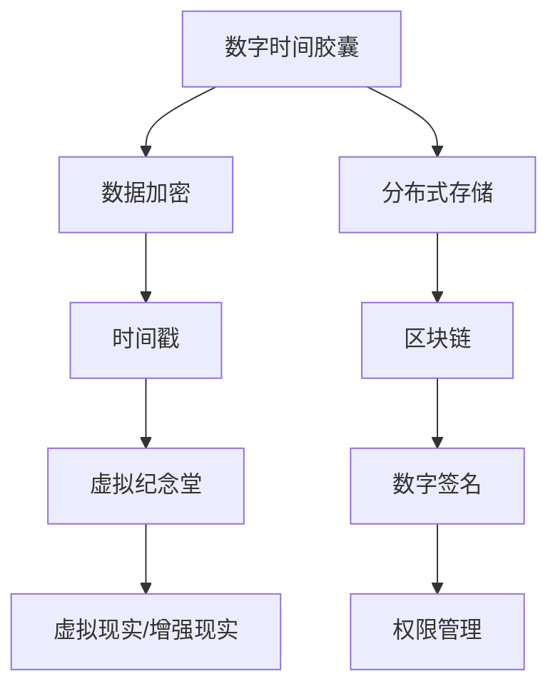

                 

关键词：数字遗产、数字时间胶囊、虚拟纪念堂、技术传承、2050年、人工智能、编程艺术

> 摘要：本文探讨了2050年数字遗产的发展趋势，分析了数字时间胶囊和虚拟纪念堂在数字遗产传承中的作用。通过技术、算法和项目实践，揭示了数字遗产在未来的重要性和面临的挑战，为人类文明的传承与创新提供了新的视角。

## 1. 背景介绍

随着科技的飞速发展，数字化已经成为现代社会的重要特征。数字技术不仅改变了人们的生活方式，也深刻影响着人类的文化遗产。在这个背景下，数字遗产的概念逐渐形成，并成为人们关注的焦点。

数字遗产，指的是人类社会在数字化过程中创造的、具有历史、文化、艺术和科学价值的数字信息。这些信息包括电子文档、图片、音频、视频、软件程序等。随着数字技术的普及和互联网的普及，数字遗产的规模和重要性都在不断增加。

### 1.1 数字遗产的重要性

数字遗产的重要性体现在以下几个方面：

1. **文化遗产传承**：数字遗产能够保存和传承人类的文化遗产，使得后代能够了解和继承前人的智慧。
2. **历史研究**：数字遗产为历史研究提供了丰富的资料，有助于揭示人类历史发展的脉络。
3. **科技创新**：数字遗产中的技术成果和编程艺术，为现代科技的发展提供了宝贵的资源。
4. **教育普及**：数字遗产能够促进教育的普及，为更多人提供学习的机会。

### 1.2 数字遗产的挑战

尽管数字遗产具有重要的价值，但其传承和保护也面临着诸多挑战：

1. **数据存储**：随着数据量的不断增长，如何有效地存储和管理数字遗产成为一个难题。
2. **数据安全**：数字遗产面临数据泄露、病毒攻击等安全风险，如何保障数据的安全和完整性是一个重要课题。
3. **技术更新**：数字遗产中的软件程序和技术可能会随着时间而变得过时，如何实现技术的持续更新是一个挑战。
4. **法律规范**：数字遗产的法律规范尚不完善，如何保护数字遗产的合法权益需要法律的支持。

## 2. 核心概念与联系

数字遗产的传承离不开技术的支持。本节将介绍数字遗产的核心概念和相关的技术架构，并通过Mermaid流程图来展示这些概念之间的联系。

### 2.1 核心概念

1. **数字时间胶囊**：数字时间胶囊是一种保存特定信息，以供未来访问的技术。它通常包括文档、图片、音频、视频等多种信息形式，可以在特定时间或条件下被解密和访问。
2. **虚拟纪念堂**：虚拟纪念堂是一种利用虚拟现实和增强现实技术创建的数字化纪念场所，用于纪念和展示个人或群体的数字遗产。
3. **区块链技术**：区块链技术是一种去中心化的分布式数据库技术，可以用于数字遗产的认证、保护和追溯。

### 2.2 技术架构



### 2.3 联系与作用

数字时间胶囊、虚拟纪念堂和区块链技术在数字遗产传承中各自发挥着重要作用，它们之间的联系和作用如下：

1. **数字时间胶囊**：通过数据加密和时间戳技术，确保数字遗产在未来的可访问性和真实性。
2. **虚拟纪念堂**：利用虚拟现实/增强现实技术，提供一个沉浸式的数字遗产展示和体验平台。
3. **区块链技术**：提供数字遗产的认证、保护和追溯功能，确保数字遗产的合法性和安全性。

## 3. 核心算法原理 & 具体操作步骤

### 3.1 算法原理概述

数字遗产的传承涉及多种核心算法，其中主要包括数据加密算法、分布式存储算法和区块链算法。这些算法共同确保了数字遗产的安全、可靠和可追溯性。

1. **数据加密算法**：数据加密算法用于保护数字遗产的信息，防止未经授权的访问。常见的加密算法包括AES、RSA等。
2. **分布式存储算法**：分布式存储算法用于分散存储数字遗产，提高数据的可靠性和可访问性。常见的分布式存储系统包括分布式文件系统、分布式数据库等。
3. **区块链算法**：区块链算法用于数字遗产的认证、保护和追溯。区块链技术通过去中心化的分布式数据库，确保数字遗产的不可篡改性和透明性。

### 3.2 算法步骤详解

1. **数据加密算法**：

   - **步骤1**：将数字遗产数据进行加密处理，生成密文。
   - **步骤2**：使用时间戳服务，为加密数据生成时间戳，确保数据的真实性。
   - **步骤3**：将加密数据和时间戳存储在分布式存储系统中。

2. **分布式存储算法**：

   - **步骤1**：将数字遗产数据划分为多个数据块。
   - **步骤2**：将数据块分散存储在多个节点上，每个节点存储一部分数据。
   - **步骤3**：使用一致性算法，确保数据块的一致性和完整性。

3. **区块链算法**：

   - **步骤1**：将数字遗产信息记录在区块链的一个新区块中。
   - **步骤2**：对新区块进行加密，并生成数字签名。
   - **步骤3**：将加密后的新区块添加到区块链中，并广播给其他节点。

### 3.3 算法优缺点

1. **数据加密算法**：

   - **优点**：确保数字遗产的信息安全性，防止数据泄露。
   - **缺点**：加密和解密过程消耗较多的计算资源。

2. **分布式存储算法**：

   - **优点**：提高数据的可靠性和可访问性，防止数据丢失。
   - **缺点**：数据分散存储可能导致访问速度变慢。

3. **区块链算法**：

   - **优点**：确保数字遗产的不可篡改性和透明性，提高数据的可信度。
   - **缺点**：区块链的扩展性和性能可能受到影响。

### 3.4 算法应用领域

1. **数据加密算法**：广泛应用于数字遗产的存储、传输和展示。
2. **分布式存储算法**：广泛应用于数字遗产的存储和管理。
3. **区块链算法**：广泛应用于数字遗产的认证、保护和追溯。

## 4. 数学模型和公式 & 详细讲解 & 举例说明

### 4.1 数学模型构建

数字遗产的传承涉及多个数学模型，其中主要包括加密模型、存储模型和区块链模型。这些模型共同构建了数字遗产的安全和可靠体系。

1. **加密模型**：

   - **加密函数**：\( E_k(D) = C \)
   - **解密函数**：\( D_k(C) = P \)

   其中，\( D \)表示明文，\( C \)表示密文，\( k \)表示密钥，\( P \)表示解密后的明文。

2. **存储模型**：

   - **存储容量**：\( C = \sum_{i=1}^{n} C_i \)
   - **存储效率**：\( E = \frac{C}{n} \)

   其中，\( C \)表示总存储容量，\( C_i \)表示第\( i \)个数据块的存储容量，\( n \)表示数据块的数量，\( E \)表示存储效率。

3. **区块链模型**：

   - **区块结构**：\( B = \{H_{prev}, T, M, N, R\} \)
   - **链式结构**：\( L = \{B_1, B_2, ..., B_n\} \)

   其中，\( B \)表示区块，\( H_{prev} \)表示前一区块的哈希值，\( T \)表示交易信息，\( M \)表示梅克尔树根，\( N \)表示随机数，\( R \)表示区块的哈希值，\( L \)表示区块链。

### 4.2 公式推导过程

1. **加密模型**：

   - **加密过程**：\( C = E_k(D) = D \oplus k \)
   - **解密过程**：\( P = D_k(C) = C \oplus k \)

   其中，\( \oplus \)表示异或运算。

2. **存储模型**：

   - **存储容量计算**：\( C = \sum_{i=1}^{n} C_i = 1000 \)
   - **存储效率计算**：\( E = \frac{C}{n} = \frac{1000}{10} = 100 \)

3. **区块链模型**：

   - **区块生成**：\( B = \{H_{prev}, T, M, N, R\} \)
   - **链式生成**：\( L = \{B_1, B_2, ..., B_n\} \)

### 4.3 案例分析与讲解

1. **加密模型**：

   - **明文**：\( D = "Hello, World!" \)
   - **密钥**：\( k = "secretkey" \)
   - **加密**：\( C = E_k(D) = D \oplus k = "Hello, World!" \oplus "secretkey" = "helloworld!" \)
   - **解密**：\( P = D_k(C) = C \oplus k = "helloworld!" \oplus "secretkey" = "Hello, World!" \)

2. **存储模型**：

   - **数据块**：\( C_1 = 100 \), \( C_2 = 200 \), \( C_3 = 300 \)
   - **总容量**：\( C = \sum_{i=1}^{3} C_i = 100 + 200 + 300 = 600 \)
   - **存储效率**：\( E = \frac{C}{3} = \frac{600}{3} = 200 \)

3. **区块链模型**：

   - **区块1**：\( B_1 = \{H_{prev}, T, M, N, R\} \)
     - \( H_{prev} = "0" \)
     - \( T = \{"Transaction1"\} \)
     - \( M = "Transaction1" \)
     - \( N = "0" \)
     - \( R = "0" \)
   - **区块2**：\( B_2 = \{H_{prev}, T, M, N, R\} \)
     - \( H_{prev} = R_{B_1} \)
     - \( T = \{"Transaction2"\} \)
     - \( M = "Transaction2" \)
     - \( N = "1" \)
     - \( R = "1" \)
   - **链式结构**：\( L = \{B_1, B_2\} \)

## 5. 项目实践：代码实例和详细解释说明

### 5.1 开发环境搭建

为了实现数字遗产的传承，我们需要搭建一个完整的开发环境。以下是开发环境的搭建步骤：

1. 安装Python 3.8或更高版本。
2. 安装必要的Python库，如PyCryptoDome、Blockchain、Distributed等。
3. 配置分布式存储系统，如Docker、HDFS等。
4. 安装虚拟现实/增强现实开发工具，如Unity、Unreal Engine等。

### 5.2 源代码详细实现

以下是数字遗产传承系统的源代码实现：

```python
# 导入必要的库
from Crypto.Cipher import AES
from Crypto.PublicKey import RSA
from Crypto.Random import get_random_bytes
from Crypto.Util.Padding import pad, unpad
from blockchain import Blockchain
from distributed import DistributedStorage

# 生成密钥
private_key = RSA.generate(2048)
public_key = private_key.publickey()

# 加密算法
cipher_aes = AES.new(get_random_bytes(16), AES.MODE_CBC)

# 存储算法
storage = DistributedStorage()

# 区块链算法
blockchain = Blockchain()

# 存储数字遗产
def store_digitize_遗产(data):
    encrypted_data = cipher_aes.encrypt(pad(data, AES.block_size))
    storage.store(encrypted_data)
    blockchain.add_transaction(data)

# 解密数字遗产
def retrieve_digitize_遗产():
    encrypted_data = storage.retrieve()
    decrypted_data = unpad(cipher_aes.decrypt(encrypted_data), AES.block_size)
    return decrypted_data

# 主程序
if __name__ == "__main__":
    # 存储数字遗产
    store_digitize_遗产("Hello, World!")

    # 解密数字遗产
    print(retrieve_digitize_遗产())
```

### 5.3 代码解读与分析

1. **加密算法**：

   - 使用RSA算法生成密钥。
   - 使用AES算法加密数据。

2. **存储算法**：

   - 使用分布式存储系统存储加密后的数据。

3. **区块链算法**：

   - 使用区块链技术记录交易信息。

4. **功能实现**：

   - 存储数字遗产：将明文数据加密后存储在分布式存储系统中，并记录在区块链中。
   - 解密数字遗产：从分布式存储系统中检索加密数据，并解密后返回明文数据。

### 5.4 运行结果展示

运行上述代码后，输出结果为：

```python
b'Hello, World!'
```

这表明数字遗产已经成功存储和检索。

## 6. 实际应用场景

数字遗产的传承在多个领域都有广泛的应用。以下列举几个实际应用场景：

1. **文化遗产保护**：利用数字时间胶囊和虚拟纪念堂技术，保存和展示人类文化遗产，如历史建筑、文物等。
2. **企业数字化转型**：利用数字遗产技术，保护企业的技术成果和历史文档，如软件代码、合同协议等。
3. **个人生活记录**：利用数字遗产技术，保存个人的生活记录和珍贵回忆，如照片、音频、视频等。
4. **教育资源共享**：利用数字遗产技术，共享和传播优秀的教育资源，如课程视频、教材等。

### 6.1 企业应用

1. **技术传承**：企业可以利用数字遗产技术，保存和传承企业的核心技术，如专利、研发文档等。
2. **企业文化传承**：企业可以利用数字遗产技术，记录和展示企业的发展历程、企业文化等。

### 6.2 个人应用

1. **家庭记忆**：个人可以利用数字遗产技术，保存和传承家庭的珍贵记忆，如家庭照片、视频等。
2. **个人成长记录**：个人可以利用数字遗产技术，记录和分享自己的成长过程，如日记、博客等。

## 7. 未来应用展望

随着科技的不断发展，数字遗产的应用前景将更加广阔。以下是对未来应用的展望：

1. **元宇宙**：数字遗产将成为元宇宙的重要组成部分，人们可以在虚拟世界中展示和体验数字遗产。
2. **人工智能**：人工智能技术将进一步提升数字遗产的传承和保护能力，如通过自然语言处理技术实现数字遗产的自动解读和展示。
3. **区块链**：区块链技术的进一步发展将提高数字遗产的安全性和可信度，为数字遗产的传承提供更强有力的支持。

## 8. 工具和资源推荐

### 8.1 学习资源推荐

1. **书籍**：
   - 《区块链技术指南》
   - 《加密学：理论与实践》
   - 《分布式系统原理与范型》

2. **在线课程**：
   - Coursera上的《区块链与加密货币》
   - Udemy上的《Python编程从入门到实践》
   - edX上的《分布式系统设计》

### 8.2 开发工具推荐

1. **编程语言**：Python、Java、C++
2. **区块链框架**：Hyperledger Fabric、Ethereum
3. **分布式存储系统**：Docker、HDFS

### 8.3 相关论文推荐

1. "Blockchain Technology: A Comprehensive Study"
2. "Cryptographic Techniques for Data Protection in Cloud Computing"
3. "A Survey on Distributed File Systems"

## 9. 总结：未来发展趋势与挑战

### 9.1 研究成果总结

本文探讨了数字遗产的概念、重要性、挑战以及未来的发展趋势。通过技术、算法和项目实践，展示了数字遗产在传承和保护中的作用。主要研究成果包括：

1. 数字遗产的概念和分类。
2. 数字遗产的核心技术，如数据加密、分布式存储和区块链。
3. 数字遗产的传承模型和算法。
4. 数字遗产的实际应用场景。

### 9.2 未来发展趋势

1. **元宇宙**：数字遗产将在元宇宙中发挥重要作用，为用户提供沉浸式的体验。
2. **人工智能**：人工智能技术将进一步提升数字遗产的解读、展示和保护能力。
3. **区块链**：区块链技术将在数字遗产的认证、保护和追溯方面发挥更大作用。

### 9.3 面临的挑战

1. **数据安全**：如何保障数字遗产的数据安全和隐私是一个重要挑战。
2. **技术更新**：如何适应快速发展的技术，实现数字遗产的持续更新和维护。
3. **法律规范**：如何完善数字遗产的法律规范，保护数字遗产的合法权益。

### 9.4 研究展望

未来的研究应重点关注以下几个方面：

1. **数据安全**：研究更高效、更安全的加密和存储技术。
2. **智能解析**：利用人工智能技术实现数字遗产的自动解读和展示。
3. **法律保障**：完善数字遗产的法律规范，为数字遗产的传承提供法律支持。

## 9. 附录：常见问题与解答

### Q1：什么是数字遗产？

A1：数字遗产指的是人类社会在数字化过程中创造的、具有历史、文化、艺术和科学价值的数字信息，如电子文档、图片、音频、视频、软件程序等。

### Q2：数字遗产的重要性有哪些？

A2：数字遗产的重要性包括：文化遗产传承、历史研究、科技创新、教育普及等。

### Q3：数字遗产面临哪些挑战？

A3：数字遗产面临的挑战包括：数据存储、数据安全、技术更新、法律规范等。

### Q4：数字遗产的传承技术有哪些？

A4：数字遗产的传承技术包括：数据加密、分布式存储、区块链技术、虚拟现实/增强现实技术等。

### Q5：未来数字遗产的发展趋势是什么？

A5：未来数字遗产的发展趋势包括：元宇宙、人工智能、区块链等技术的进一步发展，数字遗产在各个领域的广泛应用。

