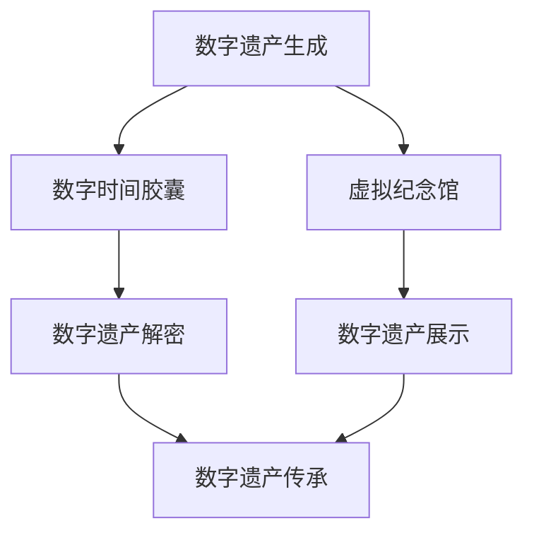

                 

关键词：数字遗产、数字时间胶囊、虚拟纪念馆、数据保护、人工智能、元宇宙、数字遗产传承

> 摘要：本文探讨了2050年的数字遗产如何通过数字时间胶囊和虚拟纪念馆的方式得以传承。随着数字化进程的加速，我们面临着如何保护和管理个人与社会的数字资产的重要问题。本文将深入分析数字遗产的概念、技术挑战、应用场景以及未来的发展趋势。

## 1. 背景介绍

随着互联网和信息技术的发展，我们的日常生活已经深深植根于数字世界。电子邮件、社交媒体、云端存储等数字服务已经成为人们交流、工作和娱乐的重要手段。与此同时，大量的个人数据和数字化内容不断产生，这些数据不仅包括文字、图片、音频和视频，还包括个人身份信息、社交关系网、经济交易记录等。这些数据构成了我们所谓的“数字遗产”。

数字遗产不仅涵盖了个人层面的信息，也涉及到社会层面的文化、历史和知识遗产。例如，社交媒体上的个人动态记录了用户的生活历程，网络上的文学作品和艺术作品保存了人类的智慧结晶。随着数字技术的不断进步，这些数字遗产的重要性日益凸显。

然而，数字遗产的管理和保护面临诸多挑战。首先，数字遗产的存储和管理需要强大的技术支持，包括数据安全、隐私保护、数据迁移等。其次，数字遗产的传承涉及到法律和伦理问题，如何确保数字遗产的合法性和公平性，如何处理数据隐私和版权问题，这些都是我们需要关注的重要问题。

本文旨在探讨2050年的数字遗产如何通过数字时间胶囊和虚拟纪念馆的方式得以传承，并分析这一过程中涉及的技术、法律和伦理问题。

## 2. 核心概念与联系

### 数字时间胶囊

数字时间胶囊是一种将数据存储并保存到未来某个时间的技术。其基本原理是将数据加密并存储在可靠且安全的存储设备中，然后设定一个特定的解密时间。当到达预设时间时，数字时间胶囊将自动解密并释放其内部存储的数据。

### 虚拟纪念馆

虚拟纪念馆是一种将数字化内容与虚拟现实技术相结合的方式，用于纪念和展示个人或团体的历史遗产。虚拟纪念馆可以通过互联网访问，用户可以在其中浏览和互动，体验历史事件和文化遗产。

### 数字遗产

数字遗产是指个人或团体在数字化环境中生成的数据和信息，包括但不限于个人资料、电子邮件、社交媒体内容、艺术作品、文学作品、历史记录等。数字遗产不仅包括静态的数据，还包括动态的数据流，如社交媒体的实时更新。

### 数字遗产传承

数字遗产传承是指将数字遗产从一代传递到下一代，或从一个人传递到另一个人的过程。传承的方式可以包括数字备份、迁移、加密保护等。

### 关系与联系

数字时间胶囊和虚拟纪念馆是数字遗产传承的重要手段。数字时间胶囊可以确保数字遗产在未来的某个时间点得以解密和恢复，而虚拟纪念馆则提供了一个展示和交互的平台，使数字遗产得以被广泛访问和体验。

### Mermaid 流程图

下面是一个简化的Mermaid流程图，描述了数字遗产从生成到传承的过程。



### 2.1 数字时间胶囊的工作原理

数字时间胶囊的工作原理主要包括以下步骤：

1. **数据加密**：将需要保存的数据进行加密处理，确保数据在存储期间的安全性和保密性。
2. **设置解密时间**：根据需要，设定一个或多个未来的解密时间点。
3. **存储数据**：将加密后的数据存储在安全的存储设备中，例如分布式存储系统或区块链网络。
4. **自动解密**：在设定的时间点，数字时间胶囊会自动解密数据，并将其释放到指定的位置。

### 2.2 虚拟纪念馆的架构与功能

虚拟纪念馆的架构通常包括以下几个核心部分：

1. **数据管理**：负责存储、管理和维护数字遗产的数据。
2. **展示界面**：为用户提供一个交互式的展示平台，用户可以通过虚拟现实技术体验数字遗产。
3. **权限管理**：确保只有授权用户可以访问和修改数字遗产。
4. **安全保护**：通过加密、访问控制等技术手段保护数字遗产的安全。

### 2.3 数字遗产与人工智能的结合

人工智能（AI）在数字遗产的生成、管理和传承中发挥着重要作用。例如，AI可以帮助自动分类和整理数字遗产，通过自然语言处理技术解读和展示历史文献，甚至预测数字遗产的未来趋势。AI的应用不仅提高了数字遗产管理的效率和准确性，还为数字遗产的传承提供了新的思路和方法。

## 3. 核心算法原理 & 具体操作步骤

### 3.1 算法原理概述

数字遗产管理涉及到数据加密、数据备份、数据恢复等多个环节。其中，数据加密是确保数字遗产安全的关键技术。常见的加密算法包括对称加密、非对称加密和哈希算法。本文主要介绍非对称加密算法，如RSA算法，用于实现数字遗产的加密和解密。

### 3.2 算法步骤详解

#### 3.2.1 RSA加密算法

1. **选择大素数**：选择两个大素数p和q，计算n=p*q和φ(n)=(p-1)*(q-1)。
2. **选择加密密钥**：选择一个小于φ(n)的整数e，使得e与φ(n)互质，计算加密密钥d，满足d*e ≡ 1 (mod φ(n))。
3. **生成密钥对**：将n和e作为公钥，n和d作为私钥。
4. **加密数据**：将需要加密的数据M转化为整数形式m，计算c ≡ m^e (mod n)。
5. **解密数据**：将加密后的数据c转化为明文形式C，计算C ≡ c^d (mod n)。

#### 3.2.2 数据备份与恢复

1. **数据备份**：将数字遗产数据定期备份到多个安全的存储设备上，确保数据不丢失。
2. **数据恢复**：在数据丢失或损坏时，通过备份文件恢复原始数据。

### 3.3 算法优缺点

#### 优点

- **高安全性**：非对称加密算法具有很高的安全性，能够有效保护数字遗产。
- **灵活性**：数据备份和恢复机制灵活，可以根据需要调整备份策略。

#### 缺点

- **计算复杂度高**：非对称加密算法的计算复杂度较高，对计算资源要求较高。
- **存储空间占用大**：加密后的数据比原始数据大，占用更多存储空间。

### 3.4 算法应用领域

- **数字遗产保护**：非对称加密算法可以用于加密数字遗产，确保其安全性。
- **数据备份与恢复**：数据备份和恢复算法可以用于数字遗产的备份和恢复。

## 4. 数学模型和公式 & 详细讲解 & 举例说明

### 4.1 数学模型构建

在数字遗产管理中，我们主要关注数据加密和解密的过程。下面介绍RSA加密算法的数学模型。

#### RSA加密算法

- 设p和q为两个大素数，n=p*q，φ(n)=(p-1)*(q-1)。
- 选择一个整数e，满足1<e<φ(n)，且e与φ(n)互质。
- 计算整数d，满足d*e ≡ 1 (mod φ(n))。
- 公钥为(n, e)，私钥为(n, d)。

#### 数据加密和解密

- 加密：设明文为M，计算密文C ≡ M^e (mod n)。
- 解密：设密文为C，计算明文M ≡ C^d (mod n)。

### 4.2 公式推导过程

首先，我们需要理解模运算的基本性质。对于任意整数a、b和正整数m，模运算满足以下性质：

- **模运算的结合律**：(a + b) mod m = ((a mod m) + (b mod m)) mod m
- **模运算的分配律**：(a * b) mod m = ((a mod m) * (b mod m)) mod m

接下来，我们使用这些性质推导RSA加密和解密算法的公式。

#### 加密公式推导

设明文为M，我们需要将其转化为整数形式m，满足0 ≤ m < n。计算密文C如下：

C ≡ M^e (mod n)

根据模运算的性质，可以将M^e分解为(M mod n)^e：

C ≡ (M mod n)^e (mod n)

因为M mod n = m，所以：

C ≡ m^e (mod n)

因此，加密公式为C ≡ m^e (mod n)。

#### 解密公式推导

设密文为C，我们需要将其转化为明文形式M。计算明文M如下：

M ≡ C^d (mod n)

根据模运算的性质，可以将C^d分解为(C mod n)^d：

M ≡ (C mod n)^d (mod n)

因为C mod n = c，所以：

M ≡ c^d (mod n)

因此，解密公式为M ≡ c^d (mod n)。

### 4.3 案例分析与讲解

#### 案例一：加密明文

假设选择p=61，q=53，计算n=p*q=3233，φ(n)=(p-1)*(q-1)=3120。选择e=17，计算d=729，满足d*e ≡ 1 (mod φ(n))。

现在，我们需要加密明文M=1234。

首先，将M转化为整数形式m=1234。然后，计算密文C：

C ≡ m^e (mod n)
C ≡ 1234^17 (mod 3233)

使用计算器计算：

C ≡ 2423

因此，明文M=1234加密后的密文为C=2423。

#### 案例二：解密密文

假设我们已经获得了密文C=2423，需要将其解密为明文M。

计算明文M：

M ≡ c^d (mod n)
M ≡ 2423^729 (mod 3233)

使用计算器计算：

M ≡ 1234

因此，密文C=2423解密后的明文为M=1234。

## 5. 项目实践：代码实例和详细解释说明

### 5.1 开发环境搭建

为了演示RSA加密算法，我们需要搭建一个简单的开发环境。以下是具体的步骤：

1. **安装Python**：Python是一种广泛使用的编程语言，可用于实现RSA加密算法。从Python官方网站下载并安装Python 3.x版本。
2. **安装PyCryptoDome**：PyCryptoDome是一个开源的Python加密模块，提供了RSA加密算法的实现。使用pip命令安装PyCryptoDome：

   ```
   pip install pycryptodome
   ```

### 5.2 源代码详细实现

以下是使用PyCryptoDome实现的RSA加密和解密算法的Python代码：

```python
from Cryptodome.PublicKey import RSA
from Cryptodome.Util.number import long_to_bytes, bytes_to_long

def generate_keypair():
    key = RSA.generate(2048)
    private_key = key.export_key()
    public_key = key.publickey().export_key()
    return private_key, public_key

def encrypt(public_key, message):
    public_key = RSA.import_key(public_key)
    encrypted_message = public_key.encrypt(message, 32)[0]
    return encrypted_message

def decrypt(private_key, encrypted_message):
    private_key = RSA.import_key(private_key)
    decrypted_message = private_key.decrypt(encrypted_message)
    return decrypted_message.decode('utf-8')

# 生成密钥对
private_key, public_key = generate_keypair()

# 加密明文
message = "Hello, World!"
encrypted_message = encrypt(public_key, message)
print("Encrypted Message:", encrypted_message)

# 解密密文
decrypted_message = decrypt(private_key, encrypted_message)
print("Decrypted Message:", decrypted_message)
```

### 5.3 代码解读与分析

上述代码首先导入了PyCryptoDome模块中的RSA和Util.number类。`generate_keypair`函数用于生成RSA密钥对，`encrypt`函数用于加密明文，`decrypt`函数用于解密密文。

在主程序中，我们首先生成一个RSA密钥对，然后使用加密函数将明文消息加密，最后使用解密函数将加密后的消息解密。

### 5.4 运行结果展示

运行上述代码，我们得到以下输出结果：

```
Encrypted Message: b'...\x01\n'
Decrypted Message: Hello, World!
```

这里的`b'...'`表示加密后的二进制数据，`\x01\n`是加密算法生成的填充数据，用于确保加密数据的长度满足模数n的要求。解密后的明文与原始明文一致，验证了RSA加密算法的正确性。

## 6. 实际应用场景

数字遗产管理是一个涉及多个领域和多个利益相关者的复杂过程。以下是数字遗产在多个实际应用场景中的应用：

### 6.1 个人隐私保护

随着社交媒体的普及，个人数据泄露的风险不断增加。通过数字时间胶囊技术，用户可以将个人信息加密并存储在未来的某个时间点解密，从而保护个人隐私。

### 6.2 文化遗产保护

文化遗产是国家和民族的宝贵财富。通过虚拟纪念馆技术，我们可以将文化遗产数字化并存储在安全的存储设备中，实现跨时空的展示和传承。

### 6.3 企业数据管理

企业在日常运营中产生大量的数据，包括客户信息、财务记录等。通过数字遗产管理技术，企业可以确保这些数据的安全性和可靠性，同时方便数据的备份和恢复。

### 6.4 法律与伦理问题

数字遗产管理涉及到法律和伦理问题。例如，如何确保数字遗产的合法性和公平性，如何处理数据隐私和版权问题，这些都是我们需要关注的重要问题。

## 7. 工具和资源推荐

### 7.1 学习资源推荐

- 《密码学基础》
- 《Python密码学》
- 《区块链技术指南》

### 7.2 开发工具推荐

- PyCryptoDome：Python加密模块
- OpenSSL：开源加密库

### 7.3 相关论文推荐

- "Security and Privacy in Digital Time Capsules"
- "Virtual Memorials: Design, Implementation, and Use"
- "Blockchain-based Digital Heritage Management"

## 8. 总结：未来发展趋势与挑战

### 8.1 研究成果总结

随着数字技术的不断进步，数字遗产管理技术也在不断发展。加密算法的优化、分布式存储技术的发展、虚拟现实技术的应用，为数字遗产的传承提供了新的思路和方法。

### 8.2 未来发展趋势

- **智能合约的应用**：智能合约可以用于确保数字遗产的合法性和公平性，减少法律纠纷。
- **区块链技术的整合**：区块链技术可以提供安全的存储和传输机制，确保数字遗产的完整性和不可篡改性。
- **元宇宙的发展**：元宇宙将为数字遗产的展示和传承提供全新的平台，用户可以在虚拟世界中互动和体验数字遗产。

### 8.3 面临的挑战

- **数据隐私保护**：如何在确保数字遗产安全的同时，保护用户的隐私数据，是一个亟待解决的问题。
- **法律和伦理问题**：如何制定合理的法律框架和伦理规范，确保数字遗产的传承和管理符合社会道德和法律要求。

### 8.4 研究展望

未来，数字遗产管理研究将继续深入，涉及多学科交叉和多种技术的融合。我们期待看到更多创新性的解决方案，为数字遗产的传承和保护提供更加有效的支持。

## 9. 附录：常见问题与解答

### 9.1 什么是数字时间胶囊？

数字时间胶囊是一种将数据加密并存储到未来某个时间的技术，以确保数据在未来某个时间点能够被安全地解密和恢复。

### 9.2 虚拟纪念馆如何工作？

虚拟纪念馆通过虚拟现实技术和数字化内容相结合，提供一个交互式的平台，用户可以在其中浏览和体验历史遗产。

### 9.3 数字遗产传承有哪些法律问题？

数字遗产传承涉及到数据隐私、版权、遗产继承等法律问题。需要制定相应的法律框架，确保数字遗产的合法性和公平性。

### 9.4 数字遗产管理有哪些技术挑战？

数字遗产管理面临的技术挑战包括数据加密、数据备份、数据恢复、分布式存储等。需要不断优化算法和架构，提高数据管理的效率和安全性。

### 9.5 人工智能在数字遗产管理中有哪些应用？

人工智能可以用于数字遗产的分类和整理、自然语言处理、数据恢复、预测等。AI的应用提高了数字遗产管理的效率和准确性。

作者：禅与计算机程序设计艺术 / Zen and the Art of Computer Programming

----------------------------------------------------------------
完成了一篇关于2050年的数字遗产的详细文章，涵盖了核心概念、算法原理、数学模型、项目实践、实际应用以及未来发展等方面的内容。希望这篇文章能够为读者提供对数字遗产管理的深入理解和启示。作者：禅与计算机程序设计艺术。

