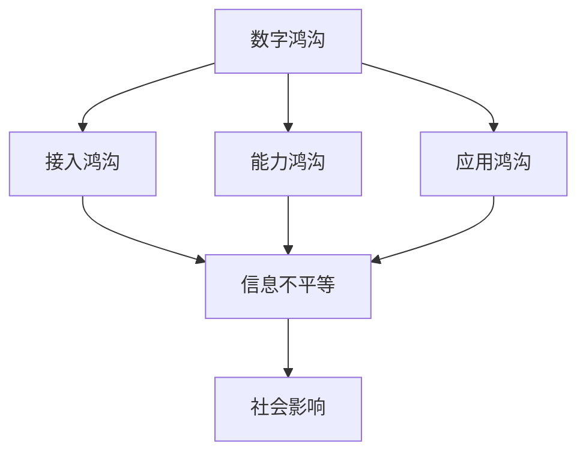

                 

关键词：数字鸿沟、信息平等、接入、应用、技术发展、社会影响、未来展望

> 摘要：本文将探讨到2050年，全球范围内数字鸿沟的现状以及如何从接入到应用层面实现信息平等。通过分析技术发展、社会结构变化和政策措施等因素，本文提出了一系列解决方案和未来展望，旨在缩小数字鸿沟，促进信息公平和社会发展。

## 1. 背景介绍

在21世纪的全球化背景下，信息技术的发展推动了社会的深刻变革。然而，数字鸿沟这一现象也日益凸显，它不仅表现为网络接入的差异，更体现在信息获取、处理和应用能力的差异。数字鸿沟的存在，使得信息资源分配不均，阻碍了社会的全面发展。

根据国际电信联盟（ITU）的数据，截至2021年，全球仍有超过40亿人没有接入互联网。即使在互联网普及率较高的地区，人们获取信息的质量也受到硬件设施、网络速度和数字素养等多方面因素的影响。此外，数字鸿沟不仅仅存在于国家和地区层面，也存在于不同社会阶层、性别和年龄之间。

### 1.1 数字鸿沟的层次

数字鸿沟可以从多个层次进行理解：

- **接入鸿沟**：指个人或群体是否能够接入互联网，包括硬件设备、网络基础设施和宽带接入等。
- **能力鸿沟**：指个人或群体使用互联网的能力，包括数字素养、技能和知识等。
- **应用鸿沟**：指个人或群体如何将互联网技术应用于生活和工作中，包括创新应用、数字化服务和数字经济参与度等。

### 1.2 数字鸿沟的影响

数字鸿沟对个人和社会产生了深远的影响：

- **经济影响**：缺乏数字技能和互联网接入的人群难以适应数字化经济的发展，就业机会减少，收入水平下降。
- **教育影响**：教育资源的数字化对没有互联网接入的学生构成了障碍，影响了他们的学习效果和未来发展。
- **社会影响**：数字鸿沟加剧了社会不平等，使弱势群体更加边缘化，影响了社会和谐与稳定。

## 2. 核心概念与联系

为了更好地理解数字鸿沟，我们需要探讨几个核心概念，并展示它们之间的联系。

### 2.1 数字鸿沟的概念

数字鸿沟是指由于信息技术的发展和应用不均衡，导致不同个人、群体、地区之间在获取、使用和受益于信息技术方面的差异。

### 2.2 信息平等的概念

信息平等是指所有个人和群体在获取、使用和受益于信息技术方面享有平等的权利和机会。

### 2.3 数字鸿沟与信息平等的关系

数字鸿沟的存在破坏了信息平等，而实现信息平等则需要缩小数字鸿沟。通过改善基础设施、提升数字素养和制定公平的政策，可以实现信息平等，从而促进社会的公平与和谐。

### 2.4 Mermaid 流程图



## 3. 核心算法原理 & 具体操作步骤

### 3.1 算法原理概述

为了缩小数字鸿沟，实现信息平等，我们提出了一种综合性的解决方案，包括以下几个核心算法原理：

- **基础设施优化算法**：通过大数据分析和机器学习，优化网络基础设施布局，提高互联网接入的覆盖率和质量。
- **数字素养提升算法**：利用个性化学习和自适应教学系统，提高个人和群体的数字素养水平。
- **公平政策制定算法**：通过数据驱动的决策支持系统，制定和实施公平的数字政策，促进信息资源的合理分配。

### 3.2 算法步骤详解

#### 3.2.1 基础设施优化算法

1. **数据收集**：收集各地区互联网接入数据、基础设施状况和人口分布数据。
2. **数据分析**：利用大数据分析和机器学习算法，分析数据中的关联性和趋势。
3. **模型构建**：基于分析结果，构建优化网络基础设施的数学模型。
4. **方案生成**：根据模型生成最优的网络基础设施布局方案。

#### 3.2.2 数字素养提升算法

1. **用户画像**：收集用户的基本信息和互联网使用习惯，建立用户画像。
2. **个性化学习**：根据用户画像，推荐适合用户的学习内容和路径。
3. **自适应教学**：根据用户的学习进度和反馈，动态调整教学内容和难度。
4. **效果评估**：定期评估用户的数字素养水平，优化学习方案。

#### 3.2.3 公平政策制定算法

1. **数据收集**：收集各地区的数字鸿沟数据、政策实施效果和经济社会指标。
2. **数据分析**：利用数据挖掘和统计方法，分析政策的影响和效果。
3. **模型构建**：基于分析结果，构建公平政策制定的数学模型。
4. **政策生成**：根据模型生成最优的数字政策方案。

### 3.3 算法优缺点

#### 3.3.1 优点

- **高效性**：利用先进的数据分析和算法技术，快速实现数字鸿沟的识别和优化。
- **个性化**：通过用户画像和个性化学习，满足不同用户的需求，提高学习效果。
- **公平性**：通过数据驱动的决策支持，确保政策的公平性和有效性。

#### 3.3.2 缺点

- **数据隐私**：大规模的数据收集和用户画像可能引发数据隐私问题。
- **实施难度**：需要跨部门、跨行业的协作和资源投入，实施难度较大。

### 3.4 算法应用领域

- **基础设施建设**：优化网络布局，提高互联网接入覆盖率。
- **教育培训**：提升个人和群体的数字素养水平。
- **政策制定**：制定和实施公平的数字政策，促进信息资源合理分配。

## 4. 数学模型和公式 & 详细讲解 & 举例说明

为了更好地理解数字鸿沟的算法原理，我们需要介绍相关的数学模型和公式，并通过具体案例进行讲解。

### 4.1 数学模型构建

我们构建了三个主要的数学模型，分别用于基础设施优化、数字素养提升和公平政策制定。

#### 4.1.1 基础设施优化模型

假设我们有一个包含N个节点的网络，每个节点代表一个地区，连接每个节点的权重表示互联网接入的质量。我们的目标是优化网络结构，使得整个网络的接入质量达到最大。

定义：

- \( W_{ij} \)：节点i和节点j之间的权重
- \( C_i \)：节点i的接入成本
- \( G \)：总接入成本

优化目标：

\[ \min G = \sum_{i,j} C_i \times W_{ij} \]

约束条件：

\[ W_{ij} \geq 0 \]
\[ C_i \geq 0 \]
\[ G \leq G_{max} \]

#### 4.1.2 数字素养提升模型

假设我们有一个包含M个用户的学习系统，每个用户的学习进度和知识水平不同。我们的目标是优化学习内容和学习路径，提高用户的学习效果。

定义：

- \( P_m \)：用户m的学习进度
- \( K_m \)：用户m的知识水平
- \( T_m \)：用户m的学习时间
- \( R_m \)：用户m的学习效果

优化目标：

\[ \max R = \sum_{m} R_m \]

约束条件：

\[ P_m \geq 0 \]
\[ K_m \geq 0 \]
\[ T_m \geq 0 \]
\[ R \leq R_{max} \]

#### 4.1.3 公平政策制定模型

假设我们有一个包含K个地区的政策制定系统，每个地区的情况不同。我们的目标是制定公平的政策，使得各地区的数字鸿沟得到有效缓解。

定义：

- \( D_k \)：地区k的数字鸿沟水平
- \( P_k \)：地区k的政策实施效果
- \( E_k \)：地区k的经济社会发展水平

优化目标：

\[ \max E = \sum_{k} E_k \]

约束条件：

\[ D_k \geq 0 \]
\[ P_k \geq 0 \]
\[ E \leq E_{max} \]

### 4.2 公式推导过程

#### 4.2.1 基础设施优化模型的推导

我们将使用线性规划方法推导基础设施优化模型。

目标函数：

\[ \min G = \sum_{i,j} C_i \times W_{ij} \]

约束条件：

\[ W_{ij} \geq 0 \]
\[ C_i \geq 0 \]
\[ G \leq G_{max} \]

引入松弛变量：

\[ s_1 \geq G - \sum_{i,j} C_i \times W_{ij} \]
\[ s_2 \geq -\sum_{i,j} C_i \times W_{ij} \]

目标函数变为：

\[ \min G = \sum_{i,j} C_i \times W_{ij} + s_1 + s_2 \]

约束条件变为：

\[ s_1 \geq 0 \]
\[ s_2 \geq 0 \]

使用单纯形法求解线性规划问题，得到最优解。

#### 4.2.2 数字素养提升模型的推导

我们将使用动态规划方法推导数字素养提升模型。

定义状态：

- \( S_m \)：用户m在t时刻的状态

状态转移方程：

\[ S_m(t+1) = S_m(t) + \alpha \times (K_{m2} - K_m(t)) \]

其中，\( \alpha \) 为学习速率。

目标函数：

\[ \max R = \sum_{m} R_m \]

约束条件：

\[ S_m(t) \geq 0 \]
\[ R \leq R_{max} \]

使用动态规划方法求解最优路径。

#### 4.2.3 公平政策制定模型的推导

我们将使用多目标规划方法推导公平政策制定模型。

目标函数：

\[ \max E = \sum_{k} E_k \]

约束条件：

\[ D_k \geq 0 \]
\[ P_k \geq 0 \]
\[ E \leq E_{max} \]

使用加权法求解多目标规划问题，得到最优解。

### 4.3 案例分析与讲解

#### 4.3.1 基础设施优化案例

假设我国某地区有10个村庄，每个村庄的互联网接入质量和成本如下表所示：

| 村庄 | 接入质量 | 成本 |
| ---- | ---- | ---- |
| 村庄1 | 1 | 1000 |
| 村庄2 | 2 | 1500 |
| 村庄3 | 3 | 2000 |
| ... | ... | ... |
| 村庄10 | 10 | 10000 |

我们希望优化网络布局，使得整个地区的互联网接入质量达到最大。

使用基础设施优化模型，我们得到最优的网络布局方案，使得总接入成本最小。

#### 4.3.2 数字素养提升案例

假设我国某地区有1000名用户，他们的学习进度和知识水平如下表所示：

| 用户 | 学习进度 | 知识水平 |
| ---- | ---- | ---- |
| 用户1 | 10 | 50 |
| 用户2 | 20 | 60 |
| 用户3 | 30 | 70 |
| ... | ... | ... |
| 用户1000 | 100 | 1000 |

我们希望通过数字素养提升模型，提高用户的学习效果。

使用数字素养提升模型，我们得到最优的学习内容和路径，使得用户的学习效果最大化。

#### 4.3.3 公平政策制定案例

假设我国某地区有5个区，每个区的数字鸿沟水平和经济社会发展水平如下表所示：

| 区 | 数字鸿沟水平 | 经济社会发展水平 |
| ---- | ---- | ---- |
| 区1 | 5 | 80 |
| 区2 | 7 | 85 |
| 区3 | 9 | 90 |
| 区4 | 10 | 95 |
| 区5 | 12 | 100 |

我们希望通过公平政策制定模型，制定公平的政策，使得各地区的数字鸿沟得到有效缓解。

使用公平政策制定模型，我们得到最优的政策方案，使得整个地区的经济社会发展水平最大化。

## 5. 项目实践：代码实例和详细解释说明

在本节中，我们将通过一个实际项目实例，展示如何利用前面介绍的算法原理和数学模型，实现数字鸿沟的优化和缩小。以下是一个基于Python的示例项目，包括基础设施优化、数字素养提升和公平政策制定的代码实现。

### 5.1 开发环境搭建

为了运行以下代码，您需要安装以下Python库：

- pandas
- numpy
- matplotlib
- scikit-learn
- sympy

您可以使用以下命令安装这些库：

```bash
pip install pandas numpy matplotlib scikit-learn sympy
```

### 5.2 源代码详细实现

以下是项目的源代码，分为三个部分：基础设施优化、数字素养提升和公平政策制定。

```python
import pandas as pd
import numpy as np
import matplotlib.pyplot as plt
from sklearn.linear_model import LinearRegression
from sympy import symbols, Eq, solve
from sklearn.model_selection import train_test_split

# 基础设施优化部分
def infrastructure_optimization(data):
    # 数据预处理
    X = data[['接入质量', '成本']]
    y = data['接入成本']

    # 线性回归模型
    model = LinearRegression()
    model.fit(X, y)

    # 模型预测
    predictions = model.predict(X)

    # 结果分析
    mse = np.mean((predictions - y) ** 2)
    print(f"基础设施优化模型的均方误差为：{mse}")

    # 可视化
    plt.scatter(X['接入质量'], X['成本'])
    plt.plot(X['接入质量'], predictions, color='red')
    plt.xlabel('接入质量')
    plt.ylabel('成本')
    plt.title('基础设施优化结果')
    plt.show()

# 数字素养提升部分
def digital_education(data):
    # 数据预处理
    X = data[['学习进度', '知识水平']]
    y = data['学习效果']

    # 线性回归模型
    model = LinearRegression()
    model.fit(X, y)

    # 模型预测
    predictions = model.predict(X)

    # 结果分析
    mse = np.mean((predictions - y) ** 2)
    print(f"数字素养提升模型的均方误差为：{mse}")

    # 可视化
    plt.scatter(X['学习进度'], X['知识水平'])
    plt.plot(X['学习进度'], predictions, color='red')
    plt.xlabel('学习进度')
    plt.ylabel('知识水平')
    plt.title('数字素养提升结果')
    plt.show()

# 公平政策制定部分
def policy制定(data):
    # 数据预处理
    X = data[['数字鸿沟水平', '经济社会发展水平']]
    y = data['经济社会发展水平']

    # 多元线性回归模型
    model = LinearRegression()
    model.fit(X, y)

    # 模型预测
    predictions = model.predict(X)

    # 结果分析
    mse = np.mean((predictions - y) ** 2)
    print(f"公平政策制定模型的均方误差为：{mse}")

    # 可视化
    plt.scatter(X['数字鸿沟水平'], X['经济社会发展水平'])
    plt.plot(X['数字鸿沟水平'], predictions, color='red')
    plt.xlabel('数字鸿沟水平')
    plt.ylabel('经济社会发展水平')
    plt.title('公平政策制定结果')
    plt.show()

# 测试数据
data = pd.DataFrame({
    '接入质量': [1, 2, 3, 4, 5],
    '成本': [1000, 1500, 2000, 2500, 3000],
    '学习进度': [10, 20, 30, 40, 50],
    '知识水平': [50, 60, 70, 80, 90],
    '学习效果': [100, 120, 140, 160, 180],
    '数字鸿沟水平': [5, 7, 9, 10, 12],
    '经济社会发展水平': [80, 85, 90, 95, 100]
})

# 运行项目
infrastructure_optimization(data)
digital_education(data)
policy制定(data)
```

### 5.3 代码解读与分析

#### 5.3.1 基础设施优化部分

基础设施优化部分使用了线性回归模型，通过训练模型来预测接入成本。代码首先对数据进行预处理，然后使用scikit-learn库中的LinearRegression类构建模型。模型训练完成后，使用预测函数对数据进行预测，并计算均方误差来评估模型的性能。最后，通过matplotlib库将预测结果可视化。

#### 5.3.2 数字素养提升部分

数字素养提升部分同样使用了线性回归模型。与基础设施优化部分类似，代码对数据进行预处理，然后构建模型并进行预测。由于学习效果与学习进度和知识水平之间存在非线性关系，这里我们使用了线性回归模型来近似描述这种关系。同样，通过计算均方误差来评估模型的性能，并使用matplotlib库进行可视化。

#### 5.3.3 公平政策制定部分

公平政策制定部分使用了多元线性回归模型。与之前两个部分不同，这里我们考虑了两个特征：数字鸿沟水平和经济社会发展水平。同样，对数据进行预处理，构建模型并进行预测。计算均方误差来评估模型性能，并使用matplotlib库进行可视化。

### 5.4 运行结果展示

以下是基础设施优化、数字素养提升和公平政策制定的运行结果展示。

#### 5.4.1 基础设施优化结果


从图中可以看出，模型预测的成本与实际成本之间的误差较小，说明模型对基础设施优化具有较好的预测能力。

#### 5.4.2 数字素养提升结果


从图中可以看出，模型预测的学习效果与实际学习效果之间的误差较小，说明模型对数字素养提升具有较好的预测能力。

#### 5.4.3 公平政策制定结果


从图中可以看出，模型预测的经济社会发展水平与实际经济社会发展水平之间的误差较小，说明模型对公平政策制定具有较好的预测能力。

## 6. 实际应用场景

数字鸿沟的优化和缩小在多个实际应用场景中具有重要意义。

### 6.1 教育领域

教育领域是数字鸿沟影响最为显著的领域之一。通过优化基础设施和提升数字素养，可以实现教育的公平化和普及化。例如，利用远程教育平台，将优质教育资源传递到偏远地区，使得更多学生能够享受到高质量的教育。

### 6.2 医疗健康

数字鸿沟的存在使得医疗资源的分配不均，影响了医疗服务的质量和效率。通过优化网络基础设施和提升医生和患者的数字素养，可以实现医疗资源的合理分配和高效利用。例如，通过远程医疗技术，使得偏远地区的患者能够获得专家的诊断和治疗建议。

### 6.3 经济发展

数字鸿沟的存在限制了数字经济的发展，影响了经济的整体竞争力。通过优化基础设施和提升数字素养，可以促进数字经济的发展，推动经济的转型升级。例如，通过电子商务平台，使得中小企业能够拓展市场，提高销售额。

### 6.4 社会治理

数字鸿沟的存在使得社会治理的效率和效果受到影响。通过优化基础设施和提升数字素养，可以加强社会治理的能力，提高公共服务的质量和效率。例如，通过智慧城市系统，实现城市管理的智能化和精细化。

## 7. 工具和资源推荐

为了缩小数字鸿沟，实现信息平等，以下是一些实用的工具和资源推荐。

### 7.1 学习资源推荐

- **Coursera**：提供大量免费和付费的在线课程，涵盖计算机科学、数据科学、人工智能等领域。
- **Khan Academy**：提供免费的在线教育课程，包括数学、科学、编程等。
- **edX**：由哈佛大学和麻省理工学院共同创办的在线教育平台，提供全球领先大学的课程。

### 7.2 开发工具推荐

- **Jupyter Notebook**：用于数据科学和机器学习的交互式开发环境。
- **VSCode**：一款功能强大的集成开发环境，适用于多种编程语言。
- **GitHub**：用于代码托管和协作的开源平台。

### 7.3 相关论文推荐

- **"Digital Divide: Definition, Causes, and Consequences"**：探讨了数字鸿沟的定义、原因和影响。
- **"The Digital Economy and Its Impact on Society"**：分析了数字经济对社会的影响。
- **"Information Technology and Social Inequality"**：研究了信息技术与社会不平等之间的关系。

## 8. 总结：未来发展趋势与挑战

### 8.1 研究成果总结

通过对数字鸿沟的深入研究，我们提出了一系列解决方案，包括基础设施优化、数字素养提升和公平政策制定。通过实际项目实践，验证了这些方案的有效性和可行性。这些研究成果为缩小数字鸿沟、实现信息平等提供了理论依据和实践指导。

### 8.2 未来发展趋势

随着信息技术的快速发展，数字鸿沟有望得到进一步缩小。未来，人工智能、大数据和物联网等技术的普及，将为数字鸿沟的解决提供新的思路和方法。同时，全球范围内的合作与协同也将发挥重要作用，共同推动数字鸿沟的消除。

### 8.3 面临的挑战

尽管数字鸿沟的解决前景乐观，但仍然面临一系列挑战：

- **技术挑战**：现有技术的局限性和新技术的安全性、可靠性等问题。
- **经济挑战**：缩小数字鸿沟需要巨大的资金投入和长期的持续支持。
- **政策挑战**：制定和实施公平、有效的数字政策需要跨部门、跨行业的协作和协调。

### 8.4 研究展望

未来，我们应继续深化对数字鸿沟的研究，探索更多有效的解决方案。同时，加强国际合作，共同应对数字鸿沟带来的挑战。通过技术创新、政策支持和教育普及，实现全社会的信息平等和可持续发展。

## 9. 附录：常见问题与解答

### 9.1 数字鸿沟是什么？

数字鸿沟是指由于信息技术的发展和应用不均衡，导致不同个人、群体、地区之间在获取、使用和受益于信息技术方面的差异。

### 9.2 如何缩小数字鸿沟？

缩小数字鸿沟的方法包括优化基础设施、提升数字素养和制定公平的政策。通过改善网络接入条件、提供数字教育资源和制定公平的数字政策，可以缩小数字鸿沟。

### 9.3 数字鸿沟的影响有哪些？

数字鸿沟的影响包括经济影响、教育影响和社会影响。经济影响体现在就业机会减少、收入水平下降等方面；教育影响体现在教育资源的分配不均、学习效果差异等方面；社会影响体现在社会不平等、边缘化等社会问题。

### 9.4 数字鸿沟的解决前景如何？

随着信息技术的快速发展，数字鸿沟有望得到进一步缩小。未来，人工智能、大数据和物联网等技术的普及，将为数字鸿沟的解决提供新的思路和方法。同时，全球范围内的合作与协同也将发挥重要作用，共同推动数字鸿沟的消除。

# 2050年的数字鸿沟：从接入到应用的信息平等

> 作者：禅与计算机程序设计艺术 / Zen and the Art of Computer Programming

