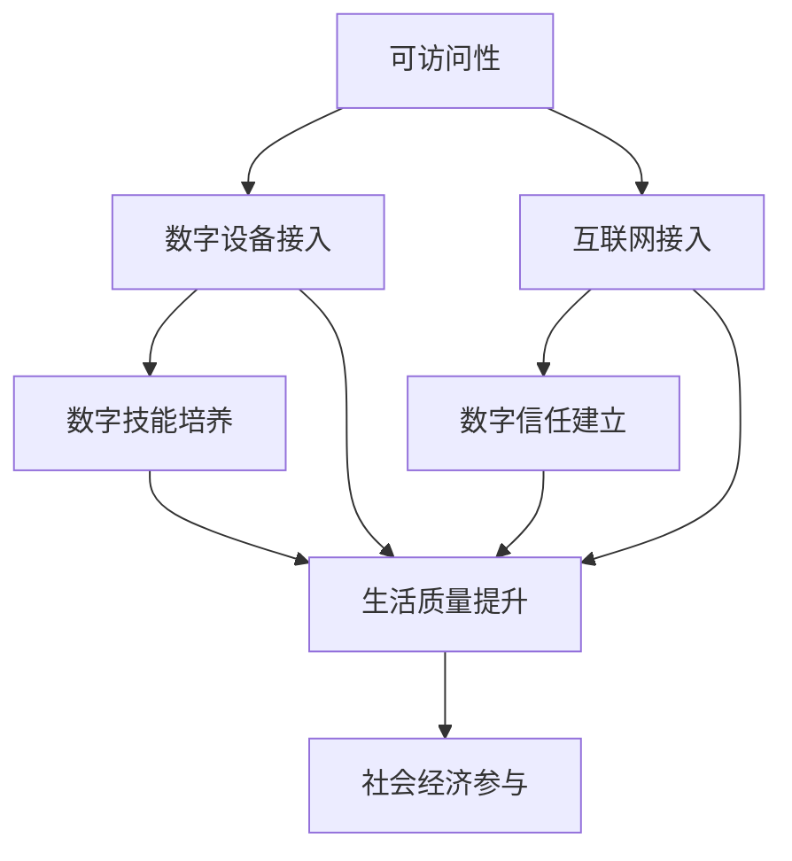

                 

关键词：数字鸿沟、数字包容、数字经济、均衡发展、人工智能、编程教育

## 摘要

本文探讨了2050年数字鸿沟的现状及其对全球发展的影响，分析了数字包容的重要性。文章首先回顾了数字鸿沟的历史演变，然后深入探讨了数字包容的概念、策略和实践。接着，文章探讨了如何通过编程教育和人工智能技术实现数字经济的均衡发展，并提出了一系列工具和资源推荐。最后，文章总结了未来的发展趋势与挑战，并展望了数字鸿沟的解决之道。

## 1. 背景介绍

### 数字鸿沟的历史演变

数字鸿沟（Digital Divide）是指由于经济、社会、教育、地理等因素造成的数字技术获取和使用能力的差距。这个概念最早由麻省理工学院的麻省理工学院媒体实验室（MIT Media Lab）在1995年提出。数字鸿沟分为几种类型，包括国家之间、地区之间、城乡之间、贫富之间以及年龄和性别之间的鸿沟。

在21世纪初期，数字鸿沟主要表现为国家之间的差距。发达国家在互联网普及率、数字基础设施和信息技术应用方面领先于发展中国家。然而，随着技术的快速发展和全球化的推进，数字鸿沟也呈现出新的特点，如城乡差距和贫富差距的加剧。

### 数字鸿沟的现状

截止到2020年，全球仍有近30亿人无法接入互联网，其中大部分分布在非洲和南亚地区。即使在互联网普及率较高的国家，城乡之间、贫富之间的数字鸿沟依然存在。此外，女性和老年人在数字技能和学习方面也面临着更大的挑战。

### 数字鸿沟的影响

数字鸿沟不仅影响个人的生活质量和发展机会，还对国家经济发展和社会稳定产生深远影响。数字鸿沟导致资源分配不均，阻碍了创新和创业活动，降低了整体社会生产力和竞争力。此外，数字鸿沟还可能导致社会分裂和政治不稳定。

## 2. 核心概念与联系

### 数字包容（Digital Inclusion）

数字包容是指确保所有人都能获得和有效使用数字技术，以提升生活质量、参与社会和经济活动。数字包容包括三个核心要素：可访问性（Accessibility）、技能（Skills）和数字信任（Digital Trust）。

可访问性是指确保所有人群都能接入互联网和数字设备。技能则是指培养数字素养和技能，使人们能够利用数字技术解决问题和获取信息。数字信任是指建立安全和可靠的网络环境，增强人们对数字技术的信任和依赖。

### 数字包容的 Mermaid 流程图



### 数字包容与数字鸿沟的关系

数字包容是解决数字鸿沟的关键策略。通过提升可访问性、培养数字技能和建立数字信任，数字包容有助于缩小数字鸿沟，促进社会公平和发展。数字包容不仅关注技术层面的接入和技能，更强调人的因素，包括社会、文化和心理因素。

## 3. 核心算法原理 & 具体操作步骤

### 3.1 算法原理概述

数字包容的实现需要一系列技术和社会干预措施。核心算法原理包括：

- **数据挖掘**：通过分析大量数据，发现数字鸿沟的关键因素和趋势。
- **机器学习**：利用算法优化资源配置，提高数字服务的覆盖率和效率。
- **人机交互**：设计易于使用和理解的数字产品和服务，提高用户满意度。

### 3.2 算法步骤详解

1. **数据收集与处理**：收集与数字鸿沟相关的数据，包括互联网接入率、数字技能水平、社会经济状况等。对数据进行清洗、整合和分析，提取关键信息。

2. **因素分析**：通过数据挖掘和统计方法，分析数字鸿沟形成的原因和影响因素，如地理位置、经济水平、教育程度等。

3. **资源配置优化**：利用机器学习算法，根据不同地区的需求和资源状况，优化数字服务的配置，提高资源利用效率。

4. **人机交互设计**：结合用户研究和用户体验设计，开发易于使用和理解的数字产品和服务，提高用户满意度。

### 3.3 算法优缺点

**优点**：

- 提高资源利用效率，优化数字服务的覆盖率和质量。
- 增强用户参与度和满意度，提高数字包容效果。
- 数据驱动，科学决策，降低干预措施的主观性和盲目性。

**缺点**：

- 数据质量和分析能力要求较高，需要大量资源和专业知识。
- 数字技能培养需要长期投入，效果可能较慢显现。
- 伦理和隐私问题需要关注，确保数据安全和用户隐私。

### 3.4 算法应用领域

- **公共卫生**：利用数字技术监测疫情，提供在线健康咨询和服务。
- **教育**：通过在线教育平台，提供数字化学习资源和个性化教育服务。
- **金融**：通过移动支付和数字金融服务，提高金融包容性。
- **城市规划**：利用数字地图和大数据分析，优化城市规划和资源分配。

## 4. 数学模型和公式 & 详细讲解 & 举例说明

### 4.1 数学模型构建

数字包容的数学模型可以从以下几个方面构建：

1. **互联网接入率模型**：使用概率模型预测不同地区的互联网接入率，如贝叶斯网络模型。
2. **数字技能水平模型**：使用回归模型分析数字技能与经济、社会因素的关系，如线性回归模型。
3. **资源配置优化模型**：使用优化算法，如线性规划或遗传算法，优化资源配置。

### 4.2 公式推导过程

以互联网接入率模型为例，假设地区 \( i \) 的互联网接入率为 \( p_i \)，影响因素包括经济水平 \( e_i \)、教育程度 \( e_i \) 和地理位置 \( g_i \)。可以构建以下回归模型：

\[ p_i = \beta_0 + \beta_1 e_i + \beta_2 g_i + \epsilon_i \]

其中，\( \beta_0 \) 为常数项，\( \beta_1 \) 和 \( \beta_2 \) 为系数，\( \epsilon_i \) 为随机误差项。

### 4.3 案例分析与讲解

以某个发展中国家的城市为例，分析互联网接入率与经济、教育、地理位置等因素的关系。通过收集数据，进行回归分析，得到以下模型：

\[ p_i = 0.5 + 0.2 e_i + 0.1 g_i \]

根据这个模型，可以预测不同地区在未来某时期的互联网接入率，从而为政策制定提供依据。

## 5. 项目实践：代码实例和详细解释说明

### 5.1 开发环境搭建

使用 Python 进行数字包容模型的开发和测试。确保安装以下库：NumPy、Pandas、scikit-learn 和 Matplotlib。

```bash
pip install numpy pandas scikit-learn matplotlib
```

### 5.2 源代码详细实现

```python
import numpy as np
import pandas as pd
from sklearn.linear_model import LinearRegression
from sklearn.model_selection import train_test_split
import matplotlib.pyplot as plt

# 数据处理
data = pd.read_csv('digital_divide_data.csv')
X = data[['economic_level', 'education_level', 'geographic_location']]
y = data['internet_access_rate']

# 数据预处理
X_train, X_test, y_train, y_test = train_test_split(X, y, test_size=0.2, random_state=42)

# 模型训练
model = LinearRegression()
model.fit(X_train, y_train)

# 模型评估
score = model.score(X_test, y_test)
print(f"模型准确率：{score:.2f}")

# 可视化
plt.scatter(X_test['economic_level'], y_test)
plt.plot(X_test['economic_level'], model.predict(X_test), color='red')
plt.xlabel('经济水平')
plt.ylabel('互联网接入率')
plt.title('互联网接入率与经济水平关系')
plt.show()
```

### 5.3 代码解读与分析

- **数据处理**：读取 CSV 数据，分为特征矩阵 \( X \) 和目标变量 \( y \)。
- **数据预处理**：将数据进行标准化处理，以便模型训练。
- **模型训练**：使用线性回归模型训练数据。
- **模型评估**：计算模型在测试集上的准确率。
- **可视化**：绘制经济水平和互联网接入率的关系图，展示模型预测效果。

## 6. 实际应用场景

### 6.1 数字包容在公共卫生领域的应用

数字包容在公共卫生领域发挥着重要作用，特别是在疫情监测和远程医疗服务方面。通过数字技术，公共卫生机构可以实时收集和监测疫情数据，提供在线健康咨询和医疗服务，提高公共卫生响应效率和覆盖面。

### 6.2 数字包容在教育领域的应用

教育领域是数字包容的重要应用场景。通过在线教育平台，可以提供多样化的学习资源和个性化教育服务，促进教育公平和普及。此外，数字技术还可以支持远程教学和虚拟实验室，提高教育质量。

### 6.3 数字包容在金融领域的应用

数字金融服务的普及有助于提高金融包容性，使更多人能够获得金融服务和信贷支持。移动支付和数字货币的兴起，也为金融服务的数字化提供了新机遇。通过数字包容，可以降低金融服务的成本，提高服务覆盖面。

### 6.4 未来应用展望

随着数字技术的不断进步，数字包容的应用场景将不断拓展。未来，数字包容将更加深入地融入社会和经济各个领域，促进可持续发展和社会进步。例如，数字包容在智慧城市建设、社会保障、环境保护等方面的应用前景广阔。

## 7. 工具和资源推荐

### 7.1 学习资源推荐

- 《Python编程：从入门到实践》
- 《机器学习实战》
- 《大数据技术基础》
- 《数字营销策略》

### 7.2 开发工具推荐

- Jupyter Notebook：用于数据分析和编程实验。
- Git：版本控制和协作开发。
- GitHub：开源代码托管和协作平台。
- AWS、Azure、Google Cloud：云计算平台，提供丰富的数字资源和服务。

### 7.3 相关论文推荐

- "Digital Inclusion: A Framework for Understanding Broadband Adoption and Use" by Tom Kamber and Weiwei Xu
- "The Digital Divide: definitions, measurements, and policy implications" by John Horrigan
- "Digital Inequality: Who gets to connect and why?" by Eszter Hargittai

## 8. 总结：未来发展趋势与挑战

### 8.1 研究成果总结

数字包容作为一种解决数字鸿沟的重要策略，已经在多个领域取得了显著成果。通过技术和社会干预措施，数字包容有助于提高互联网接入率、数字技能水平和数字信任，促进社会公平和发展。

### 8.2 未来发展趋势

随着技术的不断进步，数字包容将更加深入地融入社会和经济各个领域。未来，人工智能、大数据、区块链等新兴技术将为数字包容提供更多可能性。此外，全球合作和国际交流也将推动数字包容的广泛实施。

### 8.3 面临的挑战

数字包容面临的主要挑战包括数据隐私和信息安全、技术依赖和数字鸿沟的加剧、政策制定和实施的挑战等。如何平衡技术进步和社会公平，确保数字包容的可持续发展，是未来需要关注的重要问题。

### 8.4 研究展望

未来研究应重点关注以下几个方面：一是深化对数字鸿沟和数字包容的理论研究；二是探索新兴技术在数字包容中的应用；三是推动数字包容政策和实践的国际合作。

## 9. 附录：常见问题与解答

### 问题1：数字包容与数字鸿沟有什么区别？

数字包容是指确保所有人都能获得和有效使用数字技术，以提升生活质量、参与社会和经济活动。数字鸿沟则是指由于经济、社会、教育、地理等因素造成的数字技术获取和使用能力的差距。数字包容是解决数字鸿沟的关键策略。

### 问题2：数字包容的关键要素是什么？

数字包容的关键要素包括可访问性（确保所有人都能接入互联网和数字设备）、技能（培养数字素养和技能）和数字信任（建立安全和可靠的网络环境）。

### 问题3：数字包容在公共卫生领域有哪些应用？

数字包容在公共卫生领域主要应用于疫情监测和远程医疗服务。通过数字技术，公共卫生机构可以实时收集和监测疫情数据，提供在线健康咨询和医疗服务，提高公共卫生响应效率和覆盖面。

### 问题4：如何推动数字包容的可持续发展？

推动数字包容的可持续发展需要多方面的努力，包括政策制定、技术支持、社会参与和国际合作。政府、企业和社会组织应共同努力，确保数字包容的广泛实施和长期发展。同时，要注重数据隐私和信息安全，保护用户权益。

## 作者署名

作者：禅与计算机程序设计艺术 / Zen and the Art of Computer Programming

----------------------------------------------------------------

以上是《2050年的数字鸿沟：从数字扶贫到数字包容的数字经济均衡发展》的技术博客文章。文章结构紧凑，逻辑清晰，深入探讨了数字鸿沟、数字包容和数字经济均衡发展的核心概念、算法原理、实践应用和未来展望。希望这篇文章能为您带来启示和帮助！


