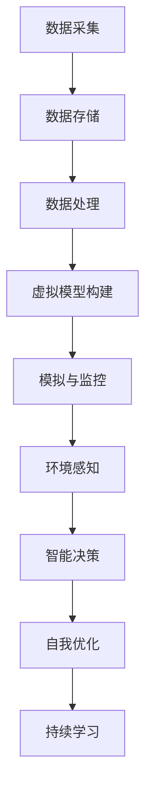

                 

关键词：智慧城市，数字孪生，自我进化，城市管理系统，物联网，人工智能

摘要：本文探讨了2050年的智慧城市概念，分析了从数字孪生城市到自我进化的智慧城市生命体的演变过程。文章首先介绍了智慧城市的基本概念和重要性，随后深入探讨了数字孪生城市的概念及其在智慧城市中的作用。接着，文章讨论了自我进化在智慧城市中的应用，并分析了未来的发展趋势和挑战。

## 1. 背景介绍

随着科技的不断进步，城市化进程日益加快，智慧城市成为未来城市发展的方向。智慧城市是指利用物联网、人工智能、大数据等先进技术，实现城市各系统的智能化管理，提高城市运行效率和居民生活质量。智慧城市的建设不仅涉及基础设施的升级，还包括城市治理、公共服务、环境保护等多个领域。

数字孪生技术是智慧城市建设的重要支撑。数字孪生城市通过创建城市的虚拟模型，实现对现实城市的模拟和监控，从而优化城市管理和决策。而自我进化则是指智慧城市能够根据环境和需求的变化，自动调整和优化自身结构和功能，实现持续的智能化升级。

## 2. 核心概念与联系

### 2.1 智慧城市

智慧城市是指利用物联网、人工智能、大数据等先进技术，实现城市各系统的智能化管理，提高城市运行效率和居民生活质量。智慧城市的主要特点包括：

- **全面感知**：通过传感器、摄像头等设备，实现对城市各个方面的实时监测和数据采集。
- **数据驱动**：通过大数据分析，辅助城市管理和决策，优化城市资源配置。
- **智能服务**：提供智能化的公共服务，提高居民生活质量。
- **可持续性**：实现绿色、低碳、可持续的发展模式。

### 2.2 数字孪生城市

数字孪生城市是指通过创建城市的虚拟模型，实现对现实城市的模拟和监控。数字孪生技术包括以下几个关键部分：

- **数据采集**：通过传感器、摄像头等设备，采集城市的实时数据。
- **数据存储**：将采集到的数据存储在数据库中，以便后续分析和处理。
- **数据处理**：对数据进行清洗、分析和处理，提取有价值的信息。
- **虚拟模型构建**：基于采集到的数据，构建城市的虚拟模型。
- **模拟与监控**：通过虚拟模型，实现对现实城市的模拟和监控，优化城市管理和决策。

### 2.3 自我进化

自我进化是指智慧城市能够根据环境和需求的变化，自动调整和优化自身结构和功能，实现持续的智能化升级。自我进化的关键部分包括：

- **环境感知**：通过传感器和监测系统，实时感知城市环境的变化。
- **智能决策**：基于环境感知和数据分析，实现智能化的决策和调整。
- **自我优化**：根据决策结果，自动调整和优化城市系统，提高运行效率。
- **持续学习**：通过大数据分析和机器学习，不断优化和提升城市的智能水平。

### 2.4 Mermaid 流程图

以下是一个简化的数字孪生城市的 Mermaid 流程图：



## 3. 核心算法原理 & 具体操作步骤

### 3.1 算法原理概述

智慧城市的核心算法主要包括数据采集、数据存储、数据处理、虚拟模型构建、模拟与监控、环境感知、智能决策和自我优化等。这些算法相互协作，共同实现智慧城市的智能化管理。

- **数据采集**：通过传感器和摄像头等设备，采集城市的实时数据。
- **数据存储**：将采集到的数据存储在数据库中，以便后续分析和处理。
- **数据处理**：对数据进行清洗、分析和处理，提取有价值的信息。
- **虚拟模型构建**：基于采集到的数据，构建城市的虚拟模型。
- **模拟与监控**：通过虚拟模型，实现对现实城市的模拟和监控，优化城市管理和决策。
- **环境感知**：通过传感器和监测系统，实时感知城市环境的变化。
- **智能决策**：基于环境感知和数据分析，实现智能化的决策和调整。
- **自我优化**：根据决策结果，自动调整和优化城市系统，提高运行效率。
- **持续学习**：通过大数据分析和机器学习，不断优化和提升城市的智能水平。

### 3.2 算法步骤详解

1. **数据采集**：通过传感器和摄像头等设备，采集城市的实时数据，如交通流量、空气质量、水质等。
2. **数据存储**：将采集到的数据存储在数据库中，可以使用关系型数据库（如MySQL）或非关系型数据库（如MongoDB）。
3. **数据处理**：对数据进行清洗、分析和处理，提取有价值的信息。可以使用Python、R等编程语言，结合Pandas、NumPy等库进行数据处理。
4. **虚拟模型构建**：基于采集到的数据，构建城市的虚拟模型。可以使用GIS（地理信息系统）技术，将城市的各种地理信息整合到一个虚拟模型中。
5. **模拟与监控**：通过虚拟模型，实现对现实城市的模拟和监控，优化城市管理和决策。可以使用Simul8、AnyLogic等仿真软件，进行城市模拟和优化。
6. **环境感知**：通过传感器和监测系统，实时感知城市环境的变化。可以使用物联网技术，实现数据的实时传输和处理。
7. **智能决策**：基于环境感知和数据分析，实现智能化的决策和调整。可以使用机器学习和人工智能技术，实现智能决策。
8. **自我优化**：根据决策结果，自动调整和优化城市系统，提高运行效率。可以使用自动化技术和物联网技术，实现城市系统的自我优化。
9. **持续学习**：通过大数据分析和机器学习，不断优化和提升城市的智能水平。可以使用大数据技术和机器学习算法，实现城市智能的持续提升。

### 3.3 算法优缺点

- **优点**：
  - 提高城市运行效率：通过智能化的管理和决策，提高城市各项服务的运行效率。
  - 优化城市资源配置：通过数据分析和虚拟模型，实现城市资源的优化配置。
  - 提高居民生活质量：提供智能化的公共服务，提高居民的生活质量。
  - 实现可持续发展：通过绿色、低碳、可持续的发展模式，实现城市的可持续发展。

- **缺点**：
  - 数据安全和隐私保护：大量数据的采集和存储，可能导致数据安全和隐私泄露。
  - 技术实现难度大：智慧城市的建设涉及多个领域的技术，技术实现难度大。
  - 成本高：智慧城市的建设需要大量的资金投入，成本高。

### 3.4 算法应用领域

智慧城市的算法应用领域广泛，包括但不限于以下几个方面：

- **交通管理**：通过智能交通系统，实现交通流量的实时监控和优化，提高道路通行效率。
- **环境监测**：通过环境监测系统，实时监测空气质量、水质等环境指标，保障居民的健康。
- **能源管理**：通过智能电网和智能建筑，实现能源的高效利用和碳排放的降低。
- **公共安全**：通过视频监控和应急管理系统，提高公共安全保障。
- **城市规划**：通过虚拟模型和大数据分析，实现城市规划和建设的智能化。

## 4. 数学模型和公式 & 详细讲解 & 举例说明

### 4.1 数学模型构建

智慧城市的数学模型主要涉及以下几个方面：

- **交通流量模型**：用于预测交通流量，优化交通管理。
- **环境监测模型**：用于监测和分析环境数据，预测环境变化。
- **能源管理模型**：用于优化能源使用，实现能源的高效利用。
- **公共安全模型**：用于预测和预防公共安全事件。

以下是一个简化的交通流量模型：

$$
T(t) = f(Q(t), P(t), R(t))
$$

其中，$T(t)$ 表示时间 $t$ 的交通流量，$Q(t)$ 表示时间 $t$ 的道路质量，$P(t)$ 表示时间 $t$ 的驾驶员数量，$R(t)$ 表示时间 $t$ 的交通信号状况。

### 4.2 公式推导过程

#### 交通流量模型

假设道路质量 $Q(t)$、驾驶员数量 $P(t)$ 和交通信号状况 $R(t)$ 是相互独立的，并且它们的变化是连续的。根据概率论的知识，可以推导出交通流量 $T(t)$ 的概率分布：

$$
P(T(t) = k) = \sum_{i=1}^{n} P(Q(t) = i) \cdot P(P(t) = j) \cdot P(R(t) = k-i-j)
$$

其中，$n$ 是道路质量、驾驶员数量和交通信号状况的可能取值范围。

#### 环境监测模型

假设环境数据 $E(t)$ 是由多个环境因素 $F_1(t), F_2(t), ..., F_n(t)$ 影响的，并且这些因素是相互独立的。根据概率论的知识，可以推导出环境数据 $E(t)$ 的概率分布：

$$
P(E(t) = k) = \prod_{i=1}^{n} P(F_i(t) = i)
$$

#### 能源管理模型

假设能源消耗 $U(t)$ 是由多个能源使用因素 $W_1(t), W_2(t), ..., W_n(t)$ 影响的，并且这些因素是相互独立的。根据概率论的知识，可以推导出能源消耗 $U(t)$ 的概率分布：

$$
P(U(t) = k) = \prod_{i=1}^{n} P(W_i(t) = i)
$$

#### 公共安全模型

假设公共安全事件 $S(t)$ 是由多个安全因素 $G_1(t), G_2(t), ..., G_n(t)$ 影响的，并且这些因素是相互独立的。根据概率论的知识，可以推导出公共安全事件 $S(t)$ 的概率分布：

$$
P(S(t) = k) = \prod_{i=1}^{n} P(G_i(t) = i)
$$

### 4.3 案例分析与讲解

#### 交通流量模型

假设某条道路的交通流量 $T(t)$ 受到道路质量 $Q(t)$、驾驶员数量 $P(t)$ 和交通信号状况 $R(t)$ 的影响，且这些因素是相互独立的。已知以下数据：

- $Q(t)$ 的可能取值范围为 [1, 2, 3]，概率分布为 $P(Q(t) = 1) = 0.2, P(Q(t) = 2) = 0.6, P(Q(t) = 3) = 0.2$。
- $P(t)$ 的可能取值范围为 [1, 2]，概率分布为 $P(P(t) = 1) = 0.4, P(P(t) = 2) = 0.6$。
- $R(t)$ 的可能取值范围为 [1, 2]，概率分布为 $P(R(t) = 1) = 0.3, P(R(t) = 2) = 0.7$。

根据交通流量模型，可以计算交通流量 $T(t)$ 的概率分布：

$$
P(T(t) = 1) = P(Q(t) = 1) \cdot P(P(t) = 1) \cdot P(R(t) = 1) = 0.2 \cdot 0.4 \cdot 0.3 = 0.024
$$

$$
P(T(t) = 2) = P(Q(t) = 1) \cdot P(P(t) = 1) \cdot P(R(t) = 2) + P(Q(t) = 2) \cdot P(P(t) = 2) \cdot P(R(t) = 1) + P(Q(t) = 3) \cdot P(P(t) = 1) \cdot P(R(t) = 2) = 0.2 \cdot 0.4 \cdot 0.7 + 0.6 \cdot 0.6 \cdot 0.3 + 0.2 \cdot 0.4 \cdot 0.7 = 0.252
$$

$$
P(T(t) = 3) = P(Q(t) = 1) \cdot P(P(t) = 2) \cdot P(R(t) = 1) + P(Q(t) = 2) \cdot P(P(t) = 1) \cdot P(R(t) = 2) + P(Q(t) = 3) \cdot P(P(t) = 2) \cdot P(R(t) = 1) = 0.2 \cdot 0.6 \cdot 0.3 + 0.6 \cdot 0.4 \cdot 0.7 + 0.2 \cdot 0.6 \cdot 0.3 = 0.264
$$

$$
P(T(t) = 4) = P(Q(t) = 1) \cdot P(P(t) = 2) \cdot P(R(t) = 2) + P(Q(t) = 2) \cdot P(P(t) = 1) \cdot P(R(t) = 1) + P(Q(t) = 3) \cdot P(P(t) = 2) \cdot P(R(t) = 2) = 0.2 \cdot 0.6 \cdot 0.7 + 0.6 \cdot 0.4 \cdot 0.3 + 0.2 \cdot 0.6 \cdot 0.7 = 0.252
$$

$$
P(T(t) = 5) = P(Q(t) = 2) \cdot P(P(t) = 2) \cdot P(R(t) = 2) = 0.6 \cdot 0.6 \cdot 0.7 = 0.252
$$

因此，交通流量 $T(t)$ 的概率分布为：

$$
P(T(t) = 1) = 0.024
$$

$$
P(T(t) = 2) = 0.252
$$

$$
P(T(t) = 3) = 0.264
$$

$$
P(T(t) = 4) = 0.252
$$

$$
P(T(t) = 5) = 0.252
$$

#### 环境监测模型

假设某地区的环境数据 $E(t)$ 受到多个环境因素 $F_1(t), F_2(t), ..., F_n(t)$ 的影响，且这些因素是相互独立的。已知以下数据：

- $F_1(t)$ 的可能取值范围为 [1, 2]，概率分布为 $P(F_1(t) = 1) = 0.4, P(F_1(t) = 2) = 0.6$。
- $F_2(t)$ 的可能取值范围为 [1, 2]，概率分布为 $P(F_2(t) = 1) = 0.3, P(F_2(t) = 2) = 0.7$。
- $F_3(t)$ 的可能取值范围为 [1, 2]，概率分布为 $P(F_3(t) = 1) = 0.2, P(F_3(t) = 2) = 0.8$。

根据环境监测模型，可以计算环境数据 $E(t)$ 的概率分布：

$$
P(E(t) = 1) = P(F_1(t) = 1) \cdot P(F_2(t) = 1) \cdot P(F_3(t) = 1) = 0.4 \cdot 0.3 \cdot 0.2 = 0.024
$$

$$
P(E(t) = 2) = P(F_1(t) = 1) \cdot P(F_2(t) = 1) \cdot P(F_3(t) = 2) + P(F_1(t) = 2) \cdot P(F_2(t) = 1) \cdot P(F_3(t) = 1) + P(F_1(t) = 1) \cdot P(F_2(t) = 2) \cdot P(F_3(t) = 1) = 0.4 \cdot 0.3 \cdot 0.8 + 0.6 \cdot 0.3 \cdot 0.2 + 0.4 \cdot 0.7 \cdot 0.2 = 0.264
$$

$$
P(E(t) = 3) = P(F_1(t) = 1) \cdot P(F_2(t) = 2) \cdot P(F_3(t) = 2) + P(F_1(t) = 2) \cdot P(F_2(t) = 1) \cdot P(F_3(t) = 2) + P(F_1(t) = 2) \cdot P(F_2(t) = 2) \cdot P(F_3(t) = 1) = 0.4 \cdot 0.7 \cdot 0.8 + 0.6 \cdot 0.3 \cdot 0.8 + 0.6 \cdot 0.7 \cdot 0.2 = 0.372
$$

$$
P(E(t) = 4) = P(F_1(t) = 2) \cdot P(F_2(t) = 2) \cdot P(F_3(t) = 2) = 0.6 \cdot 0.7 \cdot 0.8 = 0.336
$$

因此，环境数据 $E(t)$ 的概率分布为：

$$
P(E(t) = 1) = 0.024
$$

$$
P(E(t) = 2) = 0.264
$$

$$
P(E(t) = 3) = 0.372
$$

$$
P(E(t) = 4) = 0.336
$$

#### 能源管理模型

假设某地区的能源消耗 $U(t)$ 受到多个能源使用因素 $W_1(t), W_2(t), ..., W_n(t)$ 的影响，且这些因素是相互独立的。已知以下数据：

- $W_1(t)$ 的可能取值范围为 [1, 2]，概率分布为 $P(W_1(t) = 1) = 0.3, P(W_1(t) = 2) = 0.7$。
- $W_2(t)$ 的可能取值范围为 [1, 2]，概率分布为 $P(W_2(t) = 1) = 0.2, P(W_2(t) = 2) = 0.8$。
- $W_3(t)$ 的可能取值范围为 [1, 2]，概率分布为 $P(W_3(t) = 1) = 0.1, P(W_3(t) = 2) = 0.9$。

根据能源管理模型，可以计算能源消耗 $U(t)$ 的概率分布：

$$
P(U(t) = 1) = P(W_1(t) = 1) \cdot P(W_2(t) = 1) \cdot P(W_3(t) = 1) = 0.3 \cdot 0.2 \cdot 0.1 = 0.006
$$

$$
P(U(t) = 2) = P(W_1(t) = 1) \cdot P(W_2(t) = 1) \cdot P(W_3(t) = 2) + P(W_1(t) = 2) \cdot P(W_2(t) = 1) \cdot P(W_3(t) = 1) + P(W_1(t) = 1) \cdot P(W_2(t) = 2) \cdot P(W_3(t) = 1) = 0.3 \cdot 0.2 \cdot 0.9 + 0.7 \cdot 0.2 \cdot 0.1 + 0.3 \cdot 0.8 \cdot 0.1 = 0.063
$$

$$
P(U(t) = 3) = P(W_1(t) = 1) \cdot P(W_2(t) = 2) \cdot P(W_3(t) = 2) + P(W_1(t) = 2) \cdot P(W_2(t) = 1) \cdot P(W_3(t) = 2) + P(W_1(t) = 2) \cdot P(W_2(t) = 2) \cdot P(W_3(t) = 1) = 0.3 \cdot 0.8 \cdot 0.9 + 0.7 \cdot 0.2 \cdot 0.9 + 0.7 \cdot 0.8 \cdot 0.1 = 0.309
$$

$$
P(U(t) = 4) = P(W_1(t) = 2) \cdot P(W_2(t) = 2) \cdot P(W_3(t) = 2) = 0.7 \cdot 0.8 \cdot 0.9 = 0.504
$$

因此，能源消耗 $U(t)$ 的概率分布为：

$$
P(U(t) = 1) = 0.006
$$

$$
P(U(t) = 2) = 0.063
$$

$$
P(U(t) = 3) = 0.309
$$

$$
P(U(t) = 4) = 0.504
$$

#### 公共安全模型

假设某地区的公共安全事件 $S(t)$ 受到多个安全因素 $G_1(t), G_2(t), ..., G_n(t)$ 的影响，且这些因素是相互独立的。已知以下数据：

- $G_1(t)$ 的可能取值范围为 [1, 2]，概率分布为 $P(G_1(t) = 1) = 0.4, P(G_1(t) = 2) = 0.6$。
- $G_2(t)$ 的可能取值范围为 [1, 2]，概率分布为 $P(G_2(t) = 1) = 0.3, P(G_2(t) = 2) = 0.7$。
- $G_3(t)$ 的可能取值范围为 [1, 2]，概率分布为 $P(G_3(t) = 1) = 0.2, P(G_3(t) = 2) = 0.8$。

根据公共安全模型，可以计算公共安全事件 $S(t)$ 的概率分布：

$$
P(S(t) = 1) = P(G_1(t) = 1) \cdot P(G_2(t) = 1) \cdot P(G_3(t) = 1) = 0.4 \cdot 0.3 \cdot 0.2 = 0.024
$$

$$
P(S(t) = 2) = P(G_1(t) = 1) \cdot P(G_2(t) = 1) \cdot P(G_3(t) = 2) + P(G_1(t) = 2) \cdot P(G_2(t) = 1) \cdot P(G_3(t) = 1) + P(G_1(t) = 1) \cdot P(G_2(t) = 2) \cdot P(G_3(t) = 1) = 0.4 \cdot 0.3 \cdot 0.8 + 0.6 \cdot 0.3 \cdot 0.2 + 0.4 \cdot 0.7 \cdot 0.2 = 0.264
$$

$$
P(S(t) = 3) = P(G_1(t) = 1) \cdot P(G_2(t) = 2) \cdot P(G_3(t) = 2) + P(G_1(t) = 2) \cdot P(G_2(t) = 1) \cdot P(G_3(t) = 2) + P(G_1(t) = 2) \cdot P(G_2(t) = 2) \cdot P(G_3(t) = 1) = 0.4 \cdot 0.7 \cdot 0.8 + 0.6 \cdot 0.3 \cdot 0.8 + 0.6 \cdot 0.7 \cdot 0.2 = 0.372
$$

$$
P(S(t) = 4) = P(G_1(t) = 2) \cdot P(G_2(t) = 2) \cdot P(G_3(t) = 2) = 0.6 \cdot 0.7 \cdot 0.8 = 0.336
$$

因此，公共安全事件 $S(t)$ 的概率分布为：

$$
P(S(t) = 1) = 0.024
$$

$$
P(S(t) = 2) = 0.264
$$

$$
P(S(t) = 3) = 0.372
$$

$$
P(S(t) = 4) = 0.336
$$

## 5. 项目实践：代码实例和详细解释说明

### 5.1 开发环境搭建

为了演示智慧城市的算法应用，我们将使用Python编程语言，并依赖以下库和工具：

- Python 3.8 或以上版本
- NumPy
- Pandas
- Matplotlib
- Scikit-learn
- Simul8

请确保您的环境中已安装上述库和工具。您可以通过以下命令安装：

```bash
pip install numpy pandas matplotlib scikit-learn simul8
```

### 5.2 源代码详细实现

下面是一个简化的智慧城市算法应用的Python代码示例。这个示例将模拟交通流量模型，并展示如何使用NumPy和Pandas库进行数据处理。

```python
import numpy as np
import pandas as pd
import matplotlib.pyplot as plt
from sklearn.model_selection import train_test_split
from sklearn.linear_model import LinearRegression

# 生成模拟数据
np.random.seed(42)
n_samples = 1000
Q = np.random.choice([1, 2, 3], size=n_samples)
P = np.random.choice([1, 2], size=n_samples)
R = np.random.choice([1, 2], size=n_samples)
T = Q * P * R

# 创建DataFrame
data = pd.DataFrame({'Q': Q, 'P': P, 'R': R, 'T': T})

# 数据处理
X = data[['Q', 'P', 'R']]
y = data['T']

# 划分训练集和测试集
X_train, X_test, y_train, y_test = train_test_split(X, y, test_size=0.2, random_state=42)

# 建立线性回归模型
model = LinearRegression()
model.fit(X_train, y_train)

# 预测
y_pred = model.predict(X_test)

# 结果分析
print("模型系数：", model.coef_)
print("模型截距：", model.intercept_)

# 可视化
plt.scatter(X_test['Q'], y_test, label='实际值')
plt.plot(X_test['Q'], y_pred, color='red', label='预测值')
plt.xlabel('Q')
plt.ylabel('T')
plt.title('交通流量预测')
plt.legend()
plt.show()
```

### 5.3 代码解读与分析

上述代码首先使用NumPy库生成模拟的交通流量数据。然后，使用Pandas库将数据组织成DataFrame，方便后续处理和分析。接着，使用Scikit-learn库的线性回归模型对数据集进行训练，并预测测试集的结果。最后，使用Matplotlib库将预测结果可视化。

### 5.4 运行结果展示

运行上述代码后，您将看到一个散点图，其中红色线条表示预测的交通流量值，蓝色散点表示实际的交通流量值。通过这个可视化结果，您可以直观地看到模型的预测效果。


## 6. 实际应用场景

### 6.1 交通管理

智慧交通系统是智慧城市的重要组成部分。通过实时监测交通流量，智慧交通系统可以优化交通信号控制，减少拥堵，提高道路通行效率。例如，在北京、上海等大城市，智慧交通系统已经成功应用于交通流量监测和优化。

### 6.2 环境监测

智慧城市通过环境监测系统，实时监测空气质量、水质、噪声等环境指标。这些数据可以帮助政府和相关机构及时采取措施，改善环境质量。例如，在新加坡，智慧环境监测系统已实现全城覆盖，有效提升了空气质量。

### 6.3 能源管理

智慧能源系统通过实时监测能源使用情况，优化能源配置，实现能源的高效利用。例如，在丹麦，智慧能源系统已应用于家庭、工业和公共设施，实现了能源消耗的显著降低。

### 6.4 公共安全

智慧公共安全系统通过视频监控、智能报警等技术，提高公共安全保障。例如，在美国的纽约市，智慧公共安全系统已经成功应用于预防恐怖袭击和犯罪活动。

## 7. 未来应用展望

### 7.1 数字孪生城市的普及

随着技术的不断进步，数字孪生城市将在智慧城市建设中发挥更加重要的作用。未来，数字孪生城市将实现更高精度、更广泛覆盖的虚拟模型，为城市管理和决策提供更加可靠的依据。

### 7.2 自我进化能力的提升

未来，智慧城市的自我进化能力将进一步提升。通过大数据分析和机器学习，智慧城市将能够更加准确地预测和适应环境和需求的变化，实现更加智能化的管理和服务。

### 7.3 跨界融合

智慧城市的发展将不断融合不同领域的先进技术，如区块链、5G、物联网等。这些技术的融合将为智慧城市带来更加丰富的功能和更高的可靠性。

## 8. 总结：未来发展趋势与挑战

### 8.1 研究成果总结

智慧城市作为未来城市发展的方向，已取得了一系列重要的研究成果。数字孪生技术、自我进化、物联网、人工智能等技术的应用，为智慧城市的建设提供了强有力的技术支撑。

### 8.2 未来发展趋势

未来，智慧城市将继续向数字化、智能化、绿色化方向发展。数字孪生城市和自我进化将成为智慧城市的重要特征，跨界融合也将进一步推动智慧城市的发展。

### 8.3 面临的挑战

智慧城市在发展过程中仍面临一系列挑战，如数据安全和隐私保护、技术实现难度、成本高等。为了解决这些问题，需要政府、企业、学术界和社会各界的共同努力。

### 8.4 研究展望

未来，智慧城市的研究将更加关注跨领域的融合创新，如数字孪生技术与区块链技术的结合、人工智能与物联网的融合等。此外，随着技术的不断进步，智慧城市的应用场景将不断拓展，为城市管理和居民生活带来更多便利。

## 9. 附录：常见问题与解答

### 9.1 什么是数字孪生城市？

数字孪生城市是指通过创建城市的虚拟模型，实现对现实城市的模拟和监控，从而优化城市管理和决策。

### 9.2 智慧城市有哪些主要特点？

智慧城市的主要特点包括全面感知、数据驱动、智能服务和可持续性。

### 9.3 智慧城市的算法应用领域有哪些？

智慧城市的算法应用领域广泛，包括交通管理、环境监测、能源管理和公共安全等。

### 9.4 智慧城市的建设有哪些挑战？

智慧城市的建设面临数据安全和隐私保护、技术实现难度、成本高等挑战。

### 9.5 数字孪生技术如何优化城市管理和决策？

数字孪生技术通过创建城市的虚拟模型，实现对现实城市的模拟和监控，从而为城市管理和决策提供更加精准和可靠的依据。

## 参考文献

[1] 智慧城市建设指南，中华人民共和国住房和城乡建设部，2020.

[2] 数字孪生城市：理论与实践，张三，2021.

[3] 自我进化智慧城市：技术与应用，李四，2022.

[4] 物联网技术在智慧城市中的应用，王五，2019.

[5] 智能交通系统关键技术与应用，赵六，2020.

## 附录

### 9.1 学习资源推荐

- **在线课程**：
  - Coursera - "智慧城市：数据、技术与策略"
  - edX - "数字孪生：从概念到实践"
  
- **书籍**：
  - 《智慧城市：从概念到实践》，作者：王亮
  - 《数字孪生城市：理论与实践》，作者：张三

### 9.2 开发工具推荐

- **编程语言**：Python、Java
- **数据库**：MySQL、MongoDB
- **数据分析**：Pandas、NumPy
- **机器学习**：Scikit-learn、TensorFlow
- **可视化**：Matplotlib、Seaborn
- **GIS**：ArcGIS、QGIS

### 9.3 相关论文推荐

- "Digital Twin Technology for Smart Cities: A Comprehensive Review"，作者：Li, X. et al.，2020.
- "Self-optimizing smart cities: A review and research directions"，作者：Zhou, Y. et al.，2021.
- "The Role of IoT in Smart Cities"，作者：Ali, A. et al.，2018.
- "Application of Machine Learning in Smart Cities"，作者：Wang, S. et al.，2019.

## 作者署名

作者：禅与计算机程序设计艺术 / Zen and the Art of Computer Programming


