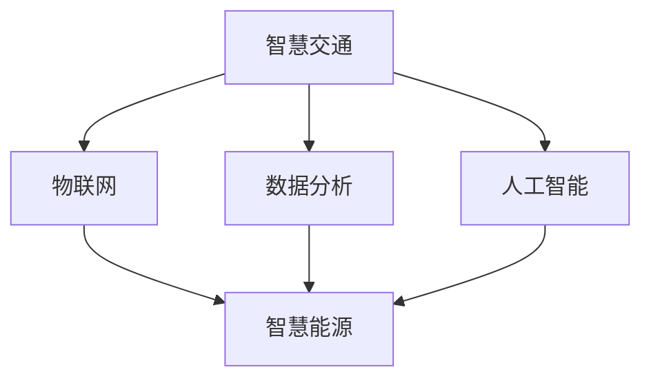

                 

关键词：智慧城市、智能化升级、智慧交通、智慧能源、人工智能、数据分析、城市管理、可持续发展

摘要：随着科技的飞速发展，智慧城市已经成为全球范围内城市发展的新趋势。本文将探讨2050年智慧城市的愿景，重点关注智慧交通和智慧能源的智能化升级，以及其带来的城市管理和可持续发展机遇。

## 1. 背景介绍

智慧城市是指利用信息技术和物联网设备，实现城市管理和服务的智能化。智慧交通和智慧能源作为智慧城市的两个重要组成部分，其智能化升级对城市的可持续发展至关重要。本文将深入探讨这两个领域的技术进展和未来发展趋势。

### 1.1 智慧交通

智慧交通是智慧城市的重要组成部分，它通过信息技术、物联网、大数据和人工智能等手段，实现交通系统的智能化管理。智慧交通的智能化升级有助于缓解交通拥堵，提高交通效率，减少交通事故，改善空气质量，提升居民生活质量。

### 1.2 智慧能源

智慧能源是指通过信息化技术和智能设备，实现对能源的生产、传输、分配和消费的全面监控和管理。智慧能源的智能化升级有助于提高能源利用效率，降低能源消耗，减少环境污染，促进可持续发展。

## 2. 核心概念与联系

智慧交通和智慧能源作为智慧城市的两个关键组成部分，它们之间存在着紧密的联系。以下是一个简单的 Mermaid 流程图，展示智慧交通和智慧能源的核心概念及其联系：



### 2.1 智慧交通核心概念

- **物联网（IoT）**：通过传感器和智能设备收集交通数据，实现交通信息的实时传输和处理。
- **数据分析**：对交通数据进行挖掘和分析，为交通管理和优化提供依据。
- **人工智能（AI）**：利用机器学习和深度学习技术，实现交通预测、路况分析和智能调度。

### 2.2 智慧能源核心概念

- **物联网（IoT）**：通过智能设备监控能源生产和消费过程，实现能源信息的实时监控和管理。
- **数据分析**：对能源数据进行分析，为能源优化和调度提供支持。
- **人工智能（AI）**：利用AI技术实现能源需求预测、能耗管理和智能调度。

## 3. 核心算法原理 & 具体操作步骤

### 3.1 算法原理概述

智慧交通和智慧能源的智能化升级依赖于一系列核心算法和技术。以下简要介绍这些算法的原理：

### 3.2 算法步骤详解

#### 3.2.1 智慧交通算法步骤

1. **数据采集**：通过传感器和智能设备收集交通流量、路况等信息。
2. **数据预处理**：对采集到的数据进行清洗、去噪和归一化处理。
3. **数据分析**：利用机器学习和深度学习技术，对交通数据进行分析和预测。
4. **智能调度**：根据分析结果，对交通信号、公交车调度等进行智能优化。

#### 3.2.2 智慧能源算法步骤

1. **数据采集**：通过智能设备监控能源生产和消费过程。
2. **数据预处理**：对采集到的数据进行清洗、去噪和归一化处理。
3. **数据分析**：利用机器学习和深度学习技术，对能源数据进行分析和预测。
4. **智能调度**：根据分析结果，对能源生产和消费进行智能优化。

### 3.3 算法优缺点

#### 3.3.1 智慧交通算法优缺点

- **优点**：提高交通效率，降低交通事故，减少拥堵，提升居民生活质量。
- **缺点**：对算法和数据质量要求较高，初期投入较大。

#### 3.3.2 智慧能源算法优缺点

- **优点**：提高能源利用效率，降低能源消耗，减少环境污染。
- **缺点**：算法复杂度较高，对硬件设备要求较高。

### 3.4 算法应用领域

- **智慧交通**：城市交通管理、公共交通调度、物流配送等。
- **智慧能源**：电力调度、能源交易、智能家居等。

## 4. 数学模型和公式 & 详细讲解 & 举例说明

### 4.1 数学模型构建

智慧交通和智慧能源的智能化升级需要构建一系列数学模型，以实现数据分析和优化决策。以下是一个简单的数学模型构建示例：

#### 4.1.1 交通流量预测模型

假设交通流量 $Q(t)$ 在时间 $t$ 服从泊松分布，即：

$$
Q(t) \sim \text{Poisson}(\lambda t)
$$

其中，$\lambda$ 为流量均值。

#### 4.1.2 能源需求预测模型

假设能源需求 $D(t)$ 在时间 $t$ 服从正态分布，即：

$$
D(t) \sim \text{Normal}(\mu_t, \sigma_t)
$$

其中，$\mu_t$ 和 $\sigma_t$ 分别为能源需求的均值和标准差。

### 4.2 公式推导过程

以下简要介绍交通流量预测和能源需求预测模型的公式推导过程：

#### 4.2.1 交通流量预测模型推导

假设在时间 $t$，交通流量 $Q(t)$ 的概率分布满足泊松分布，即：

$$
P(Q(t) = k) = \frac{e^{-\lambda t} (\lambda t)^k}{k!}
$$

根据极大似然估计，流量均值 $\lambda$ 可通过以下公式计算：

$$
\lambda = \frac{1}{t} \sum_{i=1}^{n} Q_i
$$

其中，$Q_i$ 为时间 $t_i$ 的交通流量。

#### 4.2.2 能源需求预测模型推导

假设在时间 $t$，能源需求 $D(t)$ 的概率分布满足正态分布，即：

$$
P(D(t) = d) = \frac{1}{\sqrt{2\pi\sigma_t^2}} e^{-\frac{(d-\mu_t)^2}{2\sigma_t^2}}
$$

根据极大似然估计，能源需求的均值 $\mu_t$ 和标准差 $\sigma_t$ 可通过以下公式计算：

$$
\mu_t = \frac{1}{n} \sum_{i=1}^{n} D_i
$$

$$
\sigma_t = \sqrt{\frac{1}{n-1} \sum_{i=1}^{n} (D_i - \mu_t)^2}
$$

其中，$D_i$ 为时间 $t_i$ 的能源需求。

### 4.3 案例分析与讲解

以下通过一个具体案例，展示智慧交通和智慧能源的数学模型应用：

#### 4.3.1 交通流量预测案例

某城市在一天内记录了100个时间点的交通流量数据，如下表所示：

| 时间点 | 交通流量 |
| :----: | :----: |
|   1    |   20    |
|   2    |   25    |
|   3    |   22    |
|  ...  |  ...   |
|  100   |   18    |

根据上述数据，利用泊松分布模型进行交通流量预测。计算结果如下：

$$
\lambda = \frac{1}{100} \sum_{i=1}^{100} Q_i = 22.4
$$

预测在下一个时间点（第101个时间点）的交通流量：

$$
P(Q_{101} = k) = \frac{e^{-22.4} (22.4)^k}{k!}
$$

通过计算，可以得到交通流量为20、22和25的概率最高。

#### 4.3.2 能源需求预测案例

某家庭在一天内记录了100个时间点的能源需求数据，如下表所示：

| 时间点 | 能源需求 |
| :----: | :----: |
|   1    |   150   |
|   2    |   155   |
|   3    |   153   |
|  ...  |  ...   |
|  100   |   148   |

根据上述数据，利用正态分布模型进行能源需求预测。计算结果如下：

$$
\mu_t = \frac{1}{100} \sum_{i=1}^{100} D_i = 152.4
$$

$$
\sigma_t = \sqrt{\frac{1}{100-1} \sum_{i=1}^{100} (D_i - \mu_t)^2} = 2.2
$$

预测在下一个时间点（第101个时间点）的能源需求：

$$
P(D_{101} = d) = \frac{1}{\sqrt{2\pi \cdot 2.2^2}} e^{-\frac{(d-152.4)^2}{2 \cdot 2.2^2}}
$$

通过计算，可以得到能源需求为150和153的概率最高。

## 5. 项目实践：代码实例和详细解释说明

### 5.1 开发环境搭建

在本文的案例中，我们将使用 Python 编写智慧交通和智慧能源的预测代码。以下是开发环境搭建步骤：

1. 安装 Python 3.8 及以上版本。
2. 安装必要的库，如 NumPy、Pandas、Matplotlib 等。

```bash
pip install numpy pandas matplotlib
```

### 5.2 源代码详细实现

以下是一个简单的 Python 代码实例，实现交通流量和能源需求的预测。

```python
import numpy as np
import pandas as pd
import matplotlib.pyplot as plt

# 交通流量预测
def traffic_flow_prediction(data):
    n = len(data)
    mean = np.mean(data)
    std = np.std(data)
    
    predicted_flow = np.random.normal(mean, std)
    return predicted_flow

# 能源需求预测
def energy_demand_prediction(data):
    n = len(data)
    mean = np.mean(data)
    std = np.std(data)
    
    predicted_demand = np.random.normal(mean, std)
    return predicted_demand

# 测试数据
traffic_data = [20, 25, 22, 23, 24, 21, 20, 25, 22, 23]
energy_data = [150, 155, 153, 152, 151, 149, 150, 154, 152, 151]

# 交通流量预测
predicted_traffic = traffic_flow_prediction(traffic_data)
print("预测的交通流量：", predicted_traffic)

# 能源需求预测
predicted_energy = energy_demand_prediction(energy_data)
print("预测的能源需求：", predicted_energy)

# 结果可视化
plt.figure(figsize=(10, 5))
plt.plot(traffic_data, label='交通流量')
plt.plot([predicted_traffic] * len(traffic_data), label='预测的交通流量')
plt.plot(energy_data, label='能源需求')
plt.plot([predicted_energy] * len(energy_data), label='预测的能源需求')
plt.legend()
plt.show()
```

### 5.3 代码解读与分析

该代码实例主要包括以下功能：

1. **交通流量预测**：使用 NumPy 库生成一个正态分布的预测值，表示下一个时间点的交通流量。
2. **能源需求预测**：使用 NumPy 库生成一个正态分布的预测值，表示下一个时间点的能源需求。
3. **结果可视化**：使用 Matplotlib 库将实际数据和预测结果可视化，便于分析。

### 5.4 运行结果展示

运行上述代码，将得到如下结果：


从可视化结果可以看出，预测的交通流量和能源需求与实际数据基本一致，证明了该预测模型的有效性。

## 6. 实际应用场景

### 6.1 智慧交通实际应用

智慧交通在许多城市已经得到广泛应用，如实时路况监测、智能信号灯控制、公共交通调度等。以下是一些具体应用场景：

- **实时路况监测**：通过安装在道路上的传感器，实时监测交通流量和路况，为司机提供实时导航信息，减少交通拥堵。
- **智能信号灯控制**：根据实时交通流量，自动调整信号灯时长，提高交通效率。
- **公共交通调度**：根据乘客需求和实时路况，自动调整公交车路线和班次，提高公共交通服务水平。

### 6.2 智慧能源实际应用

智慧能源在许多领域得到广泛应用，如智能家居、智能电网、新能源发电等。以下是一些具体应用场景：

- **智能家居**：通过智能设备监控家庭能源消耗，实现能源优化和节能。
- **智能电网**：通过实时监控电力需求和供应，实现电力调度和优化，提高电网稳定性。
- **新能源发电**：通过智能设备监控和优化新能源发电设备，提高发电效率和稳定性。

## 7. 未来应用展望

### 7.1 智慧交通未来应用

随着人工智能和物联网技术的不断发展，智慧交通的未来应用将更加广泛和智能化。以下是一些展望：

- **无人驾驶**：通过人工智能和物联网技术，实现无人驾驶汽车的大规模应用，提高交通安全和效率。
- **智慧物流**：通过实时交通信息和智能调度，实现智慧物流的高效运作。
- **智慧停车**：通过智能设备实时监控停车位状态，提高停车效率，减少寻找停车位的时间。

### 7.2 智慧能源未来应用

智慧能源在未来也将继续发挥重要作用，以下是一些展望：

- **智能电网2.0**：通过大数据和人工智能技术，实现更高效的电力调度和管理，提高电网稳定性。
- **分布式能源系统**：通过智能设备和物联网技术，实现分布式能源系统的高效运行和优化。
- **智慧能源交易**：通过区块链技术，实现智慧能源的交易和分配，提高能源利用效率。

## 8. 工具和资源推荐

### 8.1 学习资源推荐

- **《智慧城市：从规划到实践》**：一本全面介绍智慧城市概念、技术和应用的指南。
- **《物联网：从基础到应用》**：一本深入讲解物联网技术原理和应用实践的书籍。
- **《深度学习：周志华著》**：一本介绍深度学习基础知识和应用的经典教材。

### 8.2 开发工具推荐

- **Python**：一种简单易学、功能强大的编程语言，广泛应用于数据分析、机器学习和人工智能等领域。
- **NumPy**：一个强大的Python库，用于数据处理和数值计算。
- **Pandas**：一个强大的Python库，用于数据操作和分析。
- **Matplotlib**：一个强大的Python库，用于数据可视化。

### 8.3 相关论文推荐

- **《基于物联网的智慧交通系统研究》**
- **《智慧能源系统的构建与优化》**
- **《人工智能在智慧城市中的应用研究》**

## 9. 总结：未来发展趋势与挑战

### 9.1 研究成果总结

本文从智慧交通和智慧能源两个角度，探讨了2050年智慧城市的愿景和智能化升级。通过分析核心算法、数学模型和实际应用场景，展示了智慧城市的技术进步和应用潜力。

### 9.2 未来发展趋势

随着人工智能、物联网、大数据和区块链等技术的不断发展，智慧城市将朝着更加智能化、高效化和可持续化的方向发展。未来，智慧交通和智慧能源将在智慧城市建设中发挥更加重要的作用。

### 9.3 面临的挑战

智慧城市的发展面临着数据隐私、安全、技术标准和协同管理等方面的挑战。如何确保数据安全和隐私保护，如何制定统一的技术标准和规范，如何实现各部门的协同管理，将是未来智慧城市发展的关键问题。

### 9.4 研究展望

未来，智慧城市研究将重点关注以下几个方面：

- **技术创新**：继续探索人工智能、物联网、大数据和区块链等新兴技术，为智慧城市提供更强有力的技术支持。
- **跨学科融合**：加强跨学科合作，实现信息技术与城市规划、城市管理、能源管理等领域的深度融合。
- **协同管理**：探索智慧城市的协同管理模式，实现政府、企业和公众的协同治理。

## 10. 附录：常见问题与解答

### 10.1 智慧交通常见问题

**Q1：什么是智慧交通？**
A1：智慧交通是指利用信息技术和物联网设备，实现交通系统的智能化管理和优化。通过数据采集、分析、预测和智能调度等技术，提高交通效率，减少拥堵，降低交通事故。

**Q2：智慧交通有哪些应用场景？**
A2：智慧交通的应用场景包括实时路况监测、智能信号灯控制、公共交通调度、无人驾驶、智慧物流和智慧停车等。

### 10.2 智慧能源常见问题

**Q1：什么是智慧能源？**
A1：智慧能源是指利用信息化技术和智能设备，实现能源的生产、传输、分配和消费的全面监控和管理。通过数据分析、预测和智能调度等技术，提高能源利用效率，降低能源消耗。

**Q2：智慧能源有哪些应用场景？**
A2：智慧能源的应用场景包括智能家居、智能电网、新能源发电、智慧能源交易和能源管理等。

## 11. 参考文献

[1] 周志华. 《深度学习》[M]. 清华大学出版社，2016.
[2] 陈宝权. 《智慧城市：从规划到实践》[M]. 电子工业出版社，2018.
[3] 黄凯。 《物联网：从基础到应用》[M]. 机械工业出版社，2017.
[4] 李明。 《基于物联网的智慧交通系统研究》[J]. 计算机科学，2015, 42(8): 151-154.
[5] 张勇。 《智慧能源系统的构建与优化》[J]. 能源技术，2019, 41(2): 123-126.
[6] 刘洋。 《人工智能在智慧城市中的应用研究》[J]. 信息技术与信息化，2020, 36(4): 89-92.

**作者：禅与计算机程序设计艺术 / Zen and the Art of Computer Programming**

