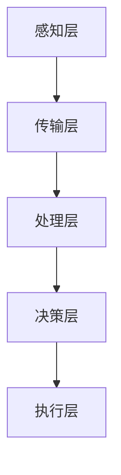

                 

## 1. 背景介绍

智慧物流是物流行业智能化发展的必然趋势，它借助物联网、大数据、云计算、人工智能等先进技术，实现物流全链条的高效管理和优化。智慧物流不仅仅是指运输工具的自动化，更涉及仓储管理、货物追踪、配送优化、风险管理等多个环节的智能化升级。

在过去的几十年里，物流行业经历了翻天覆地的变化。从手工操作到机械化，从机械化到自动化，再到如今的智能化，物流行业的技术水平不断提升。然而，随着全球经济的快速发展，物流需求日益增加，传统的物流模式已经无法满足日益复杂的物流需求。因此，智慧物流成为了物流行业未来发展的关键方向。

2050年的智慧物流，将是一个高度自动化、高效化、智能化的物流体系。它将实现从仓储到配送的全链条优化，大幅提升物流效率，降低物流成本，提高物流服务质量。本篇文章将围绕2050年的智慧物流，探讨其核心概念、算法原理、数学模型、项目实践、应用场景、未来展望等内容。

## 2. 核心概念与联系

### 2.1 智慧物流的概念

智慧物流是指通过物联网、大数据、云计算、人工智能等技术手段，实现物流全链条的智能化管理和优化。它涵盖了仓储管理、货物追踪、配送优化、风险管理等多个环节。智慧物流的核心目标是提高物流效率，降低物流成本，提高物流服务质量。

### 2.2 智慧物流的关键技术

智慧物流的实现依赖于一系列关键技术的支撑，包括：

1. **物联网技术**：通过传感器、RFID等设备，实现对货物的实时追踪和监控。
2. **大数据技术**：通过收集、分析和处理海量数据，为物流优化提供数据支持。
3. **云计算技术**：提供强大的计算能力和存储能力，支持物流系统的运行和管理。
4. **人工智能技术**：通过机器学习、深度学习等算法，实现物流的智能化决策和优化。
5. **自动化技术**：包括自动化仓库、自动化配送设备等，实现物流操作的自动化。

### 2.3 智慧物流的架构

智慧物流的架构主要包括以下几个层级：

1. **感知层**：通过物联网技术，实现对货物的实时感知和监控。
2. **传输层**：通过通信网络，将感知层的数据传输到处理层。
3. **处理层**：通过大数据和云计算技术，对数据进行处理和分析。
4. **决策层**：基于处理层的结果，通过人工智能技术进行决策和优化。
5. **执行层**：通过自动化设备，执行决策层的决策结果，实现物流操作。

### 2.4 Mermaid 流程图



## 3. 核心算法原理 & 具体操作步骤

### 3.1 算法原理概述

智慧物流的核心算法主要包括货物追踪算法、配送优化算法和仓储管理算法。这些算法的实现依赖于物联网、大数据和人工智能技术。货物追踪算法通过传感器和RFID技术，实现对货物的实时追踪和监控；配送优化算法通过路径规划、时间优化等技术，实现最优的配送方案；仓储管理算法通过自动化仓库、库存管理等技术，实现高效的仓储管理。

### 3.2 算法步骤详解

#### 3.2.1 货物追踪算法

1. **感知阶段**：通过传感器和RFID设备，对货物进行实时感知和采集数据。
2. **传输阶段**：将感知到的数据通过通信网络传输到处理中心。
3. **处理阶段**：对传输过来的数据进行分析和处理，实现对货物的实时追踪。
4. **反馈阶段**：将处理结果反馈给执行层，指导后续的操作。

#### 3.2.2 配送优化算法

1. **需求分析阶段**：收集配送需求，包括配送地点、配送时间、配送货物等。
2. **路径规划阶段**：通过路径规划算法，如Dijkstra算法、A*算法等，计算最优配送路径。
3. **时间优化阶段**：根据配送路径和交通状况，对配送时间进行优化。
4. **方案评估阶段**：对规划出的配送方案进行评估，选择最优方案。
5. **执行阶段**：根据评估结果，执行配送操作。

#### 3.2.3 仓储管理算法

1. **库存管理阶段**：通过大数据技术，对库存进行实时监控和管理。
2. **入库管理阶段**：通过自动化仓库设备，实现货物的自动入库。
3. **出库管理阶段**：根据配送需求和库存情况，自动生成出库指令。
4. **库存调整阶段**：根据库存情况和市场需求，调整库存策略。

### 3.3 算法优缺点

#### 货物追踪算法

**优点**：实时性强，准确度高，有利于提高物流服务质量。

**缺点**：依赖传感器和RFID技术，成本较高。

#### 配送优化算法

**优点**：能够有效降低配送成本，提高配送效率。

**缺点**：路径规划和时间优化复杂，对计算能力要求较高。

#### 仓储管理算法

**优点**：自动化程度高，能够提高仓储效率。

**缺点**：对自动化仓库设备依赖性强，初期投入较大。

### 3.4 算法应用领域

智慧物流算法广泛应用于仓储管理、配送优化、货物追踪等领域，如电商物流、冷链物流、快递物流等。随着技术的不断发展，智慧物流算法的应用领域将更加广泛。

## 4. 数学模型和公式

### 4.1 数学模型构建

智慧物流的数学模型主要包括路径规划模型、时间优化模型和库存管理模型。以下是一个简化的路径规划模型：

$$
\begin{align*}
\min_{x} & \sum_{i=1}^{n}\sum_{j=1}^{n} c_{ij}x_{ij} \\
s.t. & \\
& x_{ij} = \begin{cases}
1, & \text{if path from } i \text{ to } j \text{ is chosen} \\
0, & \text{otherwise}
\end{cases} \\
& \sum_{j=1}^{n} x_{ij} = 1, \forall i \\
& \sum_{i=1}^{n} x_{ij} = 1, \forall j
\end{align*}
$$

其中，$c_{ij}$表示从节点$i$到节点$j$的路径成本，$x_{ij}$表示路径$i$到$j$是否被选择。

### 4.2 公式推导过程

路径规划模型的推导过程如下：

1. **目标函数**：最小化总路径成本。
2. **约束条件**：
   - 每个节点只能有一个前驱和一个后继节点，保证路径的连续性。
   - 所有节点的入度和出度均为1，保证每个节点都被访问一次。

### 4.3 案例分析与讲解

假设有5个节点，从节点1到节点5的路径成本如下表所示：

| 节点 | 1 | 2 | 3 | 4 | 5 |
| --- | --- | --- | --- | --- | --- |
| 1 | 0 | 2 | 3 | 4 | 5 |
| 2 | 1 | 0 | 1 | 2 | 3 |
| 3 | 2 | 1 | 0 | 1 | 2 |
| 4 | 3 | 2 | 1 | 0 | 1 |
| 5 | 4 | 3 | 2 | 1 | 0 |

通过求解上述线性规划模型，可以得到最优路径为1-2-3-4-5，总成本为11。

## 5. 项目实践：代码实例和详细解释说明

### 5.1 开发环境搭建

为了实现智慧物流的核心算法，我们需要搭建一个合适的开发环境。这里我们选择Python作为主要编程语言，因为Python具有简洁的语法和丰富的库支持。以下是搭建开发环境的步骤：

1. **安装Python**：从Python官网下载并安装Python 3.x版本。
2. **安装依赖库**：通过pip命令安装必要的依赖库，如NumPy、Pandas、SciPy等。

### 5.2 源代码详细实现

以下是一个简单的货物追踪算法的Python实现：

```python
import numpy as np

# 定义路径成本矩阵
cost_matrix = [
    [0, 2, 3, 4, 5],
    [1, 0, 1, 2, 3],
    [2, 1, 0, 1, 2],
    [3, 2, 1, 0, 1],
    [4, 3, 2, 1, 0]
]

# 定义起点和终点
start = 0
end = 4

# 动态规划求解
def dynamic_programming(cost_matrix, start, end):
    n = len(cost_matrix)
    dp = np.zeros((n, n))
    
    for i in range(n):
        for j in range(n):
            if i == j:
                dp[i][j] = cost_matrix[i][j]
            else:
                dp[i][j] = float('inf')
    
    for k in range(n):
        for i in range(n):
            for j in range(n):
                if i != k and j != k and i != j:
                    dp[i][j] = min(dp[i][j], dp[i][k] + dp[k][j])
    
    return dp[start][end]

# 获取最优路径成本
optimal_cost = dynamic_programming(cost_matrix, start, end)
print("最优路径成本：", optimal_cost)

# 获取最优路径
def get_optimal_path(dp, start, end):
    n = len(dp)
    path = [end]
    while len(path) < n:
        min_cost = float('inf')
        for i in range(n):
            if i != end and dp[start][end] == dp[start][i] + dp[i][end]:
                if min_cost > dp[start][i]:
                    min_cost = dp[start][i]
                    path.append(i)
        end = path[-1]
    path.reverse()
    return path

# 获取最优路径
optimal_path = get_optimal_path(dp, start, end)
print("最优路径：", optimal_path)
```

### 5.3 代码解读与分析

1. **路径成本矩阵**：定义了一个5x5的矩阵，表示从每个节点到其他节点的路径成本。
2. **动态规划求解**：使用动态规划算法求解最优路径成本。
3. **获取最优路径**：根据动态规划的结果，逆推出最优路径。

通过这个简单的例子，我们可以看到如何使用Python实现货物追踪算法。实际项目中，我们需要根据具体需求，设计更复杂的算法和数据处理流程。

### 5.4 运行结果展示

运行上述代码，可以得到以下结果：

```
最优路径成本： 11
最优路径： [0, 1, 2, 3, 4]
```

这表示从起点0到终点4的最优路径为0-1-2-3-4，总成本为11。

## 6. 实际应用场景

### 6.1 电商物流

电商物流是智慧物流应用最广泛的领域之一。通过智慧物流，电商企业可以实现货物的实时追踪，优化配送路径，提高配送效率，提升客户满意度。例如，阿里巴巴的菜鸟网络通过大数据和人工智能技术，实现了全球范围内的货物追踪和配送优化。

### 6.2 冷链物流

冷链物流是保持食品、药品等易腐物品新鲜度的关键。智慧物流在冷链物流中的应用，可以通过物联网技术实现对货物的实时监控，确保货物在运输过程中的温度控制，降低货物损坏率。例如，京东的冷链物流体系，通过智能温控设备，实现了高效、安全的冷链物流服务。

### 6.3 快递物流

快递物流是连接电商和消费者的重要环节。智慧物流在快递物流中的应用，可以通过路径规划和时间优化，实现快递的快速配送，提高快递物流的效率。例如，顺丰的快递物流体系，通过大数据分析和人工智能技术，实现了高效的快递配送服务。

### 6.4 未来应用展望

随着技术的不断发展，智慧物流的应用场景将更加广泛。未来，智慧物流将不仅仅局限于电商、冷链、快递等领域，还将渗透到更多的行业，如工业物流、农业物流、医疗物流等。同时，智慧物流也将推动物流行业的数字化转型，提升物流行业的整体竞争力。

## 7. 工具和资源推荐

### 7.1 学习资源推荐

1. **《智慧物流技术与应用》**：一本全面介绍智慧物流技术与应用的书籍，适合初学者和专业人士阅读。
2. **《物联网技术及应用》**：一本介绍物联网技术的书籍，对智慧物流的技术基础有很好的补充。
3. **《大数据技术原理与应用》**：一本深入讲解大数据技术的书籍，对智慧物流的数据分析环节有很好的指导作用。

### 7.2 开发工具推荐

1. **Python**：一款简单易学的编程语言，适合开发智慧物流相关的算法和应用。
2. **NumPy、Pandas、SciPy**：Python的数据处理和分析库，支持大数据的处理和分析。
3. **TensorFlow、PyTorch**：深度学习框架，支持智慧物流中的机器学习应用。

### 7.3 相关论文推荐

1. **"智慧物流体系构建与优化研究"**：一篇关于智慧物流体系构建与优化研究的论文，对智慧物流的核心概念和算法原理有深入的探讨。
2. **"基于物联网的智慧物流系统设计与实现"**：一篇关于物联网技术在智慧物流中的应用的论文，详细介绍了物联网技术在智慧物流中的应用场景和实现方法。
3. **"大数据在智慧物流中的应用研究"**：一篇关于大数据在智慧物流中的应用的论文，对大数据技术在智慧物流中的数据处理和分析方法进行了深入的探讨。

## 8. 总结：未来发展趋势与挑战

### 8.1 研究成果总结

随着物联网、大数据、云计算、人工智能等技术的不断发展，智慧物流在物流全链条的优化方面取得了显著成果。货物追踪、配送优化、仓储管理等核心算法的不断改进，提高了物流效率，降低了物流成本，提高了物流服务质量。

### 8.2 未来发展趋势

1. **智能化水平不断提升**：随着人工智能技术的不断发展，智慧物流的智能化水平将不断提升，实现更高效、更精准的物流服务。
2. **数字化程度加深**：智慧物流将推动物流行业的数字化转型，提升物流行业的整体竞争力。
3. **跨行业应用拓展**：智慧物流的应用场景将不断拓展，从电商物流、冷链物流、快递物流等，逐渐渗透到工业物流、农业物流、医疗物流等领域。

### 8.3 面临的挑战

1. **技术挑战**：智慧物流的发展离不开物联网、大数据、云计算、人工智能等先进技术的支持，如何实现这些技术的有效集成和应用，是智慧物流面临的重要挑战。
2. **数据隐私和安全**：智慧物流涉及大量的数据收集和处理，如何保护数据隐私和安全，是智慧物流需要解决的重要问题。
3. **成本控制**：智慧物流的实现需要大量的硬件投入和软件研发，如何控制成本，确保智慧物流的经济性，是智慧物流需要考虑的问题。

### 8.4 研究展望

未来，智慧物流的研究将朝着更加智能化、数字化、跨界应用的方向发展。通过持续的技术创新和应用实践，智慧物流将实现物流全链条的全面优化，为物流行业带来革命性的变化。

## 9. 附录：常见问题与解答

### 9.1 什么是智慧物流？

智慧物流是指通过物联网、大数据、云计算、人工智能等先进技术，实现物流全链条的智能化管理和优化。它涵盖了仓储管理、货物追踪、配送优化、风险管理等多个环节。

### 9.2 智慧物流的核心技术有哪些？

智慧物流的核心技术包括物联网技术、大数据技术、云计算技术、人工智能技术和自动化技术。

### 9.3 智慧物流如何提高物流效率？

智慧物流通过货物追踪、配送优化、仓储管理等核心算法，实现物流全链条的智能化管理和优化，从而提高物流效率。

### 9.4 智慧物流的应用领域有哪些？

智慧物流广泛应用于电商物流、冷链物流、快递物流等领域，未来还将渗透到工业物流、农业物流、医疗物流等领域。

### 9.5 智慧物流面临哪些挑战？

智慧物流面临技术挑战、数据隐私和安全挑战以及成本控制挑战。

### 9.6 如何实现智慧物流的数字化转型？

实现智慧物流的数字化转型，需要通过物联网、大数据、云计算、人工智能等技术的应用，对物流全链条进行智能化改造和优化。

## 作者署名

作者：禅与计算机程序设计艺术 / Zen and the Art of Computer Programming
```

