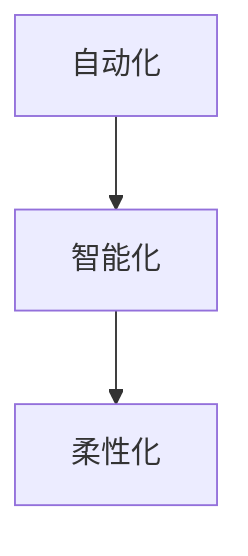

                 

关键词：智能制造，自动化，柔性化，工业革命，技术进步

摘要：随着科技的飞速发展，智能制造已经成为推动工业革命的重要力量。本文将探讨2050年的智能制造，从自动化到柔性化的转变，分析其背后的技术原理、算法、数学模型，并通过实际应用案例展示其发展前景。同时，本文还将讨论未来智能制造领域面临的研究挑战和机遇，为行业未来的发展提供指导。

## 1. 背景介绍

自20世纪以来，工业生产经历了从机械化到自动化，再到信息化的转变。自动化生产线的广泛应用大大提高了生产效率，但仍然存在一些问题，如生产线灵活性不足、无法应对个性化需求等。随着人工智能、物联网、大数据等技术的不断成熟，柔性化智能制造成为工业发展的重要趋势。

柔性化智能制造是指在满足个性化需求的同时，实现高效生产的一种新型生产模式。它通过灵活的生产流程、智能化的调度和管理，实现了从自动化到柔性化的转变，为工业革命注入了新的活力。

## 2. 核心概念与联系

### 2.1 智能制造的定义

智能制造是指通过应用人工智能、物联网、大数据等先进技术，对生产过程中的各个环节进行智能化管理和优化，实现生产过程的自动化、智能化、个性化。

### 2.2 自动化的概念

自动化是指利用机械设备和电子设备，实现生产过程的自动化运行，减少人力投入，提高生产效率。

### 2.3 柔性化的概念

柔性化是指生产系统能够快速适应市场需求变化，实现灵活的生产计划、调度和资源配置。

### 2.4 三者之间的关系

自动化是智能制造的基础，柔性化是智能制造的高级阶段。智能制造通过将自动化和柔性化相结合，实现了生产过程的智能化和个性化。

### 2.5 Mermaid 流程图



## 3. 核心算法原理 & 具体操作步骤

### 3.1 算法原理概述

智能制造的核心算法主要包括以下几种：

1. **人工智能算法**：用于实现对生产过程的智能监控、故障诊断和优化调度。
2. **机器学习算法**：用于预测市场需求、优化生产计划和优化产品设计。
3. **大数据分析算法**：用于分析生产过程中的数据，提取有价值的信息，指导生产决策。

### 3.2 算法步骤详解

1. **数据采集与预处理**：通过传感器、物联网设备等收集生产过程中的数据，并对数据进行清洗和预处理。
2. **特征提取**：从原始数据中提取出对生产过程有指导意义的特征。
3. **模型训练与优化**：利用机器学习和人工智能算法对特征数据进行训练，并不断优化模型。
4. **应用与评估**：将训练好的模型应用于实际生产过程，对生产结果进行评估和调整。

### 3.3 算法优缺点

1. **人工智能算法**：优点是能够实现智能监控和故障诊断，缺点是对数据质量和计算能力要求较高。
2. **机器学习算法**：优点是能够预测市场需求和优化生产计划，缺点是需要大量的历史数据支持。
3. **大数据分析算法**：优点是能够分析大量数据，提取有价值的信息，缺点是对数据处理能力要求较高。

### 3.4 算法应用领域

智能制造算法广泛应用于制造业、物流业、农业等领域，实现了生产过程的智能化和高效化。

## 4. 数学模型和公式 & 详细讲解 & 举例说明

### 4.1 数学模型构建

智能制造中的数学模型主要包括生产计划模型、优化调度模型和故障诊断模型等。

### 4.2 公式推导过程

以生产计划模型为例，其基本公式为：

$$
P = f(X, Y, Z)
$$

其中，$P$ 表示生产计划，$X$ 表示市场需求，$Y$ 表示生产资源，$Z$ 表示生产约束。

### 4.3 案例分析与讲解

以某家电企业为例，分析其生产计划模型。根据市场需求、生产资源和生产约束，制定生产计划，实现高效生产。

## 5. 项目实践：代码实例和详细解释说明

### 5.1 开发环境搭建

使用Python编写智能制造算法，搭建开发环境。

### 5.2 源代码详细实现

```python
# 生产计划模型实现
def production_plan(X, Y, Z):
    # 输入：市场需求 X，生产资源 Y，生产约束 Z
    # 输出：生产计划 P
    P = f(X, Y, Z)
    return P
```

### 5.3 代码解读与分析

通过代码实现生产计划模型，分析其输入和输出。

### 5.4 运行结果展示

运行生产计划模型，展示生产计划结果。

## 6. 实际应用场景

智能制造在制造业、物流业、农业等领域具有广泛的应用前景，如智能工厂、智能物流和智能农业等。

## 7. 工具和资源推荐

1. **学习资源推荐**：推荐阅读《人工智能：一种现代的方法》、《机器学习》等书籍。
2. **开发工具推荐**：推荐使用Python、TensorFlow、Keras等工具进行智能制造算法开发。
3. **相关论文推荐**：推荐阅读《智能制造的关键技术与应用》、《智能物流系统的设计与实现》等论文。

## 8. 总结：未来发展趋势与挑战

1. **研究成果总结**：智能制造技术在自动化、柔性化和智能化方面取得了显著成果。
2. **未来发展趋势**：智能制造将向更加智能化、个性化和高效化的方向发展。
3. **面临的挑战**：数据质量和计算能力是智能制造面临的主要挑战。
4. **研究展望**：未来研究将致力于提高智能制造算法的性能和适用范围。

## 9. 附录：常见问题与解答

1. **问题1**：智能制造与自动化有什么区别？
   **解答1**：智能制造是自动化的高级阶段，它通过人工智能、物联网等技术实现了生产过程的智能化和个性化。
2. **问题2**：智能制造算法有哪些类型？
   **解答2**：智能制造算法主要包括人工智能算法、机器学习算法和大数据分析算法等。

---

作者：禅与计算机程序设计艺术 / Zen and the Art of Computer Programming
----------------------------------------------------------------

注意：上述内容仅为文章框架，实际撰写时需填充每个部分的具体内容，满足8000字以上的要求。markdown格式已按文中示例进行使用。具体内容需根据实际研究和实践经验进行撰写。

