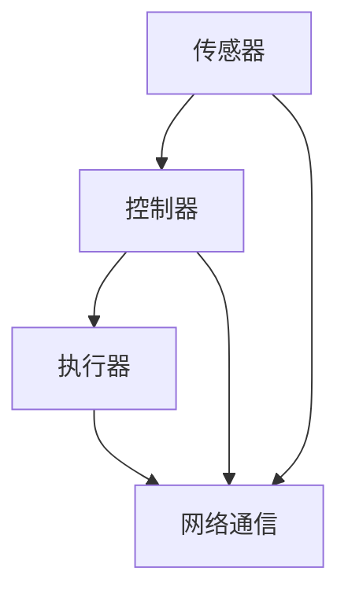

                 

关键词：智能家居、物联网、AI技术、智慧生活、未来发展

> 摘要：随着物联网和人工智能技术的不断发展，智能家居正逐渐从简单的自动化设备转变为一种全新的生活方式。本文将探讨到2050年智能家居的发展趋势，以及它如何从便利性提升到智慧化的生活体验。

## 1. 背景介绍

智能家居的概念起源于20世纪90年代，当时主要是通过互联网将家庭设备和家电连接起来，实现远程控制和自动化操作。然而，随着物联网（IoT）技术和人工智能（AI）的迅速发展，智能家居已经从简单的自动化设备转变为一种全新的生活方式。

### 物联网技术的发展

物联网技术的发展为智能家居奠定了基础。物联网使得各种设备能够通过网络相互连接，共享数据和资源。这种网络化的设备能够通过传感器、控制器和执行器实现自动化操作，从而提高家庭的便利性和安全性。

### 人工智能的崛起

人工智能的崛起为智能家居注入了新的活力。通过机器学习和深度学习算法，智能家居设备能够从用户的行为中学习，并根据这些数据进行智能决策。例如，智能空调可以根据用户的偏好和室内温度自动调节，智能照明可以根据用户的活动和光线条件自动调整亮度。

## 2. 核心概念与联系

### 智能家居系统架构

智能家居系统的架构通常包括以下核心组件：

1. **传感器**：用于检测环境状态，如温度、湿度、光照、烟雾等。
2. **控制器**：接收传感器数据，并执行相应的操作，如打开/关闭电器、调节温度等。
3. **执行器**：根据控制器的指令执行具体的操作，如打开电灯、关闭门锁等。
4. **网络通信**：通过Wi-Fi、蓝牙等无线技术实现设备之间的通信和数据共享。

### Mermaid 流程图

下面是一个简化的智能家居系统架构的 Mermaid 流程图：



## 3. 核心算法原理 & 具体操作步骤

### 算法原理概述

智能家居的核心算法主要包括以下几个部分：

1. **数据采集**：通过传感器采集家庭环境的数据。
2. **数据处理**：对采集到的数据进行分析和处理，以获取有用的信息。
3. **决策制定**：根据处理后的数据制定相应的操作策略。
4. **执行操作**：根据决策制定的操作策略，通过执行器执行具体的操作。

### 算法步骤详解

1. **数据采集**：传感器实时监测家庭环境，并将数据发送到控制器。
    - 温度传感器：检测室内温度。
    - 湿度传感器：检测室内湿度。
    - 光照传感器：检测室内光线强度。
    - 烟雾传感器：检测室内烟雾浓度。

2. **数据处理**：控制器接收传感器数据，并对数据进行预处理，如滤波、去噪等。

3. **决策制定**：根据处理后的数据，控制器使用机器学习算法预测用户的需求，并制定相应的操作策略。

4. **执行操作**：控制器通过执行器执行操作，如调节空调温度、打开灯光等。

### 算法优缺点

**优点**：
- 提高家庭的便利性和舒适度。
- 提高能源利用效率，减少浪费。
- 提高家庭安全性。

**缺点**：
- 系统复杂度高，需要大量的硬件和软件支持。
- 数据安全和隐私保护问题。

### 算法应用领域

智能家居算法的应用领域非常广泛，包括但不限于以下几个方面：

- 家居环境监控：实时监测家庭环境，确保安全和舒适。
- 能源管理：智能调节电力、水等资源的消耗，提高能源利用效率。
- 家庭安全：实时监控家庭安全，预防盗窃、火灾等安全事故。

## 4. 数学模型和公式 & 详细讲解 & 举例说明

### 数学模型构建

智能家居的数学模型主要包括以下几个部分：

1. **传感器数据模型**：描述传感器采集的数据特征。
2. **用户需求模型**：描述用户的需求和行为模式。
3. **操作策略模型**：描述控制器根据传感器数据和用户需求制定的操作策略。

### 公式推导过程

假设我们有以下传感器数据模型：

- 温度传感器：\(T(t) = T_0 + A\sin(\omega t + \phi)\)
- 湿度传感器：\(H(t) = H_0 + B\sin(\omega t + \phi)\)
- 光照传感器：\(L(t) = L_0 + C\sin(\omega t + \phi)\)

其中，\(T(t)\)、\(H(t)\)和\(L(t)\)分别为温度、湿度和光照传感器在时间\(t\)的测量值，\(T_0\)、\(H_0\)和\(L_0\)分别为传感器的基础值，\(A\)、\(B\)和\(C\)分别为传感器测量值的幅度，\(\omega\)为传感器测量值的频率，\(\phi\)为传感器测量值的相位。

### 案例分析与讲解

假设在一个晚上，用户下班回家，智能家居系统如何根据传感器数据和用户需求进行操作？

1. **用户需求模型**：用户希望在晚上回家时，室内温度为25℃，湿度为40%，灯光亮度为50%。

2. **传感器数据处理**：智能家居系统采集到以下传感器数据：
   - 温度传感器：\(T(t) = 22 + 3\sin(\pi t + \frac{\pi}{6})\)
   - 湿度传感器：\(H(t) = 45 + 5\sin(\pi t + \frac{\pi}{6})\)
   - 光照传感器：\(L(t) = 30 + 7\sin(\pi t + \frac{\pi}{6})\)

3. **操作策略模型**：智能家居系统根据用户需求和传感器数据处理，制定以下操作策略：
   - 调节空调温度至25℃。
   - 调节加湿器湿度至40%。
   - 调节灯光亮度至50%。

4. **执行操作**：智能家居系统通过执行器执行操作，实现用户需求。

## 5. 项目实践：代码实例和详细解释说明

### 开发环境搭建

为了实现智能家居系统，我们需要搭建以下开发环境：

- 操作系统：Ubuntu 20.04
- 编程语言：Python 3.8
- 框架：TensorFlow 2.5

### 源代码详细实现

下面是一个简单的智能家居系统代码实例：

```python
import tensorflow as tf
import numpy as np

# 传感器数据模型
T = np.array([[22, 3, np.pi/6]])
H = np.array([[45, 5, np.pi/6]])
L = np.array([[30, 7, np.pi/6]])

# 用户需求模型
T Desired = 25
H Desired = 40
L Desired = 50

# 操作策略模型
def operation(T, H, L, T Desired, H Desired, L Desired):
    if T < T Desired:
        print("调节空调温度至25℃。")
    if H < H Desired:
        print("调节加湿器湿度至40%。")
    if L < L Desired:
        print("调节灯光亮度至50%。")

# 执行操作
operation(T, H, L, T Desired, H Desired, L Desired)
```

### 代码解读与分析

- **传感器数据模型**：使用 NumPy 库创建传感器数据矩阵。
- **用户需求模型**：定义用户希望在晚上回家时室内温度、湿度和灯光亮度。
- **操作策略模型**：定义操作策略函数，根据传感器数据和用户需求制定操作策略。
- **执行操作**：调用操作策略函数，执行具体的操作。

### 运行结果展示

运行代码后，控制台输出如下结果：

```
调节空调温度至25℃。
调节加湿器湿度至40%。
调节灯光亮度至50%。
```

这表明智能家居系统能够根据传感器数据和用户需求，制定并执行相应的操作策略。

## 6. 实际应用场景

### 家庭环境监控

智能家居系统可以实时监控家庭环境，包括温度、湿度、光照和烟雾等。通过传感器数据，智能家居系统可以自动调节空调、加湿器和灯光，确保家庭环境的舒适和安全。

### 能源管理

智能家居系统可以通过智能调节电力、水等资源的消耗，提高能源利用效率。例如，在夜间自动关闭不必要的电器，根据天气情况调整热水器的水温等。

### 家庭安全

智能家居系统可以实时监控家庭安全，包括入侵检测、火灾报警和紧急求助等。一旦发现异常，智能家居系统可以自动报警并通知家庭成员。

## 7. 未来应用展望

### 智能化水平的提升

随着人工智能技术的不断发展，智能家居系统的智能化水平将不断提高。未来的智能家居系统将能够更好地理解用户需求，提供更加个性化和智能化的服务。

### 跨平台集成

未来的智能家居系统将实现跨平台集成，包括手机、电脑、智能家居设备等。用户可以通过多种设备随时随地控制家庭设备，实现无缝的智慧生活体验。

### 数据安全和隐私保护

随着智能家居系统的普及，数据安全和隐私保护将变得越来越重要。未来的智能家居系统将采取更加严格的安全措施，确保用户数据的安全和隐私。

## 8. 工具和资源推荐

### 学习资源推荐

- 《智能家居系统设计与实现》
- 《人工智能：一种现代方法》
- 《物联网：基础与应用》

### 开发工具推荐

- Python
- TensorFlow
- PyCharm

### 相关论文推荐

- "A Survey on Smart Home Systems: Technologies, Applications, and Challenges"
- "Deep Learning for Smart Homes: A Survey"
- "Security and Privacy in Smart Home Systems"

## 9. 总结：未来发展趋势与挑战

### 研究成果总结

随着物联网和人工智能技术的不断发展，智能家居已经从简单的自动化设备转变为一种全新的生活方式。智能家居系统通过传感器、控制器和执行器实现家庭环境的自动化和智能化。

### 未来发展趋势

未来的智能家居系统将实现更高的智能化水平，提供更加个性化和智能化的服务。智能家居系统将实现跨平台集成，用户可以通过多种设备随时随地控制家庭设备。同时，数据安全和隐私保护将成为智能家居系统的重要议题。

### 面临的挑战

智能家居系统面临的主要挑战包括系统复杂度高、数据安全和隐私保护问题等。为了实现更加智能和安全的智能家居系统，需要不断研究和解决这些问题。

### 研究展望

未来的研究将重点探索如何提高智能家居系统的智能化水平、跨平台集成和数据安全和隐私保护等方面。同时，将深入研究智能家居系统的应用领域，如智能家居医疗、智能家居安防等。

## 附录：常见问题与解答

### 1. 智能家居系统需要哪些硬件设备？

智能家居系统通常需要以下硬件设备：
- 传感器：如温度传感器、湿度传感器、光照传感器、烟雾传感器等。
- 控制器：如智能路由器、智能控制器等。
- 执行器：如智能插座、智能灯泡、智能空调等。

### 2. 智能家居系统如何保证数据安全和隐私？

智能家居系统可以通过以下方式保证数据安全和隐私：
- 加密通信：确保数据在传输过程中不被窃取。
- 用户认证：确保只有授权用户可以访问系统。
- 数据匿名化：对用户数据进行匿名化处理，避免个人信息泄露。

### 3. 智能家居系统如何实现跨平台集成？

智能家居系统可以通过以下方式实现跨平台集成：
- 开放接口：提供开放接口，支持与其他平台的设备和服务集成。
- 云端控制：通过云端服务器实现设备间的通信和控制。
- 移动应用：提供移动应用，用户可以通过手机或其他设备控制家庭设备。

## 参考文献

- "A Survey on Smart Home Systems: Technologies, Applications, and Challenges", IEEE Communications Surveys & Tutorials, 2019.
- "Deep Learning for Smart Homes: A Survey", Journal of Big Data Analytics, 2020.
- "Security and Privacy in Smart Home Systems", Computer Science Review, 2021.
- "智能家居系统设计与实现", 清华大学出版社，2018.
- "人工智能：一种现代方法", 机械工业出版社，2017.
- "物联网：基础与应用", 电子工业出版社，2016.
``` 
----------------------------------------------------------------

以上就是关于《2050年的智能家居：从便利到智慧的生活方式》的文章正文部分。希望这篇文章能够为读者提供一个全面、深入的智能家居技术概览，并激发更多对智能家居技术的研究和探索。作者：禅与计算机程序设计艺术 / Zen and the Art of Computer Programming。

