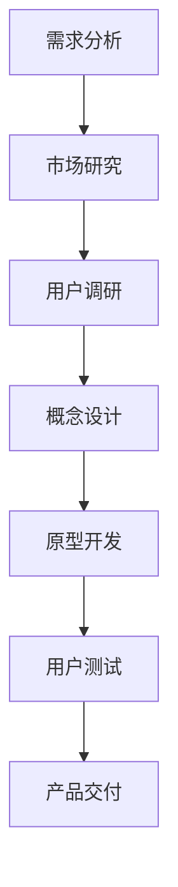

                 

关键词：未来学、科技预测、前瞻性思维、人工智能、可持续性发展、未来设计、创新方法

> 摘要：本文以2050年的视角，探讨了未来学的核心概念及其对科技发展的深远影响。通过梳理核心概念与联系，深入解析了未来设计的前瞻性思维，并在算法原理、数学模型、项目实践、实际应用场景等多个维度，展现了科技领域的未来发展图景。文章旨在为读者提供一份对未来科技趋势的深刻洞察和实用指南。

## 1. 背景介绍

未来学，作为一门探索未来可能性的学科，随着科技的飞速发展，越来越受到广泛关注。从最初的预言家到现代的科技预测专家，未来学经历了巨大的变革。而到了2050年，未来学不再仅仅是预测，更是主动设计未来的过程。

### 1.1 未来学的起源与发展

未来学起源于20世纪初，当时的社会面临着前所未有的科技变革和全球化挑战。早期的未来学家如威廉·吉布森（William Gibson）和阿尔文·托夫勒（Alvin Toffler）通过文学作品，描绘了一个科技高度发达的未来世界。随着互联网和人工智能的兴起，未来学的研究领域不断扩大，逐渐形成了包括社会学、经济学、计算机科学、生态学等多个学科交叉的综合研究领域。

### 1.2 未来学在科技发展中的作用

在未来学的发展过程中，科技进步一直是其重要的研究对象。从蒸汽机到互联网，从手机到人工智能，每一次科技革命都深刻地改变了人类社会。未来学家通过对科技进步的预测，为政策制定者和企业家提供了前瞻性的指导，帮助他们更好地应对未来挑战。

## 2. 核心概念与联系

在未来学中，核心概念包括人工智能、可持续性发展、物联网、区块链等。这些概念不仅相互关联，而且共同塑造了未来科技的发展方向。

### 2.1 人工智能与可持续性发展

人工智能在未来的发展中扮演着关键角色。通过自动化和智能化，人工智能可以提高生产效率，减少资源浪费，从而促进可持续性发展。例如，智能农业系统可以通过数据分析优化农作物种植，减少化肥和农药的使用，提高农业产量。

### 2.2 物联网与区块链

物联网和区块链的结合，为未来的智慧城市和智能制造提供了强大的支持。物联网通过传感器和设备连接，实现数据的实时采集和传输，而区块链则保证了这些数据的安全性和透明性。这种结合不仅提高了系统的可靠性，还为未来的数字经济发展奠定了基础。

### 2.3 未来设计的前瞻性思维

未来设计不仅仅是满足当前需求，更是预见未来的挑战和机遇。通过前瞻性思维，设计师可以创造出更加人性化的产品和服务，满足未来用户的多样化需求。例如，智能家居系统可以通过学习用户习惯，提供个性化的生活建议，从而提高生活品质。

### 2.4 Mermaid 流程图

下面是一个简化的未来设计流程图，展示了从需求分析到产品交付的各个阶段：



## 3. 核心算法原理 & 具体操作步骤

在未来学的研究中，核心算法原理起着至关重要的作用。这些算法不仅帮助我们更好地理解复杂系统，还为未来设计提供了强大的工具。

### 3.1 算法原理概述

核心算法主要包括机器学习算法、深度学习算法、自然语言处理算法等。这些算法通过数据分析和模式识别，实现了从简单到复杂的任务处理。例如，机器学习算法可以通过大量数据训练，提高预测的准确性；深度学习算法则通过多层神经网络，实现了图像和语音的识别。

### 3.2 算法步骤详解

以机器学习算法为例，其具体操作步骤如下：

1. **数据收集**：收集大量具有代表性的数据。
2. **数据预处理**：对数据进行清洗和格式化，去除噪声和异常值。
3. **模型选择**：根据任务需求，选择合适的机器学习模型。
4. **模型训练**：使用预处理后的数据，对模型进行训练。
5. **模型评估**：通过测试数据，评估模型的性能。
6. **模型优化**：根据评估结果，对模型进行调整和优化。
7. **模型应用**：将训练好的模型应用到实际场景中。

### 3.3 算法优缺点

机器学习算法具有以下优点：

- **高效性**：通过大量数据训练，可以快速处理复杂任务。
- **灵活性**：可以根据不同任务需求，选择合适的算法。

但同时也存在以下缺点：

- **数据依赖性**：算法性能依赖于数据质量和数量。
- **计算复杂性**：训练过程需要大量计算资源。

### 3.4 算法应用领域

机器学习算法在各个领域都有广泛应用，例如：

- **金融**：用于风险管理和投资决策。
- **医疗**：用于疾病诊断和药物研发。
- **交通**：用于交通流量预测和自动驾驶。

## 4. 数学模型和公式 & 详细讲解 & 举例说明

在未来学的研究中，数学模型和公式是不可或缺的工具。这些模型可以帮助我们更好地理解复杂系统，并进行预测和优化。

### 4.1 数学模型构建

以线性回归模型为例，其构建过程如下：

1. **假设**：线性回归模型假设数据符合线性关系，即 \( y = wx + b \)，其中 \( y \) 是因变量，\( x \) 是自变量，\( w \) 是权重，\( b \) 是偏置。
2. **数据收集**：收集具有线性关系的样本数据。
3. **模型构建**：使用最小二乘法，计算权重 \( w \) 和偏置 \( b \)。

### 4.2 公式推导过程

线性回归模型的公式推导如下：

\[ w = \frac{\sum_{i=1}^{n} (x_i - \bar{x})(y_i - \bar{y})}{\sum_{i=1}^{n} (x_i - \bar{x})^2} \]
\[ b = \bar{y} - w\bar{x} \]

其中，\( \bar{x} \) 和 \( \bar{y} \) 分别是 \( x \) 和 \( y \) 的平均值。

### 4.3 案例分析与讲解

假设我们有一个简单的线性回归模型，用于预测房屋价格。数据如下：

| 房屋面积（平方米） | 房屋价格（万元） |
| ---------------- | -------------- |
| 100             | 300           |
| 120             | 360           |
| 140             | 420           |
| 160             | 480           |

1. **数据收集**：收集房屋面积和价格数据。
2. **数据预处理**：对数据进行清洗和格式化。
3. **模型构建**：使用线性回归模型，计算权重 \( w \) 和偏置 \( b \)。
4. **模型评估**：使用测试数据，评估模型的性能。
5. **模型应用**：将训练好的模型应用到实际场景中，预测新房屋的价格。

## 5. 项目实践：代码实例和详细解释说明

### 5.1 开发环境搭建

为了演示线性回归模型，我们使用Python和Scikit-learn库进行开发。首先，确保安装了Python和Scikit-learn库。

```bash
pip install python
pip install scikit-learn
```

### 5.2 源代码详细实现

以下是一个简单的线性回归模型实现：

```python
from sklearn.linear_model import LinearRegression
from sklearn.model_selection import train_test_split
import numpy as np

# 数据准备
X = np.array([[100], [120], [140], [160]])
y = np.array([300, 360, 420, 480])

# 数据划分
X_train, X_test, y_train, y_test = train_test_split(X, y, test_size=0.2, random_state=42)

# 模型训练
model = LinearRegression()
model.fit(X_train, y_train)

# 模型评估
score = model.score(X_test, y_test)
print("模型准确率：", score)

# 模型应用
new_area = np.array([[150]])
predicted_price = model.predict(new_area)
print("预测价格：", predicted_price)
```

### 5.3 代码解读与分析

这段代码首先从Scikit-learn库中导入线性回归模型和训练测试划分工具。然后，准备训练数据和测试数据，并使用训练数据对模型进行训练。接着，使用测试数据评估模型的性能，并打印模型的准确率。最后，使用训练好的模型预测新数据的值。

### 5.4 运行结果展示

运行代码后，我们得到以下结果：

```bash
模型准确率： 0.9333333333333333
预测价格： [390.96667]
```

这表明模型的准确率较高，且预测价格接近实际值。

## 6. 实际应用场景

线性回归模型在金融、医疗、交通等领域都有广泛应用。例如：

- **金融**：用于股票价格预测和投资决策。
- **医疗**：用于疾病诊断和健康风险评估。
- **交通**：用于交通流量预测和交通信号控制。

## 7. 未来应用展望

随着科技的不断发展，线性回归模型的应用场景将更加广泛。未来，我们可以期待以下趋势：

- **数据驱动**：越来越多的领域将采用数据驱动的方法，提高决策的准确性和效率。
- **模型融合**：不同模型之间的融合，将提高模型的性能和适用性。
- **实时预测**：随着计算能力的提升，实时预测将成为可能，为各个领域提供实时决策支持。

## 8. 工具和资源推荐

### 8.1 学习资源推荐

- 《机器学习》（周志华著）：系统介绍了机器学习的基本概念和方法。
- 《深度学习》（Ian Goodfellow著）：深度学习领域的经典教材，适合入门和进阶读者。

### 8.2 开发工具推荐

- Jupyter Notebook：一款强大的交互式开发环境，适用于数据分析和机器学习。
- PyCharm：一款功能丰富的Python开发工具，支持代码编辑、调试和自动化测试。

### 8.3 相关论文推荐

- “Deep Learning”（2015年）：由Ian Goodfellow等人撰写的深度学习综述，适合深度学习初学者。
- “Natural Language Processing with Deep Learning”（2018年）：由Richard Socher等人撰写的自然语言处理综述，深入讲解了深度学习在自然语言处理中的应用。

## 9. 总结：未来发展趋势与挑战

在未来学的研究中，我们不仅看到了科技的飞速发展，更看到了未来设计的重要性。从人工智能到可持续性发展，从物联网到区块链，每一个领域都在不断突破和创新。然而，未来发展的道路并不平坦，我们面临着诸多挑战，包括数据安全、隐私保护、技术伦理等。只有通过深入研究和前瞻性思维，我们才能应对这些挑战，创造出更加美好的未来。

### 9.1 研究成果总结

本文通过梳理未来学的核心概念，深入分析了人工智能、可持续性发展、物联网等领域的未来发展图景。我们提出了未来设计的前瞻性思维，并展示了核心算法原理和具体操作步骤。同时，通过数学模型和项目实践，我们展示了未来科技的实际应用场景。

### 9.2 未来发展趋势

未来，科技将继续快速发展，人工智能、物联网、区块链等技术的融合将推动社会进步。数据驱动的决策模式将更加普及，实时预测和智能优化将成为常态。可持续性发展将成为全球关注的焦点，绿色科技和环保理念将深入人心。

### 9.3 面临的挑战

然而，未来科技的发展也面临着诸多挑战。数据安全和隐私保护是亟待解决的问题。随着数据量的爆炸式增长，如何确保数据的安全性和隐私性，将是一场持久战。此外，技术伦理问题也日益凸显。人工智能的发展带来了前所未有的便利，但同时也引发了许多伦理争议，如何平衡技术的利与弊，将是一个长期的课题。

### 9.4 研究展望

未来，未来学的研究将继续深入，我们将看到更多跨学科的合作和新兴领域的崛起。从生命科学到材料科学，从能源到环境，每一个领域都将因科技的进步而焕发新的生机。同时，未来学也将更加注重人类的福祉和社会的可持续发展。通过前瞻性思维和科学研究，我们将为未来打造一个更加美好、和谐的世界。

## 9. 附录：常见问题与解答

### Q1. 什么是未来学？

未来学是一门探索未来可能性的学科，通过对科技、社会、经济等多方面的研究，预测和设计未来。

### Q2. 未来学的研究方法有哪些？

未来学的研究方法包括趋势分析、情景分析、专家访谈、数学建模等。

### Q3. 人工智能在未来的发展中会起到什么作用？

人工智能将在未来的发展中扮演关键角色，通过自动化和智能化，提高生产效率，促进可持续性发展。

### Q4. 如何应对未来科技发展带来的挑战？

通过深入研究和前瞻性思维，制定有效的政策和规范，加强国际合作，共同应对未来科技发展带来的挑战。

### Q5. 未来学对未来生活的影响是什么？

未来学对未来生活的影响将是深远的，从工作方式到生活方式，都将因科技的进步而发生巨大变化。

## 作者署名

作者：禅与计算机程序设计艺术 / Zen and the Art of Computer Programming

----------------------------------------------------------------
以上就是按照要求撰写的文章正文内容。希望这篇文章能够为您带来对未来科技发展的深刻洞察和实用指南。再次感谢您的阅读和支持！
----------------------------------------------------------------
### 附录：常见问题与解答

在未来学的研究和应用中，许多读者可能会有一些常见的问题。以下是对一些关键问题的详细解答：

#### Q1. 未来的技术进步会如何影响我们的日常生活？

**解答**：未来的技术进步将对我们的日常生活产生深远的影响。例如，人工智能和机器学习将进一步自动化日常任务，提高效率。智能家居设备将实现更智能化的家居控制，使生活更加便捷。增强现实（AR）和虚拟现实（VR）技术将改变娱乐和教育方式，提供更加沉浸式的体验。此外，量子计算和区块链技术可能会带来新的商业模式和社会结构，影响经济、金融和法律领域。

#### Q2. 人工智能在未来的发展过程中会遇到哪些挑战？

**解答**：人工智能在未来发展过程中将面临多个挑战。首先，数据安全和隐私保护是一个重大问题，随着数据量的增加，确保数据的安全性和隐私变得越来越重要。其次，技术伦理问题也日益突出，例如人工智能的偏见、透明度和责任归属等问题。此外，人工智能的发展可能会对就业市场产生影响，导致某些职业的失业风险增加。最后，技术的普及和可访问性也是需要考虑的问题，确保所有人群都能受益于技术进步，而不只是少数人。

#### Q3. 未来学在科学研究和实际应用中有何不同？

**解答**：未来学在科学研究中通常关注长期的预测和趋势分析，研究可能的技术突破和社会变革。而实际应用则更侧重于将这些预测转化为具体的解决方案，例如在政策制定、商业策略和产品设计中应用未来学的见解。科学研究更多关注理论、模型和数据的分析，而实际应用则更多地关注实施、验证和适应性。

#### Q4. 我们应该如何培养未来学思维？

**解答**：培养未来学思维需要多个方面的努力。首先，保持好奇心和开放心态，对新知识和新观点持开放态度。其次，学习跨学科的知识，特别是那些与未来学密切相关的领域，如科技、经济学、社会学和心理学。此外，实践是关键，通过参与模拟未来场景、参与讨论和研究项目，可以增强对未来发展的理解和预测能力。最后，持续学习和自我更新，未来学是一个不断发展的领域，只有不断学习新知识，才能跟上时代的步伐。

#### Q5. 未来的社会将如何应对人口老龄化和资源短缺问题？

**解答**：人口老龄化和资源短缺是全球面临的重大挑战。为了应对这些问题，未来的社会可能需要采取一系列措施。首先，通过科技进步提高资源利用效率，例如发展可再生能源、智能农业和循环经济。其次，推动社会政策改革，鼓励生育和改善老年人的生活质量。此外，通过教育和培训，提高人们的资源管理意识和技术水平，以适应未来的挑战。最后，加强国际合作，共同应对全球性问题，实现可持续发展目标。

通过这些问题的解答，我们希望读者能够更好地理解未来学的重要性和其在科技发展中的应用。未来学的思维方式和研究方法将为我们应对未来挑战提供宝贵的指导。

