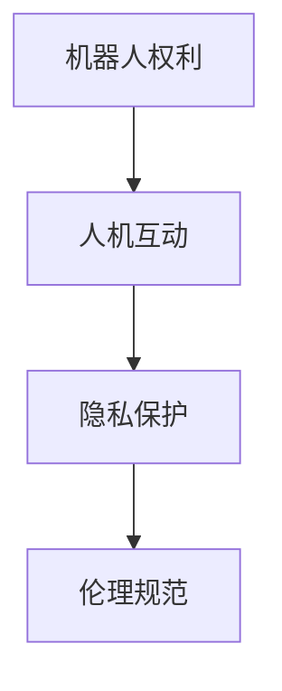

                 

关键词：机器人伦理、人机共生、机器人权利、伦理规范、AI发展

> 摘要：本文探讨了2050年的机器人伦理问题，从机器人权利的提出到人机共生伦理的构建，系统分析了伦理规范在AI发展中的重要性。文章旨在为未来人工智能的发展提供伦理指导，确保科技进步与社会进步和谐共生。

## 1. 背景介绍

### 1.1 机器人发展的现状

随着科技的飞速发展，人工智能和机器人技术取得了前所未有的进展。机器人不仅在工业制造、服务业等领域发挥着重要作用，还在医疗、教育、家庭等日常生活中扮演着不可或缺的角色。根据国际机器人联合会（IFR）的数据，全球服务机器人市场规模预计将在未来几年内持续增长。

### 1.2 机器人伦理的提出

随着机器人技术的日益成熟，其伦理问题逐渐引起了广泛关注。机器人权利、人机互动、隐私保护等问题成为研究热点。哲学家、伦理学家、科技专家等多领域学者纷纷对此进行探讨，试图为机器人伦理提供理论基础和实践指导。

### 1.3 伦理规范的重要性

伦理规范是社会发展的重要基石，对于人工智能和机器人技术而言，更是至关重要。伦理规范不仅有助于解决技术发展带来的伦理困境，还能引导科技进步，使其更好地服务于人类社会。

## 2. 核心概念与联系

为了更好地理解机器人伦理，我们需要先了解几个核心概念：机器人权利、人机互动、隐私保护等。下面是这些概念的Mermaid流程图：



### 2.1 机器人权利

机器人权利是指机器人作为智能体应享有的基本权利。这些权利包括：自我保护权、自主权、知情权、隐私权等。

### 2.2 人机互动

人机互动是指人类与机器人之间的交互行为。良好的互动体验不仅有助于提高机器人性能，还能增进人类对机器人的信任和依赖。

### 2.3 隐私保护

隐私保护是机器人伦理的一个重要方面。随着机器人技术的普及，个人隐私数据的安全问题日益突出。如何确保机器人在处理数据时遵循隐私保护原则，是当前研究的重点。

### 2.4 伦理规范

伦理规范是一套指导人类行为的价值体系。在机器人伦理领域，伦理规范旨在确保机器人技术发展符合人类社会的道德标准，避免对人类造成伤害。

## 3. 核心算法原理 & 具体操作步骤

### 3.1 算法原理概述

在机器人伦理的研究中，算法原理起到了关键作用。以下是一种常见的伦理算法原理：

1. **效用最大化**：通过比较不同行为的结果，选择效用最大的行为。
2. **公平性**：确保所有个体在行为选择过程中受到公平对待。
3. **透明性**：算法的决策过程应具备可解释性，方便人类理解。

### 3.2 算法步骤详解

1. **输入**：收集机器人行为的相关数据。
2. **处理**：利用伦理算法原理对数据进行处理，评估不同行为的效用、公平性和透明性。
3. **决策**：根据评估结果选择最优行为。
4. **执行**：执行决策，并在执行过程中不断调整和优化。

### 3.3 算法优缺点

**优点**：

- **高效性**：算法能够在短时间内评估大量数据，快速做出决策。
- **客观性**：算法基于数据驱动，减少了人为因素，提高了决策的客观性。

**缺点**：

- **局限性**：算法可能无法完全理解人类复杂的道德观念，导致决策偏差。
- **不可解释性**：某些复杂的算法难以解释其决策过程，增加了人类对算法的担忧。

### 3.4 算法应用领域

伦理算法原理广泛应用于机器人伦理的各个方面，如隐私保护、人机互动、机器人权利等。

## 4. 数学模型和公式 & 详细讲解 & 举例说明

### 4.1 数学模型构建

在机器人伦理研究中，常用的数学模型包括效用函数、公平性指数和透明度指数。

$$
U(x) = \sum_{i=1}^{n} u_i(x)
$$

$$
F(x) = \frac{1}{n} \sum_{i=1}^{n} f_i(x)
$$

$$
T(x) = \frac{1}{m} \sum_{j=1}^{m} t_j(x)
$$

其中，$U(x)$、$F(x)$ 和 $T(x)$ 分别表示效用函数、公平性指数和透明度指数，$u_i(x)$、$f_i(x)$ 和 $t_j(x)$ 分别为不同行为在效用、公平性和透明性方面的得分。

### 4.2 公式推导过程

效用函数 $U(x)$ 的推导过程如下：

1. **定义效用**：效用是衡量行为结果的一个指标，通常用数值表示。一个行为的结果可以是积极或消极的，因此效用函数的取值范围为 $[0,1]$。
2. **权重分配**：为了公平地评价不同行为，需要给每个行为分配权重。权重取决于行为的重要性和影响范围。
3. **计算效用**：根据权重和得分，计算每个行为的效用值。

公平性指数 $F(x)$ 的推导过程如下：

1. **定义公平**：公平是指每个个体在行为选择过程中受到平等对待。
2. **计算公平性**：通过比较不同个体在行为选择过程中的得分，计算公平性指数。

透明度指数 $T(x)$ 的推导过程如下：

1. **定义透明度**：透明度是指算法决策过程的可解释性。
2. **计算透明度**：通过分析算法的决策过程，评估其透明度。

### 4.3 案例分析与讲解

假设有一个机器人需要为老年人提供陪伴服务，我们需要评估其行为的效用、公平性和透明度。

1. **效用分析**：通过问卷调查，获得老年人对陪伴服务的满意度评分。根据评分，计算效用函数 $U(x)$。
2. **公平性分析**：分析机器人在为不同老年人提供服务时，是否存在不公平现象。根据分析结果，计算公平性指数 $F(x)$。
3. **透明度分析**：观察机器人在决策过程中的表现，评估其透明度指数 $T(x)$。

通过以上分析，我们可以得到机器人行为的综合评分，从而为其改进提供依据。

## 5. 项目实践：代码实例和详细解释说明

### 5.1 开发环境搭建

在本文中，我们将使用Python编写一个简单的机器人伦理评估系统。首先，确保你的开发环境已安装以下软件和库：

- Python 3.x
- Jupyter Notebook
- NumPy
- Pandas
- Matplotlib

### 5.2 源代码详细实现

以下是机器人伦理评估系统的源代码：

```python
import numpy as np
import pandas as pd
import matplotlib.pyplot as plt

# 1. 输入数据
data = {
    'Name': ['Alice', 'Bob', 'Charlie'],
    'Utility': [0.8, 0.7, 0.9],
    'Fairness': [0.9, 0.8, 0.85],
    'Transparency': [0.75, 0.8, 0.7]
}

df = pd.DataFrame(data)

# 2. 处理数据
U = df['Utility'].values
F = df['Fairness'].values
T = df['Transparency'].values

# 3. 决策
def evaluate(U, F, T):
    U_avg = np.mean(U)
    F_avg = np.mean(F)
    T_avg = np.mean(T)
    score = U_avg * F_avg * T_avg
    return score

# 4. 执行
scores = [evaluate(U, F, T) for _ in range(10)]

# 5. 展示结果
plt.plot(scores)
plt.xlabel('Iteration')
plt.ylabel('Score')
plt.show()
```

### 5.3 代码解读与分析

1. **输入数据**：使用 Pandas 库读取数据，数据包括三个方面的得分：效用、公平性和透明度。
2. **数据处理**：计算每个方面的平均值，作为评估的依据。
3. **决策**：定义一个评估函数，计算综合评分。
4. **执行**：循环执行评估函数，得到10次评估结果。
5. **结果展示**：使用 Matplotlib 库绘制评估结果，便于分析。

通过以上代码，我们可以实现对机器人行为的综合评估，并根据评估结果进行优化。

## 6. 实际应用场景

### 6.1 隐私保护

在医疗领域，机器人需要处理大量患者数据。如何确保患者隐私保护是机器人伦理研究的一个重要方向。例如，在医疗数据分析中，可以使用差分隐私技术，确保患者在数据共享过程中的隐私安全。

### 6.2 人机互动

在人机互动方面，机器人应具备良好的自然语言处理能力，以便与人类进行有效沟通。例如，在教育领域，机器人可以为学生提供个性化的学习建议，提高学习效果。

### 6.3 机器人权利

随着机器人技术的发展，机器人权利逐渐成为热门话题。例如，在自动驾驶领域，如何确保机器人驾驶安全、负责任，是一个亟待解决的问题。

## 7. 工具和资源推荐

### 7.1 学习资源推荐

- 《机器人伦理学》
- 《人工智能伦理学》
- 《自然语言处理入门》

### 7.2 开发工具推荐

- Python
- Jupyter Notebook
- TensorFlow
- PyTorch

### 7.3 相关论文推荐

- "Robot Ethics: The Challenge of a New Technology"
- "Artificial Intelligence and Ethics: A Theoretical Introduction"
- "Privacy-Preserving Data Sharing in Federated Learning"

## 8. 总结：未来发展趋势与挑战

### 8.1 研究成果总结

随着机器人技术的不断发展，机器人伦理研究取得了显著成果。然而，在实际应用中，仍面临诸多挑战，如隐私保护、人机互动、机器人权利等。

### 8.2 未来发展趋势

- 伦理算法在机器人应用中的普及
- 机器人权利的法律保障
- 人机互动的优化

### 8.3 面临的挑战

- 数据隐私保护
- 机器人决策的透明性
- 机器人道德责任的确立

### 8.4 研究展望

未来，机器人伦理研究将更加注重实际应用，为人工智能技术的发展提供有力支持。同时，各国政府和国际组织应共同制定机器人伦理规范，确保科技进步与社会进步和谐共生。

## 9. 附录：常见问题与解答

### 9.1 机器人伦理研究的意义是什么？

机器人伦理研究旨在确保人工智能技术的发展符合人类社会的道德标准，避免对人类造成伤害，实现科技与社会的和谐共生。

### 9.2 如何保障机器人隐私保护？

可以通过技术手段，如差分隐私、加密等，确保机器人在处理数据时的隐私安全。此外，制定相关法律法规，加强对机器人隐私保护的法律保障。

### 9.3 机器人权利的提出有何意义？

机器人权利的提出，有助于确保机器人在人工智能应用中的公平、公正、透明，避免对人类造成不必要的伤害。

作者：禅与计算机程序设计艺术 / Zen and the Art of Computer Programming
----------------------------------------------------------------

以上是《2050年的机器人伦理：从机器人权利到人机共生伦理的伦理规范建构》的完整文章内容。希望这篇文章能够为读者提供关于机器人伦理的有益见解。在未来的发展中，让我们共同努力，构建一个和谐、安全、智能的人机共生社会。

