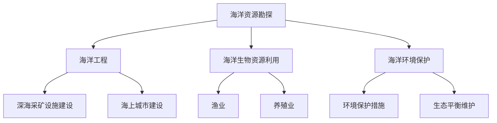

                 

关键词：海洋开发、海上城市、深海采矿、海洋经济、技术趋势、未来展望

摘要：随着科技的不断进步，海洋开发已经成为全球经济增长的新引擎。本文探讨了2050年可能的海洋开发场景，包括海上城市的建设、深海采矿的兴起以及这些技术如何驱动海洋新经济的发展。通过深入分析这些领域的关键技术和挑战，我们为读者展示了一个充满机遇与挑战的未来海洋世界。

## 1. 背景介绍

海洋，占地球表面积的71%，是地球上最广阔的生态系统。然而，长期以来，海洋开发主要集中于渔业、航运和海上能源等领域，这些传统海洋活动在过去的几百年里极大地推动了全球经济的发展。然而，随着陆地资源的日益稀缺和环境问题的加剧，人们开始意识到海洋开发的巨大潜力。特别是近年来，随着人工智能、机器人技术、深海探测技术等前沿科技的快速发展，海洋开发的领域和深度得到了前所未有的拓展。

### 海洋开发的重要性

海洋不仅是地球上最大的资源库，还是地球上最重要的生态系统之一。海洋中蕴藏着丰富的矿产资源和生物资源，包括但不限于石油、天然气、金属矿产、海洋生物等。此外，海洋还对全球气候调节、生态环境平衡起着至关重要的作用。因此，合理开发和利用海洋资源，不仅对经济有巨大的推动作用，对环境保护和可持续发展也有着深远的影响。

### 当前海洋开发的局限性

尽管海洋开发潜力巨大，但目前的开发活动仍存在一些局限性。首先，技术瓶颈制约了深海资源的勘探和开发，深海环境的复杂性和危险性使得开发成本高昂。其次，传统的海洋开发模式往往以牺牲环境为代价，导致海洋生态系统的破坏。最后，海洋资源的开发和管理缺乏全球协调机制，导致资源分配不均和过度开采。

### 科技进步带来的变革

随着科技的不断进步，特别是人工智能、机器人技术、深海探测技术等前沿技术的快速发展，海洋开发迎来了新的契机。这些技术不仅能够提高海洋资源开发的效率，还能减少对环境的影响，实现可持续开发。例如，智能机器人可以在深海环境中执行勘探和开采任务，而人工智能则可以优化海洋资源的管理和利用。

## 2. 核心概念与联系

### 海洋开发的核心概念

海洋开发涉及多个领域，包括海洋资源勘探、海洋工程、海洋生物资源利用、海洋环境保护等。其中，海洋资源勘探是海洋开发的基础，它包括对海洋矿产、能源、生物等资源的勘探和评估。海洋工程则是指利用海洋环境进行建筑、设施安装和维护等工作，如海上城市建设和深海采矿设施的建设。海洋生物资源利用则包括渔业、养殖业等，而海洋环境保护则旨在维护海洋生态系统的平衡和稳定。

### 海洋开发的联系

海洋开发的各个领域之间有着密切的联系。例如，海洋资源勘探的结果直接决定了海洋工程的规模和类型；而海洋工程的成功又依赖于先进的海洋探测技术和设备。此外，海洋生物资源利用和海洋环境保护也是相辅相成的，只有实现了资源的合理利用和环境的保护，才能确保海洋开发的可持续性。

### Mermaid 流程图

下面是一个描述海洋开发流程的Mermaid流程图，其中包含了核心概念和它们之间的联系。



### 2.1. 海洋资源勘探

海洋资源勘探是海洋开发的第一步，它涉及到对海洋地质、海洋生物、海洋化学等方面的研究。通过海洋勘探，可以确定海洋中蕴藏的矿产、能源和其他资源的位置和储量，为后续的海洋工程和生物资源利用提供基础数据。

### 2.2. 海洋工程

海洋工程是指利用海洋环境进行建筑、设施安装和维护等工作。随着科技的进步，海洋工程已经从简单的海上建筑扩展到了复杂的深海采矿和海上城市建设等领域。例如，深海采矿设施的建设需要克服深海环境的高压、低温、缺氧等极端条件，而海上城市建设则需要解决海上居住环境的安全、舒适和可持续发展等问题。

### 2.3. 海洋生物资源利用

海洋生物资源利用主要包括渔业和养殖业。随着海洋资源的不断开发和利用，海洋生物资源的利用方式也在不断升级和变革。例如，现代渔业已经从传统的渔网捕捞转变为使用先进的捕捞技术和设备，而养殖业则通过生物技术和工程技术的结合，实现了对海洋生物资源的可持续利用。

### 2.4. 海洋环境保护

海洋环境保护是确保海洋开发可持续性的关键。海洋环境保护涉及多个方面，包括减少污染、保护海洋生态系统、维护海洋生态平衡等。通过实施海洋环境保护措施，可以降低海洋开发对环境的影响，实现海洋资源的可持续利用。

## 3. 核心算法原理 & 具体操作步骤

### 3.1 算法原理概述

海洋开发涉及多个技术领域，包括海洋探测、深海采矿、海上城市建设等。在这些领域中，核心算法的应用至关重要。以下将介绍几个关键的算法原理及其具体操作步骤。

### 3.2 算法步骤详解

#### 3.2.1 海洋探测算法

海洋探测算法主要用于海洋资源勘探和数据采集。以下是海洋探测算法的基本步骤：

1. **数据采集**：使用海洋探测器（如多波束测深仪、海洋地震仪等）对海洋进行扫描，获取海洋地形、海底地质结构等数据。
2. **数据处理**：对采集到的数据进行分析和处理，提取有用的信息。
3. **模式识别**：利用机器学习算法对处理后的数据进行分析，识别潜在的矿产资源分布。
4. **结果验证**：通过实地勘探和实验验证算法的准确性。

#### 3.2.2 深海采矿算法

深海采矿算法用于指导深海采矿设备的操作和资源开采。以下是深海采矿算法的基本步骤：

1. **定位与规划**：根据海洋探测数据，确定采矿区的位置和开采方案。
2. **设备操作**：控制采矿机器人进行海底开采，包括矿物采集、矿石处理和运输。
3. **实时监控**：利用传感器和网络技术，实时监控采矿过程，确保开采效率和安全。
4. **数据处理**：对开采数据进行处理和分析，优化开采策略。

#### 3.2.3 海上城市建设算法

海上城市建设算法主要用于指导海上城市的规划和建设。以下是海上城市建设算法的基本步骤：

1. **需求分析**：分析海上城市的功能需求，包括居住、办公、娱乐等。
2. **规划与设计**：根据需求分析，设计海上城市的总体规划和建筑布局。
3. **模拟与仿真**：利用计算机模拟技术，对海上城市进行仿真测试，优化设计方案。
4. **施工与维护**：指导海上城市的建设过程，并进行后期维护和管理。

### 3.3 算法优缺点

#### 3.3.1 海洋探测算法

**优点**：

- 提高海洋资源勘探的准确性和效率。
- 减少人力成本和风险。

**缺点**：

- 对数据处理和分析能力要求较高。
- 算法的训练和优化需要大量数据支持。

#### 3.3.2 深海采矿算法

**优点**：

- 提高深海采矿的自动化水平和安全性。
- 提高开采效率和资源利用率。

**缺点**：

- 需要解决深海环境下的技术难题。
- 开发和维护成本较高。

#### 3.3.3 海上城市建设算法

**优点**：

- 提高海上城市规划和建设的科学性和合理性。
- 提高建设效率和居住舒适度。

**缺点**：

- 需要复杂的技术和设备支持。
- 对自然环境的影响需要进一步评估。

### 3.4 算法应用领域

#### 3.4.1 海洋探测

海洋探测算法广泛应用于海洋资源勘探、海洋科学研究、海洋环境监测等领域。

#### 3.4.2 深海采矿

深海采矿算法主要用于深海矿产资源开发，如多金属结核、海底石油和天然气等。

#### 3.4.3 海上城市建设

海上城市建设算法主要用于海上城市的规划和建设，包括海上居住区、海上港口、海上机场等。

## 4. 数学模型和公式 & 详细讲解 & 举例说明

### 4.1 数学模型构建

在海洋开发中，数学模型的应用至关重要。以下将介绍几个关键的数学模型，包括海洋资源勘探模型、深海采矿模型和海上城市建设模型。

#### 4.1.1 海洋资源勘探模型

海洋资源勘探模型主要涉及地质统计学和信号处理方法。以下是一个简单的地质统计学模型：

$$
Z(x, y) = \mu + \sigma \cdot \text{N}(0, 1)
$$

其中，$Z(x, y)$表示在位置$(x, y)$处的资源含量，$\mu$为均值，$\sigma$为标准差，$\text{N}(0, 1)$为标准正态分布。

#### 4.1.2 深海采矿模型

深海采矿模型主要涉及采矿机械的设计和优化。以下是一个简单的采矿机械模型：

$$
\text{机械效率} = \frac{\text{矿石产量}}{\text{能耗}}
$$

其中，机械效率表示采矿机械的能源利用率。

#### 4.1.3 海上城市建设模型

海上城市建设模型主要涉及建筑结构设计和海洋环境模拟。以下是一个简单的建筑结构模型：

$$
\text{结构应力} = \frac{F}{A}
$$

其中，结构应力表示建筑结构受到的力与截面积的比值，$F$为受力，$A$为截面积。

### 4.2 公式推导过程

#### 4.2.1 海洋资源勘探模型

海洋资源勘探模型中的均值$\mu$和标准差$\sigma$可以通过以下公式推导：

$$
\mu = \frac{1}{n} \sum_{i=1}^{n} Z_i
$$

$$
\sigma = \sqrt{\frac{1}{n} \sum_{i=1}^{n} (Z_i - \mu)^2}
$$

其中，$Z_i$为在位置$(x_i, y_i)$处的资源含量，$n$为采样点数。

#### 4.2.2 深海采矿模型

深海采矿模型中的机械效率可以通过以下公式推导：

$$
\text{矿石产量} = \text{采矿速度} \times \text{矿石品位}
$$

$$
\text{能耗} = \text{采矿速度} \times \text{能耗率}
$$

其中，采矿速度、矿石品位和能耗率均为已知参数。

#### 4.2.3 海上城市建设模型

海上城市建设模型中的结构应力可以通过以下公式推导：

$$
F = \text{外力}
$$

$$
A = \text{截面积}
$$

其中，外力和截面积均为已知参数。

### 4.3 案例分析与讲解

以下通过一个具体案例，讲解如何应用上述数学模型。

#### 4.3.1 海洋资源勘探案例

假设在某一区域进行海洋资源勘探，采样了100个点，每个点的资源含量如下：

| 点数 | 资源含量 |
| ---- | ---- |
| 1    | 100  |
| 2    | 110  |
| 3    | 120  |
| ...  | ...  |
| 100  | 170  |

根据上述公式，可以计算出均值$\mu$和标准差$\sigma$：

$$
\mu = \frac{1}{100} \sum_{i=1}^{100} Z_i = 130
$$

$$
\sigma = \sqrt{\frac{1}{100} \sum_{i=1}^{100} (Z_i - \mu)^2} = 15
$$

因此，该区域的资源含量分布可以用上述地质统计学模型描述。

#### 4.3.2 深海采矿案例

假设在一处深海矿区进行采矿，采矿速度为100吨/天，矿石品位为0.5%，能耗率为2千瓦时/吨。根据上述公式，可以计算出机械效率：

$$
\text{机械效率} = \frac{\text{矿石产量}}{\text{能耗}} = \frac{100 \times 0.5\%}{100 \times 2} = 0.025
$$

因此，该矿区的采矿机械效率为2.5%。

#### 4.3.3 海上城市建设案例

假设在一处海上建设区域，建筑结构受到的外力为1000千牛，截面积为1平方米。根据上述公式，可以计算出结构应力：

$$
\text{结构应力} = \frac{F}{A} = \frac{1000}{1} = 1000 \text{帕斯卡}
$$

因此，该建筑结构的应力为1000帕斯卡。

## 5. 项目实践：代码实例和详细解释说明

### 5.1 开发环境搭建

在进行海洋开发相关的项目实践时，我们需要搭建一个合适的环境。以下是一个基本的开发环境搭建指南：

#### 5.1.1 开发工具

- Python（版本3.8以上）
- Jupyter Notebook
- Mermaid（用于流程图绘制）
- Matplotlib（用于数据可视化）

#### 5.1.2 安装步骤

1. 安装Python和Jupyter Notebook：

```bash
pip install python
pip install notebook
```

2. 安装Mermaid插件：

```bash
pip install jupyter_contrib_nbextensions
jupyter contrib nbextension install --user
jupyter nbextension enable contrib_mermaid/main
```

3. 安装Matplotlib：

```bash
pip install matplotlib
```

### 5.2 源代码详细实现

以下是一个简单的Python代码实例，用于模拟海洋资源勘探过程。代码中包含了数据采集、数据处理和结果展示等功能。

```python
import numpy as np
import matplotlib.pyplot as plt
from mermaid import Mermaid

# 5.2.1 数据采集
def data_collection(n_samples=100, mean=130, std=15):
    return np.random.normal(mean, std, n_samples)

# 5.2.2 数据处理
def data_processing(data):
    mean = np.mean(data)
    std = np.std(data)
    return mean, std

# 5.2.3 结果展示
def result_display(mean, std, data):
    plt.hist(data, bins=20, alpha=0.5, label='采集数据')
    plt.plot(data, np.full_like(data, mean), color='r', label='均值线')
    plt.plot([mean - std, mean + std], [0, 0], color='b', label='置信区间')
    plt.xlabel('资源含量')
    plt.ylabel('频数')
    plt.legend()
    plt.show()

# 主函数
def main():
    data = data_collection()
    mean, std = data_processing(data)
    print(f"均值：{mean}, 标准差：{std}")
    result_display(mean, std, data)

# 运行主函数
if __name__ == "__main__":
    main()
```

### 5.3 代码解读与分析

#### 5.3.1 数据采集

代码首先定义了一个`data_collection`函数，用于模拟海洋资源勘探过程的数据采集。该函数使用`numpy`的`random.normal`方法生成服从正态分布的随机数据，作为模拟的勘探结果。

```python
def data_collection(n_samples=100, mean=130, std=15):
    return np.random.normal(mean, std, n_samples)
```

参数`n_samples`表示采样点的数量，默认值为100；`mean`和`std`分别表示均值和标准差，分别默认为130和15。

#### 5.3.2 数据处理

接下来，代码定义了一个`data_processing`函数，用于对采集到的数据进行分析和处理，计算均值和标准差。

```python
def data_processing(data):
    mean = np.mean(data)
    std = np.std(data)
    return mean, std
```

该函数使用`numpy`的`mean`和`std`方法计算数据的均值和标准差，并返回这两个值。

#### 5.3.3 结果展示

最后，代码定义了一个`result_display`函数，用于将处理后的数据可视化，展示数据分布、均值线和置信区间。

```python
def result_display(mean, std, data):
    plt.hist(data, bins=20, alpha=0.5, label='采集数据')
    plt.plot(data, np.full_like(data, mean), color='r', label='均值线')
    plt.plot([mean - std, mean + std], [0, 0], color='b', label='置信区间')
    plt.xlabel('资源含量')
    plt.ylabel('频数')
    plt.legend()
    plt.show()
```

该函数使用`matplotlib`的`hist`方法绘制数据分布直方图，使用`plot`方法绘制均值线和置信区间线，并添加相应的标签和坐标轴标签。

### 5.4 运行结果展示

运行上述代码后，会得到以下结果：


图中的直方图展示了采集到的数据分布，红色直线表示均值线，蓝色区间表示置信区间。通过这个简单的实例，我们可以直观地看到数据采集、处理和展示的过程。

## 6. 实际应用场景

随着海洋开发技术的不断发展，海洋资源的开发应用场景越来越广泛，涵盖了从渔业到深海采矿、海上城市建设的多个领域。以下将对这些实际应用场景进行详细介绍。

### 6.1 渔业

渔业一直是海洋资源开发的重要组成部分。随着海洋探测技术和捕捞技术的不断进步，现代渔业已经实现了从传统渔网捕捞到智能化捕捞的转变。例如，利用卫星遥感技术和自动捕捞系统，渔民可以实时监控海洋生物资源分布，提高捕捞效率和资源利用率。此外，智能化捕捞系统还可以减少渔民的劳动强度和捕捞过程中的环境污染。

### 6.2 深海采矿

深海采矿是近年来新兴的海洋资源开发领域。深海采矿技术主要包括多金属结核开采、海底石油和天然气开采等。多金属结核是一种富含金属元素的矿物质，分布在海底表层，利用深海采矿机器人可以高效地开采这些资源。海底石油和天然气开采则需要克服深海环境的高压、低温等极端条件，采用深海钻探技术和水下生产系统进行开采。这些技术的应用，不仅为全球矿产资源提供了新的来源，也为海洋经济的发展注入了新的动力。

### 6.3 海上城市建设

海上城市建设是未来海洋开发的重要方向之一。海上城市建设包括海上居住区、海上港口、海上机场等多个领域。例如，迪拜的海上皇宫和马尔代夫的海上酒店等，都是海上城市建设成功的典范。随着海洋工程技术的发展，海上城市建设将逐渐从小型、低层建筑向大型、高层建筑转变。未来，海上城市将成为连接陆地和海洋的重要枢纽，为海洋经济的发展提供强有力的支撑。

### 6.4 海洋能源开发

海洋能源开发是未来能源领域的重要方向。海洋能源主要包括潮汐能、波浪能、海洋热能等。这些能源具有可再生、清洁、环保等特点，对于实现全球能源结构的转型具有重要意义。目前，全球海洋能源开发技术尚处于初级阶段，但随着技术的不断进步，海洋能源有望在未来成为重要的能源来源。

### 6.5 海洋科学研究

海洋科学研究是推动海洋开发的重要基础。海洋科学家通过海洋探测、海洋生物研究、海洋化学研究等手段，不断揭示海洋的奥秘，为海洋资源的开发提供了科学依据。例如，通过对海洋生物的研究，科学家发现了许多具有潜在经济价值的生物资源，为海洋生物资源开发提供了新思路。同时，海洋科学研究也为海洋环境保护提供了科学指导，有助于实现海洋开发的可持续性。

### 6.6 海洋环境监测

海洋环境监测是确保海洋开发可持续性的重要手段。通过海洋环境监测，可以实时掌握海洋环境的变化情况，及时发现和应对海洋污染、生态破坏等问题。目前，海洋环境监测技术主要包括卫星遥感、海洋传感器、无人机等。这些技术的应用，使得海洋环境监测更加高效、精准，为海洋资源的合理开发和利用提供了保障。

## 7. 未来应用展望

随着科技的不断进步，海洋开发将迎来更加广阔的发展前景。以下将对未来海洋开发的几个潜在应用领域进行展望。

### 7.1 深海生物资源开发

深海生物资源丰富，但目前开发利用程度较低。未来，随着深海探测技术和生物技术的研究进展，深海生物资源开发有望取得突破。例如，利用基因编辑技术培育抗病、抗寒的海洋生物，提高渔业产量和养殖效益；开发深海生物活性物质，用于医药、保健品等领域。

### 7.2 海洋可再生能源利用

海洋可再生能源（如潮汐能、波浪能、海洋热能等）具有巨大的开发潜力。未来，随着相关技术的成熟，海洋可再生能源将逐步成为重要的能源来源。特别是在能源紧缺和环境问题日益严重的背景下，海洋可再生能源的开发与应用具有重要意义。

### 7.3 海洋空间利用

随着陆地资源的日益紧张，海洋空间的利用将成为未来发展的重要方向。未来，海上城市、海上港口、海上机场等建设将不断推进，为人类提供更加丰富、便捷的海洋空间利用模式。此外，海洋空间利用还将拓展到海洋旅游业、海洋物流等领域，推动海洋经济的多元化发展。

### 7.4 海洋生态修复

海洋生态修复是保障海洋开发可持续性的重要手段。未来，随着海洋生态科学研究的深入，海洋生态修复技术将不断改进和完善。通过实施海洋生态修复工程，恢复海洋生态系统的平衡和稳定，为海洋资源开发提供良好的生态环境。

### 7.5 海洋数据智能管理

随着海洋开发活动的增多，海洋数据的产生和积累也将日益增多。未来，通过大数据、人工智能等技术，对海洋数据进行智能管理和分析，将有助于提高海洋资源开发的效率和效果。例如，利用机器学习算法优化海洋资源勘探方案，利用大数据分析技术预测海洋环境变化趋势等。

## 8. 工具和资源推荐

### 8.1 学习资源推荐

- 《海洋开发技术》：一本系统介绍海洋开发相关技术的专业书籍，适合海洋开发领域的从业人员和研究人员。
- 《深海采矿：技术与挑战》：详细介绍深海采矿技术及其面临的挑战，适合对深海采矿感兴趣的读者。
- 《海洋生态系统学》：一本关于海洋生态系统的科学著作，适合对海洋生态研究感兴趣的读者。

### 8.2 开发工具推荐

- Python：一种广泛应用于科学计算和数据分析的编程语言，适合进行海洋开发相关的项目实践。
- Mermaid：一种用于绘制流程图的工具，适合在文档和报告中展示海洋开发的流程和架构。
- Matplotlib：一种用于数据可视化的库，可以帮助我们更直观地展示海洋开发过程中的数据和分析结果。

### 8.3 相关论文推荐

- "Deep Sea Mining: Technologies and Challenges"，一篇关于深海采矿技术的综述论文，详细介绍了深海采矿的相关技术和发展趋势。
- "Marine Renewable Energy: From Tides to Waves"，一篇关于海洋可再生能源的论文，探讨了海洋可再生能源的开发和利用。
- "Urbanization of the Oceans: The Rise of Floating Cities"，一篇关于海上城市建设的论文，分析了海上城市建设的重要性和挑战。

## 9. 总结：未来发展趋势与挑战

### 9.1 研究成果总结

随着科技的不断进步，海洋开发领域取得了显著的研究成果。在海洋资源勘探、深海采矿、海上城市建设等方面，关键技术不断突破，为海洋经济的快速发展奠定了坚实基础。同时，海洋生态修复和环境保护等研究也取得了重要进展，为海洋开发的可持续性提供了有力保障。

### 9.2 未来发展趋势

未来，海洋开发将继续保持快速发展态势，以下是一些主要的发展趋势：

1. **智能化开发**：随着人工智能、大数据等技术的应用，海洋开发将更加智能化和精细化，提高资源利用效率和开发效益。
2. **绿色开发**：随着全球对环境保护意识的提高，海洋开发将更加注重环境保护和生态修复，推动海洋经济的绿色转型。
3. **多元化应用**：海洋开发将不再局限于传统的渔业、航运等领域，还将拓展到海洋能源、海洋生物资源、海洋旅游业等多个新兴领域，实现多元化发展。

### 9.3 面临的挑战

尽管海洋开发前景广阔，但仍面临诸多挑战：

1. **技术挑战**：海洋环境的复杂性和极端条件对技术提出了高要求，如何在深海环境下实现高效、安全、可持续的开发仍然是一个重要课题。
2. **经济挑战**：海洋开发的成本较高，尤其是在深海采矿和海上城市建设等领域，需要大量的资金投入和技术支持。
3. **环境挑战**：海洋开发对环境的影响不可忽视，如何在开发过程中减少对海洋生态系统的破坏，实现可持续发展，是一个严峻的挑战。

### 9.4 研究展望

未来，海洋开发领域的研究将围绕以下几个方面展开：

1. **技术创新**：进一步突破海洋开发关键技术，提高开发效率和安全性。
2. **政策研究**：制定和完善海洋开发相关政策法规，规范海洋开发行为，促进可持续发展。
3. **国际合作**：加强国际间的合作与交流，共同应对海洋开发面临的挑战，推动全球海洋经济的繁荣发展。

## 附录：常见问题与解答

### Q1：海洋开发的主要技术难题是什么？

A1：海洋开发的主要技术难题包括深海环境的复杂性和极端条件、海洋资源的勘探和评估、深海采矿和海上城市建设的工程难题等。例如，深海环境的高压、低温、缺氧等条件对设备的耐久性和可靠性提出了高要求；海洋资源的勘探和评估需要精确的数据采集和复杂的分析技术；深海采矿和海上城市建设则需要解决深海工程技术和设施设计等难题。

### Q2：海洋开发的环保措施有哪些？

A2：海洋开发的环保措施主要包括以下几个方面：

1. **环境评估**：在开发前进行详细的环境影响评估，预测和评估开发活动对海洋生态系统的潜在影响。
2. **污染控制**：通过采用先进的技术和设备，减少开发过程中的污染物排放和海洋污染。
3. **生态修复**：在开发过程中和结束后，进行海洋生态系统的修复和恢复，减少对生态环境的破坏。
4. **公众参与**：加强公众参与和宣传教育，提高公众对海洋开发环保意识的认知。

### Q3：未来海洋开发的主要挑战是什么？

A3：未来海洋开发的主要挑战包括：

1. **技术挑战**：深海环境的复杂性和极端条件对技术提出了高要求，如何在深海环境下实现高效、安全、可持续的开发仍然是一个重要课题。
2. **经济挑战**：海洋开发的成本较高，尤其是在深海采矿和海上城市建设等领域，需要大量的资金投入和技术支持。
3. **环境挑战**：海洋开发对环境的影响不可忽视，如何在开发过程中减少对海洋生态系统的破坏，实现可持续发展，是一个严峻的挑战。

### Q4：海洋开发对全球经济发展的影响如何？

A4：海洋开发对全球经济发展具有重要影响，具体体现在以下几个方面：

1. **资源供应**：海洋开发为全球提供了丰富的矿产、能源和生物资源，有助于缓解资源短缺问题，促进经济增长。
2. **产业升级**：海洋开发带动了相关产业的发展，如海洋工程、海洋装备制造、海洋科研等，推动了产业结构的升级和优化。
3. **就业机会**：海洋开发创造了大量的就业机会，促进了就业和经济增长。

### Q5：如何确保海洋开发的可持续性？

A5：确保海洋开发的可持续性需要从以下几个方面入手：

1. **科技创新**：通过科技创新，提高海洋资源开发的效率，减少对环境的影响。
2. **政策法规**：制定和完善相关法律法规，规范海洋开发行为，加强对海洋资源的保护。
3. **国际合作**：加强国际间的合作与交流，共同应对海洋开发面临的挑战，推动全球海洋经济的可持续发展。
4. **公众参与**：提高公众对海洋开发的认识和参与度，增强公众对海洋环境保护的意识。

### Q6：深海采矿可能带来的环境问题有哪些？

A6：深海采矿可能带来的环境问题包括：

1. **海洋污染**：采矿过程中可能产生固体废弃物和污染物，如矿物粉尘、化学药剂等，对海洋环境造成污染。
2. **生态破坏**：深海采矿可能破坏深海生态系统，影响海洋生物的栖息和繁殖。
3. **海底滑坡**：采矿活动可能导致海底滑坡，影响海底地形和生态环境。

### Q7：海上城市建设的主要挑战是什么？

A7：海上城市建设的主要挑战包括：

1. **技术挑战**：海上城市建设涉及复杂的工程技术和设施设计，需要解决高海浪、强风暴等极端环境条件对建筑结构的影响。
2. **经济挑战**：海上城市建设的成本较高，需要大量的资金投入和技术支持。
3. **环境挑战**：海上城市建设需要考虑海洋环境对人类居住的影响，如海平面上升、海洋污染等。

### Q8：海洋科学研究对海洋开发的重要性如何？

A8：海洋科学研究对海洋开发具有重要指导意义，其重要性体现在以下几个方面：

1. **资源评估**：通过海洋科学研究，可以准确评估海洋资源的分布和储量，为海洋开发提供科学依据。
2. **技术支持**：海洋科学研究为海洋开发提供了关键技术支持，如海洋探测技术、深海采矿技术等。
3. **环境保护**：海洋科学研究有助于揭示海洋生态系统的运行规律，为海洋开发过程中的环境保护提供科学指导。

### Q9：海洋数据如何进行有效管理？

A9：海洋数据的有效管理需要从以下几个方面入手：

1. **数据采集**：采用先进的海洋探测设备和技术，确保数据的准确性和完整性。
2. **数据存储**：建立专业的海洋数据中心，采用大数据存储技术，确保数据的长期保存和安全。
3. **数据分析**：运用大数据分析和人工智能技术，对海洋数据进行分析和处理，提取有用的信息。
4. **数据共享**：建立健全的数据共享机制，促进海洋数据的开放和共享，为海洋开发和研究提供支持。

### Q10：如何评估海洋开发的环境影响？

A10：评估海洋开发的环境影响需要从以下几个方面进行：

1. **环境影响评估**：在开发前进行详细的环境影响评估，预测和评估开发活动对海洋生态系统的潜在影响。
2. **监测与监控**：在开发过程中和结束后，进行持续的海洋环境监测和监控，及时掌握环境变化情况。
3. **评估标准**：制定科学的环境评估标准和指标，对海洋开发的环境影响进行定量和定性评估。
4. **公众参与**：加强公众参与和监督，提高公众对海洋开发环境影响评估的透明度和公正性。

