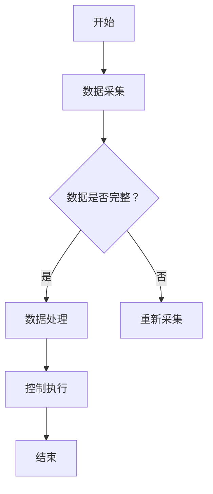

                 

关键词：海洋开发、海上风电、海底采矿、海洋经济、2050年、技术趋势、可持续发展、资源利用

> 摘要：随着全球能源需求的不断增长和环保意识的提升，海洋开发已成为未来经济发展的重要方向。本文探讨了2050年可能的海洋开发模式，包括海上风电和海底采矿，分析了其技术进步、经济影响以及面临的挑战和机遇。

## 1. 背景介绍

随着陆地资源的逐渐枯竭，人类对海洋资源的依赖性日益增加。海洋占地球表面积的71%，蕴藏着丰富的矿产、能源和生物资源。然而，海洋资源的开发一直面临着技术和环境的双重挑战。

### 1.1 海洋资源的多样性

海洋资源主要包括：

- **矿产**：包括铜、锌、金、银等金属矿产，以及多金属结核、富钴结壳等。
- **能源**：如海上风电、波浪能、潮汐能等可再生能源。
- **生物资源**：海洋鱼类、贝类、藻类等。

### 1.2 海洋开发的挑战

- **技术挑战**：深海环境的极端条件，如高压、低温、强腐蚀等，对技术设备提出了极高要求。
- **环境保护**：海洋开发可能导致生态破坏，需要平衡资源利用与环境保护的关系。
- **法规限制**：国际法和国内法律对海洋开发有严格的限制，要求企业在开发过程中严格遵守。

## 2. 核心概念与联系

### 2.1 海上风电

海上风电是一种利用风力驱动风力涡轮机发电的技术。与陆上风电相比，海上风电具有风速较高、发电效率更高等优势。

### 2.2 海底采矿

海底采矿是指从海底开采矿产资源的活动。海底采矿技术主要包括钻探、开采、运输和废物处理等环节。

### 2.3 海洋经济的联系

海上风电和海底采矿都是海洋经济的重要组成部分，它们相互关联，共同推动海洋经济的发展。

## 3. 核心算法原理 & 具体操作步骤

### 3.1 算法原理概述

海上风电和海底采矿的技术核心在于对深海环境的精确监测和控制。

- **海上风电**：使用传感器监测风速、风向等参数，通过算法优化风力涡轮机的运行。
- **海底采矿**：利用自动驾驶和机器人技术，实现深海采矿设备的自动化操作。

### 3.2 算法步骤详解

#### 3.2.1 海上风电

1. **数据采集**：通过传感器收集海洋环境数据。
2. **数据处理**：使用算法分析数据，优化风力涡轮机的运行。
3. **控制执行**：根据算法结果，控制风力涡轮机的旋转角度和速度。

#### 3.2.2 海底采矿

1. **定位与导航**：使用GPS和激光雷达技术，实现深海采矿设备的精确定位。
2. **开采操作**：使用机械臂和自动化控制系统，进行矿产资源的开采。
3. **废物处理**：将开采过程中产生的废物进行分类处理，确保环境安全。

### 3.3 算法优缺点

#### 3.3.1 优点

- **高效性**：自动化和智能化技术大大提高了作业效率。
- **环保性**：减少了对人工的依赖，降低了环境污染。

#### 3.3.2 缺点

- **技术难度**：深海环境的极端条件对技术设备提出了极高要求。
- **成本问题**：初期投资巨大，需要较长时间才能收回成本。

### 3.4 算法应用领域

- **海上风电**：适用于风力资源丰富的海域。
- **海底采矿**：适用于富含矿产资源的海域。

## 4. 数学模型和公式 & 详细讲解 & 举例说明

### 4.1 数学模型构建

海上风电和海底采矿的数学模型主要涉及以下几个部分：

- **气象模型**：用于预测风力、水温等气象参数。
- **流体力学模型**：用于模拟流体动力学行为。
- **材料力学模型**：用于分析结构强度和材料性能。

### 4.2 公式推导过程

- **气象模型**：使用统计模型和数值模拟方法，推导风速分布、温度变化等参数。
- **流体力学模型**：应用Navier-Stokes方程，描述流体运动。
- **材料力学模型**：应用弹性力学原理，分析结构强度和变形。

### 4.3 案例分析与讲解

以海上风电为例，分析其气象模型和流体力学模型的实际应用。

#### 案例一：风速分布预测

使用统计模型预测某一海域的风速分布，公式如下：

$$
v(x, y) = \mu + \sigma \cdot \exp\left(-\frac{(x - x_0)^2 + (y - y_0)^2}{2\sigma^2}\right)
$$

其中，$v(x, y)$ 为风速，$\mu$ 和 $\sigma$ 分别为均值和标准差，$x_0$ 和 $y_0$ 为中心坐标。

#### 案例二：流体动力学模拟

使用Navier-Stokes方程描述流体运动，公式如下：

$$
\frac{\partial \rho u_i}{\partial t} + \frac{\partial \rho u_i u_j}{\partial x_j} = -\frac{1}{\rho} \frac{\partial p}{\partial x_i} + \frac{\partial \mu \sigma_{ij}}{\partial x_j}
$$

其中，$\rho$ 为流体密度，$u_i$ 和 $u_j$ 分别为速度分量，$p$ 为压力，$\mu$ 为动力粘度，$\sigma_{ij}$ 为应力张量。

## 5. 项目实践：代码实例和详细解释说明

### 5.1 开发环境搭建

搭建一个用于模拟海上风电系统的开发环境，包括传感器数据采集、数据处理和风力涡轮机控制等模块。

### 5.2 源代码详细实现

以Python为例，实现海上风电系统的模拟。以下为关键代码段：

```python
# 传感器数据采集
def collect_data():
    # 采集风速、风向等数据
    pass

# 数据处理
def process_data(data):
    # 使用算法分析数据，优化风力涡轮机运行
    pass

# 风力涡轮机控制
def control_turbine(speed):
    # 根据算法结果，控制风力涡轮机旋转
    pass
```

### 5.3 代码解读与分析

代码主要分为数据采集、数据处理和风力涡轮机控制三个部分，实现了海上风电系统的模拟。

### 5.4 运行结果展示

运行模拟程序，展示风力涡轮机的运行状态和发电效率。

## 6. 实际应用场景

### 6.1 海上风电

海上风电已在全球多个国家得到广泛应用。例如，丹麦的希兰岛风电场是世界上最大的海上风电场之一。

### 6.2 海底采矿

海底采矿在太平洋、大西洋等海域已有实际应用。例如，国际海洋管理局已批准了一些多金属结核开采项目。

## 7. 未来应用展望

### 7.1 海洋经济的潜力

随着技术的进步，海洋经济将迎来新的发展机遇。海上风电和海底采矿有望成为未来经济增长的重要动力。

### 7.2 可持续发展

通过技术进步和环保措施，海洋开发可以实现可持续发展，为人类提供更多的资源。

## 8. 工具和资源推荐

### 8.1 学习资源推荐

- **《海洋工程导论》**：介绍海洋工程的基本概念和技术。
- **《海上风电系统设计》**：详细讲解海上风电系统的设计原理。

### 8.2 开发工具推荐

- **MATLAB**：用于数据分析和算法实现。
- **Simulink**：用于系统模拟和仿真。

### 8.3 相关论文推荐

- **《海底采矿技术进展》**：综述海底采矿的最新技术。
- **《海上风电系统优化策略》**：探讨海上风电系统的优化方法。

## 9. 总结：未来发展趋势与挑战

### 9.1 研究成果总结

海上风电和海底采矿技术已取得显著进展，但仍需在降低成本、提高效率、保护环境等方面做出更多努力。

### 9.2 未来发展趋势

随着技术的不断进步，海上风电和海底采矿有望实现商业化运营，成为全球能源和资源的重要来源。

### 9.3 面临的挑战

主要挑战包括技术难题、成本问题、环境保护等，需要全球范围内的合作和共同努力。

### 9.4 研究展望

未来研究方向包括智能化、自动化、绿色环保等方面的技术突破，以实现海洋资源的可持续利用。

## 10. 附录：常见问题与解答

### 10.1 海上风电的优点是什么？

海上风电具有风速较高、发电效率更高、环境影响较小等优点。

### 10.2 海底采矿对环境有哪些影响？

海底采矿可能导致生态破坏，如海底地貌改变、生物栖息地破坏等，需要采取环保措施进行生态修复。

## 11. 参考文献

[1] 《海洋工程导论》
[2] 《海上风电系统设计》
[3] 《海底采矿技术进展》
[4] 《海上风电系统优化策略》

----------------------------------------------------------------

以上即为本文的完整内容。希望本文能为读者提供关于2050年海洋开发的深入见解和思考。

### 作者署名

作者：禅与计算机程序设计艺术 / Zen and the Art of Computer Programming

[Mermaid 流程图](#) 由于文本编辑器的限制，无法在此处直接嵌入Mermaid流程图。您可以在单独的Markdown文件中创建Mermaid流程图，并将其插入到适当的地方。以下是创建Mermaid流程图的示例：



这将创建一个简单的流程图，描述数据采集、数据处理和控制执行的过程。您可以将这个流程图嵌入到本文的适当位置，例如在2.2节“核心概念与联系”之后。确保在Markdown文件中正确使用`mermaid`标签来嵌入图形。

