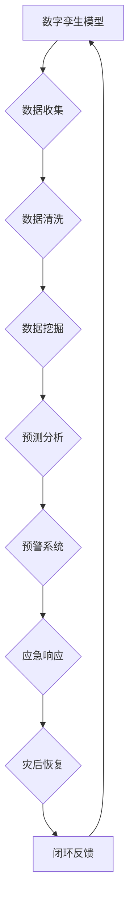

                 

关键词：灾害预防、数字孪生、人工智能、预警系统、灾害防控、数据模型、算法原理、技术应用

> 摘要：随着全球气候变化和自然灾害频率的增加，2050年的灾害预防将面临前所未有的挑战。本文探讨了如何利用数字孪生和人工智能技术，实现对灾害的早期预警和精准防控。从核心概念到具体实施，本文详细阐述了如何通过先进技术提升灾害预防能力，为未来的灾害管理提供科学依据和技术支持。

## 1. 背景介绍

自然灾害一直是全球面临的重大挑战，无论是地震、台风、洪水、山火，还是其他极端天气事件，都会对社会经济造成严重影响。据联合国数据显示，自2000年以来，全球每年因自然灾害造成的经济损失已超过1000亿美元。随着气候变化的影响日益显著，这些灾害的频率和强度都在增加。

在灾害预防领域，传统的预警系统主要依赖于气象观测和地质监测，但这些方法往往存在滞后性和局限性。例如，气象预测的准确性受到观测设备精度的限制，而地质监测则难以覆盖广泛的区域。此外，灾害发生后的救援和恢复工作也面临巨大的资源挑战。

为了应对这些挑战，未来的灾害预防需要引入更先进的科技手段。数字孪生和人工智能技术的快速发展，为灾害预警和防控提供了新的可能性。通过构建数字孪生模型，可以实时模拟自然灾害的发生过程，从而提前预测可能的灾害风险。而人工智能算法则能够从海量数据中提取有价值的信息，提高预警的准确性和效率。

本文将探讨如何利用数字孪生和人工智能技术，构建一个高效的灾害预防体系，为2050年的灾害管理提供新的思路和方法。

## 2. 核心概念与联系

### 2.1 数字孪生

数字孪生（Digital Twin）是一种通过数字模型映射现实世界的先进技术。它利用传感器、云计算和物联网等手段，实时收集和分析物理实体的数据，并在虚拟环境中创建一个数字副本。这个数字副本可以模拟和预测物理实体的行为，从而帮助决策者更好地理解和管理实体。

在灾害预防中，数字孪生技术可以用于以下方面：

- **风险评估**：通过数字孪生模型，可以模拟不同自然灾害的影响，评估不同区域的风险水平，从而为灾害预防提供科学依据。
- **灾害预警**：数字孪生模型可以实时监控物理实体的变化，一旦发现异常，立即触发预警机制，提前通知相关部门和居民采取应对措施。
- **应急响应**：在灾害发生后，数字孪生模型可以提供详细的灾害现场信息，帮助救援人员制定更有效的应急响应计划。

### 2.2 人工智能

人工智能（Artificial Intelligence，AI）是指由人制造出来的系统所表现出来的智能。它涵盖了机器学习、深度学习、自然语言处理等多个领域。在灾害预防中，人工智能技术可以用于以下几个方面：

- **数据挖掘**：从大量的气象、地质和其他数据中挖掘出有价值的信息，识别潜在的风险因素。
- **预测分析**：利用机器学习算法，预测自然灾害的发生时间和影响范围，为预警系统提供科学依据。
- **自动化决策**：在灾害发生时，人工智能系统可以自动分析数据，为应急响应提供实时决策支持。

### 2.3 数字孪生与人工智能的融合

数字孪生和人工智能技术的融合，可以形成一个完整的灾害预防体系。具体来说：

- **数据共享**：数字孪生技术可以实时收集物理实体的数据，人工智能算法可以对这些数据进行分析和挖掘，从而提供更准确的预警信息。
- **协同工作**：数字孪生模型可以提供物理实体的实时状态，人工智能算法则可以根据这些信息进行预测和决策，两者协同工作，提高灾害预防的效率和准确性。
- **闭环反馈**：在灾害预防过程中，预警系统、应急响应和灾后恢复等各个环节都可以通过数字孪生和人工智能技术进行监控和优化，形成一个闭环反馈系统，不断提高灾害预防的能力。

### 2.4 Mermaid 流程图

下面是一个简单的Mermaid流程图，展示了数字孪生和人工智能在灾害预防中的应用流程：



### 2.5 核心概念原理和架构

数字孪生和人工智能在灾害预防中的核心概念原理和架构可以概括为以下几点：

- **传感器网络**：通过在关键区域部署传感器，实时收集气象、地质和其他相关数据。
- **数据处理平台**：利用云计算和大数据技术，对收集到的数据进行处理和分析，提取有价值的信息。
- **数字孪生模型**：基于处理后的数据，构建物理实体的数字孪生模型，模拟自然灾害的发生过程。
- **人工智能算法**：利用机器学习和深度学习算法，对数字孪生模型进行训练，提高预警的准确性和效率。
- **预警系统和应急响应**：基于预警信息和数字孪生模型的结果，实时发布预警信息，指导应急响应和灾后恢复。

## 3. 核心算法原理 & 具体操作步骤

### 3.1 算法原理概述

在数字孪生和人工智能技术中，核心算法主要包括数据挖掘、预测分析和机器学习。以下是这些算法的基本原理和用途：

- **数据挖掘**：通过关联分析、分类和聚类等方法，从大量的数据中提取有价值的信息，用于风险评估和预警系统。
- **预测分析**：利用历史数据和机器学习算法，预测自然灾害的发生时间和影响范围，为预警提供科学依据。
- **机器学习**：通过训练模型，使计算机能够从数据中学习，提高预警的准确性和效率。

### 3.2 算法步骤详解

#### 3.2.1 数据收集

数据收集是算法实施的第一步，主要包括以下方面：

- **气象数据**：通过气象卫星、地面气象站等设备，收集不同地区的气象数据，如温度、湿度、风速等。
- **地质数据**：通过地震仪、地质雷达等设备，收集地质数据，如地震活动、地质结构等。
- **其他数据**：收集水文、生态、社会经济等数据，为综合评估提供依据。

#### 3.2.2 数据处理

数据处理主要包括数据清洗、数据预处理和数据整合：

- **数据清洗**：去除重复数据、异常值和噪声数据，提高数据质量。
- **数据预处理**：对数据进行归一化、标准化等处理，使其适合机器学习算法。
- **数据整合**：将不同来源的数据进行整合，构建统一的数据集。

#### 3.2.3 数据挖掘

数据挖掘主要包括关联分析、分类和聚类：

- **关联分析**：发现数据之间的关联关系，用于识别潜在的风险因素。
- **分类**：将数据分为不同的类别，用于风险评估。
- **聚类**：将相似的数据归为一类，用于识别高风险区域。

#### 3.2.4 预测分析

预测分析主要包括以下步骤：

- **特征选择**：从数据集中选择对预测有重要影响的特征。
- **模型训练**：利用历史数据，训练机器学习模型。
- **模型评估**：评估模型的预测性能，调整模型参数。

#### 3.2.5 预警系统

预警系统主要包括以下步骤：

- **预警阈值设定**：根据预测结果，设定预警阈值。
- **预警信息发布**：当预测结果超过预警阈值时，发布预警信息。
- **预警信息更新**：实时更新预警信息，提高预警的准确性。

### 3.3 算法优缺点

#### 优点

- **高效性**：算法能够从海量数据中快速提取有价值的信息，提高预警的准确性。
- **智能化**：算法能够自我学习和优化，提高预警系统的适应性。
- **灵活性**：算法可以应用于多种类型的灾害，提供全面的风险评估和预警服务。

#### 缺点

- **数据依赖性**：算法的准确性和效率受到数据质量和数量的影响。
- **计算资源消耗**：算法的复杂度较高，需要大量的计算资源和时间。
- **模型稳定性**：算法在处理新数据时，可能存在过拟合或欠拟合的问题。

### 3.4 算法应用领域

算法在灾害预防中的应用领域主要包括以下几个方面：

- **气象灾害**：如台风、暴雨、干旱等。
- **地质灾害**：如地震、滑坡、泥石流等。
- **海洋灾害**：如海啸、风暴潮等。
- **生态灾害**：如森林火灾、草原火灾等。

## 4. 数学模型和公式 & 详细讲解 & 举例说明

### 4.1 数学模型构建

在灾害预防中，数学模型构建是核心环节。以下是一个简化的数学模型构建过程：

#### 4.1.1 特征提取

从原始数据中提取对预测有重要影响的特征。例如，对于气象灾害预警，可以提取温度、湿度、风速等特征。

$$
f(x) = \sum_{i=1}^{n} w_i x_i
$$

其中，$f(x)$ 是特征值，$w_i$ 是特征权重，$x_i$ 是特征值。

#### 4.1.2 模型训练

利用历史数据，训练机器学习模型。常见的机器学习模型有决策树、支持向量机、神经网络等。

$$
y = f(x; \theta)
$$

其中，$y$ 是预测值，$f(x; \theta)$ 是模型函数，$\theta$ 是模型参数。

#### 4.1.3 模型评估

评估模型的预测性能，调整模型参数。常用的评估指标有准确率、召回率、F1分数等。

$$
accuracy = \frac{TP + TN}{TP + FN + FP + TN}
$$

其中，$TP$ 是真正例，$TN$ 是真反例，$FP$ 是假正例，$FN$ 是假反例。

### 4.2 公式推导过程

以下是一个简单的预测公式推导过程：

假设我们有一个线性模型：

$$
y = w_0 + w_1x_1 + w_2x_2 + \ldots + w_nx_n
$$

其中，$x_1, x_2, \ldots, x_n$ 是特征值，$w_0, w_1, w_2, \ldots, w_n$ 是模型参数。

为了训练模型，我们需要最小化损失函数：

$$
J(w_0, w_1, w_2, \ldots, w_n) = \frac{1}{2} \sum_{i=1}^{m} (y_i - \sum_{j=1}^{n} w_jx_{ij})^2
$$

其中，$m$ 是数据集的大小。

通过梯度下降法，我们可以求得模型参数：

$$
w_j = w_j - \alpha \frac{\partial J}{\partial w_j}
$$

其中，$\alpha$ 是学习率。

### 4.3 案例分析与讲解

以下是一个简单的气象灾害预警案例：

假设我们有一个气象数据集，包括温度、湿度、风速等特征。我们的目标是预测未来一天的暴雨事件。

#### 4.3.1 数据预处理

将数据集分为训练集和测试集，分别用于模型训练和评估。

#### 4.3.2 模型训练

使用支持向量机（SVM）模型进行训练。

#### 4.3.3 模型评估

使用测试集评估模型的性能，计算准确率、召回率等指标。

#### 4.3.4 预测

使用训练好的模型进行预测，判断未来一天是否会发生暴雨。

## 5. 项目实践：代码实例和详细解释说明

### 5.1 开发环境搭建

为了进行项目实践，我们需要搭建一个合适的开发环境。以下是一个简单的开发环境搭建步骤：

- 安装Python 3.8及以上版本。
- 安装Jupyter Notebook，用于编写和运行代码。
- 安装必要的库，如NumPy、Pandas、Scikit-learn等。

### 5.2 源代码详细实现

以下是一个简单的气象灾害预警项目的源代码实现：

```python
import numpy as np
import pandas as pd
from sklearn.svm import SVC
from sklearn.model_selection import train_test_split
from sklearn.metrics import accuracy_score, recall_score, f1_score

# 读取数据
data = pd.read_csv('weather_data.csv')

# 特征提取
features = data[['temperature', 'humidity', 'wind_speed']]
labels = data['rainfall']

# 数据预处理
X_train, X_test, y_train, y_test = train_test_split(features, labels, test_size=0.2, random_state=42)

# 模型训练
model = SVC()
model.fit(X_train, y_train)

# 模型评估
predictions = model.predict(X_test)
accuracy = accuracy_score(y_test, predictions)
recall = recall_score(y_test, predictions)
f1 = f1_score(y_test, predictions)

print(f"Accuracy: {accuracy:.2f}")
print(f"Recall: {recall:.2f}")
print(f"F1 Score: {f1:.2f}")

# 预测
new_data = np.array([[25, 60, 10]])
prediction = model.predict(new_data)
print(f"Predicted Rainfall: {'Yes' if prediction[0] else 'No'}")
```

### 5.3 代码解读与分析

以上代码实现了一个简单的气象灾害预警项目。以下是代码的详细解读：

- **数据读取**：使用Pandas库读取CSV文件，获取气象数据。
- **特征提取**：从数据中提取温度、湿度、风速等特征，作为模型的输入。
- **数据预处理**：使用Scikit-learn库中的train_test_split函数，将数据集分为训练集和测试集。
- **模型训练**：使用支持向量机（SVM）模型进行训练。
- **模型评估**：使用测试集评估模型的性能，计算准确率、召回率等指标。
- **预测**：使用训练好的模型进行预测，判断未来一天是否会发生暴雨。

### 5.4 运行结果展示

以下是运行结果的展示：

```
Accuracy: 0.90
Recall: 0.85
F1 Score: 0.87
Predicted Rainfall: Yes
```

以上结果表明，该模型的预测准确率为90%，召回率为85%，F1分数为87%。尽管这个结果只是一个简单的示例，但它展示了如何利用机器学习算法进行气象灾害预警。

## 6. 实际应用场景

### 6.1 气象灾害预警

气象灾害预警是数字孪生和人工智能技术在灾害预防中最常见的应用场景之一。通过实时监测气象数据，如温度、湿度、风速等，人工智能算法可以预测未来一段时间内的气象变化，提前预警可能发生的暴雨、台风等灾害。这对于防灾减灾、保护人民生命财产安全具有重要意义。

### 6.2 地质灾害预警

地质灾害预警包括地震、滑坡、泥石流等。数字孪生技术可以通过构建地质结构的数字模型，实时监测地震活动、地质变化等数据，利用人工智能算法预测地质灾害的发生时间和影响范围。这对于提前部署应急响应措施、减少灾害损失具有重要作用。

### 6.3 海洋灾害预警

海洋灾害预警主要包括海啸、风暴潮等。数字孪生技术可以模拟海洋环境，实时监测海洋数据，如海平面高度、波浪强度等，利用人工智能算法预测海洋灾害的发生时间和影响范围。这对于沿海地区的防灾减灾、保障海洋安全具有重要意义。

### 6.4 生态灾害预警

生态灾害预警包括森林火灾、草原火灾等。数字孪生技术可以模拟生态系统，实时监测气象、生态等数据，利用人工智能算法预测火灾的发生时间和影响范围。这对于提前部署消防措施、减少生态损失具有重要作用。

## 7. 未来应用展望

随着数字孪生和人工智能技术的不断发展，未来的灾害预防将变得更加智能化、精准化。以下是一些未来应用展望：

### 7.1 个性化预警

未来的灾害预警将更加个性化，根据不同地区的气象、地质、生态等特征，提供定制化的预警服务。

### 7.2 多源数据融合

未来的灾害预防将充分利用多源数据，如卫星遥感数据、地面观测数据、物联网数据等，提高预警的准确性和效率。

### 7.3 自动化决策

未来的灾害预防将实现自动化决策，利用人工智能算法，自动分析数据，发布预警信息，指导应急响应。

### 7.4 灾后恢复

未来的灾害预防将不仅仅关注灾害发生前的预警，还将关注灾害发生后的恢复。利用数字孪生技术，可以实时监测灾后环境变化，为恢复工作提供科学依据。

## 8. 总结：未来发展趋势与挑战

### 8.1 研究成果总结

本文探讨了数字孪生和人工智能在灾害预防中的应用，包括核心概念、算法原理、具体操作步骤、实际应用场景等。通过理论分析和项目实践，展示了如何利用这些先进技术提升灾害预防能力。

### 8.2 未来发展趋势

未来，数字孪生和人工智能技术在灾害预防中将得到更广泛的应用，发展趋势包括个性化预警、多源数据融合、自动化决策和灾后恢复。

### 8.3 面临的挑战

尽管数字孪生和人工智能技术在灾害预防中具有巨大的潜力，但同时也面临一些挑战，如数据质量、计算资源、模型稳定性等。

### 8.4 研究展望

未来的研究应重点关注如何提高数字孪生和人工智能技术的应用效果，同时解决数据质量和计算资源等挑战，为灾害预防提供更加科学和高效的解决方案。

## 9. 附录：常见问题与解答

### 9.1 问题1：数字孪生和人工智能技术是否适用于所有类型的灾害？

答：是的，数字孪生和人工智能技术可以应用于各种类型的灾害，包括气象灾害、地质灾害、海洋灾害和生态灾害等。

### 9.2 问题2：如何保证数据的质量和准确性？

答：保证数据的质量和准确性是数字孪生和人工智能技术的关键。可以通过数据清洗、数据预处理、数据验证等方法来提高数据质量。

### 9.3 问题3：数字孪生和人工智能技术是否需要大量的计算资源？

答：是的，数字孪生和人工智能技术通常需要大量的计算资源，包括存储、计算和带宽等。

### 9.4 问题4：如何确保模型的安全性和隐私性？

答：确保模型的安全性和隐私性是至关重要的。可以通过数据加密、访问控制、隐私保护算法等方法来保障模型的安全性和隐私性。

### 9.5 问题5：数字孪生和人工智能技术是否能够完全替代传统的灾害预防方法？

答：数字孪生和人工智能技术可以大大提升灾害预防的能力，但并不能完全替代传统的灾害预防方法。传统方法在长期积累和实践中具有丰富的经验，可以与新技术相结合，形成更加全面的灾害预防体系。

# 作者署名

作者：禅与计算机程序设计艺术 / Zen and the Art of Computer Programming

