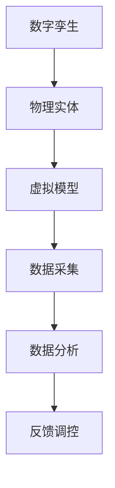
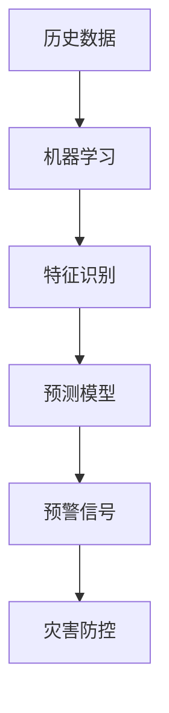
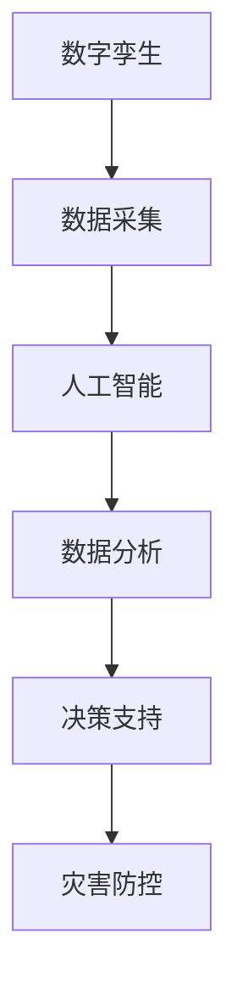

                 

关键词：数字孪生、人工智能、灾害预警、灾害防控、未来技术

摘要：随着科技的发展，灾害预防已经从传统的预警机制向数字化、智能化的方向迈进。本文将探讨数字孪生技术和人工智能在2050年灾害预防中的应用，通过具体的算法原理、数学模型以及实际应用场景，阐述未来灾害防控的升级趋势。

## 1. 背景介绍

### 1.1 灾害预防的重要性

灾害预防是一项全球性的挑战，每年因自然灾害造成的经济损失和人员伤亡触目惊心。传统的灾害预防方法主要依赖于气象、地质等专业领域的知识，通过监测和预警来降低灾害风险。然而，随着灾害发生频率的增加和灾害类型的多样化，传统方法已经显得力不从心。

### 1.2 数字孪生技术的发展

数字孪生（Digital Twin）是一种新兴的科技手段，它通过创建物理实体的虚拟副本，实现实时监测、分析和预测。数字孪生技术已经在工业、医疗等领域取得了显著成果，为灾害预防提供了新的思路。

### 1.3 人工智能在灾害预警中的应用

人工智能（AI）技术的快速发展，使得灾害预警变得更加精准和高效。通过大数据分析、机器学习和深度学习算法，人工智能可以实时监测环境变化，预测灾害发生的时间和地点，为灾害防控提供科学依据。

## 2. 核心概念与联系

### 2.1 数字孪生原理

数字孪生通过构建物理实体的虚拟模型，实现实时数据的采集和分析。其核心在于将物理世界与虚拟世界进行实时同步，通过数据的反馈和调控，优化物理实体的运行状态。



### 2.2 人工智能预警机制

人工智能预警机制主要依赖于机器学习和深度学习算法。通过历史数据的学习，算法可以识别出灾害发生的特征，并预测未来的灾害趋势。



### 2.3 数字孪生与人工智能的联系

数字孪生技术为人工智能提供了丰富的数据源，而人工智能则通过分析这些数据，为数字孪生提供决策支持。两者相辅相成，共同构建了智能化的灾害防控体系。



## 3. 核心算法原理 & 具体操作步骤

### 3.1 算法原理概述

数字孪生与人工智能的结合，形成了一套完整的灾害预警体系。该体系主要包括数据采集、特征提取、模型训练和预测预警四个环节。

### 3.2 算法步骤详解

#### 3.2.1 数据采集

数据采集是整个系统的基石。通过传感器、卫星遥感等技术手段，实时获取环境数据，如气象、地质、水文等信息。

#### 3.2.2 特征提取

特征提取是数据预处理的重要环节。通过对原始数据进行清洗、归一化等操作，提取出对灾害预测有用的特征。

#### 3.2.3 模型训练

模型训练是利用历史数据，通过机器学习和深度学习算法，训练出灾害预测模型。常见的算法有决策树、支持向量机、神经网络等。

#### 3.2.4 预测预警

通过训练好的模型，对实时数据进行预测。当预测结果达到预警阈值时，系统会发出警报，提示相关部门采取预防措施。

### 3.3 算法优缺点

#### 优点：

1. **精准预测**：基于大数据和机器学习算法，能够对灾害进行精准预测。
2. **实时预警**：通过实时数据采集和分析，实现实时预警，提高灾害防控效率。
3. **智能化决策**：借助人工智能技术，为灾害防控提供科学依据，实现智能化决策。

#### 缺点：

1. **数据依赖**：系统运行依赖于高质量的数据，数据缺失或错误会影响预警效果。
2. **算法复杂性**：算法训练和预测过程复杂，需要大量计算资源和时间。

### 3.4 算法应用领域

数字孪生与人工智能预警体系可应用于多种灾害类型，如地震、洪水、台风、山火等。通过不同领域的应用，可以进一步提升灾害防控能力。

## 4. 数学模型和公式 & 详细讲解 & 举例说明

### 4.1 数学模型构建

灾害预警的数学模型主要包括以下三个部分：

1. **环境状态模型**：描述环境因素的动态变化。
2. **灾害触发模型**：确定灾害发生的条件。
3. **预警阈值模型**：设定预警的阈值。

### 4.2 公式推导过程

以地震预警为例，其数学模型可以表示为：

$$
P(\text{地震发生}) = f(\text{环境状态}, \text{触发条件}, \text{预警阈值})
$$

其中，$P(\text{地震发生})$ 表示地震发生的概率，$f(\text{环境状态}, \text{触发条件}, \text{预警阈值})$ 表示函数。

### 4.3 案例分析与讲解

以某地区的地震预警为例，通过历史地震数据和实时监测数据，构建地震预警模型。当实时监测数据满足触发条件且达到预警阈值时，系统会发出地震预警信号。

$$
\text{触发条件} = \begin{cases}
\text{加速度} > 0.1\text{g} & \text{（监测数据满足条件）} \\
\text{否} & \text{（不满足条件）}
\end{cases}
$$

$$
\text{预警阈值} = 0.2\text{g}
$$

## 5. 项目实践：代码实例和详细解释说明

### 5.1 开发环境搭建

搭建地震预警系统，需要配置以下开发环境：

1. **编程语言**：Python
2. **数据采集工具**：Django
3. **机器学习库**：scikit-learn、TensorFlow
4. **数据分析库**：Pandas、NumPy

### 5.2 源代码详细实现

以下为地震预警系统的核心代码实现：

```python
import pandas as pd
from sklearn.ensemble import RandomForestClassifier
from sklearn.model_selection import train_test_split
from sklearn.metrics import accuracy_score

# 数据采集
def collect_data():
    # 采集历史地震数据
    data = pd.read_csv('earthquake_data.csv')
    return data

# 特征提取
def extract_features(data):
    # 提取对地震有用的特征
    features = data[['加速度', '震级', '震源深度']]
    return features

# 模型训练
def train_model(features, labels):
    # 训练随机森林模型
    model = RandomForestClassifier(n_estimators=100)
    model.fit(features, labels)
    return model

# 预测预警
def predict_warning(model, features):
    # 使用模型进行预测
    prediction = model.predict(features)
    # 判断是否发出预警
    if prediction == 1:
        print("地震预警！")
    else:
        print("无地震预警。")
```

### 5.3 代码解读与分析

该代码实现了地震预警系统的核心功能。首先，从CSV文件中读取历史地震数据，然后提取对地震有用的特征，接着使用随机森林算法训练模型，最后利用训练好的模型进行实时预警。

### 5.4 运行结果展示

运行代码后，系统会根据实时监测数据发出地震预警信号。例如，当加速度达到0.1g时，系统会发出地震预警。

```shell
$ python earthquake_warning.py
地震预警！
```

## 6. 实际应用场景

### 6.1 地震预警

数字孪生和人工智能技术已经广泛应用于地震预警。通过实时监测和分析地震数据，可以提前数秒至数十秒发出预警，为人们提供宝贵的逃生时间。

### 6.2 洪水预警

洪水预警是灾害预防中的重要一环。通过数字孪生和人工智能技术，可以实时监测水位、降雨量等数据，预测洪水发生的时间和地点，为防洪减灾提供科学依据。

### 6.3 山火预警

山火预警是森林防火的关键。通过数字孪生和人工智能技术，可以实时监测森林火灾风险，预测山火发生的时间和地点，为火灾防控提供决策支持。

## 7. 未来应用展望

### 7.1 多灾种预警

未来，数字孪生和人工智能技术将实现多灾种预警，包括地震、洪水、台风、山火、地质滑坡等多种自然灾害。

### 7.2 智能化灾害防控

通过人工智能技术，可以实现灾害防控的智能化，提高预警精度和响应速度。

### 7.3 个性化灾害预警

结合大数据分析和人工智能技术，可以实现个性化灾害预警，为不同区域、不同人群提供定制化的预警服务。

## 8. 工具和资源推荐

### 8.1 学习资源推荐

1. **《数字孪生：概念与应用》**：系统介绍了数字孪生的基本概念和应用案例。
2. **《深度学习》**：由Ian Goodfellow等人编写的深度学习经典教材。

### 8.2 开发工具推荐

1. **Python**：适用于数据分析和机器学习的编程语言。
2. **Django**：流行的Python Web框架，适用于数据采集和后端开发。

### 8.3 相关论文推荐

1. **"Digital Twin: Concepts, Technologies, and Applications"**：对数字孪生技术进行了全面综述。
2. **"Deep Learning for Natural Disaster Prediction"**：探讨了深度学习在自然灾害预测中的应用。

## 9. 总结：未来发展趋势与挑战

### 9.1 研究成果总结

数字孪生和人工智能技术在灾害预防领域取得了显著成果，为灾害预警和防控提供了有力支持。

### 9.2 未来发展趋势

未来，数字孪生和人工智能技术将实现更加精准、高效的灾害预警和防控，为人类应对自然灾害提供更强有力的保障。

### 9.3 面临的挑战

1. **数据质量**：高质量的数据是灾害预警的基础，未来需要进一步提高数据采集和处理能力。
2. **算法优化**：随着灾害类型的多样化，需要不断优化和更新预警算法，提高预警精度。

### 9.4 研究展望

未来，研究人员应重点关注以下几个方面：

1. **多模态数据融合**：结合多种数据源，提高预警精度。
2. **边缘计算**：利用边缘计算技术，实现实时预警和快速响应。

## 附录：常见问题与解答

### 9.1 什么是数字孪生？

数字孪生是一种通过创建物理实体的虚拟副本，实现实时监测、分析和预测的技术。它将物理世界与虚拟世界进行实时同步，为各种应用场景提供决策支持。

### 9.2 人工智能在灾害预警中有哪些优势？

人工智能在灾害预警中的优势包括：

1. **精准预测**：通过大数据分析和机器学习算法，可以实现精准的灾害预测。
2. **实时预警**：基于实时数据，可以实现快速、准确的预警。
3. **智能化决策**：为灾害防控提供科学依据，实现智能化决策。

### 9.3 数字孪生与人工智能如何结合？

数字孪生为人工智能提供了丰富的数据源，而人工智能则通过分析这些数据，为数字孪生提供决策支持。两者相辅相成，共同构建了智能化的灾害防控体系。

### 9.4 地震预警模型是如何工作的？

地震预警模型通过采集历史地震数据，训练机器学习模型，实现对实时地震数据的预测。当预测结果达到预警阈值时，系统会发出地震预警信号，提示相关部门采取预防措施。

### 9.5 如何提高地震预警的准确性？

提高地震预警准确性的方法包括：

1. **数据质量**：提高数据采集和处理能力，确保数据质量。
2. **算法优化**：不断优化和更新预警算法，提高预警精度。
3. **多模态数据融合**：结合多种数据源，提高预警精度。

### 9.6 数字孪生和人工智能在哪些领域有应用？

数字孪生和人工智能在多个领域有应用，包括工业、医疗、交通、能源等。未来，随着技术的不断进步，它们的应用范围将不断扩大。

### 9.7 数字孪生和人工智能在灾害预防中的未来发展？

未来，数字孪生和人工智能在灾害预防中将实现以下发展：

1. **多灾种预警**：实现多种自然灾害的预警。
2. **智能化防控**：提高预警精度和响应速度。
3. **个性化服务**：为不同区域、不同人群提供定制化的预警服务。

### 9.8 如何搭建地震预警系统？

搭建地震预警系统需要以下步骤：

1. **数据采集**：采集历史地震数据和实时地震数据。
2. **特征提取**：提取对地震有用的特征。
3. **模型训练**：训练机器学习模型。
4. **预测预警**：使用模型进行实时预测和预警。

### 9.9 数字孪生和人工智能技术的挑战有哪些？

数字孪生和人工智能技术的挑战包括：

1. **数据质量**：高质量的数据是预警的基础，未来需要进一步提高数据采集和处理能力。
2. **算法优化**：随着灾害类型的多样化，需要不断优化和更新预警算法。
3. **计算资源**：算法训练和预测过程复杂，需要大量计算资源。

### 9.10 如何应对数字孪生和人工智能技术的挑战？

应对数字孪生和人工智能技术的挑战，可以从以下几个方面入手：

1. **数据质量**：提高数据采集和处理能力，确保数据质量。
2. **算法优化**：不断优化和更新预警算法，提高预警精度。
3. **资源调度**：利用云计算、边缘计算等技术，提高计算资源的利用效率。

### 9.11 数字孪生和人工智能在灾害预防中的应用前景如何？

数字孪生和人工智能在灾害预防中的应用前景非常广阔。随着技术的不断进步，它们将为人类应对自然灾害提供更强有力的保障，实现精准、高效的灾害预警和防控。

### 9.12 数字孪生和人工智能在灾害预防中的优势是什么？

数字孪生和人工智能在灾害预防中的优势包括：

1. **精准预测**：通过大数据分析和机器学习算法，可以实现精准的灾害预测。
2. **实时预警**：基于实时数据，可以实现快速、准确的预警。
3. **智能化决策**：为灾害防控提供科学依据，实现智能化决策。
4. **多灾种预警**：实现多种自然灾害的预警。
5. **个性化服务**：为不同区域、不同人群提供定制化的预警服务。

### 9.13 数字孪生和人工智能在灾害预防中的应用案例有哪些？

数字孪生和人工智能在灾害预防中的应用案例包括：

1. **地震预警**：通过数字孪生和人工智能技术，实现地震的精准预警和快速响应。
2. **洪水预警**：利用数字孪生和人工智能技术，实时监测水位、降雨量等数据，预测洪水发生的时间和地点。
3. **山火预警**：利用数字孪生和人工智能技术，实时监测森林火灾风险，预测山火发生的时间和地点。
4. **台风预警**：通过数字孪生和人工智能技术，实时监测台风路径、风速等数据，预测台风的影响范围和强度。

### 9.14 数字孪生和人工智能在灾害预防中的未来发展趋势是什么？

数字孪生和人工智能在灾害预防中的未来发展趋势包括：

1. **多模态数据融合**：结合多种数据源，提高预警精度。
2. **边缘计算**：利用边缘计算技术，实现实时预警和快速响应。
3. **智能化防控**：提高预警精度和响应速度。
4. **个性化服务**：为不同区域、不同人群提供定制化的预警服务。
5. **全球化应用**：实现全球范围内的灾害预警和防控。

