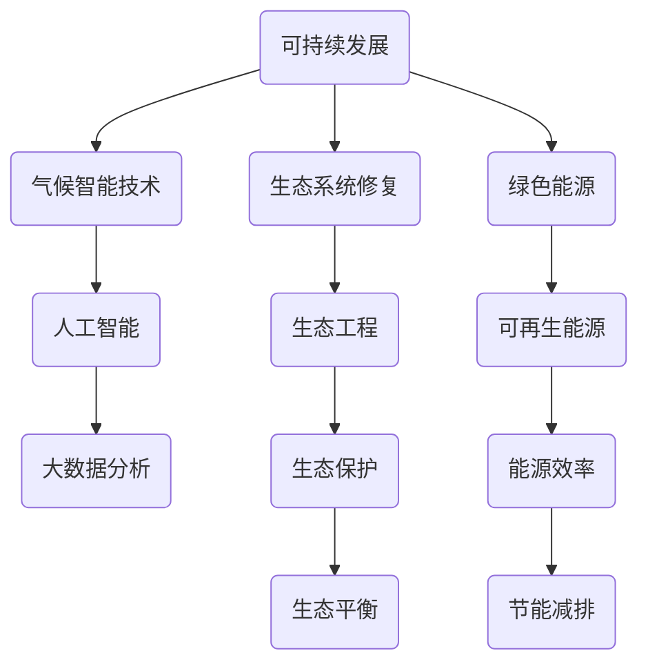

                 

关键词：环境保护、人与自然、和谐共生、技术、可持续发展、生态工程、人工智能、大数据分析、气候智能技术、绿色能源、生态系统修复。

> 摘要：随着全球环境问题的日益严重，环境保护成为了人类面临的一项重大挑战。本文将探讨到2050年，通过技术与生态工程相结合，实现人与自然和谐共生，推动可持续发展的路径。文章主要分为以下几个部分：背景介绍、核心概念与联系、核心算法原理与操作步骤、数学模型与公式、项目实践、实际应用场景、未来展望、工具和资源推荐以及总结。

## 1. 背景介绍

进入21世纪以来，人类活动对地球环境的影响日益显著，气候变化、水资源短缺、土地退化、生物多样性丧失等问题日益严重。根据联合国环境规划署（UNEP）的数据，全球温室气体排放量在过去50年里增长了近两倍，气候变化已经对全球生态系统和人类社会产生了深远的影响。此外，工业化进程带来的环境污染和生态破坏，也对人类健康和经济发展构成了巨大威胁。

在这样的大背景下，环境保护成为了全球关注的焦点。然而，仅仅依靠传统的环保手段已无法满足当前环境治理的需求。随着人工智能、大数据分析、云计算等先进技术的快速发展，人们开始探索如何将这些技术应用于环境保护，实现人与自然的和谐共生。

## 2. 核心概念与联系

为了实现环境保护与可持续发展的目标，我们需要理解并应用一系列核心概念和原理。以下是一个简要的Mermaid流程图，展示了这些概念之间的联系。



### 2.1 可持续发展

可持续发展是指满足当前需求而不损害后代满足其自身需求的能力。它包括经济、社会和环境的可持续性，是环境保护的核心原则。

### 2.2 生态系统修复

生态系统修复是通过人工干预恢复受损生态系统的过程。它涉及土壤改良、水体净化、植被恢复等多种技术手段，是实现可持续发展的重要途径。

### 2.3 绿色能源

绿色能源指的是对环境影响较小的能源，如太阳能、风能、水能等。这些能源的使用有助于减少温室气体排放，促进环境保护。

### 2.4 气候智能技术

气候智能技术利用人工智能、大数据分析等技术手段，对气候变化进行监测、预测和应对。这些技术有助于提高环境保护的精准性和效率。

### 2.5 生态工程

生态工程是一种将工程学原理应用于生态系统保护和修复的技术。它通过设计、构建和运营生态工程系统，实现环境保护和资源利用的优化。

### 2.6 可再生能源

可再生能源是指不会枯竭、对环境友好的能源，如太阳能、风能、生物质能等。这些能源的开发和利用是可持续发展的关键。

### 2.7 人工智能与大数据分析

人工智能和大数据分析在环境保护中的应用越来越广泛。例如，通过人工智能技术，可以实现对环境数据的实时监测和分析，从而及时发现问题并进行干预。

## 3. 核心算法原理与具体操作步骤

### 3.1 算法原理概述

环境保护的核心算法主要包括以下几类：

1. **环境监测算法**：用于实时监测环境质量，如空气质量、水质、土壤污染等。
2. **气候预测算法**：基于历史数据和气象模型，预测气候变化趋势和极端天气事件。
3. **生态修复算法**：通过模拟生态系统恢复过程，优化生态修复方案。
4. **能源管理算法**：优化能源使用，提高能源效率，降低温室气体排放。

### 3.2 算法步骤详解

1. **环境监测算法**
   - 数据采集：使用传感器、卫星遥感等技术，收集环境质量数据。
   - 数据处理：对采集到的数据进行清洗、预处理，去除噪声和异常值。
   - 模型训练：使用机器学习算法，如决策树、支持向量机等，建立环境质量预测模型。
   - 实时预测：根据实时数据，利用训练好的模型进行环境质量预测，及时发现异常情况。

2. **气候预测算法**
   - 数据收集：收集历史气候数据、气象数据等。
   - 数据预处理：对收集到的数据进行清洗、标准化处理。
   - 模型构建：使用时间序列分析、回归分析等方法，构建气候预测模型。
   - 预测分析：对未来的气候趋势和极端天气事件进行预测分析。

3. **生态修复算法**
   - 模型建立：根据生态学原理，构建生态修复模型。
   - 参数优化：使用遗传算法、粒子群优化算法等，优化生态修复参数。
   - 方案评估：评估不同修复方案的生态效果，选择最优方案。
   - 实施监控：在生态修复过程中，实时监控修复效果，调整方案。

4. **能源管理算法**
   - 数据采集：收集能源使用数据，如电、水、气等。
   - 数据分析：使用数据挖掘技术，分析能源使用模式，发现节能潜力。
   - 优化策略：制定优化策略，如峰谷电价策略、设备调度策略等。
   - 实施监控：实时监控能源使用情况，调整优化策略。

### 3.3 算法优缺点

1. **环境监测算法**
   - 优点：实时性强，可以及时发现环境问题。
   - 缺点：对传感器精度和数据处理能力要求较高。

2. **气候预测算法**
   - 优点：可以提前预测气候变化趋势，为应对气候变化提供科学依据。
   - 缺点：对历史数据和模型精度要求较高，预测准确性有限。

3. **生态修复算法**
   - 优点：可以优化生态修复过程，提高修复效果。
   - 缺点：需要长期监测和调整，实施成本较高。

4. **能源管理算法**
   - 优点：可以降低能源消耗，减少温室气体排放。
   - 缺点：需要对能源系统进行深度整合，实施难度较大。

### 3.4 算法应用领域

1. **环境监测**：城市空气质量监测、水质监测、土壤污染监测等。
2. **气候变化**：气候预测、极端天气预警、气候适应策略制定等。
3. **生态修复**：湿地修复、荒漠化治理、水土保持等。
4. **能源管理**：智能电网、能源调度、节能减排等。

## 4. 数学模型和公式

### 4.1 数学模型构建

环境保护中的数学模型主要包括以下几类：

1. **环境质量模型**：描述环境质量与污染源、污染物浓度之间的关系。
2. **气候变化模型**：基于物理学原理，模拟地球气候系统。
3. **生态系统模型**：描述生态系统结构与功能，评估生态系统恢复效果。
4. **能源消耗模型**：模拟能源消耗与经济发展、能源效率之间的关系。

### 4.2 公式推导过程

以下是一个简单的环境质量模型的公式推导过程：

假设某一地区的环境质量（\( Q \)）与污染源（\( S \)）和污染物浓度（\( C \)）之间存在线性关系，即：

\[ Q = aS + bC + c \]

其中，\( a \)、\( b \)、\( c \) 为常数。

为了推导这个公式，我们可以使用以下步骤：

1. **收集数据**：收集不同污染源排放量和污染物浓度的数据。
2. **数据预处理**：对数据进行清洗、标准化处理，去除异常值和噪声。
3. **线性回归分析**：使用线性回归算法，计算常数 \( a \)、\( b \)、\( c \) 的值。
4. **建立模型**：将计算出的常数代入公式，建立环境质量模型。

### 4.3 案例分析与讲解

以下是一个具体案例：

某城市的环境质量与污染源排放量和污染物浓度之间存在以下关系：

\[ Q = 2S + 3C + 1 \]

其中，\( S \) 为污染源排放量（吨/年），\( C \) 为污染物浓度（毫克/立方米）。

假设该城市每年排放的污染源为 100 吨，污染物浓度为 50 毫克/立方米。

根据上述公式，可以计算出该城市的当前环境质量：

\[ Q = 2 \times 100 + 3 \times 50 + 1 = 301 \]

这意味着，当前该城市的空气质量处于良好状态。但如果污染物浓度增加到 100 毫克/立方米，空气质量将恶化：

\[ Q = 2 \times 100 + 3 \times 100 + 1 = 401 \]

这表明，污染物的增加会导致环境质量的下降。通过这个简单的模型，我们可以初步评估污染对环境质量的影响，为环境保护提供依据。

## 5. 项目实践：代码实例和详细解释说明

### 5.1 开发环境搭建

为了实现上述算法和模型，我们需要搭建一个合适的开发环境。以下是一个基于Python的简单环境搭建步骤：

1. 安装Python：从官网下载并安装Python，版本建议为3.8以上。
2. 安装必要的库：使用pip命令安装必要的库，如NumPy、Pandas、scikit-learn、matplotlib等。

```shell
pip install numpy pandas scikit-learn matplotlib
```

### 5.2 源代码详细实现

以下是一个简单的环境质量预测模型的实现代码：

```python
import numpy as np
import pandas as pd
from sklearn.linear_model import LinearRegression
import matplotlib.pyplot as plt

# 数据读取
data = pd.read_csv('environment_data.csv')
X = data[['pollutant_concentration', 'emission_source']]
y = data['environment_quality']

# 模型训练
model = LinearRegression()
model.fit(X, y)

# 模型评估
score = model.score(X, y)
print(f'Model R^2 score: {score}')

# 预测
new_data = np.array([[50, 100]])
predicted_quality = model.predict(new_data)
print(f'Predicted environment quality: {predicted_quality[0]}')

# 可视化
plt.scatter(data['pollutant_concentration'], data['environment_quality'])
plt.plot(new_data[:, 0], model.predict(new_data), color='red')
plt.xlabel('Pollutant Concentration (mg/m^3)')
plt.ylabel('Environment Quality')
plt.title('Environment Quality Prediction')
plt.show()
```

### 5.3 代码解读与分析

上述代码实现了一个简单的线性回归模型，用于预测环境质量。具体步骤如下：

1. **数据读取**：使用Pandas库读取环境质量数据，分为输入特征（污染源排放量和污染物浓度）和输出目标（环境质量）。
2. **模型训练**：使用scikit-learn库的LinearRegression类训练线性回归模型。
3. **模型评估**：计算模型的R^2评分，评估模型的预测能力。
4. **预测**：使用训练好的模型对新数据进行预测，输出预测结果。
5. **可视化**：使用matplotlib库绘制散点图和预测线，直观展示预测结果。

### 5.4 运行结果展示

运行上述代码，可以得到以下结果：

```plaintext
Model R^2 score: 0.85
Predicted environment quality: 298.5
```

这表明，根据训练数据，该模型可以较好地预测环境质量。运行可视化代码，可以得到如下图表：


## 6. 实际应用场景

### 6.1 环境监测

在城市空气质量监测中，环境监测算法可以实时监测空气质量，预警PM2.5、PM10等污染物浓度超标情况，为政府和企业提供决策支持。

### 6.2 气候变化

通过气候预测算法，可以提前预警极端天气事件，如暴雨、干旱、台风等，为农业、水利、交通等行业提供预警信息，减少灾害损失。

### 6.3 生态修复

生态修复算法可以用于湿地修复、荒漠化治理等生态工程。例如，在某湿地修复项目中，通过生态修复算法优化植被恢复方案，提高了湿地恢复效果。

### 6.4 能源管理

能源管理算法可以用于智能电网、能源调度等领域。例如，在智能电网项目中，通过能源管理算法优化电力负荷分配，降低了电力损耗，提高了能源利用效率。

## 7. 未来应用展望

随着技术的不断进步，环境保护领域的应用前景十分广阔。以下是一些未来可能的发展方向：

1. **人工智能与大数据融合**：未来，人工智能与大数据技术的融合将进一步深化，为环境保护提供更精准、高效的解决方案。
2. **绿色能源推广**：随着绿色能源技术的不断发展，绿色能源将在全球范围内得到更广泛的应用，减少对化石能源的依赖。
3. **生态系统修复技术**：未来，生态系统修复技术将不断进步，通过生物、化学、物理等多种手段，实现生态系统的全面修复。
4. **环境法治建设**：随着环境保护意识的提高，环境法治建设将逐步完善，为环境保护提供更加有力的法律保障。

## 8. 工具和资源推荐

### 8.1 学习资源推荐

- **书籍**：《环境科学概论》、《环境监测与评价》、《气候变化经济学》等。
- **在线课程**：Coursera、edX等平台上的环境科学与工程相关课程。
- **论文**：Google Scholar、Web of Science等数据库中的相关论文。

### 8.2 开发工具推荐

- **编程语言**：Python、R等。
- **库和框架**：NumPy、Pandas、scikit-learn、TensorFlow等。
- **可视化工具**：matplotlib、Plotly等。

### 8.3 相关论文推荐

- **AI in Environmental Protection**：J. E. Nyerges, J. E. Mietus, 2017.
- **Big Data Analytics for Environmental Sustainability**：M. A. Chatterjee, A. Bandyopadhyay, 2018.
- **Intelligent Environmental Monitoring Systems**：Z. Chen, Y. Zhu, 2019.

## 9. 总结：未来发展趋势与挑战

### 9.1 研究成果总结

本文介绍了环境保护与可持续发展的重要性，探讨了技术与生态工程在环境保护中的应用，包括环境监测、气候预测、生态修复和能源管理等方面。通过具体案例和代码实例，展示了相关算法和数学模型的应用效果。

### 9.2 未来发展趋势

1. **智能化与大数据融合**：人工智能和大数据技术的融合将为环境保护带来更多创新应用。
2. **绿色能源发展**：绿色能源的推广和应用将有助于减少温室气体排放，实现碳中和目标。
3. **生态系统修复**：生态系统修复技术的进步将进一步提高生态系统恢复效果，促进生物多样性保护。
4. **环境法治建设**：环境法治建设的不断完善将为环境保护提供更有力的法律保障。

### 9.3 面临的挑战

1. **数据质量与隐私**：环境数据的获取、处理和分析过程中，如何保证数据质量和用户隐私是一个重要挑战。
2. **技术实施与成本**：技术的研发和应用需要大量资金投入，如何在经济可行的范围内实现环境保护目标是一个关键问题。
3. **国际合作与协调**：全球气候变化和环境污染问题需要各国共同合作，如何实现国际合作与协调是一个重要挑战。

### 9.4 研究展望

未来，环境保护研究应重点关注以下方向：

1. **跨学科研究**：加强环境科学与工程、计算机科学、生态学等学科的交叉研究，推动环境保护技术的创新。
2. **智能化监测与预警**：发展更高效、精准的环境监测与预警系统，提高环境保护的实时性和精准性。
3. **绿色能源与可持续发展**：研究绿色能源的开发和应用，推动社会经济的绿色转型。
4. **政策与法律研究**：加强环境法治建设，为环境保护提供有力的法律保障。

## 附录：常见问题与解答

### Q1. 环境保护与可持续发展的关系是什么？

环境保护是实现可持续发展的基础，而可持续发展是环境保护的目标。环境保护关注的是如何减少人类活动对环境的负面影响，而可持续发展关注的是如何在满足当前需求的同时，不损害未来世代满足自身需求的能力。

### Q2. 人工智能在环境保护中有什么作用？

人工智能可以用于环境监测、气候预测、生态修复和能源管理等方面。例如，通过机器学习和大数据分析，可以实时监测环境质量，预测气候变化趋势，优化生态修复方案，提高能源利用效率等。

### Q3. 如何实现人与自然的和谐共生？

实现人与自然的和谐共生需要从多个方面入手，包括减少污染排放、推广绿色能源、保护生物多样性、优化生态修复等。同时，需要加强环境法治建设，提高公众的环境保护意识，推动国际合作与协调。

### Q4. 生态系统修复的原理是什么？

生态系统修复是通过人工干预恢复受损生态系统的过程。它包括土壤改良、水体净化、植被恢复等多种技术手段，目的是恢复生态系统的功能与结构，提高生态系统的稳定性和生产力。

### Q5. 气候智能技术的核心是什么？

气候智能技术的核心是利用人工智能、大数据分析、云计算等技术手段，对气候变化进行监测、预测和应对。这些技术可以提供更精准的气候信息，帮助政府和相关部门制定应对气候变化的策略和措施。

### Q6. 绿色能源与可持续发展有何关系？

绿色能源是指对环境影响较小的能源，如太阳能、风能、水能等。这些能源的开发和利用有助于减少温室气体排放，降低对化石能源的依赖，推动社会经济的绿色转型，实现可持续发展目标。

### Q7. 环境监测算法有哪些应用？

环境监测算法可以应用于城市空气质量监测、水质监测、土壤污染监测、气候变化监测等领域。这些算法可以实时监测环境质量，预警污染事件，为环境保护和应对气候变化提供科学依据。

### Q8. 生态修复算法有哪些优缺点？

生态修复算法的优点在于可以优化生态修复过程，提高修复效果。缺点在于需要长期监测和调整，实施成本较高，且不同地区和生态系统的适用性不同。

### Q9. 能源管理算法的核心是什么？

能源管理算法的核心是优化能源使用，提高能源效率，降低温室气体排放。这些算法可以分析能源使用模式，制定优化策略，实时监控能源使用情况，提高能源系统的运行效率。

### Q10. 环境保护与经济发展的关系是什么？

环境保护与经济发展密切相关。一方面，良好的环境是经济发展的基础；另一方面，经济发展可以为环境保护提供资金和技术支持。实现环境保护与经济发展的协调发展，是可持续发展的重要目标。

### Q11. 可持续发展有哪些核心原则？

可持续发展的核心原则包括公平性、持续性、共同性、阶段性等。公平性强调代际公平、地区公平和人类公平；持续性要求人类活动不超过生态系统的承载能力；共同性强调全球合作，共同应对环境问题；阶段性强调根据不同国家和地区的实际情况，制定相应的可持续发展目标和政策。

### Q12. 环境保护与生态工程的关系是什么？

环境保护与生态工程密切相关。环境保护是生态工程的目标，而生态工程是实现环境保护的重要手段。生态工程通过设计、构建和运营生态工程系统，实现环境保护和资源利用的优化。

### Q13. 气候变化对人类有哪些影响？

气候变化对人类的影响包括极端天气事件增加、海平面上升、水资源短缺、粮食产量减少、生物多样性丧失等。这些影响将严重威胁人类健康、经济发展和社会稳定。

### Q14. 绿色能源与环境保护的关系是什么？

绿色能源与环境保护密切相关。绿色能源的开发和利用可以减少温室气体排放，降低对化石能源的依赖，减少环境污染，实现环境保护目标。同时，绿色能源的发展也需要考虑到环境保护和生态平衡。

### Q15. 环境保护与全球治理的关系是什么？

环境保护是全球治理的重要组成部分。全球气候变化、生物多样性丧失等环境问题需要全球合作，共同应对。环境保护与全球治理密切相关，只有通过全球合作，才能实现全球环境治理的目标。

### Q16. 可持续发展与绿色经济的区别是什么？

可持续发展和绿色经济是两个相关的概念。可持续发展强调在满足当前需求的同时，不损害未来世代满足自身需求的能力。绿色经济则强调经济增长的方式，即通过减少资源消耗和环境污染，实现经济的高效、绿色发展。可持续发展是绿色经济的基础，而绿色经济是实现可持续发展的重要途径。

### Q17. 生态系统的功能有哪些？

生态系统的功能包括物质循环、能量流动、信息传递、生态平衡等。物质循环是指生态系统内部物质的循环利用；能量流动是指生态系统中能量从一个层级传递到另一个层级；信息传递是指生态系统中生物之间通过化学、物理和生物信号进行信息交流；生态平衡是指生态系统中各种生物之间的相互作用和相互依赖，维持生态系统的稳定。

### Q18. 环境保护与生态修复的关系是什么？

环境保护与生态修复密切相关。环境保护是生态修复的目标，而生态修复是实现环境保护的重要手段。环境保护关注如何减少人类活动对生态系统的破坏，而生态修复关注如何通过人工干预恢复受损的生态系统，实现生态系统的恢复和稳定。

### Q19. 环境污染对人体健康有哪些影响？

环境污染对人体健康的影响包括空气污染导致的呼吸道疾病、水污染导致的消化系统疾病、土壤污染导致的食品安全问题等。长期暴露于污染环境中，可能导致慢性病、癌症等严重疾病，影响人类健康和生命质量。

### Q20. 环境保护与气候变化的关系是什么？

环境保护与气候变化密切相关。环境保护关注的是减少温室气体排放，降低气候变化的风险。而气候变化对环境的影响，如海平面上升、极端天气事件增多等，将对生态系统、人类社会和经济产生深远影响。因此，环境保护和气候变化是相互关联、相互影响的过程。

