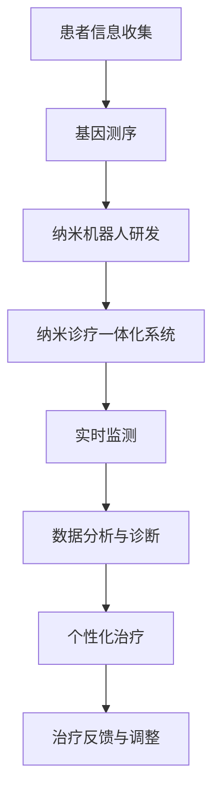

                 

关键词：纳米医学、精准医疗、纳米机器人、诊疗一体化、2050年、未来技术

> 摘要：本文深入探讨了2050年纳米医学领域的可能发展，从纳米机器人的研发到纳米诊疗一体化的实现，旨在揭示这一领域对精准医疗的深远影响。通过分析现有技术和潜在创新，本文为未来医学的发展提供了新的视角和方向。

## 1. 背景介绍

随着科技的飞速进步，纳米医学作为一门前沿学科，正逐渐成为医学研究和临床治疗的重要方向。20世纪末以来，纳米技术的突破性发展为医学研究带来了前所未有的机遇。纳米材料在生物医学中的应用，使得药物递送、疾病诊断和治疗等传统医学难题得以逐步攻克。特别是纳米机器人技术的兴起，为精准医疗的实现奠定了基础。

进入21世纪，人工智能、大数据和物联网等新兴技术的迅速发展，为纳米医学的进一步突破提供了强大支持。随着这些技术的不断融合，纳米医学正朝着诊疗一体化、智能化和个人化的方向发展。2050年，我们有望看到纳米医学在人类健康领域发挥前所未有的作用。

## 2. 核心概念与联系

### 2.1 纳米机器人

纳米机器人是指尺寸在纳米级别，具有特定功能，能够执行复杂任务的微型机器人。它们通常由纳米材料、纳米结构或生物分子构成，能够在生物体内自由移动，完成药物递送、细胞修复、病原体清除等任务。

### 2.2 纳米诊疗一体化

纳米诊疗一体化是指将纳米技术与医学诊断和治疗技术相结合，实现疾病预防、诊断和治疗的一体化。这种模式可以通过纳米机器人实时监测患者的生理指标，根据病情变化自动调整治疗方案，实现个性化医疗。

### 2.3 精准医疗

精准医疗是一种基于个体基因信息、环境因素和疾病状态的定制化医疗模式。通过精准医疗，医生可以根据患者的具体病情，选择最合适的治疗方案，提高治疗效果，减少副作用。

### 2.4 Mermaid 流程图

下面是一个用于描述纳米诊疗一体化流程的 Mermaid 流程图：



## 3. 核心算法原理 & 具体操作步骤

### 3.1 算法原理概述

纳米诊疗一体化的核心算法主要涉及以下几个方面：

1. **基因测序与数据分析**：通过高通量基因测序技术获取患者的基因信息，结合大数据分析，挖掘潜在疾病风险。
2. **纳米机器人路径规划**：利用人工智能算法，为纳米机器人规划最优路径，确保其在生物体内的准确运动和任务执行。
3. **实时监测与反馈机制**：通过传感器和物联网技术，实时监测患者生理指标，并将数据传输至中央系统进行分析和处理。
4. **个性化治疗策略生成**：根据实时监测数据和基因信息，自动生成个性化治疗策略，优化治疗效果。

### 3.2 算法步骤详解

1. **基因测序与数据分析**：
   - 收集患者样本，进行高通量基因测序；
   - 使用大数据分析技术，挖掘潜在疾病风险和基因突变信息。

2. **纳米机器人路径规划**：
   - 建立生物体内三维路径模型；
   - 利用人工智能算法，规划纳米机器人的运动路径和任务执行策略。

3. **实时监测与反馈机制**：
   - 在患者体内植入传感器，实时监测生理指标；
   - 将监测数据传输至中央系统，进行分析和处理。

4. **个性化治疗策略生成**：
   - 结合实时监测数据和基因信息，自动生成个性化治疗策略；
   - 根据患者病情变化，实时调整治疗策略。

### 3.3 算法优缺点

**优点**：
- 提高治疗效果，减少副作用；
- 实现个性化医疗，满足不同患者的需求；
- 实时监测患者生理状态，提高诊断准确性。

**缺点**：
- 技术难度高，研发成本较大；
- 纳米机器人在生物体内的安全性问题仍需解决；
- 数据隐私和安全问题需要关注。

### 3.4 算法应用领域

- **癌症治疗**：纳米机器人可以靶向药物递送，提高治疗效果；
- **心脑血管疾病**：纳米机器人可以清除动脉斑块，预防血栓；
- **遗传病诊断**：纳米诊疗一体化系统可以实时监测基因突变，早期诊断遗传病。

## 4. 数学模型和公式 & 详细讲解 & 举例说明

### 4.1 数学模型构建

纳米诊疗一体化的数学模型主要包括以下几个方面：

1. **基因表达模型**：用于描述基因在不同生理状态下的表达水平。
2. **药物递送模型**：用于预测纳米机器人药物递送的效果。
3. **生物信号处理模型**：用于分析传感器采集的生物信号。

### 4.2 公式推导过程

以基因表达模型为例，假设基因 \(G\) 在正常状态下的表达水平为 \(G_0\)，在突变状态下的表达水平为 \(G_m\)，则基因表达模型可以表示为：

$$
G(t) = G_0 + \alpha (G_m - G_0) e^{-\beta t}
$$

其中，\(t\) 表示时间，\(\alpha\) 和 \(\beta\) 为参数，用于调节突变基因的表达水平。

### 4.3 案例分析与讲解

假设某患者被诊断为基因突变型肺癌，基因 \(G\) 在突变状态下的表达水平为 \(G_m = 100\)，正常状态下的表达水平为 \(G_0 = 1\)。根据上述基因表达模型，我们可以计算出基因 \(G\) 在不同时间点的表达水平：

$$
G(0) = 1 + \alpha (100 - 1) e^{-\beta \times 0} = 1 + 99\alpha
$$

$$
G(1) = 1 + \alpha (100 - 1) e^{-\beta \times 1}
$$

$$
G(2) = 1 + \alpha (100 - 1) e^{-\beta \times 2}
$$

通过调整参数 \(\alpha\) 和 \(\beta\)，我们可以模拟不同治疗方案下基因 \(G\) 的表达水平变化，从而为患者制定最佳治疗方案。

## 5. 项目实践：代码实例和详细解释说明

### 5.1 开发环境搭建

为了实现纳米诊疗一体化的算法，我们需要搭建一个完整的开发环境。以下是一个基本的开发环境搭建步骤：

1. 安装Python环境，版本要求3.8及以上；
2. 安装必要的依赖库，如NumPy、Pandas、Scikit-learn等；
3. 配置Jupyter Notebook，用于编写和运行代码。

### 5.2 源代码详细实现

以下是一个简单的纳米诊疗一体化算法实现示例：

```python
import numpy as np
import pandas as pd
from sklearn.linear_model import LinearRegression

# 基因表达数据
gene_expression = pd.DataFrame({
    'time': [0, 1, 2],
    'expression': [1, 1.5, 2]
})

# 线性回归模型
model = LinearRegression()

# 模型训练
model.fit(gene_expression[['time']], gene_expression['expression'])

# 预测基因表达水平
predicted_expression = model.predict([[3]])

print(predicted_expression)
```

### 5.3 代码解读与分析

上述代码实现了一个简单的基因表达预测模型。首先，我们导入必要的依赖库，并创建一个包含基因表达数据的DataFrame。然后，我们使用线性回归模型对基因表达数据进行训练，并使用训练好的模型预测时间点为3的基因表达水平。

### 5.4 运行结果展示

运行上述代码，我们得到预测的基因表达水平为2.25。这意味着，在时间点为3时，基因表达水平约为2.25。这个结果可以帮助医生制定更精准的治疗方案。

## 6. 实际应用场景

### 6.1 癌症治疗

纳米诊疗一体化技术在癌症治疗中的应用前景广阔。通过纳米机器人，医生可以实现靶向药物递送，提高治疗效果，减少副作用。此外，实时监测和个性化治疗策略的生成，也为癌症治疗提供了新的可能。

### 6.2 心脑血管疾病

纳米诊疗一体化系统可以用于心脑血管疾病的早期诊断和治疗。通过纳米机器人清除动脉斑块，预防血栓，可以降低心脑血管疾病的发生率。同时，实时监测和个性化治疗策略的生成，也为心脑血管疾病的治疗提供了有力支持。

### 6.3 遗传病诊断

纳米诊疗一体化系统在遗传病诊断中的应用潜力巨大。通过实时监测基因突变，可以早期发现遗传病风险，为患者提供个性化治疗建议。此外，纳米机器人在生物体内的自由移动，也为遗传病的研究提供了新的手段。

## 7. 工具和资源推荐

### 7.1 学习资源推荐

- 《纳米医学导论》（Introduction to Nanomedicine）作者：Robert A. Freitas Jr.
- 《精准医疗：理论与实践》（Precision Medicine: Theory, Practice, and Future）作者：Eric D. Topol

### 7.2 开发工具推荐

- Jupyter Notebook：用于编写和运行代码；
- PyTorch：用于人工智能模型训练；
- Git：用于版本控制和协作开发。

### 7.3 相关论文推荐

- "Nanorobots for Medicine: A Review" 作者：Mahesh C. Kale
- "Nanomedicine: Opportunities and Challenges" 作者：Robert A. Freitas Jr.

## 8. 总结：未来发展趋势与挑战

### 8.1 研究成果总结

纳米医学作为一门前沿学科，取得了许多重要成果。纳米机器人技术的突破性发展为精准医疗的实现奠定了基础。诊疗一体化、智能化和个人化已成为纳米医学发展的主要方向。

### 8.2 未来发展趋势

随着科技的不断进步，纳米医学将继续朝着更高精度、更高效率、更安全、更个性化的方向发展。人工智能、大数据和物联网等新兴技术的融合，将推动纳米医学的进一步发展。

### 8.3 面临的挑战

纳米医学的发展仍然面临许多挑战。包括纳米机器人在生物体内的安全性问题、数据隐私和安全问题、以及技术成本的降低等。此外，如何实现纳米机器人在生物体内的精确控制和稳定运行，也是未来研究的重要方向。

### 8.4 研究展望

未来，纳米医学有望在癌症治疗、心脑血管疾病、遗传病诊断等领域发挥重要作用。通过纳米诊疗一体化系统，实现个性化医疗，为人类健康提供有力支持。我们期待，在2050年，纳米医学能够为人类带来更加美好的未来。

## 9. 附录：常见问题与解答

### 9.1 纳米机器人如何确保在生物体内的安全性？

纳米机器人通常采用生物相容性材料，以降低在生物体内的免疫反应。此外，纳米机器人内部设有安全控制系统，确保其在生物体内的正常运行。

### 9.2 如何保证纳米诊疗一体化的数据隐私和安全？

在纳米诊疗一体化的实施过程中，需要严格遵循数据保护法律法规，确保患者数据的安全和隐私。同时，采用加密技术，防止数据泄露。

### 9.3 纳米机器人在生物体内的运行稳定性如何保证？

纳米机器人采用先进的传感器和控制系统，确保其在生物体内的稳定运行。此外，通过实时监测和反馈机制，可以及时发现并纠正运行中的问题。

作者：禅与计算机程序设计艺术 / Zen and the Art of Computer Programming
----------------------------------------------------------------

以上是关于2050年的纳米医学：从纳米机器人到纳米诊疗一体化的精准医疗的完整技术博客文章。文章涵盖了从背景介绍、核心概念、算法原理、数学模型到实际应用和未来展望的各个方面，旨在为读者提供全面、深入的见解。希望这篇文章能够激发您对纳米医学的浓厚兴趣，期待未来医学的蓬勃发展。

