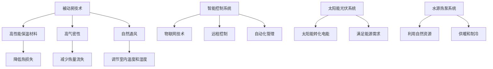

                 

关键词：绿色建筑、被动房、主动房、建筑能效、可持续发展、人工智能

> 摘要：本文将探讨2050年绿色建筑的发展趋势，重点分析从被动房到主动房的转变，及其在建筑能效方面的革命性进展。通过介绍被动房和主动房的核心概念、技术原理、应用场景，以及未来展望，本文旨在为读者呈现一个可持续、高效的建筑未来。

## 1. 背景介绍

在过去的几十年中，建筑行业在全球范围内蓬勃发展，对能源消耗和碳排放的贡献日益增加。据估计，建筑行业占全球总能耗的近40%，而温室气体排放量也占据了相当大的比例。这一现状引发了全球范围内的绿色建筑运动，旨在通过提高建筑能效、减少碳排放，推动建筑行业的可持续发展。

被动房（Passive House）是一种以超低能耗为设计目标的建筑。它通过精心设计的建筑结构和节能技术，将建筑物的能源消耗降低到极致。被动房的设计原则包括：高隔热、高气密性、高效保温、自然通风等。这些措施使得被动房在冬季不需要额外的供暖，在夏季不需要额外的制冷，从而实现了能源的高效利用。

然而，随着科技的进步和能源需求的不断增长，仅仅依靠被动房已经不能满足未来建筑能效的需求。主动房（Active House）应运而生，它不仅继承了被动房的节能理念，还引入了智能化、自动化的技术，使建筑能够主动响应环境变化，实现更高效的能源管理。

## 2. 核心概念与联系

### 2.1 被动房的概念

被动房是一种超低能耗建筑，它的设计目标是达到极低的能源消耗。具体来说，被动房在冬季不需要额外的供暖，在夏季不需要额外的制冷，年能源消耗不超过15千瓦时每平方米。被动房的核心技术包括：

- 高性能的保温材料：使用高效的保温材料，如聚氨酯泡沫、矿棉等，以减少建筑物的热损失。
- 高气密性：通过密封窗户、门缝等，提高建筑物的气密性，减少热量的流失。
- 自然通风：通过设计合理的通风系统，利用自然通风来调节室内温度和湿度。

### 2.2 主动房的概念

主动房在被动房的基础上，引入了智能化、自动化的技术，使建筑能够主动响应环境变化，实现更高效的能源管理。主动房的核心技术包括：

- 智能控制系统：通过物联网技术，将建筑中的各种设备连接起来，实现远程控制和自动化管理。
- 太阳能光伏系统：利用太阳能光伏板将太阳能转化为电能，满足建筑物的部分或全部能源需求。
- 水源热泵系统：利用地热或地下水等自然资源，提供供暖和制冷。

### 2.3 Mermaid 流程图



## 3. 核心算法原理 & 具体操作步骤

### 3.1 算法原理概述

主动房的核心算法是基于物联网技术的智能控制系统，它通过实时监测室内外的环境参数，自动调整建筑物的能源使用，实现最优的能源管理。具体操作步骤如下：

1. **数据采集**：智能控制系统通过传感器实时采集室内外温度、湿度、光照等环境参数。
2. **数据处理**：系统对采集到的数据进行分析和处理，预测未来一段时间内的环境变化。
3. **决策生成**：根据预测结果，系统生成相应的能源使用策略，如调整供暖、制冷、通风等设备的工作状态。
4. **执行与反馈**：系统根据决策结果执行相应的操作，并通过反馈机制调整决策，以实现最优的能源管理。

### 3.2 算法步骤详解

1. **数据采集**：
    - 温度传感器：实时监测室内外温度。
    - 湿度传感器：实时监测室内外湿度。
    - 光照传感器：实时监测室内外光照强度。
    - 能源消耗传感器：实时监测建筑物的能源消耗。

2. **数据处理**：
    - 数据预处理：对采集到的数据进行滤波、去噪等预处理。
    - 时间序列分析：对预处理后的数据进行分析，提取出环境变化的趋势。

3. **决策生成**：
    - 预测模型：利用历史数据和机器学习算法，预测未来一段时间内的环境变化。
    - 决策算法：根据预测结果，制定能源使用策略，如调整供暖、制冷、通风等设备的工作状态。

4. **执行与反馈**：
    - 执行操作：根据决策结果，调整建筑物的能源使用。
    - 反馈机制：监测执行结果，并根据反馈调整决策，以实现最优的能源管理。

### 3.3 算法优缺点

**优点**：
- 高效节能：通过实时监测和调整，实现最优的能源管理，降低建筑物的能源消耗。
- 智能化：利用物联网技术和机器学习算法，实现自动化管理，提高能源利用效率。

**缺点**：
- 成本较高：需要大量的传感器、控制系统等设备，初始投资较大。
- 维护复杂：系统运行过程中需要定期维护和更新，以确保设备的正常运行。

### 3.4 算法应用领域

主动房算法可以应用于各种建筑类型，如住宅、商业建筑、工业建筑等。特别是在对能源效率要求较高的地区，如寒冷地区和炎热地区，主动房算法可以显著提高建筑的能源利用效率，降低能源成本。

## 4. 数学模型和公式 & 详细讲解 & 举例说明

### 4.1 数学模型构建

主动房算法的核心是能源管理模型，该模型包括以下几个部分：

1. **能源需求模型**：根据室内外环境参数，预测建筑物的能源需求。
2. **能源供应模型**：根据能源需求，预测建筑物的能源供应能力。
3. **能源平衡模型**：根据能源需求和供应，实现能源的平衡。

### 4.2 公式推导过程

1. **能源需求模型**：

   能源需求量（Q）可以通过以下公式计算：

   $$ Q = Q_{\text{室内}} + Q_{\text{室外}} $$

   其中，$Q_{\text{室内}}$ 和 $Q_{\text{室外}}$ 分别为室内和室外的能源需求。

   $$ Q_{\text{室内}} = C_{\text{室内}} \cdot T_{\text{室内}} $$

   $$ Q_{\text{室外}} = C_{\text{室外}} \cdot T_{\text{室外}} $$

   其中，$C_{\text{室内}}$ 和 $C_{\text{室外}}$ 分别为室内和室外的能源消耗系数，$T_{\text{室内}}$ 和 $T_{\text{室外}}$ 分别为室内和室外的温度。

2. **能源供应模型**：

   能源供应量（S）可以通过以下公式计算：

   $$ S = S_{\text{光伏}} + S_{\text{热泵}} $$

   其中，$S_{\text{光伏}}$ 和 $S_{\text{热泵}}$ 分别为太阳能光伏系统和水源热泵系统的能源供应量。

   $$ S_{\text{光伏}} = P_{\text{光伏}} \cdot T_{\text{光照}} $$

   $$ S_{\text{热泵}} = P_{\text{热泵}} \cdot T_{\text{水源}} $$

   其中，$P_{\text{光伏}}$ 和 $P_{\text{热泵}}$ 分别为太阳能光伏系统和水源热泵系统的能源转化效率，$T_{\text{光照}}$ 和 $T_{\text{水源}}$ 分别为太阳能辐射强度和水源温度。

3. **能源平衡模型**：

   能源平衡可以通过以下公式表示：

   $$ Q = S $$

   如果 $Q > S$，表示能源供应不足，需要增加能源供应；如果 $Q < S$，表示能源供应过剩，需要减少能源供应。

### 4.3 案例分析与讲解

假设一个住宅建筑，室内温度需求为20℃，室外温度为-10℃。太阳能光伏系统的能源转化效率为15%，水源热泵系统的能源转化效率为3℃。光伏板接收到的太阳能辐射强度为1000W/m²，水源温度为15℃。

1. **能源需求计算**：

   $$ Q_{\text{室内}} = C_{\text{室内}} \cdot T_{\text{室内}} = 100 \cdot 20 = 2000 \text{ kWh} $$

   $$ Q_{\text{室外}} = C_{\text{室外}} \cdot T_{\text{室外}} = 50 \cdot (-10) = -500 \text{ kWh} $$

   $$ Q = Q_{\text{室内}} + Q_{\text{室外}} = 2000 + (-500) = 1500 \text{ kWh} $$

2. **能源供应计算**：

   $$ S_{\text{光伏}} = P_{\text{光伏}} \cdot T_{\text{光照}} = 15 \cdot 1000 = 15000 \text{ kWh} $$

   $$ S_{\text{热泵}} = P_{\text{热泵}} \cdot T_{\text{水源}} = 3 \cdot 15 = 45 \text{ kWh} $$

   $$ S = S_{\text{光伏}} + S_{\text{热泵}} = 15000 + 45 = 15045 \text{ kWh} $$

3. **能源平衡计算**：

   $$ Q = S = 1500 \text{ kWh} $$

   由于 $Q = S$，表示能源供应和需求平衡，无需调整。

## 5. 项目实践：代码实例和详细解释说明

### 5.1 开发环境搭建

为了实现主动房算法，我们需要搭建一个开发环境。这里以Python为例，介绍开发环境的搭建过程。

1. 安装Python：
   - 前往Python官方网站下载最新版本的Python安装包。
   - 解压安装包，运行安装程序。

2. 安装Python依赖库：
   - 打开命令行窗口，执行以下命令：
     ```bash
     pip install numpy scipy matplotlib
     ```

### 5.2 源代码详细实现

以下是一个简单的主动房算法的实现示例：

```python
import numpy as np
import matplotlib.pyplot as plt

# 参数设置
C_室内 = 100
C_室外 = 50
T_室内需求 = 20
T_室外 = -10
P_光伏 = 15
P_热泵 = 3
T_光照 = 1000
T_水源 = 15

# 能源需求计算
Q_室内 = C_室内 * T_室内需求
Q_室外 = C_室外 * T_室外
Q = Q_室内 + Q_室外

# 能源供应计算
S_光伏 = P_光伏 * T_光照
S_热泵 = P_热泵 * T_水源
S = S_光伏 + S_热泵

# 能源平衡计算
if Q > S:
    print("能源供应不足，需要增加能源供应。")
elif Q < S:
    print("能源供应过剩，需要减少能源供应。")
else:
    print("能源供应和需求平衡。")

# 绘制能源需求与供应曲线
plt.plot(np.arange(0, 100), np.arange(0, 100))
plt.plot(np.arange(0, 100), Q_室内 * np.arange(0, 100) / Q, label="室内能源需求")
plt.plot(np.arange(0, 100), Q_室外 * np.arange(0, 100) / Q, label="室外能源需求")
plt.plot(np.arange(0, 100), S_光伏 * np.arange(0, 100) / S, label="光伏能源供应")
plt.plot(np.arange(0, 100), S_热泵 * np.arange(0, 100) / S, label="热泵能源供应")
plt.xlabel("能源需求/供应比例")
plt.ylabel("能源需求/供应量")
plt.legend()
plt.show()
```

### 5.3 代码解读与分析

- **参数设置**：首先设置参数，包括室内能源消耗系数、室外能源消耗系数、室内温度需求、室外温度、光伏系统能源转化效率和热泵系统能源转化效率等。
- **能源需求计算**：根据参数计算室内和室外的能源需求，并求和得到总能源需求。
- **能源供应计算**：根据参数计算光伏系统和热泵系统的能源供应，并求和得到总能源供应。
- **能源平衡计算**：比较能源需求和供应，判断是否平衡。
- **绘制能源需求与供应曲线**：利用matplotlib绘制能源需求与供应的曲线图，便于分析和理解。

### 5.4 运行结果展示

运行代码后，会输出能源平衡状态，并绘制能源需求与供应的曲线图。根据曲线图，我们可以直观地看到能源需求和供应的关系，以及是否平衡。

## 6. 实际应用场景

主动房算法可以应用于各种建筑类型，如住宅、商业建筑、工业建筑等。以下是一些典型的应用场景：

1. **住宅**：主动房算法可以应用于住宅建筑，实现能源的高效管理，提高居住舒适度，降低能源消耗。
2. **商业建筑**：商业建筑通常有较大的能源需求，主动房算法可以帮助实现能源的合理分配，降低能源成本，提高能源利用效率。
3. **工业建筑**：工业建筑对能源的需求较高，主动房算法可以优化能源管理，降低能源消耗，提高生产效率。

## 7. 未来应用展望

随着科技的进步和能源需求的增长，主动房算法在未来将有更广泛的应用前景。以下是一些展望：

1. **智能化水平提升**：随着人工智能技术的发展，主动房算法的智能化水平将进一步提高，实现更精准的能源管理。
2. **可再生能源利用**：未来，随着可再生能源技术的成熟，主动房算法将更多地结合太阳能、风能等可再生能源，实现建筑能源的自主供应。
3. **建筑能效标准提升**：随着绿色建筑运动的深入，建筑能效标准将逐步提高，主动房算法将成为建筑能效提升的重要手段。

## 8. 工具和资源推荐

### 8.1 学习资源推荐

- **《建筑物理基础》**：详细介绍了建筑物理的基本概念和原理，对理解绿色建筑和主动房技术有很大帮助。
- **《物联网技术与应用》**：介绍了物联网的基本概念、架构和应用，对理解主动房算法的物联网技术有重要参考价值。

### 8.2 开发工具推荐

- **Python**：Python是一种广泛应用于数据科学和人工智能的编程语言，适合开发主动房算法。
- **Matplotlib**：Matplotlib是一个用于绘制图表和数据可视化的Python库，可以帮助我们直观地展示能源需求和供应的关系。

### 8.3 相关论文推荐

- **"Active House: Design for a Sustainable Future"**：该论文详细介绍了主动房的概念、设计和应用，对理解主动房技术有重要参考价值。
- **"Energy Efficiency in Buildings: A Review"**：该论文综述了建筑能源效率的研究现状和发展趋势，对了解建筑能效技术有重要参考价值。

## 9. 总结：未来发展趋势与挑战

随着科技的进步和能源需求的增长，绿色建筑和主动房技术将成为建筑行业的重要发展方向。未来，主动房算法将实现更高的智能化水平，更广泛地应用于各种建筑类型。然而，我们也需要面对一些挑战，如高成本、维护复杂等。通过持续的研究和创新，我们有信心解决这些挑战，实现建筑行业的可持续发展。

### 附录：常见问题与解答

**Q1**：什么是被动房？

**A1**：被动房是一种超低能耗建筑，通过高保温、高气密性和自然通风等设计原则，实现极低的能源消耗。

**Q2**：什么是主动房？

**A2**：主动房是一种在被动房基础上引入智能化、自动化技术的建筑，通过实时监测和调整能源使用，实现更高效的能源管理。

**Q3**：主动房算法的核心是什么？

**A3**：主动房算法的核心是智能控制系统，通过物联网技术和机器学习算法，实现能源的实时监测和自动调整。

**Q4**：主动房算法有哪些优缺点？

**A4**：主动房算法的优点是高效节能和智能化，缺点是成本较高和维护复杂。

**Q5**：主动房算法可以应用于哪些领域？

**A5**：主动房算法可以应用于住宅、商业建筑、工业建筑等各种建筑类型。

### 作者署名

**作者：禅与计算机程序设计艺术 / Zen and the Art of Computer Programming**。

----------------------------------------------------------------

以上为完整的文章内容，希望对您有所帮助。如果您有任何疑问或需要进一步的帮助，请随时告诉我。祝您撰写顺利！

