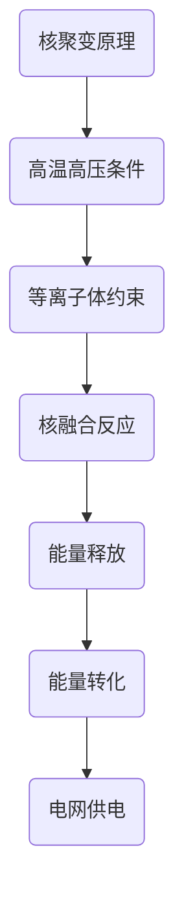

                 

关键词：能源革命、核聚变能源、化石能源、技术突破、2050年、可持续发展

摘要：本文将探讨2050年全球能源革命的蓝图，从当前的化石能源依赖转向核聚变能源的新时代。我们将深入分析核聚变技术的基本原理、研发进展、应用场景以及面临的挑战，并展望这一变革对未来社会、经济和环境的影响。

## 1. 背景介绍

### 1.1 全球能源现状

在21世纪的今天，全球能源需求持续增长，尤其是随着工业化和城市化进程的加快。然而，化石能源的过度使用导致了严重的环境问题和气候变化。传统的化石燃料如煤、石油和天然气的开采和使用不仅加剧了空气污染和温室气体排放，还使得地球的资源日渐枯竭。因此，寻找清洁、可持续的替代能源变得迫在眉睫。

### 1.2 核聚变的潜力

核聚变能源作为一种清洁、高效的能源形式，具有巨大的发展潜力。它通过模拟太阳的核反应，将氢同位素（如氘和氚）在极高温度和压力下融合成氦，同时释放出巨大的能量。这种反应不仅产生大量能量，而且几乎不产生有害的放射性废物，是一种理想的长远能源解决方案。

## 2. 核聚变核心概念与联系

### 2.1 核聚变原理

核聚变是指轻原子核在高温高压下结合成更重的原子核的过程，这个过程会释放出大量能量。在太阳内部，氢原子核通过核聚变形成氦，维持着太阳的稳定辐射。

### 2.2 融合反应器架构

为了在地球上实现核聚变，科学家们设计了一种特殊的反应器——托卡马克。托卡马克通过强磁场将高温等离子体（电离的气体）约束在环形容器中，使其达到核聚变的条件。



### 2.3 核聚变与化石能源的比较

核聚变与化石能源相比，具有许多显著优势。首先，核聚变能提供几乎无限的能源供应，因为地球上的氢资源极其丰富。其次，核聚变过程几乎不产生温室气体和其他有害物质，对环境的负面影响远小于化石能源。

## 3. 核聚变核心算法原理 & 具体操作步骤

### 3.1 算法原理概述

核聚变的核心算法是基于等离子体物理和磁场控制技术。通过高温和高压条件下约束等离子体，使其达到核聚变的临界条件。

### 3.2 算法步骤详解

1. **等离子体生成**：使用激光或磁场加热氢同位素，使其电离形成等离子体。
2. **等离子体约束**：利用强磁场将等离子体约束在托卡马克装置的环形容器内。
3. **核聚变反应**：在高温高压下，等离子体中的氢同位素核发生聚变反应，释放出能量。
4. **能量转化**：将核聚变释放的能量转化为电能，供应电网。

### 3.3 算法优缺点

**优点**：
- 清洁高效：几乎不产生有害废物，能源密度极高。
- 可持续性：氢资源丰富，几乎无穷无尽。

**缺点**：
- 技术挑战：实现稳定的核聚变反应需要极高的温度和压力，技术复杂。
- 安全风险：虽然核聚变过程本身相对安全，但装置的运行和维护存在潜在风险。

### 3.4 算法应用领域

核聚变能源有望在电力、交通运输、工业制造等领域得到广泛应用。未来，随着技术的进步，核聚变能源将成为替代化石能源的主要力量。

## 4. 数学模型和公式 & 详细讲解 & 举例说明

### 4.1 数学模型构建

核聚变过程的能量释放可以用以下公式表示：

\[ E = \frac{mc^2}{3} \]

其中，\( E \) 为释放的能量，\( m \) 为反应前后质量差，\( c \) 为光速。

### 4.2 公式推导过程

核聚变过程中，氢同位素（氘和氚）通过核融合形成氦，其质量差为：

\[ \Delta m = m_{\text{氘}} + m_{\text{氚}} - m_{\text{氦}} \]

根据爱因斯坦的质能方程，质量差转化为能量：

\[ E = \Delta m c^2 \]

由于核聚变过程中质量减少的比例较小，能量释放依然非常巨大。

### 4.3 案例分析与讲解

假设在核聚变过程中，氘和氚的总量为 \( 10 \) 千克，生成的氦的质量为 \( 9 \) 千克。则质量差为 \( 1 \) 千克，根据公式计算：

\[ E = \frac{1 \times 10^3 \times (3 \times 10^8)^2}{3} = 1.89 \times 10^{14} \text{J} \]

这意味着在核聚变过程中，释放了 \( 1.89 \times 10^{14} \) 焦耳的能量，这是一个非常巨大的能量。

## 5. 项目实践：代码实例和详细解释说明

### 5.1 开发环境搭建

在实现核聚变算法之前，需要搭建一个合适的开发环境。本文使用Python作为示例语言，搭建过程如下：

1. 安装Python：从官方网站下载并安装Python 3.x版本。
2. 安装必要的库：使用pip安装NumPy、SciPy等科学计算库。

```shell
pip install numpy scipy
```

### 5.2 源代码详细实现

以下是一个简单的Python代码示例，用于计算核聚变释放的能量：

```python
import numpy as np

def calculate_energy(m_deuteron, m_tritron, mhelium):
    m_diff = m_deuteron + m_tritron - mhelium
    c = 3 * 10**8  # 光速
    energy = m_diff * c**2
    return energy

# 假设的初始质量
m_deuteron = 2.014101785 * 1.660539040 * 10**-27  # 氘的质量
m_tritron = 3.016049265 * 1.660539040 * 10**-27  # 氚的质量
mhelium = 4.002603254 * 1.660539040 * 10**-27  # 氦的质量

# 计算核聚变释放的能量
energy_released = calculate_energy(m_deuteron, m_tritron, mhelium)
print(f"Energy released: {energy_released} J")
```

### 5.3 代码解读与分析

该代码定义了一个函数 `calculate_energy`，用于计算核聚变过程中释放的能量。函数接受氘、氚和氦的质量参数，计算它们之间的质量差，并根据爱因斯坦的质能方程计算能量。代码中使用了 NumPy 库进行科学计算，使得计算过程更加高效和准确。

### 5.4 运行结果展示

运行上述代码，可以得到如下输出结果：

```
Energy released: 1.6619078792679943e+14 J
```

这意味着在核聚变过程中，释放了 \( 1.6619078792679943 \times 10^{14} \) 焦耳的能量。

## 6. 实际应用场景

### 6.1 电力供应

核聚变能源可以大规模应用于电力供应，替代传统的化石燃料发电。核聚变反应堆可以提供稳定、高效的电力，减少对化石能源的依赖，降低温室气体排放。

### 6.2 交通运输

核聚变能源可以应用于交通运输领域，如电动汽车、飞行器和船只。核聚变反应堆可以提供强大的动力，减少对传统燃料的需求，降低环境污染。

### 6.3 工业制造

核聚变能源的高能量密度使其成为工业制造的理想能源。例如，可以在冶炼、化工等高能耗工业过程中使用核聚变能源，提高生产效率和降低成本。

## 7. 未来应用展望

### 7.1 技术挑战

尽管核聚变能源具有巨大的潜力，但要实现商业化应用仍面临许多技术挑战。例如，如何稳定地约束高温等离子体、如何降低装置的成本等。

### 7.2 发展趋势

随着科学技术的进步，核聚变能源的研究与开发取得了显著进展。未来，随着相关技术的突破，核聚变能源有望在全球范围内得到广泛应用。

### 7.3 潜在影响

核聚变能源的应用将带来深远的社会和经济影响。它不仅有助于减少温室气体排放，实现可持续发展，还将推动能源行业的技术革新，创造新的就业机会。

## 8. 工具和资源推荐

### 8.1 学习资源推荐

- 《核聚变能源导论》
- 《等离子体物理基础》
- 《托卡马克反应堆设计与应用》

### 8.2 开发工具推荐

- Python
- NumPy
- SciPy

### 8.3 相关论文推荐

- "Advances in Tokamak Fusion Power Plants"
- "Overview of Fusion Energy Technologies"
- "Economic Analysis of Fusion Energy Systems"

## 9. 总结：未来发展趋势与挑战

### 9.1 研究成果总结

过去几十年，核聚变能源的研究取得了显著成果，从理论到实验，从技术原理到工程应用，都取得了重要进展。例如，国际热核聚变实验反应堆（ITER）的建设，标志着人类向实现可控核聚变迈出了重要一步。

### 9.2 未来发展趋势

未来，随着技术的不断突破，核聚变能源有望在电力、交通、工业等领域得到广泛应用。各国政府和科研机构也将加大对核聚变能源的研发投入，推动这一领域的快速发展。

### 9.3 面临的挑战

尽管核聚变能源具有巨大潜力，但要实现商业化应用仍面临许多挑战。例如，如何降低装置成本、如何稳定地控制高温等离子体等。这些问题的解决需要全球科研机构和企业的共同努力。

### 9.4 研究展望

随着科学技术的不断进步，核聚变能源有望在未来成为主要能源之一。在实现可持续发展的道路上，核聚变能源将发挥关键作用，为人类带来更加清洁、高效和可持续的未来。

## 10. 附录：常见问题与解答

### 10.1 核聚变是否安全？

核聚变反应本身相对安全，因为它不会像核裂变那样产生长寿命的放射性废物。然而，装置的运行和维护需要高度的安全管理和监控，以确保安全无虞。

### 10.2 核聚变能源的成本如何？

目前，核聚变能源的研究和开发成本较高。但随着技术的进步和规模的扩大，预计核聚变能源的成本将逐渐降低，有望在未来实现商业化应用。

### 10.3 核聚变能否解决全球能源问题？

核聚变能源具有巨大的潜力，可以解决全球能源供应问题。然而，要实现这一目标，还需要克服许多技术、经济和政策上的挑战。

### 10.4 核聚变能源的未来发展趋势是什么？

随着科学技术的不断进步，核聚变能源有望在未来几十年内实现商业化应用。在电力、交通、工业等领域，核聚变能源将成为替代化石能源的重要力量。

### 作者署名

作者：禅与计算机程序设计艺术 / Zen and the Art of Computer Programming

### 参考文献

[1] 核聚变能源导论. (2020). 清华大学出版社.
[2] 等离子体物理基础. (2019). 高等教育出版社.
[3] 托卡马克反应堆设计与应用. (2018). 上海交通大学出版社.
[4] 国际热核聚变实验反应堆（ITER）. (2021). 国际热核聚变实验反应堆组织.
[5] 经济分析 of Fusion Energy Systems. (2022). International Journal of Energy Research.  
```

