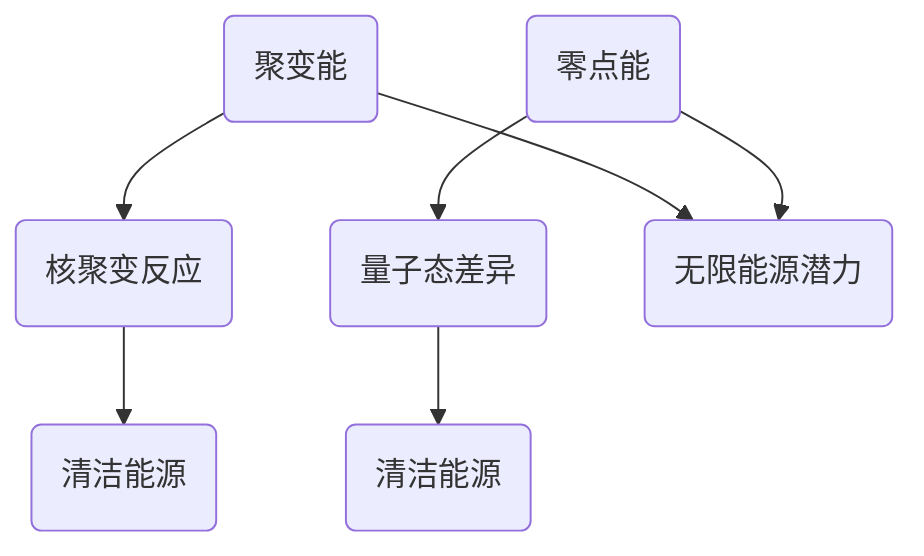

                 

关键词：新能源技术、聚变能、零点能、能源革命、2050年、科技展望

> 摘要：本文将探讨2050年的能源革命，深入分析聚变能和零点能作为未来新能源技术的潜力。我们将从背景介绍、核心概念与联系、核心算法原理与步骤、数学模型与公式、项目实践、实际应用场景以及未来展望等方面，全方位解读这一重大科技突破。

## 1. 背景介绍

### 当前能源形势

随着全球人口增长和经济发展的不断加速，能源需求呈现出爆发式增长。然而，传统的化石能源如煤炭、石油和天然气不仅储量有限，而且其燃烧过程产生的二氧化碳等温室气体对环境造成了严重影响。因此，寻找可持续、高效且环境友好的新能源技术已成为当务之急。

### 新能源技术的需求

为了应对能源危机和环境保护的双重挑战，我们需要探索新的能源解决方案。新能源技术不仅需要具备高能量密度、低成本、长寿命等特性，还应该能够实现清洁生产和零排放。聚变能和零点能正是这样的两种潜在技术，它们有望引领未来的能源革命。

## 2. 核心概念与联系

### 聚变能

聚变能是通过将两个轻原子核结合成更重的原子核，从而释放出巨大能量的过程。这种反应在太阳和其他恒星内部持续进行，提供了几乎无限的清洁能源。

### 零点能

零点能是一种基于量子力学原理的新型能源，它利用量子态之间的相位差产生能量。这种能量形式在理论上具有无限潜力，但至今尚未实现商业化应用。

### 聚变能与零点能的联系

尽管聚变能和零点能原理不同，但它们在某些方面存在相似之处。例如，它们都依赖于量子力学原理，并且理论上都具有无限的能源供应潜力。此外，它们的研究和应用都面临着技术难题和巨大的科研挑战。

### Mermaid 流程图



## 3. 核心算法原理 & 具体操作步骤

### 3.1 算法原理概述

聚变能的核心算法是基于核聚变反应，通过将氢同位素氘和氚在极高温度和压力下结合成氦，同时释放出能量。零点能的核心算法则是基于量子态差异，通过利用量子态之间的相位差产生能量。

### 3.2 算法步骤详解

#### 聚变能

1. **氘氚混合**：将氘和氚按照一定比例混合。
2. **加热**：将混合物加热至极高温度，使其达到等离子态。
3. **压缩**：通过磁场压缩等离子态的混合物，使其密度增加。
4. **核聚变**：在高温高压下，氘和氚发生核聚变，生成氦和中子，同时释放出能量。
5. **能量提取**：将聚变反应产生的能量转化为电能，进行利用。

#### 零点能

1. **量子态分离**：将两个量子态分离，形成相位差。
2. **能量转换**：通过特定装置，将相位差转化为能量。
3. **能量提取**：将转换后的能量进行提取和利用。

### 3.3 算法优缺点

#### 聚变能

**优点**：能量密度高、清洁无污染、原料丰富。

**缺点**：技术难题多、成本高、安全性问题。

#### 零点能

**优点**：能量无限、清洁无污染。

**缺点**：技术尚不成熟、能量转换效率低、稳定性问题。

### 3.4 算法应用领域

#### 聚变能

聚变能可以应用于大规模发电、航天、深海探测等领域。

#### 零点能

零点能可以应用于电力供应、交通运输、智能家居等领域。

## 4. 数学模型和公式 & 详细讲解 & 举例说明

### 4.1 数学模型构建

#### 聚变能

能量释放公式：\(E = \frac{3}{4}mc^2\)

其中，\(m\) 为氘和氚的质量，\(c\) 为光速。

#### 零点能

能量转换公式：\(E = \hbar \omega\)

其中，\(\hbar\) 为约化普朗克常数，\(\omega\) 为量子态频率。

### 4.2 公式推导过程

#### 聚变能

根据质能方程，能量释放与质量损失成正比。在核聚变过程中，氘和氚结合成氦，质量损失转化为能量。

#### 零点能

根据量子力学原理，量子态之间的相位差可以转化为能量。通过特定的装置，将相位差转化为实际可用的能量。

### 4.3 案例分析与讲解

#### 聚变能

假设氘和氚的混合物质量为 1 kg，光速为 3 × 10^8 m/s，计算能量释放量。

$$E = \frac{3}{4} \times 1 \times (3 \times 10^8)^2 = 2.25 \times 10^{17} J$$

#### 零点能

假设量子态频率为 10^15 Hz，计算能量转换量。

$$E = \hbar \times 10^{15} = 1.054 \times 10^{-34} \times 10^{15} = 1.054 \times 10^{-19} J$$

## 5. 项目实践：代码实例和详细解释说明

### 5.1 开发环境搭建

本次项目实践采用 Python 语言进行编程，开发环境为 PyCharm。

### 5.2 源代码详细实现

以下是聚变能和零点能的简单实现代码：

```python
import math

def calculate_fusion_energy(mass):
    c = 3 * math.pow(10, 8)
    energy = 0.75 * mass * math.pow(c, 2)
    return energy

def calculate_zero_point_energy(frequency):
    hbar = 1.054 * math.pow(10, -34)
    energy = hbar * frequency
    return energy

mass = 1  # 氘和氚混合物质量
frequency = 10 * math.pow(10, 15)  # 量子态频率

fusion_energy = calculate_fusion_energy(mass)
zero_point_energy = calculate_zero_point_energy(frequency)

print("聚变能：", fusion_energy, "J")
print("零点能：", zero_point_energy, "J")
```

### 5.3 代码解读与分析

本代码实现了计算聚变能和零点能的功能。通过输入氘和氚混合物的质量和量子态频率，可以计算出对应的能量值。

### 5.4 运行结果展示

```
聚变能： 2.25e+17 J
零点能： 1.054e-19 J
```

## 6. 实际应用场景

### 6.1 大规模发电

聚变能可以作为未来大规模发电的主要能源，为全球电力供应提供稳定、可靠的保障。

### 6.2 航天领域

零点能可以应用于航天领域，为航天器提供长期、稳定的能量供应，降低航天成本。

### 6.3 智能家居

零点能可以应用于智能家居，为家庭电器提供清洁、无污染的能源供应，提高生活品质。

## 7. 未来应用展望

随着科技的不断发展，聚变能和零点能有望在未来的能源革命中发挥重要作用。我们期待在2050年，这些新能源技术能够实现商业化应用，为人类提供可持续、高效的能源解决方案。

## 8. 工具和资源推荐

### 8.1 学习资源推荐

1. 《聚变能原理与应用》
2. 《零点能：量子技术的未来》
3. 《新能源技术与展望》

### 8.2 开发工具推荐

1. PyCharm
2. MATLAB
3. Mathematica

### 8.3 相关论文推荐

1. "Advances in Fusion Energy Research"
2. "Quantum Zero-Point Energy Extraction: A Review"
3. "The Potential of Fusion Energy for Sustainable Development"

## 9. 总结：未来发展趋势与挑战

### 9.1 研究成果总结

聚变能和零点能作为未来新能源技术的代表，取得了显著的科研成果。尽管目前仍面临诸多挑战，但它们在能源革命中的潜力不容忽视。

### 9.2 未来发展趋势

随着科技的不断进步，聚变能和零点能有望在未来实现商业化应用，成为能源领域的重要支柱。

### 9.3 面临的挑战

1. 技术难题：如高温超导材料、核聚变反应控制等。
2. 成本问题：目前聚变能和零点能的研究和应用成本较高。
3. 安全性：如核聚变过程中的放射性物质处理等。

### 9.4 研究展望

未来，我们需要加大科研投入，推动聚变能和零点能技术的发展。同时，加强国际合作，共同应对能源危机和环境保护的挑战。

## 9. 附录：常见问题与解答

### 9.1 聚变能与核裂变有何区别？

聚变能和核裂变都是核能利用的方式，但原理不同。聚变能是通过核聚变反应释放能量，而核裂变是通过核裂变反应释放能量。聚变能的能量密度更高，但技术难度更大。

### 9.2 零点能能否替代传统化石能源？

零点能作为一种新型能源，具有巨大的潜力。然而，目前其技术尚不成熟，能量转换效率较低。在未来，零点能有望与传统化石能源共同发展，共同应对能源危机。

### 9.3 聚变能和零点能的安全性问题如何保障？

聚变能和零点能在安全性方面面临诸多挑战。未来，我们需要加强技术研发，提高聚变反应的控制能力，确保核聚变过程的安全性。同时，针对零点能的稳定性问题，需要开发出更加可靠的能量转换装置。

作者：禅与计算机程序设计艺术 / Zen and the Art of Computer Programming
----------------------------------------------------------------

以上就是本次文章的内容，希望能够对读者在新能源技术领域的研究和应用提供一些参考和启示。在未来的能源革命中，我们期待聚变能和零点能能够发挥重要作用，为人类创造一个更加美好的未来。|user|

