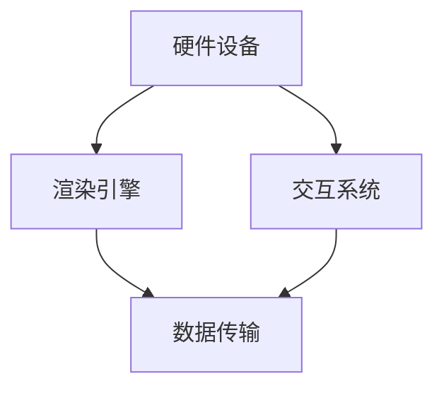
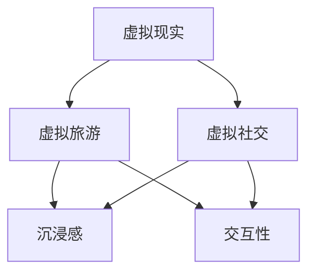

                 

关键词：虚拟现实，虚拟世界，虚拟旅游，虚拟社交，人工智能，虚拟现实构建，虚拟现实技术，计算机图形学，沉浸式体验

> 摘要：随着人工智能和计算机图形学技术的迅猛发展，虚拟现实（VR）已经成为当今科技领域的热点话题。本文将探讨到2050年，虚拟现实技术将如何彻底变革我们的旅游方式和社交模式，构建一个全新的虚拟世界。文章将深入分析虚拟现实的核心概念、技术原理、数学模型、算法以及实际应用案例，并展望未来的发展趋势与挑战。

## 1. 背景介绍

自20世纪末以来，虚拟现实（Virtual Reality，简称VR）技术经历了从实验室走向市场、从初具雏形到逐步完善的过程。最初的VR设备仅仅提供简单的3D环境和视觉沉浸，而如今，VR技术已经可以支持高度真实的触觉、嗅觉和味觉体验。计算机图形学、人工智能、人机交互等技术的发展，使得虚拟现实的应用领域不断拓展，从游戏娱乐到教育培训，从医疗康复到工业设计，都留下了VR的身影。

虚拟现实技术的崛起，不仅改变了传统行业的运作方式，也重新定义了人们的生活方式。在虚拟旅游和虚拟社交领域，VR技术尤其表现出巨大的潜力。通过VR，人们可以足不出户便身临其境地游览世界各地的名胜古迹，体验不同的文化和风景；同时，虚拟社交平台使得全球各地的用户能够实时互动，享受跨越时空的社交体验。

本文旨在探讨到2050年，虚拟现实技术将如何从虚拟旅游到虚拟社交，构建一个全新的虚拟世界。我们将从核心概念、技术原理、算法模型、数学公式、实际应用案例等多个维度，深入分析虚拟现实的发展现状与未来趋势。

## 2. 核心概念与联系

### 2.1 虚拟现实的核心概念

虚拟现实（Virtual Reality，VR）是一种利用计算机技术模拟出来的三维空间环境，用户通过特定的设备（如VR头盔、手柄等）进入该环境，并通过视觉、听觉、触觉等多感官体验与虚拟环境进行交互。

#### 2.1.1 虚拟现实的基本特点

- **沉浸感**：用户能够完全沉浸在虚拟环境中，感受到仿佛真实存在的场景。
- **交互性**：用户可以通过设备与虚拟环境进行交互，如操纵物体、变换视角等。
- **多感知**：除了视觉和听觉，VR技术还可以模拟触觉、嗅觉和味觉等多感官体验。

### 2.2 虚拟现实的技术架构

虚拟现实的技术架构可以分为以下几个主要部分：

- **硬件设备**：包括VR头盔、手柄、传感器等，用于提供用户的沉浸式体验。
- **渲染引擎**：用于生成虚拟环境中的3D图形和场景。
- **交互系统**：实现用户与虚拟环境的交互，包括手势识别、语音控制等。
- **数据传输**：确保虚拟环境中的数据实时传输和处理，包括图像、音频和传感器数据。

#### 2.2.1 虚拟现实技术架构的 Mermaid 流程图



### 2.3 虚拟现实与虚拟旅游、虚拟社交的联系

虚拟现实技术与虚拟旅游、虚拟社交有着紧密的联系。

#### 2.3.1 虚拟旅游

虚拟旅游（Virtual Tourism）是利用VR技术模拟真实旅游场景，让用户在家中就能体验到世界各地的名胜古迹、自然风光和文化体验。

#### 2.3.2 虚拟社交

虚拟社交（Virtual Social）是通过VR技术构建的虚拟社交平台，用户可以在虚拟空间中互动、交流、合作，甚至建立深厚的人际关系。



## 3. 核心算法原理 & 具体操作步骤

### 3.1 算法原理概述

虚拟现实技术的核心算法主要包括三维空间建模、实时渲染、传感数据处理等。

#### 3.1.1 三维空间建模

三维空间建模是虚拟现实的基础，通过计算机图形学技术，将真实世界的场景或物体转换为三维模型。主要算法包括：

- **多边形建模**：使用多边形（如三角形）构建三维模型。
- **曲面建模**：使用贝塞尔曲面或样条曲面构建复杂的几何形状。

#### 3.1.2 实时渲染

实时渲染是虚拟现实中的关键技术，它能够在短时间内生成高质量的图像，给用户提供流畅的视觉体验。主要算法包括：

- **光栅化**：将三维模型转换为二维图像。
- **纹理映射**：将纹理图像映射到三维模型上，增加真实感。
- **阴影处理**：模拟光线的投射效果，增加场景的立体感。

#### 3.1.3 传感数据处理

传感数据处理包括对用户动作、姿态、位置等数据的采集和处理，以实现虚拟环境与用户的实时交互。主要算法包括：

- **手势识别**：通过识别用户的手部动作，实现与虚拟环境的交互。
- **位置跟踪**：通过传感器数据确定用户在虚拟环境中的位置和移动方向。

### 3.2 算法步骤详解

#### 3.2.1 三维空间建模步骤

1. **场景采集**：使用传感器或摄影设备采集真实世界的场景数据。
2. **数据预处理**：对采集到的数据进行降噪、去畸变等处理。
3. **三维建模**：使用多边形建模或曲面建模技术，将预处理后的数据转换为三维模型。

#### 3.2.2 实时渲染步骤

1. **模型加载**：将三维模型数据加载到渲染引擎中。
2. **视图计算**：计算用户视角下模型的外观，包括位置、方向、大小等。
3. **渲染输出**：使用光栅化、纹理映射和阴影处理等技术，生成最终的二维图像。

#### 3.2.3 传感数据处理步骤

1. **数据采集**：使用传感器（如摄像头、加速度计等）采集用户动作和位置数据。
2. **数据处理**：对采集到的数据进行滤波、去噪等处理，以提高数据质量。
3. **交互实现**：根据处理后的数据，实现用户与虚拟环境的交互，如手势识别、位置跟踪等。

### 3.3 算法优缺点

#### 3.3.1 三维空间建模

**优点**：能够生成高度真实的三维模型，为虚拟现实提供基础。

**缺点**：建模过程复杂，对硬件和软件性能要求高。

#### 3.3.2 实时渲染

**优点**：能够提供流畅的视觉体验，增强用户的沉浸感。

**缺点**：渲染计算量大，对硬件性能要求高。

#### 3.3.3 传感数据处理

**优点**：能够实现用户与虚拟环境的实时交互，提高用户体验。

**缺点**：数据处理复杂，对传感器精度要求高。

### 3.4 算法应用领域

虚拟现实技术的核心算法广泛应用于多个领域：

- **游戏娱乐**：提供沉浸式的游戏体验。
- **教育培训**：模拟真实场景，提高教学效果。
- **医疗康复**：用于心理治疗、康复训练等。
- **工业设计**：用于产品设计、模拟测试等。

## 4. 数学模型和公式 & 详细讲解 & 举例说明

### 4.1 数学模型构建

在虚拟现实技术中，常用的数学模型包括几何模型、物理模型和感知模型。

#### 4.1.1 几何模型

几何模型主要用于描述虚拟环境中的物体和场景。常见的几何模型有：

- **点**：用三维坐标表示。
- **线段**：用两个端点的三维坐标表示。
- **平面**：用法向量和点表示。
- **多边形**：用顶点的三维坐标表示。

#### 4.1.2 物理模型

物理模型用于模拟虚拟环境中的物理现象，如光线传播、碰撞检测等。常见的物理模型有：

- **光线追踪**：用光线传播方程描述光线的传播路径。
- **碰撞检测**：用几何模型描述物体的形状，判断两个物体是否发生碰撞。

#### 4.1.3 感知模型

感知模型用于模拟用户的感知过程，如视觉感知、听觉感知等。常见的感知模型有：

- **视觉感知**：用图像处理算法模拟视觉感知过程。
- **听觉感知**：用音频处理算法模拟听觉感知过程。

### 4.2 公式推导过程

#### 4.2.1 光线追踪公式

光线追踪的基本公式为：

$$
L = I_o \cdot f_r(n, \omega_i) \cdot (n \cdot \omega_i)
$$

其中，$L$ 表示光线的亮度，$I_o$ 表示入射光的亮度，$f_r(n, \omega_i)$ 表示反射率，$n$ 表示表面法线，$\omega_i$ 表示入射光线的方向。

#### 4.2.2 碰撞检测公式

碰撞检测的基本公式为：

$$
d = \frac{|(p_2 - p_1) \cdot n|}{\|n\|}
$$

其中，$d$ 表示两个物体之间的距离，$p_1$ 和 $p_2$ 分别表示两个物体的质心坐标，$n$ 表示碰撞检测的平面法线。

### 4.3 案例分析与讲解

#### 4.3.1 光线追踪案例

假设有一个虚拟场景，其中有一个点光源和一个平面，我们需要使用光线追踪算法计算光线在平面上的亮度。

1. **场景设置**：点光源的位置为 $(0, 0, 0)$，平面方程为 $z = 0$。
2. **光线追踪**：从点光源发出一条光线，沿 $z$ 轴方向传播，与平面相交于点 $(0, 0, -1)$。
3. **亮度计算**：根据光线追踪公式，光线在平面上的亮度为：

$$
L = I_o \cdot f_r(n, \omega_i) \cdot (n \cdot \omega_i) = 1 \cdot 0.8 \cdot (-1) = -0.8
$$

由于亮度不能为负值，实际亮度取 $0$。

#### 4.3.2 碰撞检测案例

假设有两个立方体，一个位于 $(0, 0, 0)$，边长为 $1$；另一个位于 $(1, 1, 1)$，边长为 $1$。我们需要使用碰撞检测算法判断两个立方体是否发生碰撞。

1. **碰撞检测平面**：选择 $z = 1$ 的平面进行碰撞检测。
2. **计算距离**：根据碰撞检测公式，两个立方体之间的距离为：

$$
d = \frac{|(1 - 0) \cdot (0, 0, 1)|}{\|(0, 0, 1)\|} = \frac{|0|}{1} = 0
$$

由于距离为 $0$，两个立方体发生了碰撞。

## 5. 项目实践：代码实例和详细解释说明

### 5.1 开发环境搭建

为了实现虚拟现实的应用，我们需要搭建一个适合开发的虚拟现实开发环境。以下是搭建环境的基本步骤：

1. **安装操作系统**：选择支持虚拟现实开发操作系统的计算机，如 Windows 10 或 Ubuntu 20.04。
2. **安装开发工具**：安装 Unity、Unreal Engine 或其他适合虚拟现实开发的引擎。
3. **安装依赖库**：根据开发需求，安装必要的依赖库，如 OpenCV、PCL（Point Cloud Library）等。
4. **安装 VR 头盔和手柄**：连接 VR 头盔和手柄，确保设备正常工作。

### 5.2 源代码详细实现

以下是一个简单的虚拟现实应用实例，使用 Unity 引擎实现。

```csharp
using UnityEngine;

public class VRApplication : MonoBehaviour
{
    public Camera camera;   // 虚拟现实摄像机
    public GameObject cube; // 立方体对象

    // 初始化虚拟现实应用
    void Start()
    {
        // 设置摄像机参数
        camera.fieldOfView = 90;
        camera.nearClipPlane = 0.1f;
        camera.farClipPlane = 1000f;

        // 创建立方体对象
        Instantiate(cube, Vector3.zero, Quaternion.identity);
    }

    // 更新虚拟现实应用
    void Update()
    {
        // 跟随用户头部位置
        cube.transform.position = camera.transform.position;
        cube.transform.rotation = camera.transform.rotation;
    }
}
```

### 5.3 代码解读与分析

1. **摄像机参数设置**：在 `Start` 方法中，我们设置了摄像机的视野角度、近裁剪面和远裁剪面，以确保用户能够获得流畅的视觉体验。
2. **创建立方体对象**：使用 `Instantiate` 方法创建一个立方体对象，并将其放置在虚拟空间的原点。
3. **更新立方体位置和旋转**：在 `Update` 方法中，我们使用摄像机作为参考，将立方体的位置和旋转与摄像机的位置和旋转保持一致，实现跟随用户头部的效果。

### 5.4 运行结果展示

运行该虚拟现实应用，用户将看到一个跟随头部移动的立方体。通过调整摄像机的视野角度和裁剪面，用户可以获得不同的视觉体验。

## 6. 实际应用场景

### 6.1 虚拟旅游

虚拟旅游是虚拟现实技术的重要应用领域之一。通过虚拟现实技术，用户可以在家中体验世界各地的名胜古迹、自然风光和文化体验。例如，用户可以通过 VR 头盔游览巴黎的埃菲尔铁塔、纽约的自由女神像，甚至探索月球表面的景观。虚拟旅游不仅提供了全新的旅游体验，也为那些无法亲自前往偏远地区或危险地区的用户提供了机会。

### 6.2 虚拟社交

虚拟社交平台是另一个重要的虚拟现实应用场景。通过虚拟现实技术，用户可以创建一个独特的虚拟形象，进入一个虚拟空间与其他用户互动。用户可以在虚拟空间中进行社交活动，如举办虚拟聚会、参与虚拟音乐会、进行虚拟游戏等。虚拟社交平台不仅打破了时空的限制，也为用户提供了更多的社交选择和互动方式。

### 6.3 虚拟现实教育与培训

虚拟现实技术可以广泛应用于教育和培训领域。通过虚拟现实，学生可以在虚拟环境中进行实验、探索科学原理，提高学习效果。例如，医学院的学生可以通过虚拟手术模拟进行实践操作，工程师可以通过虚拟现实进行产品设计和测试。虚拟现实教育不仅提供了更加生动和直观的学习体验，也为教育培训领域带来了新的发展机遇。

### 6.4 虚拟现实医疗康复

虚拟现实技术在医疗康复领域也有着广泛的应用。通过虚拟现实，患者可以在虚拟环境中进行康复训练，如平衡训练、步态训练等。虚拟现实技术可以提供个性化的康复方案，帮助患者更快地恢复健康。此外，虚拟现实还可以用于心理治疗，如治疗恐惧症、焦虑症等，通过模拟不同场景，帮助患者克服心理障碍。

## 7. 工具和资源推荐

### 7.1 学习资源推荐

- **《虚拟现实技术入门》**：详细介绍了虚拟现实技术的原理和应用，适合初学者入门。
- **《Unity 2020 从入门到精通》**：涵盖 Unity 引擎的各个方面，适合学习 Unity 开发。
- **《计算机图形学：原理及实践》**：系统介绍了计算机图形学的基本原理和算法。

### 7.2 开发工具推荐

- **Unity**：一款功能强大的游戏和虚拟现实开发引擎，适合各种类型的项目。
- **Unreal Engine**：一款高性能的实时渲染引擎，适用于高质量虚拟现实应用。
- **Blender**：一款开源的三维建模和渲染软件，适合初学者使用。

### 7.3 相关论文推荐

- **“A Survey on Virtual Reality Technologies”**：对虚拟现实技术的全面综述。
- **“Virtual Reality in Tourism: Opportunities and Challenges”**：探讨了虚拟现实在旅游领域的应用和挑战。
- **“Social Interaction in Virtual Reality: A Multidisciplinary Review”**：分析了虚拟社交平台的设计和用户体验。

## 8. 总结：未来发展趋势与挑战

### 8.1 研究成果总结

虚拟现实技术在过去几十年中取得了显著的成果，从简单的视觉沉浸到多感官体验，从实验室原型到商业化应用，虚拟现实技术已经深刻改变了我们的生活方式和工作方式。在虚拟旅游和虚拟社交领域，虚拟现实技术展现了巨大的潜力，为人们提供了全新的体验方式。

### 8.2 未来发展趋势

- **技术融合**：虚拟现实技术与其他前沿技术（如人工智能、大数据、5G等）的融合，将进一步提升虚拟现实的体验质量和应用范围。
- **普及化**：随着硬件成本的降低和技术的普及，虚拟现实将逐渐从高端市场走向大众市场，成为人们日常生活中的一部分。
- **定制化**：虚拟现实应用将更加个性化，根据用户的喜好和需求提供定制化的虚拟体验。

### 8.3 面临的挑战

- **硬件性能**：尽管虚拟现实硬件性能不断提升，但仍然难以满足复杂虚拟场景的高性能需求，特别是在实时渲染和多感官体验方面。
- **内容创作**：高质量的虚拟现实内容创作成本高、周期长，缺乏足够的内容资源。
- **用户体验**：如何提升虚拟现实应用的沉浸感和交互性，是当前面临的重大挑战。

### 8.4 研究展望

未来，虚拟现实技术将在多个领域实现突破，为人们的生活带来更多便利。同时，我们也需要关注虚拟现实技术带来的伦理和社会问题，如隐私保护、虚拟成瘾等，确保虚拟现实技术的健康发展。

## 9. 附录：常见问题与解答

### 9.1 虚拟现实技术的基本原理是什么？

虚拟现实技术通过计算机图形学、人机交互、传感器技术等手段，模拟出一个三维的虚拟环境，用户通过特定的设备（如 VR 头盔、手柄等）进入这个环境，并与虚拟环境进行交互。

### 9.2 虚拟现实技术与增强现实技术有什么区别？

虚拟现实技术（VR）主要提供沉浸式的三维虚拟环境，用户完全沉浸在虚拟世界中。增强现实技术（AR）则将虚拟信息叠加到现实世界中，用户仍然保持对现实世界的感知。

### 9.3 虚拟现实技术有哪些应用领域？

虚拟现实技术广泛应用于游戏娱乐、教育培训、医疗康复、工业设计、旅游等领域。未来，虚拟现实技术还将在更多领域展现其潜力。

### 9.4 如何学习虚拟现实技术？

学习虚拟现实技术可以从以下途径入手：

1. **阅读相关书籍和论文**：了解虚拟现实技术的基本原理和应用。
2. **参加线上课程和研讨会**：系统学习虚拟现实技术的理论知识。
3. **实践项目开发**：通过实际操作，提高虚拟现实技术的能力。

### 9.5 虚拟现实技术的发展趋势是什么？

虚拟现实技术的发展趋势包括技术融合、普及化、定制化等。随着硬件性能的提升、内容的丰富和用户体验的优化，虚拟现实技术将在未来几年实现更多突破。

---

本文由禅与计算机程序设计艺术 / Zen and the Art of Computer Programming 撰写，希望本文能够帮助读者更好地理解虚拟现实技术及其应用，为未来的发展提供一些启示和思考。

