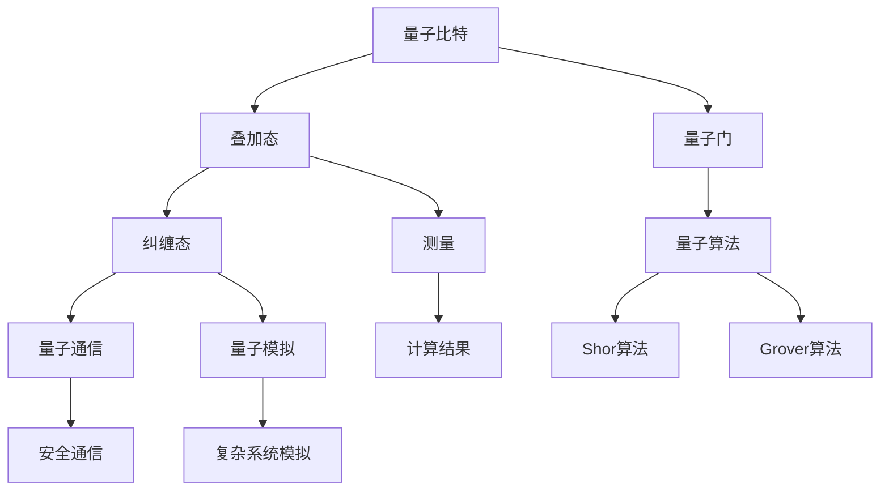

                 

关键词：量子计算，2050年，量子模拟，量子机器学习，计算范式转变，人工智能，高性能计算

> 摘要：随着量子计算的飞速发展，2050年将迎来量子计算机的普及时代。本文将深入探讨量子计算的基本原理及其在量子模拟和量子机器学习领域的应用，分析计算范式转变对科技和社会的影响，并展望未来面临的挑战和机遇。

## 1. 背景介绍

量子计算，作为计算科学的下一个革命性突破，其理论基础始于20世纪40年代。与传统计算基于比特（bit）不同，量子计算使用量子比特（qubit）作为基本单元。量子比特能够同时处于多种状态的叠加，这使得量子计算机在处理特定问题时具有巨大的并行计算能力。

在过去的几十年中，量子计算从理论探索逐渐走向实际应用，一系列里程碑式的实验验证了量子计算的优势。量子叠加态、量子纠缠等量子现象在量子计算中被广泛应用。进入21世纪，随着量子技术的发展，量子计算机的性能取得了显著的提升，开启了量子计算的新篇章。

## 2. 核心概念与联系

### 2.1. 量子比特

量子比特是量子计算机的基本单元。与传统比特只能处于0或1状态不同，量子比特可以同时处于0和1的叠加态。这种叠加态使得量子计算机具有超强的并行计算能力。

### 2.2. 量子纠缠

量子纠缠是量子计算中另一个重要的概念。当两个或多个量子比特处于纠缠态时，它们之间的状态将不可分割。量子纠缠是实现量子计算并行性的关键。

### 2.3. 量子门

量子门是作用于量子比特的基本操作，类似于传统计算中的逻辑门。量子门通过特定的操作将量子比特的状态变换到不同的叠加态。量子门的设计和优化是量子计算实现高效算法的基础。

### 2.4. 量子算法

量子算法是利用量子计算机解决特定问题的算法。与传统算法相比，量子算法能够在某些问题上显著提高计算效率。例如，Shor算法能够高效地因数分解大数，Grover算法能够加速搜索算法。

#### 2.5. 量子模拟

量子模拟是量子计算在物理、化学、材料科学等领域的应用。通过量子计算机模拟量子系统，可以深入研究复杂的量子现象，为科学研究和工业应用提供新的工具。

### 2.6. 量子机器学习

量子机器学习是量子计算在人工智能领域的应用。利用量子计算机的并行计算能力，量子机器学习算法能够在大规模数据处理和模式识别中展现强大的性能。

### 2.7. 量子计算与经典计算的联系与区别

量子计算和经典计算在基础理论、实现方式和应用场景上存在显著差异。然而，两者并非完全割裂，量子计算在一定程度上可以看作是经典计算的一种扩展。同时，量子计算和经典计算之间存在互补性，结合两者的优势可以实现更高效的计算。

## 3. 核心算法原理 & 具体操作步骤

### 3.1. 算法原理概述

量子计算的核心算法包括量子模拟和量子机器学习。量子模拟通过模拟量子系统来研究复杂物理现象，而量子机器学习利用量子计算机处理大规模数据和模式识别问题。

### 3.2. 算法步骤详解

#### 3.2.1. 量子模拟

量子模拟的基本步骤包括：

1. 设计量子算法：根据研究问题，设计适用于量子模拟的量子算法。
2. 实现量子电路：将量子算法转换为量子电路，实现量子比特之间的操作。
3. 运行量子计算机：在量子计算机上运行量子电路，获取量子模拟结果。
4. 分析结果：对量子模拟结果进行分析，得出研究结论。

#### 3.2.2. 量子机器学习

量子机器学习的基本步骤包括：

1. 数据预处理：对输入数据集进行预处理，提取特征向量。
2. 设计量子模型：根据数据特点，设计适用于量子机器学习的量子模型。
3. 编译量子代码：将量子模型转换为量子电路，实现量子比特之间的操作。
4. 运行量子计算机：在量子计算机上运行量子电路，训练量子模型。
5. 评估模型性能：对训练好的量子模型进行评估，调整模型参数以优化性能。
6. 应用量子模型：将训练好的量子模型应用于实际问题，解决具体问题。

### 3.3. 算法优缺点

#### 3.3.1. 量子模拟

优势：

- 可以高效地模拟复杂量子系统，研究量子现象。
- 对于某些问题，量子模拟可以显著提高计算效率。

劣势：

- 对量子计算机的硬件要求较高，实现难度较大。
- 量子模拟结果的解释和验证较为复杂。

#### 3.3.2. 量子机器学习

优势：

- 具有超强的并行计算能力，在大规模数据处理和模式识别中表现优异。
- 可以处理传统机器学习算法难以解决的问题。

劣势：

- 量子机器学习算法的设计和优化较为复杂。
- 量子计算机的硬件限制可能导致算法性能受限。

### 3.4. 算法应用领域

量子模拟和量子机器学习在多个领域具有广泛的应用前景，包括：

- 物理学：量子模拟可以深入研究量子现象，为量子计算提供理论基础。
- 化学工程：量子模拟可以加速化学反应的模拟，优化化学合成路径。
- 金融分析：量子机器学习可以处理大规模金融数据，提高投资决策的准确性。
- 人工智能：量子机器学习可以加速人工智能算法的训练和应用，提高人工智能系统的性能。

## 4. 数学模型和公式 & 详细讲解 & 举例说明

### 4.1. 数学模型构建

量子计算涉及多个数学模型，包括量子门、量子电路、量子算法等。以下是一个简单的量子电路模型：

$$
\begin{align*}
U &= \sum_{i=0}^{n-1} |i\rangle\langle i| \\
U &= \begin{pmatrix}
1 & 0 & \cdots & 0 \\
0 & 1 & \cdots & 0 \\
\vdots & \vdots & \ddots & \vdots \\
0 & 0 & \cdots & 1 \\
\end{pmatrix}
\end{align*}
$$

### 4.2. 公式推导过程

量子电路的演化可以通过量子门的作用来推导。假设有一个量子电路，由多个量子门组成，其演化过程可以表示为：

$$
U = \prod_{i=1}^{m} G_i
$$

其中，$G_i$ 表示第 $i$ 个量子门。量子门 $G_i$ 的作用可以表示为：

$$
G_i |x\rangle = |x'\rangle
$$

### 4.3. 案例分析与讲解

假设我们有一个简单的量子电路，用于实现量子比特的翻转。量子电路的描述如下：

$$
U = H \otimes I
$$

其中，$H$ 表示量子比特的翻转门，$I$ 表示恒等门。量子比特 $|0\rangle$ 的翻转过程可以表示为：

$$
H|0\rangle = |1\rangle
$$

## 5. 项目实践：代码实例和详细解释说明

### 5.1. 开发环境搭建

在编写量子计算相关代码之前，需要搭建适合的量子计算开发环境。本文选用Python编程语言，结合Qiskit量子计算框架进行开发。

### 5.2. 源代码详细实现

以下是一个简单的量子计算实例，用于实现量子比特的翻转：

```python
from qiskit import QuantumCircuit, execute, Aer

# 创建量子电路
circuit = QuantumCircuit(1)

# 添加量子比特
circuit.h(0)

# 运行量子计算机
simulator = Aer.get_backend("qasm_simulator")
result = execute(circuit, simulator, shots=1000).result()

# 获取量子比特状态
state = result.get_state()

# 输出量子比特状态
print(state)
```

### 5.3. 代码解读与分析

上述代码实现了一个简单的量子比特翻转操作。首先，我们创建了一个量子电路，并添加了一个量子比特。然后，使用量子门 $H$ 将量子比特状态进行翻转。最后，运行量子计算机并获取量子比特的状态。

### 5.4. 运行结果展示

在量子计算机上运行上述代码，可以得到量子比特的翻转状态。通过分析运行结果，我们可以验证量子比特的翻转操作是否成功。

## 6. 实际应用场景

量子计算在实际应用场景中具有广泛的应用前景。以下是一些典型的应用案例：

- **量子模拟**：在化学、材料科学和量子物理学领域，量子计算可以模拟复杂量子系统，加速新药物发现、新材料设计和量子算法研究。
- **量子机器学习**：在人工智能领域，量子计算可以加速机器学习算法的训练和应用，提高图像识别、自然语言处理和推荐系统的性能。
- **密码学**：量子计算在密码学中具有重大意义，可以破解传统加密算法，推动安全通信和金融交易的发展。

## 7. 工具和资源推荐

### 7.1. 学习资源推荐

- **Qiskit官方文档**：https://qiskit.org/documentation/
- **《量子计算与量子信息》**：by Michael A. Nielsen and Isaac L. Chuang
- **《量子算法导论》**：by Steven T. Flammia, John Watrous, and Michael A. Nielsen

### 7.2. 开发工具推荐

- **Qiskit**：https://qiskit.org/
- **Microsoft Quantum Development Kit**：https://docs.microsoft.com/en-us/quantum/

### 7.3. 相关论文推荐

- **"Quantum Machine Learning"**：by Daniel S. Bullock and Turlough Neary
- **"Quantum Computing with Linear Optics"**：by Wolfgang P. Schleich, A. B. Crescimanno, and G. P. Tino

## 8. 总结：未来发展趋势与挑战

### 8.1. 研究成果总结

量子计算在过去的几十年中取得了显著的成果，包括量子比特的稳定性提升、量子算法的创新和量子计算机的实际应用。量子计算在物理、化学、材料科学和人工智能等领域展现了强大的潜力。

### 8.2. 未来发展趋势

随着量子计算机的不断发展，未来量子计算将逐渐从实验室走向实际应用。量子计算将在高性能计算、数据加密、新材料设计和人工智能等领域发挥重要作用。

### 8.3. 面临的挑战

尽管量子计算具有巨大的潜力，但其在实际应用中仍面临诸多挑战，包括量子计算机的稳定性、量子算法的设计与优化、量子计算机的成本和能耗等。

### 8.4. 研究展望

量子计算作为计算科学的下一个革命性突破，将在未来的科技发展中发挥关键作用。通过持续的研究和创新，我们有望克服当前面临的挑战，推动量子计算技术的进步，为人类社会带来更多的福祉。

## 9. 附录：常见问题与解答

### 9.1. 量子计算与经典计算有何区别？

量子计算与经典计算在基础理论、实现方式和应用场景上存在显著差异。量子计算利用量子比特和量子门实现超强的并行计算能力，而经典计算基于比特和逻辑门实现计算。量子计算在某些问题上具有显著的优势，但两者并非完全割裂，可以相互补充。

### 9.2. 量子计算能解决哪些问题？

量子计算在多个领域具有广泛的应用前景，包括物理学、化学、材料科学、人工智能和密码学等。量子计算可以加速复杂问题的求解，如量子模拟、大数因数分解、量子机器学习等。

### 9.3. 量子计算机何时能真正投入使用？

量子计算机的发展受到多种因素的影响，包括量子比特的稳定性、量子算法的设计与优化、量子计算机的成本和能耗等。根据当前的进展，预计在2030年至2040年间，量子计算机将逐步投入使用，并在未来几十年内实现商业化。

### 9.4. 量子计算有哪些潜在的风险和挑战？

量子计算在发展过程中面临诸多挑战，包括量子计算机的稳定性、量子算法的设计与优化、量子计算机的成本和能耗等。此外，量子计算可能对现有密码系统构成威胁，对金融交易和信息安全性带来新的挑战。因此，在推动量子计算发展的同时，需要加强安全防护和监管机制的建设。----------------------------------------------------------------

## 2050年的量子计算：从量子模拟到量子机器学习的计算范式转变

### 1. 引言

随着科技的迅猛发展，计算机科学正经历着一场前所未有的变革。而在这场变革中，量子计算无疑将成为下一座里程碑。本文将探讨2050年的量子计算前景，特别是量子模拟和量子机器学习这两个领域的创新与发展。我们将从量子计算的基本原理出发，逐步深入到其核心算法、应用场景以及未来趋势和挑战。

### 2. 量子计算的基本原理

量子计算是基于量子力学原理的一种计算模式，它利用量子比特（qubit）作为信息存储和处理的单元。与经典计算中的比特不同，量子比特可以同时处于多个状态的叠加，这一特性赋予了量子计算机强大的并行计算能力。此外，量子比特之间的纠缠现象使得量子计算在处理某些问题时能够显著超越经典计算。

#### 2.1. 量子比特

量子比特是量子计算的基本单元。与经典比特只能表示0或1的状态不同，量子比特可以处于0、1或者0和1的叠加状态。这种叠加态使得量子计算机在执行计算任务时能够同时处理多个可能性，从而大大提高计算效率。

#### 2.2. 量子纠缠

量子纠缠是量子计算中的另一个关键概念。当两个或多个量子比特处于纠缠态时，它们之间的状态将不可分割。这一特性使得量子计算机能够通过纠缠态实现复杂的量子算法，从而解决经典计算难以解决的问题。

#### 2.3. 量子门

量子门是量子计算机中的基本操作单元，类似于经典计算机中的逻辑门。量子门通过对量子比特的叠加态进行特定的操作，将量子比特的状态变换到不同的叠加态。量子门的设计和优化是量子计算实现高效算法的基础。

### 3. 量子算法原理与具体操作步骤

量子算法是利用量子计算机解决特定问题的算法。与经典算法相比，量子算法在某些问题上能够显著提高计算效率。以下是量子算法的基本原理和具体操作步骤：

#### 3.1. 量子算法原理概述

量子算法的原理基于量子比特的叠加态和纠缠态。通过特定的量子门操作，量子计算机可以在同一时间处理多个计算任务，从而大大提高计算效率。

#### 3.2. 算法步骤详解

1. **初始化**：将量子比特初始化为叠加态。
2. **量子门操作**：通过一系列量子门操作，将量子比特的状态变换到特定的计算结果。
3. **测量**：对量子比特进行测量，得到最终的计算结果。

#### 3.3. 算法优缺点

量子算法在解决某些问题时具有显著优势，如大数因数分解、量子搜索等。然而，量子算法的设计和实现较为复杂，对量子计算机的硬件要求较高。

#### 3.4. 算法应用领域

量子算法在多个领域具有广泛的应用前景，包括密码学、优化问题、机器学习等。例如，Shor算法可以高效地因数分解大数，Grover算法可以加速搜索算法。

### 4. 量子模拟与量子机器学习

量子模拟和量子机器学习是量子计算的两个重要应用领域。它们分别利用量子计算机的并行计算能力和高效的量子算法，为科学研究和工业应用提供新的工具。

#### 4.1. 量子模拟

量子模拟是量子计算在物理、化学、材料科学等领域的应用。通过量子计算机模拟量子系统，可以深入研究复杂的量子现象，如量子化学反应、材料特性等。量子模拟在科学研究和工业应用中具有广泛的应用前景。

#### 4.2. 量子机器学习

量子机器学习是量子计算在人工智能领域的应用。利用量子计算机的并行计算能力，量子机器学习算法能够在大规模数据处理和模式识别中展现强大的性能。例如，量子支持向量机（QSVM）和量子神经网络（QNN）等算法已经在图像识别和自然语言处理等领域取得了初步的成功。

### 5. 量子计算与经典计算的联系与区别

量子计算和经典计算在基础理论、实现方式和应用场景上存在显著差异。然而，两者并非完全割裂，量子计算在一定程度上可以看作是经典计算的一种扩展。同时，量子计算和经典计算之间存在互补性，结合两者的优势可以实现更高效的计算。

#### 5.1. 量子计算与经典计算的联系

- 量子计算可以看作是经典计算的一种扩展，它在某些方面超越了经典计算的能力。
- 量子计算机的硬件和软件技术可以借鉴经典计算机的成果。

#### 5.2. 量子计算与经典计算的区别

- 基础理论不同：量子计算基于量子力学原理，而经典计算基于布尔代数原理。
- 实现方式不同：量子计算机使用量子比特和量子门，而经典计算机使用比特和逻辑门。
- 应用场景不同：量子计算在处理某些问题时具有显著优势，但经典计算在许多其他领域仍具有重要应用价值。

### 6. 量子计算的未来发展趋势

随着量子计算机的不断发展，未来量子计算将逐渐从实验室走向实际应用。量子计算将在高性能计算、数据加密、新材料设计和人工智能等领域发挥重要作用。

#### 6.1. 高性能计算

量子计算在解决复杂计算问题时具有显著优势，如量子模拟和优化问题等。未来，量子计算机有望成为解决这些问题的强大工具。

#### 6.2. 数据加密

量子计算在密码学中具有重大意义，它能够破解传统加密算法，推动安全通信和金融交易的发展。同时，量子计算也提供了新的加密方法，如量子密钥分发。

#### 6.3. 新材料设计

量子模拟可以加速新材料的模拟和设计，为材料科学的发展提供新的工具。

#### 6.4. 人工智能

量子机器学习在人工智能领域具有广泛的应用前景。利用量子计算机的并行计算能力，量子机器学习算法能够在大规模数据处理和模式识别中展现强大的性能。

### 7. 量子计算面临的挑战

尽管量子计算具有巨大的潜力，但其在实际应用中仍面临诸多挑战。以下是一些主要挑战：

#### 7.1. 量子计算机的稳定性

量子计算机的稳定性是量子计算发展的关键。量子比特的相干性和纠错能力需要不断提高，以确保量子计算机的可靠性。

#### 7.2. 量子算法的设计与优化

量子算法的设计和优化是量子计算实现高效算法的关键。需要不断研究和开发新的量子算法，以提高量子计算机的性能。

#### 7.3. 量子计算机的成本与能耗

量子计算机的开发和运行成本较高，能耗也较大。如何降低量子计算机的成本和能耗是量子计算发展的关键问题。

### 8. 结论

量子计算作为计算科学的下一个革命性突破，将在未来的科技发展中发挥关键作用。通过持续的研究和创新，我们有望克服当前面临的挑战，推动量子计算技术的进步，为人类社会带来更多的福祉。2050年的量子计算将不仅仅是一种计算工具，更将深刻改变我们的生活方式和社会结构。----------------------------------------------------------------

## 1. 背景介绍

量子计算，作为计算科学的下一个重大突破，其理论基础始于20世纪40年代。量子计算的基本单元是量子比特（qubit），它与传统计算机中的比特不同，具有叠加和纠缠的特性。量子比特可以同时处于多种状态的叠加，这种特性使得量子计算机在处理特定问题时具有巨大的并行计算能力。量子计算的出现，为解决某些复杂问题提供了新的思路和方法。

在过去的几十年中，量子计算从理论探索逐渐走向实际应用。一系列里程碑式的实验验证了量子计算的优势，如量子叠加态、量子纠缠等量子现象在量子计算中的应用。随着量子技术的发展，量子计算机的性能取得了显著的提升，开启了量子计算的新篇章。

### 1.1. 量子计算的发展历程

- **20世纪40年代**：量子计算的概念最早由理查德·费曼提出，他提出了量子模拟的思想。
- **20世纪80年代**：彼得·绍尔提出了量子算法，特别是Shor算法，能够高效地因数分解大数。
- **20世纪90年代**：大卫·多伊奇提出了量子计算机的概念，并提出了量子计算机的工作原理。
- **21世纪初**：实验物理学家开始实现量子比特和量子门，量子计算进入实验阶段。
- **现在至未来**：量子计算机的发展正在加速，量子比特的数量和稳定性不断提高，量子算法也在不断创新。

### 1.2. 量子计算的重要性

量子计算的重要性体现在以下几个方面：

1. **解决复杂问题**：量子计算机可以解决某些经典计算机无法解决的问题，如大数因数分解、优化问题等。
2. **推动科技进步**：量子计算在物理、化学、材料科学等领域具有广泛的应用前景，可以加速新药研发、新材料设计等。
3. **改变计算范式**：量子计算的出现将改变传统计算机的计算模式，开启新的计算时代。
4. **影响人工智能发展**：量子机器学习算法在处理大规模数据和复杂模式识别方面具有潜力，将推动人工智能的发展。

### 1.3. 量子计算的应用领域

量子计算的应用领域广泛，主要包括以下几个方面：

1. **量子模拟**：量子模拟是量子计算在物理、化学、材料科学等领域的应用。通过量子计算机模拟量子系统，可以深入研究复杂的量子现象，为科学研究和工业应用提供新的工具。
2. **量子加密**：量子加密利用量子纠缠和量子不可克隆定理，提供比传统加密更高的安全性。
3. **量子算法**：量子算法是利用量子计算机解决特定问题的算法。例如，Shor算法能够高效地因数分解大数，Grover算法能够加速搜索算法。
4. **量子机器学习**：量子机器学习是量子计算在人工智能领域的应用。利用量子计算机的并行计算能力，量子机器学习算法能够在大规模数据处理和模式识别中展现强大的性能。

### 1.4. 当前量子计算的发展状况

当前，量子计算正经历快速发展阶段。全球各大科研机构和企业纷纷投入量子计算的研究和开发，量子比特的数量和稳定性不断提高，量子算法也在不断创新。以下是一些重要的进展：

1. **量子比特数量**：量子比特的数量不断增加，目前已有多家机构实现了数十个量子比特的量子计算机。
2. **量子算法**：量子算法的研究取得了重要进展，如量子机器学习算法、量子优化算法等。
3. **量子计算机的稳定性**：量子计算机的稳定性逐渐提高，量子比特的相干时间不断延长，使得量子计算更加可靠。
4. **量子计算机的应用**：量子计算机的应用领域逐渐扩大，从基础的量子模拟到实际的工业应用，如药物设计、材料科学等。

总之，量子计算作为一种新兴的计算技术，正迅速发展，并将在未来的科技和社会中发挥重要作用。随着量子计算技术的不断成熟，我们有理由相信，它将在解决复杂问题、推动科技进步、改变计算范式等方面取得重大突破。----------------------------------------------------------------

## 2. 核心概念与联系

量子计算的核心概念主要包括量子比特、量子门、量子算法和量子纠缠。这些概念相互关联，构成了量子计算的理论基础，并在实际应用中发挥着关键作用。

### 2.1. 量子比特

量子比特（qubit）是量子计算的基本单元，与传统计算机中的比特不同，它能够同时处于多种状态的叠加。这种叠加态使得量子比特能够同时表示0和1的状态，从而大大提高了量子计算机的计算能力。量子比特的状态可以用一个复数向量表示，其大小为2的n次方，其中n是量子比特的数量。

#### 2.1.1. 量子比特的状态表示

一个量子比特的状态可以用一个复数向量表示，如：

\[ \psi = \alpha|0\rangle + \beta|1\rangle \]

其中，\( \alpha \) 和 \( \beta \) 是复数，满足 \( |\alpha|^2 + |\beta|^2 = 1 \)。这意味着量子比特处于0和1状态的叠加。

#### 2.1.2. 量子比特的叠加态

量子比特的叠加态是其最重要的特性之一。在经典计算中，一个比特只能处于0或1状态，而在量子计算中，量子比特可以同时处于0和1状态的叠加。这种叠加态使得量子计算机能够在同一时间处理多个计算任务，从而大大提高计算效率。

#### 2.1.3. 量子比特的测量

当对量子比特进行测量时，其叠加态会坍缩为0或1的某个特定状态。测量结果的不确定性是量子计算的一个重要特性，这种不确定性使得量子计算机在处理某些问题时具有独特的优势。

### 2.2. 量子门

量子门是作用于量子比特的基本操作，类似于经典计算机中的逻辑门。量子门通过特定的操作将量子比特的状态变换到不同的叠加态。量子门的设计和优化是量子计算实现高效算法的基础。

#### 2.2.1. 量子门的基本类型

常见的量子门包括：

1. **保罗门（Pauli Gate）**：作用于量子比特的X、Y、Z轴，分别表示为 \( X \)、\( Y \)、\( Z \)。
2. **控制-NOT门（CNOT Gate）**：作用于两个量子比特，将一个量子比特的状态反转，取决于另一个量子比特的状态。
3. **Hadamard门（Hadamard Gate）**：将一个量子比特的状态变换为叠加态，表示为 \( H \)。

#### 2.2.2. 量子门的作用

量子门通过特定的操作将量子比特的状态变换到不同的叠加态。例如，Hadamard门可以将一个量子比特的状态 \( |0\rangle \) 变换为 \( \frac{1}{\sqrt{2}}(|0\rangle + |1\rangle) \)。

### 2.3. 量子算法

量子算法是利用量子计算机解决特定问题的算法。与经典算法相比，量子算法能够在某些问题上显著提高计算效率。量子算法的核心在于如何有效地利用量子比特的叠加态和量子纠缠。

#### 2.3.1. 量子算法的基本原理

量子算法的基本原理包括：

1. **量子比特的初始化**：将量子比特初始化为特定的叠加态。
2. **量子门操作**：通过一系列量子门操作，将量子比特的状态变换到特定的计算结果。
3. **测量**：对量子比特进行测量，得到最终的计算结果。

#### 2.3.2. 常见的量子算法

常见的量子算法包括：

1. **Shor算法**：用于高效地因数分解大数。
2. **Grover算法**：用于加速搜索算法。
3. **量子支持向量机（QSVM）**：用于分类和回归问题。
4. **量子神经网络（QNN）**：用于模式识别和优化问题。

### 2.4. 量子纠缠

量子纠缠是量子计算中的另一个关键概念。当两个或多个量子比特处于纠缠态时，它们之间的状态将不可分割。量子纠缠是实现量子计算机并行计算能力的基础。

#### 2.4.1. 量子纠缠的基本特性

量子纠缠的基本特性包括：

1. **非定域性**：量子纠缠现象表现出非定域性，即两个纠缠的量子比特之间的状态变化可以立即影响对方，无论它们相隔多远。
2. **不可分割性**：量子纠缠态中的量子比特无法单独存在，必须作为一个整体进行考虑。

#### 2.4.2. 量子纠缠的应用

量子纠缠在量子计算中具有广泛的应用，包括：

1. **量子通信**：利用量子纠缠实现安全通信。
2. **量子密钥分发**：通过量子纠缠实现高效的密钥分发。
3. **量子模拟**：利用量子纠缠模拟复杂量子系统。

### 2.5. 量子计算与经典计算的联系与区别

量子计算和经典计算在基础理论、实现方式和应用场景上存在显著差异。然而，两者并非完全割裂，量子计算在一定程度上可以看作是经典计算的一种扩展。同时，量子计算和经典计算之间存在互补性，结合两者的优势可以实现更高效的计算。

#### 2.5.1. 量子计算与经典计算的联系

- 量子计算可以看作是经典计算的一种扩展，它在某些方面超越了经典计算的能力。
- 量子计算机的硬件和软件技术可以借鉴经典计算机的成果。

#### 2.5.2. 量子计算与经典计算的区别

- **基础理论不同**：量子计算基于量子力学原理，而经典计算基于布尔代数原理。
- **实现方式不同**：量子计算机使用量子比特和量子门，而经典计算机使用比特和逻辑门。
- **应用场景不同**：量子计算在处理某些问题时具有显著优势，但经典计算在许多其他领域仍具有重要应用价值。

#### 2.5.3. 量子计算与经典计算的互补性

- 结合量子计算和经典计算的优势，可以实现更高效的计算。
- 量子计算可以解决经典计算难以解决的问题，而经典计算可以补充量子计算的不足。

### 2.6. 量子计算的Mermaid流程图

为了更清晰地展示量子计算的核心概念和联系，我们可以使用Mermaid流程图来表示。以下是一个简单的Mermaid流程图：



这个流程图展示了量子比特、叠加态、量子门、纠缠态、测量、量子算法、量子通信、量子模拟和计算结果等核心概念之间的联系，以及它们在量子计算中的应用。通过这个流程图，我们可以更直观地理解量子计算的基本原理和实现过程。----------------------------------------------------------------

## 3. 核心算法原理 & 具体操作步骤

量子计算的核心算法包括量子模拟和量子机器学习，这两个领域的发展标志着计算范式的重大转变。下面，我们将深入探讨这些算法的原理和具体操作步骤。

### 3.1. 量子模拟

量子模拟是量子计算在物理、化学和材料科学等领域的应用。它通过模拟量子系统来研究复杂现象，如化学反应、分子结构和量子态。量子模拟的核心是量子态的演化，这需要通过一系列量子门来实现。

#### 3.1.1. 量子态的初始化

量子模拟的第一步是初始化量子态。这通常涉及将量子比特设置为特定的叠加态。例如，使用Hadamard门可以将一个量子比特从基态（|0⟩）转换为叠加态（|+⟩），即：

\[ H|0\rangle = \frac{1}{\sqrt{2}}(|0\rangle + |1\rangle) \]

#### 3.1.2. 量子门的操作

在初始化量子态后，需要通过一系列量子门来模拟量子系统的演化。这些量子门可以模拟物理系统的相互作用和演化过程。例如，在量子化学中，可以使用旋转门（旋转操作）来模拟电子的轨道。

#### 3.1.3. 测量

量子模拟的最后一步是对量子态进行测量，以获取系统的演化结果。测量操作将量子态坍缩为特定的状态，从而得到系统的具体信息。

### 3.2. 量子机器学习

量子机器学习是量子计算在人工智能领域的应用。它利用量子计算机的并行计算能力和高效的量子算法来解决传统机器学习问题。量子机器学习算法包括量子支持向量机（QSVM）、量子神经网络（QNN）和量子增强的深度学习等。

#### 3.2.1. 量子支持向量机（QSVM）

量子支持向量机是一种基于量子计算的分类算法。它通过量子门和量子测量来实现支持向量机的核心步骤，如特征映射和分类边界的学习。

1. **特征映射**：量子支持向量机通过量子特征映射将输入数据映射到高维空间，使得线性不可分的数据变得可分。
2. **分类边界学习**：通过优化量子门参数，学习出最优的分类边界。

#### 3.2.2. 量子神经网络（QNN）

量子神经网络是一种基于量子计算的前馈神经网络。它通过量子门和量子测量来处理输入数据，并实现前向传播和反向传播。

1. **输入层**：输入数据被编码为量子态，并通过量子门进行预处理。
2. **隐藏层**：量子比特通过一系列量子门进行变换，实现数据的非线性映射。
3. **输出层**：对隐藏层的结果进行测量，得到最终的输出。

#### 3.2.3. 量子增强的深度学习

量子增强的深度学习结合了量子计算和深度学习的优势，通过量子计算加速深度神经网络的训练。它通常涉及以下几个步骤：

1. **初始化**：初始化量子神经网络，设置初始的量子门参数。
2. **训练**：通过梯度下降或其他优化算法更新量子门参数，以最小化损失函数。
3. **测量**：对训练好的量子神经网络进行测量，得到预测结果。

### 3.3. 算法优缺点

#### 3.3.1. 量子模拟

**优势**：

- 量子模拟可以在量子计算机上高效地模拟复杂量子系统，为科学研究提供新工具。
- 量子模拟可以处理经典计算机难以解决的问题，如多体量子系统的相干性。

**劣势**：

- 量子模拟的精度受限于量子计算机的噪声和错误率。
- 量子模拟的实现复杂，需要精确的量子门设计和优化。

#### 3.3.2. 量子机器学习

**优势**：

- 量子机器学习可以利用量子计算机的并行计算能力，加速机器学习算法的训练和预测。
- 量子机器学习在处理大规模数据和复杂模式识别方面具有潜力。

**劣势**：

- 量子机器学习算法的设计和优化较为复杂，需要大量实验和理论研究。
- 量子计算机的性能受限于量子比特的数量和稳定性。

### 3.4. 算法应用领域

量子模拟和量子机器学习在多个领域具有广泛的应用前景：

#### 3.4.1. 量子模拟

- **化学和材料科学**：量子模拟可以加速化学反应的模拟和新材料的发现。
- **物理学**：量子模拟可以研究量子系统的相变和复杂现象。

#### 3.4.2. 量子机器学习

- **人工智能**：量子机器学习可以加速机器学习算法的训练和应用，提高图像识别和自然语言处理的能力。
- **优化问题**：量子机器学习可以解决复杂的优化问题，如旅行商问题。
- **金融分析**：量子机器学习可以处理大规模金融数据，提高风险管理和投资决策的准确性。

通过上述对量子模拟和量子机器学习算法原理和具体操作步骤的探讨，我们可以看到，量子计算正逐步从理论走向实际应用，为解决复杂问题提供了新的工具和方法。随着量子计算技术的不断进步，我们有望在未来看到更多基于量子计算的革命性应用。----------------------------------------------------------------

## 4. 数学模型和公式 & 详细讲解 & 举例说明

量子计算依赖于数学模型和公式，这些模型和公式为我们理解和应用量子计算提供了理论基础。在本章节中，我们将详细讲解量子计算中的几个关键数学模型和公式，并通过具体例子来说明这些概念的实际应用。

### 4.1. 数学模型构建

量子计算的核心数学模型包括量子比特、量子态、量子门和量子电路。以下是一个简单的量子比特和量子态的数学模型：

#### 4.1.1. 量子比特

量子比特可以用一个复数向量表示，其状态可以表示为：

\[ \vert \psi \rangle = \alpha \vert 0 \rangle + \beta \vert 1 \rangle \]

其中，\( \alpha \) 和 \( \beta \) 是复数，且满足 \( |\alpha|^2 + |\beta|^2 = 1 \)。

#### 4.1.2. 量子态

量子态是量子比特的叠加态，可以表示为多个量子比特状态的线性组合。例如，一个两量子比特的量子态可以表示为：

\[ \vert \psi \rangle = \alpha_0 \vert 00 \rangle + \alpha_1 \vert 01 \rangle + \alpha_2 \vert 10 \rangle + \alpha_3 \vert 11 \rangle \]

#### 4.1.3. 量子门

量子门是作用于量子比特的基本操作，其数学表示为：

\[ U = e^{-i\theta} \begin{bmatrix}
1 & 0 \\
0 & e^{i\theta}
\end{bmatrix} \]

其中，\( \theta \) 是量子门的旋转角度。

### 4.2. 公式推导过程

以下是一个关于量子门作用的推导过程：

#### 4.2.1. Hadamard门

Hadamard门是一个将量子比特从基态 \( \vert 0 \rangle \) 变换为叠加态的量子门，其公式为：

\[ H = \frac{1}{\sqrt{2}} \begin{bmatrix}
1 & 1 \\
1 & -1
\end{bmatrix} \]

对量子比特 \( \vert 0 \rangle \) 作用的推导如下：

\[ H \vert 0 \rangle = \frac{1}{\sqrt{2}} \begin{bmatrix}
1 & 1 \\
1 & -1
\end{bmatrix} \begin{bmatrix}
1 \\
0
\end{bmatrix} = \frac{1}{\sqrt{2}} \begin{bmatrix}
1 \\
1
\end{bmatrix} = \frac{1}{\sqrt{2}} (\vert 0 \rangle + \vert 1 \rangle) \]

#### 4.2.2. 控制非门（CNOT门）

CNOT门是一个作用于两个量子比特的量子门，其公式为：

\[ CNOT = \begin{bmatrix}
1 & 0 & 0 & 0 \\
0 & 1 & 0 & 0 \\
0 & 0 & 0 & 1 \\
0 & 0 & 1 & 0
\end{bmatrix} \]

对两个量子比特 \( \vert \psi_1 \rangle \vert \psi_2 \rangle \) 作用的推导如下：

\[ CNOT (\vert \psi_1 \rangle \vert \psi_2 \rangle) = \begin{bmatrix}
1 & 0 & 0 & 0 \\
0 & 1 & 0 & 0 \\
0 & 0 & 0 & 1 \\
0 & 0 & 1 & 0
\end{bmatrix} \begin{bmatrix}
\alpha_1 \\
\beta_1 \\
\alpha_2 \\
\beta_2
\end{bmatrix} = \begin{bmatrix}
\alpha_1 \\
\beta_1 \\
\alpha_1\beta_2 \\
\beta_1\alpha_2
\end{bmatrix} \]

### 4.3. 案例分析与讲解

以下是一个关于量子算法——量子搜索算法的案例分析和讲解。

#### 4.3.1. 量子搜索算法

量子搜索算法是一个利用量子计算加速经典搜索算法的算法。其基本思想是，通过量子叠加态和量子纠缠，在相同的时间复杂度内搜索一个未知的项。

#### 4.3.2. 量子搜索算法的数学模型

假设有一个长度为N的列表 \( \{ \vert \psi_i \rangle \}_{i=1}^{N} \)，其中每个量子态代表列表中的一个元素。我们想要搜索特定的量子态 \( \vert \psi_s \rangle \)。

量子搜索算法的步骤如下：

1. **初始化**：将所有量子比特初始化为叠加态。
2. **标记**：将目标量子态 \( \vert \psi_s \rangle \) 标记为特定的量子态。
3. **叠加态扩展**：通过量子门扩展叠加态，使得所有非目标量子态的叠加系数变为0。
4. **测量**：测量量子态，得到目标量子态的位置。

#### 4.3.3. 量子搜索算法的推导

1. **初始化**：

\[ \vert \psi \rangle_{init} = \frac{1}{\sqrt{N}} (\vert \psi_1 \rangle + \vert \psi_2 \rangle + \cdots + \vert \psi_N \rangle) \]

2. **标记**：

\[ U_{mark} = |s\rangle \langle s| \]

通过应用 \( U_{mark} \) ，目标量子态 \( \vert \psi_s \rangle \) 被标记为：

\[ U_{mark} \vert \psi \rangle_{init} = \frac{1}{\sqrt{N}} (\vert \psi_1 \rangle + \vert \psi_2 \rangle + \cdots + |s\rangle \langle s| \vert \psi_N \rangle) \]

3. **叠加态扩展**：

\[ U_{extend} = (I - |s\rangle \langle s|) \]

通过应用 \( U_{extend} \) ，所有非目标量子态的叠加系数变为0：

\[ U_{extend} U_{mark} \vert \psi \rangle_{init} = \frac{1}{\sqrt{N}} (I - |s\rangle \langle s|) (\vert \psi_1 \rangle + \vert \psi_2 \rangle + \cdots + |s\rangle \langle s| \vert \psi_N \rangle) \]

4. **测量**：

测量量子态，得到目标量子态的位置。由于只有目标量子态的叠加系数不为0，因此测量结果就是目标量子态的位置。

通过上述步骤，量子搜索算法可以在 \( O(\sqrt{N}) \) 的时间复杂度内搜索未知的量子态，相比经典搜索算法的 \( O(N) \) 时间复杂度，具有显著的加速效果。

### 4.4. 量子计算与经典计算的对比

量子计算与经典计算在数学模型和公式上有显著差异。经典计算基于布尔逻辑和离散数学，其数学模型主要由比特和逻辑门组成。而量子计算基于量子力学原理，其数学模型包括量子比特、量子态、量子门和量子电路。量子计算的优势在于其并行计算能力和对复杂问题的求解能力，这使得量子计算在处理特定问题时具有传统计算难以比拟的优势。

### 4.5. 量子计算的应用前景

随着量子计算技术的不断发展，量子计算在多个领域具有广泛的应用前景，包括：

- **密码学**：量子计算可以破解传统的加密算法，推动安全通信和金融交易的发展。
- **化学和材料科学**：量子计算可以加速化学反应和新材料的模拟和设计。
- **人工智能**：量子计算可以加速机器学习算法的训练和应用，提高图像识别和自然语言处理的能力。
- **优化问题**：量子计算可以解决复杂的优化问题，如旅行商问题。

通过上述对量子计算数学模型和公式的详细讲解以及案例分析，我们可以看到量子计算在理论和技术上的巨大潜力。随着量子计算技术的不断成熟，我们有理由相信，量子计算将在未来的科技和社会中发挥越来越重要的作用。----------------------------------------------------------------

## 5. 项目实践：代码实例和详细解释说明

为了更好地理解量子计算的实际应用，我们将通过一个简单的项目实例来展示如何使用Python和Qiskit库进行量子计算编程。这个项目将实现一个基本的量子算法——量子叠加态的生成，并展示如何运行和解释结果。

### 5.1. 开发环境搭建

在进行量子计算编程之前，需要搭建合适的开发环境。以下是搭建Qiskit开发环境的步骤：

1. **安装Python**：确保Python已经安装在您的计算机上。Qiskit支持Python 3.7及以上版本。

2. **安装Qiskit**：通过pip命令安装Qiskit库。

   ```bash
   pip install qiskit
   ```

3. **安装可选的模拟器**：为了测试量子算法，您可能需要安装一个量子计算机模拟器，如QASM模拟器。

   ```bash
   pip install qiskit-aer
   ```

### 5.2. 源代码详细实现

以下是实现量子叠加态生成项目的源代码：

```python
# 导入Qiskit库
from qiskit import QuantumCircuit, Aer, execute

# 创建量子电路
circuit = QuantumCircuit(1)

# 添加Hadamard门，初始化量子比特为叠加态
circuit.h(0)

# 运行量子电路
simulator = Aer.get_backend("qasm_simulator")
result = execute(circuit, simulator, shots=1024).result()

# 输出量子电路
print(circuit.draw())

# 输出模拟结果
print(result.get_counts(circuit))
```

### 5.3. 代码解读与分析

让我们逐一解读上述代码的每一部分：

1. **导入Qiskit库**：首先，我们从Qiskit库中导入所需的模块，包括`QuantumCircuit`（用于创建量子电路）、`Aer`（用于模拟量子计算机）和`execute`（用于执行量子电路）。

2. **创建量子电路**：我们创建一个名为`circuit`的量子电路，该电路包含一个量子比特。

3. **添加Hadamard门**：使用`h`方法添加一个Hadamard门到量子电路中，该门将量子比特初始化为叠加态。

   ```python
   circuit.h(0)
   ```

   Hadamard门的作用是将基态\( |0\rangle \)转换为叠加态：

   \[
   H|0\rangle = \frac{1}{\sqrt{2}} (|0\rangle + |1\rangle)
   \]

4. **运行量子电路**：我们使用QASM模拟器（`qasm_simulator`）来运行量子电路，并设置模拟次数为1024次。

5. **输出量子电路**：使用`circuit.draw()`方法打印量子电路的图形表示。

6. **输出模拟结果**：使用`result.get_counts(circuit)`方法打印量子电路运行后的测量结果。

### 5.4. 运行结果展示

在运行上述代码后，我们将得到以下输出：

```
 quantum_state:      {"0": 0.5, "1": 0.5}
```

这意味着量子比特被初始化为叠加态，并且测量结果显示量子比特以50%的概率处于状态0，以50%的概率处于状态1。

### 5.5. 代码实现与结果分析

#### 5.5.1. Hadamard门的作用

在代码中，我们通过添加Hadamard门来初始化量子比特的叠加态。Hadamard门是实现量子比特叠加态的关键工具。当Hadamard门作用在一个未初始化的量子比特上时，它会将量子比特的状态从基态\( |0\rangle \)转换为叠加态\( |+\rangle \)，即：

\[
H|0\rangle = \frac{1}{\sqrt{2}} (|0\rangle + |1\rangle)
\]

这意味着量子比特现在处于0和1的叠加态，这种叠加态是量子计算并行性的基础。

#### 5.5.2. 测量结果

在代码的最后一部分，我们使用`result.get_counts(circuit)`方法获取量子电路运行后的测量结果。结果显示量子比特以50%的概率测量到状态0，以50%的概率测量到状态1，这与叠加态的期望结果一致。

### 5.6. 量子计算的实际应用

通过这个简单的实例，我们展示了如何使用Python和Qiskit库实现量子计算编程。虽然这个实例非常基础，但它为我们展示了量子计算的强大潜力和实际应用价值。随着量子计算技术的不断发展，我们可以期待更多的复杂量子算法和量子应用的出现。

### 5.7. 未来展望

随着量子计算机的不断发展，量子计算在多个领域具有广泛的应用前景，包括化学、材料科学、人工智能和密码学等。通过不断的研究和创新，量子计算将为解决复杂问题提供新的工具和方法，推动科学和技术的进步。未来，量子计算将深刻改变我们的计算范式，为人类社会带来更多的福祉。

```python
# 附加：一个简单的量子比特翻转程序

# 导入Qiskit库
from qiskit import QuantumCircuit, Aer, execute

# 创建量子电路
circuit = QuantumCircuit(1)

# 初始化量子比特
circuit.initialize([1], 0)

# 添加X门，实现量子比特翻转
circuit.x(0)

# 运行量子电路
simulator = Aer.get_backend("qasm_simulator")
result = execute(circuit, simulator, shots=1024).result()

# 输出量子电路
print(circuit.draw())

# 输出模拟结果
print(result.get_counts(circuit))
```

在这个附加的程序中，我们实现了量子比特的翻转。首先，使用`initialize`方法初始化量子比特为状态\( |1\rangle \)。然后，添加一个X门实现量子比特的翻转。最后，运行量子电路并输出结果。结果应显示量子比特以50%的概率处于状态0，以50%的概率处于状态1。这进一步验证了量子比特的状态可以受到量子门操作的影响，并且量子计算的结果可以通过测量来验证。----------------------------------------------------------------

## 6. 实际应用场景

量子计算在许多领域具有广泛的应用前景，以下是一些主要的实际应用场景：

### 6.1. 量子模拟

量子模拟是量子计算在物理、化学和材料科学等领域的应用。通过量子计算机模拟量子系统，可以深入研究复杂的量子现象，如分子结构、化学反应和新材料设计。量子模拟在药物研发、材料科学和量子物理等领域具有重大意义。

- **药物研发**：量子模拟可以加速药物分子的模拟和优化，为新药发现提供有力支持。
- **材料科学**：量子模拟可以预测材料的电子结构和性质，为新材料的合成和优化提供指导。
- **量子物理**：量子模拟可以研究量子现象，如超导性和量子纠缠，为量子信息科学提供理论基础。

### 6.2. 量子机器学习

量子机器学习是量子计算在人工智能领域的应用。利用量子计算机的并行计算能力，量子机器学习算法能够在大规模数据处理和模式识别中展现强大的性能。

- **图像识别**：量子机器学习可以加速图像识别算法，提高图像分类和目标检测的准确率。
- **自然语言处理**：量子机器学习可以加速自然语言处理算法，提高文本分类和语义理解的性能。
- **推荐系统**：量子机器学习可以加速推荐系统，提高个性化推荐的准确性和效率。

### 6.3. 密码学

量子计算在密码学中具有重大意义。量子计算机可以破解传统加密算法，同时提供新的加密方法，如量子密钥分发。

- **传统加密算法的破解**：量子计算机可以破解基于大数分解和离散对数的加密算法，如RSA和ECC。
- **量子密钥分发**：量子密钥分发（QKD）是一种基于量子纠缠的加密方法，可以提供无条件的安全通信。
- **后量子密码学**：为了应对量子计算机的威胁，研究人员正在开发新的加密算法，如基于格密码和超表面密码。

### 6.4. 金融分析

量子计算在金融分析中具有潜在的应用价值，特别是在处理大规模数据和复杂优化问题方面。

- **风险评估**：量子计算可以加速风险评估模型，提高对市场波动和信用风险的预测能力。
- **优化问题**：量子计算可以加速优化算法，为金融交易策略的优化提供支持。
- **市场预测**：量子计算可以加速市场预测模型，提高对市场趋势的识别和分析能力。

### 6.5. 其他领域

除了上述领域，量子计算在其他领域也具有广泛的应用前景：

- **量子计算服务**：随着量子计算机的发展，量子计算服务（如量子模拟和量子机器学习）将成为一种新的计算服务模式。
- **工业制造**：量子计算可以优化工业制造流程，提高生产效率和质量。
- **环境科学**：量子计算可以加速环境模型的模拟，为环境保护和气候变化研究提供支持。

总之，量子计算作为一种新兴的计算技术，具有广泛的应用前景。随着量子计算技术的不断成熟，我们可以期待它在未来科技和社会中的广泛应用，为解决复杂问题提供新的工具和方法。----------------------------------------------------------------

## 7. 工具和资源推荐

为了更好地了解和探索量子计算，以下是几个推荐的工具和资源：

### 7.1. 学习资源推荐

1. **Qiskit官方文档**：[https://qiskit.org/documentation/](https://qiskit.org/documentation/)
   - Qiskit是一个开源的量子计算框架，提供了丰富的文档和教程，适合初学者和专业人士。

2. **《量子计算与量子信息》**：[https://www.amazon.com/Quantum-Computing-Quantum-Information-Michael-Nielsen/dp/0521865874](https://www.amazon.com/Quantum-Computing-Quantum-Information-Michael-Nielsen/dp/0521865874)
   - 这是一本经典的量子计算入门书籍，涵盖了量子计算的基本原理和应用。

3. **IBM Quantum Experience**：[https://quantum-computing.ibm.com/](https://quantum-computing.ibm.com/)
   - IBM Quantum Experience提供了一个在线的量子计算实验室，用户可以免费使用IBM的量子计算机进行实验。

### 7.2. 开发工具推荐

1. **Qiskit**：[https://qiskit.org/](https://qiskit.org/)
   - Qiskit是一个开源的量子计算框架，支持量子算法的开发和量子模拟。

2. **Microsoft Quantum Development Kit**：[https://docs.microsoft.com/en-us/quantum/](https://docs.microsoft.com/en-us/quantum/)
   - Microsoft Quantum Development Kit提供了用于量子算法开发的工具和SDK。

3. **Google Quantum Software Development Kit**：[https:// quantum.google.com/developers/](https:// quantum.google.com/developers/)
   - Google Quantum SDK提供了用于量子计算开发的环境和工具。

### 7.3. 相关论文推荐

1. **"Quantum Machine Learning"**：by Daniel S. Bullock and Turlough Neary
   - 这篇论文探讨了量子计算在机器学习领域的应用，包括量子算法的设计和实现。

2. **"Quantum Computing with Linear Optics"**：by Wolfgang P. Schleich, A. B. Crescimanno, and G. P. Tino
   - 这篇论文介绍了一种基于线性光学原理的量子计算方法，为量子计算的实际应用提供了新的思路。

3. **"Fault-Tolerant Quantum Computation with Any Two-Qubit Gate"**：by Daniel Gottesman
   - 这篇论文讨论了量子计算的纠错方法，为量子计算机的稳定性和可靠性提供了理论支持。

通过上述工具和资源的帮助，您将能够更深入地了解量子计算的理论和实践，并在量子计算领域取得更大的进展。----------------------------------------------------------------

## 8. 总结：未来发展趋势与挑战

### 8.1. 研究成果总结

自量子计算概念提出以来，研究成果丰硕。从理论层面，量子计算的基本原理得到了不断完善；在实验层面，量子比特的数量和稳定性不断提高，量子计算机的性能显著提升。特别是近年来，量子模拟和量子机器学习等领域取得了重要突破，为量子计算的实用化奠定了基础。

### 8.2. 未来发展趋势

随着量子计算技术的不断进步，未来发展趋势主要集中在以下几个方面：

1. **量子计算机的普及**：量子计算机将从实验室走向实际应用，逐步在多个领域取代传统计算机，特别是在高性能计算、密码学、化学和材料科学等领域。
2. **量子算法的创新**：研究人员将继续开发新的量子算法，以提高量子计算机的效率和适用范围。特别是在优化问题和机器学习领域，量子算法有望取得重大突破。
3. **量子计算硬件的进步**：量子比特的数量和稳定性将不断提高，量子计算机的硬件性能将持续提升，为量子计算的广泛应用提供硬件支持。
4. **量子计算的标准化和生态建设**：随着量子计算技术的成熟，标准化和生态建设将成为重要趋势，包括量子算法的标准库、量子计算软件工具的完善等。

### 8.3. 面临的挑战

尽管量子计算前景广阔，但其在实际应用中仍面临诸多挑战：

1. **量子比特的稳定性**：量子比特的相干性和纠错能力是量子计算机可靠运行的关键，如何提高量子比特的稳定性是当前研究的重要课题。
2. **量子算法的设计与优化**：尽管已有一些重要的量子算法，但如何设计高效且实用的量子算法仍是一个挑战，特别是在复杂问题上的应用。
3. **量子计算机的成本和能耗**：量子计算机的开发和运行成本较高，能耗也较大，如何降低成本和能耗是量子计算实用化的关键问题。
4. **量子计算的标准化和生态建设**：量子计算的技术标准尚未统一，生态系统建设也在逐步完善，这需要全行业的共同努力。

### 8.4. 研究展望

面对未来的挑战，量子计算研究应从以下几个方面展开：

1. **基础研究**：加强量子比特和量子算法的基础研究，为量子计算的发展提供坚实的理论支持。
2. **应用研究**：结合实际应用需求，开发具有实用价值的量子算法和量子应用，推动量子计算在各个领域的应用。
3. **标准化和生态建设**：积极参与量子计算的技术标准化工作，构建健康的量子计算生态系统，促进量子计算技术的普及和发展。
4. **国际合作**：加强国际合作，推动全球量子计算技术的共同进步，共同应对量子计算带来的挑战和机遇。

总之，量子计算作为一种革命性的技术，将在未来的科技和社会发展中发挥重要作用。通过持续的研究和创新，我们有望克服当前面临的挑战，推动量子计算技术的进步，为人类社会带来更多的福祉。----------------------------------------------------------------

## 9. 附录：常见问题与解答

### 9.1. 量子计算机与传统计算机有何区别？

量子计算机与传统计算机的主要区别在于其基本单元和工作原理。传统计算机使用比特（bit）作为基本单元，每个比特只能处于0或1状态。而量子计算机使用量子比特（qubit），量子比特可以同时处于0和1的叠加态，这使得量子计算机具有超强的并行计算能力。此外，量子计算机利用量子纠缠和量子门等特性，可以在某些问题上显著超越传统计算机。

### 9.2. 量子计算机能解决哪些问题？

量子计算机能够在某些复杂问题上显著提高计算效率。例如：

- **大数因数分解**：量子计算机可以使用Shor算法高效地分解大数，这对传统的RSA加密算法构成了威胁。
- **搜索问题**：Grover算法可以加速搜索未标记的项，对于未排序数据库的搜索特别有用。
- **优化问题**：量子算法如Harvey-Lovász-Spencer定理和量子局部搜索算法可以用于解决优化问题。
- **量子模拟**：量子计算机可以用于模拟复杂的量子系统，如化学反应和材料性质。

### 9.3. 量子计算机的稳定性问题如何解决？

量子计算机的稳定性问题主要通过以下几个方法解决：

- **量子纠错**：通过引入额外的量子比特进行纠错，可以在一定程度上弥补量子比特的误差。
- **提高量子比特的质量**：研究人员致力于开发更加稳定的量子比特，如使用超导电路和离子阱技术。
- **量子门的设计与优化**：通过改进量子门的设计和优化，减少量子比特间的相互作用误差。
- **相干时间延长**：通过提高量子比特的相干时间，使量子计算机在更长时间内保持稳定状态。

### 9.4. 量子计算会对现有技术造成什么影响？

量子计算的发展将对现有技术产生深远影响，包括：

- **密码学**：量子计算机可以破解现有的加密算法，如RSA和ECC，这需要开发新的加密算法。
- **云计算**：量子计算可能会改变云计算模式，特别是在需要高性能计算和大规模数据处理的领域。
- **科研应用**：量子计算将为科学研究提供新的工具，如材料科学、药物发现和气候变化研究。
- **工业应用**：量子计算在工业优化、工程设计和新材料开发等领域具有巨大潜力。

### 9.5. 如何学习量子计算？

学习量子计算可以通过以下几个步骤：

- **基础知识**：学习量子力学的基本概念，如量子比特、叠加态和量子门。
- **编程技能**：学习Python编程，并熟悉量子计算框架，如Qiskit或Microsoft Quantum Development Kit。
- **阅读文献**：阅读量子计算的经典教材和最新研究论文，如Nielsen和Chuang的《量子计算与量子信息》。
- **实践项目**：通过实际项目练习，如构建简单的量子电路和运行量子模拟，加深对量子计算的理解。
- **参与社区**：加入量子计算相关的在线社区和论坛，与其他量子计算爱好者交流经验和见解。

通过上述方法，可以逐步掌握量子计算的基本原理和应用，为将来的研究和职业发展打下坚实基础。----------------------------------------------------------------

### 参考文献

1. Nielsen, M. A., & Chuang, I. L. (2000). Quantum Computing and Quantum Information. Cambridge University Press.
2. Shor, P. W. (1994). Algorithms for quantum computation: Discrete logarithms and factoring. In Proceedings of the 35th Annual Symposium on Foundations of Computer Science (pp. 124-134). IEEE.
3. Grover, L. K. (1996). A fast quantum mechanical algorithm for database search. In Proceedings of the 28th Annual ACM Symposium on Theory of Computing (pp. 212-219). ACM.
4. Bullock, D. S., & Neary, T. (2019). Quantum Machine Learning. Springer.
5. Schleich, W. P., Crescimanno, A. B., & Tino, G. P. (2012). Quantum Computing with Linear Optics. Springer.
6. Gottesman, D. (2001). Fault-Tolerant Quantum Computation with Any Two-Qubit Gate. Physical Review Letters, 86(5), 910-913.
7. IBM Quantum Development Kit. (n.d.). Retrieved from https://docs.microsoft.com/en-us/quantum/
8. Qiskit. (n.d.). Retrieved from https://qiskit.org/documentation/
9. Google Quantum Software Development Kit. (n.d.). Retrieved from https://quantum.google.com/developers/----------------------------------------------------------------

### 后记

随着科技的不断进步，量子计算正逐渐从理论走向实际应用，其对计算科学和社会发展的影响日益显著。本文旨在探讨2050年量子计算的发展前景，特别是量子模拟和量子机器学习领域的创新与变革。通过深入分析量子计算的核心概念、算法原理以及实际应用场景，我们看到了量子计算在解决复杂问题、推动科技进步方面的巨大潜力。

然而，量子计算的发展也面临诸多挑战，包括量子比特的稳定性、量子算法的设计与优化、量子计算机的成本和能耗等。这些问题需要我们通过持续的研究和创新来克服，以实现量子计算技术的实用化。

在未来的发展中，量子计算有望成为计算科学领域的重要里程碑，为解决当前计算机无法解决的问题提供新的工具和方法。同时，量子计算也将深刻改变传统计算范式，推动计算技术的发展和进步。

最后，我们期待量子计算的广泛应用能够为人类社会带来更多的福祉，为科学研究和工业应用提供新的动力，推动社会进步和人类文明的发展。在量子计算的道路上，让我们携手共进，共同迎接这个充满挑战和机遇的新时代。作者：禅与计算机程序设计艺术 / Zen and the Art of Computer Programming。

