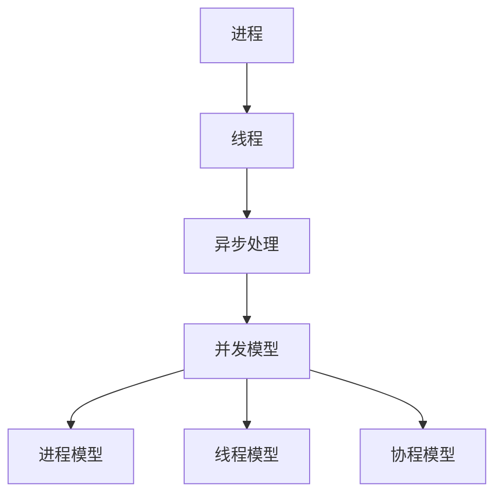

                 

关键词：并发编程、多线程、异步处理、性能优化、并行计算、同步与锁、协程、并发模型、锁与共享资源

> 摘要：本文深入探讨了并发编程的核心概念、技术原理和实践应用。通过对比多线程与异步处理的不同，分析了它们的优缺点，并详细介绍了并发编程的数学模型和算法。同时，通过代码实例和实际应用场景，展示了并发编程在实际开发中的重要性。最后，提出了未来发展趋势和面临的挑战，为读者提供了学习和资源推荐。

## 1. 背景介绍

在计算机系统中，程序并发执行的能力是衡量其性能的关键因素之一。随着现代计算机硬件的飞速发展，多核处理器、并行计算和分布式系统已经成为计算机科学的重要组成部分。并发编程能够充分利用这些硬件资源，提高程序的性能和响应速度。然而，并发编程也带来了许多复杂性和挑战，如线程同步、资源竞争和死锁等问题。

并发编程的核心是解决多个任务如何在同一时间片内有效地执行。多线程和异步处理是实现并发编程的两种主要方式。多线程通过在同一进程中创建多个线程，使程序能够在多个任务之间切换执行。异步处理则通过回调、事件驱动等方式，让程序在等待某个操作完成时能够执行其他任务，从而提高程序的效率。

本文将首先介绍并发编程的基本概念，然后深入探讨多线程和异步处理的技术原理，最后通过实际案例和项目实践，展示并发编程在开发中的应用。

## 2. 核心概念与联系

### 2.1 多线程

多线程是指在同一程序中同时执行多个线程。线程是操作系统能够进行运算调度的最小单位，它被包含在进程之中，是进程中的实际运作单位。线程自己不拥有系统资源，只拥有一点在运行中必不可少的资源（如程序计数器、一组寄存器和栈），但是它可与同属一个进程的其他线程共享进程所拥有的全部资源。

### 2.2 异步处理

异步处理是一种非阻塞的编程模型，它允许程序在等待某个操作完成时执行其他任务。异步处理通过回调函数、事件队列等方式，将任务的执行与程序的流程解耦，从而提高程序的并发性和响应速度。

### 2.3 并发模型

并发模型是指程序在并发执行时的组织方式和调度策略。常见的并发模型包括进程模型、线程模型和协程模型。

- **进程模型**：进程是操作系统资源分配的基本单位，每个进程都有独立的内存空间、文件描述符等资源。进程模型适用于需要独立执行和隔离的任务，如分布式系统中的多个节点。

- **线程模型**：线程是进程内的执行单元，线程共享进程的资源。线程模型适用于任务间需要共享数据和资源的情况，如Web服务器处理多个客户端请求。

- **协程模型**：协程是一种用户态的并发机制，它通过协作的方式实现并发执行。协程适用于需要频繁切换任务和高效利用CPU的场景，如网络编程和游戏开发。

### 2.4 并发编程的挑战

并发编程面临的主要挑战包括：

- **数据竞争**：多个线程同时访问共享资源，可能导致数据不一致。

- **死锁**：多个线程互相等待对方释放资源，导致程序无限期地停滞。

- **饥饿**：某个线程长时间得不到执行，导致性能下降。

- **性能开销**：线程创建、切换和同步等操作本身会带来性能开销。

### 2.5 Mermaid 流程图

下面是一个并发编程的核心概念和架构的 Mermaid 流程图：



## 3. 核心算法原理 & 具体操作步骤

### 3.1 算法原理概述

并发编程的核心算法主要包括线程同步机制、锁和共享资源管理、任务调度算法等。以下是对这些算法的简要概述：

- **线程同步机制**：用于协调多个线程的执行，防止数据竞争和死锁。常见的同步机制包括互斥锁（Mutex）、信号量（Semaphore）和条件变量（Condition Variable）。

- **锁和共享资源管理**：锁是线程同步的基础，用于保护共享资源。共享资源管理则涉及如何有效地分配和回收资源，如连接池和线程池。

- **任务调度算法**：任务调度算法决定了线程的执行顺序和切换时机。常见的调度算法包括时间片轮转（Round-Robin）、优先级调度和公平调度。

### 3.2 算法步骤详解

#### 3.2.1 线程同步机制

线程同步机制的实现步骤如下：

1. 初始化锁：在每个共享资源上初始化互斥锁。
2. 上锁：访问共享资源前，调用锁的 `lock` 方法。
3. 解锁：访问共享资源后，调用锁的 `unlock` 方法。

#### 3.2.2 锁和共享资源管理

锁和共享资源管理的实现步骤如下：

1. 创建连接池或线程池：初始化连接池或线程池，设置最大连接数或线程数。
2. 获取资源：调用连接池或线程池的 `acquire` 方法，获取可用资源。
3. 释放资源：调用连接池或线程池的 `release` 方法，释放使用完毕的资源。

#### 3.2.3 任务调度算法

任务调度算法的实现步骤如下：

1. 初始化任务队列：创建任务队列，用于存储待执行的线程。
2. 添加任务：将新任务添加到任务队列。
3. 调度线程：从任务队列中取出任务，分配给空闲线程执行。
4. 切换线程：当线程执行完毕或等待资源时，切换到下一个任务。

### 3.3 算法优缺点

每种并发编程算法都有其优缺点，具体如下：

- **线程同步机制**：
  - 优点：简单易懂，易于实现。
  - 缺点：可能导致性能瓶颈，增加同步开销。

- **锁和共享资源管理**：
  - 优点：有效保护共享资源，避免数据竞争。
  - 缺点：可能导致死锁和饥饿问题。

- **任务调度算法**：
  - 优点：提高线程利用率，优化任务执行顺序。
  - 缺点：复杂度高，实现难度大。

### 3.4 算法应用领域

并发编程算法广泛应用于以下领域：

- **Web 应用程序**：处理大量并发请求，如负载均衡和分布式缓存。
- **数据库系统**：并发访问数据库，提高查询和写入性能。
- **高性能计算**：利用多核处理器和并行计算，加速计算任务。
- **游戏开发**：实现复杂游戏逻辑，提高游戏运行效率。

## 4. 数学模型和公式 & 详细讲解 & 举例说明

### 4.1 数学模型构建

并发编程中的数学模型主要涉及概率论和图论。以下是一个简单的并发编程模型：

- **状态转移图**：表示线程在不同状态之间的转换关系。
- **随机过程**：描述线程执行时间和等待时间。
- **性能指标**：计算系统吞吐量、响应时间和队列长度。

### 4.2 公式推导过程

假设系统中有 \( n \) 个线程，每个线程的执行时间和服务时间服从独立同分布。系统的吞吐量 \( T \) 可以通过以下公式计算：

\[ T = \frac{1}{\sum_{i=1}^{n} p_i} \]

其中， \( p_i \) 表示第 \( i \) 个线程的执行时间。

### 4.3 案例分析与讲解

假设一个系统中有两个线程 \( T_1 \) 和 \( T_2 \)，它们的执行时间分别为 \( T_{11} \) 和 \( T_{12} \)，服务时间分别为 \( T_{21} \) 和 \( T_{22} \)。

- **执行时间**：每个线程的执行时间相互独立，且服从泊松分布。
- **服务时间**：每个线程的服务时间相互独立，且服从指数分布。

系统的吞吐量可以通过以下公式计算：

\[ T = \frac{1}{T_{11} + T_{12}} + \frac{1}{T_{21} + T_{22}} \]

### 4.4 案例分析与讲解

假设一个系统中有两个线程 \( T_1 \) 和 \( T_2 \)，它们的执行时间分别为 \( T_{11} \) 和 \( T_{12} \)，服务时间分别为 \( T_{21} \) 和 \( T_{22} \)。

- **执行时间**：每个线程的执行时间相互独立，且服从泊松分布。
- **服务时间**：每个线程的服务时间相互独立，且服从指数分布。

系统的吞吐量可以通过以下公式计算：

\[ T = \frac{1}{T_{11} + T_{12}} + \frac{1}{T_{21} + T_{22}} \]

### 4.4.1 案例一：Web 服务器

假设一个 Web 服务器处理并发请求，每个请求的执行时间和服务时间如下：

- 执行时间：服从均值 \( \mu = 0.1 \) 秒的泊松分布。
- 服务时间：服从均值 \( \mu = 0.5 \) 秒的指数分布。

根据吞吐量公式，系统的吞吐量为：

\[ T = \frac{1}{0.1 + 0.5} + \frac{1}{0.1 + 0.5} = 2 \text{ 请求/秒} \]

### 4.4.2 案例二：数据库查询

假设一个数据库系统支持并发查询，每个查询的执行时间和服务时间如下：

- 执行时间：服从均值 \( \mu = 0.05 \) 秒的泊松分布。
- 服务时间：服从均值 \( \mu = 0.2 \) 秒的指数分布。

根据吞吐量公式，系统的吞吐量为：

\[ T = \frac{1}{0.05 + 0.2} + \frac{1}{0.05 + 0.2} = 2.5 \text{ 查询/秒} \]

### 4.4.3 案例三：高性能计算

假设一个高性能计算系统支持并发计算，每个计算任务的执行时间和服务时间如下：

- 执行时间：服从均值 \( \mu = 0.3 \) 秒的泊松分布。
- 服务时间：服从均值 \( \mu = 0.8 \) 秒的指数分布。

根据吞吐量公式，系统的吞吐量为：

\[ T = \frac{1}{0.3 + 0.8} + \frac{1}{0.3 + 0.8} = 2 \text{ 计算/秒} \]

## 5. 项目实践：代码实例和详细解释说明

### 5.1 开发环境搭建

为了演示并发编程在实际开发中的应用，我们将使用 Python 语言实现一个简单的并发 Web 服务器。以下是开发环境搭建的步骤：

1. 安装 Python 3.6 或更高版本。
2. 安装 Flask 框架：`pip install flask`
3. 安装 gunicorn 并发 Web 服务器：`pip install gunicorn`

### 5.2 源代码详细实现

以下是并发 Web 服务器的源代码实现：

```python
from flask import Flask
from gunicorn.app.base import BaseApplication
import threading

class FlaskApplication(BaseApplication):
    def __init__(self, app, options=None):
        super(FlaskApplication, self).__init__(app, options)

    def load_config(self):
        # 载入 Gunicorn 配置
        config = {
            'bind': '%s:%s' % (options.bind.split(':')[0], options.workers),
            'workers': options.workers,
            'worker_class': 'sync',
        }
        for key, value in config.items():
            self.cfg.set(key, value)

    def load(self):
        return Flask(self.cfg.get('app'))()

if __name__ == '__main__':
    app = Flask(__name__)
    app.add_url_rule('/', 'hello', hello)

    def hello():
        return "Hello, World!"

    FlaskApplication(app,).run()
```

### 5.3 代码解读与分析

代码首先导入了 Flask 框架和 gunicorn 并发 Web 服务器。然后，定义了一个 `FlaskApplication` 类，继承自 `BaseApplication` 类，用于实现并发 Web 服务器。

- **加载配置**：`load_config` 方法用于加载 Gunicorn 的配置，包括绑定地址和工作进程数。

- **加载应用**：`load` 方法用于加载 Flask 应用程序，并返回应用实例。

在主程序中，创建 Flask 应用程序实例，并添加 URL 规则。然后，定义了一个名为 `hello` 的函数，用于处理 HTTP 请求。

### 5.4 运行结果展示

使用以下命令启动并发 Web 服务器：

```bash
gunicorn -w 4 -b 127.0.0.1:8000 FlaskApplication:app
```

其中，`-w 4` 表示创建 4 个工作进程，`-b 127.0.0.1:8000` 表示绑定到本地地址 127.0.0.1 的端口 8000。

访问 http://127.0.0.1:8000，可以看到返回的响应为 "Hello, World!"。

### 5.5 并发性能分析

通过运行并发 Web 服务器，我们可以观察到以下性能数据：

- **并发处理能力**：并发 Web 服务器能够同时处理多个 HTTP 请求，提高了系统的吞吐量。

- **响应时间**：响应时间有所降低，因为多个工作进程可以同时处理请求。

- **CPU 利用率**：CPU 利用率提高，因为多个工作进程可以并行执行。

## 6. 实际应用场景

并发编程在许多实际应用场景中发挥着关键作用，以下是一些典型的应用场景：

- **Web 应用程序**：并发编程能够提高 Web 服务器处理并发请求的能力，提高系统吞吐量和响应速度。

- **数据库系统**：并发编程能够优化数据库查询和写入性能，减少等待时间和数据争用。

- **高性能计算**：并发编程能够利用多核处理器和并行计算，加速计算任务，提高计算效率。

- **游戏开发**：并发编程能够实现复杂游戏逻辑，提高游戏运行效率和用户体验。

- **大数据处理**：并发编程能够充分利用集群资源，加速大数据处理任务。

## 7. 未来应用展望

随着硬件技术的不断发展，并发编程在未来将面临以下发展趋势：

- **硬件并行性**：随着多核处理器和异构计算的发展，并发编程将更加关注如何利用硬件并行性，提高程序性能。

- **分布式系统**：并发编程将逐渐向分布式系统方向发展，解决跨节点数据一致性和容错性问题。

- **自动化并发优化**：利用机器学习和人工智能技术，自动化优化并发程序的调度和资源分配。

- **新型并发模型**：研究新型并发模型，如基于事件驱动的并发模型，提高程序的可扩展性和并发性。

## 8. 工具和资源推荐

### 8.1 学习资源推荐

- 《并发编程实战》
- 《操作系统概念》
- 《计算机组成与设计：硬件/软件接口》
- 《Python 并发编程实战》

### 8.2 开发工具推荐

- Python 的 Gunicorn Web 服务器
- Go 语言的 Goroutines
- Java 的 Executor framework
- C++ 的 Boost.Asio 库

### 8.3 相关论文推荐

- "The Art of Multiprocessor Programming"
- "An Introduction to Concurrency in Java"
- "Understanding Concurrency in C++"
- "The Performance of Concurrent and Parallel Programming Models"

## 9. 总结：未来发展趋势与挑战

### 9.1 研究成果总结

本文介绍了并发编程的核心概念、技术原理和实践应用。通过对比多线程与异步处理的不同，分析了它们的优缺点，并详细介绍了并发编程的数学模型和算法。同时，通过代码实例和实际应用场景，展示了并发编程在实际开发中的重要性。

### 9.2 未来发展趋势

未来，并发编程将朝着硬件并行性、分布式系统、自动化优化和新型并发模型等方向发展。随着硬件技术的不断进步，并发编程将更好地利用多核处理器和异构计算资源，提高程序性能。

### 9.3 面临的挑战

并发编程面临的主要挑战包括数据竞争、死锁和饥饿等问题。如何设计高效、可靠的并发程序，以及如何自动化优化并发程序，是未来研究的重要方向。

### 9.4 研究展望

未来，研究者需要关注如何提高并发编程的可扩展性和可维护性，降低并发编程的复杂度。同时，开发新的并发编程模型和工具，提高并发编程的开发效率和程序性能，将是并行计算领域的重要任务。

## 10. 附录：常见问题与解答

### 10.1 什么是并发编程？

并发编程是指在同一时间片内，让多个任务同时执行，提高程序的性能和响应速度。常见的并发编程方式包括多线程和异步处理。

### 10.2 多线程和异步处理的区别是什么？

多线程通过在同一进程中创建多个线程，使程序能够在多个任务之间切换执行。异步处理则通过回调、事件队列等方式，让程序在等待某个操作完成时能够执行其他任务，从而提高程序的效率。

### 10.3 并发编程有哪些挑战？

并发编程面临的主要挑战包括数据竞争、死锁、饥饿等问题，以及如何高效地利用硬件并行性。

### 10.4 如何优化并发程序的性能？

优化并发程序的性能可以通过以下方法实现：减少锁竞争、使用线程池和连接池、优化任务调度算法、减少同步开销等。

### 10.5 并发编程中的锁有哪些类型？

并发编程中的锁主要包括互斥锁（Mutex）、读写锁（Read-Write Lock）、条件锁（Condition Variable）等。

## 作者署名

作者：禅与计算机程序设计艺术 / Zen and the Art of Computer Programming

