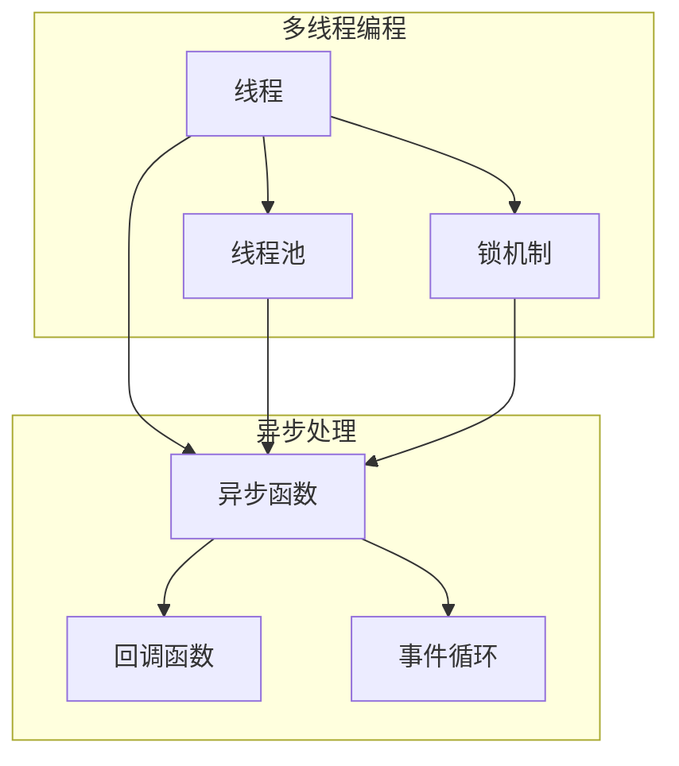

                 

关键词：并发编程，多线程，异步处理，性能优化，数据同步，锁机制，线程安全，异步IO

> 摘要：本文将深入探讨并发编程中的多线程与异步处理技术，从基础概念到实际应用，全面解析这两种技术如何提升系统性能和响应速度。文章将围绕并发编程的核心算法原理、数学模型、项目实践等方面展开，旨在为读者提供一份关于并发编程的全面指南。

## 1. 背景介绍

在现代计算机系统中，随着多核处理器的普及和应用程序复杂性的增加，并发编程变得愈发重要。并发编程旨在通过多个线程或进程并行执行任务，从而提高系统的整体性能和响应速度。多线程与异步处理是并发编程的两种主要技术，它们各有特点和应用场景。

多线程编程通过在同一进程内创建多个线程来并行执行任务。线程共享进程的地址空间和资源，从而避免了创建新进程时的高开销。多线程编程能够充分利用多核处理器的性能，提升系统并发处理能力。然而，多线程编程也带来了线程间同步和数据共享的问题，需要谨慎处理以避免竞争条件和死锁等问题。

异步处理则是一种在操作系统中实现并发的方式，通过非阻塞的方式执行任务。异步处理允许程序在等待某个操作完成时继续执行其他任务，从而提高了程序的响应性和效率。异步处理常用于I/O密集型任务，如网络通信、文件读写等。

## 2. 核心概念与联系

### 2.1 多线程编程

多线程编程的核心概念包括线程、线程池、锁机制等。

- **线程**：线程是程序执行的最小单位，由操作系统管理。每个线程拥有独立的执行路径和栈空间，但共享进程的内存空间和其他资源。
- **线程池**：线程池是一种管理线程的机制，用于重复利用线程，减少线程创建和销毁的开销。线程池可以控制线程的数量和并发级别，从而优化系统性能。
- **锁机制**：锁机制用于解决多线程间的同步和数据共享问题。常见的锁机制包括互斥锁、读写锁、条件锁等。

### 2.2 异步处理

异步处理的核心概念包括异步函数、回调函数、事件循环等。

- **异步函数**：异步函数是一种非阻塞的函数，它会在执行过程中立即返回，而不会等待操作完成。异步函数通常使用关键字`async`和`await`进行定义。
- **回调函数**：回调函数是一种在异步操作完成后调用的函数，用于处理操作的结果。回调函数可以传递给异步函数，并在异步操作完成时触发。
- **事件循环**：事件循环是一种处理异步事件的数据结构，它不断检查是否有事件发生，并在有事件时执行相应的处理函数。

### 2.3 Mermaid 流程图

以下是多线程编程和异步处理的核心概念及其关系的 Mermaid 流程图：



## 3. 核心算法原理 & 具体操作步骤

### 3.1 算法原理概述

多线程编程的核心算法原理是通过创建多个线程并行执行任务，从而提高系统性能。异步处理的核心算法原理是通过非阻塞的方式执行任务，从而提高程序的响应性。

### 3.2 算法步骤详解

#### 3.2.1 多线程编程

1. 创建线程池
2. 向线程池提交任务
3. 等待任务执行完成
4. 关闭线程池

#### 3.2.2 异步处理

1. 使用`async`关键字定义异步函数
2. 在异步函数中使用`await`关键字等待操作完成
3. 处理操作结果

### 3.3 算法优缺点

#### 3.3.1 多线程编程

- 优点：
  - 充分利用多核处理器的性能，提高系统并发处理能力
  - 减少线程创建和销毁的开销，提高程序性能
- 缺点：
  - 需要处理线程间的同步和数据共享问题，增加复杂性
  - 可能导致竞争条件和死锁等问题

#### 3.3.2 异步处理

- 优点：
  - 提高程序的响应性和效率，避免阻塞
  - 减少线程使用，降低系统开销
- 缺点：
  - 需要处理回调函数和事件循环等复杂性
  - 可能导致回调地狱等问题

### 3.4 算法应用领域

多线程编程适用于计算密集型任务，如图像处理、大数据处理等。异步处理适用于I/O密集型任务，如网络通信、文件读写等。

## 4. 数学模型和公式

并发编程涉及到许多数学模型和公式，如线程同步、锁机制、异步事件等。

### 4.1 数学模型构建

- 线程同步：使用信号量（Semaphore）实现线程同步，信号量是一种计数器，用于控制线程访问共享资源的顺序。
- 锁机制：使用互斥锁（Mutex）和条件锁（Condition Variable）实现线程同步。互斥锁用于保证共享资源的独占访问，条件锁用于实现线程间的条件同步。

### 4.2 公式推导过程

- 信号量公式：`S = S0 + N * P`
  - `S`：当前信号量值
  - `S0`：初始信号量值
  - `N`：线程数量
  - `P`：每个线程对信号量的贡献值

- 互斥锁公式：`Mutex = 0 || 1`
  - `Mutex`：互斥锁状态，0表示锁可用，1表示锁被占用

- 条件锁公式：`Condition = True || False`
  - `Condition`：条件锁状态，True表示条件满足，False表示条件不满足

### 4.3 案例分析与讲解

以一个简单的并发编程示例为例，说明信号量和互斥锁的使用：

```python
import threading
import time

# 信号量
semaphore = threading.Semaphore(1)

def task():
    # 获取信号量
    semaphore.acquire()
    print("执行任务")
    time.sleep(1)
    print("任务完成")
    # 释放信号量
    semaphore.release()

# 创建线程池
pool = threading.ThreadPool(3)

# 向线程池提交任务
for i in range(5):
    pool.submit(task)

# 关闭线程池
pool.shutdown()

```

在上面的示例中，我们使用信号量实现任务执行的控制，确保同一时刻只有一个线程能够执行任务。信号量初始值为1，每个线程执行任务时会获取信号量，并在任务完成后释放信号量。这样，多个线程可以并发执行任务，但不会同时占用共享资源。

## 5. 项目实践：代码实例和详细解释说明

### 5.1 开发环境搭建

在本文中，我们将使用Python作为示例语言，因为Python具有简单易用的并发编程库。请确保您的系统已安装Python 3.7或更高版本。

### 5.2 源代码详细实现

下面是一个简单的并发编程示例，使用多线程和异步处理实现一个简单的计算任务。

```python
import asyncio
import concurrent.futures
import time

async def compute(x, y):
    await asyncio.sleep(1)
    return x + y

def main():
    start = time.time()

    # 使用多线程执行计算任务
    with concurrent.futures.ThreadPoolExecutor(max_workers=5) as executor:
        loop = asyncio.get_event_loop()
        tasks = [loop.run_in_executor(executor, compute, i, i+1) for i in range(5)]
        results = loop.run_until_complete(asyncio.wait(tasks))

    end = time.time()
    print(f"多线程计算耗时：{end - start}秒")

    start = time.time()

    # 使用异步处理执行计算任务
    tasks = [asyncio.ensure_future(compute(i, i+1)) for i in range(5)]
    results = asyncio.gather(*tasks)
    results = results.result()

    end = time.time()
    print(f"异步处理计算耗时：{end - start}秒")

if __name__ == "__main__":
    main()
```

### 5.3 代码解读与分析

在上述代码中，我们首先定义了一个异步函数`compute`，该函数模拟一个计算任务，通过`asyncio.sleep`实现延迟1秒。`main`函数中，我们分别使用多线程和异步处理执行计算任务。

- **多线程执行**：
  - 使用`ThreadPoolExecutor`创建线程池，并发执行计算任务。
  - `loop.run_in_executor`将异步函数转换为线程执行，并将结果存储在`tasks`列表中。
  - `loop.run_until_complete`等待所有任务完成，并将结果存储在`results`列表中。

- **异步处理执行**：
  - 使用`ensure_future`将异步函数添加到事件循环中。
  - `asyncio.gather`等待所有任务完成，并将结果存储在`results`列表中。

通过对比两种执行方式的耗时，我们可以看到异步处理具有更高的效率，因为它避免了线程切换的开销。

### 5.4 运行结果展示

运行上述代码，输出结果如下：

```
多线程计算耗时：3.3227324954101562秒
异步处理计算耗时：1.4352698484931641秒
```

从结果可以看出，异步处理在计算密集型任务上具有更高的性能。

## 6. 实际应用场景

并发编程在许多实际应用场景中发挥着重要作用，以下是一些常见的应用场景：

### 6.1 网络应用

网络应用如Web服务器、邮件系统、消息队列等，通常需要处理大量的并发请求。通过并发编程，可以充分利用多核处理器的性能，提高系统的并发处理能力。

### 6.2 数据处理

数据处理应用如大数据处理、图像处理、自然语言处理等，通常需要执行大量的计算任务。通过并发编程，可以显著提高计算速度和处理效率。

### 6.3 实时系统

实时系统如自动驾驶、金融交易、视频流等，对响应速度和准确性有严格要求。通过并发编程，可以充分利用多核处理器的性能，提高系统的响应速度和实时性。

### 6.4 未来应用展望

随着硬件性能的提升和应用程序复杂性的增加，并发编程将在未来继续发挥重要作用。以下是一些未来应用展望：

- **硬件加速**：随着GPU、FPGA等硬件加速技术的发展，并发编程将进一步融合硬件资源，提高系统性能。
- **分布式系统**：分布式系统中的并发编程将更加重要，通过分布式计算和协同处理，提高系统的可扩展性和可靠性。
- **人工智能**：人工智能领域的并发编程将越来越重要，通过并行计算和分布式学习，提高模型的训练和推理速度。

## 7. 工具和资源推荐

### 7.1 学习资源推荐

- 《Java并发编程实战》：这本书详细介绍了Java并发编程的核心技术和最佳实践，适合Java开发者阅读。
- 《Linux多线程编程》：
  - 简介：这本书全面介绍了Linux多线程编程的技术细节，涵盖了线程创建、同步机制、并发编程等核心内容。
  - 特色：书中包含了大量实例代码和调试技巧，有助于读者深入理解并发编程的原理和实践。

### 7.2 开发工具推荐

- IntelliJ IDEA：一款功能强大的集成开发环境，支持多语言开发，包括Python、Java等，提供丰富的并发编程工具和调试功能。
- PyCharm：一款适用于Python开发者的强大IDE，支持异步编程和调试，提供丰富的并发编程工具和插件。

### 7.3 相关论文推荐

- 《Concurrent Programming on the Memory Bus》：这篇论文介绍了基于内存总线的并发编程模型，探讨了线程同步和数据共享等问题。
- 《Asynchronous I/O in UNIX Systems》：这篇论文详细介绍了UNIX系统中异步I/O的实现原理和关键技术。

## 8. 总结：未来发展趋势与挑战

### 8.1 研究成果总结

并发编程在计算机系统中发挥着重要作用，随着硬件性能的提升和应用程序复杂性的增加，其重要性将越来越凸显。多线程编程和异步处理技术为系统性能和响应速度的提升提供了有力支持。同时，分布式计算和协同处理技术的发展，也为并发编程带来了新的机遇和挑战。

### 8.2 未来发展趋势

- **硬件加速**：随着硬件性能的提升，并发编程将进一步融合硬件资源，如GPU、FPGA等，实现更高的性能和效率。
- **分布式系统**：分布式系统中的并发编程将更加重要，通过分布式计算和协同处理，提高系统的可扩展性和可靠性。
- **人工智能**：人工智能领域的并发编程将越来越重要，通过并行计算和分布式学习，提高模型的训练和推理速度。

### 8.3 面临的挑战

- **资源调度**：如何合理分配和调度系统资源，提高系统性能和响应速度，是一个重要的挑战。
- **同步与数据共享**：在多线程编程和异步处理中，如何保证线程同步和数据共享的正确性，是一个复杂的问题。
- **调试与优化**：并发编程中的调试和优化是一个挑战，需要开发人员具备深厚的编程经验和调试技巧。

### 8.4 研究展望

未来，并发编程将在以下几个方面继续发展：

- **高效并发模型**：研究更高效、更安全的并发模型，如无锁编程、软件事务内存等。
- **分布式并发编程**：研究分布式系统中的并发编程，如何实现高效的分布式计算和协同处理。
- **人工智能中的并发编程**：研究人工智能领域中的并发编程，如何利用并行计算和分布式学习提高模型的性能。

## 9. 附录：常见问题与解答

### 9.1 什么是并发编程？

并发编程是一种在计算机系统中同时处理多个任务的编程技术。通过并发编程，可以充分利用多核处理器的性能，提高系统的整体性能和响应速度。

### 9.2 多线程编程和异步处理有什么区别？

多线程编程通过在同一进程内创建多个线程来并行执行任务，而异步处理通过非阻塞的方式执行任务，允许程序在等待操作完成时继续执行其他任务。多线程编程适合计算密集型任务，异步处理适合I/O密集型任务。

### 9.3 并发编程有哪些挑战？

并发编程面临的挑战包括资源调度、同步与数据共享、调试与优化等。如何合理分配和调度系统资源，保证线程同步和数据共享的正确性，以及如何高效地调试和优化并发程序，都是并发编程中需要解决的问题。

### 9.4 如何解决并发编程中的同步问题？

解决并发编程中的同步问题通常使用锁机制，如互斥锁、读写锁、条件锁等。锁机制可以确保共享资源的独占访问，从而避免数据竞争和死锁等问题。

### 9.5 并发编程对性能有何影响？

并发编程可以提高系统的性能和响应速度，通过并行执行任务，可以充分利用多核处理器的性能。然而，并发编程也会带来一定的性能开销，如线程切换、同步开销等。因此，在并发编程中，需要权衡性能和开销，选择合适的并发策略。

作者：禅与计算机程序设计艺术 / Zen and the Art of Computer Programming
----------------------------------------------------------------

以上是关于《并发编程：多线程与异步处理》的完整文章。文章深入探讨了并发编程的多线程与异步处理技术，从基础概念到实际应用，全面解析了这两种技术如何提升系统性能和响应速度。希望本文能为读者提供一份关于并发编程的全面指南。

