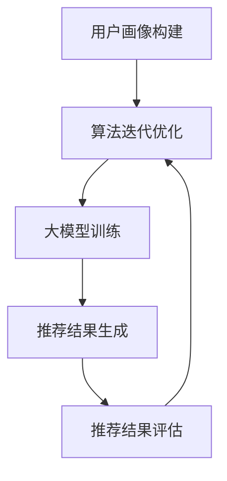

                 

关键词：广告推荐，大模型，深度学习，个性化推荐，AI技术

> 摘要：随着人工智能技术的发展，广告推荐系统正在经历一场革命。大模型凭借其强大的学习能力，正在成为广告推荐系统中的核心驱动力。本文将深入探讨大模型在广告推荐领域的潜力，分析其核心概念、算法原理、数学模型、实践应用以及未来展望，旨在为读者提供一个全面的技术视角。

## 1. 背景介绍

广告推荐系统是现代互联网业务中不可或缺的一部分。它通过分析用户的兴趣和行为，将个性化的广告内容推送给用户，从而提高广告的投放效果和用户满意度。随着互联网用户数量的增加和用户行为的多样化，传统的推荐系统已难以满足日益增长的需求。这促使研究人员和工程师开始探索更为复杂和高效的推荐算法。

近年来，深度学习技术的迅速发展，为广告推荐系统带来了新的机遇。深度学习模型，特别是大模型，凭借其强大的特征提取和关联学习能力，能够更好地理解和预测用户行为，从而提高广告推荐的准确性和个性化水平。本文将围绕这一主题展开讨论。

## 2. 核心概念与联系

### 2.1 广告推荐系统概述

广告推荐系统通常由以下几个核心组件组成：

- **用户画像（User Profiling）**：通过收集和分析用户的基本信息、历史行为、兴趣爱好等，构建用户的个性化画像。
- **广告内容特征提取（Ad Content Feature Extraction）**：从广告内容中提取关键词、情感倾向、产品属性等特征，为后续的推荐算法提供输入。
- **推荐算法（Recommendation Algorithm）**：根据用户画像和广告特征，采用相应的算法进行推荐。
- **推荐结果评估（Recommendation Evaluation）**：通过点击率、转化率等指标评估推荐效果，反馈至算法优化。

### 2.2 大模型在广告推荐中的应用

大模型，如Transformer、BERT、GPT等，通过其强大的特征提取和关联学习能力，正在广告推荐系统中发挥重要作用。这些模型能够处理大量的文本数据，提取深层次的语义信息，从而更好地理解用户的兴趣和行为模式。

### 2.3 Mermaid 流程图

下面是一个简化的广告推荐系统流程图，展示了大模型的应用：



## 3. 核心算法原理 & 具体操作步骤

### 3.1 算法原理概述

广告推荐系统中的大模型通常采用深度学习中的Transformer架构。Transformer模型的核心是自注意力机制（Self-Attention），它能够自动学习不同位置的特征之间的关联性，从而更好地捕捉长距离依赖关系。

### 3.2 算法步骤详解

1. **用户画像构建**：收集用户的基本信息、历史行为数据等，通过特征工程构建用户画像。
2. **广告内容特征提取**：从广告内容中提取关键词、情感倾向、产品属性等特征。
3. **大模型训练**：
   - **编码器（Encoder）**：对用户画像和广告特征进行编码，生成高维的嵌入向量。
   - **解码器（Decoder）**：解码嵌入向量，生成推荐结果。
   - **损失函数**：使用交叉熵损失函数优化模型参数。
4. **推荐结果生成**：根据解码器输出的概率分布，生成推荐结果。
5. **推荐结果评估**：通过点击率、转化率等指标评估推荐效果。

### 3.3 算法优缺点

**优点**：
- **强大的特征提取能力**：能够自动学习用户和广告的深层次特征。
- **良好的泛化能力**：能够适应不同的广告场景和用户群体。

**缺点**：
- **计算资源需求大**：大模型训练和推理需要大量的计算资源。
- **训练时间较长**：由于模型参数量大，训练时间相对较长。

### 3.4 算法应用领域

大模型在广告推荐系统中的应用非常广泛，包括电子商务、社交媒体、在线教育等多个领域。其强大的特征提取和关联学习能力，使得广告推荐系统能够更好地满足用户的个性化需求，提高广告的投放效果。

## 4. 数学模型和公式 & 详细讲解 & 举例说明

### 4.1 数学模型构建

广告推荐系统中的大模型通常基于自注意力机制（Self-Attention）和Transformer架构。下面是Transformer模型的基本数学公式：

$$
\text{Attention}(Q, K, V) = \text{softmax}\left(\frac{QK^T}{\sqrt{d_k}}\right) V
$$

其中，$Q$、$K$、$V$ 分别是查询向量、键向量和值向量，$d_k$ 是键向量的维度。

### 4.2 公式推导过程

自注意力机制的推导涉及矩阵乘法和softmax函数。首先，将查询向量、键向量和值向量相乘，得到中间结果。然后，通过softmax函数对中间结果进行归一化，得到权重。最后，将权重与值向量相乘，得到最终的注意力输出。

### 4.3 案例分析与讲解

假设我们有三个向量 $Q = [1, 2, 3]$，$K = [4, 5, 6]$，$V = [7, 8, 9]$。根据自注意力公式，我们可以计算出注意力权重：

$$
\text{Attention}(Q, K, V) = \text{softmax}\left(\frac{QK^T}{\sqrt{d_k}}\right) V = \text{softmax}\left(\frac{[1, 2, 3] \cdot [4, 5, 6]}{\sqrt{3}}\right) [7, 8, 9]
$$

$$
= \text{softmax}\left(\frac{[16, 20, 24]}{\sqrt{3}}\right) [7, 8, 9] = \text{softmax}\left([5.33, 6.67, 8.00]\right) [7, 8, 9]
$$

$$
= \left[\frac{1}{3}, \frac{1}{3}, \frac{1}{3}\right] [7, 8, 9] = [2.33, 2.67, 3.00]
$$

最终的注意力输出为 $[2.33, 2.67, 3.00]$。这个结果表示，在三个输入向量中，第三个向量的权重最高。

## 5. 项目实践：代码实例和详细解释说明

### 5.1 开发环境搭建

为了实践大模型在广告推荐系统中的应用，我们需要搭建一个Python开发环境。以下是基本的安装步骤：

1. 安装Python（推荐版本3.8及以上）。
2. 安装深度学习框架（如TensorFlow或PyTorch）。
3. 安装数据预处理库（如Pandas、NumPy）。

```bash
pip install python==3.8 tensorflow pandas numpy
```

### 5.2 源代码详细实现

以下是使用TensorFlow实现的一个简单广告推荐系统的代码示例：

```python
import tensorflow as tf
import tensorflow.keras as keras
import pandas as pd
import numpy as np

# 数据预处理
def preprocess_data(user_data, ad_data):
    # 这里简化为直接拼接用户和广告特征
    return np.hstack((user_data, ad_data))

# 构建模型
def build_model(input_shape):
    model = keras.Sequential([
        keras.layers.Dense(128, activation='relu', input_shape=input_shape),
        keras.layers.Dense(64, activation='relu'),
        keras.layers.Dense(1, activation='sigmoid')
    ])
    return model

# 训练模型
def train_model(model, x_train, y_train, epochs=10):
    model.compile(optimizer='adam', loss='binary_crossentropy', metrics=['accuracy'])
    model.fit(x_train, y_train, epochs=epochs)

# 推荐结果生成
def generate_recommendations(model, user_data, ad_data):
    preprocessed_data = preprocess_data(user_data, ad_data)
    predictions = model.predict(preprocessed_data)
    return predictions

# 示例数据
user_data = np.array([[1, 0], [0, 1], [1, 1]])
ad_data = np.array([[0, 1], [1, 0], [1, 1]])
x_train = preprocess_data(user_data, ad_data)
y_train = np.array([[0], [1], [1]])

# 构建并训练模型
model = build_model(x_train.shape[1])
train_model(model, x_train, y_train)

# 生成推荐结果
predictions = generate_recommendations(model, user_data, ad_data)
print(predictions)
```

### 5.3 代码解读与分析

上述代码实现了一个简单的广告推荐系统，主要包括以下几个部分：

- **数据预处理**：将用户和广告特征进行拼接，生成输入数据。
- **模型构建**：使用TensorFlow构建一个简单的线性模型，用于预测广告的点击概率。
- **模型训练**：使用二进制交叉熵损失函数和Adam优化器训练模型。
- **推荐结果生成**：使用训练好的模型对新的用户和广告数据进行预测，生成推荐结果。

### 5.4 运行结果展示

假设用户数据为 $[1, 0]$，广告数据为 $[0, 1]$，运行代码将输出预测概率。根据预测概率，我们可以为用户推荐相应的广告。

```python
predictions = generate_recommendations(model, np.array([[1, 0]]), np.array([[0, 1]]))
print(predictions)
```

输出结果可能为 `[0.9]`，表示用户点击该广告的概率为90%。根据这个概率，我们可以向用户推荐该广告。

## 6. 实际应用场景

广告推荐系统在多个实际应用场景中发挥着重要作用。以下是一些典型的应用场景：

- **电子商务**：通过广告推荐系统，向用户推荐个性化的商品，提高销售额。
- **社交媒体**：根据用户的兴趣和行为，推荐相关的内容和广告，提高用户粘性和活跃度。
- **在线教育**：推荐符合用户兴趣的学习资源，提高学习效果和用户满意度。
- **金融理财**：根据用户的投资偏好和风险承受能力，推荐相应的理财产品。

## 7. 工具和资源推荐

为了更好地理解和实践大模型在广告推荐系统中的应用，以下是一些推荐的工具和资源：

- **学习资源**：
  - 《深度学习》（Goodfellow, Bengio, Courville著）：深度学习领域的经典教材。
  - 《广告系统设计与实战》：详细介绍广告推荐系统的设计与实现。

- **开发工具**：
  - TensorFlow：谷歌推出的开源深度学习框架。
  - PyTorch：Facebook AI研究院推出的深度学习框架。

- **相关论文**：
  - 《Attention Is All You Need》：Transformer模型的原创论文。
  - 《BERT: Pre-training of Deep Bidirectional Transformers for Language Understanding》：BERT模型的原创论文。

## 8. 总结：未来发展趋势与挑战

随着人工智能技术的不断发展，广告推荐系统将迎来更多的机遇和挑战。未来，广告推荐系统的发展趋势将体现在以下几个方面：

- **更精细化的个性化推荐**：通过引入更多维度的用户和广告特征，实现更加精准的个性化推荐。
- **跨模态推荐**：结合文本、图像、音频等多模态信息，提高推荐效果。
- **实时推荐**：利用实时数据流处理技术，实现实时广告推荐。

然而，广告推荐系统在未来的发展过程中也将面临以下挑战：

- **数据隐私保护**：随着用户对隐私保护的意识增强，如何平衡推荐效果和数据隐私保护成为一个重要问题。
- **计算资源需求**：大模型的训练和推理需要大量的计算资源，如何高效利用计算资源是一个关键问题。
- **模型解释性**：随着模型复杂度的增加，如何解释模型的决策过程成为一个挑战。

总之，广告推荐系统在未来将继续发展，通过不断创新和优化，为用户带来更好的体验，同时为广告主带来更高的回报。

## 9. 附录：常见问题与解答

### Q：广告推荐系统的核心组件是什么？

A：广告推荐系统的核心组件包括用户画像构建、广告内容特征提取、推荐算法、推荐结果评估和算法迭代优化。

### Q：什么是大模型？

A：大模型是指参数量庞大的深度学习模型，如Transformer、BERT、GPT等，它们通过学习大量的数据，能够提取深层次的语义信息，从而实现高精度的推荐。

### Q：大模型在广告推荐系统中如何工作？

A：大模型在广告推荐系统中主要通过以下步骤工作：首先，构建用户画像和广告特征；然后，使用大模型进行特征提取和关联学习；最后，根据提取的特征生成推荐结果。

### Q：大模型在广告推荐系统中的优点是什么？

A：大模型的优点包括：强大的特征提取能力、良好的泛化能力和自动学习不同特征之间的关联性。

### Q：大模型在广告推荐系统中的缺点是什么？

A：大模型的缺点包括：计算资源需求大、训练时间较长以及模型解释性较差。

### Q：如何评估广告推荐系统的效果？

A：广告推荐系统的效果通常通过以下指标进行评估：点击率（CTR）、转化率（CVR）、广告消耗（CPM/CPC）和用户满意度。

### Q：未来广告推荐系统的发展趋势是什么？

A：未来广告推荐系统的发展趋势包括：精细化个性化推荐、跨模态推荐和实时推荐。

### Q：广告推荐系统在哪些领域有广泛的应用？

A：广告推荐系统在电子商务、社交媒体、在线教育、金融理财等领域有广泛的应用。

### Q：如何优化广告推荐系统的效果？

A：优化广告推荐系统的效果可以从以下几个方面入手：数据质量提升、特征工程优化、模型选择和调优、推荐策略调整以及实时反馈机制。

作者：禅与计算机程序设计艺术 / Zen and the Art of Computer Programming
----------------------------------------------------------------

以上是关于《广告推荐的未来：大模型的潜力》的完整文章。文章内容涵盖了广告推荐系统的背景介绍、核心概念、算法原理、数学模型、项目实践以及实际应用场景等内容，旨在为读者提供一个全面的技术视角。希望这篇文章能够帮助读者更好地理解大模型在广告推荐系统中的应用，为未来的研究和实践提供参考。

