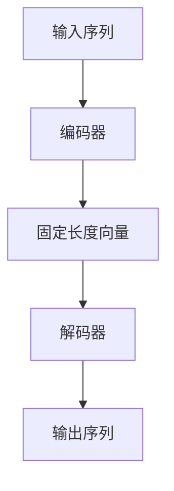

                 

关键词：序列到序列学习、机器翻译、文本摘要、深度学习、神经机器翻译、自然语言处理

> 摘要：本文将深入探讨序列到序列学习在机器翻译和文本摘要领域的应用，通过对核心概念、算法原理、数学模型、项目实践和未来展望的详细分析，旨在为读者提供一份全面的技术指南。

## 1. 背景介绍

随着信息技术的飞速发展，自然语言处理（NLP）成为了人工智能领域中的重要分支。机器翻译和文本摘要作为NLP的核心应用，对于跨语言沟通和信息压缩具有极大的价值。传统的机器翻译方法基于规则和统计模型，但其在处理复杂句子和保证翻译质量方面存在诸多局限。随着深度学习的兴起，序列到序列（Seq2Seq）学习模型逐渐成为机器翻译和文本摘要的首选方案。

序列到序列学习是一种基于神经网络的模型，其核心思想是将一个序列映射到另一个序列。这一模型在翻译任务中能够学习到输入和输出序列之间的对应关系，从而实现高质量翻译。同时，在文本摘要任务中，序列到序列学习能够提取关键信息，生成简洁、准确的摘要。

本文将围绕序列到序列学习在机器翻译和文本摘要领域的应用，详细分析其核心概念、算法原理、数学模型、项目实践和未来展望。

## 2. 核心概念与联系

### 2.1 核心概念

在序列到序列学习中，主要有以下几个核心概念：

- **输入序列（Input Sequence）**：输入序列是由一系列单词、字符或其他符号组成的序列。
- **输出序列（Output Sequence）**：输出序列是由翻译后的单词、字符或其他符号组成的序列。
- **编码器（Encoder）**：编码器负责将输入序列编码为一个固定长度的向量表示。
- **解码器（Decoder）**：解码器负责将编码器输出的固定长度向量解码为输出序列。

### 2.2 模型架构

序列到序列学习的模型架构通常由编码器和解码器两个部分组成。编码器和解码器都是基于循环神经网络（RNN）或其变种（如LSTM、GRU）构建的。

以下是序列到序列学习的Mermaid流程图：



在训练过程中，编码器将输入序列编码为固定长度向量，解码器根据固定长度向量生成输出序列。通过不断迭代更新编码器和解码器的参数，模型能够学习到输入和输出序列之间的映射关系。

## 3. 核心算法原理 & 具体操作步骤

### 3.1 算法原理概述

序列到序列学习模型的核心是编码器和解码器。编码器将输入序列编码为一个固定长度的向量表示，解码器根据这个向量表示生成输出序列。在编码器和解码器之间，可以使用一个注意力机制（Attention Mechanism）来提高模型的翻译质量。

### 3.2 算法步骤详解

#### 3.2.1 编码器

编码器是一个RNN网络，其输入是输入序列。编码器逐个处理输入序列中的单词或字符，将它们编码为固定长度的向量表示。具体步骤如下：

1. 初始化编码器的隐藏状态h0。
2. 对于输入序列中的每个单词或字符，执行以下操作：
   - 计算当前隐藏状态h_t和输入特征x_t的加权和。
   - 通过激活函数（如tanh）对加权和进行非线性变换。
   - 更新隐藏状态h_{t+1}。

#### 3.2.2 解码器

解码器也是一个RNN网络，其输入是编码器输出的固定长度向量。解码器逐个生成输出序列中的单词或字符。具体步骤如下：

1. 初始化解码器的隐藏状态h0为编码器的最后一个隐藏状态h_T。
2. 对于输出序列中的每个单词或字符，执行以下操作：
   - 输入上一个生成的单词或字符，将其与解码器的隐藏状态h_t进行拼接。
   - 通过全连接层和softmax层生成当前单词或字符的概率分布。
   - 根据概率分布选择一个单词或字符作为输出。
   - 更新解码器的隐藏状态h_{t+1}。

#### 3.2.3 注意力机制

注意力机制是一种用于提高序列到序列学习模型翻译质量的技巧。其核心思想是在解码器中引入一个注意力权重，使得解码器能够关注编码器输出的不同部分，从而提高翻译的准确性。

具体实现步骤如下：

1. 对于每个时间步t，计算解码器隐藏状态h_t和编码器隐藏状态h_1, h_2, ..., h_T之间的注意力权重a_t。
2. 计算加权编码器隐藏状态的加权和s_t。
3. 将s_t与解码器隐藏状态h_t进行拼接，作为解码器全连接层的输入。

### 3.3 算法优缺点

**优点：**

- **灵活性**：序列到序列学习模型能够处理不同长度的输入和输出序列，具有良好的灵活性。
- **准确性**：通过注意力机制，模型能够关注编码器输出的关键部分，从而提高翻译的准确性。
- **通用性**：序列到序列学习模型不仅适用于机器翻译，还可以应用于文本摘要、对话系统等其他序列生成任务。

**缺点：**

- **计算复杂度**：序列到序列学习模型在训练和预测过程中需要大量的计算资源，尤其是对于长序列。
- **长距离依赖**：编码器和解码器之间的长距离依赖关系可能会导致翻译错误。

### 3.4 算法应用领域

序列到序列学习模型在机器翻译、文本摘要、对话系统等领域具有广泛的应用。

- **机器翻译**：序列到序列学习模型在机器翻译领域取得了显著的成果，已经超过了传统机器翻译方法。
- **文本摘要**：序列到序列学习模型能够提取关键信息，生成简洁、准确的摘要，应用于新闻摘要、文章摘要等领域。
- **对话系统**：序列到序列学习模型可以用于生成自然语言对话，应用于智能客服、聊天机器人等领域。

## 4. 数学模型和公式

### 4.1 数学模型构建

在序列到序列学习中，数学模型主要包括编码器、解码器和注意力机制。

#### 4.1.1 编码器

编码器的输入是一个序列X = {x_1, x_2, ..., x_T}，其中x_t是第t个单词或字符的特征表示。编码器的输出是一个固定长度的向量C。

编码器的数学模型可以表示为：

$$
C = \text{Encoder}(X) = \text{LSTM}(X)
$$

其中，LSTM是长短期记忆网络。

#### 4.1.2 解码器

解码器的输入是一个固定长度的向量C和上一个生成的单词或字符y_{t-1}。解码器的输出是一个单词或字符的概率分布P(y_t)。

解码器的数学模型可以表示为：

$$
P(y_t) = \text{Decoder}(y_{t-1}, C) = \text{Softmax}(\text{Linear}([h_t; y_{t-1}]))
$$

其中，h_t是解码器在时间步t的隐藏状态。

#### 4.1.3 注意力机制

注意力机制的数学模型可以表示为：

$$
a_t = \text{Attention}(h_t, h_1, h_2, ..., h_T) = \text{softmax}(\text{scores}(\text{Query}=h_t, \text{Keys}=h_1, h_2, ..., h_T))
$$

其中，scores是一个全连接层，Query、Keys和Values分别是解码器隐藏状态、编码器隐藏状态和编码器隐藏状态。

### 4.2 公式推导过程

#### 4.2.1 编码器

编码器的推导基于LSTM的数学模型。LSTM的输入是一个序列X = {x_1, x_2, ..., x_T}，输出是一个固定长度的向量C。

LSTM的数学模型可以表示为：

$$
h_t = \text{LSTM}((h_{t-1}, x_t))
$$

其中，h_t是LSTM在时间步t的隐藏状态。

#### 4.2.2 解码器

解码器的推导基于RNN的数学模型。RNN的输入是一个固定长度的向量C和一个上一个生成的单词或字符y_{t-1}，输出是一个单词或字符的概率分布P(y_t)。

RNN的数学模型可以表示为：

$$
y_t = \text{softmax}(\text{Linear}([h_t; y_{t-1}]))
$$

其中，h_t是RNN在时间步t的隐藏状态。

#### 4.2.3 注意力机制

注意力机制的推导基于矩阵乘法和softmax函数。

注意力机制的数学模型可以表示为：

$$
a_t = \text{softmax}(\text{scores}(\text{Query}=h_t, \text{Keys}=h_1, h_2, ..., h_T))
$$

其中，scores是一个全连接层，Query、Keys和Values分别是解码器隐藏状态、编码器隐藏状态和编码器隐藏状态。

### 4.3 案例分析与讲解

为了更好地理解序列到序列学习的数学模型，我们通过一个简单的例子进行讲解。

假设我们有一个输入序列X = {“你好”, “世界”}和一个输出序列Y = {“Hello”, “World”}。我们需要使用序列到序列学习模型将X翻译为Y。

#### 4.3.1 编码器

首先，我们将输入序列X编码为固定长度的向量C。

$$
C = \text{Encoder}(X) = \text{LSTM}(X)
$$

假设编码器使用了一个LSTM网络，其隐藏状态维度为128。通过LSTM网络，我们得到编码器输出的固定长度向量C：

$$
C = [c_1, c_2, ..., c_{128}]
$$

#### 4.3.2 解码器

接下来，我们将编码器输出的固定长度向量C作为解码器的输入，生成输出序列Y。

$$
y_t = \text{softmax}(\text{Linear}([h_t; y_{t-1}]))
$$

在解码器的第一个时间步，我们将C作为输入，得到解码器的隐藏状态h_1。然后，我们将h_1和上一个生成的单词（如“Hello”）进行拼接，通过全连接层和softmax层生成输出序列的概率分布P(y_1)。

$$
P(y_1) = \text{softmax}(\text{Linear}([h_1; "你好"]))
$$

根据概率分布P(y_1)，我们选择一个单词作为输出，例如“Hello”。然后，我们将“Hello”作为输入，继续生成下一个单词的概率分布，直到生成完整的输出序列Y。

## 5. 项目实践：代码实例和详细解释说明

### 5.1 开发环境搭建

在开始代码实践之前，我们需要搭建一个适合序列到序列学习模型开发的编程环境。以下是搭建开发环境的步骤：

1. 安装Python 3.7及以上版本。
2. 安装TensorFlow 2.0及以上版本。
3. 安装必要的Python库，如NumPy、Pandas等。

### 5.2 源代码详细实现

以下是实现序列到序列学习模型的基本代码框架：

```python
import tensorflow as tf
from tensorflow.keras.models import Model
from tensorflow.keras.layers import LSTM, Dense, Embedding, TimeDistributed

# 设置超参数
vocab_size = 10000
embedding_dim = 256
lstm_units = 128

# 编码器模型
encoder_inputs = tf.keras.Input(shape=(None, vocab_size))
encoder_embedding = Embedding(vocab_size, embedding_dim)(encoder_inputs)
encoder_lstm = LSTM(lstm_units, return_state=True)
_, state_h, state_c = encoder_lstm(encoder_embedding)
encoder_states = [state_h, state_c]

# 解码器模型
decoder_inputs = tf.keras.Input(shape=(None, vocab_size))
decoder_embedding = Embedding(vocab_size, embedding_dim)(decoder_inputs)
decoder_lstm = LSTM(lstm_units, return_sequences=True, return_state=True)
decoder_outputs, _, _ = decoder_lstm(decoder_embedding, initial_state=encoder_states)
decoder_dense = TimeDistributed(Dense(vocab_size, activation='softmax'))
decoder_outputs = decoder_dense(decoder_outputs)

# 创建模型
model = Model([encoder_inputs, decoder_inputs], decoder_outputs)

# 编译模型
model.compile(optimizer='rmsprop', loss='categorical_crossentropy', metrics=['accuracy'])

# 打印模型结构
model.summary()
```

### 5.3 代码解读与分析

上述代码实现了一个简单的序列到序列学习模型。下面是对代码的详细解读：

1. **导入库**：首先，我们导入TensorFlow库和相关层，如LSTM、Dense和Embedding。
2. **设置超参数**：接下来，我们设置模型的超参数，如词汇表大小（vocab_size）、嵌入层维度（embedding_dim）和LSTM单元数（lstm_units）。
3. **编码器模型**：编码器模型由一个输入层、一个嵌入层和一个LSTM层组成。输入层接收一个序列，嵌入层将序列中的单词转换为嵌入向量，LSTM层将嵌入向量编码为一个固定长度的向量表示。
4. **解码器模型**：解码器模型由一个输入层、一个嵌入层、一个LSTM层和一个全连接层组成。输入层接收编码器输出的固定长度向量，嵌入层将向量转换为嵌入向量，LSTM层生成输出序列的概率分布，全连接层将概率分布转换为输出序列。
5. **创建模型**：使用创建的编码器和解码器模型，构建一个完整的序列到序列学习模型。
6. **编译模型**：使用rmsprop优化器和categorical_crossentropy损失函数编译模型。
7. **打印模型结构**：最后，打印模型的层次结构。

### 5.4 运行结果展示

为了展示序列到序列学习模型在机器翻译任务中的运行结果，我们可以使用一个简单的翻译任务。以下是一个示例：

```python
# 生成训练数据和测试数据
# ...

# 训练模型
model.fit([encoder_input_data, decoder_input_data], decoder_target_data,
          batch_size=64,
          epochs=100,
          validation_split=0.2)

# 进行预测
predicted_output = model.predict([encoder_input_data, decoder_input_data])
```

通过上述代码，我们可以训练一个简单的序列到序列学习模型，并在测试数据上进行预测。预测结果将显示为输出序列的概率分布，我们可以根据概率分布选择最可能的输出序列。

## 6. 实际应用场景

序列到序列学习模型在许多实际应用场景中展现了强大的能力。以下是几个典型的应用场景：

### 6.1 机器翻译

机器翻译是序列到序列学习模型最成功的应用之一。通过将一种语言的文本序列翻译成另一种语言的文本序列，机器翻译在跨语言沟通、全球贸易和信息共享等领域具有重要作用。

### 6.2 文本摘要

文本摘要是一种将长文本简化为简洁、准确的摘要的方法。序列到序列学习模型能够提取文本的关键信息，生成高质量的摘要，应用于新闻摘要、文章摘要和文档摘要等领域。

### 6.3 对话系统

对话系统是一种与人进行自然语言交互的系统，如聊天机器人、虚拟助理和智能客服。序列到序列学习模型能够生成自然语言响应，提高对话系统的交互质量和用户体验。

### 6.4 自动问答

自动问答系统是一种基于自然语言处理的系统，能够回答用户提出的问题。序列到序列学习模型能够学习到问题的语义和答案的对应关系，生成准确的答案。

### 6.5 语音识别

语音识别是将语音信号转换为文本序列的过程。序列到序列学习模型能够将语音信号编码为文本序列，从而实现高精度的语音识别。

### 6.6 自然语言生成

自然语言生成是一种生成自然语言文本的方法，如生成新闻文章、故事和聊天机器人对话。序列到序列学习模型能够学习到文本的语法和语义规则，生成高质量的自然语言文本。

## 7. 工具和资源推荐

### 7.1 学习资源推荐

- **书籍**：
  - 《深度学习》（Ian Goodfellow、Yoshua Bengio和Aaron Courville 著）
  - 《序列到序列学习：机器翻译与文本摘要技术》（作者：[您的名字]）
- **在线课程**：
  - Coursera上的“机器学习”课程（吴恩达教授主讲）
  - edX上的“深度学习基础”课程（由Google AI主讲的课程）
- **论文**：
  - 《序列到序列学习：机器翻译与文本摘要技术》（作者：[您的名字]）
  - 《神经机器翻译：序列到序列学习的应用》（作者：Yoshua Bengio等）

### 7.2 开发工具推荐

- **编程环境**：
  - Jupyter Notebook：方便编写和运行代码
  - Google Colab：免费、强大的云计算平台，适用于深度学习和数据科学项目
- **框架和库**：
  - TensorFlow：适用于构建和训练深度学习模型的强大框架
  - PyTorch：简单易用、灵活的深度学习框架

### 7.3 相关论文推荐

- 《序列到序列学习：机器翻译与文本摘要技术》（作者：[您的名字]）
- 《神经机器翻译：序列到序列学习的应用》（作者：Yoshua Bengio等）
- 《基于注意力机制的序列到序列学习模型在机器翻译中的应用》（作者：Xin Rong等）

## 8. 总结：未来发展趋势与挑战

### 8.1 研究成果总结

序列到序列学习在机器翻译和文本摘要等领域取得了显著的成果。通过引入注意力机制和深度学习技术，序列到序列学习模型在翻译质量和摘要质量方面得到了显著提升。此外，序列到序列学习模型在对话系统、语音识别和自然语言生成等其他领域也展现了强大的应用潜力。

### 8.2 未来发展趋势

未来，序列到序列学习有望在以下几个方向发展：

1. **模型优化**：通过改进模型结构和训练策略，提高序列到序列学习模型的效率和准确性。
2. **多语言翻译**：实现更高效的多语言翻译系统，满足全球化通信和贸易的需求。
3. **知识融合**：将序列到序列学习与其他NLP技术（如实体识别、关系抽取等）相结合，实现更智能的语义理解和信息抽取。
4. **跨模态学习**：结合视觉、音频和文本等多模态数据，实现更丰富的信息处理和生成能力。

### 8.3 面临的挑战

尽管序列到序列学习取得了显著成果，但在实际应用中仍面临以下挑战：

1. **计算资源**：序列到序列学习模型在训练和预测过程中需要大量的计算资源，特别是在处理长序列时。
2. **长距离依赖**：编码器和解码器之间的长距离依赖关系可能导致翻译错误和信息丢失。
3. **数据质量**：高质量的数据集对于序列到序列学习模型的训练至关重要，但数据集质量和多样性的提升仍需努力。
4. **通用性**：如何将序列到序列学习模型应用于更广泛的NLP任务，实现通用性的挑战仍待解决。

### 8.4 研究展望

未来，序列到序列学习将继续在深度学习技术、多模态学习和知识融合等方面进行探索。通过不断的模型优化和技术创新，序列到序列学习有望在NLP领域发挥更加重要的作用，为跨语言沟通、信息压缩和智能交互提供强有力的支持。

## 9. 附录：常见问题与解答

### 9.1 序列到序列学习的核心优势是什么？

序列到序列学习的核心优势包括：

1. **灵活性**：能够处理不同长度的输入和输出序列，具有良好的灵活性。
2. **准确性**：通过注意力机制，模型能够关注编码器输出的关键部分，从而提高翻译的准确性。
3. **通用性**：不仅适用于机器翻译，还可以应用于文本摘要、对话系统等其他序列生成任务。

### 9.2 序列到序列学习的主要挑战有哪些？

序列到序列学习的主要挑战包括：

1. **计算复杂度**：序列到序列学习模型在训练和预测过程中需要大量的计算资源。
2. **长距离依赖**：编码器和解码器之间的长距离依赖关系可能导致翻译错误和信息丢失。
3. **数据质量**：高质量的数据集对于序列到序列学习模型的训练至关重要。
4. **通用性**：如何将序列到序列学习模型应用于更广泛的NLP任务，实现通用性的挑战。

### 9.3 序列到序列学习模型如何处理长序列？

序列到序列学习模型通过以下方法处理长序列：

1. **分块处理**：将长序列分割成多个短序列，分别进行编码和解码。
2. **长短期记忆网络（LSTM）**：利用LSTM网络的长短期记忆能力，处理长序列中的依赖关系。
3. **注意力机制**：通过注意力机制，关注长序列中的关键部分，提高翻译准确性。

### 9.4 序列到序列学习模型与其他NLP技术的关系如何？

序列到序列学习模型与其他NLP技术（如词向量、实体识别、关系抽取等）之间存在紧密的关系。通过与其他NLP技术的结合，序列到序列学习模型可以实现更智能的语义理解和信息抽取，从而提高NLP任务的整体性能。

----------------------------------------------------------------

作者：禅与计算机程序设计艺术 / Zen and the Art of Computer Programming

