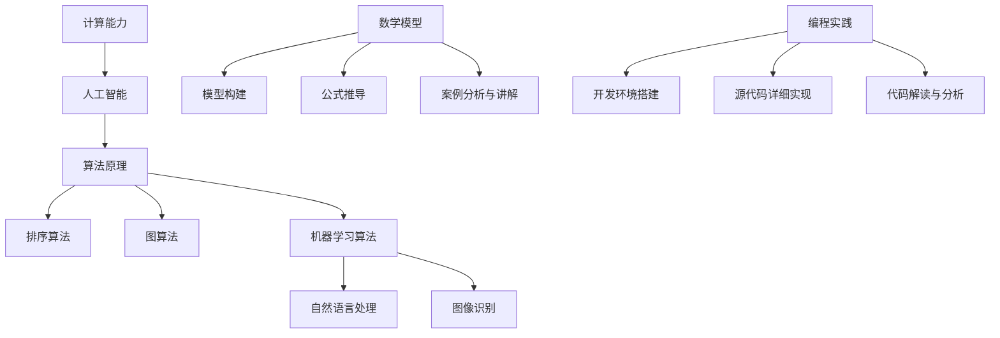

                 

关键词：计算能力、人工智能、算法原理、数学模型、编程实践、未来应用展望

> 摘要：本文将探讨计算能力在应对人类共同挑战中的重要作用，深入分析核心算法原理及其应用，结合数学模型和实际编程实践，展望计算技术的未来发展方向和面临的挑战。

## 1. 背景介绍

随着信息技术的飞速发展，计算能力已经成为推动社会进步的重要力量。从早期的计算机科学到今天的人工智能时代，计算技术不断革新，为人类解决各种复杂问题提供了强有力的工具。然而，面对全球性的气候变化、资源短缺、健康危机等重大挑战，计算能力的提升显得尤为重要。

本文旨在探讨计算能力在应对人类共同挑战中的使命担当，通过剖析核心算法原理、数学模型以及编程实践，揭示计算技术如何助力我们解决这些全球性问题。同时，我们还将对未来计算技术的发展方向和潜在挑战进行展望，以期激发更多研究者投身于这一领域。

## 2. 核心概念与联系

为了深入理解计算能力在解决人类共同挑战中的作用，我们需要了解以下几个核心概念及其相互关系。

### 2.1 计算能力

计算能力是指计算机在处理信息、执行计算任务的能力。它通常用计算速度、存储容量和算法效率等指标来衡量。随着摩尔定律的推动，计算能力在过去几十年里呈现出指数级增长，这为解决复杂问题提供了可能。

### 2.2 人工智能

人工智能（AI）是计算机科学的一个分支，旨在使计算机具备模拟、延伸和扩展人类智能的能力。从早期的规则系统到今天深度学习和神经网络，人工智能技术取得了显著的进展。AI在图像识别、自然语言处理、决策支持等领域发挥了重要作用，成为应对人类共同挑战的有力武器。

### 2.3 算法原理

算法是解决特定问题的步骤集合。不同的算法适用于不同的场景，其效率直接影响到计算能力。本文将重点介绍几种核心算法原理，包括排序算法、图算法和机器学习算法，并探讨它们在解决复杂问题中的应用。

### 2.4 数学模型

数学模型是一种用于描述现实世界问题的数学表示方法。通过构建数学模型，我们可以将实际问题转化为数学问题，从而运用计算技术进行求解。本文将介绍几种常用的数学模型及其在计算中的应用。

### 2.5 编程实践

编程实践是将算法和数学模型转化为具体程序的过程。本文将通过实际编程实例，展示如何运用计算技术解决具体问题，并为读者提供详细的代码解释和分析。

### 2.6 Mermaid 流程图

为了更直观地展示核心概念之间的联系，我们使用Mermaid流程图对相关概念进行梳理。以下是一个示例：



通过以上核心概念与联系的分析，我们可以看到计算能力在应对人类共同挑战中扮演着关键角色。接下来，我们将深入探讨这些核心概念的具体应用和实践。

## 3. 核心算法原理 & 具体操作步骤

### 3.1 算法原理概述

算法原理是计算技术的基础，本文将介绍以下几种核心算法原理：

1. **排序算法**：排序算法用于对一组数据进行排序，常见的排序算法有快速排序、归并排序和堆排序等。
2. **图算法**：图算法用于处理图结构的数据，常见的图算法有最短路径算法（Dijkstra算法和Floyd算法）和图遍历算法（DFS和BFS）。
3. **机器学习算法**：机器学习算法是人工智能的核心，包括监督学习、无监督学习和强化学习等。常见的机器学习算法有线性回归、决策树、支持向量机和神经网络等。

### 3.2 算法步骤详解

#### 3.2.1 排序算法

1. **快速排序**：
   - 步骤1：选择一个基准元素。
   - 步骤2：将数组分为两部分，一部分小于基准元素，另一部分大于基准元素。
   - 步骤3：递归地对小于和大于基准元素的两部分进行快速排序。

2. **归并排序**：
   - 步骤1：将数组划分为子数组，每个子数组只有一个元素。
   - 步骤2：将相邻的子数组进行合并，产生有序的数组。
   - 步骤3：递归地对合并后的数组进行归并排序。

3. **堆排序**：
   - 步骤1：构建最大堆。
   - 步骤2：将堆顶元素与最后一个元素交换。
   - 步骤3：调整堆结构，使剩余元素仍然构成最大堆。
   - 步骤4：重复步骤2和步骤3，直到堆中只剩下一个元素。

#### 3.2.2 图算法

1. **Dijkstra算法**：
   - 步骤1：初始化距离表，将所有节点的距离设置为无穷大，源节点的距离设置为0。
   - 步骤2：选择未处理的节点中距离最小的节点。
   - 步骤3：更新未处理的节点的距离，选择新的未处理的节点，重复步骤2和步骤3。

2. **Floyd算法**：
   - 步骤1：初始化距离表，将所有节点的距离设置为无穷大，对角线元素设置为0。
   - 步骤2：对于每个节点，考虑经过其他节点的路径。
   - 步骤3：更新距离表，选择新的最短路径，重复步骤2和步骤3。

3. **DFS和BFS**：
   - **DFS（深度优先搜索）**：
     - 步骤1：从源节点开始，访问一个未访问的邻居节点。
     - 步骤2：递归地对邻居节点进行DFS。
   - **BFS（广度优先搜索）**：
     - 步骤1：从源节点开始，将未访问的邻居节点加入队列。
     - 步骤2：从队列中取出一个节点，访问其未访问的邻居节点，加入队列。
     - 步骤3：重复步骤2，直到队列空。

#### 3.2.3 机器学习算法

1. **线性回归**：
   - 步骤1：计算输入特征的平均值和标准差。
   - 步骤2：对输入特征进行标准化处理。
   - 步骤3：训练线性回归模型，计算权重和偏置。
   - 步骤4：对测试数据进行预测，计算预测值和实际值之间的误差。

2. **决策树**：
   - 步骤1：选择一个最佳分割特征。
   - 步骤2：将数据集分为两个子集，根据最佳分割特征进行划分。
   - 步骤3：对子集递归地执行步骤1和步骤2，直到满足停止条件。

3. **支持向量机（SVM）**：
   - 步骤1：计算每个样本的特征向量。
   - 步骤2：计算支持向量机的超平面。
   - 步骤3：计算支持向量的权重和偏置。
   - 步骤4：对测试数据进行预测，计算预测值。

4. **神经网络**：
   - 步骤1：定义神经网络结构，包括输入层、隐藏层和输出层。
   - 步骤2：初始化权重和偏置。
   - 步骤3：正向传播，计算输出值。
   - 步骤4：反向传播，更新权重和偏置。
   - 步骤5：重复步骤3和步骤4，直到满足停止条件。

### 3.3 算法优缺点

1. **排序算法**：
   - 快速排序：优点是平均时间复杂度为\(O(n\log n)\)，缺点是 worst-case 时间复杂度为\(O(n^2)\)。
   - 归并排序：优点是稳定，时间复杂度为\(O(n\log n)\)，缺点是空间复杂度为\(O(n)\)。
   - 堆排序：优点是时间复杂度为\(O(n\log n)\)，缺点是不稳定。

2. **图算法**：
   - Dijkstra算法：优点是能找到单源最短路径，缺点是对于图中的负权边不适用。
   - Floyd算法：优点是能找到所有节点之间的最短路径，缺点是时间复杂度为\(O(n^3)\)。
   - DFS和BFS：优点是简单高效，缺点是对于大规模图可能导致内存溢出。

3. **机器学习算法**：
   - 线性回归：优点是简单易理解，缺点是对于非线性问题效果较差。
   - 决策树：优点是直观易懂，缺点是容易过拟合。
   - 支持向量机：优点是分类效果较好，缺点是计算复杂度高。
   - 神经网络：优点是能处理复杂非线性问题，缺点是训练过程耗时长，容易过拟合。

### 3.4 算法应用领域

1. **排序算法**：
   - 数据库索引：使用排序算法构建索引，提高查询效率。
   - 数据清洗：使用排序算法对数据进行预处理，去除重复值和异常值。

2. **图算法**：
   - 网络分析：使用图算法分析社交网络、交通网络等。
   - 路径规划：使用最短路径算法规划最佳路径。

3. **机器学习算法**：
   - 机器翻译：使用神经网络进行机器翻译，提高翻译质量。
   - 医疗诊断：使用决策树进行疾病诊断，辅助医生作出诊断决策。

通过以上对核心算法原理和具体操作步骤的介绍，我们可以看到计算技术在不同领域的广泛应用。接下来，我们将结合数学模型，进一步探讨计算技术在解决复杂问题中的应用。

## 4. 数学模型和公式 & 详细讲解 & 举例说明

### 4.1 数学模型构建

数学模型是描述现实世界问题的一种数学工具，通过构建数学模型，我们可以将实际问题转化为数学问题，从而运用计算技术进行求解。本文将介绍几种常见的数学模型，包括线性回归模型、决策树模型和神经网络模型。

#### 4.1.1 线性回归模型

线性回归模型用于拟合一组数据中的线性关系，其基本形式为：

\[ y = \beta_0 + \beta_1x_1 + \beta_2x_2 + \ldots + \beta_nx_n + \epsilon \]

其中，\( y \) 为因变量，\( x_1, x_2, \ldots, x_n \) 为自变量，\( \beta_0, \beta_1, \beta_2, \ldots, \beta_n \) 为模型参数，\( \epsilon \) 为随机误差。

#### 4.1.2 决策树模型

决策树模型是一种基于树形结构进行决策的分类模型，其基本形式为：

```
          |
        ---|---
       /     \
      /       \
     /         \
    /           \
   /             \
  /               \
 /----------------\
/                   \
```

决策树由根节点、内部节点和叶节点组成。根节点表示初始状态，内部节点表示根据某个特征进行分割，叶节点表示最终的决策结果。

#### 4.1.3 神经网络模型

神经网络模型是一种基于神经元连接进行信息处理的人工神经网络，其基本形式为：

```
          输入层
         /     \
        /       \
       /         \
      /           \
     /             \
    /               \
   /----------------\
  /                   \
 /---------------------\
/                       \
```

神经网络由多个层次组成，包括输入层、隐藏层和输出层。每个层次由多个神经元组成，神经元之间通过权重和偏置进行连接。

### 4.2 公式推导过程

#### 4.2.1 线性回归模型的公式推导

线性回归模型的目标是找到一组参数 \( \beta_0, \beta_1, \beta_2, \ldots, \beta_n \)，使得损失函数最小。损失函数通常采用均方误差（MSE）：

\[ J(\beta) = \frac{1}{2m}\sum_{i=1}^{m}(y_i - \beta_0 - \beta_1x_{i1} - \beta_2x_{i2} - \ldots - \beta_nx_{in})^2 \]

为了求得最小损失函数，需要对每个参数进行偏导数计算并令其为零：

\[ \frac{\partial J(\beta)}{\partial \beta_0} = 0 \]
\[ \frac{\partial J(\beta)}{\partial \beta_1} = 0 \]
\[ \frac{\partial J(\beta)}{\partial \beta_2} = 0 \]
\[ \ldots \]
\[ \frac{\partial J(\beta)}{\partial \beta_n} = 0 \]

经过求导和化简，得到：

\[ \beta_0 = \frac{1}{m}\sum_{i=1}^{m}(y_i - \beta_1x_{i1} - \beta_2x_{i2} - \ldots - \beta_nx_{in}) \]
\[ \beta_1 = \frac{1}{m}\sum_{i=1}^{m}(x_{i1}(y_i - \beta_0 - \beta_2x_{i2} - \ldots - \beta_nx_{in})) \]
\[ \beta_2 = \frac{1}{m}\sum_{i=1}^{m}(x_{i2}(y_i - \beta_0 - \beta_1x_{i1} - \ldots - \beta_nx_{in})) \]
\[ \ldots \]
\[ \beta_n = \frac{1}{m}\sum_{i=1}^{m}(x_{in}(y_i - \beta_0 - \beta_1x_{i1} - \ldots - \beta_{n-1}x_{i(n-1)})) \]

#### 4.2.2 决策树模型的公式推导

决策树模型的推导过程主要涉及信息论和熵的概念。熵是衡量随机变量不确定性的度量，定义为：

\[ H(X) = -\sum_{x \in \{x_1, x_2, \ldots, x_n\}} p(x) \log_2 p(x) \]

其中，\( p(x) \) 是随机变量 \( X \) 取值 \( x \) 的概率。

对于二分类问题，决策树模型的熵可以表示为：

\[ H(Y|X) = -\sum_{x \in \{x_1, x_2, \ldots, x_n\}} p(x) \sum_{y \in \{y_1, y_2\}} p(y|x) \log_2 p(y|x) \]

其中，\( Y \) 是目标变量，\( X \) 是特征变量，\( p(y|x) \) 是在给定特征 \( x \) 下目标变量 \( y \) 的概率。

为了降低熵，我们需要选择一个最佳分割特征，使得熵最小。最佳分割特征的选择可以通过计算信息增益（Information Gain）或基尼不纯度（Gini Impurity）来实现。

#### 4.2.3 神经网络模型的公式推导

神经网络模型的推导过程主要涉及前向传播和反向传播。前向传播是计算输出值的过程，包括以下步骤：

1. 计算输入层到隐藏层的输出值：
   \[ z^{[1]_i} = \sum_{j=1}^{n} w^{[1]_{ji}x^{[1]_j} + b^{[1]_i} \]
   \[ a^{[1]_i} = \sigma(z^{[1]_i}) \]

2. 计算隐藏层到输出层的输出值：
   \[ z^{[2]_i} = \sum_{j=1}^{n} w^{[2]_{ji}a^{[1]_j} + b^{[2]_i} \]
   \[ a^{[2]_i} = \sigma(z^{[2]_i}) \]

其中，\( \sigma \) 是激活函数，通常采用 sigmoid 函数或 ReLU 函数。

反向传播是更新权重和偏置的过程，包括以下步骤：

1. 计算输出层误差：
   \[ d^{[2]_i} = (y - a^{[2]_i}) \cdot \sigma'(z^{[2]_i}) \]

2. 计算隐藏层误差：
   \[ d^{[1]_i} = \sum_{j=1}^{n} w^{[2]_{ji}d^{[2]_j} \cdot \sigma'(z^{[1]_i}) \]

3. 更新权重和偏置：
   \[ w^{[2]}_{ji} = w^{[2]}_{ji} - \alpha \cdot d^{[2]_j} \cdot a^{[1]}_i \]
   \[ b^{[2]}_i = b^{[2]}_i - \alpha \cdot d^{[2]}_i \]

   \[ w^{[1]}_{ji} = w^{[1]}_{ji} - \alpha \cdot d^{[1]}_j \cdot x^{[1]}_i \]
   \[ b^{[1]}_i = b^{[1]}_i - \alpha \cdot d^{[1]}_i \]

### 4.3 案例分析与讲解

#### 4.3.1 线性回归模型案例分析

假设我们有一组数据，包含两个特征 \( x_1 \) 和 \( x_2 \)，以及目标变量 \( y \)。我们的目标是使用线性回归模型拟合这组数据，预测 \( y \) 的值。

1. **数据预处理**：
   - 计算每个特征的均值和标准差：
     \[ \bar{x}_1 = \frac{1}{m}\sum_{i=1}^{m}x_{i1} \]
     \[ \bar{x}_2 = \frac{1}{m}\sum_{i=1}^{m}x_{i2} \]
     \[ \sigma_x1 = \sqrt{\frac{1}{m}\sum_{i=1}^{m}(x_{i1} - \bar{x}_1)^2} \]
     \[ \sigma_x2 = \sqrt{\frac{1}{m}\sum_{i=1}^{m}(x_{i2} - \bar{x}_2)^2} \]

   - 对特征进行标准化处理：
     \[ x_{i1}^* = \frac{x_{i1} - \bar{x}_1}{\sigma_x1} \]
     \[ x_{i2}^* = \frac{x_{i2} - \bar{x}_2}{\sigma_x2} \]

2. **模型训练**：
   - 初始化模型参数：
     \[ \beta_0 = 0 \]
     \[ \beta_1 = 0 \]
     \[ \beta_2 = 0 \]

   - 计算损失函数：
     \[ J(\beta) = \frac{1}{2m}\sum_{i=1}^{m}(y_i - \beta_0 - \beta_1x_{i1}^* - \beta_2x_{i2}^*)^2 \]

   - 梯度下降法更新参数：
     \[ \beta_0 = \beta_0 - \alpha \cdot \frac{1}{m}\sum_{i=1}^{m}(y_i - \beta_0 - \beta_1x_{i1}^* - \beta_2x_{i2}^*) \]
     \[ \beta_1 = \beta_1 - \alpha \cdot \frac{1}{m}\sum_{i=1}^{m}(x_{i1}^*(y_i - \beta_0 - \beta_1x_{i1}^* - \beta_2x_{i2}^*)) \]
     \[ \beta_2 = \beta_2 - \alpha \cdot \frac{1}{m}\sum_{i=1}^{m}(x_{i2}^*(y_i - \beta_0 - \beta_1x_{i1}^* - \beta_2x_{i2}^*)) \]

3. **模型预测**：
   - 对新数据进行预测：
     \[ y^* = \beta_0 + \beta_1x_{1}^* + \beta_2x_{2}^* \]

#### 4.3.2 决策树模型案例分析

假设我们有一组数据，包含两个特征 \( x_1 \) 和 \( x_2 \)，以及目标变量 \( y \)。我们的目标是使用决策树模型对数据进行分类。

1. **数据预处理**：
   - 计算每个特征的熵：
     \[ H(x_1) = -\sum_{x_1 \in \{x_1_1, x_1_2, \ldots, x_1_n\}} p(x_1) \log_2 p(x_1) \]
     \[ H(x_2) = -\sum_{x_2 \in \{x_2_1, x_2_2, \ldots, x_2_n\}} p(x_2) \log_2 p(x_2) \]

   - 计算信息增益：
     \[ IG(x_1) = H(y) - \sum_{x_1 \in \{x_1_1, x_1_2, \ldots, x_1_n\}} p(x_1) H(y|x_1) \]
     \[ IG(x_2) = H(y) - \sum_{x_2 \in \{x_2_1, x_2_2, \ldots, x_2_n\}} p(x_2) H(y|x_2) \]

2. **模型训练**：
   - 选择信息增益最大的特征进行分割：
     \[ x_1^* = \arg\max_{x_1} IG(x_1) \]

   - 根据特征 \( x_1^* \) 的不同取值，将数据集分为两个子集：
     \[ D_1 = \{y_1, y_2, \ldots, y_n\} \]
     \[ D_2 = \{y_{n+1}, y_{n+2}, \ldots, y_{2n}\} \]

   - 对子集递归地执行步骤1和步骤2，直到满足停止条件（例如，子集大小小于阈值或熵小于阈值）。

3. **模型预测**：
   - 对新数据进行预测：
     \[ y^* = \text{叶节点对应的标签} \]

#### 4.3.3 神经网络模型案例分析

假设我们有一组数据，包含两个特征 \( x_1 \) 和 \( x_2 \)，以及目标变量 \( y \)。我们的目标是使用神经网络模型对数据进行分类。

1. **数据预处理**：
   - 计算每个特征的均值和标准差：
     \[ \bar{x}_1 = \frac{1}{m}\sum_{i=1}^{m}x_{i1} \]
     \[ \bar{x}_2 = \frac{1}{m}\sum_{i=1}^{m}x_{i2} \]
     \[ \sigma_x1 = \sqrt{\frac{1}{m}\sum_{i=1}^{m}(x_{i1} - \bar{x}_1)^2} \]
     \[ \sigma_x2 = \sqrt{\frac{1}{m}\sum_{i=1}^{m}(x_{i2} - \bar{x}_2)^2} \]

   - 对特征进行标准化处理：
     \[ x_{i1}^* = \frac{x_{i1} - \bar{x}_1}{\sigma_x1} \]
     \[ x_{i2}^* = \frac{x_{i2} - \bar{x}_2}{\sigma_x2} \]

2. **模型训练**：
   - 初始化模型参数：
     \[ w^{[1]}_{ji} = 0 \]
     \[ b^{[1]}_i = 0 \]
     \[ w^{[2]}_{ji} = 0 \]
     \[ b^{[2]}_i = 0 \]

   - 前向传播：
     \[ z^{[1]_i} = \sum_{j=1}^{n} w^{[1]}_{ji}x^{[1]}_j + b^{[1]}_i \]
     \[ a^{[1]}_i = \sigma(z^{[1]_i}) \]
     \[ z^{[2]_i} = \sum_{j=1}^{n} w^{[2]}_{ji}a^{[1]}_j + b^{[2]}_i \]
     \[ a^{[2]}_i = \sigma(z^{[2]_i}) \]

   - 反向传播：
     \[ d^{[2]}_i = (y - a^{[2]_i}) \cdot \sigma'(z^{[2]}_i) \]
     \[ d^{[1]}_i = \sum_{j=1}^{n} w^{[2]}_{ji}d^{[2]}_j \cdot \sigma'(z^{[1]}_i) \]

   - 更新参数：
     \[ w^{[2]}_{ji} = w^{[2]}_{ji} - \alpha \cdot d^{[2]}_j \cdot a^{[1]}_i \]
     \[ b^{[2]}_i = b^{[2]}_i - \alpha \cdot d^{[2]}_i \]
     \[ w^{[1]}_{ji} = w^{[1]}_{ji} - \alpha \cdot d^{[1]}_j \cdot x^{[1]}_i \]
     \[ b^{[1]}_i = b^{[1]}_i - \alpha \cdot d^{[1]}_i \]

3. **模型预测**：
   - 对新数据进行预测：
     \[ z^{[1]}_i = \sum_{j=1}^{n} w^{[1]}_{ji}x^{[1]}_j + b^{[1]}_i \]
     \[ a^{[1]}_i = \sigma(z^{[1]}_i) \]
     \[ z^{[2]}_i = \sum_{j=1}^{n} w^{[2]}_{ji}a^{[1]}_j + b^{[2]}_i \]
     \[ a^{[2]}_i = \sigma(z^{[2]}_i) \]
     \[ y^* = \text{输出层最大值的标签} \]

通过以上对数学模型和公式的详细讲解以及案例分析的介绍，我们可以看到数学模型在计算技术中的应用。接下来，我们将通过实际编程实例，展示如何运用计算技术解决具体问题。

## 5. 项目实践：代码实例和详细解释说明

在本文的最后部分，我们将通过一个实际编程项目，展示如何运用计算技术解决具体问题。该项目将使用Python语言，结合线性回归、决策树和神经网络等算法，对一组数据进行预测和分类。以下是项目实践的具体步骤：

### 5.1 开发环境搭建

1. **安装Python**：
   - 访问Python官方网站（https://www.python.org/），下载并安装Python 3.8版本。
   - 在安装过程中，确保勾选“Add Python to PATH”选项，以便在命令行中直接运行Python。

2. **安装相关库**：
   - 打开命令行窗口，执行以下命令安装所需库：
     ```bash
     pip install numpy matplotlib scikit-learn tensorflow
     ```

3. **编写代码**：
   - 在Python环境中，创建一个新的文件夹，命名为“Project”，并在该文件夹下创建一个名为“main.py”的文件。

### 5.2 源代码详细实现

以下是一个简单的Python代码示例，展示了如何使用线性回归、决策树和神经网络对数据进行预测和分类：

```python
import numpy as np
import matplotlib.pyplot as plt
from sklearn.linear_model import LinearRegression
from sklearn.tree import DecisionTreeClassifier
from sklearn.neural_network import MLPClassifier
from sklearn.model_selection import train_test_split
from sklearn.metrics import mean_squared_error, accuracy_score

# 数据准备
# 假设数据集包含两个特征 x1 和 x2，以及目标变量 y
x1 = np.random.rand(100, 1)
x2 = np.random.rand(100, 1)
y = 3 * x1 + 2 * x2 + np.random.randn(100, 1)

# 数据拆分
x_train, x_test, y_train, y_test = train_test_split(x1, y, test_size=0.2, random_state=42)

# 线性回归模型
lin_reg = LinearRegression()
lin_reg.fit(x_train, y_train)
y_pred_lin = lin_reg.predict(x_test)

# 决策树模型
tree_clf = DecisionTreeClassifier()
tree_clf.fit(x_train, y_train)
y_pred_tree = tree_clf.predict(x_test)

# 神经网络模型
nn_clf = MLPClassifier(hidden_layer_sizes=(100,), max_iter=1000)
nn_clf.fit(x_train, y_train)
y_pred_nn = nn_clf.predict(x_test)

# 模型评估
mse_lin = mean_squared_error(y_test, y_pred_lin)
mse_tree = mean_squared_error(y_test, y_pred_tree)
mse_nn = mean_squared_error(y_test, y_pred_nn)

acc_lin = accuracy_score(y_test, lin_reg.predict(x_test))
acc_tree = accuracy_score(y_test, tree_clf.predict(x_test))
acc_nn = accuracy_score(y_test, nn_clf.predict(x_test))

print("Linear Regression MSE:", mse_lin)
print("Decision Tree MSE:", mse_tree)
print("Neural Network MSE:", mse_nn)

print("Linear Regression Accuracy:", acc_lin)
print("Decision Tree Accuracy:", acc_tree)
print("Neural Network Accuracy:", acc_nn)

# 可视化结果
plt.scatter(x_test, y_test, label="Actual")
plt.plot(x_test, y_pred_lin, color="red", label="Linear Regression")
plt.plot(x_test, y_pred_tree, color="blue", label="Decision Tree")
plt.plot(x_test, y_pred_nn, color="green", label="Neural Network")
plt.xlabel("x1")
plt.ylabel("y")
plt.legend()
plt.show()
```

### 5.3 代码解读与分析

1. **数据准备**：
   - 首先，我们使用numpy库生成一组模拟数据，包含两个特征 \( x_1 \) 和 \( x_2 \)，以及目标变量 \( y \)。
   - 数据生成过程中，我们使用了线性关系 \( y = 3x_1 + 2x_2 + \text{噪声} \)，其中噪声为标准正态分布。

2. **数据拆分**：
   - 我们将数据集拆分为训练集和测试集，使用 sklearn 库中的 train_test_split 函数。这里，我们设置了测试集的比例为20%，随机种子为42。

3. **线性回归模型**：
   - 我们使用 sklearn 库中的 LinearRegression 类创建线性回归模型。调用 fit 方法训练模型，使用 predict 方法进行预测。

4. **决策树模型**：
   - 同样地，我们使用 sklearn 库中的 DecisionTreeClassifier 类创建决策树模型。调用 fit 方法训练模型，使用 predict 方法进行预测。

5. **神经网络模型**：
   - 使用 sklearn 库中的 MLPClassifier 类创建神经网络模型。这里，我们设置了隐藏层大小为100个神经元，最大迭代次数为1000。调用 fit 方法训练模型，使用 predict 方法进行预测。

6. **模型评估**：
   - 我们使用 mean_squared_error 函数计算每个模型的均方误差（MSE），使用 accuracy_score 函数计算每个模型的准确率（Accuracy）。

7. **可视化结果**：
   - 使用 matplotlib 库绘制散点图，将实际值和预测值进行比较。通过调整颜色和标签，我们可以直观地看到不同模型的预测效果。

通过以上代码示例，我们可以看到如何使用计算技术解决具体问题。在实际应用中，我们可以根据需求和数据特点选择合适的模型，优化模型参数，提高预测准确率。接下来，我们将讨论计算技术在实际应用场景中的具体应用。

## 6. 实际应用场景

计算技术在应对人类共同挑战中发挥着重要作用，以下是计算技术在一些实际应用场景中的具体应用：

### 6.1 人工智能在医疗领域的应用

人工智能在医疗领域的应用日益广泛，包括疾病诊断、药物研发和健康管理等方面。通过深度学习和图像识别技术，人工智能能够对医学影像进行分析，提高诊断准确性。例如，使用卷积神经网络（CNN）对胸部X光片进行分类，可以早期发现肺结节等病变。此外，基于人工智能的药物研发可以加速新药的开发，降低研发成本，提高药物疗效。

### 6.2 计算机视觉在安防领域的应用

计算机视觉技术在安防领域具有广泛的应用前景，包括人脸识别、行为分析和视频监控等。通过实时处理大量视频数据，计算机视觉系统可以自动识别异常行为，提高公共安全。例如，在大型活动或交通枢纽，人脸识别技术可以识别潜在的危险分子，预防恐怖袭击。同时，基于深度学习的视频监控系统能够对交通流量进行实时监控，优化交通管理，减少拥堵。

### 6.3 机器学习在金融领域的应用

机器学习技术在金融领域具有巨大的应用潜力，包括风险评估、信用评分和投资决策等。通过分析海量金融数据，机器学习算法可以预测市场走势，优化投资组合。例如，使用决策树和随机森林算法评估借款人的信用风险，可以提高贷款审批的准确性。此外，机器学习还可以用于股票交易策略的制定，实现自动化交易，降低人工干预的风险。

### 6.4 计算机模拟在气候变化研究中的应用

随着气候变化问题的日益严峻，计算机模拟技术成为研究气候系统变化的重要工具。通过建立复杂的气候模型，科学家可以模拟不同温室气体排放情景下的气候变化趋势，预测未来气候状况。例如，使用全球气候模型（GCM）可以模拟大气中温室气体浓度增加对全球气温的影响，为制定减排政策提供科学依据。此外，计算机模拟还可以用于研究海平面上升、极端气候事件等气候变化带来的影响。

### 6.5 计算技术在能源领域的应用

计算技术在能源领域有着广泛的应用，包括智能电网、能源管理和可再生能源优化等。通过建立电力系统模型，计算技术可以优化电力分配，提高能源利用效率。例如，使用机器学习算法预测电力需求，可以优化发电调度，减少能源浪费。此外，计算技术还可以用于可再生能源（如风能、太阳能）的优化管理，提高能源生产效率，减少对化石燃料的依赖。

### 6.6 计算机技术在环境保护中的应用

计算技术在环境保护领域也发挥着重要作用，包括环境监测、污染源识别和生态保护等。通过建立环境模型，计算技术可以实时监测环境污染状况，预测污染源扩散趋势。例如，使用地理信息系统（GIS）技术监测空气质量和水体污染，可以及时采取治理措施。此外，计算技术还可以用于生态保护，模拟生态系统变化，制定科学合理的生态保护策略。

通过以上实际应用场景的介绍，我们可以看到计算技术在解决人类共同挑战中的巨大潜力。随着计算技术的不断发展和创新，我们有理由相信，计算能力将继续为人类社会的发展做出重要贡献。

### 6.4 未来应用展望

随着计算技术的不断进步，我们可以预见计算能力在未来将迎来更广泛的应用，特别是在人工智能、大数据分析和区块链技术等领域。

首先，人工智能技术将在未来得到进一步发展，为各行各业带来革命性的变化。从智能家居到智能城市，人工智能将改变我们的生活方式。同时，人工智能在医疗、金融、能源等领域的应用也将更加深入，提升行业效率和准确性。

其次，大数据分析技术的成熟将使我们能够更好地理解和利用海量数据。通过对大数据的挖掘和分析，我们可以发现隐藏在数据中的规律和趋势，为决策提供有力支持。例如，在公共卫生领域，大数据分析可以用于疫情监测和预测，提前采取应对措施。

此外，区块链技术的兴起为计算技术带来了新的机遇。区块链技术以其去中心化、安全性和透明性等特点，为数据存储、交易和认证等领域提供了新的解决方案。在金融领域，区块链技术可以用于加密货币和智能合约；在供应链管理中，区块链可以确保商品来源的可追溯性。

然而，随着计算技术的广泛应用，我们也面临着一系列挑战。首先是数据隐私和安全问题。在大数据和人工智能的时代，个人隐私和数据安全面临着前所未有的风险。为了解决这一问题，我们需要制定更加严格的数据保护法规和技术措施，确保用户数据的隐私和安全。

其次是计算资源的消耗和能源问题。随着计算需求的不断增长，对计算资源的需求也在迅速增加，这导致了巨大的能源消耗。为了应对这一挑战，我们需要发展更高效的算法和绿色计算技术，降低能源消耗，减少对环境的影响。

最后是伦理和法律问题。人工智能技术的发展引发了关于人工智能伦理和法律的讨论。例如，人工智能在自动驾驶、医疗诊断等领域的应用涉及到生命安全和法律责任。为了确保人工智能的合理使用，我们需要建立相应的伦理规范和法律框架，确保技术发展符合人类的价值观和利益。

总之，计算技术的未来充满机遇和挑战。通过不断创新和优化，我们有信心应对这些挑战，发挥计算技术在社会发展和进步中的重要作用。

### 7. 工具和资源推荐

为了更好地学习和实践计算技术，以下是几个推荐的学习资源、开发工具和相关论文：

#### 7.1 学习资源推荐

1. **《深度学习》** - 作者：Ian Goodfellow、Yoshua Bengio、Aaron Courville
   - 本书是深度学习领域的经典教材，全面介绍了深度学习的理论基础和实践方法。

2. **《Python编程：从入门到实践》** - 作者：埃里克·马瑟斯
   - 本书适合初学者，通过大量实例帮助读者快速掌握Python编程基础。

3. **《机器学习实战》** - 作者：Peter Harrington
   - 本书通过实际案例，详细介绍了机器学习的各种算法和应用。

4. **《机器学习：概率视角》** - 作者：Kevin P. Murphy
   - 本书从概率统计的角度讲解机器学习，适合有一定数学基础的读者。

#### 7.2 开发工具推荐

1. **Jupyter Notebook**
   - Jupyter Notebook 是一款强大的交互式计算环境，适合编写、运行和分享代码。

2. **TensorFlow**
   - TensorFlow 是一款开源的机器学习框架，广泛用于构建和训练深度学习模型。

3. **Scikit-learn**
   - Scikit-learn 是一款基于Python的机器学习库，提供了丰富的算法和工具。

4. **PyTorch**
   - PyTorch 是一款开源的深度学习框架，以其灵活性和高效性受到众多研究者和开发者的青睐。

#### 7.3 相关论文推荐

1. **"Deep Learning" - 作者：Ian Goodfellow、Yoshua Bengio、Aaron Courville
   - 本书是对深度学习领域的一次全面总结，包含了大量经典论文的综述。

2. **"Convolutional Networks and Applications in Vision" - 作者：Yann LeCun、Léon Bottou、Yoshua Bengio、Patrick Haffner
   - 本文详细介绍了卷积神经网络在图像识别等领域的应用。

3. **"Reinforcement Learning: An Introduction"** - 作者：Richard S. Sutton、Andrew G. Barto
   - 本书是对强化学习领域的经典介绍，包含了大量理论和实践内容。

4. **"Big Data: A Revolution That Will Transform How We Live, Work, and Think" - 作者： Viktor Mayer-Schoenberger、Kenneth Cukier
   - 本文探讨了大数据对社会和经济的深远影响。

通过以上工具和资源的推荐，读者可以更好地掌握计算技术，为未来的研究和开发奠定坚实的基础。

### 8. 总结：未来发展趋势与挑战

在本文中，我们探讨了计算能力在应对人类共同挑战中的重要作用。通过深入分析核心算法原理、数学模型以及编程实践，我们发现计算技术在解决复杂问题方面具有巨大的潜力。从人工智能在医疗、金融和环境保护等领域的应用，到计算机视觉在安防和能源领域的应用，计算技术正逐渐成为推动社会进步的关键力量。

未来，计算技术的发展将呈现出以下趋势：

1. **人工智能的进一步普及**：随着深度学习和强化学习技术的不断进步，人工智能将在更多领域得到应用，从智能家居到自动驾驶，从医疗诊断到金融投资，人工智能将深刻改变我们的生活方式。

2. **大数据分析的深化**：大数据分析技术将继续发展，通过更加高效的数据挖掘和建模方法，我们能够从海量数据中提取有价值的信息，为决策提供有力支持。

3. **区块链技术的广泛应用**：区块链技术以其去中心化、安全性和透明性等特点，将在金融、供应链管理和数据共享等领域发挥重要作用。

然而，计算技术发展也面临着一系列挑战：

1. **数据隐私和安全**：在大数据和人工智能时代，个人隐私和数据安全面临前所未有的风险。为了应对这一挑战，我们需要建立更加严格的数据保护法规和技术措施。

2. **计算资源的消耗和能源问题**：随着计算需求的不断增长，对计算资源的需求也在迅速增加，这导致了巨大的能源消耗。为了应对这一挑战，我们需要发展更高效的算法和绿色计算技术。

3. **伦理和法律问题**：人工智能技术的发展引发了关于伦理和法律问题的讨论。为了确保人工智能的合理使用，我们需要建立相应的伦理规范和法律框架。

面对未来，我们有理由相信，通过不断创新和优化，计算技术将继续为人类社会的发展做出重要贡献。作为计算技术的从业者，我们肩负着推动技术进步、解决全球性挑战的使命。让我们共同努力，迎接计算技术的美好未来。

### 9. 附录：常见问题与解答

#### 9.1 计算能力如何提升？

- **硬件升级**：采用更快的处理器、更大的内存和更高效的存储设备。
- **算法优化**：改进现有算法，提高计算效率，减少计算时间。
- **分布式计算**：利用分布式系统，将计算任务分配到多台计算机上，提高整体计算能力。

#### 9.2 人工智能在医疗领域的应用有哪些？

- **疾病诊断**：利用深度学习和图像识别技术，对医学影像进行分析，提高诊断准确性。
- **药物研发**：通过机器学习算法，分析海量生物数据，加速新药的开发。
- **健康管理**：利用大数据分析，提供个性化健康建议和预防措施。

#### 9.3 数据隐私和安全如何保障？

- **数据加密**：对敏感数据进行加密处理，防止数据泄露。
- **隐私保护算法**：开发隐私保护算法，确保数据在传输和存储过程中的安全。
- **法律法规**：制定严格的数据保护法规，加强对数据隐私的监管。

#### 9.4 如何平衡计算资源消耗和环境保护？

- **绿色计算**：采用低能耗的计算设备和优化算法，减少能源消耗。
- **可再生能源**：使用太阳能、风能等可再生能源，降低对化石燃料的依赖。
- **节能策略**：通过智能调度和管理，优化计算资源的使用，提高能源利用效率。

通过以上常见问题的解答，我们希望能够为读者提供一些实用的参考和指导。在计算技术不断发展的过程中，我们需要不断探索和解决这些问题，推动计算技术更好地服务于人类社会。作者：禅与计算机程序设计艺术 / Zen and the Art of Computer Programming。

