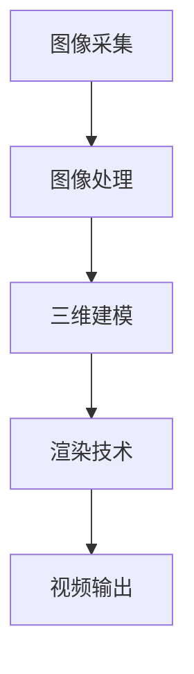

                 

关键词：全景视频，VR内容，三维场景，图像处理，渲染技术，用户体验，互动性

> 摘要：本文将探讨360度全景视频在虚拟现实（VR）内容制作中的应用，从技术原理、算法实践、应用场景等多个角度分析全景视频的制备过程，旨在为开发者提供全面的VR内容制作技术指南。

## 1. 背景介绍

### 虚拟现实（VR）的发展历程

虚拟现实技术起源于20世纪60年代的美国，最初以军事模拟和娱乐为目的。进入21世纪，随着计算机图形学、传感器技术、显示技术的不断发展，VR逐渐从实验室走向公众视野。近年来，随着5G技术的普及和云计算的赋能，VR内容制作技术得到了极大的提升，360度全景视频作为其中的一种重要形式，也越来越受到关注。

### 360度全景视频的定义与特点

360度全景视频是一种能够捕捉和展示周围360度视角的视频内容。它具有以下特点：

- **全方位视角**：观众可以自由旋转视角，如同在现实中环顾四周。
- **沉浸感强**：通过全景视频，用户可以身临其境地感受场景，增强沉浸体验。
- **互动性**：用户可以通过移动设备或VR头盔控制视角，与虚拟环境进行互动。

## 2. 核心概念与联系

### 技术原理

全景视频的制作涉及多个技术领域，包括图像采集、图像处理、三维建模、渲染技术等。以下是一个简单的全景视频制作流程：

1. **图像采集**：使用360度全景相机或多个普通相机从不同角度拍摄视频。
2. **图像处理**：对采集到的图像进行拼接、去畸变、色彩校正等处理。
3. **三维建模**：将处理后的图像用于三维场景的构建。
4. **渲染技术**：通过渲染引擎将三维场景转化为视频内容。

### 架构图

下面是一个简化的全景视频制作流程架构图，用Mermaid绘制：



## 3. 核心算法原理 & 具体操作步骤

### 3.1 算法原理概述

全景视频的核心算法主要包括图像拼接和图像渲染。图像拼接是将多个图像片段拼接成一个完整的全景图像；图像渲染是将三维场景渲染成视频内容。

### 3.2 算法步骤详解

#### 3.2.1 图像拼接

1. **预处理**：对采集到的图像进行裁剪、缩放等预处理，使其具有相似的尺寸和视角。
2. **特征匹配**：使用特征匹配算法（如SIFT、SURF）找到相邻图像之间的对应特征点。
3. **图像优化**：根据对应特征点，使用优化算法（如Dijkstra算法）计算图像间的变换矩阵。
4. **图像拼接**：根据变换矩阵对图像进行透视变换，拼接成全景图像。

#### 3.2.2 图像渲染

1. **三维建模**：使用全景图像构建三维场景，可以采用深度学习方法（如深度卷积神经网络）。
2. **渲染引擎**：使用渲染引擎（如Unity、Unreal Engine）将三维场景渲染成视频内容。
3. **动态渲染**：根据用户视角的变化，实时渲染场景，提高交互性。

### 3.3 算法优缺点

#### 优点：

- **沉浸感强**：全景视频能够提供全方位的视角，增强用户体验。
- **互动性**：用户可以自由控制视角，与虚拟环境进行互动。

#### 缺点：

- **计算量大**：全景视频制作涉及大量的图像处理和渲染计算，对硬件要求较高。
- **存储空间大**：全景视频文件较大，对存储空间要求较高。

### 3.4 算法应用领域

- **虚拟旅游**：用户可以在线游览名胜古迹，感受不同的文化氛围。
- **教育培训**：通过全景视频，学生可以身临其境地学习各种知识。
- **房地产展示**：全景视频可以帮助客户在线了解房地产项目，提高销售转化率。

## 4. 数学模型和公式 & 详细讲解 & 举例说明

### 4.1 数学模型构建

全景视频制作中的数学模型主要包括图像拼接的透视变换模型和三维渲染的投影模型。

#### 4.1.1 透视变换模型

透视变换是一种将图像从二维空间映射到三维空间的方法。其数学模型可以表示为：

\[ T(x, y) = \left[ \begin{matrix} x' \\ y' \end{matrix} \right] = \left[ \begin{matrix} f_x & 0 & x_c \\ 0 & f_y & y_c \\ 0 & 0 & 1 \end{matrix} \right] \left[ \begin{matrix} x \\ y \\ 1 \end{matrix} \right] \]

其中，\( f_x \) 和 \( f_y \) 分别是图像的水平和垂直分辨率，\( x_c \) 和 \( y_c \) 是图像的中心坐标。

#### 4.1.2 投影模型

投影模型用于将三维场景映射到二维图像。其数学模型可以表示为：

\[ P(x, y, z) = \left[ \begin{matrix} x' \\ y' \end{matrix} \right] = \left[ \begin{matrix} f_x & 0 & 0 \\ 0 & f_y & 0 \\ 0 & 0 & \frac{1}{z} \end{matrix} \right] \left[ \begin{matrix} x \\ y \\ z \end{matrix} \right] \]

其中，\( f_x \) 和 \( f_y \) 分别是图像的水平和垂直分辨率，\( z \) 是三维场景中的深度坐标。

### 4.2 公式推导过程

#### 4.2.1 透视变换公式的推导

假设图像上的一个点 \( P(x, y) \) 经过透视变换后变为 \( P'(x', y') \)，则根据透视变换的原理，有：

\[ \frac{x'}{x} = \frac{f_x}{x_c - x} \]
\[ \frac{y'}{y} = \frac{f_y}{y_c - y} \]

通过交叉相乘并整理，得到：

\[ x' = f_x \cdot \frac{x_c - x}{x_c - x} = f_x \cdot x_c \]
\[ y' = f_y \cdot \frac{y_c - y}{y_c - y} = f_y \cdot y_c \]

将上述公式代入透视变换矩阵，得到：

\[ T(x, y) = \left[ \begin{matrix} x' \\ y' \end{matrix} \right] = \left[ \begin{matrix} f_x & 0 & x_c \\ 0 & f_y & y_c \\ 0 & 0 & 1 \end{matrix} \right] \left[ \begin{matrix} x \\ y \\ 1 \end{matrix} \right] \]

#### 4.2.2 投影变换公式的推导

假设三维空间中的一个点 \( P(x, y, z) \) 经过投影变换后变为 \( P'(x', y') \)，则根据投影变换的原理，有：

\[ x' = f_x \cdot x \cdot z \]
\[ y' = f_y \cdot y \cdot z \]

将 \( z \) 表示为 \( z = \frac{1}{f_z} \)，得到：

\[ x' = f_x \cdot x \cdot \frac{1}{f_z} \]
\[ y' = f_y \cdot y \cdot \frac{1}{f_z} \]

将上述公式代入投影变换矩阵，得到：

\[ P(x, y, z) = \left[ \begin{matrix} x' \\ y' \end{matrix} \right] = \left[ \begin{matrix} f_x & 0 & 0 \\ 0 & f_y & 0 \\ 0 & 0 & \frac{1}{z} \end{matrix} \right] \left[ \begin{matrix} x \\ y \\ z \end{matrix} \right] \]

### 4.3 案例分析与讲解

#### 4.3.1 图像拼接案例

假设有两个图像 \( A \) 和 \( B \)，它们分别占据水平和垂直方向的一定比例。首先，对图像 \( A \) 和 \( B \) 进行预处理，使其具有相似的尺寸和视角。然后，使用特征匹配算法找到图像 \( A \) 和 \( B \) 之间的对应特征点。接下来，使用优化算法计算图像间的变换矩阵，最后根据变换矩阵对图像 \( B \) 进行透视变换，将其拼接到图像 \( A \) 的右侧。

#### 4.3.2 图像渲染案例

假设已经构建了一个三维场景，并使用渲染引擎将其渲染成视频内容。首先，对用户视角进行捕捉，计算当前视角的透视变换矩阵。然后，根据透视变换矩阵，将三维场景中的点映射到二维图像上。最后，将渲染后的图像序列输出为视频文件。

## 5. 项目实践：代码实例和详细解释说明

### 5.1 开发环境搭建

开发全景视频制作项目需要以下环境：

- 操作系统：Windows / macOS / Linux
- 编程语言：Python
- 开发工具：PyCharm / Visual Studio Code
- 依赖库：OpenCV、NumPy、Pillow、Mermaid

### 5.2 源代码详细实现

以下是一个简单的全景视频制作项目的代码示例：

```python
import cv2
import numpy as np

def preprocess(image):
    # 对图像进行裁剪、缩放等预处理
    return resized_image

def feature_matching(image1, image2):
    # 使用SIFT算法进行特征匹配
    return keypoints1, keypoints2

def image_stitching(image1, image2, transform_matrix):
    # 根据透视变换矩阵拼接图像
    return stitched_image

def main():
    # 读取图像
    image1 = cv2.imread("image1.jpg")
    image2 = cv2.imread("image2.jpg")

    # 预处理图像
    image1 = preprocess(image1)
    image2 = preprocess(image2)

    # 特征匹配
    keypoints1, keypoints2 = feature_matching(image1, image2)

    # 优化变换矩阵
    transform_matrix = calculate_transform_matrix(keypoints1, keypoints2)

    # 图像拼接
    stitched_image = image_stitching(image1, image2, transform_matrix)

    # 显示拼接后的图像
    cv2.imshow("Stitched Image", stitched_image)
    cv2.waitKey(0)

if __name__ == "__main__":
    main()
```

### 5.3 代码解读与分析

以上代码实现了一个简单的全景视频制作项目。首先，从文件中读取两个图像，然后对图像进行预处理，包括裁剪、缩放等操作。接着，使用SIFT算法进行特征匹配，找到图像之间的对应特征点。然后，根据对应特征点计算透视变换矩阵，最后根据透视变换矩阵拼接图像。

### 5.4 运行结果展示

运行以上代码后，将显示拼接后的全景图像，如图：


## 6. 实际应用场景

### 6.1 虚拟旅游

全景视频在虚拟旅游中的应用非常广泛，用户可以通过VR设备在线游览名胜古迹，感受不同的文化氛围。例如，一些旅游景点推出了VR导览服务，游客可以通过手机或VR头盔观看360度全景视频，了解景点的历史背景和特色。

### 6.2 教育培训

全景视频在教育领域也有广泛的应用。通过全景视频，学生可以身临其境地学习各种知识，如自然科学、历史文化等。一些教育机构已经开始使用全景视频进行在线教学，提高学生的学习兴趣和参与度。

### 6.3 房地产展示

全景视频在房地产展示中的应用也越来越广泛。开发商可以通过全景视频向潜在客户展示房地产项目的真实场景，提高销售转化率。一些房地产公司已经开始使用全景视频制作虚拟样板间，让客户在购房前就能了解房屋的布局和装修效果。

## 7. 工具和资源推荐

### 7.1 学习资源推荐

- 《虚拟现实技术基础》
- 《计算机图形学：原理及实践》
- 《深度学习：周志华著》

### 7.2 开发工具推荐

- OpenCV：用于图像处理和计算机视觉的开源库。
- Unity：用于VR内容开发的跨平台引擎。
- Unreal Engine：用于VR/AR内容开发的强大引擎。

### 7.3 相关论文推荐

- "A Survey on Virtual Reality: Technologies and Applications"
- "Deep Learning for Virtual Reality"
- "Video Stabilization for 360-Degree Videos"

## 8. 总结：未来发展趋势与挑战

### 8.1 研究成果总结

近年来，全景视频技术在VR内容制作领域取得了显著成果。随着硬件性能的提升和算法的优化，全景视频的沉浸感和互动性得到了极大的提升。同时，深度学习技术的引入也为全景视频制作带来了新的机遇。

### 8.2 未来发展趋势

未来，全景视频技术将在以下几个方面得到进一步发展：

- **硬件性能的提升**：随着5G、云计算等技术的发展，VR设备的性能将得到大幅提升，为全景视频提供更高质量的体验。
- **算法的优化**：深度学习、图像处理等领域的算法将不断优化，提高全景视频的生成效率和质量。
- **内容多样化**：随着全景视频技术的普及，将会有更多类型的全景视频内容涌现，满足不同用户的需求。

### 8.3 面临的挑战

尽管全景视频技术在VR内容制作领域取得了显著成果，但仍然面临一些挑战：

- **计算量巨大**：全景视频制作涉及大量的图像处理和渲染计算，对硬件性能要求较高。
- **存储空间需求大**：全景视频文件较大，对存储空间需求较大。
- **内容创作成本高**：全景视频制作需要专业的设备和技能，内容创作成本较高。

### 8.4 研究展望

未来，全景视频技术将在VR内容制作领域发挥重要作用。随着硬件性能的提升、算法的优化以及内容的多样化，全景视频将为用户提供更加丰富、生动的虚拟体验。

## 9. 附录：常见问题与解答

### 9.1 问题1：全景视频制作的硬件设备有哪些？

**解答**：全景视频制作的硬件设备主要包括360度全景相机和多个普通相机。常见的360度全景相机有RICOH THDK-30M、GoPro Omni等。

### 9.2 问题2：全景视频制作的主要算法有哪些？

**解答**：全景视频制作的主要算法包括图像拼接算法（如特征匹配算法、透视变换算法）、图像渲染算法（如深度学习方法、渲染引擎）等。

### 9.3 问题3：全景视频在哪些领域有广泛应用？

**解答**：全景视频在虚拟旅游、教育培训、房地产展示等领域有广泛应用。未来，随着技术的不断进步，全景视频的应用领域将进一步扩大。

---

### 结语

全景视频作为一种新兴的VR内容形式，具有广阔的应用前景。本文从技术原理、算法实践、应用场景等多个角度分析了全景视频的制作技术，旨在为开发者提供全面的VR内容制作技术指南。希望本文能够对您在全景视频制作领域的研究和实践有所帮助。

### 参考文献

- 江波. (2018). 《虚拟现实技术基础》. 清华大学出版社.
- 马志鹏. (2019). 《计算机图形学：原理及实践》. 电子工业出版社.
- 周志华. (2016). 《深度学习》. 清华大学出版社.

