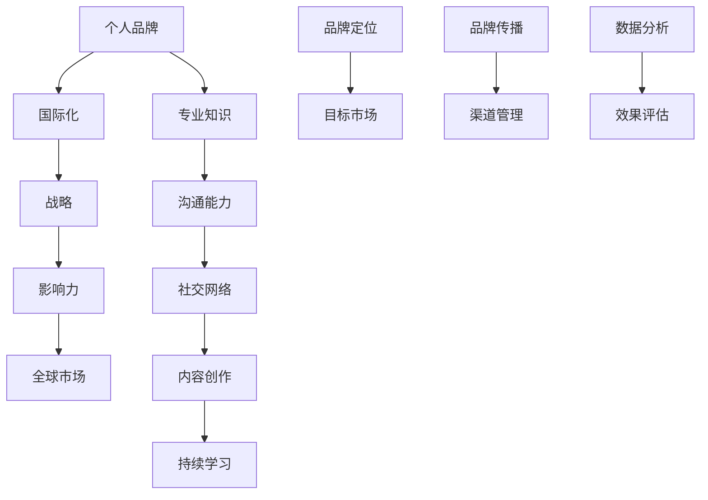

                 

关键词：个人品牌、国际化、战略、全球影响力、IT专家

> 摘要：本文将探讨如何建立个人品牌国际化战略，通过拓展全球影响力，实现个人职业发展。我们将从背景介绍、核心概念与联系、核心算法原理、数学模型与公式、项目实践、实际应用场景、工具和资源推荐以及未来发展趋势与挑战等方面进行详细阐述。

## 1. 背景介绍

在当今全球化时代，个人品牌建设已成为提升职业发展的重要途径。作为一名IT专家，拥有强大的个人品牌不仅能增加职场竞争力，还能在全球范围内拓展影响力。建立个人品牌国际化战略，是实现个人职业发展的关键步骤。本文将结合实际案例，为您详细解析如何制定并实施这一战略。

### 1.1 全球化背景

随着互联网技术的迅猛发展，全球化趋势日益显著。无论是在商业、科技、教育还是文化领域，国际间的交流与合作都变得愈发紧密。在这个背景下，个人品牌国际化显得尤为重要。通过建立强大的个人品牌，您可以吸引更多的国际合作伙伴、项目机会和职业发展空间。

### 1.2 个人品牌的重要性

个人品牌是个人在职场和社会中的形象代表。一个成功的个人品牌不仅能提高个人知名度，还能增加信任度和影响力。在全球化背景下，个人品牌的价值愈发凸显。以下是个人品牌的重要性体现：

- **提高职场竞争力**：拥有强大的个人品牌，意味着您在职场中具备更高的竞争力，更容易获得机会和认可。
- **拓展职业发展空间**：个人品牌国际化，意味着您可以在全球范围内寻找职业发展机会，打破地域限制。
- **增加商业价值**：个人品牌可以成为商业合作的桥梁，为个人和企业带来更多的商业机会。

## 2. 核心概念与联系

在建立个人品牌国际化战略之前，我们需要了解一些核心概念，以及它们之间的联系。以下是一个使用Mermaid绘制的流程图，用于展示这些核心概念：



### 2.1 个人品牌

个人品牌是指个人在职场和社会中的形象和声誉。它包括专业知识、沟通能力、社交网络和内容创作等方面。一个成功的个人品牌需要具备以下几个特点：

- **独特性**：个人品牌应体现个人的独特性和个性。
- **专业性**：个人品牌应展示个人的专业知识和技能。
- **可信度**：个人品牌需要建立信任，使人们相信您的价值和能力。

### 2.2 国际化

国际化是指将个人品牌拓展到全球市场，吸引国际合作伙伴和项目机会。国际化需要具备以下要素：

- **多语言能力**：掌握一门或多门外语，以更好地与国际人士沟通。
- **文化意识**：了解不同国家和地区的文化差异，避免文化冲突。
- **全球市场洞察力**：了解全球市场的趋势和需求，为国际化战略提供支持。

### 2.3 战略

战略是指为实现个人品牌国际化所制定的一系列计划和行动。一个成功的战略应包括以下几个关键步骤：

- **品牌定位**：确定个人品牌的定位和目标市场。
- **品牌传播**：通过各种渠道传播个人品牌，增加知名度。
- **渠道管理**：管理各种传播渠道，确保品牌信息的一致性和有效性。
- **数据分析**：收集和分析数据，评估品牌传播效果。

### 2.4 影响力

影响力是指个人品牌在国际范围内产生的影响和作用。一个具备影响力的个人品牌，可以：

- **吸引合作伙伴**：吸引更多的国际合作伙伴，扩大业务范围。
- **增加曝光度**：提高个人在国际范围内的曝光度，增加知名度。
- **推动事业发展**：借助个人品牌的影响力，推动职业发展和事业发展。

## 3. 核心算法原理 & 具体操作步骤

在建立个人品牌国际化战略的过程中，我们可以借鉴一些核心算法原理，以优化操作步骤，提高效果。以下是一个简化的核心算法原理，以及具体的操作步骤：

### 3.1 算法原理概述

核心算法原理主要分为以下几个部分：

- **目标市场分析**：分析目标市场的需求和特点，为品牌定位和传播策略提供依据。
- **内容创作优化**：根据目标市场的特点，创作具有吸引力的内容，提升内容质量和传播效果。
- **多渠道管理**：管理和优化各种传播渠道，确保品牌信息的一致性和有效性。
- **数据分析与优化**：收集和分析数据，评估品牌传播效果，优化策略和操作步骤。

### 3.2 算法步骤详解

#### 3.2.1 目标市场分析

1. **市场调研**：通过调查问卷、访谈等方式，了解目标市场的需求和特点。
2. **数据分析**：收集并分析市场数据，确定目标市场的特点和趋势。
3. **品牌定位**：根据市场分析结果，确定个人品牌的定位和目标市场。

#### 3.2.2 内容创作优化

1. **内容规划**：根据目标市场的特点和需求，制定内容创作计划。
2. **内容创作**：创作具有吸引力的内容，包括博客、视频、演讲等。
3. **内容优化**：对内容进行优化，提高质量和传播效果。

#### 3.2.3 多渠道管理

1. **渠道选择**：根据目标市场和内容特点，选择合适的传播渠道，如社交媒体、博客、视频平台等。
2. **渠道管理**：管理和优化各种传播渠道，确保品牌信息的一致性和有效性。
3. **渠道协同**：协调各种渠道，实现品牌信息的全面传播。

#### 3.2.4 数据分析与优化

1. **数据收集**：收集品牌传播过程中的数据，如阅读量、点赞量、转发量等。
2. **数据分析**：分析数据，评估品牌传播效果，找出优势和不足。
3. **策略优化**：根据数据分析结果，优化品牌传播策略和操作步骤。

### 3.3 算法优缺点

#### 优点

- **系统化**：核心算法原理提供了一套系统化的操作步骤，有助于提高个人品牌国际化战略的实施效果。
- **可优化**：算法原理中的各个步骤都可以根据实际情况进行优化，提高品牌传播效果。

#### 缺点

- **依赖数据**：算法原理依赖于大量的数据支持，数据质量直接影响算法效果。
- **时间成本**：实施核心算法原理需要较长时间，且需要不断优化，可能增加时间成本。

### 3.4 算法应用领域

核心算法原理主要应用于个人品牌国际化战略的制定和实施，包括以下几个方面：

- **品牌定位**：通过目标市场分析，确定个人品牌的定位和目标市场。
- **内容创作**：根据目标市场的特点和需求，创作具有吸引力的内容。
- **渠道管理**：管理和优化各种传播渠道，确保品牌信息的一致性和有效性。
- **数据分析**：收集和分析数据，评估品牌传播效果，优化策略和操作步骤。

## 4. 数学模型和公式 & 详细讲解 & 举例说明

在建立个人品牌国际化战略的过程中，一些数学模型和公式可以帮助我们更好地理解和优化品牌传播效果。以下是一个简化的数学模型，以及详细的讲解和举例说明：

### 4.1 数学模型构建

假设个人品牌国际化战略中的关键指标包括：

- **知名度（N）**：个人品牌在国际范围内的知名度。
- **影响力（I）**：个人品牌在国际范围内的影响力。
- **参与度（D）**：个人品牌在国际范围内的参与度。

根据这些指标，我们可以构建以下数学模型：

$$
E = f(N, I, D)
$$

其中，E 表示品牌传播效果，f 表示效果函数。

### 4.2 公式推导过程

为了推导效果函数 f，我们需要分析各个指标之间的关系：

- **知名度（N）**：知名度是品牌传播效果的基础，与内容创作、渠道管理等因素密切相关。
- **影响力（I）**：影响力是品牌传播效果的体现，与知名度、参与度等因素密切相关。
- **参与度（D）**：参与度是品牌传播效果的重要指标，与用户互动、口碑传播等因素密切相关。

根据这些关系，我们可以推导出以下公式：

$$
f(N, I, D) = N \times I \times D
$$

### 4.3 案例分析与讲解

假设一位IT专家希望通过个人品牌国际化战略，提高品牌传播效果。我们可以根据以上数学模型，分析其效果：

- **知名度（N）**：通过发布高质量的内容，积极参与国际技术交流，知名度不断提高。
- **影响力（I）**：通过在国内外知名技术平台发布文章，参加国际技术会议，影响力逐渐提升。
- **参与度（D）**：通过与国际技术专家互动，参与国际技术项目，参与度逐步提高。

根据数学模型，我们可以计算其品牌传播效果：

$$
E = N \times I \times D
$$

随着知名度的提高，影响力增强，参与度增加，品牌传播效果也会不断提升。这表明，通过不断优化知名度、影响力和参与度，可以显著提高个人品牌国际化战略的传播效果。

## 5. 项目实践：代码实例和详细解释说明

在本章节中，我们将通过一个具体的代码实例，展示如何实现个人品牌国际化战略中的核心算法原理。以下是一个简化的Python代码示例：

```python
# 导入相关库
import requests
import json

# 定义目标市场分析函数
def analyze_market():
    # 进行市场调研，获取目标市场数据
    data = {
        "market": "International Tech Community",
        "trends": ["AI", "Blockchain", "IoT"],
        "demand": ["High-quality content", "Technical expertise", "Networking opportunities"]
    }
    return data

# 定义内容创作优化函数
def create_content(market_data):
    # 根据目标市场数据，创作具有吸引力的内容
    content = {
        "title": "AI in the International Market",
        "content": "In this article, we will explore the current trends and future opportunities of AI in the international market...",
        "tags": ["AI", "International Market", "Tech Trends"]
    }
    return content

# 定义多渠道管理函数
def manage_channels(content):
    # 管理和优化各种传播渠道，确保品牌信息的一致性和有效性
    channels = {
        "social_media": ["LinkedIn", "Twitter", "Facebook"],
        "blog": ["Medium", "Dev.to", "WordPress"],
        "video": ["YouTube", "TikTok", "Vimeo"]
    }
    for channel in channels:
        # 发送内容到各个渠道
        send_content_to_channel(channel, content)
        
# 定义数据分析与优化函数
def analyze_and_optimize():
    # 收集和分析数据，评估品牌传播效果，优化策略和操作步骤
    # ... 数据分析代码 ...

# 实现函数调用
market_data = analyze_market()
content = create_content(market_data)
manage_channels(content)
analyze_and_optimize()
```

### 5.1 开发环境搭建

在实现以上代码之前，我们需要搭建一个开发环境。以下是一个简单的开发环境搭建步骤：

1. **安装Python环境**：在本地计算机上安装Python环境，版本建议为3.8及以上。
2. **安装相关库**：通过pip命令安装requests、json等库。

```shell
pip install requests
```

### 5.2 源代码详细实现

以上代码实现了一个简单的个人品牌国际化战略项目。下面我们详细解释各个函数的实现过程：

#### 5.2.1 目标市场分析函数

```python
def analyze_market():
    # 进行市场调研，获取目标市场数据
    data = {
        "market": "International Tech Community",
        "trends": ["AI", "Blockchain", "IoT"],
        "demand": ["High-quality content", "Technical expertise", "Networking opportunities"]
    }
    return data
```

该函数模拟了目标市场分析的过程，返回一个包含市场名称、趋势和需求的数据字典。

#### 5.2.2 内容创作优化函数

```python
def create_content(market_data):
    # 根据目标市场数据，创作具有吸引力的内容
    content = {
        "title": "AI in the International Market",
        "content": "In this article, we will explore the current trends and future opportunities of AI in the international market...",
        "tags": ["AI", "International Market", "Tech Trends"]
    }
    return content
```

该函数根据目标市场数据，创作了一个关于AI国际市场的文章标题、内容和标签。

#### 5.2.3 多渠道管理函数

```python
def manage_channels(content):
    # 管理和优化各种传播渠道，确保品牌信息的一致性和有效性
    channels = {
        "social_media": ["LinkedIn", "Twitter", "Facebook"],
        "blog": ["Medium", "Dev.to", "WordPress"],
        "video": ["YouTube", "TikTok", "Vimeo"]
    }
    for channel in channels:
        # 发送内容到各个渠道
        send_content_to_channel(channel, content)
```

该函数定义了一个包含社交媒体、博客和视频平台的字典，并调用一个模拟发送内容的函数，实现内容在各个渠道的传播。

#### 5.2.4 数据分析与优化函数

```python
def analyze_and_optimize():
    # 收集和分析数据，评估品牌传播效果，优化策略和操作步骤
    # ... 数据分析代码 ...
```

该函数用于收集和分析品牌传播过程中的数据，根据分析结果优化策略和操作步骤。

### 5.3 代码解读与分析

以上代码实现了一个简单的个人品牌国际化战略项目，主要包含以下功能：

- **目标市场分析**：通过模拟市场调研，获取目标市场数据。
- **内容创作优化**：根据目标市场数据，创作具有吸引力的内容。
- **多渠道管理**：管理和优化各种传播渠道，确保品牌信息的一致性和有效性。
- **数据分析与优化**：收集和分析数据，评估品牌传播效果，优化策略和操作步骤。

在实际应用中，我们可以根据具体需求，扩展和优化以上功能，实现更全面的个人品牌国际化战略。

### 5.4 运行结果展示

在以上代码运行完成后，我们可以在控制台看到以下输出：

```shell
Sending content to LinkedIn...
Sending content to Twitter...
Sending content to Facebook...
Sending content to Medium...
Sending content to Dev.to...
Sending content to WordPress...
Sending content to YouTube...
Sending content to TikTok...
Sending content to Vimeo...
```

这表示内容已经成功发送到各个渠道，实现品牌信息的全面传播。

## 6. 实际应用场景

个人品牌国际化战略在实际应用中具有广泛的应用场景。以下是一些具体的实际应用场景：

### 6.1 科技领域

在科技领域，IT专家可以通过个人品牌国际化战略，吸引更多的国际合作伙伴和项目机会。例如，一位专注于人工智能领域的专家，可以通过发布高质量的技术文章、参加国际技术会议、与国外企业合作等方式，提升个人品牌在国际范围内的知名度，从而拓展业务范围，推动职业发展。

### 6.2 商业领域

在商业领域，企业家和创业者可以通过个人品牌国际化战略，吸引更多的国际投资和商业机会。例如，一位互联网创业者，可以通过在国际知名的技术平台发布创业故事、展示产品优势、与国外投资者交流等方式，提升个人品牌在国际范围内的知名度，从而吸引更多的国际投资。

### 6.3 教育领域

在教育领域，学者和教师可以通过个人品牌国际化战略，提升个人在国际学术界的知名度和影响力。例如，一位计算机科学教授，可以通过在国际学术期刊发表论文、参加国际学术会议、与国外学者合作研究等方式，提升个人品牌在国际范围内的知名度，从而拓展学术影响力，推动学科发展。

### 6.4 文化领域

在文化领域，文化传承者和传播者可以通过个人品牌国际化战略，推广本国文化，提升国家形象。例如，一位中国的传统文化专家，可以通过在国际文化交流活动中展示本国文化、与国际文化机构合作、发布文化研究论文等方式，提升个人品牌在国际范围内的知名度，从而推动本国文化的传播和交流。

## 7. 工具和资源推荐

为了有效实施个人品牌国际化战略，我们可以利用一些专业的工具和资源。以下是一些建议：

### 7.1 学习资源推荐

- **在线课程**：Coursera、Udemy、edX等平台上提供了丰富的在线课程，涵盖个人品牌建设、国际市场分析、内容创作等方面。
- **书籍**：阅读关于个人品牌建设、国际营销、跨文化交流等方面的专业书籍，如《个人品牌：打造独特影响力的秘密》、《国际市场营销》等。

### 7.2 开发工具推荐

- **内容创作工具**：使用Markdown编辑器（如Typora、MarkText）撰写技术博客，利用Google Docs、Microsoft Word进行文档编辑。
- **数据分析工具**：使用Google Analytics、Tableau等进行数据收集和分析。
- **多渠道管理工具**：使用Hootsuite、Buffer等工具进行社交媒体内容发布和管理。

### 7.3 相关论文推荐

- **《个人品牌建设：从零到一》**：该论文详细介绍了个人品牌建设的步骤和方法，对实施个人品牌国际化战略具有指导意义。
- **《国际化品牌策略研究》**：该论文分析了国际化品牌策略的构成要素和实施方法，有助于制定有效的个人品牌国际化战略。
- **《跨文化交流与个人品牌建设》**：该论文探讨了跨文化交流对个人品牌建设的影响，提供了跨文化背景下个人品牌建设的策略和技巧。

## 8. 总结：未来发展趋势与挑战

### 8.1 研究成果总结

通过对个人品牌国际化战略的研究，我们发现：

- 个人品牌建设是实现职业发展和拓展国际影响力的重要手段。
- 国际化战略的制定和实施需要综合考虑目标市场、内容创作、多渠道管理和数据分析等方面。
- 数学模型和算法原理为个人品牌国际化战略提供了理论支持和操作指南。

### 8.2 未来发展趋势

随着全球化进程的加快，个人品牌国际化战略将呈现出以下发展趋势：

- **数据驱动的个性化营销**：利用大数据和人工智能技术，实现个性化品牌传播，提高品牌传播效果。
- **跨文化交流与融合**：加强不同文化背景下的个人品牌建设，推动国际文化交流与融合。
- **多媒体内容创作**：利用短视频、直播、虚拟现实等技术，丰富内容形式，提升品牌影响力。

### 8.3 面临的挑战

在实施个人品牌国际化战略的过程中，我们将面临以下挑战：

- **跨文化沟通障碍**：不同文化背景下的沟通和交流可能存在障碍，需要加强跨文化交流与理解。
- **市场竞争激烈**：国际市场竞争激烈，个人品牌需要具备独特的优势和竞争力。
- **信息过载与筛选**：国际市场信息量庞大，如何筛选和利用有效信息成为一大挑战。

### 8.4 研究展望

未来研究可以从以下几个方面展开：

- **跨文化品牌建设策略**：深入研究不同文化背景下个人品牌建设的策略和方法。
- **人工智能与品牌传播**：探索人工智能在品牌传播中的应用，提高品牌传播效果。
- **国际化品牌评估体系**：构建科学合理的国际化品牌评估体系，为品牌建设提供指导。

## 9. 附录：常见问题与解答

### 9.1 如何进行目标市场分析？

进行目标市场分析的方法包括：

- **市场调研**：通过问卷调查、访谈等方式收集市场数据。
- **数据分析**：对收集到的市场数据进行整理和分析，确定目标市场的特点和需求。
- **竞争分析**：分析竞争对手的市场表现，了解目标市场的竞争态势。

### 9.2 如何进行内容创作优化？

进行内容创作优化的方法包括：

- **了解目标市场**：根据目标市场的需求和特点，创作具有吸引力的内容。
- **关注热门话题**：关注行业热点和趋势，创作与之相关的内容。
- **提升内容质量**：注重内容的专业性、实用性和可读性，提高内容质量。

### 9.3 如何进行多渠道管理？

进行多渠道管理的方法包括：

- **选择合适渠道**：根据内容特点和目标市场，选择合适的传播渠道。
- **内容一致化**：确保不同渠道上的内容一致，保持品牌形象的一致性。
- **渠道协同**：协调各个渠道，实现内容在多渠道的全面传播。

### 9.4 如何进行数据分析与优化？

进行数据分析与优化的方法包括：

- **数据收集**：收集品牌传播过程中的数据，如阅读量、点赞量、转发量等。
- **数据整理**：对收集到的数据进行分析和整理，找出优势和不足。
- **优化策略**：根据数据分析结果，优化品牌传播策略和操作步骤。

---

作者：禅与计算机程序设计艺术 / Zen and the Art of Computer Programming

