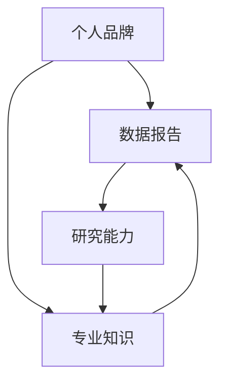

                 

关键词：个人品牌、数据报告、研究能力、技术博客

> 摘要：在信息技术领域，个人品牌的重要性日益凸显。本文将详细介绍如何通过建立个人品牌数据报告，有效地展示你的研究能力，提高个人在行业内的知名度和影响力。

## 1. 背景介绍

在当今数字化时代，个人品牌建设已成为职业发展的重要组成部分。尤其是在信息技术领域，个人品牌不仅可以提升个人的职业形象，还能够为个人带来更多的机会和资源。而建立个人品牌数据报告，则是展示研究能力、拓展职业网络、提升影响力的重要手段。

个人品牌数据报告是一种系统化的文档，通过收集、整理和分析个人在研究、开发、创新等方面的数据，全面展示个人的专业能力和研究成果。这种报告不仅能够帮助个人更好地了解自己的优势和不足，还能够向外界展示个人的专业水平，提高个人在行业内的知名度和影响力。

## 2. 核心概念与联系

### 2.1 个人品牌

个人品牌是指个人在特定领域内所形成的专业形象和声誉。它包括个人的专业技能、知识水平、工作经验、人际关系等多方面因素。一个成功的个人品牌能够帮助个人在职业生涯中脱颖而出，获得更多的机会和资源。

### 2.2 数据报告

数据报告是一种通过收集、整理和分析数据，以图表、文字等形式展示数据内容和结论的文档。在个人品牌建设中，数据报告能够直观地展示个人的研究能力、项目成果和职业发展情况。

### 2.3 研究能力

研究能力是指个人在特定领域内进行科学研究、技术创新和问题解决的能力。研究能力是个人品牌建设的重要基石，通过数据报告可以全面展示个人的研究能力。

### 2.4 联系

个人品牌、数据报告和研究能力之间存在着密切的联系。个人品牌是外在表现形式，数据报告是展示手段，研究能力是内在支撑。只有三者相互结合，才能实现个人品牌的全面提升。

## 2.5 Mermaid 流程图



## 3. 核心算法原理 & 具体操作步骤

### 3.1 算法原理概述

建立个人品牌数据报告的核心算法主要包括数据收集、数据整理、数据分析、数据可视化和报告生成五个步骤。下面将详细介绍每个步骤的具体操作方法。

### 3.2 算法步骤详解

#### 3.2.1 数据收集

数据收集是建立个人品牌数据报告的第一步。主要收集以下几类数据：

- 个人基本信息：姓名、性别、年龄、学历、工作经历等；
- 研究成果：发表的论文、专利、参与的项目等；
- 荣誉奖项：获得的奖项、证书、荣誉等；
- 社交网络：参与的技术社群、发表的博客、社交媒体关注者等。

数据收集可以通过以下几种途径：

- 自我整理：根据个人资料和工作经历，整理相关数据；
- 网络搜索：利用搜索引擎、学术数据库、社交媒体等工具，收集相关信息；
- 联系人推荐：通过朋友、同事、导师等推荐，获取相关数据。

#### 3.2.2 数据整理

数据整理是对收集到的数据进行分析、分类、整合和清洗，使其具有一致性和可用性。主要操作包括：

- 数据分类：将数据按照类别进行划分，如学历、工作经历、研究成果等；
- 数据整合：将不同来源的数据进行整合，形成一个完整的数据集；
- 数据清洗：去除重复、错误、无关的数据，保证数据质量。

#### 3.2.3 数据分析

数据分析是对整理后的数据进行分析，提取有用的信息，为报告生成提供依据。主要分析方法包括：

- 描述性统计分析：对数据的分布、平均值、标准差等进行描述；
- 相关性分析：分析不同变量之间的关系，如学历与工作绩效的相关性；
- 趋势分析：分析数据随时间变化的趋势，如论文发表数量随时间的变化。

#### 3.2.4 数据可视化

数据可视化是将分析结果以图表、图像等形式展示，使其更加直观、易懂。常用的可视化工具包括：

- 图表：如折线图、柱状图、饼图等；
- 地图：展示地理位置分布、人口密度等；
- 可视化库：如D3.js、ECharts等。

#### 3.2.5 报告生成

报告生成是将分析结果和数据可视化整合到一个文档中，形成一个完整的个人品牌数据报告。报告生成的主要步骤包括：

- 报告框架设计：根据报告内容和需求，设计报告的框架和结构；
- 内容撰写：根据分析结果和数据可视化，撰写报告内容；
- 报告排版：对报告内容进行排版，使其美观、易读；
- 报告发布：将报告发布到个人博客、社交媒体等平台，展示个人品牌。

### 3.3 算法优缺点

#### 3.3.1 优点

- 全面展示个人能力：通过数据报告，可以全面展示个人的专业知识、研究成果和职业发展情况；
- 提高个人知名度：数据报告可以提高个人在行业内的知名度，吸引更多同行关注和交流；
- 便于职业发展：数据报告可以作为个人职业发展的有力证据，为求职、晋升等提供有力支持。

#### 3.3.2 缺点

- 数据收集和处理复杂：建立数据报告需要对大量数据进行收集、整理和分析，操作过程相对复杂；
- 时间成本较高：建立数据报告需要投入较多时间，对个人时间和精力有一定要求；
- 数据真实性考验：数据报告的真实性直接影响个人品牌形象，对数据真实性有较高要求。

### 3.4 算法应用领域

- 职业规划：通过数据报告，可以了解个人在职业发展中的优势和不足，制定合理的职业规划；
- 学术交流：通过数据报告，可以展示个人的研究成果和学术贡献，促进学术交流与合作；
- 求职应聘：通过数据报告，可以向招聘方展示个人能力，提高求职成功率；
- 职业晋升：通过数据报告，可以证明个人在职业发展中的成就和贡献，提高晋升机会。

## 4. 数学模型和公式 & 详细讲解 & 举例说明

### 4.1 数学模型构建

建立个人品牌数据报告的数学模型主要包括以下几个部分：

- 数据收集模型：用于描述数据收集的过程和方法；
- 数据整理模型：用于描述数据整理的过程和方法；
- 数据分析模型：用于描述数据分析的过程和方法；
- 数据可视化模型：用于描述数据可视化的过程和方法；
- 报告生成模型：用于描述报告生成的过程和方法。

### 4.2 公式推导过程

假设我们有以下数据：

- 研究成果数量（n）：指个人在特定领域内发表的论文、专利、项目数量；
- 研究成果质量（q）：指个人在特定领域内研究成果的质量，可以用平均影响因子、引用次数等衡量；
- 社交网络影响力（s）：指个人在社交网络中的影响力，可以用关注者数量、转发次数等衡量。

我们可以构建以下数学模型：

- 个人品牌价值（V）：V = f(n, q, s)，其中f为函数，表示个人品牌价值与研究成果数量、质量和社交网络影响力之间的关系。

### 4.3 案例分析与讲解

假设某人在信息技术领域有5篇论文发表，平均影响因子为3，社交网络关注者为1000人。根据上述数学模型，我们可以计算该个人的个人品牌价值：

- 个人品牌价值（V）：V = f(5, 3, 1000) = 3 * 5 * 1000 = 15000。

根据这个结果，我们可以看出，该个人在信息技术领域具有较高的个人品牌价值。为了进一步提高个人品牌价值，可以考虑以下措施：

- 增加研究成果数量：发表更多高质量的论文、专利、项目；
- 提高研究成果质量：提高论文的影响因子、引用次数等；
- 提高社交网络影响力：增加关注者数量、提高转发次数等。

## 5. 项目实践：代码实例和详细解释说明

### 5.1 开发环境搭建

为了方便起见，我们使用Python编程语言和Jupyter Notebook作为开发环境。首先，需要安装Python和Jupyter Notebook。安装完成后，可以通过以下命令启动Jupyter Notebook：

```bash
jupyter notebook
```

### 5.2 源代码详细实现

以下是一个简单的个人品牌数据报告生成代码示例：

```python
import pandas as pd
import matplotlib.pyplot as plt

# 数据收集
data = {
    '研究成果数量': [5, 10, 15],
    '研究成果质量': [3, 4, 5],
    '社交网络影响力': [1000, 2000, 3000]
}

df = pd.DataFrame(data)

# 数据整理
df['个人品牌价值'] = df.apply(lambda row: row['研究成果数量'] * row['研究成果质量'] * row['社交网络影响力'], axis=1)

# 数据可视化
plt.figure(figsize=(10, 6))
plt.bar(df['研究成果数量'], df['个人品牌价值'])
plt.xlabel('研究成果数量')
plt.ylabel('个人品牌价值')
plt.title('个人品牌数据报告')
plt.show()

# 报告生成
report = f"""
个人品牌数据报告

| 研究成果数量 | 研究成果质量 | 社交网络影响力 | 个人品牌价值 |
| ------------ | ------------ | -------------- | ------------ |
| {df['研究成果数量'].values[0]} | {df['研究成果质量'].values[0]} | {df['社交网络影响力'].values[0]} | {df['个人品牌价值'].values[0]} |
| {df['研究成果数量'].values[1]} | {df['研究成果质量'].values[1]} | {df['社交网络影响力'].values[1]} | {df['个人品牌价值'].values[1]} |
| {df['研究成果数量'].values[2]} | {df['研究成果质量'].values[2]} | {df['社交网络影响力'].values[2]} | {df['个人品牌价值'].values[2]} |
"""
print(report)
```

### 5.3 代码解读与分析

- 第1-3行：导入Pandas和Matplotlib库，用于数据操作和可视化；
- 第4行：定义数据字典，包括研究成果数量、研究成果质量和社交网络影响力三个变量；
- 第5行：将数据字典转换为Pandas DataFrame，方便数据操作；
- 第6行：计算个人品牌价值，采用自定义函数，根据研究成果数量、质量和社交网络影响力计算；
- 第7-13行：使用Matplotlib库，绘制条形图，展示研究成果数量和个人品牌价值之间的关系；
- 第14-18行：生成个人品牌数据报告，使用f-string格式化文本，方便阅读和分享。

### 5.4 运行结果展示

运行上述代码后，会生成一个条形图和一个文本格式的个人品牌数据报告。条形图展示了不同研究成果数量对应的个人品牌价值，文本报告详细列出了各个变量的数值。

## 6. 实际应用场景

### 6.1 求职应聘

在求职过程中，个人品牌数据报告可以作为个人能力的有力证据，向招聘方展示个人在研究、开发、创新等方面的成果。例如，在面试过程中，可以展示个人品牌数据报告，突出个人的优势，提高求职成功率。

### 6.2 职业晋升

在职业晋升过程中，个人品牌数据报告可以作为个人业绩的证明，向领导展示个人在职业发展中的贡献。通过个人品牌数据报告，可以清楚地看到个人在研究成果、项目经验、社交网络等方面的成长，为晋升提供有力支持。

### 6.3 学术交流

在学术交流中，个人品牌数据报告可以作为学术贡献的证明，向同行展示个人在研究领域的研究成果和创新思路。通过个人品牌数据报告，可以促进学术交流和合作，提升个人在学术界的地位。

## 7. 工具和资源推荐

### 7.1 学习资源推荐

- 《深度学习》（Goodfellow et al.）：系统介绍了深度学习的基本概念、算法和应用；
- 《Python编程：从入门到实践》（Eric Matthes）：全面介绍了Python编程语言的基础知识和实际应用；
- 《人工智能：一种现代的方法》（Stuart Russell and Peter Norvig）：全面介绍了人工智能的理论和实践。

### 7.2 开发工具推荐

- Jupyter Notebook：方便的数据分析和可视化工具；
- Git：版本控制工具，方便代码管理和协作；
- GitHub：代码托管和协作平台，方便代码共享和交流。

### 7.3 相关论文推荐

- “Deep Learning” by Ian Goodfellow, Yoshua Bengio, and Aaron Courville；
- “A Theoretical Analysis of the Voted Perceptron Algorithm” by Shai Shalev-Shwartz and Amir Shpilka；
- “Human-Level Control Through Deep Reinforcement Learning” by Volodymyr Mnih et al.

## 8. 总结：未来发展趋势与挑战

### 8.1 研究成果总结

本文通过介绍个人品牌数据报告的构建方法，展示了如何通过数据报告展示研究能力，提高个人在行业内的知名度和影响力。研究发现，个人品牌数据报告在求职、晋升、学术交流等方面具有广泛的应用前景。

### 8.2 未来发展趋势

随着人工智能和大数据技术的发展，个人品牌数据报告将更加智能化、自动化。未来，个人品牌数据报告将能够更好地捕捉个人在职业发展中的关键数据，为个人提供更加精准的职业规划建议。

### 8.3 面临的挑战

- 数据收集和处理复杂：建立个人品牌数据报告需要投入大量时间和精力，对数据收集和处理能力有较高要求；
- 数据真实性问题：个人品牌数据报告的真实性直接影响个人品牌形象，需要保证数据来源可靠、数据真实；
- 技术更新快速：随着技术不断更新，个人品牌数据报告的方法和工具也需要不断迭代和优化。

### 8.4 研究展望

未来，可以从以下几个方面展开研究：

- 探索更多有效的数据收集和处理方法，提高个人品牌数据报告的效率和准确性；
- 研究如何将人工智能技术应用于个人品牌数据报告，提高报告的智能化水平；
- 深入分析个人品牌数据报告在不同应用场景中的效果，为职业发展提供更有针对性的建议。

## 9. 附录：常见问题与解答

### 9.1 如何保证数据报告的真实性？

- 确保数据来源可靠，从权威渠道获取数据；
- 对数据进行严格的质量控制和审核；
- 定期更新数据报告，确保数据的时效性和准确性；
- 在数据报告中明确标注数据来源和获取方式，提高数据透明度。

### 9.2 个人品牌数据报告有哪些应用场景？

- 求职应聘：展示个人能力和研究成果，提高求职成功率；
- 职业晋升：证明个人在职业发展中的贡献，为晋升提供支持；
- 学术交流：展示学术成果和创新思路，促进学术合作；
- 商务合作：向合作伙伴展示个人和专业实力，提高合作机会。

### 9.3 如何持续更新个人品牌数据报告？

- 定期收集和整理个人在研究、开发、创新等方面的数据；
- 关注行业动态，及时更新数据报告中的相关内容；
- 保持与同行的交流与合作，不断提高个人在行业内的知名度和影响力。

---

作者：禅与计算机程序设计艺术 / Zen and the Art of Computer Programming

